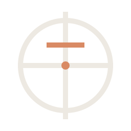
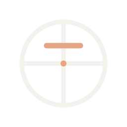

# Meridian Brand Assets

This directory contains all official Meridian brand visual assets including logos, marks, icons, and backgrounds.

## Files Overview

### Core Mark Assets
| File | Purpose | Size | Format |
|------|---------|------|--------|
| `meridian-mark.svg` | Primary brand mark | 256×256 | SVG |
| `meridian-mark-light.svg` | Light variant for dark backgrounds | 256×256 | SVG |
| `meridian-mark-monochrome.svg` | Single-color variant (uses `currentColor`) | 256×256 | SVG |
| `meridian-symbol.svg` | Simplified symbol for small sizes | 256×256 | SVG |

### Wordmark Assets
| File | Purpose | Format |
|------|---------|--------|
| `meridian-wordmark.svg` | Horizontal wordmark with descriptor | SVG |
| `meridian-wordmark-stacked.svg` | Vertical stacked layout for narrow spaces | SVG |

### Application Assets
| File | Purpose | Size | Format |
|------|---------|------|--------|
| `meridian-tile.svg` | App icon (primary) | 256×256 | SVG |
| `meridian-tile-256.png` | App icon (raster) | 256×256 | PNG |

### Background Assets
| File | Purpose | Resolution | Format |
|------|---------|-----------|--------|
| `meridian-hero.svg` | Hero background with data visualization | 1600×900 | SVG |

## Quick Start

### For Web
Use SVG assets directly:
```html

```

### For Dark Mode
Use the light variant:
```html

```

### For Print/Single-Color
Use the monochrome variant:
```html

```

### For Small Sizes
Use the simplified symbol for favicons and thumbnails:
```html
<link rel="icon" href="meridian-symbol.svg" type="image/svg+xml" />
```

## Design Specifications

### Colors
- **Primary Neutral**: `hsl(var(--foreground))`
- **Accent Cyan**: `var(--cyan-primary)`
- **Data Green**: `var(--state-healthy-fg)`
- **Dark Background**: `hsl(var(--background))`

### Typography
- **Display font**: Space Grotesk, with IBM Plex Sans fallback
- **UI font**: Inter, with IBM Plex Sans fallback
- **Monospace**: JetBrains Mono, with IBM Plex Mono fallback
- **Weight**: Bold (700) for headings, Regular (400) for body

### Minimum Sizes
- **Mark**: 48×48px for digital displays
- **Wordmark**: 120px width minimum
- **Hero**: 300px height minimum (mobile), 600px+ (desktop)

## Accessibility

All SVG assets include:
- Semantic HTML5 structure
- Descriptive `<title>` and `<desc>` elements
- High contrast ratios (WCAG AA compliant)
- `role="img"` attributes where appropriate

## Usage Guidelines

For detailed usage guidelines, color combinations, typography, and do's/don'ts, see [`BRAND_GUIDELINES.md`](../BRAND_GUIDELINES.md).

## Asset Optimization

All SVG files are:
- ✓ Optimized for web (minimal file size)
- ✓ Accessible (semantic markup)
- ✓ Responsive (scalable to any size)
- ✓ Future-proof (vector format)

## Version History

### v2.0 (2026-05-10)
- ✨ Enhanced color palette and vibrancy
- ✨ Improved stroke styling with rounded caps
- ✨ Added monochrome and light variants
- ✨ Added simplified symbol for small sizes
- ✨ Added stacked wordmark layout
- ✨ Refined proportions and spacing
- 📚 Added comprehensive brand guidelines

### v1.0 (Initial)
- Core mark, wordmark, tile, and hero assets

## Support

For questions about brand usage or asset modifications:
1. Review the full `BRAND_GUIDELINES.md`
2. Check that your usage follows the guidelines
3. Ensure proper contrast and sizing
4. Test in light and dark modes

---

**Last Updated**: 2026-05-10
**Status**: Active
**License**: Meridian proprietary branding
