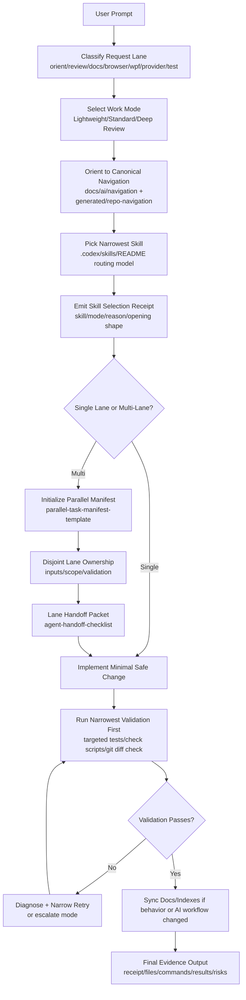
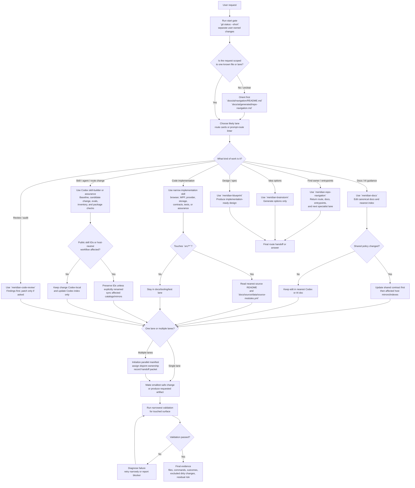

# Codex Prompt-to-Execution Trace (One Page)

**Status:** draft
**Owner:** core-team
**Reviewed:** 2026-06-19

## Purpose

Provide a compact, repeatable trace of how a user prompt becomes routed work, validated edits, and evidence-backed output in Meridian.

## Prompt-to-Execution Trace

## Current Workflow Decision Tree

Use this tree to decide the current Codex workflow for a Meridian task. The shared operating rules
come from `../assistant-workflow-contract.md`; Codex-specific gates come from `quickstart.md`,
`.codex/skills/_shared/codex-execution-contract.md`, and `prompt-route-rules.json`.

## Per-Prompt Execution Contract

1. Read request literally and restate acceptance criteria.
2. Route before broad search.
3. Use the narrowest applicable skill.
4. Emit the skill selection receipt: a four-field block with selected skill, mode, reason, and required opening shape.
5. Keep changes minimal and lane-bounded.
6. Validate narrowly first; expand only if risk justifies it.
7. If lane transitions occur, use explicit handoff packets.
8. If multi-lane work is required, create a manifest before implementation.
9. Always return evidence: receipt, changed files, exact commands, outcomes, residual risk.

## Refinement Opportunities

1. Deterministic lane classifier
- Implemented via `prompt-route-linter.py`; keep route rules compact and reuse the emitted JSON instead of repeating prompt classification in each host.

2. Skill trigger confidence scoring
- Add `confidence` and `fallback_skill` metadata to skill manifests.
- If confidence is below threshold, force `meridian-repo-navigation` before specialist routing.

3. Handoff packet auto-generation
- Implemented via `handoff-packet-generator.py`; keep packet inputs compact and prefer emitted artifacts over ad hoc natural-language handoffs.

4. Validation floor enforcement
- Implemented via `check-validation-floor.py`; keep route metadata aligned so lane-specific proof requirements remain machine-checkable.

5. Mode escalation policy as code
- Implemented via `check-mode-escalation.py`; keep escalation triggers explicit in route rules instead of re-deriving them per host.

6. Cross-host policy drift prevention
- Implemented via `check-ai-contract-drift.py` and `check-ai-routing-parity.py`; keep host docs and route semantics aligned through the shared validators.

7. Evidence quality scoring
- Add a post-run score for outputs: acceptance criteria coverage, validation completeness, risk specificity.
- Use it to improve final response quality and reviewability.

8. Generated artifact provenance tags
- Stamp generated AI docs/manifests with source inputs + command hash + timestamp.
- Makes regeneration and audit trails immediate.

## Current Baseline

The current Codex routing baseline already includes:

1. `prompt-route-linter.py` for lane, mode, telemetry, and validation-floor preflight.
2. `handoff-packet-generator.py` for compact route-aware handoff artifacts.
3. `check-validation-floor.py`, `check-mode-escalation.py`, and `check-ai-routing-parity.py` for route/validation guardrails.

Near-term follow-up should focus on higher-signal additions such as skill confidence metadata, evidence quality scoring, and generated-artifact provenance, not rebuilding the existing routing baseline.
