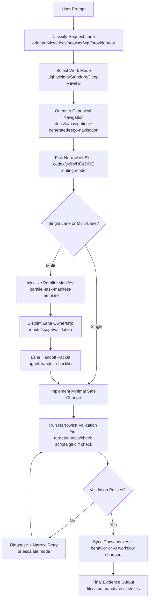

# Codex Prompt-to-Execution Trace (One Page)

**Status:** draft
**Owner:** core-team
**Last updated:** 2026-06-01

## Purpose

Provide a compact, repeatable trace of how a user prompt becomes routed work, validated edits, and evidence-backed output in Meridian.

## Prompt-to-Execution Trace

## Per-Prompt Execution Contract

1. Read request literally and restate acceptance criteria.
2. Route before broad search.
3. Use the narrowest applicable skill.
4. Keep changes minimal and lane-bounded.
5. Validate narrowly first; expand only if risk justifies it.
6. If lane transitions occur, use explicit handoff packets.
7. If multi-lane work is required, create a manifest before implementation.
8. Always return evidence: changed files, exact commands, outcomes, residual risk.

## Refinement Opportunities

1. Deterministic lane classifier
- Add a small `prompt-route-linter` script that maps prompt intent to lane + skill + minimum validation floor.
- Output a machine-readable preflight (JSON) for consistency across Codex/Claude/Copilot.

2. Skill trigger confidence scoring
- Add `confidence` and `fallback_skill` metadata to skill manifests.
- If confidence is below threshold, force `meridian-repo-navigation` before specialist routing.

3. Handoff packet auto-generation
- Generate handoff packets directly from changed files + executed commands + pass/fail outcomes.
- Reduce token cost and remove format drift between lanes.

4. Validation floor enforcement
- Introduce a lightweight guard script to prevent finalization when required validation for selected lane was skipped.
- Example: docs lane requires `git diff --check`; AI lane requires inventory/skills checks.

5. Mode escalation policy as code
- Encode escalation triggers (cross-lane edits, policy files touched, repeated validation failures) into a checker.
- Auto-suggest `Standard` or `Deep Review` before risky implementation.

6. Cross-host policy drift prevention
- Extend existing contract-drift checks to assert parity for skill-routing semantics, not only policy JSON.
- Catch host-specific routing divergence early.

7. Evidence quality scoring
- Add a post-run score for outputs: acceptance criteria coverage, validation completeness, risk specificity.
- Use it to improve final response quality and reviewability.

8. Generated artifact provenance tags
- Stamp generated AI docs/manifests with source inputs + command hash + timestamp.
- Makes regeneration and audit trails immediate.

## Suggested Minimal Pilot

1. Build `prompt-route-linter` with lane + validation-floor output.
2. Build `handoff-packet-generator` from git diff + command log.
3. Add one CI lane that fails on missing validation floor for AI/docs tasks.

These three changes improve routing consistency, delegation clarity, and evidence quality with low implementation risk.
