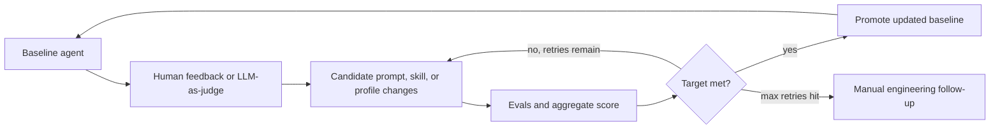

# Codex Self-Improving Agents

**Status:** active
**Owner:** core-team
**Reviewed:** 2026-06-09

Use this guide when a Codex task improves an agent profile, prompt, skill, eval rubric, or
agent-owned memory/retrieval workflow. It turns feedback into measured agent changes without
silently promoting unproven instructions.

## Improvement Loop

1. **Baseline agent:** Record the current profile, prompt, skill file, eval fixtures, and accepted
   baseline score before editing.
2. **Feedback:** Capture human review and/or LLM-as-judge feedback as explicit findings with
   evidence. Keep qualitative notes and numeric scores together.
3. **Candidate changes:** Apply the smallest prompt, profile, skill, script, or rubric change that
   addresses the feedback. Do not mix unrelated agent changes into the same candidate.
4. **Evals and score:** Run the relevant deterministic checks and eval harnesses. Compare the
   aggregate score to the target threshold and retry budget for that task. If no custom target is
   defined, use the owning skill's existing pass threshold.
5. **Promotion:** Promote the updated baseline only after the score passes, validation evidence is
   captured, and the affected Codex or agent indexes are updated. If the retry limit is reached,
   stop and report the manual follow-up needed.

## Meridian Ownership

| Need | Owner |
| --- | --- |
| Agent, prompt, skill, or rubric promotion | `meridian-implementation-assurance` |
| Documentation and AI index updates | `meridian-docs` |
| Persona or usability feedback | `meridian-simulated-user-panel` |
| Test coverage for changed behavior | `meridian-test-writer` |
| Regression and architecture review | `meridian-code-review` |

For Codex-owned changes, update `.codex/agents/*.toml`, `.codex/skills/*/SKILL.md`,
`agents/openai.yaml`, and `docs/ai/codex/README.md` only when those surfaces are affected. For
host-neutral workflows, also update `.agents/skills/` and the shared agent index.

## Required Evidence

Every self-improving agent change must leave a compact record with:

- baseline files and accepted score
- feedback source, judge rubric, or reviewer notes
- candidate diff scope and expected improvement
- eval commands, aggregate score, threshold, and retry count
- promoted baseline files or manual follow-up reason
- updated docs, catalogs, and rollback notes

## Graph And Retrieval Guardrails

When agent improvement introduces high-volume graph data, semantic memory, or retrieval agents, use
these guardrails before implementing storage or query behavior:

- **Temporal records:** Store source-backed facts with stable IDs, source identity, `valid_from`,
  optional `valid_to`, and status fields. Preserve history through non-destructive updates instead
  of overwriting prior facts.
- **Schema evolution:** Version graph schemas and entity types. Prefer explicit entities,
  relationships, and compatibility migrations over ad hoc prompt-only structures.
- **Partitioning and indexes:** Partition by high-cardinality, query-relevant fields such as time or
  entity ID when volume requires it. Index temporal fields and any approved vector columns used for
  semantic search.
- **Retention and pruning:** Define source-specific retention, archive, and relevance policies.
  Re-score relevance on a schedule, and compare pruned and original retrieval results in shadow mode
  before routing production agent behavior through reduced graphs.
- **Concurrency and backpressure:** Use staged queues, batch writes, cancellation, bounded retries,
  and rate limits for ingestion, extraction, invalidation, entity resolution, and traversal.
- **Token and cost controls:** Cache stable sub-prompts by content hash, prefer embeddings plus
  vector search for similarity work, and verify current provider pricing or service-tier behavior
  before documenting cost claims.
- **Retrieval agents:** Split controller and traversal-worker responsibilities when multi-hop graph
  queries need scale. Merge partial subgraphs with source citations, cache only with a validity-aware
  TTL, and fail closed when source-backed data is missing.

Do not add a graph store, vector database, or new hosted dependency only because an agent loop could
use one. Require a product or workflow need, a validation plan, and a retention/security review.
