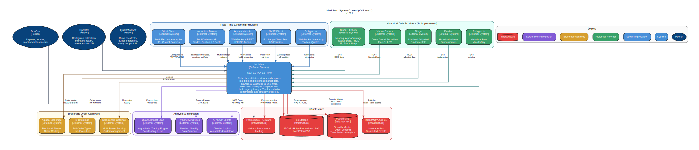
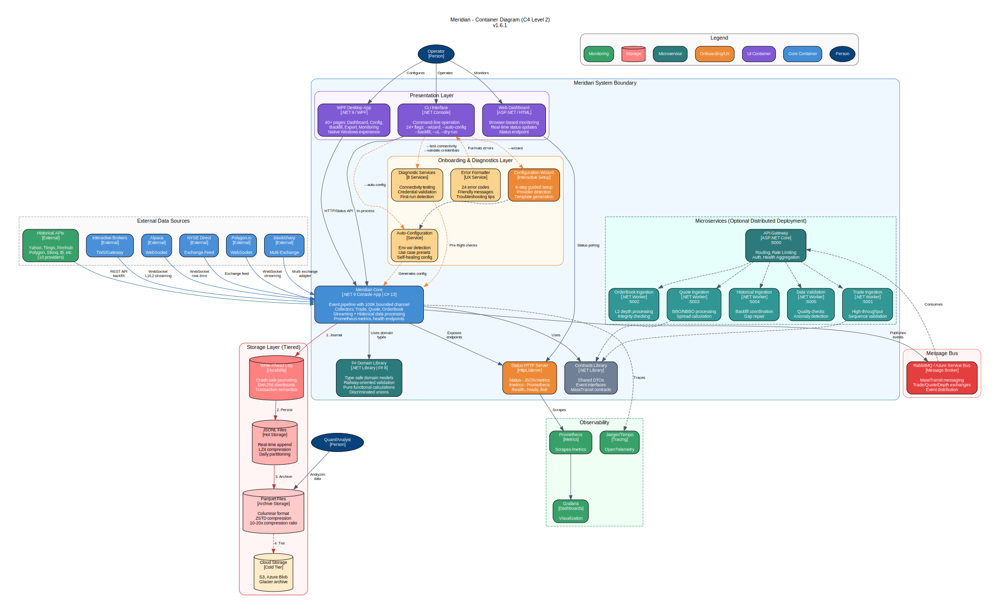
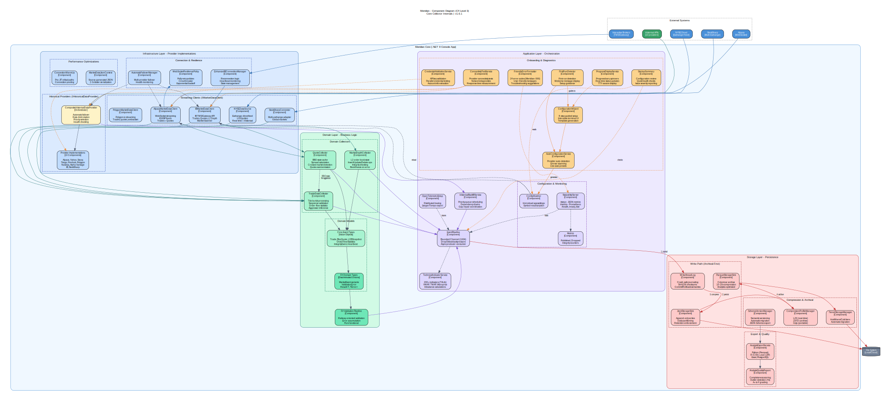
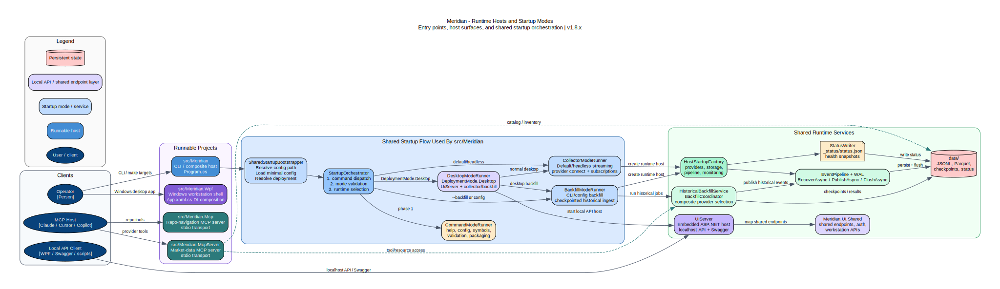
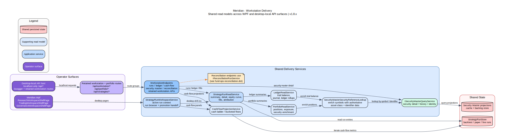
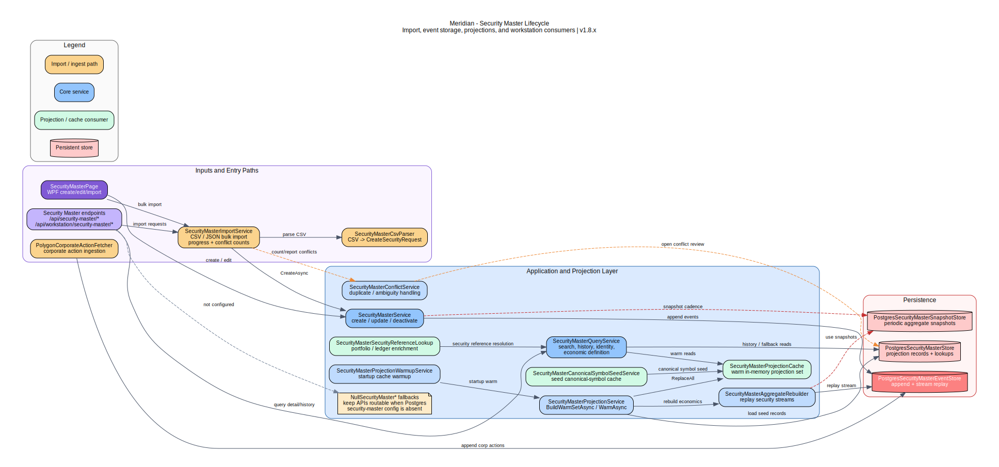
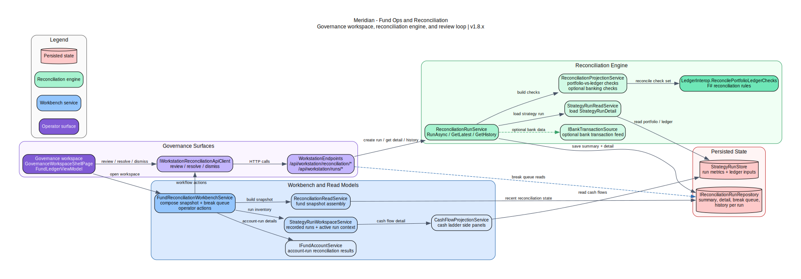

# C4 And System Diagrams

**Last Updated:** 2026-04-07

This page is the quickest way to review the current Meridian visual model. The editable source of truth remains the DOT files in [`docs/diagrams/`](../diagrams/README.md); this page curates the most useful rendered views for architecture work.

## Core C4 Views

### Level 1 — System Context

Shows Meridian in context with operators, desktop and web surfaces, external data providers, and storage/analytics edges.

### Level 2 — Containers

Shows the main deployable containers and major technology boundaries across presentation, application, provider, pipeline, storage, and observability concerns.

### Level 3 — Components

Shows the collector-runtime internals in more detail, including provider clients, domain collectors, pipeline, and storage sinks.

## Current Runtime And Product Views

These diagrams sit next to the C4 set and fill in the parts of the repo that are hardest to infer from the C4 views alone.

### Runtime Hosts And Startup Modes

Shows the runnable projects in the repo and the verified `SharedStartupBootstrapper` / `StartupOrchestrator` flow behind `src/Meridian`, including how web, desktop, collector, and backfill modes branch.

### Workstation Delivery

Shows how WPF pages and the React workstation shell converge on shared run, portfolio, ledger, cash-flow, and security-reference services.

### Security Master Lifecycle

Shows the current Security Master product path across import, event storage, projections, cache warmup, and workstation/query consumers.

### Fund Ops And Reconciliation

Shows the governance review loop across workstation services, reconciliation projections, the F# reconciliation engine, and persisted run/break state.

## Related Visual References

- [Diagrams Index](../diagrams/README.md)
- [Architecture Overview](overview.md)
- [Desktop Layers](desktop-layers.md)
- [Ledger Architecture](ledger-architecture.md)
- [Why This Architecture](why-this-architecture.md)
