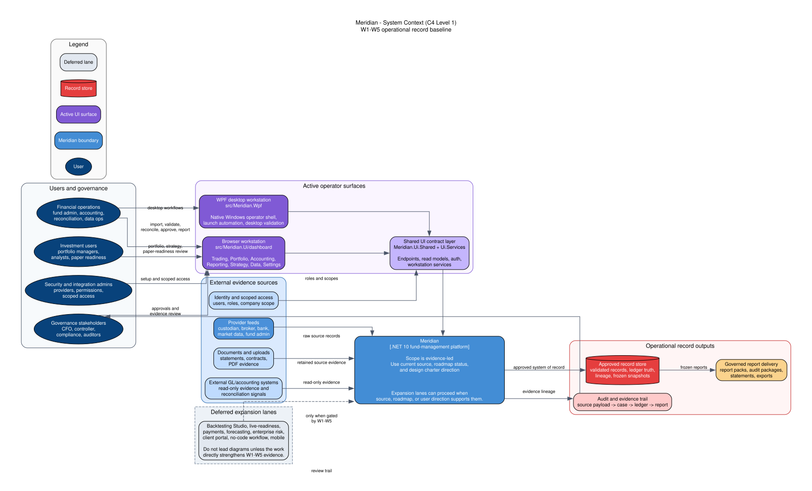
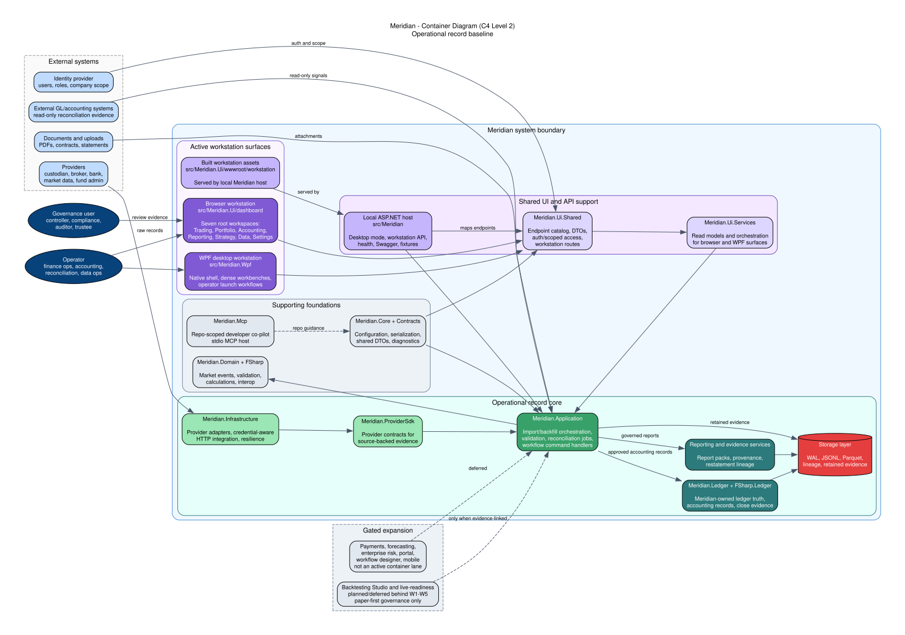
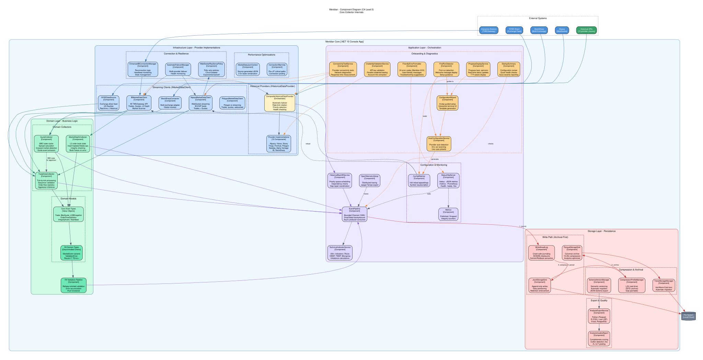
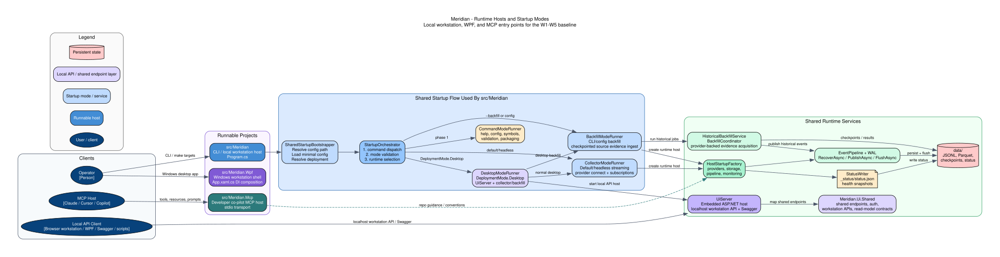
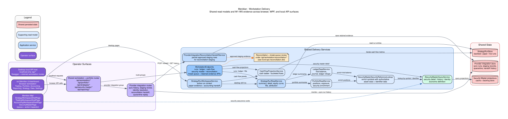
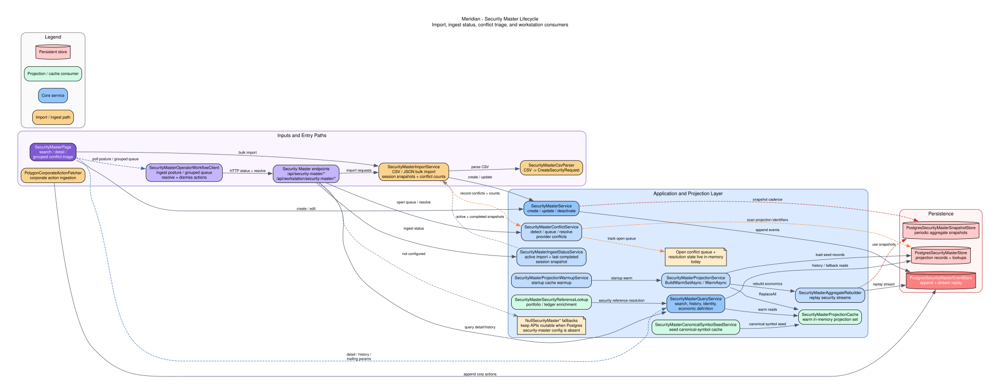
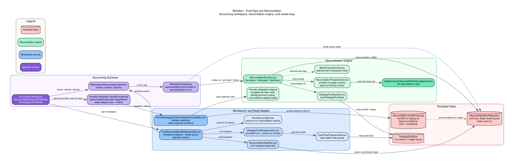

# C4 And System Diagrams

**Last Updated:** 2026-05-22

This page is the quickest way to review the current Meridian visual model. The editable source of truth is split between DOT files in [`docs/diagrams/`](../diagrams/README.md) and registered Mermaid sources in [`docs/architecture/diagrams/`](diagrams/); this page curates the most useful views for architecture work.

## Core C4 Views

### Level 1 — System Context

Shows Meridian in context with operators, the desktop shell, local API seams, external data providers, and storage/analytics edges.

### Level 2 — Containers

Shows the main deployable containers and major technology boundaries across presentation, application, provider, pipeline, storage, and observability concerns.

### Level 3 — Components

Shows the collector-runtime internals in more detail, including provider clients, domain collectors, pipeline, and storage sinks.

## Design-Document Mermaid Sources

These diagrams align the current design document with maintained architecture sources. They are registered in [`docs/source/data/diagram-index.yml`](../source/data/diagram-index.yml) so ownership, roadmap links, and update triggers stay explicit.

| Diagram | Source | Shows |
| --- | --- | --- |
| Operational Record System Context | [`meridian-operational-record-context.mmd`](diagrams/meridian-operational-record-context.mmd) | Meridian's W1-W5 system boundary, user groups, active browser/WPF surfaces, shared UI seams, external providers, accounting systems, documents, identity, and report delivery channels. |
| Operational Record Evidence Flow | [`meridian-operational-record-flow.mmd`](diagrams/meridian-operational-record-flow.mmd) | Source evidence through provider ingestion, normalization, validation, review gates, reconciliation, approvals, approved records, accounting evidence, report packs, and audit lineage. |
| Bounded Context Ownership Map | [`meridian-bounded-context-ownership.mmd`](diagrams/meridian-bounded-context-ownership.mmd) | The design document's ownership boundaries and cross-context flow rule: consume published APIs, views, or events rather than writing another context's owned records. |

## Current Runtime And Product Views

These diagrams sit next to the C4 set and fill in the parts of the repo that are hardest to infer from the C4 views alone.

### Runtime Hosts And Startup Modes

Shows the runnable projects in the repo and the verified `SharedStartupBootstrapper` / `StartupOrchestrator` flow behind `src/Meridian`, including how desktop, headless, and backfill paths branch.

### Workstation Delivery

Shows how WPF pages, Accounting review surfaces, and the desktop-local API seams converge on shared run, portfolio, ledger, cash-flow, reconciliation, and security-reference services.

### Security Master Lifecycle

Shows the current Security Master product path across import, ingest status, grouped conflict triage, event storage, projections, cache warmup, and workstation/query consumers.

### Fund Ops And Reconciliation

Shows the Accounting review loop across workstation services, reconciliation projections, the F# reconciliation engine, and persisted run/break state.

## Related Visual References

- [Diagrams Index](../diagrams/README.md)
- [Architecture Overview](overview.md)
- [Desktop Layers](desktop-layers.md)
- [Ledger Architecture](ledger-architecture.md)
- [Why This Architecture](why-this-architecture.md)
