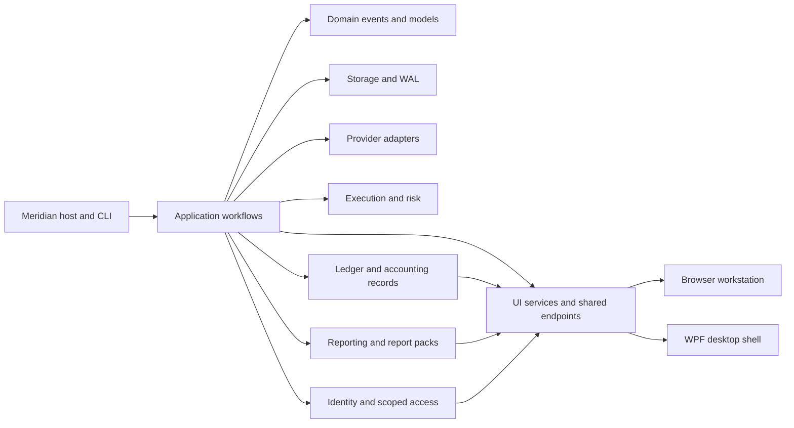

# Module Map

**Status:** Active
**Owner:** Core Team
**Reviewed:** 2026-06-09

This map gives maintainers a quick layer-oriented view of Meridian.

For complete product design document adaptation, use
[`design-document-adaptation.md`](design-document-adaptation.md). For the physical bounded-context
module structure, use [`design-module-conformance.md`](design-module-conformance.md). Together they
bridge design names such as `Meridian.FinancialOperations` to the current source projects listed
below.

## Runtime Flow

## Layer Responsibilities

| Layer | Projects | Rule |
| --- | --- | --- |
| Host | `src/Meridian` | Compose services, expose CLI/API modes, and host workstation endpoints |
| Application | `src/Meridian.Application` | Coordinate workflows; keep UI and provider specifics out |
| Domain/Core/Contracts | `src/Meridian.Domain`, `src/Meridian.Core`, `src/Meridian.Contracts` | Keep business and contract types UI-independent, including workstation, private-capital, reporting, and identity payloads consumed by multiple surfaces |
| Providers/Infrastructure | `src/Meridian.Infrastructure*`, `src/Meridian.ProviderSdk` | Isolate external API integration behind provider contracts |
| Storage | `src/Meridian.Storage` | Preserve WAL and atomic-write durability expectations |
| Execution/Risk | `src/Meridian.Execution*`, `src/Meridian.Risk` | Isolate broker gateways, paper/live controls, and pre-trade validation |
| Accounting and Ledger | `src/Meridian.Ledger`, `src/Meridian.FSharp.Ledger` | Own ledger behavior, private-capital fund-event reconstruction, capital-account subledger impact, treasury ledger metadata, and accounting-record boundaries |
| Reporting | `src/Meridian.Reporting` | Own governed report-pack behavior, report-writer grids, filters, formulas, lineage, publication, restatement, and report-generation semantics |
| Identity and Access | `src/Meridian.Identity` | Own sessions, role profiles, scoped access, fund/account traversal authorization, and company-scoped user account/profile state |
| Strategy/Backtesting | `src/Meridian.Strategies`, `src/Meridian.Backtesting*`, `src/Meridian.QuantScript` | Keep strategy lifecycle, replay, and scripting reusable outside UI |
| UI Shared | `src/Meridian.Ui.Services`, `src/Meridian.Ui.Shared` | Own workstation DTO projection and endpoint/read-model support for accounting configuration, private-capital drill-through, report packs, auth/session adapters, and shared browser/WPF workflows |
| UI Surfaces | `src/Meridian.Ui/dashboard`, `src/Meridian.Wpf` | Keep views thin; put state, labels, disabled reasons, and commands in view models |

## Boundary Checks

- Domain, core, storage, providers, execution, strategy, and backtesting projects
  must not depend on UI projects.
- Browser workstation logic should prefer view-model/read-model seams instead of
  hardcoding workflow state in React components.
- Browser workstation work and WPF desktop workstation work are two active co-equal operator UI lanes over shared contracts; WPF's current focus is web-UI parity (`W8-WPF-PARITY-001`).
- Browser surfaces and retained WPF compatibility should consume shared DTOs, services, and route definitions for accounting, reporting, private-capital, and identity workflows instead of duplicating business rules.
- Design tokens and shared UI patterns should come from the Meridian Design
  System or local shared dashboard primitives, not one-off screen styling.

## Operational Record Boundaries

The current product direction is the W1-W5 operational record baseline: data confidence, retained source evidence, reconciliation, approvals, accounting records, multi-asset operational coverage, and governed reports. Within that baseline:

- `src/Meridian.Contracts` declares shared workstation, ledger, private-capital, report-pack, report-writer, and identity-facing payloads and routes; `LedgerDimensionSetNormalizer` owns canonical shared ledger-dimension presence and legacy external-GL tag parsing for downstream adapters.
- `src/Meridian.Ledger` reconstructs posted private-capital fund-event ledger state, capital-account subledger impact, treasury context, and period/report handoff metadata.
- `src/Meridian.FinancialOperations` owns accounting-close, reconciliation, accounting-record, approval, casework, and close-workflow semantics that coordinate ledger evidence into operational records.
- `src/Meridian.Reporting` renders governed report packs and no-code report-writer grids with saved filters, formulas, filtered-input counts, and lineage.
- `src/Meridian.Ui.Shared` adapts those source-owned services into endpoint/read-model support for the browser workstation and WPF shell.
- External GL and provider systems remain evidence inputs where configured; Meridian-owned ledger records, retained evidence, approvals, and report outputs are the operational record surface.
- Storage journal records, UI projections, report-pack links, and workflow records are intentionally separate persistence or presentation surfaces. They may carry source-owned identifiers, evidence links, state labels, and DTO snapshots, but they must not redefine posting rules, trial-balance math, close-readiness gates, reconciliation classifications, or accounting approval semantics outside `src/Meridian.Ledger` and `src/Meridian.FinancialOperations`.
- New accounting-like models outside the ledger or Financial Operations owners must be projection-, persistence-, reporting-, or workflow-specific, named for that role, and covered by the `AccountingSemanticBoundaryTests` allowlist so reviewers can distinguish intentional boundary surfaces from duplicated accounting semantics.

## Fund Structure Service Refactor Boundaries (Staged Migration)

- `IFundStructureService` remains the caller-facing application contract for UI/API layers.
- Command handling and workflow orchestration stay in `InMemoryFundStructureService` so existing endpoint behavior and method contracts remain stable during migration.
- Persistence concerns are now isolated behind `IFundStructureStateStore` with adapters:
  - `JsonFileFundStructureStateStore` for durable local snapshots.
  - `InMemoryFundStructureStateStore` for test/dev ephemeral state.
- Validation/policy rules that do not require storage are owned by `IFundStructurePolicyService` (`FundStructurePolicyService`) so PostgreSQL-backed services can reuse identical domain checks.
- During PostgreSQL adoption, new persistence adapters should implement dedicated persistence ports and be injected into orchestration services rather than embedding storage calls inside domain rule paths.

### Method Category Map (Current Fund Structure Services)

- `IFundStructureService`
  - Creation commands: `CreateOrganizationAsync`, `CreateBusinessAsync`, `CreateClientAsync`, `CreateFundAsync`, `CreateSleeveAsync`, `CreateVehicleAsync`, `CreateLegalEntityAsync`, `CreateInvestmentPortfolioAsync`.
  - Ownership lifecycle commands: `LinkNodesAsync`, `UpdateOwnershipLinkAsync`, `ExpireOwnershipLinkAsync`, `ReplaceOwnershipLinkAsync`, `ValidateOwnershipGraphAsync`.
  - Assignment commands: `AssignNodeAsync`.
  - Query projection: `GetOrganizationStructureAsync`, `GetFundStructureGraphAsync`, `GetAdvisoryViewAsync`, `GetFundOperatingViewAsync`, `GetAccountingViewAsync`, `GetCashFlowViewAsync`.
- `InMemoryFundStructureService`
  - Command handling: implements the full `IFundStructureService` creation, ownership lifecycle, validation, and assignment surface.
  - Query projection: organization graph, legacy fund graph, advisory, fund operating, accounting, and cash-flow views.
  - Validation/policy: delegates pure portfolio-parent rules to `IFundStructurePolicyService`; owns existence checks, ownership-link lifecycle checks, and cycle validation.
  - Workflow orchestration: parent-link creation, ownership projection rebuilds after link lifecycle changes, shared-data synchronization, cross-service composition with account/security-master services.
  - Storage concerns: snapshot capture/load/save via `IFundStructureStateStore`, including updated, expired, and replacement ownership links.
- `PostgresFundStructureService`
  - Command handling: implements the same `IFundStructureService` creation, ownership lifecycle, validation, and assignment surface over `IFundStructureStore`.
  - Query projection: mirrors the in-memory graph, advisory, fund operating, and accounting projections; cash-flow view remains unsupported and returns `null`.
  - Validation/policy: reuses `FundStructurePolicyService` for pure rules and service-local ownership existence/cycle validation for persisted links.
  - Workflow orchestration: loads a mutable snapshot, applies lifecycle mutations, rebuilds ownership projections, and upserts changed rows through the store.
  - Storage concerns: persists organizations, businesses, clients, funds, sleeves, vehicles, entities, portfolios, ownership links, and assignments via `IFundStructureStore`.
- `InMemoryFundAccountService` (peer)
  - Command handling: account creation/update/deactivation and reconciliation write flows.
  - Query projection: account query/read methods and filtered projections.
  - Validation/policy: account status policy (`EnsureAllowed`) and request invariants.
  - Workflow orchestration: account lifecycle sequencing around reconciliation and synchronization state.
  - Storage concerns: snapshot capture/load/save and in-memory aggregate persistence.
