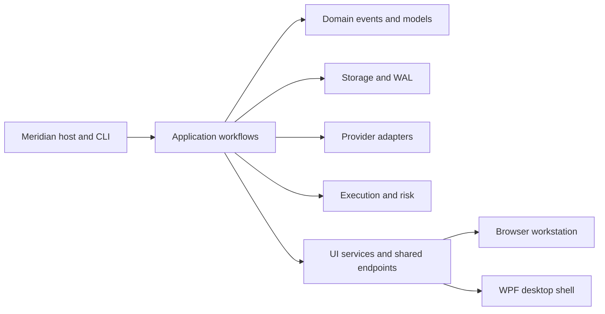

# Module Map

**Status:** Active
**Owner:** Core Team
**Reviewed:** 2026-05-18

This map gives maintainers a quick layer-oriented view of Meridian.

## Runtime Flow

## Layer Responsibilities

| Layer | Projects | Rule |
| --- | --- | --- |
| Host | `src/Meridian` | Compose services, expose CLI/API modes, and host workstation endpoints |
| Application | `src/Meridian.Application` | Coordinate workflows; keep UI and provider specifics out |
| Domain/Core/Contracts | `src/Meridian.Domain`, `src/Meridian.Core`, `src/Meridian.Contracts` | Keep business and contract types UI-independent |
| Providers/Infrastructure | `src/Meridian.Infrastructure*`, `src/Meridian.ProviderSdk` | Isolate external API integration behind provider contracts |
| Storage | `src/Meridian.Storage` | Preserve WAL and atomic-write durability expectations |
| Execution/Risk | `src/Meridian.Execution*`, `src/Meridian.Risk` | Isolate broker gateways, paper/live controls, and pre-trade validation |
| Strategy/Backtesting | `src/Meridian.Strategies`, `src/Meridian.Backtesting*`, `src/Meridian.QuantScript` | Keep strategy lifecycle, replay, and scripting reusable outside UI |
| UI Shared | `src/Meridian.Ui.Services`, `src/Meridian.Ui.Shared` | Own workstation DTO projection and endpoint/read-model support |
| UI Surfaces | `src/Meridian.Ui/dashboard`, `src/Meridian.Wpf` | Keep views thin; put state, labels, disabled reasons, and commands in view models |

## Boundary Checks

- Domain, core, storage, providers, execution, strategy, and backtesting projects
  must not depend on UI projects.
- Browser workstation logic should prefer view-model/read-model seams instead of
  hardcoding workflow state in React components.
- WPF is the active desktop shell; new desktop workflow lanes are expected and encouraged.
- Design tokens and shared UI patterns should come from the Meridian Design
  System or local shared dashboard primitives, not one-off screen styling.

## Fund Structure Service Refactor Boundaries (Staged Migration)

- `IFundStructureService` remains the caller-facing application contract for UI/API layers.
- Command handling and workflow orchestration stay in `InMemoryFundStructureService` so existing endpoint behavior and method contracts remain stable during migration.
- Persistence concerns are now isolated behind `IFundStructureStateStore` with adapters:
  - `JsonFileFundStructureStateStore` for durable local snapshots.
  - `InMemoryFundStructureStateStore` for test/dev ephemeral state.
- Validation/policy rules that do not require storage are owned by `IFundStructurePolicyService` (`FundStructurePolicyService`) so PostgreSQL-backed services can reuse identical domain checks.
- During PostgreSQL adoption, new persistence adapters should implement dedicated persistence ports and be injected into orchestration services rather than embedding storage calls inside domain rule paths.

### Method Category Map (Current Fund Structure Services)

- `IFundStructureService`
  - Creation commands: `CreateOrganizationAsync`, `CreateBusinessAsync`, `CreateClientAsync`, `CreateFundAsync`, `CreateSleeveAsync`, `CreateVehicleAsync`, `CreateLegalEntityAsync`, `CreateInvestmentPortfolioAsync`.
  - Ownership lifecycle commands: `LinkNodesAsync`, `UpdateOwnershipLinkAsync`, `ExpireOwnershipLinkAsync`, `ReplaceOwnershipLinkAsync`, `ValidateOwnershipGraphAsync`.
  - Assignment commands: `AssignNodeAsync`.
  - Query projection: `GetOrganizationStructureAsync`, `GetFundStructureGraphAsync`, `GetAdvisoryViewAsync`, `GetFundOperatingViewAsync`, `GetAccountingViewAsync`, `GetCashFlowViewAsync`.
- `InMemoryFundStructureService`
  - Command handling: implements the full `IFundStructureService` creation, ownership lifecycle, validation, and assignment surface.
  - Query projection: organization graph, legacy fund graph, advisory, fund operating, accounting, and cash-flow views.
  - Validation/policy: delegates pure portfolio-parent rules to `IFundStructurePolicyService`; owns existence checks, policy-backed ownership-link lifecycle checks for updates/replacements, and cycle validation.
  - Workflow orchestration: parent-link creation, ownership projection rebuilds after link lifecycle changes, shared-data synchronization, cross-service composition with account/security-master services.
  - Storage concerns: snapshot capture/load/save via `IFundStructureStateStore`, including updated, expired, and replacement ownership links.
- `PostgresFundStructureService`
  - Command handling: implements the same `IFundStructureService` creation, ownership lifecycle, validation, and assignment surface over `IFundStructureStore`.
  - Query projection: mirrors the in-memory graph, advisory, fund operating, and accounting projections; cash-flow view remains unsupported and returns `null`.
  - Validation/policy: reuses `FundStructurePolicyService` for pure rules and service-local ownership existence/cycle validation for persisted links, including update and replacement mutations before rows are upserted.
  - Workflow orchestration: loads a mutable snapshot, applies lifecycle mutations, rebuilds ownership projections, and upserts changed rows through the store.
  - Storage concerns: persists organizations, businesses, clients, funds, sleeves, vehicles, entities, portfolios, ownership links, and assignments via `IFundStructureStore`.
- `InMemoryFundAccountService` (peer)
  - Command handling: account creation/update/deactivation and reconciliation write flows.
  - Query projection: account query/read methods and filtered projections.
  - Validation/policy: account status policy (`EnsureAllowed`) and request invariants.
  - Workflow orchestration: account lifecycle sequencing around reconciliation and synchronization state.
  - Storage concerns: snapshot capture/load/save and in-memory aggregate persistence.
