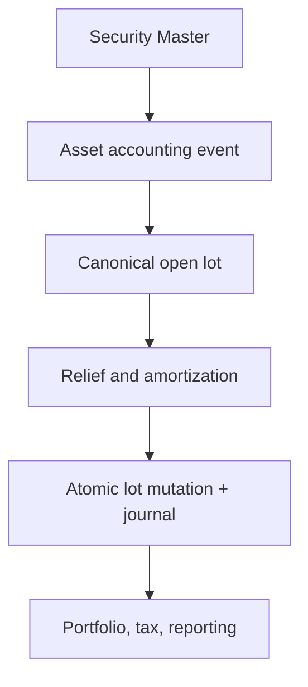

# Security-Identified Open-Lot Convergence Blueprint

**Roadmap:** `W10-LOT-002`  
**Depth:** full  
**Status:** proposed

> **Breaking change**
>
> The end state removes `Meridian.Execution.Sdk.TaxLot` as an authoritative model and makes
> `SecurityId` and decimal quantity mandatory. Execution selectors, Backtesting, Ledger,
> Reporting, and corporate-action consumers must move through adapters before the legacy type is
> deleted. Existing durable `LedgerTaxLotRecord` rows remain the migration anchor.

## 1. Scope

**In scope:** one open-lot contract for unit- and face-denominated instruments; acquisition
currency/FX; relief; premium/discount amortization; pool factors; and corporate-action continuity.

**Out of scope:** changing tax policy, replacing the immutable journal, adding a second position
store, or building the W10 tax operator screens. `W10-TAX-001` remains the UI and decision-support
owner.

**Current-state correction:** the gap is not only between `TaxLot` and `FaceValueLot`.
`LedgerTaxLotRecord` already provides decimal original/open quantity, currency, optional
`SecurityId`, `BookPositionId`, versioned relief, and atomic journal-plus-lot persistence. It is
the durable convergence anchor. The missing pieces are mandatory identity, explicit units-versus-
face semantics, acquisition FX, face-value acquisition terms, and one shared selector/amortization
contract across Execution and Ledger.

## 2. Architectural Overview



The ownership direction remains Security Master → Instruments/Asset Operations → Financial
Operations → Ledger/Storage. Security Master supplies identity and effective terms; it never owns
book-specific lots. Ledger/Storage owns the durable lot and its append-only mutation history.

### Decisions

- **Extend the durable ledger lot rather than create another store.** This preserves the atomic
  journal/lot transaction delivered by `W9-ASSET-010`.
- **Require `SecurityId`; retain symbols only as effective-dated display evidence.** Ticker changes
  cannot re-key a lot.
- **Use decimal quantity with an explicit `LotQuantityBasis`.** `Units` and `Face` may share
  relief mechanics without pretending their price conventions are identical.
- **Freeze acquisition FX facts.** Transaction currency, functional currency, and the
  transaction-to-functional rate are immutable acquisition evidence; later FX marks do not rewrite
  historical basis.
- **Represent economic changes as append-only lot mutations.** Corporate actions, factors,
  amortization, wash sales, returns of capital, and disposals never overwrite their proof trail.

## 3. Interface and Contract Design

Target shared contracts belong in `Meridian.Contracts.Accounting.Lots`:

```csharp
public enum LotQuantityBasis { Units, Face }

public sealed record OpenLotDto(
    Guid TaxLotRecordId,
    Guid SecurityId,
    Guid BookPositionId,
    Guid LedgerBookId,
    string LotId,
    DateOnly AcquiredDate,
    DateOnly HoldingPeriodStartDate,
    decimal OriginalQuantity,
    decimal OpenQuantity,
    LotQuantityBasis QuantityBasis,
    decimal AcquisitionUnitCost,
    string AcquisitionCurrency,
    string FunctionalCurrency,
    decimal AcquisitionFxRateToFunctional,
    decimal FunctionalCostBasis,
    long Version,
    FaceValueAcquisitionTermsDto? FaceValueTerms,
    IReadOnlyList<RetainedEvidenceIdentityDto> Evidence);

public sealed record FaceValueAcquisitionTermsDto(
    decimal ParBasis,
    decimal BookedFactor,
    BondAmortizationMethod AmortizationMethod,
    decimal? EffectiveYield);

public interface IOpenLotReliefService
{
    OpenLotReliefResult Select(
        IReadOnlyList<OpenLotDto> openLots,
        decimal quantityToRelieve,
        LedgerTaxLotReliefMethod method,
        IReadOnlyList<Guid>? specificLotIds = null);
}

public interface IOpenLotEconomicAdjustmentService
{
    IReadOnlyList<OpenLotMutationDraft> Project(
        OpenLotDto lot,
        IReadOnlyList<SecurityMasterEconomicChange> changes,
        DateOnly asOf);
}
```

`AcquisitionFxRateToFunctional` means functional-currency units per one acquisition-currency
unit and must be positive. `FunctionalCostBasis` is retained, not recomputed from a current rate.
`FaceValueTerms` is required only when `QuantityBasis == Face`; its cost convention is
`quantity × price-per-par-basis`.

### Durable additions

Additive ledger columns precede any cutover:

- `quantity_basis`, required after backfill;
- `acquisition_currency`, `functional_currency`, and
  `acquisition_fx_rate_to_functional`;
- `functional_cost_basis`;
- `par_basis`, `booked_factor`, `amortization_method`, and `effective_yield` for face lots.

`original_face`, `booked_factor`, and `par_basis` **landed** in
`V_ledger_033__tax_lot_face_terms.sql`, nullable and constrained all-three-or-none so a lot either
states its acquisition-time par conventions or states nothing; legacy rows are not backfilled with
synthetic defaults. `LedgerTaxLotFaceValueTerms` (`src/Meridian.Storage/Ledger/`) is the seam that
writes those terms from, and restates them back into, the canonical `FaceValueLot` aggregate, and
`AccountingPostingCandidateService` now derives factor-paydown held face from the lots of record
through it. `amortization_method` and `effective_yield` remain proposed.

`security_id` and `book_position_id` become non-null only after the legacy-row exception queue is
empty. Mutation rows retain before/after snapshots and the Security Master version used.

## 4. Component Design

### `OpenLotReliefService`

**Namespace:** `Meridian.Ledger.Lots`  
**Responsibilities:** decimal FIFO/LIFO/HIFO/SpecificId/AverageCost selection; partial relief;
stable tie-breaking by acquired date and lot id; no persistence or approval.

The current Ledger selector is the behavioral seed. Execution's long-based selectors become
adapters and then retire.

### `OpenLotAmortizationProjector`

**Namespace:** `Meridian.FinancialOperations.Lots`  
Consumes immutable acquisition terms plus effective Security Master coupon, day-count, maturity,
and factor evidence. It delegates existing `FaceValueLot` calculations during migration, emits a
typed amortization mutation draft, and posts the corresponding journal through the existing atomic
command. A calculation without retained Security Master version and source evidence fails closed.

### `OpenLotCorporateActionProjector`

**Namespace:** `Meridian.FinancialOperations.Lots`  
Projects split, reverse split, symbol change, exchange, merger, spin-off, return of capital,
factor/paydown, redemption, and advance-refunding mutations. A symbol change changes display
evidence only. Identity-changing events create successor lots linked to predecessor lot and
corporate-action IDs while allocating quantity, basis, holding period, acquisition FX, and
unamortized premium/discount under an approved allocation.

### `PostgresOpenLotStore`

This is an evolution of the existing ledger tax-lot store, not a parallel repository. It retains
optimistic versions and uses `AppendAtomicTaxLotJournalAsync` for acquisition, disposal,
amortization, factor, and corporate-action mutations.

## 5. Critical Data Flows

### Acquisition

1. Resolve `SecurityId`, book position, ledger book, period, quantity basis, currencies, and FX
   evidence.
2. Calculate transaction- and functional-currency basis.
3. Approve the posting candidate.
4. Atomically append the journal, open lot, mutation record, and evidence fingerprint.

### Disposal

1. Load authoritative open lots by ledger book, account, and `SecurityId`.
2. Apply approved policy using decimal quantities.
3. Validate expected lot versions and selection evidence.
4. Atomically post proceeds/basis/gain-loss and CAS each selected lot.

### Corporate action

1. Resolve the effective-dated action and all affected lots by `SecurityId`.
2. Project predecessor/successor mutations; do not use symbol as identity.
3. Require allocation totals to conserve quantity or face, functional basis, acquisition basis,
   holding period, and remaining premium/discount as applicable.
4. Approve and atomically append mutations and any journal.
5. Reconciliation proves predecessor closeout, successor opening, cash-in-lieu, and basis totals.

### Advance refunding acceptance scenario

The parent face lot produces unrefunded and pre-refunded successor lots under stable SecurityIds.
Both inherit acquisition date, holding period, currency/FX evidence, and allocated book basis. Only
the pre-refunded successor carries Schedule D tracking metadata; the allocation and journal commit
atomically and remain restatable from retained action evidence.

## 6. UI Design

No new standalone screen is introduced. `W10-TAX-001` consumes a shared open-lot read model in both
browser and WPF lanes. Every row shows Security Master identity, symbol-as-of, quantity basis,
transaction/functional basis, acquisition FX, relief method, amortization posture, latest corporate
action, evidence status, and version.

## 7. Test Plan

| Test | Required proof |
| --- | --- |
| `OpenLotReliefServiceTests` | Decimal partial FIFO/LIFO/HIFO/SpecificId/AverageCost relief |
| `OpenLotFxInvariantTests` | Functional basis uses immutable acquisition FX and round-trips |
| `OpenLotFaceValueTests` | Par basis, booked factor, and constant-yield amortization |
| `OpenLotCorporateActionTests` | Ticker change continuity; split/exchange/spin-off basis conservation |
| `AdvanceRefundingOpenLotScenarioTests` | Two successor lots, holding-period/basis conservation, Schedule D distinction |
| `AtomicOpenLotJournalStoreTests` | Journal and every lot mutation commit or roll back together |
| `LegacyTaxLotAdapterParityTests` | Long/unit legacy scenarios equal decimal canonical results |
| `OpenLotBackfillReconciliationTests` | Row counts, open quantity, transaction basis, and functional basis reconcile |

Property tests must prove conservation within currency precision. PostgreSQL tests must cover
concurrent relief, replay, correction, and cancellation.

## 8. Implementation Roadmap

1. **Contract foundation:** add shared quantity-basis, currency/FX, face-value, relief, and mutation
   contracts; add adapters from all three current models.
2. **One calculation kernel:** move selectors to decimal canonical inputs and make Execution and
   Ledger parity tests pass.
3. **Additive persistence:** add nullable columns and append-only mutation kinds; keep existing
   writers authoritative.
4. **Evidence-backed backfill:** resolve `SecurityId`/book position, classify units versus face,
   and populate FX only from retained acquisition evidence. Unresolved rows enter a governed queue.
5. **Shadow operation:** dual-project legacy and canonical results; block cutover on quantity,
   basis, relief, amortization, or corporate-action differences.
6. **Atomic write cutover:** make the extended ledger lot authoritative; switch Execution,
   Backtesting, Reporting, and corporate-action consumers.
7. **Contract retirement:** remove symbol/long `TaxLot` and calculation ownership from
   `FaceValueLot` only after compatibility telemetry is zero for one release.

## 9. Open Questions and Risks

| Question | Owner | Blocking decision |
| --- | --- | --- |
| Which retained source establishes acquisition FX for legacy rows? | Accounting | Backfill and non-null FX cutover |
| Are short lots represented by signed quantity or a separate direction? | Ledger/Execution | Final contract validation |
| Which rule pack owns successor-basis allocation by action type? | Accounting policy | Corporate-action posting |

| Risk | Mitigation |
| --- | --- |
| Synthetic FX creates false realized P&L | Fail closed; no rate inferred from current marks |
| Dual writes diverge | One canonical fingerprint and shadow reconciliation before cutover |
| Corporate actions double-adjust basis | Idempotency by action, lot, effective date, and version |
| Face and unit price conventions mix | Required quantity basis and conditional face-value terms |
| Historical symbols re-key lots | Mandatory `SecurityId`; symbol is display evidence only |

## Acceptance Gate

The roadmap item may close only when all production open-lot writes use mandatory `SecurityId`,
decimal quantity, explicit quantity basis, acquisition currency/FX, and atomic mutation/journal
storage; every current consumer has parity evidence; the legacy exception queue is zero or governed;
and the advance-refunding scenario reconciles from source evidence through report output.


## Implementation receipt - 2026-09-04

Contract and persistence foundation in progress: shared decimal `OpenLotDto` and acquisition facts, canonical relief selection, Execution/Backtesting parity adapters, an additive nullable `acquisition_terms` column, immutable acquisition guards, and ledger-to-canonical face/unit projection. Missing identity, FX, or subject-bound acquisition evidence is refused. Legacy null fields remain absent in fingerprints; populated evidence participates in atomic replay identity.

No writer cutover is claimed. Remaining phases include a governed legacy exception/backfill workflow; currency-precision and selector/amortization parity across production consumers; append-only corporate-action successor and adjustment posting; the advance-refunding/reporting acceptance scenario; and shadow-operation evidence before retiring legacy contracts. Changed basis without a governed adjustment projection currently blocks canonical projection. Short positions require the explicit direction decision in section 9.
