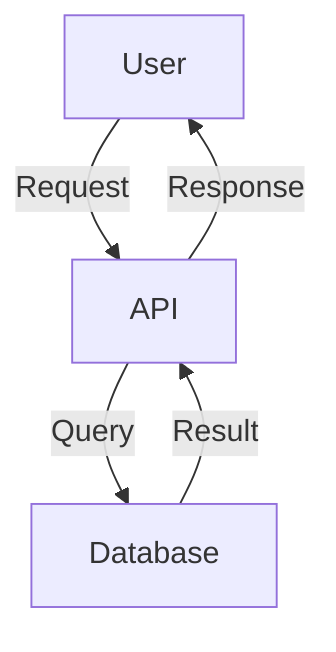

# Documentation Contribution Guide

**Version:** 1.1  
**Last Updated:** 2026-03-15  
**Status:** Active, Continuously Updated

This guide provides standards and best practices for creating, organizing, and maintaining documentation in the Meridian project.

---

## Table of Contents

- [Documentation Principles](#documentation-principles)
- [Documentation Structure](#documentation-structure)
- [Where Should This Doc Go?](#where-should-this-doc-go)
- [Lifecycle Tags](#lifecycle-tags)
- [Writing Standards](#writing-standards)
- [File Naming Conventions](#file-naming-conventions)
- [Cross-References and Links](#cross-references-and-links)
- [Code Examples](#code-examples)
- [Diagrams and Visuals](#diagrams-and-visuals)
- [Updating Documentation](#updating-documentation)
- [Review Process](#review-process)

---

## Documentation Principles

### 1. Audience-First Organization

Documentation should be organized by **who** will use it, not by internal structure:

- **Users** need to get started quickly and accomplish tasks
- **Developers** need to understand architecture and extend the system
- **Operators** need to deploy, monitor, and maintain the system

See [docs/README.md](../README.md) for the master index organized by audience.

### 2. Consistency Over Perfection

Better to have consistent, maintainable documentation than perfect but divergent documentation. Follow existing patterns in similar documents.

### 3. Keep It Updated

Documentation debt is real. When making code changes:
- Update related documentation in the same PR
- Mark deprecated information clearly
- Archive outdated documents rather than deleting them
- Use `docs/archived/` as the single home for historical records (do not create parallel `docs/archive/` locations)

### 4. Make It Findable

- Link from the master index ([docs/README.md](../README.md))
- Use clear, descriptive titles
- Include cross-references to related documents
- Tag with appropriate keywords

---

## Documentation Structure

### Directory Organization

The `docs/` tree is organized into three zones by audience and purpose:

```
docs/
│
│  ── PRODUCT ZONE (users and operators) ────────────────────────────
├── getting-started/           # Quick start guides for new users
├── providers/                 # Provider-specific setup guides
├── operations/                # Deployment and maintenance
│
│  ── ENGINEERING ZONE (developers and architects) ──────────────────
├── architecture/              # System design and design rationale
├── adr/                       # Architecture Decision Records
├── development/               # Developer guides and patterns
├── integrations/              # Integration guides (Lean, F#)
├── reference/                 # API docs, data dictionary
├── diagrams/                  # All visual assets
│   └── uml/                   # UML diagrams (PlantUML sources + PNGs)
│
│  ── GOVERNANCE ZONE (status, reviews, security) ────────────────────
├── status/                    # Project status, roadmap, TODO
├── evaluations/               # Technology and architecture evaluations
├── audits/                    # Code quality audits
├── security/                  # Security documentation
│
│  ── META / TOOLING ─────────────────────────────────────────────────
├── ai/                        # AI assistant instructions
├── generated/                 # Auto-generated documentation (do not edit)
├── archived/                  # Historical documents (see INDEX.md)
├── docfx/                     # DocFX API docs config
└── README.md                  # Master documentation index (START HERE)
```

### Document Categories

| Category | Purpose | Examples |
|----------|---------|----------|
| **Guides** | Step-by-step instructions | Getting Started, Provider Setup |
| **References** | Lookup information | API Reference, Data Dictionary |
| **Explanations** | Conceptual understanding | Architecture Overview, Design Decisions |
| **How-To** | Task-focused procedures | Adding a Provider, Running Backfill |

---

## Where Should This Doc Go?

Use this decision tree when you're unsure where a new document belongs.

```
Is it a step-by-step guide for end users or operators?
├── Yes → Is it about a data provider?
│   ├── Yes → docs/providers/
│   └── No, it's about deploying or maintaining the system → docs/operations/
│              Or it's about getting started → docs/getting-started/
└── No →
    Is it an architecture narrative, design rationale, or ADR?
    ├── Architecture overview or layer rules → docs/architecture/
    ├── Numbered decision record → docs/adr/
    └── No →
        Is it a developer guide (build, test, CI, extend)?
        ├── Yes → docs/development/
        └── No →
            Is it a lookup reference (API, data dict, env vars)?
            ├── Yes → docs/reference/
            └── No →
                Is it an integration guide (Lean, F#)?
                ├── Yes → docs/integrations/
                └── No →
                    Is it about project status, roadmap, or active tracking?
                    ├── Yes → docs/status/
                    └── No →
                        Is it an evaluation, brainstorm, or improvement proposal?
                        ├── Yes → docs/evaluations/
                        └── No →
                            Is it a targeted code-quality or hygiene audit?
                            ├── Yes → docs/audits/
                            └── No →
                                Is it superseded or historical? → docs/archived/
```

### Quick Lookup

| If the doc is about… | Put it in… |
|----------------------|------------|
| Getting started for users | `getting-started/` |
| Provider setup / credentials | `providers/` |
| Deployment, operations, runbooks | `operations/` |
| System design, why architecture decisions were made | `architecture/` |
| A numbered architectural decision | `adr/` |
| Developer how-to, build tooling, CI, testing | `development/` |
| API endpoints, data fields, env variables | `reference/` |
| Integration with Lean, F# domain models | `integrations/` |
| Project roadmap, changelog, TODO, feature inventory | `status/` |
| Technology evaluation, brainstorm, improvement proposal | `evaluations/` |
| Code quality audit, cleanup analysis | `audits/` |
| Security vulnerabilities, known issues | `security/` |
| AI assistant guides and known errors | `ai/` |
| Auto-generated output (do not edit) | `generated/` |
| Outdated / superseded content | `archived/` (single canonical archive location) |
| Diagrams (DOT/Graphviz) | `diagrams/` |
| UML diagrams (PlantUML) | `diagrams/uml/` |

---

## Lifecycle Tags

Every document should include lifecycle metadata to help identify stale content and ownership.

### Required Fields

Add these fields in the front matter section at the top of new documents:

```markdown
**Status:** active | draft | deprecated | archived  
**Owner:** core-team | <team-alias>  
**Reviewed:** YYYY-MM-DD
```

### Status Values

| Status | Meaning |
|--------|---------|
| `active` | Current and maintained |
| `draft` | Work in progress, may be incomplete |
| `deprecated` | Superseded — follow links to replacement |
| `archived` | Historical record, no longer maintained |

### Review Cadence Guidelines

| Folder | Suggested Review Cadence |
|--------|-------------------------|
| `getting-started/`, `providers/`, `operations/` | Every release or when behavior changes |
| `architecture/`, `adr/` | Quarterly or when architectural decisions are revised |
| `development/` | As tooling and conventions evolve |
| `reference/` | When APIs or configuration options change |
| `status/` | Weekly (roadmap) or per-release (changelog) |
| `evaluations/`, `audits/` | When superseded by new analysis |

### Stale Detection

Documents older than **180 days** without a `Reviewed` update are considered candidates for review. The CI documentation workflow checks for stale metadata (see `.github/workflows/documentation.yml`).

---

## Writing Standards

### Markdown Format

All documentation uses **GitHub Flavored Markdown** (GFM).

#### Front Matter (Recommended)

```markdown
# Document Title

**Version:** 1.0  
**Last Updated:** 2026-03-15  
**Status:** active | draft | deprecated | archived  
**Owner:** core-team | <team-alias>  
**Reviewed:** YYYY-MM-DD  
**Audience:** Users | Developers | Operators

Brief summary of what this document covers.
```

See [Lifecycle Tags](#lifecycle-tags) for the full standard and valid values.

#### Headings

- Use ATX-style headings (`#`, `##`, `###`)
- Maximum heading depth: 4 levels (`####`)
- One H1 (`#`) per document
- Maintain logical hierarchy (don't skip levels)

```markdown
# Title (H1)
## Major Section (H2)
### Subsection (H3)
#### Detail (H4)
```

#### Lists

- Use `-` for unordered lists (not `*` or `+`)
- Use `1.` for ordered lists (auto-numbering)
- Indent nested lists by 2 spaces

```markdown
- Top level item
  - Nested item
    - Deeply nested item

1. First step
2. Second step
3. Third step
```

#### Code Blocks

Always specify language for syntax highlighting:

````markdown
```bash
dotnet build
```

```csharp
public class Example
{
    // Code here
}
```
````

#### Tables

Use pipe tables with consistent column width:

```markdown
| Column 1 | Column 2 | Column 3 |
|----------|----------|----------|
| Value A  | Value B  | Value C  |
| Value D  | Value E  | Value F  |
```

#### Emphasis

- **Bold** for emphasis (`**bold**`)
- *Italic* for terminology (`*italic*`)
- `Code` for inline code, paths, commands (`` `code` ``)

### Writing Style

#### Clarity and Conciseness

- Write in clear, simple language
- Use short sentences (15-20 words ideal)
- Use active voice ("The system validates" not "Validation is performed")
- Avoid jargon unless necessary (define terms on first use)

#### Consistency

- **Commands**: Show full commands, not partial syntax
- **Paths**: Use absolute paths in code examples
- **Placeholders**: Use `<placeholder>` or `{variable}` notation
- **Terminology**: Use consistent terms (e.g., "provider" not "data source" in some places)

#### Examples

Good ✅:
```markdown
To add a new provider, implement the `IMarketDataClient` interface:

```csharp
public class MyProvider : IMarketDataClient
{
    // Implementation
}
```
```

Bad ❌:
```markdown
Add provider by implementing interface.
```

---

## File Naming Conventions

### General Rules

- Use **kebab-case** (lowercase with hyphens): `provider-implementation.md`
- Use descriptive names that indicate content: `interactive-brokers-setup.md`
- Avoid dates in filenames (use front matter instead)
- Group related files with common prefixes

### Examples

```
✅ Good:
- getting-started.md
- provider-implementation.md
- alpaca-setup.md
- repository-organization-guide.md

❌ Bad:
- GettingStarted.md
- provider_impl.md
- alpaca.md
- 2026-02-12-guide.md
```

### Special Cases

- **ADRs**: Use format `NNN-short-title.md` (e.g., `001-provider-abstraction.md`)
- **Archived**: Preserve original names but add entry to `archived/INDEX.md`
- **Generated**: Prefix with `generated-` or use `generated/` directory

---

## Cross-References and Links

### Internal Links

Use **relative paths** from the current document:

```markdown
See [Architecture Overview](../architecture/overview.md) for details.

Jump to [Configuration](#configuration) section below.
```

### External Links

Include descriptive text, not bare URLs:

```markdown
✅ Good: See the [.NET documentation](https://docs.microsoft.com/dotnet)
❌ Bad: See https://docs.microsoft.com/dotnet
```

### Link Validation

- Check links work before committing
- Use the `markdown-link-check` workflow (runs automatically)
- Fix broken links found by CI

### Common Link Patterns

```markdown
# Reference code
See `src/Meridian.Core/Config/AppConfig.cs` for implementation.

# Reference other docs
See [ROADMAP Phase 6](../status/ROADMAP.md#phase-6-duplicate--unused-code-cleanup).

# Reference external resources
Based on [ADR-001](../adr/001-provider-abstraction.md).
```

---

## Code Examples

### Inline Code

Use backticks for:
- Commands: `dotnet build`
- File paths: `src/Meridian/Program.cs`
- Code identifiers: `IMarketDataClient`
- Environment variables: `$ALPACA_API_KEY`

### Code Blocks

#### Full Examples

Provide complete, runnable examples:

````markdown
```bash
# Build the project
dotnet build -c Release

# Run tests
dotnet test
```

```csharp
// Complete example with context
public class ExampleService
{
    private readonly ILogger _logger;
    
    public ExampleService(ILogger logger)
    {
        _logger = logger;
    }
    
    public void DoWork()
    {
        _logger.LogInformation("Working...");
    }
}
```
````

#### Snippets with Context

When showing partial code, indicate what's omitted:

````markdown
```csharp
public class ConfigService
{
    // ... other members ...
    
    public async Task SaveAsync(AppConfig config, CancellationToken ct = default)
    {
        // Implementation
    }
}
```
````

#### Command Examples

Show actual commands with expected output:

````markdown
```bash
$ dotnet run --project src/Meridian -- --help

Meridian v1.6.1

Usage:
  Meridian [options]

Options:
  --help                 Show help information
  --version              Show version information
```
````

---

## Diagrams and Visuals

### When to Use Diagrams

Use diagrams for:
- **System architecture** (C4 diagrams in `docs/diagrams/`)
- **Flow charts** (process flows, decision trees)
- **Sequence diagrams** (interactions between components)
- **UML diagrams** (class structures, state machines)

### Diagram Formats

| Format | Use Case | Tools |
|--------|----------|-------|
| **DOT/Graphviz** | System architecture, data flow | `dot` command |
| **PlantUML** | UML diagrams | `plantuml` command |
| **Mermaid** | Simple diagrams in markdown | GitHub renders inline |
| **PNG/SVG** | Exported from above | `dot -Tpng`, `dot -Tsvg` |

### Diagram Files

All visual assets live under `docs/diagrams/`:

- Graphviz DOT sources: `docs/diagrams/*.dot`
- Graphviz rendered PNGs/SVGs: `docs/diagrams/*.png`, `docs/diagrams/*.svg`
- PlantUML sources: `docs/diagrams/uml/*.puml`
- PlantUML rendered PNGs: `docs/diagrams/uml/*.png`

Both source and rendered files should be committed.

### Example Mermaid Diagram

````markdown

````

---

## Updating Documentation

### When to Update

Update documentation when:
- Adding new features
- Changing existing behavior
- Fixing bugs that affect documented behavior
- Restructuring code
- Deprecating features

### Update Checklist

- [ ] Update affected documentation files
- [ ] Update cross-references
- [ ] Update code examples if needed
- [ ] Update diagrams if architecture changed
- [ ] Update the [CHANGELOG](../status/CHANGELOG.md)
- [ ] Check master index ([docs/README.md](../README.md)) has correct links
- [ ] Run link checker: `make docs-check` (if available)

### Deprecating Documentation

When documentation becomes outdated:

1. **Add deprecation notice** at the top:
   ```markdown
   > **⚠️ DEPRECATED:** This document has been superseded by [New Document](link).
   > Archived on 2026-02-12.
   ```

2. **Move to archived/** when no longer relevant
3. **Add entry to [archived/INDEX.md](../archived/INDEX.md)** explaining why archived

---

## Review Process

### Before Committing

- [ ] Spell check (use IDE spell checker)
- [ ] Proofread for clarity
- [ ] Test all code examples
- [ ] Verify all links work
- [ ] Ensure consistent formatting
- [ ] Add/update table of contents if needed

### PR Requirements

Documentation changes should:
- Be included in the same PR as code changes they document
- Be reviewed for accuracy by someone familiar with the feature
- Pass automated checks (markdown linting, link checking)

### Automated Checks

The following checks run in CI:

- **Markdown Linting** (`.markdownlint.json` config)
- **Link Checking** (`.github/markdown-link-check-config.json`)
- **Spell Checking** (`.github/spellcheck-config.yml`)

Fix any failures before merging.

---

## Document Templates

### Guide Template

```markdown
# [Feature Name] Guide

**Version:** 1.0  
**Last Updated:** YYYY-MM-DD  
**Audience:** Users | Developers | Operators

Brief introduction explaining what this guide covers.

---

## Prerequisites

- Required software/knowledge
- Links to setup guides

---

## Step-by-Step Instructions

### Step 1: First Action

Description and commands.

### Step 2: Next Action

Description and commands.

---

## Common Issues

### Issue 1

Symptom and solution.

### Issue 2

Symptom and solution.

---

## Next Steps

- Link to related guides
- Link to reference documentation
```

### Reference Template

```markdown
# [Component Name] Reference

**Version:** 1.0  
**Last Updated:** YYYY-MM-DD  
**Audience:** Developers

Brief description of the component.

---

## Overview

High-level description.

---

## API

### Method 1

```csharp
public void Method1(string param)
```

**Parameters:**
- `param` - Description

**Returns:** Description

**Example:**
```csharp
// Example usage
```

---

## See Also

- [Related Reference](link)
- [Guide](link)
```

---

## Questions and Feedback

If you have questions about documentation standards or suggestions for improvement:

1. Open a [GitHub Discussion](https://github.com/rodoHasArrived/Meridian/discussions)
2. Tag it with `documentation`
3. Reference this guide

---

## Additional Resources

- [GitHub Flavored Markdown Spec](https://github.github.com/gfm/)
- [Markdown Guide](https://www.markdownguide.org/)
- [Graphviz Documentation](https://graphviz.org/documentation/)
- [PlantUML Guide](https://plantuml.com/)

---

*This guide is maintained as part of [Phase 8A documentation organization](../status/ROADMAP.md#phase-8-repository-organization--optimization).*
