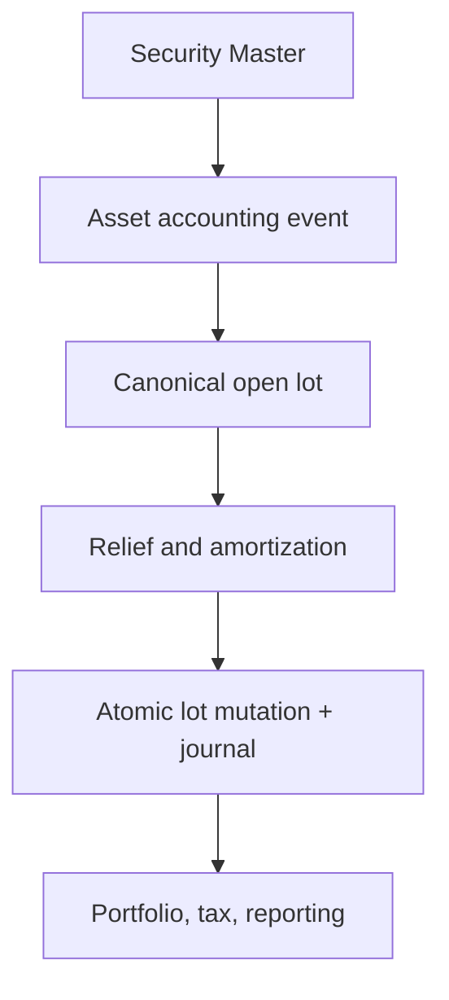

# Security-Identified Open-Lot Convergence Blueprint

**Roadmap:** `W10-LOT-002`  
**Depth:** full  
**Status:** proposed

**Owner:** Accounting and Ledger

**Reviewed:** 2026-10-07

> **Breaking change**
>
> The end state removes `Meridian.Execution.Sdk.TaxLot` as an authoritative model and makes
> `SecurityId` and decimal quantity mandatory. Execution selectors, Backtesting, Ledger,
> Reporting, and corporate-action consumers must move through adapters before the legacy type is
> deleted. Existing durable `LedgerTaxLotRecord` rows remain the migration anchor.

## 1. Scope

### Implemented migration increment (2026-09-04)

`IOpenLotBackfillStore` and migration `V_ledger_035` provide the legacy repair path. Survey covers
open and fully disposed legacy rows so retained reporting history can recover. Operators retain
hashed acquisition facts, an independent reviewer checks them against authoritative security and
book-position versions, and application consumes only that approved packet. Lot and queue versions,
idempotency, immutable before/after receipts, and SQL guards keep enrichment atomic. Unresolved
identity, quantity-basis, or acquisition-FX facts remain visible exceptions with no dismissal path.

The durable disposal transaction now selects through the canonical decimal relief contract, and
authoritative Reporting validates retained disposal snapshots and includes canonical acquisition
evidence in its signed pack. This increment does not certify the entire convergence roadmap:
The later acquisition, AverageCost, bounded amortization, current-basis relief, and bounded
corporate-action successor increments are recorded below. Wider corporate-action coverage,
remaining consumer parity and shadow-operation acceptance remain open. Simulated Backtesting
lots retain their declared simulation boundary rather than receiving invented evidence.

**In scope:** one open-lot contract for unit- and face-denominated instruments; acquisition
currency/FX; relief; premium/discount amortization; pool factors; and corporate-action continuity.

**Out of scope:** changing tax policy, replacing the immutable journal, adding a second position
store, or building the W10 tax operator screens. `W10-TAX-001` remains the UI and decision-support
owner.

**Current-state correction:** the gap is not only between `TaxLot` and `FaceValueLot`.
`LedgerTaxLotRecord` already provides decimal original/open quantity, currency, optional
`SecurityId`, `BookPositionId`, versioned relief, and atomic journal-plus-lot persistence. It is
the durable convergence anchor. `V_ledger_034` retains explicit quantity-basis semantics,
acquisition currencies and FX, and face-value acquisition terms. Remaining gaps include
mandatory identity across unresolved legacy rows, complete cross-consumer selector/amortization
parity, corporate-action coverage beyond the bounded exchange/refunding workflow, and
shadow-operation acceptance.

## 2. Architectural Overview



The ownership direction remains Security Master → Instruments/Asset Operations → Financial
Operations → Ledger/Storage. Security Master supplies identity and effective terms; it never owns
book-specific lots. Ledger/Storage owns the durable lot and its append-only mutation history.

### Decisions

- **Extend the durable ledger lot rather than create another store.** This preserves the atomic
  journal/lot transaction delivered by `W9-ASSET-010`.
- **Require `SecurityId`; retain symbols only as effective-dated display evidence.** Ticker changes
  cannot re-key a lot.
- **Use decimal quantity with an explicit `LotQuantityBasis`.** `Units` and `Face` may share
  relief mechanics without pretending their price conventions are identical.
- **Freeze acquisition FX facts.** Transaction currency, functional currency, and the
  transaction-to-functional rate are immutable acquisition evidence; later FX marks do not rewrite
  historical basis.
- **Represent economic changes as append-only lot mutations.** Corporate actions, factors,
  amortization, wash sales, returns of capital, and disposals never overwrite their proof trail.

## 3. Interface and Contract Design

Target shared contracts belong in `Meridian.Contracts.Accounting.Lots`:

```csharp
public enum LotQuantityBasis { Units, Face }

public sealed record OpenLotDto(
    Guid TaxLotRecordId,
    Guid SecurityId,
    Guid BookPositionId,
    Guid LedgerBookId,
    string LotId,
    DateOnly AcquiredDate,
    DateOnly HoldingPeriodStartDate,
    decimal OriginalQuantity,
    decimal OpenQuantity,
    LotQuantityBasis QuantityBasis,
    decimal AcquisitionUnitCost,
    string AcquisitionCurrency,
    string FunctionalCurrency,
    decimal AcquisitionFxRateToFunctional,
    decimal FunctionalCostBasis,
    long Version,
    FaceValueAcquisitionTermsDto? FaceValueTerms,
    IReadOnlyList<RetainedEvidenceIdentityDto> Evidence);

public sealed record FaceValueAcquisitionTermsDto(
    decimal ParBasis,
    decimal BookedFactor,
    BondAmortizationMethod AmortizationMethod,
    decimal? EffectiveYield);

public interface IOpenLotReliefService
{
    OpenLotReliefResult Select(
        IReadOnlyList<OpenLotDto> openLots,
        decimal quantityToRelieve,
        LedgerTaxLotReliefMethod method,
        IReadOnlyList<Guid>? specificLotIds = null);
}

public interface IOpenLotEconomicAdjustmentService
{
    IReadOnlyList<OpenLotMutationDraft> Project(
        OpenLotDto lot,
        IReadOnlyList<SecurityMasterEconomicChange> changes,
        DateOnly asOf);
}
```

`AcquisitionFxRateToFunctional` means functional-currency units per one acquisition-currency
unit and must be positive. `FunctionalCostBasis` is retained, not recomputed from a current rate.
`FaceValueTerms` is required only when `QuantityBasis == Face`; its cost convention is
`quantity × price-per-par-basis`.

### Durable additions

Durable acquisition facts are retained through existing face-term columns and the
`acquisition_terms` JSON; the logical fields are:

- `quantity_basis`, required after backfill;
- `acquisition_currency`, `functional_currency`, and
  `acquisition_fx_rate_to_functional`;
- `functional_cost_basis`;
- `par_basis`, `booked_factor`, `amortization_method`, and `effective_yield` for face lots.

`original_face`, `booked_factor`, and `par_basis` **landed** in
`V_ledger_033__tax_lot_face_terms.sql`, nullable and constrained all-three-or-none so a lot either
states its acquisition-time par conventions or states nothing; legacy rows are not backfilled with
synthetic defaults. `LedgerTaxLotFaceValueTerms` (`src/Meridian.Storage/Ledger/`) is the seam that
writes those terms from, and restates them back into, the canonical `FaceValueLot` aggregate, and
`AccountingPostingCandidateService` now derives factor-paydown held face from the lots of record
through it. Migration `V_ledger_034` retains `AmortizationMethod` and `EffectiveYield` in
the immutable `acquisition_terms` JSON alongside acquisition currencies, FX and both bases;
these facts are implemented, rather than proposed standalone columns. Effective yield uses an
annual decimal convention (0.05 means 5%).

`security_id` and `book_position_id` become non-null only after the legacy-row exception queue is
empty. Mutation rows retain before/after snapshots and the Security Master version used.

## 4. Component Design

### `OpenLotReliefService`

**Namespace:** `Meridian.Ledger.Lots`  
**Responsibilities:** decimal FIFO/LIFO/HIFO/SpecificId/AverageCost selection; partial relief;
stable tie-breaking by acquired date and lot id; no persistence or approval.

The current Ledger selector is the behavioral seed. Execution's long-based selectors become
adapters and then retire.

### `OpenLotAmortizationProjector`

**Namespace:** `Meridian.FinancialOperations.Lots`  
Consumes immutable acquisition terms plus effective Security Master coupon, day-count, maturity,
and factor evidence. It delegates existing `FaceValueLot` calculations during migration, emits a
typed amortization mutation draft, and posts the corresponding journal through the existing atomic
command. A calculation without retained Security Master version and source evidence fails closed.

### `OpenLotCorporateActionProjector`

**Namespace:** `Meridian.FinancialOperations.Lots`  
Projects split, reverse split, symbol change, exchange, merger, spin-off, return of capital,
factor/paydown, redemption, and advance-refunding mutations. A symbol change changes display
evidence only. Identity-changing events create successor lots linked to predecessor lot and
corporate-action IDs while allocating quantity, basis, holding period, acquisition FX, and
unamortized premium/discount under an approved allocation.

### `PostgresOpenLotStore`

This is an evolution of the existing ledger tax-lot store, not a parallel repository. It retains
optimistic versions and uses `AppendAtomicTaxLotJournalAsync` for acquisition, disposal,
amortization, factor, and corporate-action mutations.

## 5. Critical Data Flows

### Acquisition

1. Resolve `SecurityId`, book position, ledger book, period, quantity basis, currencies, and FX
   evidence.
2. Calculate transaction- and functional-currency basis.
3. Approve the posting candidate.
4. Atomically append the journal, open lot, mutation record, and evidence fingerprint.

### Disposal

1. Load authoritative open lots by ledger book, account, and `SecurityId`.
2. Apply approved policy using decimal quantities.
3. Validate expected lot versions and selection evidence.
4. Atomically post proceeds/basis/gain-loss and CAS each selected lot.

### Corporate action

1. Resolve the effective-dated action and all affected lots by `SecurityId`.
2. Project predecessor/successor mutations; do not use symbol as identity.
3. Require allocation totals to conserve quantity or face, functional basis, acquisition basis,
   holding period, and remaining premium/discount as applicable.
4. Approve and atomically append mutations and any journal.
5. Reconciliation proves predecessor closeout, successor opening, cash-in-lieu, and basis totals.

### Advance refunding acceptance scenario

The parent face lot produces unrefunded and pre-refunded successor lots under stable SecurityIds.
Both inherit acquisition date, holding period, currency/FX evidence, and allocated book basis. Only
the pre-refunded successor carries Schedule D tracking metadata; the allocation and journal commit
atomically and remain restatable from retained action evidence.

## 6. UI Design

No new standalone screen is introduced. `W10-TAX-001` consumes a shared open-lot read model in both
browser and WPF lanes. Every row shows Security Master identity, symbol-as-of, quantity basis,
transaction/functional basis, acquisition FX, relief method, amortization posture, latest corporate
action, evidence status, and version.

## 7. Test Plan

| Test | Required proof |
| --- | --- |
| `OpenLotReliefServiceTests` | Decimal partial FIFO/LIFO/HIFO/SpecificId/AverageCost relief |
| `OpenLotFxInvariantTests` | Functional basis uses immutable acquisition FX and round-trips |
| `OpenLotFaceValueTests` | Par basis, booked factor, and constant-yield amortization |
| `OpenLotCorporateActionTests` | Ticker change continuity; split/exchange/spin-off basis conservation |
| `AdvanceRefundingOpenLotScenarioTests` | Two successor lots, holding-period/basis conservation, Schedule D distinction |
| `AtomicOpenLotJournalStoreTests` | Journal and every lot mutation commit or roll back together |
| `LegacyTaxLotAdapterParityTests` | Long/unit legacy scenarios equal decimal canonical results |
| `OpenLotBackfillReconciliationTests` | Row counts, open quantity, transaction basis, and functional basis reconcile |

Property tests must prove conservation within currency precision. PostgreSQL tests must cover
concurrent relief, replay, correction, and cancellation.

## 8. Implementation Roadmap

1. **Contract foundation:** add shared quantity-basis, currency/FX, face-value, relief, and mutation
   contracts; add adapters from all three current models.
2. **One calculation kernel:** move selectors to decimal canonical inputs and make Execution and
   Ledger parity tests pass.
3. **Additive persistence:** add nullable columns and append-only mutation kinds; keep existing
   writers authoritative.
4. **Evidence-backed backfill:** resolve `SecurityId`/book position, classify units versus face,
   and populate FX only from retained acquisition evidence. Unresolved rows enter a governed queue.
5. **Shadow operation:** dual-project legacy and canonical results; block cutover on quantity,
   basis, relief, amortization, or corporate-action differences.
6. **Atomic write cutover:** make the extended ledger lot authoritative; switch Execution,
   Backtesting, Reporting, and corporate-action consumers.
7. **Contract retirement:** remove symbol/long `TaxLot` and calculation ownership from
   `FaceValueLot` only after compatibility telemetry is zero for one release.

## 9. Open Questions and Risks

| Question | Owner | Blocking decision |
| --- | --- | --- |
| Which retained source establishes acquisition FX for legacy rows? | Accounting | Backfill and non-null FX cutover |
| Are short lots represented by signed quantity or a separate direction? | Ledger/Execution | Final contract validation |
| Which rule pack owns successor-basis allocation by action type? | Accounting policy | Corporate-action posting |

| Risk | Mitigation |
| --- | --- |
| Synthetic FX creates false realized P&L | Fail closed; no rate inferred from current marks |
| Dual writes diverge | One canonical fingerprint and shadow reconciliation before cutover |
| Corporate actions double-adjust basis | Idempotency by action, lot, effective date, and version |
| Face and unit price conventions mix | Required quantity basis and conditional face-value terms |
| Historical symbols re-key lots | Mandatory `SecurityId`; symbol is display evidence only |

## Acceptance Gate

The roadmap item may close only when all production open-lot writes use mandatory `SecurityId`,
decimal quantity, explicit quantity basis, acquisition currency/FX, and atomic mutation/journal
storage; every current consumer has parity evidence; the legacy exception queue is zero or governed;
and the advance-refunding scenario reconciles from source evidence through report output.


## Implementation receipt - 2026-09-04

Contract and persistence foundation in progress: shared decimal `OpenLotDto` and acquisition facts, canonical relief selection, Execution/Backtesting parity adapters, an additive nullable `acquisition_terms` column, immutable acquisition guards, and ledger-to-canonical face/unit projection. Missing identity, FX, or subject-bound acquisition evidence is refused. Legacy null fields remain absent in fingerprints; populated evidence participates in atomic replay identity.

The governed legacy exception/backfill workflow and durable disposal/Reporting consumers are implemented as described in section 1. No acquisition-writer cutover is claimed. Remaining phases include acquisition writer convergence; atomic AverageCost basis redistribution and currency-precision/selector/amortization parity across remaining production consumers; append-only corporate-action successor and adjustment posting; the advance-refunding/reporting acceptance scenario; and shadow-operation evidence before retiring legacy contracts. Changed basis without a governed adjustment projection currently blocks canonical projection. Short positions require the explicit direction decision in section 9. This increment is not full production certification.

## Implementation receipt - 2026-09-22

Acquisition writer convergence: `AccountingPostingCandidatePostService`, the only production code
that creates lots, now writes canonical `OpenLotAcquisitionDto` facts on spine acquisitions. Unit lots
always receive them; face lots receive them when the acquisition instruction states
`AmortizationMethod` (and `EffectiveYield` for constant yield), which `AssetAcquisitionLotDto` now
carries as optional fields omitted from serialization when absent so retained instruction
fingerprints are unchanged. No fact is defaulted: the spine refuses foreign-currency events and the
store requires lot currency to equal the journal functional currency, so FX is exactly one and
transaction and functional bases both equal the asserted quantity-times-cost event amount. The
lot-bound `OpenLotAcquisition` evidence restates each retained source record (URI, content hash,
source reference) as reviewed and retained with the independent maker-checker approval that covered
the drafted candidate. A face lot without a stated method keeps its par terms and no canonical
facts. A retried batch committed before this change replays its retained shape rather than
colliding on the fact-bearing fingerprint. `AssetAcquisitionLotPostgresRoundTripTests` proves unit
and face acquisitions post, project through `ToOpenLot`, pass `CanonicalOpenLotDisposalGuard`, and
replay. Remaining phases are unchanged: AverageCost redistribution, amortization, corporate-action
successors, advance refunding, and shadow operation.

## Implementation receipt - 2026-09-23

Atomic AverageCost relief: the durable disposal transaction now accepts the `AverageCost` account
policy. `CanonicalOpenLotDisposalGuard` certifies each selection against the pooled canonical relief
(FIFO depletion order, pooled functional basis, decimal residual on the last slice), and the journal
credits that pooled basis. In the same transaction every surviving lot in the pool is restated to the
pooled basis through a governed `OpenLotBasisAdjustmentDto` (`V_ledger_037`: `tax_lots.basis_adjustment`,
append-only under a trigger that requires a version increment stamped with a new mutation batch).
Unselected survivors receive an append-only `BasisRedistribution` mutation row carrying their
immutable before-snapshot; a partially relieved lot carries its restatement on its own `Disposal`
row, so each lot still mutates at most once per batch. Acquisition facts never change: `ToOpenLot`
projects the adjusted basis scaled by later relief and fails closed on an adjustment that does not
bind the open quantity. The lots of record therefore tie to the asset account after every pooled
disposal. Reporting rebuilds the pre-relief pool from the batch's retained snapshots, re-runs pooled
relief, and requires every retained slice to match exactly before a report projection is produced.
`AtomicTaxLotJournalStoreTests.AppendAssetPostingAsync_AverageCostReliefRestatesThePoolAndReportingCertifiesIt`
proves a partial and a closing AverageCost disposal against PostgreSQL, including replay and a
tampered-pool refusal. This increment originally blocked discrete relief after restatement; the
current-basis continuation below supplies that transition.
The effective-dated lot read (`ListOpenTaxLotsByAssetScopeAsync`, which replays retained mutations to
restate quantity as of an event date) treats a `BasisRedistribution` row as a zero-quantity
restatement and rejects one that moves quantity. Its projection keeps the current governed basis
adjustment, so `ToOpenLot` fails closed on an as-of quantity above the restated quantity rather than
reporting an unrestated basis; that read is for held quantity only, never disposal selection. The
replay now resolves each retained journal's ledger book through its accounting period. Remaining
phases: amortization, corporate-action successors, advance refunding, and shadow operation.

## Partial amortization implementation - 2026-10-02

`CanonicalLotAmortizationService` reads the authoritative lot, Security Master projection and book
position for a read-only preview. `OpenLotAmortization` uses retained acquisition terms and FX,
versioned, hash-bound reference evidence, and the existing `FaceValueLot` straight-line and
constant-yield kernels. Supported inputs are positive open face lots with fixed or zero coupons,
unadjusted bullet principal, explicit supported day-count terms, and level constant-yield periods.
Constant yield consumes the retained annual decimal yield and verifies it against acquisition price.
Coupon counts follow regular calendar boundaries, including month ends and leap years, for monthly,
quarterly, semiannual and annual schedules. Actual day-count fractions interpolate within the current
coupon period rather than being rounded into coupon counts; odd schedules remain unsupported.
New instructions carry calculation model v2. Previously retained unversioned instructions preserve
v1 economics and their original serialization so receipt replay remains recoverable. Unposted legacy
instructions require a fresh preview before approval/posting.
Missing terms, structured principal/factors, floating or step coupons, callable instruments,
unsupported day-count context and other methods block this slice.

An `Amortize` instruction travels through the existing Asset Accounting Event Spine candidate and
independent human approval workflow. `PostgresLedgerJournalStore` locks the period, Security Master,
book position and reviewed lot in one serializable PostgreSQL transaction. It appends the governed
balanced journal, updates only the open-basis adjustment with expected-version CAS, and retains one
basis-only append-only mutation and the exact reviewed evidence. Immutable acquisition economics
and FX survive unchanged. The asset debit or credit must exactly equal the functional carrying-basis
change; cumulative targets are rounded once at the existing 12-place journal/storage boundary.
If a fractional holding produces a basis movement that cannot be represented exactly at that
boundary, posting is refused rather than retaining a lot basis that differs from its journal.

The governed event spine retains its existing same-currency requirement for Security Master and
the event's functional currency; this partial delivery does not add a cross-currency event workflow.
The atomic boundary preserves the acquisition currencies and FX for supported store commands.
Current-basis disposal relief is supplied by the separate PR #3050 slice described below. These
amortization corrections preserve its existing relief implementation and acquisition evidence.
`AtomicTaxLotJournalStoreTests.CanonicalAmortization_LaterFifoDisposalRelievesAmortizedBasisAndReportingCertifiesIt`
proves relief for an amortized lot: it amortizes a premium face lot, then partially and fully
relieves it under FIFO against PostgreSQL. Each disposal books exactly the amortized basis, retains
the acquisition facts, replays exactly, and is certified by Reporting.

Migration `V_ledger_040` widens existing mutation constraints without replacing acquisition facts or
backfilling legacy rows. Exact command retries return the retained journal and mutation before
current period/version checks, including after restart and later period close. A different command
at the same identity, stale lot/reference state, unproved historical partial holdings, earlier
amortization date or another basis treatment is refused. PostgreSQL Security Master and position
stores must share the ledger database so reference locks remain held through commit.
Primary-host composition supplies deferred reference/position authorities to the journal store.
Posting requires the exact reviewed instruction and acquisition/reference evidence under the canonical
depreciation/amortization event type. Parent and child reference locks protect all hashed Security
Master inputs; standalone alias writes participate in the same transaction ordering and invalidate
older serializable posting snapshots.

This is a partial W10-LOT-002 delivery. Corporate-action successors, advance refunding, active
wash-sale correction, cross-consumer parity and live shadow-operation acceptance remain separate.
Automated evidence is recorded with the implementation test results; no operator acceptance or
production certification is implied by this receipt.

### Partial current-basis relief continuation (2026-10-02)

FIFO, LIFO, HIFO, SpecificId, and AverageCost now certify disposal selections from the current
canonical open basis, including previously redistributed survivors. The production event spine
checks the current scoped plan; the durable store rechecks it against locked lots and the effective
method and policy revision. `ExpectedUnitCost` remains an immutable acquisition snapshot assertion,
while `ExpectedCostBasis` is the certified current functional relief. Original quantity, acquisition
basis, currency, FX, holding dates, and evidence are retained unchanged in every before/after receipt.

A partial discrete disposal of an adjusted lot retains its exact transaction and functional remainder by subtraction
in a `DisposalRelief` adjustment on the same versioned lot mutation. Untreated acquisitions keep
their original proportional basis projection, including the existing first-amortization path after
ordinary relief. Full disposal consumes the exact
remaining basis. Journal, lot quantity and basis, evidence, optimistic versions, audit and idempotency
commit or roll back together; retries return the retained receipt before consulting later lot or
policy state. Reporting validates the retained pre-relief current basis and reproduces the exact
posted cost and journal lines without a currency-rounded unit-cost recalculation. Fractional-cent
movements are supported when exactly representable in PostgreSQL's twelve-decimal numeric columns;
unrepresentable quantities or functional relief amounts fail before posting rather than rounding.

Migration `V_ledger_041` follows the atomic amortization migration `V_ledger_040` from
[PR #3048](https://github.com/rodoHasArrived/Meridian-main/pull/3048), so 040 cannot later replace the
expanded disposal cost check. This
slice preserves its amortization cost convention and accepts its governed current-basis projection;
it does not claim delivery or certification of that separate draft.

`AtomicTaxLotJournalStoreTests.CurrentBasis` covers PostgreSQL partial and full relief after real
pool redistribution, changed effective methods, HIFO current-basis ordering, stale selections,
late rollback, restart, replay and precision refusals. `CanonicalOpenLotConsumerTests` covers
Reporting current-basis certification, tamper refusal, fractional cents and face quantity scaling.
This is partial delivery only: `W10-LOT-002` stays `in_progress`. Amortization convergence remains
coordinated with #3048; corporate-action successor mutations, advance refunding and shadow-operation
acceptance remain outside this bounded slice.

Implementation proof at `a4c4b5ff0`: the focused Ledger/Storage/event-spine/acquisition suite passed
138 tests with zero failures and zero skips, including nine new current-basis PostgreSQL cases.
PostgreSQL 16.15 schema snapshot and independent empty-database verification passed with zero
errors and unchanged 242 policy warnings. Canonical repository CI and hosted checks remain separate
validation gates; this evidence does not accept the broader row or certify PR #3048.

### Bounded exchange and advance-refunding continuation (2026-10-06)

The existing corporate-action projections now support governed successor posting for cashless
`RegS144AExchange`, followed by the registered `AdvanceRefunding` case. This boundary fully closes
one predecessor's remaining open quantity and creates one exchange successor or exactly two face
successors: refunded and unrefunded. It requires distinct durable lot, Security Master and
book-position identities. Target securities and active book positions must already exist; symbols
remain display evidence. Other action types, multiple predecessors, cash components, transfers
between financial accounts and combined correction instructions remain outside this slice.

`OpenLotSuccessorInstructionDto` binds the reviewed projection to exact predecessor/successor
snapshots and reference versions/hashes. Original acquisition basis attributable to the remaining
holding and current carrying basis are allocated separately in transaction and functional currency.
Each currency uses its own precision, and the final successor receives the exact residual.
Acquisition date, holding-period start, currencies, acquisition FX, face terms and retained
acquisition evidence survive the transfer. Only the refunded successor carries `ScheduleD` in the
retained mutation plan. No current market FX rate supplies an acquisition fact.

The candidate and independent approval workflow retain that instruction through posting. The
existing serializable `AppendAssetPostingAsync` transaction locks the period, source/target
Security Master and book-position authority, then checks the predecessor and create-only targets.
It appends one predecessor asset credit and one asset debit per successor, closes the predecessor
with expected-version CAS, creates every successor and records immutable before/after mutations
together. Journal functional amounts must exactly equal each lot’s carrying transfer. When
acquisition-currency detail is supplied, its transaction basis and FX must also match; governed
functional-currency-only lines retain both lot bases and acquisition FX in the bound instruction.
Migration `V_ledger_042` extends existing atomic-batch retention without backfilling earlier
batches; no parallel lot store is introduced. Historical quantities recognize a successor from the
action's effective date while its acquisition date remains inherited. Journal-only append cannot
bypass the atomic boundary. A stale assertion or failure on any mutation rolls back the journal
and every lot.
Disposal eligibility likewise starts at the successor's action date, preserving its inherited
holding history without allowing relief before the lot opens.
An exact retry reloads the retained batch before later live-state checks, including after restart;
changed content under the same identity is refused.
If the commit succeeds before lifecycle publication, the exact retained journal and mutation batch
also authorize recovery of the missing Posted stage after a later position revision. Unposted
projections still require the reviewed current position version.

`LedgerReportingAuthoritativeSource` obtains the committed batches through
`ILedgerOpenLotSuccessorHistory`, validates the closed predecessor and each persisted successor
against the approved instruction, and checks owner, book, period, accounting basis and exclusive
refunded Schedule D treatment. The retained Reporting dataset/checkpoint includes exact batch JSON,
its SHA-256 hash and the instruction fingerprint on the existing journal rows. It adds no monetary
rows and does not reconstruct earlier evidence from later live lot balances. Missing history or
contradictory snapshots block authoritative reporting.

`OpenLotSuccessorTests` covers acquisition/current-basis allocation, FX and holding continuity,
currency residuals, invalid identities/versions and Schedule D exclusivity.
`AtomicTaxLotJournalStoreTests.Successors` covers the exchange and advance-refunding scenarios,
stale state, final-mutation rollback, restart and changed duplicate replay.
`LedgerReportingAuthoritativeSourceSuccessorTests` covers retained exchange/refunding evidence,
replay stability and incomplete or tampered history refusals.
Implementation proof at `7bb99b4b2`: the accounting, lot and Reporting regression slice passed
486 tests with zero failures and zero skips, including the PostgreSQL successor and publication
recovery cases. PostgreSQL 16.15 schema snapshot, promotion and independent empty-database
verification passed for all 121 migrations with zero errors. Documentation and workflow validation
passed; the latter ran 1,552 script tests with zero failures/errors, 16 existing skips and seven
existing quarantined modules. These results are retained in
[PR #3102](https://github.com/rodoHasArrived/Meridian-main/pull/3102).

The results above describe that bounded implementation head. The Tailwind 4/PostCSS prerequisite
is corrected in the consolidated continuation below. Historical checks do not validate a later
combined head or supply independent operator acceptance.

### Consolidated lot posting and correction continuation (2026-10-07)

[PR #3102](https://github.com/rodoHasArrived/Meridian-main/pull/3102) is the single review surface
for the changes originally presented in #3109, #3102, #3093, #3067, #3070 and #3074.
The successor path uses one `OpenLotSuccessorInstructionDto`, one atomic store implementation and
migration `V_ledger_042__atomic_lot_successors.sql`. Forward migration
`V_ledger_043__amortization_reversal_basis_restoration.sql` separately corrects the prior basis-removal
guard for approved amortization restoration. The successor migration's populated through-041 upgrade, historical
predicate preservation, reapply, restart and failed-upgrade rollback audit remain attached to that
migration. No historical migration is renumbered or overwritten.

The governed path supports cashless Reg S/144A exchanges, whole-unit forward/reverse splits,
stock mergers and proportional advance refundings. Each instruction fully closes one predecessor;
exchange, split and merger create one successor, while refunding creates refunded/unrefunded face
successors. Same-security splits explicitly opt into a basis-transfer journal; older operational
and identifier-changing projection paths keep their existing behavior. The reviewed instruction
survives Projected, Drafted and Approved lifecycle stages. Storage rechecks locked lot/reference
versions, financial account, policy and canonical dimensions before committing every lot and journal
leg together. Unsupported cash components, transfers and corporate-action corrections refuse posting.
Atomic successor commands require the canonical `AssetAccounting.CorporateAction` source type,
approved state, retained approval identity, named actor and complete typed accounting context.
Type aliases, corrected-batch/source-journal metadata, reversal/rebook intents and closing-entry
posting kinds cannot introduce unsupported successor corrections.

Original acquisition and current carrying bases remain separate in both currencies. Acquisition
FX and holding dates are retained. Immutable acquisition lineage survives later relief, distinguishes
exclusive refunded Schedule D treatment. Before a new posting, Storage traverses immutable birth
receipts through every predecessor and resolves stable source-action identity from retained,
version/hash-bound source-event evidence. An intervening action, later disposal or a fresh case/version
cannot hide a repeated ancestor action. Historical absent lineage or stable-ID fields retain their
original serialized shape; ordinary legacy relief receipts can prove the path back to the original
acquisition. Missing, contradictory, cyclic or foreign-book ancestry refuses posting, while exact
retries return the committed receipt before new-posting ancestry checks.
Reporting validates the immutable posting receipts, preserves exact batch JSON and hashes on
journal rows, and includes `corporate-action-lot-evidence.json` under report-pack checksums and signing.
AverageCost reporting compares acquisition evidence and successor lineage by value against its
retained pre-relief pool; changed provenance fails certification even when all monetary facts match.

Amortization reversal/rebook uses the latest unchanged retained mutation and exact original journal.
A reviewed reversal restores the complete prior basis adjustment and inverses every financial line
atomically. A same-date rebook requires that reversal receipt and approved correction lineage.
Migration 043 permits restoration of a retained null prior adjustment only for the latest original
amortization mutation and an approved correcting journal in the same scope and effective date.
Complete typed snapshot and exact inverse-journal checks remain in the atomic application path;
ordinary adjustment removal remains forbidden and every basis change requires a new version and batch.
Historical receipts retain their calculation and wire shape; newly drafted ordinary amortization
keeps the current calculation, evidence and currency guards already on main. The PostgreSQL FIFO
proof above covers partial/closing disposal after amortization and exact Reporting reconstruction.
Backtesting and shared Security Master lot projections also use retained cost basis for long,
explicit short and recovered legacy-short unrealized P&L, while chained simulation transformations
replace only generated composite summaries and preserve operator prose.

Focused test coverage is retained in `AtomicTaxLotJournalStoreTests.Amortization.cs` for premium/discount
null-basis restoration, approved rebook, refusal and rollback; `CorporateActionSuccessorAncestryTests.cs`
and `AtomicTaxLotJournalStoreTests.SuccessorAncestry.cs` for ancestor replay, historical receipts and
restart; and `AtomicTaxLotJournalStoreTests.SuccessorGuards.cs` for concurrent competing commands,
successor collisions, type/approval/correction refusals and dimension tampering. These are test
coverage references; current-run and hosted results are recorded on the canonical PR.

The consolidated branch carries the Tailwind 4/PostCSS migration and rebuilt workstation assets.
Validation results belong to the canonical PR and its exact head. `W10-LOT-002` stays `in_progress`:
other corporate actions, successor amortization, remaining cross-consumer parity and live
shadow-operation acceptance still require their own implementation and independent review.
