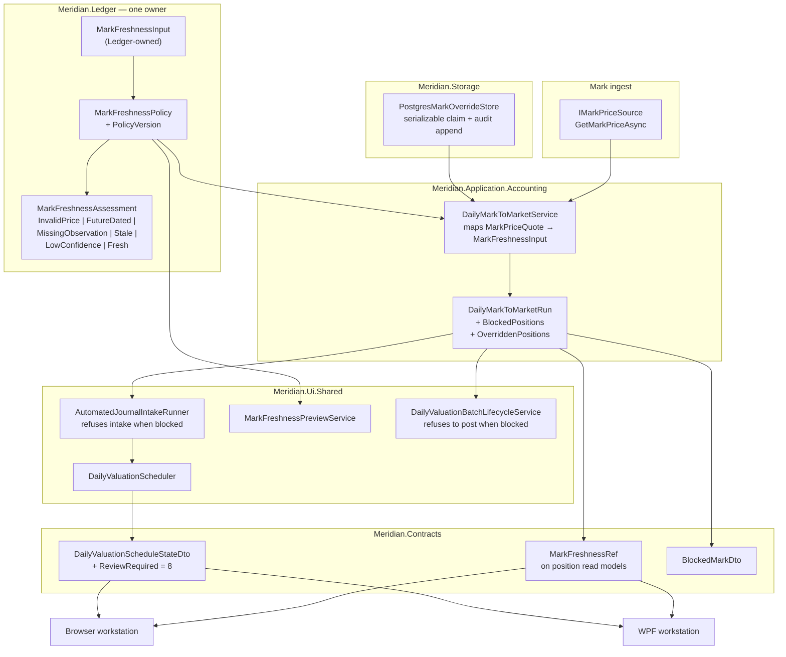

# W10-MARK-001 — Fail-Closed Mark Freshness and Mark-Age Surfacing

**Status:** active
**Owner:** core-team
**Reviewed:** 2026-08-02
**Roadmap row:** `W10-MARK-001` in [`docs/roadmap/data/roadmap-items.yml`](../../roadmap/data/roadmap-items.yml)
**Slate rationale:** [`docs/product/w10-depth-slate-2026-07.md`](../../product/w10-depth-slate-2026-07.md)
**Risk targeted:** `RISK-STALE-MARK-001` — **`status: open`** in
[`docs/roadmap/data/risk-register.yml`](../../roadmap/data/risk-register.yml). This blueprint is a
design, not a delivery. The risk stays open, and the roadmap row stays `planned`, until the
implementation lands with evidence; the discharge is the last item on the Phase 5 checklist, not a
property of this document.

---

## ⚠️ Breaking Change — source-breaking, not merely behavioural

`StalePricePolicy` is a **public** record in `Meridian.Ledger`. Phase 2 deletes it. Any external
caller that names the type, constructs it, or passes it to `DailyPortfolioPricingPolicy` **fails to
compile** — this is not a case of the same code compiling and behaving differently.

| Consumer | Location | Migration |
| --- | --- | --- |
| `DailyPortfolioPricingPolicy` | `src/Meridian.Ledger/DailyPortfolioPricingPolicy.cs:16,36,60` | Optional ctor param currently defaults to `StalePricePolicy.Disabled`. Parameter type becomes `MarkFreshnessPolicy`, default becomes `MarkFreshnessPolicy.FailClosed`. |
| `AutomatedJournalIntakeRunner` | `src/Meridian.Ui.Shared/Services/AutomatedJournalIntakeRunner.cs:266` | **The only production construction.** Rewritten to build one `MarkFreshnessPolicy`. |
| `DailyValuationPolicyTests` | `tests/Meridian.Tests/Application/Accounting/DailyValuationPolicyTests.cs:61` | `StalePricePolicy_FuturePrice_IsFreshWithZeroAge` **pins the defect** and must be inverted. |
| External constructors | outside this repo | **Source-breaking.** See the migration window below. |

**Migration window.** Phase 2 ships `StalePricePolicy` as `[Obsolete]` with a converting
`ToMarkFreshnessPolicy()` and an overload of the `DailyPortfolioPricingPolicy` constructor that
accepts it; Phase 5 removes both. The replacement is mechanical:

```csharp
// before
new DailyPortfolioPricingPolicy(..., new StalePricePolicy(enabled: true, maximumAgeDays: 3, StalePriceHandling.Block));
// after
new DailyPortfolioPricingPolicy(..., MarkFreshnessPolicy.FailClosed with { MaximumAgeDays = 3 });
```

The *in-repo* blast radius is one production construction site. The external blast radius is
unknown, which is why the obsolete shim exists rather than a bare deletion.

---

## Scope

**In Scope**
- One freshness owner for marks, replacing the current two half-used controls.
- Fail-closed default, including rejection of future-dated observations and non-positive prices.
- A valuation carrying any blocked mark surfacing as review-required with the offending positions
  named, on both workstation lanes — enforced where drafts are created and again where they post,
  not only in the schedule state.
- Mark age and observation date on the shared position read models, **with a specified producer and
  persisted join for each**.
- A scoped, expiring, atomically consumed price override with approval and durable audit.
- A pre-enablement preview of how many current valuations the new default would block, landing
  **before** the default flips.

**Out of Scope**
- Changing *where* marks come from (`IMarkPriceSource` is untouched).
- Backfilling historical valuations under the new policy.
- `PortfolioPricingRule` (source/method/fair-value-level selection) — different concern.

**Assumptions**
- `MaximumMarkAgeDays` stays operator-configurable; only its default posture and enforcement change.
- `RISK-STALE-MARK-001` remains the tracked risk; this row does not touch `RISK-SIM-REAL-001`.

**Depth Mode:** `full`

---

## Architectural Overview

### Context Diagram



### Design Decisions

**Decision: consolidate onto `MarkPriceQualityPolicy`'s shape, renamed `MarkFreshnessPolicy`, in `Meridian.Ledger` — taking a Ledger-owned input, not `MarkPriceQuote`.**

*Rationale:* `MarkPriceQualityPolicy` already carries every gate criterion 2 says must survive
consolidation — minimum confidence, required observed date, complete coverage — **and it already
rejects future observation dates** (`DailyMarkToMarketService.cs:499-500`), which is exactly the hole
in `StalePricePolicy.Assess`. Extending `StalePricePolicy` would mean re-implementing four gates to
gain one enum.

*The layering constraint is real, and the fix is smaller than it looks.* `Meridian.Ledger.csproj:9-12`
references **only** `Meridian.Core` and `Meridian.FSharp.Ledger`; `Meridian.Application.csproj:58`
references `Meridian.Ledger`. Taking `MarkPriceQuote` — declared in `Meridian.Application.Accounting`
at `DailyMarkToMarketService.cs:24-53` — in a Ledger-hosted policy would invert that graph and would
not compile.

But **Ledger already owns both of the quote's non-primitive field types**: `FairValueLevel`
(`FairValueLevel.cs:8`) and `DailyPortfolioPriceConfidence` (`DailyPortfolioPriceMark.cs:7`), and
`DailyMarkToMarketService.cs:3` already does `using Meridian.Ledger;`. So the policy takes a small
Ledger-owned input record and the application service maps into it at the call site. **No type moves
down, no lower project (Contracts, Domain, Core) gains an enum it should not have, and the migration
plan does not grow a project-graph change.**

*Consequences:* one mapping expression in `DailyMarkToMarketService`; the policy stays a pure
function of Ledger-owned values and is trivially testable.

**Decision: the assessment is a discriminated result with a *nullable* age, and `InvalidPrice` is a first-class verdict.**

*Rationale:* criterion 1 distinguishes "age outside policy" from "observation date outside policy",
and criterion 3 requires naming *why* each position was blocked. Two specifics follow:

- **`AgeDays` must be `int?`.** `MissingObservation` has no age. A non-nullable field forces an
  implementation to invent `0`, which reads as *today* everywhere it is sorted, logged, or rendered —
  the contract-side `MarkFreshnessRef` already concedes this with `int?`.
- **`InvalidPrice` is not optional, and it is the *first* check.** `EvaluateMarkQuality`
  (`DailyMarkToMarketService.cs:486-506`) tests `quote.Price <= 0m` at `:491` **before** the
  `policy is null` short-circuit at `:493`. It is therefore the only gate that fires when no quality
  policy is configured at all, and it runs entirely outside the `StalePricePolicy.Assess` block at
  `:366-383`. Folding freshness into one policy without an invalid-price verdict would let a zero
  mark through in precisely the configuration that has no other protection, and would turn a
  negative mark into a later exception instead of an operator-visible blocked position.

*Verdict severity order, most severe first:* `InvalidPrice`, `FutureDated`, `MissingObservation`,
`Stale`, `LowConfidence`, `Fresh`.

**Decision: fail closed at draft intake and at the posting boundary — not by flipping a schedule state.**

*This reverses the previous draft, which is worth stating plainly: a schedule-state change cannot be
the control, because nothing on the posting path reads it.*

- `DailyValuationBatchLifecycleService.ApproveAndPostAsync` (`:28-231`) **never reads
  `schedule.State`.** It validates scope, fund-profile match, non-empty `JournalEntryIds`, and
  per-draft preparer/approver and status — then posts every retained draft. State is *written* at
  `:203` as a **consequence** of posting, never as a precondition.
- `AutomatedJournalIntakeRunner:295-307` persists drafts **before** `DailyValuationScheduler:436-458`
  maps a result to a state at all, and the ids handed on at `:541` are collected from both `Created`
  and `Skipped`.
- `MarkPriceQualityPolicy.Standard` sets `RequireCompleteCoverage: false`
  (`DailyMarkToMarketService.cs:65`), so the partial-coverage branch at `:419` — which collects
  rejects into `unpriced` and lets the surviving marks build approvals at `:480` — **is the default
  path, not an edge case.**

So a partially priced valuation reaches the ledger today, and would continue to under a
state-only change. The block goes in two places: `AutomatedJournalIntakeRunner` refuses to persist
drafts while `BlockedPositions` is non-empty, and `ApproveAndPostAsync` refuses to post a batch whose
run carried blocked positions. The schedule state becomes the *report* of that refusal, not the
mechanism.

*Consequences:* two enforcement points and a test at each. The schedule state is still needed for the
operator surface, but it is no longer load-bearing.

**Decision: overrides are a new Postgres-backed store, claimed atomically, modelled on `PostgresOperatorOverridesStore`.**

*This also reverses the previous draft.* It proposed "an atomically rewritten file-backed
current-state store" modelled on `IOperatorOverridesStore` — but `IOperatorOverridesStore`
(`Storage/SecurityMaster/IOperatorOverridesStore.cs:10-31`) **has no file-backed implementation at
all**, only `PostgresOperatorOverridesStore` and a `NullOperatorOverridesStore` fallback.
`AtomicFileWriter` is not used anywhere near it.

The precedent that actually answers the design is
`PostgresOperatorOverridesStore.RecordApprovalDecisionAsync` (`:166-255`), which runs read → guard →
transition → audit-append **inside a single `IsolationLevel.Serializable` transaction** over a
`SELECT … FOR UPDATE` row lock (`:188-192`, `:326`), rejecting a non-`Pending` state at `:200-207`.
`PatchAsync` adds compare-and-swap on `expectedCanonicalVersion`, throwing
`OperatorOverrideCanonicalVersionConflictException`.

That single-transaction shape answers three findings at once — atomic one-shot consumption,
expiry evaluated at the moment of use, and an audit row written in the same transaction as the state
change (`:212-242`, `SecurityOverrideAuditEntryDto` at
`Contracts/SecurityMaster/OperatorOverrides.cs:15-23`).

*Ledger-side alternative for the audit chain:* `FundAdministrationEventLog`
(`Ledger/FundAdministrationEventLog.cs:12-27`, `:43-97`) is SHA-256 hash-chained with no mutate or
delete API, a `lock (_gate)` making read-tail-hash → compute → enqueue atomic, and `VerifyIntegrity`.
Record shape at `FundAdministrationEvent.cs:63-74`.

*Not a precedent:* `ShadowNavOverrideDraft` (`ShadowNavOverrideDraft.cs:6-19`) has **no store, no
persistence, and no consumer anywhere in `src/`** — its only producer is
`ShadowNavValidationReport.CreateOverrideDraft`. The previous draft cited it; it should not have.

---

## Interface & API Contracts

### New — `Meridian.Ledger`

```csharp
/// <summary>
/// The subset of a mark the freshness policy needs, expressed entirely in types
/// <c>Meridian.Ledger</c> already owns. The application layer maps its own
/// <c>MarkPriceQuote</c> into this at the call site, so the policy can live in Ledger
/// without Ledger referencing Application.
/// </summary>
public readonly record struct MarkFreshnessInput(
    decimal Price,
    DateOnly? ObservedOn,
    DailyPortfolioPriceConfidence Confidence);

/// <summary>Why a mark did not satisfy freshness policy. Ordered most severe first.</summary>
public enum MarkFreshnessVerdict
{
    /// <summary>Price is zero or negative. Checked before every policy gate, and enforced even
    /// when freshness is unenforced — it is the only gate with no policy to switch it off.</summary>
    InvalidPrice,
    /// <summary>Observation date is after the valuation date — not observable as of valuation.</summary>
    FutureDated,
    /// <summary>No observation date and the policy requires one.</summary>
    MissingObservation,
    /// <summary>Observation is older than the policy's maximum age.</summary>
    Stale,
    /// <summary>Provider confidence is below the policy minimum.</summary>
    LowConfidence,
    Fresh,
}

/// <summary>
/// The single owner of mark freshness. Replaces <c>StalePricePolicy</c> and
/// <c>MarkPriceQualityPolicy</c>, preserving every gate the latter enforced including the
/// unconditional positive-price check.
/// </summary>
public sealed record MarkFreshnessPolicy(
    bool Enabled,
    int MaximumAgeDays,
    DailyPortfolioPriceConfidence MinimumConfidence,
    bool RequireObservedDate,
    bool RequireCompleteCoverage,
    StalePriceHandling Handling)
{
    /// <summary>Fail-closed default: enforced, 3 days, Medium confidence, observation required, blocking.</summary>
    public static MarkFreshnessPolicy FailClosed { get; }

    /// <summary>Explicit opt-out of the *policy* gates. Never the default; construct deliberately.
    /// Does not disable the positive-price check.</summary>
    public static MarkFreshnessPolicy Unenforced { get; }

    /// <summary>
    /// Deterministic identity of this policy's governing configuration, derived from every
    /// member above. Any change to any member yields a different version, which is what makes a
    /// policy change invalidate every override minted under the prior rule. Derivation is a
    /// stable hash of the ordered field values — never a hand-maintained constant, and never
    /// a mutable identifier assigned at configuration time.
    /// </summary>
    public string PolicyVersion { get; }

    public MarkFreshnessPolicy EnsureValid();

    /// <summary>Evaluates one mark. Never clamps a negative age to zero.</summary>
    public MarkFreshnessAssessment Assess(MarkFreshnessInput mark, DateOnly valuationDate);
}

public sealed record MarkFreshnessAssessment(
    MarkFreshnessVerdict Verdict,
    /// <summary>Null when no observation date exists — never a zero standing in for one.</summary>
    int? AgeDays,
    StalePriceHandling Handling)
{
    public bool IsBlocking { get; }
    public static MarkFreshnessAssessment Fresh(int ageDays);
}
```

`PolicyVersion` must cover **every** field, not only the age. A change to `MinimumConfidence` that
left the version untouched would leave overrides standing against a rule that no longer justifies
them — that is the whole reason the field exists, and the invalidation test suite asserts one case
per member.

### New — override store

```csharp
/// <summary>
/// A reviewed, scoped, expiring authorisation to value one position on a mark that
/// <see cref="MarkFreshnessPolicy"/> would otherwise block. Charter §11.5 requires price overrides
/// to be reviewed or expired, so an override never applies beyond the valuation it was approved for.
/// </summary>
public sealed record MarkFreshnessOverride(
    string OverrideId,
    MarkOverrideScope Scope,
    string Reason,
    string RequestedBy,
    DateTimeOffset RequestedAtUtc,
    string? ApprovedBy,
    DateTimeOffset? ApprovedAtUtc,
    DateOnly ExpiresOn,
    MarkOverrideState State);

/// <summary>
/// Every field is part of the key. The position triple mirrors
/// <c>MarkToMarketCarryingValueKey</c> (<c>DailyMarkToMarketService.cs:115-143</c>, used at
/// <c>DailyValuationPositionService.cs:339-345</c>) so an override addresses exactly the position
/// the valuation engine addresses — <c>SecurityId</c> and <c>FinancialAccountId</c> participate,
/// which is why symbol alone is not enough.
/// </summary>
public sealed record MarkOverrideScope(
    string LedgerBookId,
    Guid? SecurityId,
    string Symbol,
    string? FinancialAccountId,
    DateOnly ValuationDate,
    /// <summary>
    /// Null when the mark carried no observation date at all. `MissingObservation` is a blocking
    /// verdict, so an override must be expressible for it; a non-nullable field would force the
    /// caller to invent a date that then fails exact matching. Null participates in scope
    /// equality as a value — it means "the mark with no observation date", not "any date".
    /// </summary>
    DateOnly? MarkObservedOn,
    string PolicyVersion);

/// <summary>
/// Who consumed an override and as part of which valuation. Without this the audit row can record
/// that an authorisation became <see cref="MarkOverrideState.Consumed"/> but not where it was used,
/// which is not durable evidence — a claim followed by a failed run, or several reruns of the same
/// valuation date, would be indistinguishable.
/// </summary>
public sealed record MarkOverrideConsumption(
    string Actor,
    string ValuationRunId,
    string? CorrelationId);

public enum MarkOverrideState { Pending, Approved, Rejected, Expired, Consumed }

public interface IMarkOverrideStore
{
    /// <summary>
    /// Atomically claims an approved, unexpired override for this exact scope and transitions it
    /// to <see cref="MarkOverrideState.Consumed"/>, returning null when none applies. Read, guard,
    /// transition, and audit-append happen in one serializable transaction over a row lock, so a
    /// retry or a concurrent run cannot both claim the same one-shot authorisation.
    ///
    /// Expiry is evaluated against <paramref name="nowUtc"/> — the moment of use — not against the
    /// valuation date, which would leave a historical override usable forever on later reruns. An
    /// approved row found past its expiry is transitioned to
    /// <see cref="MarkOverrideState.Expired"/> and audited in the same transaction rather than
    /// merely skipped; see "Expiry is a transition, not a filter" below.
    ///
    /// **Idempotent per run.** <paramref name="consumption"/> carries a stable
    /// <c>ValuationRunId</c>, and a row already <c>Consumed</c> by that same run id is returned
    /// again rather than refused. Without this a run that claims one override and then blocks on a
    /// *later* position strands the first authorisation: the retry finds it consumed, returns null,
    /// and the valuation can never complete even though no draft was ever retained. A different run
    /// id still gets null — the one-shot guarantee holds across runs, which is what it is for.
    /// </summary>
    ValueTask<MarkFreshnessOverride?> TryClaimAsync(
        MarkOverrideScope scope, MarkOverrideConsumption consumption, DateTimeOffset nowUtc,
        WorkstationTenantScope expectedTenant, CancellationToken ct = default);

    /// <summary>Non-consuming read for preview and display. Never transitions state.</summary>
    ValueTask<MarkFreshnessOverride?> PeekApprovedAsync(
        MarkOverrideScope scope, DateTimeOffset nowUtc, WorkstationTenantScope expectedTenant,
        CancellationToken ct = default);

    /// <summary>
    /// <paramref name="quoteEvidence"/> pins what was actually reviewed; see "An approval is of a
    /// mark, not of a slot" below.
    /// </summary>
    ValueTask<MarkFreshnessOverride> RequestAsync(
        MarkOverrideScope scope, MarkQuoteEvidence quoteEvidence, string reason, string requestedBy,
        DateOnly expiresOn, WorkstationTenantScope expectedTenant, CancellationToken ct = default);

    /// <summary>
    /// Reviewer comes from the authenticated principal at the endpoint, never from a request body.
    /// <paramref name="expectedTenant"/> is validated **against the stored row inside the same
    /// transaction** before any state changes: the decision route carries only an override id, so
    /// without it a caller authorised for one tenant could act on another tenant's override by
    /// guessing the id. Passing the scope in rather than pre-checking it also closes the window
    /// between a separate read and the mutation.
    /// </summary>
    ValueTask<MarkFreshnessOverride> RecordApprovalDecisionAsync(
        string overrideId, bool approved, string reviewedBy, string? note,
        WorkstationTenantScope expectedTenant, CancellationToken ct = default);

    ValueTask<IReadOnlyList<MarkFreshnessOverride>> ListAsync(
        string ledgerBookId, DateOnly valuationDate, WorkstationTenantScope expectedTenant,
        CancellationToken ct = default);

    /// <summary>Pending requests awaiting a decision, for the reviewer's queue.</summary>
    ValueTask<IReadOnlyList<MarkFreshnessOverride>> ListPendingAsync(
        string ledgerBookId, WorkstationTenantScope expectedTenant, CancellationToken ct = default);

    /// <summary>Append-only lifecycle history: request, approve, reject, claim, expire.</summary>
    ValueTask<IReadOnlyList<MarkOverrideAuditEntry>> ReadAuditTrailAsync(
        string overrideId, WorkstationTenantScope expectedTenant, CancellationToken ct = default);
}

/// <summary>
/// An immutable snapshot of the mark an override was requested against, so an approver can see
/// what they are authorising and a later claim can confirm it is still the same mark.
/// </summary>
public sealed record MarkQuoteEvidence(
    decimal Price,
    string Source,
    string EvidenceReference,
    DailyPortfolioPriceConfidence Confidence,
    MarkFreshnessVerdict BlockingVerdict,
    /// <summary>Hash over the fields above, compared at claim time.</summary>
    string Fingerprint);

public sealed record MarkOverrideAuditEntry(
    string OverrideId,
    MarkOverrideState FromState,
    MarkOverrideState ToState,
    string Actor,
    DateTimeOffset OccurredAtUtc,
    string? Note,
    /// <summary>Set on the claim transition, so the trail says where the authorisation was used.</summary>
    string? ValuationRunId,
    string? CorrelationId);
```

**Note on scope equality.** `MarkToMarketCarryingValueKey` normalises `Symbol` to trimmed upper case
and blank `FinancialAccountId` to null, and its equality is the record default. `MarkOverrideScope`
must normalise identically at construction, or a case difference in `FinancialAccountId` silently
mints a distinct key and an override quietly stops matching. Mirror the normalisation; do not
restate it.

### New — `Meridian.Ui.Shared`

```csharp
/// <summary>Criterion 5 — how many current valuations the new default would block, before enabling it.</summary>
public interface IMarkFreshnessPreviewService
{
    ValueTask<MarkFreshnessPreview> PreviewAsync(
        string ledgerBookId, DateOnly valuationDate, MarkFreshnessPolicy candidate, CancellationToken ct = default);
}

public sealed record MarkFreshnessPreview(
    int PositionsEvaluated,
    int PositionsBlocked,
    IReadOnlyList<BlockedMarkDto> Blocked,
    MarkFreshnessPolicy Candidate);
```

The preview uses `PeekApprovedAsync`, never `TryClaimAsync` — a preview that consumed a one-shot
authorisation would be a governance defect, not merely a bug.

### Modified — `Meridian.Contracts`

```csharp
/// <summary>Freshness of the mark behind a position. Null only where no mark applies.</summary>
public sealed record MarkFreshnessRef(
    DateOnly? ObservedOn,
    int? AgeDays,
    string Verdict,          // MarkFreshnessVerdict name — string for TS/JSON parity
    bool IsBlocking,
    string? OverrideId);

/// <summary>One position a valuation could not price, named rather than flattened to a string.</summary>
public sealed record BlockedMarkDto(
    string Symbol,
    Guid? SecurityId,
    string? FinancialAccountId,
    string Verdict,
    int? AgeDays,
    DateOnly? ObservedOn,
    string? OverrideId);
```

**On the existing flattened blockers.** `DailyValuationScheduleStatusDto:35` already carries
`IReadOnlyList<string> Blockers`, and `DailyValuationBatchLifecycleResultDto:73` carries one too. A
typed `IReadOnlyList<BlockedMarkDto> BlockedMarks` is an **addition beside** those, not a
replacement: `Blockers` keeps carrying non-freshness reasons (scope failures, missing fund profile)
and continues to be rendered as text. Freshness blockers populate `BlockedMarks` and are *also*
projected into `Blockers` as formatted strings for one release, so existing consumers do not go dark
before they are updated. Phase 5 removes the duplication once both lanes read the typed member.

```csharp
public enum DailyValuationScheduleStateDto
{
    NotConfigured = 0, Scheduled = 1, Running = 2, DraftReady = 3, NoAdjustment = 4,
    Blocked = 5, Failed = 6, Posted = 7,
    ReviewRequired = 8,   // NEW — appended, blocked on mark freshness
}
```

**Appended, not inserted.** The existing enum (`DailyValuationScheduleDtos.cs:6-17`) carries explicit
values `NotConfigured = 0 … Posted = 7`. Inserting `ReviewRequired` mid-enum would renumber everything
after it. In fairness the break is narrower than a first reading suggests — the enum is decorated
with `[JsonConverter(typeof(JsonStringEnumConverter<…>))]` and persists as a **string** through
`JsonFileSnapshotStore` (`DailyValuationScheduler.cs:153-168`), so stored snapshots would survive a
renumber; the exposure is numeric casts and any consumer persisting the ordinal. Appending costs
nothing, so there is no reason to take even that exposure.

Precedent for the state itself: `TradingAcceptanceGateStatusDto.ReviewRequired`
(`src/Meridian.Strategies/Services/ReconciliationGovernanceService.cs:87`).

### REST surface

Routes stay inside the existing ledger journal-automation family rather than opening an
`/api/valuation` top level. The daily-valuation constants already live at
`/api/ledger/journal-automation/daily-mark-to-market-*` (`UiApiRoutes.cs:832-835`), and this work is
the same workflow — splitting it across two API namespaces would fork one operator flow and would
need a shared-prefix decision this row has no reason to take.

```
GET  /api/ledger/journal-automation/daily-mark-to-market-freshness/{ledgerBookId}?valuationDate=YYYY-MM-DD
     200 { positionsEvaluated, positionsBlocked, blockedMarks: [...] }

POST /api/ledger/journal-automation/daily-mark-to-market-freshness-preview/{ledgerBookId}
     Body   { valuationDate, maximumAgeDays, minimumConfidence, requireObservedDate,
              requireCompleteCoverage }
     200    { valuationDate, positionsEvaluated, positionsBlocked, blockedMarks: [...],
              candidate: {...} }

GET  /api/ledger/journal-automation/daily-mark-to-market-overrides/{ledgerBookId}?state=pending
     200 { overrides: [ { overrideId, scope, quoteEvidence, reason, requestedBy,
                          requestedAtUtc, expiresOn, state } ] }

GET  /api/ledger/journal-automation/daily-mark-to-market-overrides/{overrideId}/audit
     200 { entries: [ { fromState, toState, actor, occurredAtUtc, note,
                        valuationRunId, correlationId } ] }
     404 { "error": "not found" }        ← also the cross-tenant answer

POST /api/ledger/journal-automation/daily-mark-to-market-overrides/{ledgerBookId}
     Body   { securityId, symbol, financialAccountId, valuationDate, markObservedOn, reason, expiresOn }
     201    { overrideId, state: "Pending", ... }
     409    { "error": "an approved override already covers this scope" }

POST /api/ledger/journal-automation/daily-mark-to-market-overrides/{overrideId}/decision
     Body   { approved, note }              ← no reviewer field; see below
     200    { overrideId, state: "Approved" | "Rejected", ... }
     403    { "error": "approver must differ from requester" }
     404    { "error": "not found" }        ← also the cross-tenant answer; see below
```

The decision route carries **no ledger-book segment**, which is why the tenant check cannot live in
the route. It is passed into `RecordApprovalDecisionAsync` and validated against the stored row
inside the same transaction, and a tenant mismatch returns `404` rather than `403` so the route does
not confirm that someone else's override id exists.

**The two read routes are what make the approval workflow usable at all.** Approver must differ from
requester, and the decision route takes only an override id — so without a pending-list an
independent reviewer has no supported way to *discover* a request, and would need the id passed out
of band. The audit route is the other half: a reviewer deciding on a request, or an auditor asking
after the fact where an authorisation was used, needs the retained history that
`ReadAuditTrailAsync` already produces and that nothing previously exposed. Both are tenant-scoped
like the mutations, and both surface in the operator workstation alongside the review-required
banner rather than being API-only.

**The preview route carries `valuationDate` explicitly.** `IMarkFreshnessPreviewService.PreviewAsync`
requires one, and a route that omitted it would force the implementation to invent a date — almost
certainly the server's today — producing a preview for a different valuation than the operator was
looking at. It is echoed in the response so the answer is self-describing.

**`reviewedBy` is absent from the request body by design.** Accepting it would let a caller attribute
an approval to another identity and walk straight past the requester-versus-approver comparison. The
precedent to copy is Security Master, which is stronger than "derive it server-side":
`OperatorOverrideDecisionRequest` (`Contracts/SecurityMaster/OperatorOverrides.cs:68-70`)
deliberately has **no reviewer field at all**, and `SecurityMasterEndpoints.cs:917-926` constructs
the internal `OperatorOverrideDecision` with `ResolveActor(context)`.
`WorkstationEndpoints.cs:1278-1290` takes the other route — accepting the field and overwriting it
with `request with { Actor = currentUser, Reviewer = currentUser }` — which works but leaves a field
in the contract that means nothing. Prefer the Security Master shape. Both funnel to
`EndpointAuthorization.TryResolveActor` (`EndpointAuthorization.cs:80-99`), which reads
`context.Items[LoginSessionMiddleware.CurrentUserKey]` then falls back to `context.User.Identity.Name`.

**Every route above carries the ledger authorization trio.** Without it, a caller who can guess a
ledger-book id could create or enumerate override workflow state outside its authorized scope. The
closest sibling is the daily-valuation batch-lifecycle mutation
(`LedgerEndpoints.JournalAutomation.cs:378-425`); mirror it rather than inventing a variant:

```csharp
if (!HasLedgerCertificationPermission(context)) return EndpointHelpers.Forbidden();
var tenantContext = HttpContextWorkstationTenantContextAccessor.Resolve(context);
… request with { Actor = ResolveMutationActor(context, request.Actor),
                 TenantId = tenantContext.TenantId, CompanyId = tenantContext.CompanyId }
.RequireWorkstationTenantCompanyScope()
.RequireFundScopedWriteTenant()
.RequireRateLimiting(UiEndpoints.MutationRateLimitPolicy);
```

`HasLedgerCertificationPermission` is `UserPermission.AdminMaintenance` (`LedgerEndpoints.cs:2092`);
`HasLedgerMutationPermission` adds `ManageDirectLending` (`:2064-2068`). The approval-decision route
uses the certification permission. The schedule-configure endpoint (`:257-346`) additionally
re-checks the **stored row's** `TenantId`/`CompanyId` against the request context before writing —
mirror that for any override that names a ledger book, since scope resolved from the request alone
does not prove the stored row belongs to the same tenant.

Register route constants in `UiApiRoutes.cs` — do **not** map inline. `W10-PERF-001`'s brokerage
performance endpoint is registered inline with no constant, which is precisely why a route-constant
search missed it and the slate initially asserted no performance route existed.

---

## Component Design

### `MarkFreshnessPolicy`

**Namespace:** `Meridian.Ledger` · **Type:** `sealed record` · **Lifetime:** value, carried on `DailyPortfolioPricingPolicy`

**Responsibilities:** evaluate one `MarkFreshnessInput` against all gates; order verdicts by severity;
never clamp a negative age; derive `PolicyVersion` deterministically from every governing member.

**Evaluate every applicable predicate, then report the most severe. Do not return at the first
match.** An earlier draft returned eagerly in source order, which produced two contradictions at
once: it reported `LowConfidence` for a quote that was *also* stale or future-dated, disagreeing
with the severity order declared on the verdict enum and with this document's own
`Assess_StaleAndLowConfidence_ReportsMostSevereVerdict`. Collecting first and ranking second is the
only shape that satisfies both the "check confidence even when no date is required" requirement and
the declared severity.

**Predicates, each evaluated independently:**

| Predicate | Verdict | Mirrors |
| --- | --- | --- |
| `Price <= 0` | `InvalidPrice` | `:491`, which precedes the `policy is null` short-circuit at `:493` — so this one fires **even when the policy is unenforced**, and is evaluated before anything else |
| `ObservedOn > valuationDate` | `FutureDated` | `:499-500`. `AgeDays` carries the true negative value rather than being clamped |
| `ObservedOn` missing **and** `RequireObservedDate` | `MissingObservation` | `:497` |
| `Confidence < MinimumConfidence` | `LowConfidence` | `:495`. **Evaluated whether or not an observation date exists** — the current implementation checks confidence independently of the date requirement, so a low-confidence quote with no date is rejected today under `RequireObservedDate: false`. Skipping it in that branch would be a regression, not a consolidation |
| `ageDays > MaximumAgeDays` | `Stale` | `:503-505`. Requires an observation date; skipped when absent |

If the policy is not `Enabled`, only `InvalidPrice` is evaluated; every other predicate is skipped
and the result is `Fresh`. Otherwise the assessment reports the **most severe** verdict among those
that matched, in the enum's declared order — `InvalidPrice`, `FutureDated`, `MissingObservation`,
`Stale`, `LowConfidence` — or `Fresh` when none matched.

**`StalePriceHandling` applies to `Stale` alone.** The enum governs an over-age mark and nothing
else: `Allow` means "include the mark unchanged" and `Flag` means "include but annotate"
(`src/Meridian.Ledger/StalePricePolicy.cs:8-12`). Attaching the handling value to every verdict
would let an `Allow` or `Flag` compatibility policy admit a `FutureDated`, `MissingObservation`,
`InvalidPrice`, or `LowConfidence` mark — conditions the current quality policy rejects
*independently* of stale handling, and which no operator asked to tolerate by setting an age
posture. `IsBlocking` is therefore `true` for every non-`Fresh` verdict except `Stale`, and `Stale`
alone consults `Handling`.

Four tests pin this: a low-confidence quote with no observation date under
`RequireObservedDate: false` is `LowConfidence` not `Fresh`; a stale *and* low-confidence quote
reports `Stale`; a non-positive price outranks every other verdict; and each of `FutureDated`,
`MissingObservation`, and `LowConfidence` stays blocking under `Handling = Allow`.

### `DailyMarkToMarketService` (modified)

**Namespace:** `Meridian.Application.Accounting`
**New dependency:** `IMarkOverrideStore overrides`, `TimeProvider timeProvider`

Maps each `MarkPriceQuote` to a `MarkFreshnessInput`, replaces `EvaluateMarkQuality` (`:486-506`)
with one `MarkFreshnessPolicy.Assess` call, and on a blocking verdict calls
`IMarkOverrideStore.TryClaimAsync(scope, consumption, timeProvider.GetUtcNow())`.

**Two collections, not one — this is the difference between an override that works and one that
cannot.** A blocking assessment goes to exactly one of:

- `DailyMarkToMarketRun.BlockedPositions` — blocking **and no override was claimed**. This is the
  list the intake and posting guards read, so a position appears here only when nothing authorised
  it.
- `DailyMarkToMarketRun.OverriddenPositions` — blocking **but a claim succeeded**. The position is
  valued and carries its `OverrideId` for evidence and display.

Putting a successfully overridden position in `BlockedPositions` would be self-defeating: the intake
guard refuses drafts whenever that list is non-empty, so the override would authorise a valuation
and then block the very run it authorised. Both collections are surfaced — the operator needs to see
what was overridden as much as what was blocked — but only the first one gates.

Each entry carries symbol, security id, financial account id, verdict, age, observation date, and
override id where one applies.

**Error handling:** an unavailable override store **fails the run** rather than proceeding without
overrides — the fail-closed posture applies to the override lookup itself.

**Note:** `StalePricedSymbols` and `IsBlocked` currently have zero production readers.
`BlockedPositions` supersedes both; delete them rather than leaving a third unread signal.

### `AutomatedJournalIntakeRunner` (modified) — first enforcement point

**Namespace:** `Meridian.Ui.Shared.Services`

Today it persists drafts at `:295-307` before any state mapping happens, and hands on ids collected
from both `Created` and `Skipped` at `:541`. New rule: when the run carries a non-empty
`BlockedPositions`, **no drafts are persisted** and the result reports the blocked list. This is the
change that makes the default path fail closed, because `RequireCompleteCoverage: false` means the
partial-coverage branch is the default path.

### `DailyValuationBatchLifecycleService` (modified) — second enforcement point

**Namespace:** `Meridian.Ui.Shared.Services`

`ApproveAndPostAsync` (`:28-231`) gains a precondition it does not have today: refuse to post a batch
whose originating run carried blocked positions, returning the blocked list rather than posting
retained drafts. Belt and braces with the intake block, deliberately — a draft persisted before this
change ships must not become postable simply because it predates the guard.

### `DailyValuationScheduler` (modified) — reporting, not enforcement

**Namespace:** `Meridian.Ui.Shared.Services`

**Explicit precedence, because the two states genuinely overlap** when every position is blocked and
no projection exists:

1. Any freshness-blocked position → **`ReviewRequired`**, with `BlockedMarks` attached. This wins
   even when the projection is null, because "we could not price these positions" is more actionable
   than "we produced nothing".
2. No projection and no freshness blockers → **`Blocked`** — reserved for non-freshness failures.
3. Projection, no blockers → `DraftReady` / `NoAdjustment` as today.

The null-projection guard at `:473-487` is replaced by this ordering. The test plan below asserts
each of the three branches, including the all-blocked-and-null-projection case that the previous
draft left ambiguous.

**But a mapped state is not a retained case, and on its own `ReviewRequired` does not survive the
night.** The schedule row holds *current* state: `CompleteAsync` always advances `NextRunAtUtc`, and
the next due execution overwrites the schedule's blockers and evidence with its own result. So an
unresolved review-required valuation and the positions that caused it silently disappear on the
following day's run — and an override scoped to the original `ValuationDate` then has no case left
to resolve, because the thing it was requested against is gone.

The `ledger_mark_freshness_assessment` table above is what makes the case durable: it is keyed by
valuation date, so yesterday's blocked positions remain queryable after today's run overwrites the
schedule row. Two rules follow, and both belong to Phase 4:

- **The review-required case is read from the assessment table, not from the schedule row.** The
  schedule reports today; the case list reports every valuation date with unresolved blocking
  assessments. An operator opening the queue sees a valuation from three days ago that nobody has
  resolved.
- **A rerun supersedes rather than erases.** Because the assessment table is unique per position and
  valuation date, rerunning a date replaces its assessments — so a resolved position stops being
  blocking and an unresolved one persists. What must not happen is a *different* date's run
  clearing it, which is exactly what relying on the schedule row would do.

An explicit hold on scheduling is deliberately **not** proposed. Blocking tomorrow's valuation
because yesterday's is unresolved would convert one stuck close into an outage, and the posting
guard already prevents an unresolved valuation from reaching the ledger. Open question 4 covers
whether `ReviewRequired` should additionally be terminal.

### `MarkFreshnessPreviewService`

**Namespace:** `Meridian.Ui.Shared.Services` · **Lifetime:** Scoped

Evaluates the candidate policy against today's marks without mutating state, using `PeekApprovedAsync`.
Reuses the same `Assess` call as enforcement so the preview cannot drift from it.

### `PostgresMarkOverrideStore`

**Namespace:** `Meridian.Storage.Valuation`

`TryClaimAsync` runs `SELECT … FOR UPDATE` → guard on `State == Approved` → guard on
`ExpiresOn >= nowUtc.Date` → transition to `Consumed` → append the audit row carrying the
consumption context, all inside one `IsolationLevel.Serializable` transaction, mirroring
`PostgresOperatorOverridesStore.RecordApprovalDecisionAsync:166-255`. A `NullMarkOverrideStore`
fallback mirrors `NullOperatorOverridesStore`, but — unlike the Security Master fallback — it must
make `TryClaimAsync` **fail the run** rather than return null, so a missing store cannot silently
become "no overrides exist".

#### Expiry is a transition, not a filter

The claim path guards on expiry, but guarding is not enough on its own. The partial unique index
below covers rows in `Pending` or `Approved`, so an approved override that expires **unclaimed**
stays `Approved` forever, keeps occupying its scope in that index, and blocks every replacement
request for the same position with a `409` — while being permanently unusable. The operator would
have no way to get a fresh authorisation for a position that has one.

So both `TryClaimAsync` and `RequestAsync` sweep first: any row for the scope whose `ExpiresOn` is
before `nowUtc.Date` and whose state is `Pending` or `Approved` transitions to `Expired` with an
audit row, inside the same transaction, before the operation proceeds. That frees the index slot and
leaves a trail explaining why. A background worker is *not* required — the two paths that care are
the two paths that touch the row — but one may be added later for reporting without changing this
contract.

#### An approval is of a mark, not of a slot

`MarkOverrideScope` identifies a *position on a valuation date*, not the mark itself. Nothing in it
pins price, source, confidence, or evidence reference. Two consequences, both bad:

- an approver reviewing a request cannot see **which mark** they are authorising — only that some
  mark for this position was blocked;
- a provider correction that changes the price or the evidence while keeping the same observation
  date still matches an already-approved scope, so an approval granted for a $10.00 mark silently
  authorises a $10,000 one.

`RequestAsync` therefore captures a `MarkQuoteEvidence` snapshot, which is displayed to the reviewer
and stored on the row. At claim time the current quote is re-fingerprinted and compared: a mismatch
returns null and audits `evidence-changed`, so the position blocks again and a fresh approval is
required. This is deliberately strict — a changed mark is a changed decision.

#### Migration

The serializable claim needs a schema to be serializable *against*, so the tables are part of this
phase rather than left to the implementer. Two tables, both tenant-owned:

**`ledger_mark_override`**

| Column | Type | Notes |
| --- | --- | --- |
| `override_id` | `text` | primary key |
| `tenant_id`, `company_id` | `text` | ownership; every query filters on both |
| `ledger_book_id` | `text` | |
| `security_id` | `uuid` **null** | part of the scope key |
| `symbol` | `text` | stored already normalised (trimmed, upper-cased) |
| `financial_account_id` | `text` **null** | blank normalised to null before insert |
| `valuation_date` | `date` | |
| `mark_observed_on` | `date` **null** | null is a real scope value — the missing-observation case |
| `policy_version` | `text` | |
| `state` | `text` | `Pending`/`Approved`/`Rejected`/`Expired`/`Consumed` |
| `reason`, `requested_by`, `approved_by`, `note` | `text` | `approved_by` null until decided |
| `requested_at_utc`, `approved_at_utc` | `timestamptz` | |
| `expires_on` | `date` | compared against the clock at claim time, not the valuation date |

**Uniqueness is the whole point of the scope key**, so it is enforced in the database rather than
only in code. Because `security_id`, `financial_account_id`, and `mark_observed_on` are nullable and
PostgreSQL treats `NULL` as distinct in a plain unique index, use `NULLS NOT DISTINCT` (PG 15+) or a
unique index over `COALESCE`d expressions:

```sql
CREATE UNIQUE INDEX ux_ledger_mark_override_active_scope
  ON ledger_mark_override (
    tenant_id, company_id, ledger_book_id, security_id, symbol,
    financial_account_id, valuation_date, mark_observed_on, policy_version)
  NULLS NOT DISTINCT
  WHERE state IN ('Pending', 'Approved');
```

The partial predicate is deliberate: a consumed or rejected override must not block a later
legitimate request for the same scope, which is what the `409` on the request route means.

**`ledger_mark_override_audit`** — append-only, no update or delete path: `audit_id` (pk),
`override_id` (fk, indexed), `from_state`, `to_state`, `actor`, `occurred_at_utc`, `note`,
`valuation_run_id`, `correlation_id`.

Supporting index for the claim path and the list route:
`(tenant_id, company_id, ledger_book_id, valuation_date)`.

**`ledger_mark_freshness_assessment`** — the third table, and the one the Phase 4 producer joins
depend on. Without it those joins have nothing to read: the three read models explicitly do **not**
consume `DailyMarkToMarketRun`, so after the run ends — or after a process restart — there is no
in-memory assessment left to join against and `MarkFreshnessRef` ships null on both lanes while the
contract test passes.

| Column | Type | Notes |
| --- | --- | --- |
| `tenant_id`, `company_id`, `ledger_book_id` | `text` | ownership and book scope |
| `security_id` | `uuid` **null** | with `symbol` and `financial_account_id`, mirrors `MarkToMarketCarryingValueKey` |
| `symbol` | `text` | stored normalised |
| `financial_account_id` | `text` **null** | blank normalised to null |
| `valuation_date` | `date` | |
| `verdict` | `text` | `MarkFreshnessVerdict` name |
| `age_days` | `integer` **null** | null for `MissingObservation` |
| `observed_on` | `date` **null** | |
| `is_blocking` | `boolean` | |
| `override_id` | `text` **null** | set when a claim authorised the position |
| `policy_version` | `text` | which rule produced this verdict |
| `assessed_at_utc` | `timestamptz` | |

Unique on `(tenant_id, company_id, ledger_book_id, security_id, symbol, financial_account_id,
valuation_date)` with `NULLS NOT DISTINCT`, so a rerun of the same valuation **replaces** its
assessments rather than accumulating them. Written by `DailyMarkToMarketService` as part of the run,
in the same transaction as the run's own persistence — an assessment that outlives its run, or a run
whose assessments were not written, is worse than none.

Retention follows the valuation it describes: assessments are deleted when their ledger book's
valuation history is pruned. They are evidence about a specific dated valuation, not a time series.

The migrations take their ordinals from the reservation table in
[`docs/engineering/blueprints/README.md`](README.md#ledger-migration-ordinals). **036–037 are
reserved for this blueprint** — override plus audit, and the assessment table. Re-derive the next
free ordinal from disk at implementation time and update that table if an unrelated lane lands
first; do not renumber a migration that has already shipped.

---

## Data Flow

### Valuation with a stale mark (fail-closed, no override)

1. `DailyValuationScheduler` triggers a run for a ledger book and valuation date.
2. `DailyMarkToMarketService` pulls each position's quote via `IMarkPriceSource` and maps it to a
   `MarkFreshnessInput`.
3. `MarkFreshnessPolicy.Assess(input, valuationDate)` → `Stale`, age 9, `Handling = Block`.
4. `IMarkOverrideStore.TryClaimAsync(scope, consumption, now)` → `null`.
5. The position is added to `BlockedPositions` with verdict, age, and observation date.
6. `AutomatedJournalIntakeRunner` sees a non-empty `BlockedPositions` and **persists no drafts**.
7. `DailyValuationScheduler` maps to `ReviewRequired` and attaches `BlockedMarks`.
8. Both workstations render review-required with each offending position named (criterion 3).
9. Should a draft from before this change exist, `ApproveAndPostAsync` refuses to post it.

### Valuation with an approved override

Steps 1–3 as above.

4. `TryClaimAsync` matches an override whose scope equals ledger book, security id, symbol,
   financial account id, valuation date, observation date, **and current policy version**, whose
   `State` is `Approved`, and whose `ExpiresOn >= now.Date` — **evaluated against the clock at the
   moment of use, not against the valuation date.** An override for a 1 July valuation expiring
   2 July does not authorise an August rerun of that same valuation.
5. In the same transaction the override transitions to `Consumed` and an audit row is appended
   carrying the actor and the valuation run id, so the trail records *where* the authorisation was
   used rather than only that it was used. A concurrent run or a retry finds it already consumed
   and blocks.
6. The position is valued and recorded in **`OverriddenPositions`, not `BlockedPositions`** — the
   distinction that lets the run proceed. It still surfaces its `MarkFreshnessRef` with `OverrideId`
   set, so the UI shows it was overridden rather than fresh.
7. `AutomatedJournalIntakeRunner` sees an empty `BlockedPositions` and persists drafts normally.

### Future-dated mark

Steps 1–2 as above.

3. `Assess` → `FutureDated` with a genuinely negative `AgeDays`, **not** clamped to zero.
4. Blocking regardless of `MaximumAgeDays`, including `0` — a mark not observable as of the
   valuation date is never admissible on age grounds.

### Non-positive mark, freshness unenforced

1. Policy is `MarkFreshnessPolicy.Unenforced`.
2. `Assess` → `InvalidPrice` at step 1 of the gate order, before the `Enabled` short-circuit.
3. The position is blocked and named. This is the configuration that has no other protection today,
   which is why the check cannot be inside the policy gates.

---

## Producers for `MarkFreshnessRef` — the part that is not just a contract addition

Adding an optional member does not populate it. The three read models are filled by **independent
flows, none of which consumes `DailyMarkToMarketRun`**, so the member would stay null everywhere and
the criterion would go unmet while the contract test passed. Each producer needs a specified
persisted join, and each test must assert a **populated** value rather than contract presence.

| Read model | Current producer | Required join |
| --- | --- | --- |
| `PortfolioPositionSummary` (`StrategyRunReadModels.cs:369-384`) | `PortfolioReadService` maps strategy run snapshots | Persist the run's per-position assessment keyed by **`LedgerBookId` plus** the `MarkToMarketCarryingValueKey` triple and the valuation date. The ledger book is not optional in that key: every assessment is produced inside a book-scoped valuation, so two books valuing the same security and account on the same date would otherwise collide or cross-attach. **Open question 6** covers the harder half — a strategy-run snapshot carries no ledger-book field, so how a strategy run maps to a book has to be settled before this join can be written. |
| `FundPortfolioPosition` (`FundOperationsDtos.cs:118-135`) | `FundLedgerViewModel` aggregates those summaries across runs | Aggregation needs an explicit rule: the **worst** verdict across contributing marks, and the **oldest** observation date, so a fresh mark cannot mask a stale sibling. An aggregate with any blocking member is itself blocking. |
| `WorkstationTradingPositionRow` (`WorkstationBootstrapDtos.cs:326-335`) | the trading endpoint computes a live BBO/trade mark via `ResolveLiveMark`, which returns a bare decimal | This is a **live** mark, not a valuation mark. Either extend `ResolveLiveMark` to return its observation timestamp and assess it against the same policy, or leave the member null and render "not applicable" — do not join it to a valuation-date assessment it does not correspond to. Decide before Phase 4; the honest null is acceptable, silently borrowing another surface's freshness is not. |

**On `WorkstationTradingPositionRow`'s all-strings shape:** its nine members are pre-formatted
display strings, and `MarkPrice` already carries `"—"` for absent. Adding `MarkFreshnessRef` as a
*typed* member is deliberate — `IsBlocking` drives a visual state and `AgeDays` may be compared or
sorted, neither of which survives stringification. Formatting stays in the client. Update the TS
mirror at `src/Meridian.Ui/dashboard/src/types/workstation-3.ts:1232`.

---

## XAML Design

### `FundLedgerPage.xaml` — positions grid

**New column:** `Mark age` bound to `MarkFreshness.AgeDays`, with `MarkFreshness.ObservedOn` in the
tooltip. A null `AgeDays` renders `—`, never `0`.

**Row state triggers on `MarkFreshness.Verdict`:**
- `Fresh` → default foreground
- `Stale` → `#F39C12` amber
- `FutureDated` / `MissingObservation` / `LowConfidence` / `InvalidPrice` → `#E74C3C` red
- non-null `OverrideId` → amber with an "overridden" glyph, never green

**Binding note:** `FundLedgerViewModel` binds `FundPortfolioPosition` directly with no intermediate
row type (`FundLedgerViewModel.cs:1971-1992`), so the contract change reaches XAML immediately —
convenient here, but it means the contract addition and the column land in the same change.

---

## Test Plan

**Principle:** the policy is a pure function — test it directly and exhaustively; mock
`IMarkPriceSource` and `IMarkOverrideStore` at the service boundary; drive the two enforcement points
through their own services rather than inferring them from the schedule state.

### Unit — `MarkFreshnessPolicy` (`tests/Meridian.Tests`)

| Test | Verifies |
| --- | --- |
| `Assess_FutureDatedObservation_IsBlockingRegardlessOfMaximumAge` | **inverts** `DailyValuationPolicyTests.cs:61`; run at `MaximumAgeDays` `0` and `365` |
| `Assess_FutureDatedObservation_ReportsNegativeAgeRatherThanZero` | the clamp is gone, not hidden |
| `Assess_NonPositivePrice_IsInvalidPriceEvenWhenUnenforced` | the gate that has no policy to switch it off |
| `Assess_NonPositivePrice_OutranksEveryOtherVerdict` | gate ordering, mirroring `:491` before `:493` |
| `Assess_MissingObservedDate_WhenRequired_HasNullAgeNotZero` | the nullable-age contract |
| `Assess_StaleAndLowConfidence_ReportsStale` | **most-severe reporting** — the eager-return order contradicted the declared severity |
| `Assess_FutureDatedUnderAllowHandling_StaysBlocking` | `Handling` governs `Stale` alone |
| `Assess_MissingObservationUnderFlagHandling_StaysBlocking` | same |
| `Assess_LowConfidenceUnderAllowHandling_StaysBlocking` | same |
| `Assess_LowConfidenceWithNoObservationDate_WhenDateNotRequired_IsLowConfidence` | **the gate-order regression** — confidence runs before the date gate, as `:495` does before `:497` |
| `Assess_ObservationOlderThanMaximumAge_IsStale` | boundary at exactly `MaximumAgeDays` is fresh |
| `Assess_ConfidenceBelowMinimum_IsLowConfidence` | gate survives consolidation (criterion 2) |
| `Assess_StaleAndLowConfidence_ReportsMostSevereVerdict` | deterministic ordering |
| `FailClosed_Default_IsEnabledAndBlocking` | criterion 1 default posture |
| `EnsureValid_NegativeMaximumAge_Throws` | preserves existing validation |
| `PolicyVersion_ChangesWhenAnyGoverningFieldChanges` | **one case per member** — age, confidence, observed-date requirement, coverage, handling, enabled |
| `PolicyVersion_IsStableAcrossProcesses` | deterministic derivation, not an instance identity |

### Unit — `DailyMarkToMarketService`

| Test | Verifies |
| --- | --- |
| `RunAsync_BlockingMarkWithoutOverride_AddsToBlockedPositions` |
| `RunAsync_BlockingMarkWithClaimedOverride_ValuesPositionAndRecordsConsumption` |
| `RunAsync_ClaimedOverride_IsExcludedFromBlockedPositions` | **the override must not block the run it authorised** |
| `RunAsync_ClaimedOverride_AppearsInOverriddenPositionsWithItsId` |
| `RunAsync_MissingObservationVerdict_BuildsScopeWithNullObservedOn` | the nullable scope component |
| `RunAsync_OverrideForDifferentSecurityIdSameSymbol_DoesNotApply` | the scope-key finding |
| `RunAsync_OverrideForDifferentFinancialAccount_DoesNotApply` | the scope-key finding |
| `RunAsync_OverrideForDifferentValuationDate_DoesNotApply` |
| `RunAsync_OverrideMintedUnderPriorPolicyVersion_DoesNotApply` |
| `RunAsync_OverrideStoreUnavailable_FailsRunRatherThanValuing` |
| `RunAsync_AllMarksFresh_ProducesNoBlockedPositions` |

### Unit — enforcement points

| Test | Verifies |
| --- | --- |
| `IntakeRunner_RunWithBlockedPositions_PersistsNoDrafts` | the default-path block; run with `RequireCompleteCoverage: false` |
| `IntakeRunner_PartialCoverageWithNoBlockers_PersistsAsBefore` | no regression on the existing path |
| `ApproveAndPost_BatchFromRunWithBlockedPositions_IsRefused` | the posting boundary, which reads no schedule state today |
| `ApproveAndPost_BatchFromCleanRun_PostsAsBefore` | no regression |

### Unit — `DailyValuationScheduler`

| Test | Verifies |
| --- | --- |
| `Map_PartialProjectionWithBlockedPositions_IsReviewRequired` | precedence rule 1 |
| `Map_NullProjectionWithBlockedPositions_IsReviewRequiredNotBlocked` | **the overlap the previous draft left ambiguous** |
| `Map_NullProjectionWithoutBlockedPositions_RemainsBlocked` | precedence rule 2 |
| `Map_NoBlockedPositions_IsDraftReady` | precedence rule 3 |
| `ScheduleStateDto_ReviewRequiredIsAppendedNotInserted` | pins `Blocked = 5`, `Failed = 6`, `Posted = 7` |

### Unit — `PostgresMarkOverrideStore`

| Test | Verifies |
| --- | --- |
| `RequestAsync_ThenApprove_IsClaimableByExactScope` |
| `RecordApprovalDecisionAsync_SameActorAsRequester_IsRejected` | approval separation |
| `TryClaimAsync_ConcurrentRuns_OnlyOneClaimSucceeds` | **the one-shot guarantee**, exercised concurrently |
| `TryClaimAsync_RetryAfterSuccessfulClaim_ReturnsNull` | retry safety |
| `TryClaimAsync_ExpiredAtTimeOfUse_ReturnsNull` | expiry against the clock, with a valuation date well inside the window |
| `TryClaimAsync_AppendsAuditEntryInSameTransaction` | audit cannot be lost from the evidence model |
| `TryClaimAsync_AuditEntryRecordsActorAndValuationRun` | the trail says *where* the authorisation was used |
| `TryClaimAsync_SameRunIdAfterAConsumedClaim_ReturnsTheSameOverride` | **per-run idempotency** — a later position blocking must not strand an earlier claim |
| `TryClaimAsync_DifferentRunId_AfterConsumption_ReturnsNull` | the one-shot guarantee still holds across runs |
| `TryClaimAsync_QuoteFingerprintChanged_ReturnsNullAndAuditsEvidenceChanged` | an approval is of a mark, not a slot |
| `TryClaimAsync_ExpiredApprovedRow_IsTransitionedToExpiredAndAudited` | expiry is a transition, not a filter |
| `RequestAsync_AfterAnUnclaimedExpiry_Succeeds` | the partial index must not block a replacement forever |
| `EveryStoreOperation_ForeignTenant_IsRejectedInsideItsTransaction` | scope threaded through all of them, not just the decision |
| `TryClaimAsync_NullObservedOnMatchesOnlyTheMissingObservationScope` | null is a value, not a wildcard |
| `RecordApprovalDecisionAsync_ForeignTenant_IsRejectedBeforeAnyStateChange` | the stored-row tenant check |
| `UniqueScopeIndex_RejectsSecondPendingOverrideForSameScope` | the partial unique index |
| `UniqueScopeIndex_AllowsNewRequestAfterConsumption` | consumed rows must not block a later request |
| `PeekApprovedAsync_DoesNotTransitionState` | preview safety |
| `RequestAsync_DuplicateScopeWithApprovedOverride_Conflicts` |
| `NullStore_TryClaimAsync_FailsRatherThanReturningNull` | the fallback cannot mean "no overrides exist" |

### Endpoint

| Test | Verifies |
| --- | --- |
| `MarkOverrideDecision_RequestBodyHasNoReviewerField` | contract shape, mirroring `OperatorOverrideDecisionRequest` |
| `MarkOverrideDecision_ReviewerComesFromAuthenticatedPrincipal` |
| `MarkOverrideRoutes_WithoutLedgerCertificationPermission_AreForbidden` |
| `MarkOverrideRoutes_CrossTenantLedgerBook_IsRejected` | including the stored-row tenant re-check |
| `MarkFreshnessRoutes_AreRegisteredViaUiApiRoutesConstants` | no inline mapping |

### Contract / UI — both lanes

| Test | Project | Verifies |
| --- | --- | --- |
| `WorkstationEndpoints_PositionRow_CarriesPopulatedMarkFreshness` | `tests/Meridian.Tests` | criterion 4 browser lane — **populated**, not merely present |
| `PortfolioReadService_JoinsPersistedAssessment` | `tests/Meridian.Tests` | the producer join |
| `AssessmentStore_RerunOfSameDate_ReplacesRatherThanAccumulates` | `tests/Meridian.Tests` | the unique key |
| `ReviewRequiredCase_SurvivesTheNextDaysRun` | `tests/Meridian.Tests` | **the case is read from assessments, not the schedule row** |
| `FundPortfolioPosition_AggregatesWorstVerdictAndOldestObservation` | `tests/Meridian.Tests` | the aggregation rule |
| `FundLedgerViewModel_BlockedPosition_SurfacesReviewRequired` | `tests/Meridian.Wpf.Tests` | criterion 3 desktop lane |
| `FundLedgerPage_MarkAgeColumn_RendersDashForNullAge` | `tests/Meridian.Wpf.Tests` | the nullable-age contract at the surface |
| mark-freshness banner and column rendering | dashboard Vitest | criterion 3 browser lane |

### Validation commands — all three lanes

`dotnet` is unavailable in the authoring environment, so these are written for CI:

```bash
# .NET — the filter must catch the scheduler, intake, lifecycle, and endpoint tests too,
# none of which contain "MarkFreshness" in their names
dotnet test tests/Meridian.Tests -c Release /p:EnableWindowsTargeting=true \
  --filter "FullyQualifiedName~MarkFreshness|FullyQualifiedName~MarkOverride|FullyQualifiedName~DailyValuation|FullyQualifiedName~AutomatedJournalIntake|FullyQualifiedName~BatchLifecycle"

# WPF desktop lane
dotnet test tests/Meridian.Wpf.Tests -c Release /p:EnableWindowsTargeting=true \
  --filter "FullyQualifiedName~FundLedger"

# browser workstation lane
npm --prefix src/Meridian.Ui/dashboard run test
```

Or the manual `Targeted Test` workflow with `mode=dotnet-filtered`, one invocation per project.

---

## Implementation Checklist

**Estimated effort:** Medium–Large — 8–11 days, up from the previous estimate because the enforcement
points, the Postgres store, and the producer joins are all real work rather than contract edits.
**Suggested branch:** `codex/w10-mark-001-fail-closed-marks` — this repository requires the
`codex/<short-task-name>` form for PR-ready work.
**Suggested PR sequence:** five PRs. **The preview lands before the default flips**, which is the
whole point of criterion 5 and the stated mitigation for the top risk; a sequence that enables
fail-closed in PR 1 and delivers the impact preview in PR 3 inverts the gate it claims to respect.

### Phase 1 — Policy and preview, default unchanged (PR 1)

**The preview's dependencies land here, not later.** `MarkFreshnessPreview` returns
`IReadOnlyList<BlockedMarkDto>` and the service must not consume overrides, so it needs
`PeekApprovedAsync`. Leaving `BlockedMarkDto` to Phase 4 and the store seam to Phase 3 would make
PR 1 unbuildable as designed, or force a throwaway contract that changes twice. Both move forward;
the *implementations* they front still arrive later.

- [ ] Add `MarkFreshnessInput`, `MarkFreshnessVerdict`, `MarkFreshnessAssessment`,
      `MarkFreshnessPolicy` to `Meridian.Ledger`.
- [ ] Implement `Assess` by evaluating every applicable predicate and reporting the most severe; no
      negative-age clamp; nullable `AgeDays`; `Handling` consulted for `Stale` only.
- [ ] Implement deterministic `PolicyVersion` over every governing member.
- [ ] Add `BlockedMarkDto` to `Meridian.Contracts` — the preview's result type.
- [ ] Add `IMarkOverrideStore` with **`PeekApprovedAsync` only**, plus a null implementation
      returning no override. The consuming operations arrive in Phase 3; this is the read seam the
      preview binds to so it never has to be rewritten.
- [ ] Add `IMarkFreshnessPreviewService` and `MarkFreshnessPreviewService`, plus the two read routes
      with constants in `UiApiRoutes.cs` and the authorization trio.
- [ ] **Default posture unchanged in this phase** — `DailyPortfolioPricingPolicy` still defaults to
      the permissive policy, so the preview can be run against production data without blocking it.
- [ ] Write the twelve policy tests and the two preview tests.

### Phase 2 — Consolidation, enforcement, and the default flip (PR 2)

**The enforcement points ship in the same PR as the flip, not later.** Enabling `FailClosed` while
the guards are still two PRs away leaves a window in which the policy marks positions blocked and
nothing acts on it: with `RequireCompleteCoverage: false` the run still builds approvals from the
accepted marks, `AutomatedJournalIntakeRunner` still persists them, and `ApproveAndPostAsync` still
posts them without reading freshness state. That window has the cost of the breaking change and none
of its benefit. If the enforcement work has to slip, the *default* slips with it and stays permissive
until Phase 4 — the two are not separable.

- [ ] Point `DailyPortfolioPricingPolicy` at `MarkFreshnessPolicy`, defaulting to `FailClosed`.
- [ ] Rewrite `AutomatedJournalIntakeRunner.cs:266,276-280` to build **one** policy from
      `MaximumMarkAgeDays`.
- [ ] Replace `EvaluateMarkQuality` with the single `Assess` call, mapping `MarkPriceQuote` →
      `MarkFreshnessInput` at the call site.
- [ ] Split blocking assessments into `BlockedPositions` and `OverriddenPositions`.
- [ ] **Block draft persistence** in `AutomatedJournalIntakeRunner` when `BlockedPositions` is
      non-empty.
- [ ] **Block posting** in `DailyValuationBatchLifecycleService.ApproveAndPostAsync` for a batch
      whose run carried blocked positions.
- [ ] **Invert** `DailyValuationPolicyTests.StalePricePolicy_FuturePrice_IsFreshWithZeroAge`.
- [ ] Mark `StalePricePolicy` `[Obsolete]` with `ToMarkFreshnessPolicy()` and a compatibility
      constructor overload; delete `MarkPriceQualityPolicy`; delete unread `StalePricedSymbols` /
      `IsBlocked`.
- [ ] **Gate:** preview evidence from Phase 1 reviewed and the override backlog sized before merge.

Until Phase 3 lands there is no override store, so `BlockedPositions` is the only outcome and
`OverriddenPositions` is always empty. That is the correct posture for a fail-closed default whose
escape hatch has not shipped yet — it is also why the Phase 1 preview gate matters.

### Phase 3 — Overrides (PR 3)
- [ ] Add `MarkOverrideScope` (mirroring `MarkToMarketCarryingValueKey` normalisation),
      `MarkQuoteEvidence`, `MarkFreshnessOverride`, `MarkOverrideState`,
      `MarkOverrideConsumption`, `MarkOverrideAuditEntry`; extend `IMarkOverrideStore` from the
      Phase 1 read seam with the consuming and lifecycle operations.
- [ ] Migration: `ledger_mark_override` plus `ledger_mark_override_audit`, with the nullable-aware
      partial unique index on the scope.
- [ ] `PostgresMarkOverrideStore` with serializable claim, row lock, expiry evaluated against the
      clock, `Expired` sweep on both claim and request, evidence-fingerprint comparison, and audit
      append in the same transaction.
- [ ] Per-run claim idempotency keyed on `ValuationRunId`.
- [ ] Tenant/company scope threaded through **every** store operation and validated against the
      stored row inside its transaction.
- [ ] `NullMarkOverrideStore` that fails rather than returning null from `TryClaimAsync`.
- [ ] Enforce approval separation; reviewer from the authenticated principal, no request field.
- [ ] Inject into `DailyMarkToMarketService` with `TimeProvider`; fail the run when the store is
      unavailable.
- [ ] Map the request, decision, pending-list, and audit routes with constants and the full
      authorization trio.
- [ ] Browser and WPF: pending-override queue and audit drawer for the independent reviewer.
- [ ] Write the store and endpoint tests.

### Phase 4 — Surfacing (PR 4)
- [ ] Append `ReviewRequired = 8`; replace the null-projection guard with the documented precedence.
- [ ] Add `BlockedMarkDto` and `BlockedMarks` beside the existing `Blockers`, projecting freshness
      blockers into both for one release.
- [ ] Add `MarkFreshnessRef` to the three read models **with their producer joins**; decide the
      `WorkstationTradingPositionRow` question; update the TS mirror.
- [ ] Write the scheduler, producer, and both-lane UI tests.

**Every surface the modified contracts reach, not just two.** Criterion 4 asks for freshness
wherever positions appear, so naming a single browser column and a single WPF page would leave the
criterion unmet while looking done. The affected views:

| Lane | Surface | Read model |
| --- | --- | --- |
| Browser | Trading positions table | `WorkstationTradingPositionRow` |
| Browser | Portfolio positions table | `WorkstationTradingPositionRow` |
| Browser | review-required banner naming offending positions | `BlockedMarkDto` |
| WPF | `FundLedgerPage.xaml` positions grid | `FundPortfolioPosition` |
| WPF | `StrategyRunPortfolioViewModel` positions table | `PortfolioPositionSummary` |

Each gets the age column or inspector field and the verdict-driven state, and each gets a test
asserting a **populated** value. Where open question 5 resolves to "honest null" for
`WorkstationTradingPositionRow`, the two browser tables render "not applicable" rather than a blank —
and the test asserts that, so the absence stays deliberate rather than looking like a wiring gap.

### Phase 5 — Wrap-up
- [ ] Remove the `[Obsolete]` `StalePricePolicy` shim and the duplicated `Blockers` projection.
- [ ] XML doc comments on every new public type.
- [ ] Structured logging only — no interpolation inside log calls.
- [ ] Update the roadmap row from `planned` with implementation paths and evidence (criterion 6).
- [ ] **Only now** move `RISK-STALE-MARK-001` from `open` in the risk register, and update this
      document's header to match.
- [ ] Release-note the `StalePricePolicy` removal and the default flip as source-breaking.

---

## Open Questions

| # | Question | Owner | Impact if unresolved |
| --- | --- | --- | --- |
| 1 | Does `MaximumMarkAgeDays` stay a single scalar, or become per-asset-class? Illiquid instruments plausibly need a longer window than equities. | Product | A single scalar may force the default too loose to be useful, or too tight to enable. |
| 2 | Who may approve a mark override — any operator with `AdminMaintenance`, or a named valuation reviewer? | Product | Determines whether approval separation is role-based or identity-based. |
| 3 | Should an expired-but-unclaimed override auto-renew on request, or always require a fresh submission? | Product | Affects whether operators can quietly keep a bypass alive. |
| 4 | Is a partially priced valuation ever legitimately postable, or is `ReviewRequired` terminal until resolved? | Product | Phase 4 assumes terminal. If it is not, the posting-boundary block needs a governed exception path rather than a flat refusal. |
| 5 | Does `WorkstationTradingPositionRow` get live-mark freshness, or an honest null? | Engineering + Product | Decides whether `ResolveLiveMark` grows an observation timestamp in Phase 4 or the member renders "not applicable". |
| 6 | How does a strategy run map to a ledger book? | Engineering | The persisted assessment is keyed by ledger book, but a strategy-run snapshot carries no ledger-book field. Until this is settled `PortfolioPositionSummary` cannot be joined without guessing, and guessing risks showing one book's verdict against another book's position. |

## Risks

| Risk | Likelihood | Impact | Mitigation |
| --- | --- | --- | --- |
| Fail-closed default blocks a large share of current valuations on day one | **High** | High | Phase 1 delivers the preview and Phase 2 gates on reviewing its evidence — the sequence is the mitigation, not a note attached to it. |
| Deleting `StalePricePolicy` breaks an external caller's compile | Medium | Medium | `[Obsolete]` shim plus converter for one release; release-noted as source-breaking. |
| The override store becomes a routine bypass | Medium | High | Full-identity scope keys, expiry at time of use, `PolicyVersion` invalidation, single-claim consumption, and override counts reported alongside blocked counts. |
| Blocking draft intake strands a legitimate close | Medium | High | Open question 4 decides whether a governed exception path is needed; until then the override is that path, and it is audited. |
| `MarkFreshnessRef` ships null on one or more read models | Medium | Medium | Producer joins are named per model above, and each test asserts a populated value rather than contract presence. |
| `WorkstationTradingPositionRow` gaining a typed member breaks browser consumers expecting all-strings | Medium | Low | It is an added optional member; update the TS mirror in the same change. |
