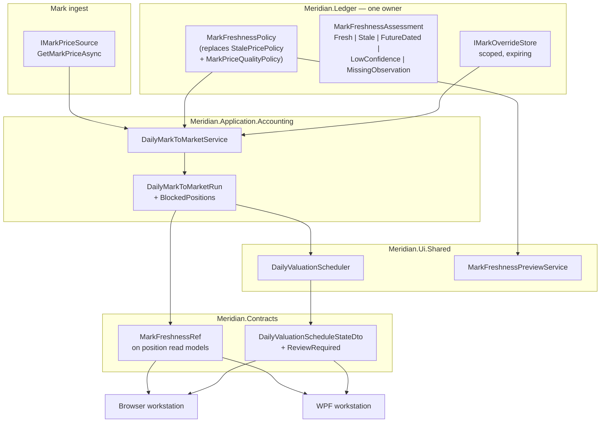

# W10-MARK-001 — Fail-Closed Mark Freshness and Mark-Age Surfacing

**Status:** active
**Owner:** core-team
**Reviewed:** 2026-08-01
**Roadmap row:** `W10-MARK-001` in [`docs/roadmap/data/roadmap-items.yml`](../../roadmap/data/roadmap-items.yml)
**Slate rationale:** [`docs/product/w10-depth-slate-2026-07.md`](../../product/w10-depth-slate-2026-07.md)
**Risk discharged:** `RISK-STALE-MARK-001`

---

## ⚠️ Breaking Change

`StalePricePolicy` is a **public** record in `Meridian.Ledger` whose default posture changes from
permissive to fail-closed, and whose `Assess` stops treating a future-dated mark as fresh.

| Consumer | Location | Migration |
| --- | --- | --- |
| `DailyPortfolioPricingPolicy` | `src/Meridian.Ledger/DailyPortfolioPricingPolicy.cs:16,36,60` | Optional ctor param currently defaults to `StalePricePolicy.Disabled`. Default becomes `MarkFreshnessPolicy.FailClosed`. |
| `AutomatedJournalIntakeRunner` | `src/Meridian.Ui.Shared/Services/AutomatedJournalIntakeRunner.cs:266` | **The only production construction.** Rewritten to build one `MarkFreshnessPolicy`. |
| `DailyValuationPolicyTests` | `tests/Meridian.Tests/Application/Accounting/DailyValuationPolicyTests.cs:61` | `StalePricePolicy_FuturePrice_IsFreshWithZeroAge` **pins the defect** and must be inverted. |
| External constructors | outside this repo | Positional record construction still compiles; behaviour changes. Release-note it. |

The blast radius is much smaller than the row assumes: **one** production construction site.

---

## Scope

**In Scope**
- One freshness owner for marks, replacing the current two half-used controls.
- Fail-closed default, including rejection of future-dated observations.
- A blocked valuation surfacing as review-required with the offending positions named, on both
  workstation lanes.
- Mark age and observation date on the shared position read models.
- A scoped, expiring price override with approval and audit.
- A pre-enablement preview of how many current valuations the new default would block.

**Out of Scope**
- Changing *where* marks come from (`IMarkPriceSource` is untouched).
- Backfilling historical valuations under the new policy.
- `PortfolioPricingRule` (source/method/fair-value-level selection) — different concern.
- The `PositionBlotterViewModel` `MarketTime` defect (see [Adjacent defect](#adjacent-defect-found-during-design)).

**Assumptions**
- `MaximumMarkAgeDays` stays operator-configurable; only its default posture and enforcement change.
- `RISK-STALE-MARK-001` remains the tracked risk; this row does not touch `RISK-SIM-REAL-001`.

**Depth Mode:** `full`

---

## Architectural Overview

### Context Diagram



### Design Decisions

**Decision: consolidate onto `MarkPriceQualityPolicy`'s shape, renamed `MarkFreshnessPolicy`, living in `Meridian.Ledger`.**
*Alternatives:* extend `StalePricePolicy` (it owns the handling enum); or keep both and add a
coordinator.
*Rationale:* `MarkPriceQualityPolicy` already carries every gate the row's criterion 2 says must
survive consolidation — minimum confidence, required observed date, complete coverage — **and it
already rejects future observation dates** (`DailyMarkToMarketService.cs:499-500`), which is exactly
the hole in `StalePricePolicy.Assess`. Extending `StalePricePolicy` would mean re-implementing four
gates; extending the quality policy means adopting one enum. It moves to `Meridian.Ledger` because
that is where `StalePricePolicy` and `DailyPortfolioPricingPolicy` already live, and `Meridian.Ledger`
must not depend on `Meridian.Application`.
*Consequences:* `DailyMarkToMarketService` shrinks — `EvaluateMarkQuality` becomes a thin call. The
`StalePriceHandling.Flag` path, never exercised in production, is preserved but must now be reachable.

**Decision: the assessment is a discriminated result, not a boolean plus an age.**
*Alternatives:* keep `(bool IsStale, int AgeDays, StalePriceHandling Handling)`.
*Rationale:* criterion 1 distinguishes "age outside policy" from "observation date outside policy",
and criterion 3 requires naming *why* each position was blocked. A boolean cannot carry
`FutureDated` vs `Stale` vs `LowConfidence`, and today's clamp-to-zero hides the future-dated case
entirely.
*Consequences:* callers switch rather than branch on a flag; the reason reaches the UI unflattened.

**Decision: block at the run, not per-symbol-skip.**
*Alternatives:* keep skipping the position and continuing the batch.
*Rationale:* today a partially-priced run reaches `DraftReady` with blockers as strings
(`DailyValuationScheduler.cs:468-487` — `Blocked` requires a **null projection**). Criterion 1 says
the default posture blocks rather than accepts; a valuation missing positions *is* an accepted
partial valuation.
*Consequences:* `DailyValuationScheduleStateDto` gains `ReviewRequired`, and the null-projection
guard is replaced by an explicit blocked-position list.

**Decision: overrides are a new store modelled on `IOperatorOverridesStore`, not a policy field.**
*Alternatives:* an `AllowStaleUntil` field on the policy.
*Rationale:* charter §11.5 requires price overrides to be *reviewed or expired*, and criterion 4
binds an override to position, mark observation, valuation date, and policy version. A policy field
is global and cannot carry approval, scope, or expiry. `IOperatorOverridesStore`
(`src/Meridian.Storage/SecurityMaster/`) already implements pending/approve/reject with reviewer
stamping and audit; `ShadowNavOverrideDraft` (`src/Meridian.Ledger/`) is the ledger-side record shape.
*Consequences:* genuinely new code — no price-level override exists anywhere in `src/` today.

---

## Interface & API Contracts

### New — `Meridian.Ledger`

```csharp
/// <summary>Why a mark did not satisfy freshness policy. Ordered most severe first.</summary>
public enum MarkFreshnessVerdict
{
    Fresh,
    /// <summary>Observation date is after the valuation date — not observable as of valuation.</summary>
    FutureDated,
    /// <summary>No observation date and the policy requires one.</summary>
    MissingObservation,
    /// <summary>Observation is older than the policy's maximum age.</summary>
    Stale,
    /// <summary>Provider confidence is below the policy minimum.</summary>
    LowConfidence,
}

/// <summary>
/// The single owner of mark freshness. Replaces <c>StalePricePolicy</c> and
/// <c>MarkPriceQualityPolicy</c>, preserving every non-age gate the latter enforced.
/// </summary>
public sealed record MarkFreshnessPolicy(
    bool Enabled,
    int MaximumAgeDays,
    DailyPortfolioPriceConfidence MinimumConfidence,
    bool RequireObservedDate,
    bool RequireCompleteCoverage,
    StalePriceHandling Handling)
{
    /// <summary>Fail-closed default: enforced, 3 days, Medium confidence, observation required, blocking.</summary>
    public static MarkFreshnessPolicy FailClosed { get; }

    /// <summary>Explicit opt-out. Never the default; construct deliberately.</summary>
    public static MarkFreshnessPolicy Unenforced { get; }

    public MarkFreshnessPolicy EnsureValid();

    /// <summary>Evaluates one mark. Never clamps a negative age to zero.</summary>
    public MarkFreshnessAssessment Assess(MarkPriceQuote quote, DateOnly valuationDate);
}

public sealed record MarkFreshnessAssessment(
    MarkFreshnessVerdict Verdict,
    int AgeDays,
    StalePriceHandling Handling)
{
    public bool IsBlocking { get; }
    public static MarkFreshnessAssessment Fresh(int ageDays);
}
```

```csharp
/// <summary>
/// A reviewed, scoped, expiring authorisation to value one position on a mark that
/// <see cref="MarkFreshnessPolicy"/> would otherwise block. Charter §11.5 requires price overrides
/// to be reviewed or expired, so an override never applies beyond the valuation it was approved for.
/// </summary>
public sealed record MarkFreshnessOverride(
    string OverrideId,
    MarkOverrideScope Scope,
    string Reason,
    string RequestedBy,
    DateTimeOffset RequestedAtUtc,
    string? ApprovedBy,
    DateTimeOffset? ApprovedAtUtc,
    DateOnly ExpiresOn,
    MarkOverrideState State);

/// <summary>Every field is part of the key — an override matches one position on one valuation.</summary>
public sealed record MarkOverrideScope(
    string LedgerBookId,
    string Symbol,
    DateOnly ValuationDate,
    DateOnly MarkObservedOn,
    string PolicyVersion);

public enum MarkOverrideState { Pending, Approved, Rejected, Expired, Consumed }

public interface IMarkOverrideStore
{
    ValueTask<MarkFreshnessOverride?> FindApprovedAsync(MarkOverrideScope scope, CancellationToken ct = default);
    ValueTask<MarkFreshnessOverride> RequestAsync(MarkOverrideScope scope, string reason, string requestedBy, DateOnly expiresOn, CancellationToken ct = default);
    ValueTask<MarkFreshnessOverride> RecordApprovalDecisionAsync(string overrideId, bool approved, string reviewedBy, string? note, CancellationToken ct = default);
    ValueTask<IReadOnlyList<MarkFreshnessOverride>> ListAsync(string ledgerBookId, DateOnly valuationDate, CancellationToken ct = default);
}
```

`PolicyVersion` is what stops an override outliving the rule that justified it: a policy change mints
a new version, and every prior override stops matching. That plus `ExpiresOn` satisfies "cannot
become a standing bypass".

### New — `Meridian.Ui.Shared`

```csharp
/// <summary>Criterion 5 — how many current valuations the new default would block, before enabling it.</summary>
public interface IMarkFreshnessPreviewService
{
    ValueTask<MarkFreshnessPreview> PreviewAsync(
        string ledgerBookId, DateOnly valuationDate, MarkFreshnessPolicy candidate, CancellationToken ct = default);
}

public sealed record MarkFreshnessPreview(
    int PositionsEvaluated,
    int PositionsBlocked,
    IReadOnlyList<BlockedMarkDto> Blocked,
    MarkFreshnessPolicy Candidate);
```

### Modified — `Meridian.Contracts`

```csharp
/// <summary>Freshness of the mark behind a position. Null only where no mark applies.</summary>
public sealed record MarkFreshnessRef(
    DateOnly? ObservedOn,
    int? AgeDays,
    string Verdict,          // MarkFreshnessVerdict name — string for TS/JSON parity
    bool IsBlocking,
    string? OverrideId);
```

Added as one optional member to each of:
- `FundPortfolioPosition` — `FundOperationsDtos.cs:118-135`
- `PortfolioPositionSummary` — `StrategyRunReadModels.cs:369-384`
- `WorkstationTradingPositionRow` — `WorkstationBootstrapDtos.cs:326-335`

**On `WorkstationTradingPositionRow`'s all-strings shape:** its nine members are pre-formatted
display strings, and `MarkPrice` already carries `"—"` for absent. Adding `MarkFreshnessRef` as a
*typed* member is deliberate — `IsBlocking` drives a visual state and `AgeDays` may be compared or
sorted, neither of which survives stringification. Formatting stays in the client. Update the TS
mirror at `src/Meridian.Ui/dashboard/src/types/workstation-3.ts:1232`.

```csharp
public enum DailyValuationScheduleStateDto
{
    NotConfigured, Scheduled, Running, DraftReady, NoAdjustment,
    ReviewRequired,   // NEW — blocked on mark freshness, offending positions named
    Blocked, Failed, Posted,
}
```

Precedent: `TradingAcceptanceGateStatusDto.ReviewRequired`
(`src/Meridian.Strategies/Services/ReconciliationGovernanceService.cs:87`).

### REST surface

```
GET  /api/valuation/{ledgerBookId}/mark-freshness?valuationDate=YYYY-MM-DD
     200 { positionsEvaluated, positionsBlocked, blocked: [...] }

POST /api/valuation/{ledgerBookId}/mark-freshness/preview
     Body   { maximumAgeDays, minimumConfidence, requireObservedDate, requireCompleteCoverage }
     200    { positionsEvaluated, positionsBlocked, blocked: [...], candidate: {...} }

POST /api/valuation/{ledgerBookId}/mark-overrides
     Body   { symbol, valuationDate, markObservedOn, reason, expiresOn }
     201    { overrideId, state: "Pending", ... }
     409    { "error": "an approved override already covers this scope" }

POST /api/valuation/mark-overrides/{overrideId}/decision
     Body   { approved, reviewedBy, note }
     200    { overrideId, state: "Approved" | "Rejected", ... }
     403    { "error": "approver must differ from requester" }
```

Register route constants in `UiApiRoutes.cs` — do **not** map inline. `W10-PERF-001`'s brokerage
performance endpoint is registered inline with no constant, which is precisely why a route-constant
search missed it and the slate initially asserted no performance route existed.

---

## Component Design

### `MarkFreshnessPolicy`

**Namespace:** `Meridian.Ledger` · **Type:** `sealed record` · **Lifetime:** value, carried on `DailyPortfolioPricingPolicy`

**Responsibilities:** evaluate one quote against all gates; order verdicts by severity; never clamp a
negative age; expose a stable `PolicyVersion` for override scoping.

**Key behaviour change:** `Assess` computes `ageDays = valuationDate.DayNumber - observedOn.DayNumber`
and returns `FutureDated` when negative — the current implementation returns fresh with
`Math.Max(0, ageDays)`.

### `DailyMarkToMarketService` (modified)

**Namespace:** `Meridian.Application.Accounting`
**New dependency:** `IMarkOverrideStore overrides`

**Responsibilities:** replace `EvaluateMarkQuality` (`:486-506`) with one `MarkFreshnessPolicy.Assess`
call; on a blocking verdict consult `IMarkOverrideStore.FindApprovedAsync`; record every blocked
position in a new `DailyMarkToMarketRun.BlockedPositions` carrying symbol, verdict, age, observation
date, and override id when consumed.

**Error handling:** an unavailable override store **fails the run** rather than proceeding without
overrides — the fail-closed posture applies to the override lookup itself.

**Note:** `StalePricedSymbols` and `IsBlocked` currently have zero production readers.
`BlockedPositions` supersedes both; delete them rather than leaving a third unread signal.

### `DailyValuationScheduler` (modified)

**Namespace:** `Meridian.Ui.Shared.Services`

Replace the null-projection guard at `:473-487`. New rule: **any** blocking position yields
`ReviewRequired` with the blocked list attached, regardless of whether a partial projection exists.
`Blocked` retains its current meaning (the run could not produce a projection at all).

### `MarkFreshnessPreviewService`

**Namespace:** `Meridian.Ui.Shared.Services` · **Lifetime:** Scoped

Evaluates the candidate policy against today's marks **without** mutating state or consuming
overrides — the preview must not consume a one-shot override. Reuses the same `Assess` call so the
preview cannot drift from enforcement.

---

## Data Flow

### Valuation with a stale mark (fail-closed, no override)

1. `DailyValuationScheduler` triggers a run for a ledger book and valuation date.
2. `DailyMarkToMarketService` pulls each position's quote via `IMarkPriceSource`.
3. `MarkFreshnessPolicy.Assess(quote, valuationDate)` → `Stale`, age 9, `Handling = Block`.
4. `IMarkOverrideStore.FindApprovedAsync(scope)` → `null`.
5. The position is added to `BlockedPositions` with verdict, age, and observation date.
6. The run completes with a non-empty `BlockedPositions`.
7. `DailyValuationScheduler` maps to `ReviewRequired` and attaches the blocked list.
8. Both workstations render review-required with each offending position named (criterion 3).

### Valuation with an approved override

Steps 1–3 as above.
4. `FindApprovedAsync` returns an override whose `Scope` matches symbol, valuation date, observation
   date, **and current policy version**, with `ExpiresOn >= valuationDate` and `State = Approved`.
5. The position is valued; the override transitions to `Consumed`; the position still surfaces its
   `MarkFreshnessRef` with `OverrideId` set, so the UI shows it was overridden rather than fresh.

### Future-dated mark

Steps 1–2 as above.
3. `Assess` → `FutureDated` (negative age, **not** clamped).
4. Blocking regardless of `MaximumAgeDays`, including `0` — a mark not observable as of the valuation
   date is never admissible on age grounds.

---

## XAML Design

### `FundLedgerPage.xaml` — positions grid

**New column:** `Mark age` bound to `MarkFreshness.AgeDays`, with `MarkFreshness.ObservedOn` in the
tooltip.

**Row state triggers on `MarkFreshness.Verdict`:**
- `Fresh` → default foreground
- `Stale` → `#F39C12` amber
- `FutureDated` / `MissingObservation` / `LowConfidence` → `#E74C3C` red
- non-null `OverrideId` → amber with an "overridden" glyph, never green

**Binding note:** `FundLedgerViewModel` binds `FundPortfolioPosition` directly with no intermediate
row type (`FundLedgerViewModel.cs:1971-1992`), so the contract change reaches XAML immediately —
convenient here, but it means the contract addition and the column land in the same change.

---

## Test Plan

**Principle:** the policy is a pure function — test it directly and exhaustively; mock
`IMarkPriceSource` and `IMarkOverrideStore` at the service boundary.

### Unit — `MarkFreshnessPolicy`

| Test | Verifies | Notes |
| --- | --- | --- |
| `Assess_FutureDatedObservation_IsBlockingRegardlessOfMaximumAge` | **inverts** `DailyValuationPolicyTests.cs:61` | `MaximumAgeDays: 0` and `365` |
| `Assess_ObservationOlderThanMaximumAge_IsStale` | age gate | boundary at exactly `MaximumAgeDays` is fresh |
| `Assess_ConfidenceBelowMinimum_IsLowConfidence` | gate survives consolidation | criterion 2 |
| `Assess_MissingObservedDate_WhenRequired_IsMissingObservation` | gate survives consolidation | criterion 2 |
| `Assess_StaleAndLowConfidence_ReportsMostSevereVerdict` | verdict ordering is deterministic | |
| `FailClosed_Default_IsEnabledAndBlocking` | criterion 1 default posture | |
| `EnsureValid_NegativeMaximumAge_Throws` | preserves existing validation | |

### Unit — `DailyMarkToMarketService`

| Test | Verifies |
| --- | --- |
| `RunAsync_BlockingMarkWithoutOverride_AddsToBlockedPositions` |
| `RunAsync_BlockingMarkWithApprovedOverride_ValuesPositionAndMarksConsumed` |
| `RunAsync_OverrideForDifferentValuationDate_DoesNotApply` |
| `RunAsync_OverrideMintedUnderPriorPolicyVersion_DoesNotApply` |
| `RunAsync_ExpiredOverride_DoesNotApply` |
| `RunAsync_OverrideStoreUnavailable_FailsRunRatherThanValuing` |
| `RunAsync_AllMarksFresh_ProducesNoBlockedPositions` |

### Unit — `DailyValuationScheduler`

| Test | Verifies |
| --- | --- |
| `Map_PartialProjectionWithBlockedPositions_IsReviewRequired` | the current null-projection guard's gap |
| `Map_NoProjectionAtAll_RemainsBlocked` | `Blocked` keeps its meaning |
| `Map_NoBlockedPositions_IsDraftReady` | no regression |

### Unit — `IMarkOverrideStore` (file-backed)

| Test | Verifies |
| --- | --- |
| `RequestAsync_ThenApprove_IsFoundByExactScope` |
| `RecordApprovalDecisionAsync_SameActorAsRequester_IsRejected` | approval separation |
| `FindApprovedAsync_AfterExpiry_ReturnsNull` |
| `RequestAsync_DuplicateScopeWithApprovedOverride_Conflicts` |

### Unit — `MarkFreshnessPreviewService`

| Test | Verifies |
| --- | --- |
| `PreviewAsync_CountsBlockedWithoutMutatingState` | criterion 5; **must not consume overrides** |
| `PreviewAsync_UsesSameAssessmentAsEnforcement` | preview cannot drift |

### Contract / UI

| Test | Verifies |
| --- | --- |
| `WorkstationEndpoints_PositionRow_CarriesMarkFreshness` | criterion 4 browser lane |
| `FundLedgerViewModel_BlockedPosition_SurfacesReviewRequired` | criterion 3 desktop lane |

**Execution note:** `dotnet` is unavailable in the authoring environment. Run via
`dotnet test tests/Meridian.Tests -c Release /p:EnableWindowsTargeting=true`, or the manual
`Targeted Test` workflow with `mode=dotnet-filtered` and
`dotnet_filter="FullyQualifiedName~MarkFreshness"`.

---

## Implementation Checklist

**Estimated effort:** Medium — 5–7 days
**Suggested branch:** `feature/w10-mark-001-fail-closed-marks`
**Suggested PR sequence:** three PRs — policy, override store, surfacing — so the breaking default
lands separately from the UI work.

### Phase 1 — Policy (PR 1)
- [ ] Add `MarkFreshnessVerdict`, `MarkFreshnessAssessment`, `MarkFreshnessPolicy` to `Meridian.Ledger`.
- [ ] Implement `Assess` without the negative-age clamp; order verdicts by severity.
- [ ] Point `DailyPortfolioPricingPolicy` at `MarkFreshnessPolicy`, defaulting to `FailClosed`.
- [ ] Rewrite `AutomatedJournalIntakeRunner.cs:266,276-280` to build **one** policy from `MaximumMarkAgeDays`.
- [ ] Replace `EvaluateMarkQuality` with the single `Assess` call.
- [ ] **Invert** `DailyValuationPolicyTests.StalePricePolicy_FuturePrice_IsFreshWithZeroAge`.
- [ ] Delete `StalePricePolicy` / `MarkPriceQualityPolicy`; delete unread `StalePricedSymbols` / `IsBlocked`.
- [ ] Write the seven policy tests.

### Phase 2 — Overrides (PR 2)
- [ ] Add `MarkOverrideScope`, `MarkFreshnessOverride`, `MarkOverrideState`, `IMarkOverrideStore`.
- [ ] File-backed implementation mirroring `IOperatorOverridesStore` (atomic writes, no WAL bypass).
- [ ] Enforce approval separation and `ExpiresOn`.
- [ ] Inject into `DailyMarkToMarketService`; fail the run when the store is unavailable.
- [ ] Map the two override routes with constants in `UiApiRoutes.cs`.
- [ ] Write the override and service tests.

### Phase 3 — Surfacing (PR 3)
- [ ] Add `MarkFreshnessRef` and attach to the three read models; update the TS mirror.
- [ ] Add `ReviewRequired` to `DailyValuationScheduleStateDto`; replace the null-projection guard.
- [ ] Browser: mark-age column and review-required banner naming offending positions.
- [ ] WPF: `FundLedgerPage.xaml` column plus state triggers.
- [ ] `MarkFreshnessPreviewService` and its two routes.
- [ ] Write the scheduler, preview, contract, and UI tests.

### Phase 4 — Wrap-up
- [ ] XML doc comments on every new public type.
- [ ] Structured logging only — no interpolation inside log calls.
- [ ] Update the roadmap row from `planned` with implementation paths and evidence (criterion 6).
- [ ] Note the `RISK-STALE-MARK-001` discharge in the risk register.
- [ ] Release-note the `StalePricePolicy` removal and default flip.

---

## Adjacent defect found during design

**`PositionBlotterViewModel` presents a local clock reading as a market time.**
`src/Meridian.Wpf/ViewModels/PositionBlotterViewModel.cs:841-863` maps
`ExecutionPositionDetailResponse` → `BlotterEntry` and stamps
`MarketTime = TimeOnly.FromDateTime(DateTime.Now)` **at mapping time**. That is the time the row was
built, not when the market data was observed — a column that looks like an observation timestamp and
is not one. It also consumes none of the three shared position read models, so it will not inherit
`MarkFreshnessRef` from Phase 3.

Out of scope here — it is a separate defect in a separate surface — but it is the same class of
problem this row exists to fix, and it should get its own row rather than being folded in silently.

---

## Open Questions

| # | Question | Owner | Impact if unresolved |
| --- | --- | --- | --- |
| 1 | Does `MaximumMarkAgeDays` stay a single scalar, or become per-asset-class? Illiquid instruments plausibly need a longer window than equities. | Product | A single scalar may force the default too loose to be useful, or too tight to enable. |
| 2 | Who may approve a mark override — any operator with the approval role, or a named valuation reviewer? | Product | Determines whether approval separation is role-based or identity-based. |
| 3 | Should an expired-but-unconsumed override auto-renew on request, or always require a fresh submission? | Product | Affects whether operators can quietly keep a bypass alive. |
| 4 | Is a partially-priced valuation ever legitimately postable, or is `ReviewRequired` always terminal until resolved? | Product | Decides whether `ReviewRequired` blocks posting or merely annotates it. |

## Risks

| Risk | Likelihood | Impact | Mitigation |
| --- | --- | --- | --- |
| Fail-closed default blocks a large share of current valuations on day one | **High** | High | Criterion 5's preview is a gate, not a nicety — run it before enabling and size the override backlog. |
| Deleting `StalePricePolicy` breaks an external constructor | Low | Medium | Only one in-repo construction; release-note it and keep the positional shape familiar. |
| The override store becomes a routine bypass | Medium | High | Scope keys plus `ExpiresOn` plus `PolicyVersion` invalidation; report override counts alongside blocked counts. |
| `WorkstationTradingPositionRow` gaining a typed member breaks browser consumers expecting all-strings | Medium | Low | It is an added optional member; update the TS mirror in the same change. |
| Preview consumes one-shot overrides | Low | High | Explicit test — `PreviewAsync_CountsBlockedWithoutMutatingState`. |
