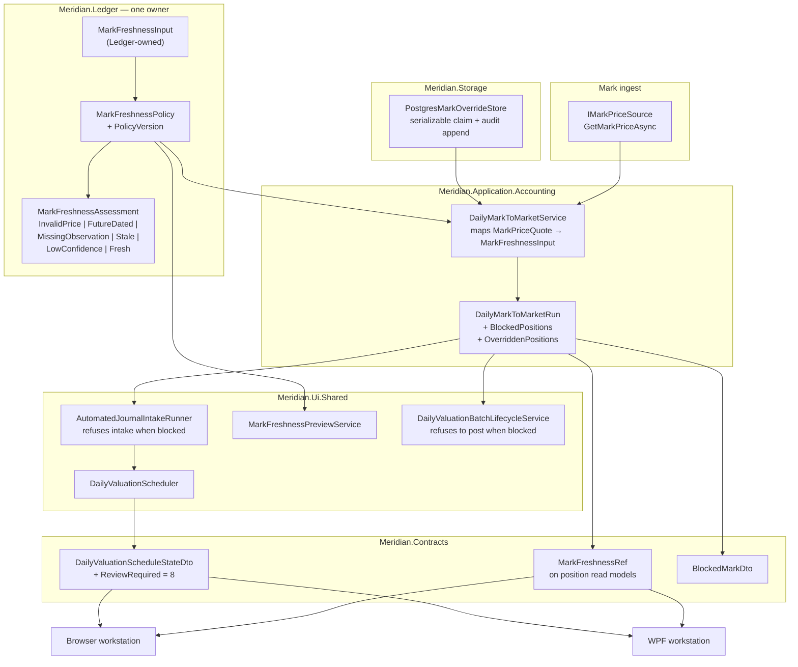

# W10-MARK-001 — Fail-Closed Mark Freshness and Mark-Age Surfacing

**Status:** active
**Owner:** core-team
**Reviewed:** 2026-08-02
**Roadmap row:** `W10-MARK-001` in [`docs/roadmap/data/roadmap-items.yml`](../../roadmap/data/roadmap-items.yml)
**Slate rationale:** [`docs/product/w10-depth-slate-2026-07.md`](../../product/w10-depth-slate-2026-07.md)
**Risk targeted:** `RISK-STALE-MARK-001` — **`status: open`** in
[`docs/roadmap/data/risk-register.yml`](../../roadmap/data/risk-register.yml). This blueprint is a
design, not a delivery. The risk stays open, and the roadmap row stays `planned`, until the
implementation lands with evidence; the discharge is the last item on the Phase 5 checklist, not a
property of this document.

---

## ⚠️ Breaking Change — source-breaking, not merely behavioural

Phase 2 changes the behaviour of **two** public types, and Phase 5 deletes them.

Getting that split right matters to anyone planning against this document: Phase 2 flips the
defaults and retypes the constructors, but both types survive it as `[Obsolete]` shims with
converters and compatibility overloads, exactly as the migration window below promises. Deletion is
the last phase. An earlier revision of this header said Phase 2 deleted them, which would have had
an implementer remove source compatibility two PRs before external callers were told to expect it.

`StalePricePolicy` is a **public** record in `Meridian.Ledger`. Any external caller that names the
type, constructs it, or passes it to `DailyPortfolioPricingPolicy` **fails to compile** — this is not
a case of the same code compiling and behaving differently.

| Consumer | Location | Migration |
| --- | --- | --- |
| `DailyPortfolioPricingPolicy` | `src/Meridian.Ledger/DailyPortfolioPricingPolicy.cs:16,36,60` | Optional ctor param currently defaults to `StalePricePolicy.Disabled`. Parameter type becomes `MarkFreshnessPolicy`, default becomes `MarkFreshnessPolicy.FailClosed`. **This becomes the single authoritative field** — see below. |
| `AutomatedJournalIntakeRunner` | `src/Meridian.Ui.Shared/Services/AutomatedJournalIntakeRunner.cs:266` | **The only production construction.** Rewritten to build one `MarkFreshnessPolicy`. |
| `DailyValuationPolicyTests` | `tests/Meridian.Tests/Application/Accounting/DailyValuationPolicyTests.cs:61` | `StalePricePolicy_FuturePrice_IsFreshWithZeroAge` **pins the defect** and must be inverted. |
| External constructors | outside this repo | **Source-breaking.** See the migration window below. |

**Migration window.** Phase 2 ships `StalePricePolicy` as `[Obsolete]` with a converting
`ToMarkFreshnessPolicy()` and an overload of the `DailyPortfolioPricingPolicy` constructor that
accepts it; Phase 5 removes both. The replacement is mechanical:

```csharp
// before
new DailyPortfolioPricingPolicy(..., new StalePricePolicy(enabled: true, maximumAgeDays: 3, StalePriceHandling.Block));
// after
new DailyPortfolioPricingPolicy(..., MarkFreshnessPolicy.FailClosed with { MaximumAgeDays = 3 });
```

The *in-repo* blast radius is one production construction site. The external blast radius is
unknown, which is why the obsolete shim exists rather than a bare deletion.

### The second break — `MarkPriceQualityPolicy`

`MarkPriceQualityPolicy` is likewise **public** (`DailyMarkToMarketService.cs:60`), with a public
constructor (`:68-73`) and a public `Standard` preset (`:62-66`), and it is positional parameter 8 of
the public `DailyMarkToMarketRequest` constructor (`:208`). Phase 2 deletes it. An earlier draft
listed the deletion in the Phase 2 checklist without a migration entry, which understated the change:
external callers that name the type, use `Standard`, or pass it positionally all stop compiling, and
adding `ValuationRunId` to the same constructor moves the following parameter as well.

Every field maps onto `MarkFreshnessPolicy`, so the replacement is mechanical:

| `MarkPriceQualityPolicy` | `MarkFreshnessPolicy` | Note |
| --- | --- | --- |
| `MaximumAge` (`TimeSpan`) | `MaximumAgeDays` (`int`) | `(int)Math.Floor(maximumAge.TotalDays)` — **not** `Ceiling`; see below |
| `MinimumConfidence` | `MinimumConfidence` | unchanged |
| `RequireObservedDate` | `RequireObservedDate` | unchanged |
| `RequireCompleteCoverage` | `RequireCompleteCoverage` | unchanged |
| *(none)* | future-dated and non-positive rejection | new, unconditional — this is the behaviour change the row exists for |

**Why `Floor`, and why `Ceiling` would have loosened the policy.** An earlier draft used
`Math.Ceiling`, reasoning that a sub-day maximum must not round to zero "which would block every
mark". Both halves were wrong, and the arithmetic settles it. `EvaluateMarkQuality` computes
`age = TimeSpan.FromDays(asOfDate.DayNumber - quote.PriceAsOf.Value.DayNumber)` — **always a whole
number of days** — and blocks on `age > policy.MaximumAge`. `MarkFreshnessPolicy` blocks on
`ageDays > MaximumAgeDays`. So with `MaximumAge = 36h`, a two-day-old mark blocks today
(`48h > 36h`), while `Ceiling(1.5) = 2` yields `2 > 2` → **fresh**: the conversion silently admits a
mark the existing policy rejects. `Floor(1.5) = 1` yields `2 > 1` → blocks, preserving the boundary.

`Floor` is exact across the whole range *because the observed age is always integral*: it is the
identity on whole-day values, and `Floor(0.5) = 0` does not block every mark — `ageDays > 0` admits
same-day observations and blocks anything a day or older, which is exactly what `age > 12h` means
when `age` can only be `0d`, `1d`, `2d`, … A fractional maximum is therefore migrated without
behaviour change rather than rounded to the caller's disadvantage in either direction.

```csharp
// before
new DailyMarkToMarketRequest(policy, periodId, asOf, ccy, positions, actor, reason,
    new MarkPriceQualityPolicy(TimeSpan.FromDays(3), DailyPortfolioPriceConfidence.Medium), bookId);
// after
new DailyMarkToMarketRequest(policy, periodId, asOf, ccy, positions, actor, reason,
    MarkFreshnessPolicy.FailClosed with { MaximumAgeDays = 3,
        MinimumConfidence = DailyPortfolioPriceConfidence.Medium },
    bookId, valuationRunId);
```

Phase 2 ships `MarkPriceQualityPolicy` as `[Obsolete]` with a `ToMarkFreshnessPolicy()` converter and
a `DailyMarkToMarketRequest` constructor overload that accepts it — mirroring the `StalePricePolicy`
window rather than inventing a second convention — and Phase 5 removes both. The overload mints a
`ValuationRunId` when the caller has none, which keeps the compatibility path working while making
the un-migrated caller's runs non-idempotent; that is the correct incentive, and it is noted in the
obsoletion message.

### One policy field, not two

A naive reading of the two migrations above produces the defect this row exists to remove.
`DailyPortfolioPricingPolicy` carries `StalePricePolicy` as its own member
(`DailyPortfolioPricingPolicy.cs:16,36,58-60`) and `DailyMarkToMarketRequest` separately carries
`QualityPolicy` (`DailyMarkToMarketService.cs:208`). Retyping *both* to `MarkFreshnessPolicy` leaves
**two independently supplied freshness policies on one request** — a caller could pass `Unenforced`
in the embedded pricing policy and `FailClosed` on the request, or the reverse, and
`DailyMarkToMarketService` would have to pick one and silently discard the other. That is the same
two-half-used-controls configuration split the row is meant to end, wearing a new type.

So the consolidation is asymmetric on purpose:

- **`DailyPortfolioPricingPolicy.MarkFreshnessPolicy` is the single authoritative field.** It is the
  one that travels with the fund's pricing policy, which is where a freshness rule belongs.
- **`DailyMarkToMarketRequest` loses its policy parameter entirely.** Not retyped — removed. The
  service reads freshness from `request.Policy.MarkFreshnessPolicy` and from nowhere else, so there
  is no second value to reconcile and no precedence rule to document or get wrong.
- **Both compatibility overloads map inward.** A caller passing a legacy `MarkPriceQualityPolicy`
  positionally, or a legacy `StalePricePolicy` on the pricing policy, has it converted and folded
  into that one field. Where a legacy caller supplies both, the overload **throws** rather than
  choosing: two conflicting freshness intentions is a caller bug, and silently honouring one is how
  the original split survived this long.

---

## Scope

**In Scope**
- One freshness owner for marks, replacing the current two half-used controls.
- Fail-closed default, including rejection of future-dated observations and non-positive prices.
- A valuation carrying any blocked mark surfacing as review-required with the offending positions
  named, on both workstation lanes — enforced where drafts are created and again where they post,
  not only in the schedule state.
- Mark age and observation date on the shared position read models, **with a specified producer and
  persisted join for each**.
- A scoped, expiring, atomically consumed price override with approval and durable audit.
- A pre-enablement preview of how many current valuations the new default would block, landing
  **before** the default flips.

**Out of Scope**
- Changing *where* marks come from (`IMarkPriceSource` is untouched).
- Backfilling historical valuations under the new policy.
- `PortfolioPricingRule` (source/method/fair-value-level selection) — different concern.

**Assumptions**
- `MaximumMarkAgeDays` stays operator-configurable; only its default posture and enforcement change.
- `RISK-STALE-MARK-001` remains the tracked risk; this row does not touch `RISK-SIM-REAL-001`.

**Depth Mode:** `full`

---

## Architectural Overview

### Context Diagram



### Design Decisions

**Decision: consolidate onto `MarkPriceQualityPolicy`'s shape, renamed `MarkFreshnessPolicy`, in `Meridian.Ledger` — taking a Ledger-owned input, not `MarkPriceQuote`.**

*Rationale:* `MarkPriceQualityPolicy` already carries every gate criterion 2 says must survive
consolidation — minimum confidence, required observed date, complete coverage — **and it already
rejects future observation dates** (`DailyMarkToMarketService.cs:499-500`), which is exactly the hole
in `StalePricePolicy.Assess`. Extending `StalePricePolicy` would mean re-implementing four gates to
gain one enum.

*The layering constraint is real, and the fix is smaller than it looks.* `Meridian.Ledger.csproj:9-12`
references **only** `Meridian.Core` and `Meridian.FSharp.Ledger`; `Meridian.Application.csproj:58`
references `Meridian.Ledger`. Taking `MarkPriceQuote` — declared in `Meridian.Application.Accounting`
at `DailyMarkToMarketService.cs:24-53` — in a Ledger-hosted policy would invert that graph and would
not compile.

But **Ledger already owns both of the quote's non-primitive field types**: `FairValueLevel`
(`FairValueLevel.cs:8`) and `DailyPortfolioPriceConfidence` (`DailyPortfolioPriceMark.cs:7`), and
`DailyMarkToMarketService.cs:3` already does `using Meridian.Ledger;`. So the policy takes a small
Ledger-owned input record and the application service maps into it at the call site. **No type moves
down, no lower project (Contracts, Domain, Core) gains an enum it should not have, and the migration
plan does not grow a project-graph change.**

*Consequences:* one mapping expression in `DailyMarkToMarketService`; the policy stays a pure
function of Ledger-owned values and is trivially testable.

**Decision: the assessment is a discriminated result with a *nullable* age, and `InvalidPrice` is a first-class verdict.**

*Rationale:* criterion 1 distinguishes "age outside policy" from "observation date outside policy",
and criterion 3 requires naming *why* each position was blocked. Two specifics follow:

- **`AgeDays` must be `int?`.** `MissingObservation` has no age. A non-nullable field forces an
  implementation to invent `0`, which reads as *today* everywhere it is sorted, logged, or rendered —
  the contract-side `MarkFreshnessRef` already concedes this with `int?`.
- **`InvalidPrice` is not optional, and it is the *first* check.** `EvaluateMarkQuality`
  (`DailyMarkToMarketService.cs:486-506`) tests `quote.Price <= 0m` at `:491` **before** the
  `policy is null` short-circuit at `:493`. It is therefore the only gate that fires when no quality
  policy is configured at all, and it runs entirely outside the `StalePricePolicy.Assess` block at
  `:366-383`. Folding freshness into one policy without an invalid-price verdict would let a zero
  mark through in precisely the configuration that has no other protection, and would turn a
  negative mark into a later exception instead of an operator-visible blocked position.

*Verdict severity order, most severe first:* `InvalidPrice`, `FutureDated`, `MissingObservation`,
`Stale`, `LowConfidence`, `Fresh`.

**Decision: fail closed at draft intake and at the posting boundary — not by flipping a schedule state.**

*This reverses the previous draft, which is worth stating plainly: a schedule-state change cannot be
the control, because nothing on the posting path reads it.*

- `DailyValuationBatchLifecycleService.ApproveAndPostAsync` (`:28-231`) **never reads
  `schedule.State`.** It validates scope, fund-profile match, non-empty `JournalEntryIds`, and
  per-draft preparer/approver and status — then posts every retained draft. State is *written* at
  `:203` as a **consequence** of posting, never as a precondition.
- `AutomatedJournalIntakeRunner:295-307` persists drafts **before** `DailyValuationScheduler:436-458`
  maps a result to a state at all, and the ids handed on at `:541` are collected from both `Created`
  and `Skipped`.
- `MarkPriceQualityPolicy.Standard` sets `RequireCompleteCoverage: false`
  (`DailyMarkToMarketService.cs:65`), so the partial-coverage branch at `:419` — which collects
  rejects into `unpriced` and lets the surviving marks build approvals at `:480` — **is the default
  path, not an edge case.**

So a partially priced valuation reaches the ledger today, and would continue to under a
state-only change. The block goes in two places: `AutomatedJournalIntakeRunner` refuses to persist
drafts while `BlockedPositions` is non-empty, and `ApproveAndPostAsync` refuses to post a batch whose
run carried blocked positions. The schedule state becomes the *report* of that refusal, not the
mechanism.

*Consequences:* two enforcement points and a test at each. The schedule state is still needed for the
operator surface, but it is no longer load-bearing.

**Decision: overrides are a new Postgres-backed store, claimed atomically, modelled on `PostgresOperatorOverridesStore`.**

*This also reverses the previous draft.* It proposed "an atomically rewritten file-backed
current-state store" modelled on `IOperatorOverridesStore` — but `IOperatorOverridesStore`
(`Storage/SecurityMaster/IOperatorOverridesStore.cs:10-31`) **has no file-backed implementation at
all**, only `PostgresOperatorOverridesStore` and a `NullOperatorOverridesStore` fallback.
`AtomicFileWriter` is not used anywhere near it.

The precedent that actually answers the design is
`PostgresOperatorOverridesStore.RecordApprovalDecisionAsync` (`:166-255`), which runs read → guard →
transition → audit-append **inside a single `IsolationLevel.Serializable` transaction** over a
`SELECT … FOR UPDATE` row lock (`:188-192`, `:326`), rejecting a non-`Pending` state at `:200-207`.
`PatchAsync` adds compare-and-swap on `expectedCanonicalVersion`, throwing
`OperatorOverrideCanonicalVersionConflictException`.

That single-transaction shape answers three findings at once — atomic one-shot consumption,
expiry evaluated at the moment of use, and an audit row written in the same transaction as the state
change (`:212-242`, `SecurityOverrideAuditEntryDto` at
`Contracts/SecurityMaster/OperatorOverrides.cs:15-23`).

*Ledger-side alternative for the audit chain:* `FundAdministrationEventLog`
(`Ledger/FundAdministrationEventLog.cs:12-27`, `:43-97`) is SHA-256 hash-chained with no mutate or
delete API, a `lock (_gate)` making read-tail-hash → compute → enqueue atomic, and `VerifyIntegrity`.
Record shape at `FundAdministrationEvent.cs:63-74`.

*Not a precedent:* `ShadowNavOverrideDraft` (`ShadowNavOverrideDraft.cs:6-19`) has **no store, no
persistence, and no consumer anywhere in `src/`** — its only producer is
`ShadowNavValidationReport.CreateOverrideDraft`. The previous draft cited it; it should not have.

---

## Interface & API Contracts

### New — `Meridian.Ledger`

```csharp
/// <summary>
/// The subset of a mark the freshness policy needs, expressed entirely in types
/// <c>Meridian.Ledger</c> already owns. The application layer maps its own
/// <c>MarkPriceQuote</c> into this at the call site, so the policy can live in Ledger
/// without Ledger referencing Application.
/// </summary>
public readonly record struct MarkFreshnessInput(
    decimal Price,
    DateOnly? ObservedOn,
    DailyPortfolioPriceConfidence Confidence);

/// <summary>Why a mark did not satisfy freshness policy. Ordered most severe first.</summary>
public enum MarkFreshnessVerdict
{
    /// <summary>
    /// No quote at all — <c>IMarkPriceSource.GetMarkPriceAsync</c> returned null. Most severe,
    /// and like <see cref="InvalidPrice"/> it has no policy that can switch it off.
    ///
    /// Today an absent quote never reaches quality assessment: `DailyMarkToMarketService.cs:339-347`
    /// records a `MarkPriceRejection` and `continue`s before `EvaluateMarkQuality` is called. Under
    /// the explicitly supported `RequireCompleteCoverage: false` path the surviving positions then
    /// build and retain a partial draft, so a position with **no mark** is treated more permissively
    /// than one with a stale mark. Representing absence as a blocking assessment is what puts it in
    /// front of the intake guard; the run is `ReviewRequired` naming that position, rather than
    /// `Blocked` only in the degenerate case where every mark is missing.
    ///
    /// Produced by <c>MarkFreshnessPolicy.AssessUnavailable</c>, not by <c>Assess</c> — see the note
    /// on that method for why absence needs its own entry point rather than a sentinel price.
    /// </summary>
    Unavailable,
    /// <summary>Price is zero or negative. Checked before every policy gate, and enforced even
    /// when freshness is unenforced — it is the only gate with no policy to switch it off.</summary>
    InvalidPrice,
    /// <summary>Observation date is after the valuation date — not observable as of valuation.</summary>
    FutureDated,
    /// <summary>No observation date and the policy requires one.</summary>
    MissingObservation,
    /// <summary>Observation is older than the policy's maximum age.</summary>
    Stale,
    /// <summary>Provider confidence is below the policy minimum.</summary>
    LowConfidence,
    Fresh,
}

/// <summary>
/// The single owner of mark freshness. Replaces <c>StalePricePolicy</c> and
/// <c>MarkPriceQualityPolicy</c>, preserving every gate the latter enforced including the
/// unconditional positive-price check.
/// </summary>
public sealed record MarkFreshnessPolicy(
    bool Enabled,
    int MaximumAgeDays,
    DailyPortfolioPriceConfidence MinimumConfidence,
    bool RequireObservedDate,
    bool RequireCompleteCoverage,
    StalePriceHandling Handling)
{
    /// <summary>Fail-closed default: enforced, 3 days, Medium confidence, observation required, blocking.</summary>
    public static MarkFreshnessPolicy FailClosed { get; }

    /// <summary>Explicit opt-out of the *policy* gates. Never the default; construct deliberately.
    /// Does not disable the positive-price check.</summary>
    public static MarkFreshnessPolicy Unenforced { get; }

    /// <summary>
    /// Deterministic identity of this policy's governing configuration, derived from every
    /// member above. Any change to any member yields a different version, which is what makes a
    /// policy change invalidate every override minted under the prior rule. Derivation is a
    /// stable hash of the ordered field values — never a hand-maintained constant, and never
    /// a mutable identifier assigned at configuration time.
    /// </summary>
    public string PolicyVersion { get; }

    public MarkFreshnessPolicy EnsureValid();

    /// <summary>Evaluates one mark. Never clamps a negative age to zero.</summary>
    public MarkFreshnessAssessment Assess(MarkFreshnessInput mark, DateOnly valuationDate);

    /// <summary>
    /// The verdict for a position with **no quote at all** — <c>GetMarkPriceAsync</c> returned null.
    ///
    /// A separate entry point rather than a nullable parameter on <see cref="Assess"/>, because
    /// <see cref="MarkFreshnessInput"/> carries a non-nullable <c>decimal Price</c> and a
    /// <c>Confidence</c>: absence simply cannot be expressed in it. Without this method the caller
    /// would have to invent a price and a confidence to get an answer, or construct a
    /// <see cref="MarkFreshnessAssessment"/> outside the policy — and policy output assembled by
    /// callers is how the two-half-used-controls split started.
    ///
    /// Returns <see cref="MarkFreshnessVerdict.Unavailable"/> with a null <c>AgeDays</c> (there is no
    /// observation to age) and <see cref="StalePriceHandling.Block"/>, **regardless of
    /// <c>Enabled</c>** — the same posture as the positive-price check, and the reason the
    /// <c>Unenforced</c> behaviour is not ambiguous: an unenforced *policy* still cannot make a mark
    /// that does not exist admissible.
    /// </summary>
    public MarkFreshnessAssessment AssessUnavailable(DateOnly valuationDate);
}

public sealed record MarkFreshnessAssessment(
    MarkFreshnessVerdict Verdict,
    /// <summary>Null when no observation date exists — never a zero standing in for one.</summary>
    int? AgeDays,
    StalePriceHandling Handling)
{
    public bool IsBlocking { get; }

    /// <summary>
    /// The age is nullable here too, and deliberately so. With `RequireObservedDate` false, a
    /// positive high-confidence quote carrying no observation date is **`Fresh` with a null age** —
    /// the policy was told not to require the date, so its absence is not a defect, but nothing
    /// about that makes the mark zero days old. An `int`-only factory would leave an implementer
    /// either fabricating a same-day age, which is the exact "null must never become zero" rule
    /// this record states one line above, or bypassing the factory and losing its guarantees.
    /// </summary>
    public static MarkFreshnessAssessment Fresh(int? ageDays);
}
```

`PolicyVersion` must cover **every** field, not only the age. A change to `MinimumConfidence` that
left the version untouched would leave overrides standing against a rule that no longer justifies
them — that is the whole reason the field exists, and the invalidation test suite asserts one case
per member.

### New — override store

```csharp
/// <summary>
/// A reviewed, scoped, expiring authorisation to value one position on a mark that
/// <see cref="MarkFreshnessPolicy"/> would otherwise block. Charter §11.5 requires price overrides
/// to be reviewed or expired, so an override never applies beyond the valuation it was approved for.
/// </summary>
public sealed record MarkFreshnessOverride(
    string OverrideId,
    MarkOverrideScope Scope,
    /// <summary>
    /// The mark this authorisation is *of*, captured at request time and stored on the row. Not
    /// optional: without it the reviewer list cannot show what is being authorised after the request
    /// transaction ends, and <see cref="IMarkOverrideStore.TryClaimAsync"/> has nothing to compare
    /// the current fingerprint against — which would leave the quote binding described below as
    /// prose with no mechanism.
    /// </summary>
    MarkQuoteEvidence QuoteEvidence,
    string Reason,
    string RequestedBy,
    DateTimeOffset RequestedAtUtc,
    string? ApprovedBy,
    DateTimeOffset? ApprovedAtUtc,
    DateOnly ExpiresOn,
    MarkOverrideState State);

/// <summary>
/// Every field is part of the key. The position triple mirrors
/// <c>MarkToMarketCarryingValueKey</c> (<c>DailyMarkToMarketService.cs:115-143</c>, used at
/// <c>DailyValuationPositionService.cs:339-345</c>) so an override addresses exactly the position
/// the valuation engine addresses — <c>SecurityId</c> and <c>FinancialAccountId</c> participate,
/// which is why symbol alone is not enough.
/// </summary>
public sealed record MarkOverrideScope(
    /// <summary>
    /// <c>Guid</c>, matching <c>DailyMarkToMarketRequest.LedgerBookId</c>
    /// (<c>DailyMarkToMarketService.cs:209</c>) and the daily-valuation schedule. A <c>string</c>
    /// here would make the scope key sensitive to textual form: uppercase, braced, and
    /// hyphen-variant renderings of one book are distinct index entries, so an override requested
    /// through one representation would not match the claim's canonical one, and several "active"
    /// overrides could occupy the same logical scope. The route segment is parsed to
    /// <c>Guid</c> at the endpoint, not carried as text.
    /// </summary>
    Guid LedgerBookId,
    Guid? SecurityId,
    string Symbol,
    string? FinancialAccountId,
    DateOnly ValuationDate,
    /// <summary>
    /// Null when the mark carried no observation date at all. `MissingObservation` is a blocking
    /// verdict, so an override must be expressible for it; a non-nullable field would force the
    /// caller to invent a date that then fails exact matching. Null participates in scope
    /// equality as a value — it means "the mark with no observation date", not "any date".
    /// </summary>
    DateOnly? MarkObservedOn,
    string PolicyVersion);

/// <summary>
/// Who consumed an override and as part of which valuation. Without this the audit row can record
/// that an authorisation became <see cref="MarkOverrideState.Consumed"/> but not where it was used,
/// which is not durable evidence — a claim followed by a failed run, or several reruns of the same
/// valuation date, would be indistinguishable.
/// </summary>
public sealed record MarkOverrideConsumption(
    string Actor,
    string ValuationRunId,
    string? CorrelationId);

public enum MarkOverrideState
{
    Pending, Approved, Rejected, Expired, Consumed,
    /// <summary>
    /// The approval was for a mark that has since changed. Terminal, and distinct from
    /// <see cref="Expired"/> so the audit trail says *why* the authorisation ended — a provider
    /// re-quote is not a lapse of time, and an operator asked to re-request needs to know which.
    /// </summary>
    EvidenceSuperseded,
}

public interface IMarkOverrideStore
{
    /// <summary>
    /// Atomically claims an approved, unexpired override for this exact scope and transitions it
    /// to <see cref="MarkOverrideState.Consumed"/>, returning null when none applies. Read, guard,
    /// transition, and audit-append happen in one serializable transaction over a row lock, so a
    /// retry or a concurrent run cannot both claim the same one-shot authorisation.
    ///
    /// Expiry is evaluated against <paramref name="nowUtc"/> — the moment of use — not against the
    /// valuation date, which would leave a historical override usable forever on later reruns. An
    /// approved row found past its expiry is transitioned to
    /// <see cref="MarkOverrideState.Expired"/> and audited in the same transaction rather than
    /// merely skipped; see "Expiry is a transition, not a filter" below.
    ///
    /// **Idempotent per run.** <paramref name="consumption"/> carries a stable
    /// <c>ValuationRunId</c>, and a row already <c>Consumed</c> by that same run id is returned
    /// again rather than refused. Without this a run that claims one override and then blocks on a
    /// *later* position strands the first authorisation: the retry finds it consumed, returns null,
    /// and the valuation can never complete even though no draft was ever retained. A different run
    /// id still gets null — the one-shot guarantee holds across runs, which is what it is for.
    ///
    /// **Idempotency does not exempt the evidence check.** The re-return applies only when
    /// <paramref name="currentEvidence"/> still matches the fingerprint stored on the row. A retry
    /// can be minutes or hours after the first claim, and the provider may have re-quoted in
    /// between; returning the consumed row unconditionally would value the *new* mark under an
    /// approval given for the *old* one — the precise substitution the fingerprint exists to stop,
    /// reached through the recovery path instead of the claim path. The `EvidenceSuperseded`
    /// transition does not cover it either, because that only applies to rows still `Approved`.
    ///
    /// On mismatch the consumed row is left `Consumed` — it was genuinely used, and rewriting its
    /// terminal state would falsify the audit — and the claim returns null, so the position blocks
    /// and a fresh request is made against the new mark. The audit entry records
    /// `evidence-changed-on-retry`, distinct from `evidence-changed`, because the operator question
    /// differs: an approval was already spent on a mark that has since moved.
    /// </summary>
    /// <param name="currentEvidence">
    /// The mark being claimed against, **now**. Required, and the reason the comparison below can
    /// happen at all: `MarkOverrideScope` deliberately omits price, source, confidence, and evidence
    /// identity, so without this argument the store holds a stored fingerprint and has nothing to
    /// compare it with — a provider that changes a quote while keeping its observation date would
    /// still match the approved scope, and the `evidence-changed` audit could never fire. The
    /// caller passes evidence it derived from the same quote it is about to value the position on,
    /// never a value echoed back from a request body.
    /// </param>
    ValueTask<MarkFreshnessOverride?> TryClaimAsync(
        MarkOverrideScope scope, MarkQuoteEvidence currentEvidence,
        MarkOverrideConsumption consumption, DateTimeOffset nowUtc,
        LedgerTenantScope expectedTenant, CancellationToken ct = default);

    /// <summary>
    /// Non-consuming read for preview and display. Never transitions state.
    ///
    /// Takes <paramref name="currentEvidence"/> for the same reason <see cref="TryClaimAsync"/>
    /// does, and applies the same fingerprint comparison: an approved row whose stored evidence no
    /// longer matches the mark on offer would be **refused** by a claim, so a preview that omits the
    /// check counts it as an authorisation that will hold and overstates how many positions the flip
    /// covers. That preview is the evidence the Phase 2 gate is weighed against, so overcounting
    /// there argues for a rollout on numbers the rollout itself will not reproduce.
    ///
    /// It must **not** transition the row to `EvidenceSuperseded` on a mismatch — it returns null
    /// and leaves the state alone. Recording that transition is the claim path's job; a preview that
    /// mutates is no longer a preview, and previews run speculatively and repeatedly.
    /// </summary>
    ValueTask<MarkFreshnessOverride?> PeekApprovedAsync(
        MarkOverrideScope scope, MarkQuoteEvidence currentEvidence, DateTimeOffset nowUtc,
        LedgerTenantScope expectedTenant, CancellationToken ct = default);

    /// <summary>
    /// <paramref name="quoteEvidence"/> pins what was actually reviewed; see "An approval is of a
    /// mark, not of a slot" below.
    ///
    /// <paramref name="expiresOn"/> is **validated against a server-owned window**, not accepted as
    /// given: it must be on or after <c>max(scope.ValuationDate, nowUtc.Date)</c> and no later than
    /// <c>nowUtc.Date + MarkOverridePolicy.MaximumLifetime</c>. The lower bound takes the later of
    /// the two because expiry is evaluated at time of use: for a historical valuation date, a bound
    /// of `ValuationDate` alone admits an `expiresOn` already in the past, so the request inserts as
    /// `Pending` and the first decision or claim immediately expires it — an override that reaches
    /// the reviewer queue unusable, which wastes the reviewer rather than protecting anything. Without that ceiling a requester can
    /// submit <c>9999-12-31</c>, and once approved the authorisation for that exact valuation stays
    /// claimable indefinitely — a standing bypass, which is the one thing the roadmap criterion
    /// requiring overrides to expire or be re-reviewed exists to prevent. A date outside the window
    /// is rejected at request time rather than silently clamped, so the requester learns the rule.
    /// </summary>
    ValueTask<MarkFreshnessOverride> RequestAsync(
        MarkOverrideScope scope, MarkQuoteEvidence quoteEvidence, string reason, string requestedBy,
        DateOnly expiresOn, DateTimeOffset nowUtc, LedgerTenantScope expectedTenant,
        CancellationToken ct = default);

    /// <summary>
    /// Reviewer comes from the authenticated principal at the endpoint, never from a request body.
    /// <paramref name="expectedTenant"/> is validated **against the stored row inside the same
    /// transaction** before any state changes: the decision route carries only an override id, so
    /// without it a caller authorised for one tenant could act on another tenant's override by
    /// guessing the id. Passing the scope in rather than pre-checking it also closes the window
    /// between a separate read and the mutation.
    ///
    /// **Expiry is checked here too, not only on the claim and request paths.** A request can sit
    /// pending past its own <c>ExpiresOn</c>; without a guard the reviewer receives a successful
    /// <c>Approved</c> response for an authorisation that the very first claim then transitions to
    /// <see cref="MarkOverrideState.Expired"/> without authorising anything. The reviewer believes
    /// they unblocked the valuation and they did not. So an expired pending row is transitioned and
    /// audited inside this transaction and the decision is **refused**, telling the reviewer to ask
    /// the requester for a fresh request rather than silently recording a decision that cannot take
    /// effect.
    /// </summary>
    ValueTask<MarkFreshnessOverride> RecordApprovalDecisionAsync(
        string overrideId, bool approved, string reviewedBy, string? note, DateTimeOffset nowUtc,
        LedgerTenantScope expectedTenant, CancellationToken ct = default);

    ValueTask<IReadOnlyList<MarkFreshnessOverride>> ListAsync(
        Guid ledgerBookId, DateOnly valuationDate, LedgerTenantScope expectedTenant,
        CancellationToken ct = default);

    /// <summary>Pending requests awaiting a decision, for the reviewer's queue.</summary>
    ValueTask<IReadOnlyList<MarkFreshnessOverride>> ListPendingAsync(
        Guid ledgerBookId, LedgerTenantScope expectedTenant, CancellationToken ct = default);

    /// <summary>Append-only lifecycle history: request, approve, reject, claim, expire.</summary>
    ValueTask<IReadOnlyList<MarkOverrideAuditEntry>> ReadAuditTrailAsync(
        string overrideId, LedgerTenantScope expectedTenant, CancellationToken ct = default);
}

/// <summary>
/// Server-owned bounds on how long a requested override may remain claimable. Constants, not
/// operator input — an override whose lifetime the requester chooses is not a bounded exception.
/// </summary>
public static class MarkOverridePolicy
{
    /// <summary>Maximum days between the request and <c>ExpiresOn</c>.</summary>
    public static TimeSpan MaximumLifetime { get; } = TimeSpan.FromDays(7);
}

/// <summary>
/// An immutable snapshot of the mark an override was requested against, so an approver can see
/// what they are authorising and a later claim can confirm it is still the same mark.
/// </summary>
public sealed record MarkQuoteEvidence(
    decimal Price,
    string Source,
    string EvidenceReference,
    DailyPortfolioPriceConfidence Confidence,
    MarkFreshnessVerdict BlockingVerdict,
    /// <summary>Hash over the fields above, compared at claim time.</summary>
    string Fingerprint);

// These are store and domain records, not wire types. The override routes return
// `quoteEvidence` and `state`, and returning these directly would either serialize
// `DailyPortfolioPriceConfidence` and `MarkFreshnessVerdict` as **numbers** - the standard UI
// endpoint JSON options add no global enum-string converter - or force a `Meridian.Contracts`
// dependency on `Meridian.Ledger`, which the layer graph does not allow. `MarkFreshnessRef`
// already settled the convention by carrying its verdict as a string for TS/JSON parity, so
// the boundary keeps it:
public sealed record MarkQuoteEvidenceDto(
    decimal Price, string Source, string EvidenceReference,
    string Confidence,          // DailyPortfolioPriceConfidence name
    string BlockingVerdict,     // MarkFreshnessVerdict name
    string Fingerprint);

public sealed record MarkFreshnessOverrideDto(
    string OverrideId, MarkOverrideScopeDto Scope, MarkQuoteEvidenceDto QuoteEvidence,
    string Reason, string RequestedBy, DateTimeOffset RequestedAtUtc, DateOnly ExpiresOn,
    string State);              // MarkOverrideState name

public sealed record MarkOverrideAuditEntryDto(
    string OverrideId, string? FromState, string ToState, string Actor,
    DateTimeOffset OccurredAtUtc, string? Note, string? ValuationRunId, string? CorrelationId);

// The mapping lives in `Meridian.Ui.Shared`, which already references both sides. A numeric
// enum on this boundary would not fail loudly - it would render as `3` in the reviewer queue
// and in the TS mirror, which is why this is settled here rather than left to the endpoint.

public sealed record MarkOverrideAuditEntry(
    string OverrideId,
    /// <summary>
    /// Null on the creation entry, and only there. <see cref="MarkOverrideState"/> begins at
    /// <c>Pending</c>, so a newly requested override has no prior state: a non-nullable field would
    /// force the store either to omit the request from the trail — losing the event the audit
    /// contract explicitly promises to retain — or to write a <c>Pending → Pending</c> transition
    /// that never happened. Null says "this row came into existence here", which is the truth.
    /// </summary>
    MarkOverrideState? FromState,
    MarkOverrideState ToState,
    string Actor,
    DateTimeOffset OccurredAtUtc,
    string? Note,
    /// <summary>Set on the claim transition, so the trail says where the authorisation was used.</summary>
    string? ValuationRunId,
    string? CorrelationId);
```

**On `LedgerTenantScope`.** It is a **new** value in `Meridian.Contracts`, not an existing type.
`WorkstationTenantContext` (`src/Meridian.Ui.Shared/Endpoints/WorkstationTenantContext.cs:14`) is the
only value carrying tenant and company today, and it cannot be used here: `PostgresMarkOverrideStore`
lives in `Meridian.Storage`, and `Meridian.Ui.Shared` already references `Meridian.Storage`
(`Meridian.Ui.Shared.csproj:53`), so depending on it from the store would invert that edge and the
contract would be unimplementable in its named layer. `Meridian.Storage` already references
`Meridian.Contracts` (`Meridian.Storage.csproj:39`), so a scope value defined there is visible to
both. The endpoint constructs it from the resolved `WorkstationTenantContext`; the store never sees
a UI type.

```csharp
/// <summary>Normalised tenant and company ownership, passed to any store operation that must
/// prove the stored row belongs to the caller's scope.</summary>
public readonly record struct LedgerTenantScope(string TenantId, string CompanyId);
```

**Note on scope equality.** `MarkToMarketCarryingValueKey` normalises `Symbol` to trimmed upper case
and blank `FinancialAccountId` to null, and its equality is the record default. `MarkOverrideScope`
must normalise identically at construction, or a case difference in `FinancialAccountId` silently
mints a distinct key and an override quietly stops matching. Mirror the normalisation; do not
restate it.

### New — `Meridian.Ui.Shared`

```csharp
/// <summary>Criterion 5 — how many current valuations the new default would block, before enabling it.</summary>
public interface IMarkFreshnessPreviewService
{
    ValueTask<MarkFreshnessPreview> PreviewAsync(
        Guid ledgerBookId, DateOnly valuationDate, MarkFreshnessPolicy candidate, CancellationToken ct = default);
}

public sealed record MarkFreshnessPreview(
    int PositionsEvaluated,
    int PositionsBlocked,
    IReadOnlyList<BlockedMarkDto> Blocked,
    /// <summary>
    /// Positions the candidate policy would block but an approved override already covers. Reported
    /// separately because a count of blockers alone is not a measure of policy pressure: once
    /// overrides exist, a book with forty standing authorisations previews as clean, and the
    /// operator sizing the backlog — or the reviewer asking whether overrides have become routine —
    /// sees nothing. The risk mitigation below requires override counts beside blocked counts;
    /// this is where they come from.
    /// </summary>
    int PositionsOverridden,
    IReadOnlyList<OverriddenMarkDto> Overridden,
    MarkFreshnessPolicy Candidate);
```

The preview uses `PeekApprovedAsync`, never `TryClaimAsync` — a preview that consumed a one-shot
authorisation would be a governance defect, not merely a bug. `PositionsOverridden` is therefore what
*would* be tolerated on a real run, not a record that anything was consumed.

For "*would* be tolerated" to be true, the peek has to apply the same **evidence fingerprint** check
the claim does, which is why it takes `currentEvidence`. Without it the preview counts approvals a
real run would refuse as `EvidenceSuperseded`, and `PositionsOverridden` overstates the cover — on
the very number the Phase 2 gate is decided against.

### Modified — `Meridian.Contracts`

```csharp
/// <summary>Freshness of the mark behind a position. Null only where no mark applies.</summary>
public sealed record MarkFreshnessRef(
    DateOnly? ObservedOn,
    int? AgeDays,
    string Verdict,          // MarkFreshnessVerdict name — string for TS/JSON parity
    bool IsBlocking,
    string? OverrideId);

/// <summary>One position a valuation could not price, named rather than flattened to a string.</summary>
public sealed record BlockedMarkDto(
    string Symbol,
    Guid? SecurityId,
    string? FinancialAccountId,
    string Verdict,
    int? AgeDays,
    DateOnly? ObservedOn,
    string? OverrideId);

/// <summary>
/// One position the policy blocked and an override authorised anyway. A separate type rather than a
/// flag on <see cref="BlockedMarkDto"/>, because the two are read by different consumers for
/// opposite reasons — blocked positions gate, overridden positions are the bypass ledger — and a
/// shared type invites a caller to count `blockedMarks.Length` and get a number that silently
/// includes tolerated failures.
/// </summary>
public sealed record OverriddenMarkDto(
    string Symbol,
    Guid? SecurityId,
    string? FinancialAccountId,
    string Verdict,
    int? AgeDays,
    DateOnly? ObservedOn,
    string OverrideId,
    string ApprovedBy,
    DateOnly ExpiresOn);
```

**On the existing flattened blockers.** `DailyValuationScheduleStatusDto:35` already carries
`IReadOnlyList<string> Blockers`, and `DailyValuationBatchLifecycleResultDto:73` carries one too. A
typed `IReadOnlyList<BlockedMarkDto> BlockedMarks` is an **addition beside** those, not a
replacement: `Blockers` keeps carrying non-freshness reasons (scope failures, missing fund profile)
and continues to be rendered as text. Freshness blockers populate `BlockedMarks` and are *also*
projected into `Blockers` as formatted strings for one release, so existing consumers do not go dark
before they are updated. Phase 5 removes the duplication once both lanes read the typed member.

```csharp
public enum DailyValuationScheduleStateDto
{
    NotConfigured = 0, Scheduled = 1, Running = 2, DraftReady = 3, NoAdjustment = 4,
    Blocked = 5, Failed = 6, Posted = 7,
    ReviewRequired = 8,   // NEW — appended, blocked on mark freshness
}
```

**Appended, not inserted.** The existing enum (`DailyValuationScheduleDtos.cs:6-17`) carries explicit
values `NotConfigured = 0 … Posted = 7`. Inserting `ReviewRequired` mid-enum would renumber everything
after it. In fairness the break is narrower than a first reading suggests — the enum is decorated
with `[JsonConverter(typeof(JsonStringEnumConverter<…>))]` and persists as a **string** through
`JsonFileSnapshotStore` (`DailyValuationScheduler.cs:153-168`), so stored snapshots would survive a
renumber; the exposure is numeric casts and any consumer persisting the ordinal. Appending costs
nothing, so there is no reason to take even that exposure.

Precedent for the state itself: `TradingAcceptanceGateStatusDto.ReviewRequired`
(`src/Meridian.Strategies/Services/ReconciliationGovernanceService.cs:87`).

### REST surface

Routes stay inside the existing ledger journal-automation family rather than opening an
`/api/valuation` top level. The daily-valuation constants already live at
`/api/ledger/journal-automation/daily-mark-to-market-*` (`UiApiRoutes.cs:832-835`), and this work is
the same workflow — splitting it across two API namespaces would fork one operator flow and would
need a shared-prefix decision this row has no reason to take.

```
GET  /api/ledger/journal-automation/daily-mark-to-market-freshness/{ledgerBookId}?valuationDate=YYYY-MM-DD
     200 { positionsEvaluated, positionsBlocked, blockedMarks: [...],
           positionsOverridden, overriddenMarks: [...] }
     ← served by ReadByValuationAsync (latest attempt); the caller has a date and no run id,
       and `positionsEvaluated` counts non-blocking positions the case list never returns

POST /api/ledger/journal-automation/daily-mark-to-market-freshness-preview/{ledgerBookId}
     Body   { valuationDate, maximumAgeDays, minimumConfidence, requireObservedDate,
              requireCompleteCoverage }
     200    { valuationDate, positionsEvaluated, positionsBlocked, blockedMarks: [...],
              positionsOverridden, overriddenMarks: [...], candidate: {...} }

GET  /api/ledger/journal-automation/daily-mark-to-market-freshness-cases/{ledgerBookId}
     200 { cases: [ { valuationDate, valuationRunId, positionsBlocked, positionsOverridden,
                      assessedAtUtc, blockedMarks: [...] } ] }
     ← no valuationDate parameter, by design

POST /api/ledger/journal-automation/daily-mark-to-market-freshness-preview-rollout
     Body   { maximumAgeDays, minimumConfidence, requireObservedDate, requireCompleteCoverage }
     200    { valuationsEvaluated, valuationsBlocked, positionsEvaluated, positionsBlocked,
              positionsOverridden,
              valuations: [ { ledgerBookId, valuationDate, positionsEvaluated,
                              positionsBlocked, positionsOverridden } ] }

GET  /api/ledger/journal-automation/daily-mark-to-market-overrides/{ledgerBookId}?state=pending
     200 { overrides: [ { overrideId, scope, quoteEvidence, reason, requestedBy,
                          requestedAtUtc, expiresOn, state } ] }

GET  /api/ledger/journal-automation/daily-mark-to-market-overrides/{overrideId}/audit
     200 { entries: [ { fromState, toState, actor, occurredAtUtc, note,
                        valuationRunId, correlationId } ] }
     404 { "error": "not found" }        ← also the cross-tenant answer

POST /api/ledger/journal-automation/daily-mark-to-market-overrides/{ledgerBookId}
     Body   { securityId, symbol, financialAccountId, valuationDate, reason, expiresOn }
            ← position identity and intent only; see "the request body cannot carry the evidence"
     201    { overrideId, state: "Pending", quoteEvidence: {...}, ... }
     409    { "error": "an approved override already covers this scope" }
     422    { "error": "no blocking assessment exists for this position on this valuation date" }

POST /api/ledger/journal-automation/daily-mark-to-market-overrides/{overrideId}/decision
     Body   { approved, note }              ← no reviewer field; see below
     200    { overrideId, state: "Approved" | "Rejected", ... }
     403    { "error": "approver must differ from requester" }
     404    { "error": "not found" }        ← also the cross-tenant answer; see below

POST /api/ledger/journal-automation/daily-mark-to-market-valuation-attempts/{valuationRunId}/void
     Body   { reason }                      ← required, non-blank; actor comes from the caller
     200    { valuationRunId, state: "Voided", voidedBy, voidedAtUtc, voidReason }
     409    { "error": "attempt is already terminal" }
     422    { "error": "a void reason is required" }
     404    { "error": "not found" }        ← also the cross-tenant answer
```

The void route is the only way to clear a stuck attempt now that lease-abandonment is gone, so it
ships with the attempt record rather than with the surfacing phase — an attempt protocol whose only
recovery path is unimplemented is an attempt protocol with no recovery path.

The decision route carries **no ledger-book segment**, which is why the tenant check cannot live in
the route. It is passed into `RecordApprovalDecisionAsync` and validated against the stored row
inside the same transaction, and a tenant mismatch returns `404` rather than `403` so the route does
not confirm that someone else's override id exists.

**The request body cannot carry the evidence, and there is currently no seam that can resolve it.**
`RequestAsync` needs a `MarkQuoteEvidence` snapshot, and `MarkOverrideScope` needs `PolicyVersion`
and `MarkObservedOn`. None of that may come from the client: an operator who could supply the price,
source, confidence, or fingerprint could authorise a mark that was never quoted, which is precisely
the binding the evidence snapshot exists to establish. And `markObservedOn` is not the requester's to
assert either — it is a property of the quote that blocked.

But nothing today can resolve those values on the server. `IMarkPriceSource` is **registered
nowhere**: `RegisteredHistoricalCloseMarkPriceSource` is constructed inline as a private constructor
argument to `DailyMarkToMarketService`, in both compositions
(`WorkstationServiceCollectionExtensions.cs:874`, `AccountingFeatureModule.cs:170`), so an endpoint
cannot inject it, and `DailyMarkToMarketService` exposes no command that returns a quote. Leaving
this to the implementer would produce either a client-supplied fingerprint or a second, divergent
price-source construction.

So the design adds the seam, in `Meridian.Application.Accounting` where the price source and the
policy already live:

```csharp
/// <summary>
/// Resolves everything trust-bearing about an override request server-side, so the endpoint only
/// carries position identity and operator intent.
/// </summary>
public interface IMarkOverrideRequestService
{
    /// <summary>
    /// Resolves the position's active <c>MarkFreshnessPolicy</c> (hence <c>PolicyVersion</c>), reads
    /// the current quote through <c>IMarkPriceSource</c>, assesses it, and requires the verdict to
    /// be blocking. The observation date, the evidence snapshot, and its fingerprint all come from
    /// that quote. Then calls <c>IMarkOverrideStore.RequestAsync</c>.
    ///
    /// **It also requires a matching blocking row in <c>IMarkFreshnessAssessmentStore</c>** for that
    /// book, valuation date, and position, via <c>ReadByValuationAsync</c>. Assessing the current
    /// quote alone answers "is this position stale *now*", which is not the question: the `422` the
    /// route promises is "no blocking assessment exists for this position on this valuation date",
    /// and without the store read the service cannot tell an unresolved valuation case from a
    /// position that happens to look stale today. Only the first is something to override. Skipping
    /// the read would let pending overrides be minted for valuations that were never blocked and
    /// may never run — authorisations sitting in the reviewer queue against nothing.
    ///
    /// Both checks are required, and they are not redundant: the stored row establishes that a
    /// blocked case exists, and the fresh assessment establishes what is being authorised *now*,
    /// which is what the evidence fingerprint pins.
    ///
    /// A position whose only blocking verdict is <c>Unavailable</c> is refused with the same `422`
    /// and a remediation message; see "`Unavailable` is not overridable" below.
    /// </summary>
    ValueTask<MarkFreshnessOverride> RequestAsync(
        MarkOverrideRequestCommand command, LedgerTenantScope scope, CancellationToken ct = default);
}

public sealed record MarkOverrideRequestCommand(
    Guid LedgerBookId, Guid? SecurityId, string Symbol, string? FinancialAccountId,
    DateOnly ValuationDate, string Reason, DateOnly ExpiresOn, string RequestedBy);
```

**Wiring prerequisite, called out because it is a real change and not a detail:** `IMarkPriceSource`
must become a registered service in both compositions rather than an inline `new`. A dependency that
cannot be resolved cannot be shared, and the alternative — constructing a second
`RegisteredHistoricalCloseMarkPriceSource` inside the request service — would let the override path
and the valuation path drift onto different providers, which is the one place they must agree.

**The unresolved-case route is what makes a retained case discoverable.** Persisting assessments is
necessary but not sufficient: the per-date freshness route only answers when the caller already knows
the `valuationDate`, and the schedule row is explicitly overwritten by the next night's run. So after
that overwrite an operator has no supported way to *learn* that a three-day-old blocked valuation
exists — the record survives in the table and disappears operationally, which is the failure the
table was added to prevent. This route takes a ledger book and no date, and returns every valuation
date still carrying blocking, unoverridden assessments. It is the queue the review-required banner
links into.

**The rollout preview answers the question the Phase 2 gate actually asks.** Criterion 5 asks how
many *current valuations* the new default would block, and the per-book preview evaluates one
caller-selected book and date. In a deployment with several configured daily-valuation schedules
that cannot produce a rollout number unless an operator already knows every book and date and replays
them by hand — so the gate could be marked reviewed on a sample of one. The rollout route enumerates
the configured schedules itself and reports valuation-level counts with drill-down, which is the
evidence the Phase 2 gate is supposed to weigh. It uses `PeekApprovedAsync` like the single-book
preview, so it consumes nothing.

**The two override read routes are what make the approval workflow usable at all.** Approver must differ from
requester, and the decision route takes only an override id — so without a pending-list an
independent reviewer has no supported way to *discover* a request, and would need the id passed out
of band. The audit route is the other half: a reviewer deciding on a request, or an auditor asking
after the fact where an authorisation was used, needs the retained history that
`ReadAuditTrailAsync` already produces and that nothing previously exposed. Both are tenant-scoped
like the mutations, and both surface in the operator workstation alongside the review-required
banner rather than being API-only.

**The preview route carries `valuationDate` explicitly.** `IMarkFreshnessPreviewService.PreviewAsync`
requires one, and a route that omitted it would force the implementation to invent a date — almost
certainly the server's today — producing a preview for a different valuation than the operator was
looking at. It is echoed in the response so the answer is self-describing.

**`reviewedBy` is absent from the request body by design.** Accepting it would let a caller attribute
an approval to another identity and walk straight past the requester-versus-approver comparison. The
precedent to copy is Security Master, which is stronger than "derive it server-side":
`OperatorOverrideDecisionRequest` (`Contracts/SecurityMaster/OperatorOverrides.cs:68-70`)
deliberately has **no reviewer field at all**, and `SecurityMasterEndpoints.cs:917-926` constructs
the internal `OperatorOverrideDecision` with `ResolveActor(context)`.
`WorkstationEndpoints.cs:1278-1290` takes the other route — accepting the field and overwriting it
with `request with { Actor = currentUser, Reviewer = currentUser }` — which works but leaves a field
in the contract that means nothing. Prefer the Security Master shape. Both funnel to
`EndpointAuthorization.TryResolveActor` (`EndpointAuthorization.cs:80-99`), which reads
`context.Items[LoginSessionMiddleware.CurrentUserKey]` then falls back to `context.User.Identity.Name`.

**Every route above carries the ledger authorization trio.** Without it, a caller who can guess a
ledger-book id could create or enumerate override workflow state outside its authorized scope. The
closest sibling is the daily-valuation batch-lifecycle mutation
(`LedgerEndpoints.JournalAutomation.cs:378-425`); mirror it rather than inventing a variant:

```csharp
if (!HasLedgerCertificationPermission(context)) return EndpointHelpers.Forbidden();
var tenantContext = HttpContextWorkstationTenantContextAccessor.Resolve(context);
… request with { Actor = ResolveMutationActor(context, request.Actor),
                 TenantId = tenantContext.TenantId, CompanyId = tenantContext.CompanyId }
.RequireWorkstationTenantCompanyScope()
.RequireFundScopedWriteTenant()
.RequireRateLimiting(UiEndpoints.MutationRateLimitPolicy);
```

`HasLedgerCertificationPermission` is `UserPermission.AdminMaintenance` (`LedgerEndpoints.cs:2092`);
`HasLedgerMutationPermission` adds `ManageDirectLending` (`:2064-2068`). The approval-decision route
uses the certification permission. The schedule-configure endpoint (`:257-346`) additionally
re-checks the **stored row's** `TenantId`/`CompanyId` against the request context before writing —
mirror that for any override that names a ledger book, since scope resolved from the request alone
does not prove the stored row belongs to the same tenant.

Register route constants in `UiApiRoutes.cs` — do **not** map inline. `W10-PERF-001`'s brokerage
performance endpoint is registered inline with no constant, which is precisely why a route-constant
search missed it and the slate initially asserted no performance route existed.

---

## Component Design

### `MarkFreshnessPolicy`

**Namespace:** `Meridian.Ledger` · **Type:** `sealed record` · **Lifetime:** value, carried on `DailyPortfolioPricingPolicy`

**Responsibilities:** evaluate one `MarkFreshnessInput` against all gates; order verdicts by severity;
never clamp a negative age; derive `PolicyVersion` deterministically from every governing member.

**Evaluate every applicable predicate, then report the most severe. Do not return at the first
match.** An earlier draft returned eagerly in source order, which produced two contradictions at
once: it reported `LowConfidence` for a quote that was *also* stale or future-dated, disagreeing
with the severity order declared on the verdict enum and with this document's own
`Assess_StaleAndLowConfidence_ReportsMostSevereVerdict`. Collecting first and ranking second is the
only shape that satisfies both the "check confidence even when no date is required" requirement and
the declared severity.

**Predicates, each evaluated independently:**

| Predicate | Verdict | Mirrors |
| --- | --- | --- |
| `Price <= 0` | `InvalidPrice` | `:491`, which precedes the `policy is null` short-circuit at `:493` — so this one fires **even when the policy is unenforced**, and is evaluated before anything else |
| `ObservedOn > valuationDate` | `FutureDated` | `:499-500`. `AgeDays` carries the true negative value rather than being clamped |
| `ObservedOn` missing **and** `RequireObservedDate` | `MissingObservation` | `:497` |
| `Confidence < MinimumConfidence` | `LowConfidence` | `:495`. **Evaluated whether or not an observation date exists** — the current implementation checks confidence independently of the date requirement, so a low-confidence quote with no date is rejected today under `RequireObservedDate: false`. Skipping it in that branch would be a regression, not a consolidation |
| `ageDays > MaximumAgeDays` | `Stale` | `:503-505`. Requires an observation date; skipped when absent |

If the policy is not `Enabled`, only `InvalidPrice` is evaluated; every other predicate is skipped
and the result is `Fresh`. Otherwise the assessment reports the **most severe** verdict among those
that matched, in the enum's declared order — `InvalidPrice`, `FutureDated`, `MissingObservation`,
`Stale`, `LowConfidence` — or `Fresh` when none matched.

**`StalePriceHandling` applies to `Stale` alone.** The enum governs an over-age mark and nothing
else: `Allow` means "include the mark unchanged" and `Flag` means "include but annotate"
(`src/Meridian.Ledger/StalePricePolicy.cs:8-12`). Attaching the handling value to every verdict
would let an `Allow` or `Flag` compatibility policy admit a `FutureDated`, `MissingObservation`,
`InvalidPrice`, or `LowConfidence` mark — conditions the current quality policy rejects
*independently* of stale handling, and which no operator asked to tolerate by setting an age
posture. `IsBlocking` is therefore `true` for every non-`Fresh` verdict except `Stale`, and `Stale`
alone consults `Handling`.

Four tests pin this: a low-confidence quote with no observation date under
`RequireObservedDate: false` is `LowConfidence` not `Fresh`; a stale *and* low-confidence quote
reports `Stale`; a non-positive price outranks every other verdict; and each of `FutureDated`,
`MissingObservation`, and `LowConfidence` stays blocking under `Handling = Allow`.

### `DailyMarkToMarketService` (modified)

**Namespace:** `Meridian.Application.Accounting`
**New dependency:** `IMarkOverrideStore overrides`, `TimeProvider timeProvider`

Maps each `MarkPriceQuote` to a `MarkFreshnessInput`, replaces `EvaluateMarkQuality` (`:486-506`)
with one `MarkFreshnessPolicy.Assess` call, and on a blocking verdict calls
`IMarkOverrideStore.TryClaimAsync(scope, currentEvidence, consumption, timeProvider.GetUtcNow())`,
passing evidence derived from the same quote it is about to value the position on.

#### The run identity has to exist before the first claim

Per-run claim idempotency is keyed on `MarkOverrideConsumption.ValuationRunId`, and today there is
nothing to put there. `DailyMarkToMarketRequest` (`DailyMarkToMarketService.cs:200-210`) and
`DailyMarkToMarketRun` (`:216-`) carry no run identifier, and the only correlation value in the
neighbourhood is built **after** preparation returns:
`AutomatedJournalIntakeRunner.cs:284-288` calls `BuildDailyValuationBatchCorrelationId(request,
positions, valuation.Approvals, request.BatchCorrelationId)` — it takes `valuation.Approvals` as an
input, so it cannot exist before the run that produces them. Claiming happens inside `PrepareAsync`.
Leaving the identity to the implementer therefore produces one of two failure modes, both of which
defeat the idempotency it was added for:

- **A fresh id per attempt.** The retry presents a different run id, the store correctly refuses an
  override already `Consumed` by the first attempt, and the valuation can never complete — exactly
  the stranding the per-run rule exists to prevent, reintroduced one layer up.
- **A date-derived id.** Anything shaped like *(ledger book, valuation date)* is shared by every
  distinct run of that date, so an unrelated later run inherits the first run's claims and consumes
  authorisations it was never granted.

So the identity is part of this design, not an implementation detail:

```csharp
public sealed record DailyMarkToMarketRequest(
    …,
    /// <summary>
    /// Stable across retries of one logical valuation attempt, distinct across separate attempts.
    /// Minted by the caller **before** PrepareAsync and reused unchanged when that attempt is
    /// retried. Required — a null would silently disable claim idempotency.
    /// </summary>
    string ValuationRunId);

public sealed record DailyMarkToMarketRun(
    …,
    /// <summary>Echoed from the request so every downstream artifact — drafts, assessments, audit
    /// rows — can be traced to the attempt that produced it.</summary>
    string ValuationRunId);
```

**Minting and lifecycle.** `AutomatedJournalIntakeRunner` owns it, because it owns the retry: it
generates a `Guid`-derived id at the top of `RunDailyMarkToMarketAsync` and **commits the
`ledger_valuation_attempt` row carrying it before the first `TryClaimAsync`** — see "There is no
single transaction available" below for the table and the recovery states. Persisting it first is
load-bearing rather than tidy: if the id lived only in a local variable until the assessments were
written, a process death between a committed claim and the assessment write would leave the retry
unable to recover it, forced to mint a new one, and refused the override its predecessor already
consumed. That is the exact stranding this whole mechanism exists to prevent, moved one step earlier.
A retry resumes from the attempt row and reuses the stored id; a new scheduled execution opens a new
attempt. `request.BatchCorrelationId` is not reused for this: it is caller-supplied and optional, so
it can be null or repeated across attempts. The batch correlation id keeps its existing job and is
recorded alongside, not instead.

**Every governed draft carries the run id, and legacy drafts fail closed.** `RequireFreshValuationMarks`
identifies a draft by its originating valuation run, which means the id has to reach the draft — and
`ManualJournalEntryDraftDto` (`Contracts/Ledger/AccountingConfigurationDtos.cs:758-800`) has no
member for it today, not on the DTO, not on `TreasuryContext`, and not on the intake request. So
Phase 2 adds a nullable `ValuationRunId` to the draft DTO and threads it through
`AutomatedJournalPreparedDraftIntakeRequest`.

Nullable, because drafts retained *before* this change necessarily lack it — and those are the very
drafts the guard exists for, so "no run id" cannot mean "not governed". The classification rule is
therefore fail-closed rather than permissive: a draft whose `EntryType` or automation-evidence
assessment marks it as a daily-valuation fair-value draft, and which carries **no** `ValuationRunId`,
is refused at posting with an explicit reason. Treating a null as "not a valuation draft" would
reopen the bypass on precisely the population the guard was added to catch.

**The field is server-owned, and the guard verifies the association rather than trusting the
field.** Putting a run id on a *public* draft DTO hands the generic save and lifecycle routes a new
way to satisfy the posting guard: attach the id of a clean valuation to a blocked or legacy
fair-value draft, and `RequireFreshValuationMarks` reads that run's assessments — all passing — and
posts a draft those assessments never described. That turns the guard's own input into the bypass.

Three rules close it, and all three are needed:

1. **Write-only from automated intake.** `AutomatedJournalIntakeRunner` sets `ValuationRunId`.
   A manual save or lifecycle request carrying one is **rejected**, not ignored: silently dropping
   it would let a client believe the association took.
2. **Immutable once set.** No route rewrites it — re-association is its own audited command, below.
3. **Verified, not trusted.** `RequireFreshValuationMarks` confirms the attempt named by the draft
   actually retained *this* draft, via the `prepared_draft_payload` written with the assessments,
   before reading its assessments. A run id that names a real clean attempt but not this draft is
   refused. Rule 1 makes forgery hard; rule 3 makes it useless, which is the one that has to hold if
   any write path is ever missed.

##### The legacy remedy, since "re-associate or void" named no command

An earlier revision said a legacy draft "becomes postable only after an operator re-associates it
with a fresh valuation run or explicitly voids it", and specified neither. Both need to exist or the
named population is stranded: `VoidAttemptAsync` operates on an *attempt* and needs a run id these
drafts do not have, and the manual-journal lifecycle has no void action at all — `Reject` is valid
only from `Submitted`, while these drafts sit `Approved`.

So Phase 2 adds one command with two outcomes, on the draft rather than the attempt:

```csharp
/// <summary>
/// Resolves a governed fair-value draft that carries no `ValuationRunId`.
///
/// `ReassociateWith` names an attempt that must be `Complete` or `ReviewRequired` for the **same**
/// ledger book and valuation date, and whose assessments must be non-blocking or fully overridden —
/// re-association attaches evidence, it does not manufacture it. Null discards the draft instead.
///
/// Either outcome is terminal for the draft and audited with actor, reason, and timestamp. This is
/// deliberately not `VoidAttemptAsync`: that closes an attempt, and these drafts have none.
/// </summary>
ValueTask<LegacyValuationDraftResolution> ResolveLegacyValuationDraftAsync(
    string draftId, string? reassociateWithRunId, string resolvedBy, string reason,
    LedgerTenantScope expectedTenant, CancellationToken ct = default);
```

```text
POST /api/ledger/journal-automation/daily-mark-to-market-legacy-drafts/{draftId}/resolve
     Body   { reassociateWithRunId, reason }   ← null run id discards the draft
     200    { draftId, outcome: "Reassociated" | "Discarded", resolvedBy, resolvedAtUtc }
     409    { "error": "named attempt does not match this draft's book and valuation date" }
     422    { "error": "named attempt still has blocking unoverridden positions" }
```

Without this, the fail-closed flip strands every pre-change approved fair-value draft behind a guard
with no operator remedy — enforcement that an operator cannot clear is an outage, not a control.

**Tested at the orchestration level, not only the store.** A store test proves
`TryClaimAsync` returns the same row twice for one run id; it cannot prove the runner presents the
same id twice. The test plan below adds a runner-level retry case: drive a run that claims an
override and then fails on a later position, re-drive the same attempt, and assert the valuation
completes and the override is claimed exactly once.

**Two collections, not one — this is the difference between an override that works and one that
cannot.** A blocking assessment goes to exactly one of:

- `DailyMarkToMarketRun.BlockedPositions` — blocking **and no override was claimed**. This is the
  list the intake and posting guards read, so a position appears here only when nothing authorised
  it.
- `DailyMarkToMarketRun.OverriddenPositions` — blocking **but a claim succeeded**. The position is
  valued and carries its `OverrideId` for evidence and display.

Putting a successfully overridden position in `BlockedPositions` would be self-defeating: the intake
guard refuses drafts whenever that list is non-empty, so the override would authorise a valuation
and then block the very run it authorised. Both collections are surfaced — the operator needs to see
what was overridden as much as what was blocked — but only the first one gates.

Each entry carries symbol, security id, financial account id, verdict, age, observation date, and
override id where one applies.

**Error handling:** an unavailable override store **fails the run** rather than proceeding without
overrides — the fail-closed posture applies to the override lookup itself.

**Note:** `StalePricedSymbols` and `IsBlocked` currently have zero production readers.
`BlockedPositions` supersedes both; delete them rather than leaving a third unread signal.

### `AutomatedJournalIntakeRunner` (modified) — first enforcement point

**Namespace:** `Meridian.Ui.Shared.Services`

Today it persists drafts at `:295-307` before any state mapping happens, and hands on ids collected
from both `Created` and `Skipped` at `:541`. New rule: when the run carries a non-empty
`BlockedPositions`, **no drafts are persisted** and the result reports the blocked list. This is the
change that makes the default path fail closed, because `RequireCompleteCoverage: false` means the
partial-coverage branch is the default path.

### Posting guard — second enforcement point, in the shared lifecycle seam

**Namespace:** `Meridian.Ui.Shared.Services`

`DailyValuationBatchLifecycleService.ApproveAndPostAsync` (`:28-231`) gains a precondition it does
not have today: refuse to post a batch whose originating run carried blocked positions, returning
the blocked list rather than posting retained drafts. Belt and braces with the intake block,
deliberately — a draft persisted before this change ships must not become postable simply because it
predates the guard.

**But the batch wrapper is not the only way to post such a draft, so the check cannot live only
there.** The generic manual-journal lifecycle route
(`UiApiRoutes.LedgerManualJournalEntryLifecycleAction`, mapped in `LedgerEndpoints.cs:1763-1787`)
resolves `IManualJournalEntryLifecycleService` and calls `ApplyLifecycleActionAsync` directly, and
`ManualJournalEntryWorkbenchService.ApplyLifecycleActionAsync` (`:474-555`) dispatches
`JournalEntryLifecycleActionDto.Post` to `PostApprovedManualJournalEntryAsync` after checking
status, notes, and posting evidence — none of which consults mark freshness. That is precisely the
scenario the migration section names: a fair-value draft retained before the default flip, sitting
in `Approved`. An operator opens it in the workbench, posts it individually, and the batch-level
precondition is never reached.

So the guard belongs in the **shared posting validation chain**, beside the preconditions already
there, not in the batch wrapper alone:

```csharp
JournalEntryLifecycleActionDto.Post => await PostApprovedManualJournalEntryAsync(
    RequireStatus(validated, ManualJournalEntryStatusDto.Approved, request.Action),
    RequireFreshValuationMarks(validated),          // NEW — same seam as the checks beside it
    RequirePostingLifecycleEvidence(
        RequirePostingLifecycleNotes(request), validated),
    now, ct)
```

`RequireFreshValuationMarks` is a no-op for entries that are not governed daily-valuation drafts —
identified by their originating valuation run, which the run identity above now makes durable — and
for governed drafts it reads the retained assessments for that run and refuses when any remain
blocking and unoverridden. The batch wrapper keeps its own check so a batch fails as a batch with a
useful list, but the shared seam is what makes the guarantee hold on **every** path that can post.

**It reads the attempt row as well as the assessments, and refuses two cases the assessments alone
cannot express.** An empty assessment read is a refusal, because "no rows" cannot be distinguished
from "never assessed". And an attempt in state `Voided` is a refusal whatever its assessments say:
voiding is how an operator closes an attempt that will never resume, and the one write a wrongly
voided worker can still perform is retaining its draft to the file store, which shares no
transaction with PostgreSQL and therefore cannot be prevented. Refusing at the posting boundary is
what makes that unpreventable write harmless.
The alternative — prohibiting individual lifecycle actions on governed valuation drafts outright —
is simpler to enforce but takes away a legitimate correction path, so it is not proposed.

The endpoint test covers the generic route explicitly, not only the batch route; a suite that
exercises `ApproveAndPostAsync` alone would pass while the bypass stays open.

### `DailyValuationScheduler` (modified) — reporting, not enforcement

**Namespace:** `Meridian.Ui.Shared.Services`

**Explicit precedence, because the two states genuinely overlap** when every position is blocked and
no projection exists:

1. Any freshness-blocked position → **`ReviewRequired`**, with `BlockedMarks` attached. This wins
   even when the projection is null, because "we could not price these positions" is more actionable
   than "we produced nothing".
2. No projection and no freshness blockers → **`Blocked`** — reserved for non-freshness failures.
3. Projection, no blockers → `DraftReady` / `NoAdjustment` as today.

The null-projection guard at `:473-487` is replaced by this ordering. The test plan below asserts
each of the three branches, including the all-blocked-and-null-projection case that the previous
draft left ambiguous.

**But a mapped state is not a retained case, and on its own `ReviewRequired` does not survive the
night.** The schedule row holds *current* state: `CompleteAsync` always advances `NextRunAtUtc`, and
the next due execution overwrites the schedule's blockers and evidence with its own result. So an
unresolved review-required valuation and the positions that caused it silently disappear on the
following day's run — and an override scoped to the original `ValuationDate` then has no case left
to resolve, because the thing it was requested against is gone.

The `ledger_mark_freshness_assessment` table above is what makes the case durable: it is keyed by
valuation date, so yesterday's blocked positions remain queryable after today's run overwrites the
schedule row. The table itself lands in **Phase 2**, because the enforcement points and the posting
guard already read retained assessments; the two rules below are how Phase 4 *reads* it:

- **The review-required case is read from the assessment table, not from the schedule row.** The
  schedule reports today; the case list reports every valuation date with unresolved blocking
  assessments. An operator opening the queue sees a valuation from three days ago that nobody has
  resolved.
- **A rerun supersedes rather than erases.** The unique key is per position, valuation date, **and
  attempt**, so a rerun writes a new attempt's assessments beside the earlier one; the case list and
  the producer joins read the latest attempt, so a resolved position stops being blocking and an
  unresolved one persists. Superseding by *appending* rather than overwriting is what keeps a
  retained draft's own attempt readable — see the key discussion above. What must not happen is a
  *different* date's run clearing it, which is exactly what relying on the schedule row would do.

An explicit hold on scheduling is deliberately **not** proposed. Blocking tomorrow's valuation
because yesterday's is unresolved would convert one stuck close into an outage, and the posting
guard already prevents an unresolved valuation from reaching the ledger. Open question 4 covers
whether `ReviewRequired` should additionally be terminal.

### `MarkFreshnessPreviewService`

**Namespace:** `Meridian.Ui.Shared.Services` · **Lifetime:** Scoped

Evaluates the candidate policy against today's marks without mutating state, using `PeekApprovedAsync`
— passing the **same** `currentEvidence` it derived for the position, so an approved override whose
mark has since been re-quoted is not counted as cover the eventual claim would refuse. Reuses the same
`Assess` call as enforcement so the preview cannot drift from it.

**Every method takes `LedgerTenantScope`, resolved by the endpoint and passed down.** Two things make
this a contract requirement rather than an implementation detail: `PeekApprovedAsync` takes the scope
and cannot be called correctly without one, and the rollout preview enumerates *configured
daily-valuation schedules*, which must be tenant-filtered at the source. A service holding only a
book, a date, and a candidate policy leaves an implementer with two bad options — reach for ambient
HTTP state from a layer that should not know about it, or skip the filter — and the second silently
counts another tenant's valuations and overrides into the number the Phase 2 gate is decided on.
Cross-tenant rejection is asserted for both preview routes, not only the mutating ones.

### `PostgresMarkOverrideStore`

**Namespace:** `Meridian.Storage.Valuation`

`TryClaimAsync` runs `SELECT … FOR UPDATE` → guard on `State == Approved` → guard on
`ExpiresOn >= nowUtc.Date` → transition to `Consumed` → append the audit row carrying the
consumption context, all inside one `IsolationLevel.Serializable` transaction, mirroring
`PostgresOperatorOverridesStore.RecordApprovalDecisionAsync:166-255`. A `NullMarkOverrideStore`
fallback mirrors `NullOperatorOverridesStore`, but — unlike the Security Master fallback — it must
make `TryClaimAsync` **fail the run** rather than return null, so a missing store cannot silently
become "no overrides exist".

#### Expiry is a transition, not a filter

The claim path guards on expiry, but guarding is not enough on its own. The partial unique index
below covers rows in `Pending` or `Approved`, so an approved override that expires **unclaimed**
stays `Approved` forever, keeps occupying its scope in that index, and blocks every replacement
request for the same position with a `409` — while being permanently unusable. The operator would
have no way to get a fresh authorisation for a position that has one.

So `TryClaimAsync`, `RequestAsync`, **and `RecordApprovalDecisionAsync`** sweep first: any row for
the scope whose `ExpiresOn` is before `nowUtc.Date` and whose state is `Pending` or `Approved`
transitions to `Expired` with an audit row, inside the same transaction, before the operation
proceeds. That frees the index slot and leaves a trail explaining why. A background worker is *not*
required — the three paths that care are the three paths that touch the row — but one may be added
later for reporting without changing this contract.

The decision path is easy to leave out and matters as much as the other two: it is the only one where
omitting the sweep produces a *false success* rather than a refusal. A reviewer approving an
already-expired request would get `200 Approved`, and the first claim would immediately expire the
row and block the valuation anyway — so the reviewer is told they resolved something they did not.
The decision is refused instead, naming expiry as the reason.

#### An approval is of a mark, not of a slot

`MarkOverrideScope` identifies a *position on a valuation date*, not the mark itself. Nothing in it
pins price, source, confidence, or evidence reference. Two consequences, both bad:

- an approver reviewing a request cannot see **which mark** they are authorising — only that some
  mark for this position was blocked;
- a provider correction that changes the price or the evidence while keeping the same observation
  date still matches an already-approved scope, so an approval granted for a $10.00 mark silently
  authorises a $10,000 one.

`RequestAsync` therefore captures a `MarkQuoteEvidence` snapshot, which is displayed to the reviewer
and stored on the row. At claim time the current quote is re-fingerprinted and compared: a mismatch
returns null and audits `evidence-changed`, so the position blocks again and a fresh approval is
required. This is deliberately strict — a changed mark is a changed decision.

**Returning null is not enough: the stale approval has to be retired in the same transaction.** The
scope did not change — same book, security, symbol, account, valuation date, observation date, and
policy version — only the quote behind it did. So the row stays `Approved`, and the partial unique
index below covers `state IN ('Pending', 'Approved')`, which means the "fresh approval" this rule
demands is rejected with `409` by the very row that just refused the claim. The position would block
permanently with no supported way to authorise it.

The mismatch path therefore transitions the row to **`EvidenceSuperseded`** and appends the audit
entry inside the same transaction as the comparison, before returning null. That frees the index slot
so a new request can be made against the new mark, and the trail distinguishes a re-quote from a
lapse of time. This is the same argument as "Expiry is a transition, not a filter" below, applied to
the other way an approval can stop being valid — and it is the reason `EvidenceSuperseded` exists as
a distinct state rather than reusing `Expired`.

#### `Unavailable` is not overridable, and that is a decision rather than an omission

Every other blocking verdict has a quote behind it — a real price, source, confidence, and evidence
reference that a reviewer can look at and a fingerprint that pins what they approved. `Unavailable`
does not: it is produced by `AssessUnavailable` precisely because `GetMarkPriceAsync` returned null,
so there is no quote to snapshot. `MarkQuoteEvidence` is entirely non-nullable, and the request body
deliberately cannot supply any of it, so the override path has nothing to construct a scope from.

The resolution is **not** to relax the evidence contract or accept operator-supplied prices. An
override tolerates a mark the policy judged unfit; it does not *mint* one. Authorising a valuation
against a price nobody quoted is a different and much larger governance action than accepting a
three-day-old close, and routing both through one control would let the smaller approval carry the
larger one.

So the request route returns **`422`** for a position whose only blocker is `Unavailable`, naming the
remediation: supply the mark — correct the source, backfill the close — and rerun. The attempt is
parked at `ReviewRequired` and resumes under the same run id, which is exactly the path that already
exists for a resolved blocker. The case still appears in the review-required queue and still renders
red; what it does not get is an approve button that could not honestly be wired.

**Open question 7** records the alternative for the owner: if operator-supplied marks are ever
wanted, they need their own governed manual-quote workflow with its own approval and evidence
model, not a widening of this one.

#### Migration

The serializable claim needs a schema to be serializable *against*, so the tables are part of this
phase rather than left to the implementer. Two tables, both tenant-owned:

**`ledger_mark_override`**

| Column | Type | Notes |
| --- | --- | --- |
| `override_id` | `text` | primary key |
| `tenant_id`, `company_id` | `text` | ownership; every query filters on both |
| `ledger_book_id` | `uuid` | `Guid`, matching the request and schedule; not text |
| `security_id` | `uuid` **null** | part of the scope key |
| `symbol` | `text` | stored already normalised (trimmed, upper-cased) |
| `financial_account_id` | `text` **null** | blank normalised to null before insert |
| `valuation_date` | `date` | |
| `mark_observed_on` | `date` **null** | null is a real scope value — the missing-observation case |
| `policy_version` | `text` | |
| `state` | `text` | `Pending`/`Approved`/`Rejected`/`Expired`/`Consumed`/**`EvidenceSuperseded`** — all six, since a check constraint written from this row would otherwise reject the evidence-mismatch transition and leave the active-scope slot uncleanable |
| `reason`, `requested_by`, `approved_by`, `note` | `text` | `approved_by` null until decided |
| `requested_at_utc`, `approved_at_utc` | `timestamptz` | |
| `expires_on` | `date` | compared against the clock at claim time, not the valuation date; bounded at request time by `MarkOverridePolicy.MaximumLifetime` |
| `quote_price` | `numeric(38,12)` | the five evidence columns below carry `MarkQuoteEvidence` |
| `quote_source` | `text` | |
| `quote_evidence_reference` | `text` | |
| `quote_confidence` | `text` | `DailyPortfolioPriceConfidence` name |
| `quote_blocking_verdict` | `text` | `MarkFreshnessVerdict` name — which rule the override answers |
| `quote_fingerprint` | `text` | recomputed and compared at claim time |

**The evidence columns are load-bearing, not decoration.** Without them the snapshot exists only for
the lifetime of the request transaction: the reviewer queue — which by design renders a request the
*current* process may not have created — has nothing to display, and `TryClaimAsync` has no stored
fingerprint to compare the current quote against, so the "an approval is of a mark, not of a slot"
rule below degrades to prose with no mechanism and the $10.00-authorises-$10,000 defect returns
intact. They are written in the same insert as the request and never updated.

**Uniqueness is the whole point of the scope key**, so it is enforced in the database rather than
only in code. Because `security_id`, `financial_account_id`, and `mark_observed_on` are nullable and
PostgreSQL treats `NULL` as distinct in a plain unique index, use `NULLS NOT DISTINCT` (PG 15+) or a
unique index over `COALESCE`d expressions:

```sql
CREATE UNIQUE INDEX ux_ledger_mark_override_active_scope
  ON ledger_mark_override (
    tenant_id, company_id, ledger_book_id, security_id, symbol,
    financial_account_id, valuation_date, mark_observed_on, policy_version)
  NULLS NOT DISTINCT
  WHERE state IN ('Pending', 'Approved');
```

The partial predicate is deliberate: only `Pending` and `Approved` occupy a scope. Every other state
— `Consumed`, `Rejected`, `Expired`, `EvidenceSuperseded` — is one this authorisation is finished in,
and none of them may block a later legitimate request for the same scope; the `409` on the request
route means "one is *live* here", not "one has ever existed here". This is why the expiry sweep and
the evidence-mismatch transition have to change state rather than merely skip the row: a guard that
leaves an unusable row `Approved` converts the index from a uniqueness constraint into a permanent
lock on the position.

**`ledger_mark_override_audit`** — append-only, no update or delete path: `audit_id` (pk),
`override_id` (fk, indexed), `from_state`, `to_state`, `actor`, `occurred_at_utc`, `note`,
`valuation_run_id`, `correlation_id`.

Supporting index for the claim path and the list route:
`(tenant_id, company_id, ledger_book_id, valuation_date)`.

**`ledger_mark_freshness_assessment`** — the third table, and the one the Phase 4 producer joins
depend on. Without it those joins have nothing to read: the three read models explicitly do **not**
consume `DailyMarkToMarketRun`, so after the run ends — or after a process restart — there is no
in-memory assessment left to join against and `MarkFreshnessRef` ships null on both lanes while the
contract test passes.

| Column | Type | Notes |
| --- | --- | --- |
| `tenant_id`, `company_id` | `text` | ownership |
| `ledger_book_id` | `uuid` | book scope; `Guid`, as on the override table |
| `valuation_run_id` | `text` | the attempt that produced this assessment |
| `security_id` | `uuid` **null** | with `symbol` and `financial_account_id`, mirrors `MarkToMarketCarryingValueKey` |
| `symbol` | `text` | stored normalised |
| `financial_account_id` | `text` **null** | blank normalised to null |
| `valuation_date` | `date` | |
| `verdict` | `text` | `MarkFreshnessVerdict` name |
| `age_days` | `integer` **null** | null for `MissingObservation` |
| `observed_on` | `date` **null** | |
| `handling` | `text` | the `StalePriceHandling` in force when this verdict was produced; see below |
| `is_blocking` | `boolean` | |
| `override_id` | `text` **null** | set when a claim authorised the position |
| `policy_version` | `text` | which rule produced this verdict |
| `assessed_at_utc` | `timestamptz` | |

Unique on `(tenant_id, company_id, ledger_book_id, `**`valuation_run_id`**`, security_id, symbol,
financial_account_id, valuation_date)` with `NULLS NOT DISTINCT` — **the run id is part of the key**,
so a rerun *appends* a new attempt's assessments beside the prior attempt's rather than overwriting
them.

An earlier revision left `valuation_run_id` off the key, making a rerun replace the prior attempt's
rows. That silently destroys the evidence a *retained draft* is checked against. Drafts are retained
per attempt and the posting guard reads them back through `ReadByRunAsync(valuationRunId)`; a draft
from attempt 1 that is still awaiting approval when attempt 2 runs would find its assessments gone,
and because the guard fails closed on an empty read — it must, since "no rows" is
indistinguishable from "never assessed" — that draft becomes unapprovable forever, with no operator
action able to recover it. Keeping the run id in the key is what makes the guard's read stable for
as long as the draft it guards exists.

**`handling` is on the row because the assessment cannot round-trip without it.**
`MarkFreshnessAssessment` carries a `StalePriceHandling`, and `Allow` and `Flag` both produce a
*non-blocking* `Stale` verdict — identical in `verdict` and `is_blocking`, and distinguishable only
by this column. Reconstructing the record from a row without it would have to guess, and the two
differ in what downstream surfacing is expected to do.

**Which attempt a date-scoped read means.** With the run id in the key, `(book, valuation_date)` no
longer identifies one set of rows, so any read not given a run id resolves the **latest live
attempt**: the row set whose `valuation_run_id` carries the highest `attempt_ordinal` on
`ledger_valuation_attempt` *among attempts whose state is not `Voided`*. Ordinal rather than
`assessed_at_utc` — the ordinal is monotonic by construction, while two attempts can share a
timestamp and leave the "latest" ambiguous exactly when it matters. The `Voided` exclusion matters
just as much: a voided attempt keeps its ordinal and is typically the highest, so without the filter
every date-scoped read would return the assessments an operator just discarded.

**Retention.** Superseded attempts are not pruned while anything still references them: an
assessment set is retained while its attempt is live, or while a retained draft names its
`valuation_run_id`. Pruning on rerun is what the old key did implicitly, and it is the bug above.

##### Who commits the assessments, and with what

"Written in the same transaction as the run's own persistence" was an instruction with no addressee:
`DailyMarkToMarketService.PrepareAsync` returns an **in-memory** `DailyMarkToMarketRun` and persists
nothing, while draft retention happens later and elsewhere, in
`AutomatedJournalIntakeRunner.IntakeDraftsAsync`. There is no existing component whose transaction
spans both, so as written a crash between them leaves either assessments describing a run whose
drafts were never retained, or retained drafts with no assessments — and the Phase 4 producer joins
and the review-required case list both read the assessment table, so the second failure ships a
valuation nobody can review.

This design names the owner rather than leaving it to the implementer:

```csharp
/// <summary>
/// One position's assessment, carrying the identity the row and the producer joins need.
/// `MarkFreshnessAssessment` alone is verdict, age, handling, and blocking state — pure policy
/// output with no position on it — so a store taking a bare list could only correlate rows to
/// positions by an order-dependent side channel, and could not populate `security_id`, `symbol`,
/// `financial_account_id`, `observed_on`, `override_id`, or `policy_version` at all.
/// </summary>
public sealed record MarkPositionFreshnessAssessment(
    Guid? SecurityId,
    string Symbol,
    string? FinancialAccountId,
    DateOnly? ObservedOn,
    MarkFreshnessAssessment Assessment,
    string PolicyVersion,
    /// <summary>Set when a claim authorised this position; null otherwise.</summary>
    string? OverrideId);

/// <summary>Durable per-position freshness assessments for one valuation attempt.</summary>
public interface IMarkFreshnessAssessmentStore
{
    /// <summary>
    /// Writes this attempt's assessments. Scoped by <paramref name="valuationRunId"/>, which is part
    /// of the unique key, so a rerun appends its own set beside earlier attempts' rather than
    /// replacing them — a retained draft from an earlier attempt is still checked against the rows
    /// that were current when it was prepared.
    ///
    /// **Replaces within the run, appends across runs.** For one `valuationRunId` this is a
    /// delete-then-insert of that run's rows in a single transaction, not a plain insert. A blocked
    /// attempt parks at `ReviewRequired` and *resumes under the same run id* once the operator
    /// resolves the blockers, so the corrective pass writes a second set of verdicts for the same
    /// (run, position) pairs. A plain insert would violate the unique key; skipping the write would
    /// leave the original blocking rows standing, so `ListUnresolvedAsync` would keep reporting a
    /// case that is fixed and the posting guard would keep refusing a valuation that now passes —
    /// the attempt would be stuck precisely because the blocker was resolved.
    ///
    /// The delete is scoped to `(book, valuation date, valuationRunId)`. Scoping it to
    /// `(book, valuation date)` alone would reintroduce the cross-attempt overwrite the run id was
    /// added to the key to prevent.
    /// </summary>
    ValueTask WriteAsync(
        Guid ledgerBookId, DateOnly valuationDate, string valuationRunId,
        IReadOnlyList<MarkPositionFreshnessAssessment> assessments,
        LedgerTenantScope scope, CancellationToken ct = default);

    /// <summary>
    /// Every valuation date in scope still carrying blocking, unoverridden assessments — the
    /// review-required case list. Takes **no** valuation date: an operator whose three-day-old
    /// valuation was overwritten in the schedule row cannot supply a date they do not know, so a
    /// date-parameterised read is not a queue, it is a lookup for a case you already found.
    /// </summary>
    ValueTask<IReadOnlyList<UnresolvedValuationCase>> ListUnresolvedAsync(
        Guid ledgerBookId, LedgerTenantScope scope, CancellationToken ct = default);

    /// <summary>
    /// Reads one attempt's assessments, for the posting guard. The guard holds a run id because the
    /// draft it is guarding was retained by that attempt; an empty result **fails the guard**, since
    /// "no rows" cannot be distinguished from "never assessed".
    /// </summary>
    ValueTask<IReadOnlyList<MarkPositionFreshnessAssessment>> ReadByRunAsync(
        string valuationRunId, LedgerTenantScope scope, CancellationToken ct = default);

    /// <summary>
    /// Reads the **latest attempt's** assessments for one (book, valuation date) — the read for
    /// callers that have a date and no run id, which is every caller except the posting guard: the
    /// per-date freshness route, and the three Phase 4 producer joins, none of which sees a run id.
    /// Without it those callers have only <see cref="ListUnresolvedAsync"/>, which returns *blocking
    /// unoverridden* cases alone, so `PositionsEvaluated`, positions authorised by an override, and
    /// freshness on non-blocking positions would all be unreachable — every position that is fine is
    /// invisible, which is most of them.
    ///
    /// "Latest" is the highest `attempt_ordinal` **among attempts that are not `Voided`**, not the
    /// newest timestamp; see the table notes. The state filter is load-bearing rather than tidy: a
    /// voided attempt keeps its ordinal, and it is usually the highest one, since voiding is what
    /// closes the most recent stuck attempt. Selecting by ordinal alone would surface exactly the
    /// rows an operator explicitly discarded — and it would falsify the claim made with
    /// `VoidAttemptAsync` that a resurfacing worker's late writes are inert because this read skips
    /// them. They are inert only because of this clause.
    /// Returns empty when the valuation has never been attempted, which is a legitimate answer here
    /// and is why this read is separate from the fail-closed <see cref="ReadByRunAsync"/>.
    /// </summary>
    ValueTask<IReadOnlyList<MarkPositionFreshnessAssessment>> ReadByValuationAsync(
        Guid ledgerBookId, DateOnly valuationDate, LedgerTenantScope scope,
        CancellationToken ct = default);
}

public sealed record UnresolvedValuationCase(
    Guid LedgerBookId,
    DateOnly ValuationDate,
    string ValuationRunId,
    int PositionsBlocked,
    int PositionsOverridden,
    DateTimeOffset AssessedAtUtc,
    IReadOnlyList<BlockedMarkDto> Blocked);
```

##### There is no single transaction available, so the protocol is explicit

An earlier revision said the runner opens "one transaction" spanning assessments and drafts. That is
not implementable in the configuration this repository actually registers:
`WorkstationServiceCollectionExtensions.cs:807-809` binds `IManualJournalEntryDraftStore` to
`FileManualJournalEntryDraftStore`, a `JsonFileSnapshotStore` writing
`accounting/manual-journal-drafts.json`, while assessments are PostgreSQL-backed. A file write and a
database write cannot share a transaction, and neither API accepts an ambient one. Claiming
atomicity there would have been a promise the implementer could only pretend to keep.

So the design uses a **durable attempt record as the recovery anchor**, and states the ordering:

**`ledger_valuation_attempt`** — written *before* the first `TryClaimAsync`, which is what makes the
run identity recoverable rather than a value living only in a local variable.

| Column | Type | Notes |
| --- | --- | --- |
| `valuation_run_id` | `text` | primary key |
| `tenant_id`, `company_id`, `ledger_book_id` | `text` / `uuid` | ownership and book scope |
| `valuation_date` | `date` | |
| `state` | `text` | `Claiming` → `Assessed` → `DraftsRetained` → `Complete`, or `ReviewRequired`, or `Voided`. The `ReviewRequired` here is the *attempt's* state — deliberately the same word as `DailyValuationScheduleStateDto.ReviewRequired`, because they describe the same condition at two layers, but they are separate types |
| `prepared_draft_payload` | `jsonb` **null** | the prepared approvals, written with the assessments; see below |
| `started_at_utc`, `updated_at_utc` | `timestamptz` | |
| `attempt_ordinal` | `integer` | how many times this logical valuation has been attempted; also what orders attempts, since two can share a timestamp |
| `voided_by`, `voided_at_utc`, `void_reason` | `text` / `timestamptz` / `text`, all **null** | set together when and only when `state = 'Voided'`; see the void command below |

Unique on `(tenant_id, company_id, ledger_book_id, valuation_date)` for every state except `Complete`
and `Voided`, so one logical valuation has at most one live attempt. That index is also the
concurrency control — see "One writer per valuation" below.

**`prepared_draft_payload` is what makes `Assessed` recoverable.** The state promises that recovery
re-drives draft retention *without rerunning preparation*, and without this column there is nothing
to retain: the assessments record what the policy decided, not the approvals `IntakeDraftsAsync`
needs. Recomputing instead is worse than useless, because a rerun reads marks that may have moved and
would retain drafts inconsistent with the durable assessments the posting guard checks them against.
The payload is written in the **same PostgreSQL transaction as the assessment rows**, before the
state advances to `Assessed` — genuinely atomic, both being in one database, unlike the file-store
write in step 4. It is cleared when the attempt reaches `Complete` or `Voided`.

The sequence, and what recovery does at each point:

1. **Open the attempt** — insert with state `Claiming` and a fresh `valuation_run_id`. Committed
   before anything else happens.
2. **Prepare** — `PrepareAsync` runs, and each `TryClaimAsync` commits its own serializable
   transaction. A crash here leaves `Claiming` plus zero or more consumed overrides.
3. **Write assessments and payload** — one PostgreSQL transaction that writes the assessment rows,
   stores `prepared_draft_payload`, *and* advances the attempt to `Assessed`. Atomic, because all
   three are in the same database.
4. **Retain drafts** — the file-backed draft store write from the stored payload, then advance to
   `DraftsRetained`, then `Complete`.

**Recovery is by attempt state, and it is why the run id survives a crash.** A worker starting a
valuation first looks for a live attempt on (book, date):

- `Claiming` → resume with the **same** `valuation_run_id`. The consumed overrides are re-claimable
  by that id, which is exactly what per-run idempotency is for; this is the case the previous
  revision could not recover, because the id existed only in memory.
- `Assessed` → assessments and payload are durable; re-drive draft retention from
  `prepared_draft_payload` only, never by recomputing.
- `DraftsRetained` → advance to `Complete`; drafts already exist and are keyed by the run id, so a
  re-drive cannot duplicate them.
- `ReviewRequired` → resume with the same id once the blockers are resolved; see below.

**A blocked run stays live, it does not terminalise.** When `BlockedPositions` is non-empty no drafts
are retained, but step 3 still runs — that record *is* the review-required case. The attempt then
goes to **`ReviewRequired` and stays there**. It must not advance to `Complete`, and an earlier
revision of this document said it did, which quietly broke the guarantee two rounds of work were
spent establishing: that run may already have consumed an override for an earlier position before
blocking on a later one. Terminalising it means the corrective rerun opens a *new* attempt with a
*new* run id, and the store correctly refuses the already-consumed override to a different run — so
the earlier authorisation is stranded, and with several blockers they strand one after another.

Keeping the attempt live is what honours the per-run rule: the operator resolves the blockers (an
override is approved, a mark is corrected), the same attempt resumes under the same
`valuation_run_id`, re-claims its own consumed overrides, and proceeds. An attempt that will never be
resumed is closed by an explicit operator action to `Voided`, which releases the slot and is audited.

##### The void command, since it is now the only recovery path

Removing the lease-abandonment rule left `Voided` as the **sole** way to clear a stuck attempt, so it
has to be a real command rather than a state name in a table. Previously nothing defined who could
issue it, what was recorded, or how it was reached — an operator whose worker crashed mid-`Claiming`
would have had a permanently occupied slot and no documented action.

```csharp
/// <summary>
/// Closes an attempt that will never resume, releasing the (book, valuation date) slot.
///
/// Refused unless the attempt is live: `Complete` and `Voided` are already terminal.
///
/// This does **not** fence a running worker, and that has to be said precisely rather than waved
/// past. The operator is asserting the worker is gone; if they are wrong, the old worker is still
/// holding the run id. What stops that from corrupting the valuation is not a lease but two
/// guards, both single predicates rather than a protocol:
///
/// 1. **`Voided` is terminal and enforced in the write.** Every attempt-state transition carries
///    `AND state NOT IN ('Voided', 'Complete')` in its `UPDATE` predicate, so a resurfacing worker
///    cannot walk a voided attempt back to `Assessed`, `DraftsRetained`, or `Complete`. It gets an
///    affected-row count of zero and fails loudly instead of silently re-owning the slot.
/// 2. **The posting guard reads the attempt, not only the assessments.** A draft whose attempt is
///    `Voided` is refused at the posting boundary regardless of what its assessment rows say. This
///    is what covers the one write the old worker *can* still perform: draft retention goes to a
///    file store that shares no transaction with PostgreSQL, so nothing can stop it being written -
///    but it can be stopped from being posted.
///
/// What remains uncovered, stated rather than hidden: an old worker can still write assessment rows
/// under its own run id after the void. They are harmless — keyed to a voided attempt, ignored by
/// the latest-attempt read, and refused by guard 2 — but they are not prevented. Preventing them
/// needs a fencing token on every write, which is the renewable-ownership protocol this design
/// deliberately does not have; see "One writer per valuation" below.
///
/// Consumed overrides are **not** released. They were consumed by a run that really did claim them,
/// and reversing that here would silently re-arm a one-shot authorisation; an override needed again
/// is re-requested and re-approved through its own audited path.
/// </summary>
ValueTask<ValuationAttemptVoidResult> VoidAttemptAsync(
    string valuationRunId, string voidedBy, string voidReason,
    LedgerTenantScope expectedTenant, CancellationToken ct = default);
```

`voidedBy`, `voidReason`, and the server-stamped `voided_at_utc` land on the attempt row itself
rather than in a separate audit table. An attempt has exactly **one** terminal void event, so a row
holds it without loss — unlike an override, whose request → decision → consumption lifecycle is
genuinely multi-step and gets `ledger_mark_override_audit` for that reason. Adding a second audit
table here would carry at most one row per attempt and imply a history that does not exist.

`voidReason` is required and non-blank: the slot is being released without the valuation completing,
and "why" is the only thing distinguishing an orphaned worker from an abandoned close.

Reached through:

```text
POST /api/ledger/journal-automation/daily-mark-to-market-valuation-attempts/{valuationRunId}/void
```

Same `AdminMaintenance` authorisation as the override decision route, since both are operator
actions that unblock a governed process.

**One writer per valuation, stated rather than fenced.** The unique index above is the whole of the
concurrency control: at most one live attempt per (book, valuation date), and the worker that created
it is the worker that finishes it. There is deliberately **no lease-expiry rule that reassigns a
running attempt**. An earlier revision had one — "older than a configured lease and untouched →
`Abandoned`, freeing the slot" — and it was the only thing in the design that could put two run ids
on one valuation: preparation slower than the lease would let a second worker open a new attempt
while the first was still claiming overrides and still about to write assessments, and the two would
race to consume authorisations and overwrite the same date's rows. Fixing that would mean renewable
ownership plus a fencing token checked on every transition. Removing the rule is the smaller and
safer change, and it is the one taken here: a stuck attempt is cleared by the explicit `Voided`
action, not by a timer racing a live worker.

**The manual void does not escape that trade-off, it relocates it.** An operator who voids a worker
that is merely slow has done by hand what the lease rule did by timer. The difference is that a
human void is deliberate, rare, and attributable, where a timer fires on every slow run — but the
race is the same race, so the design does not rest on the operator being right. It rests on the two
guards stated with `VoidAttemptAsync`: `Voided` and `Complete` are terminal in every transition
predicate, so a resurfacing worker cannot walk the attempt back; and the posting guard refuses any
draft whose attempt is `Voided`, which covers the file-store write that no database predicate can
reach. Neither is a fencing token — they are terminal-state checks on writes that already happen.

What that leaves genuinely open is narrow and worth naming: an old worker can still insert
assessment rows under its own run id after the void. Those rows are keyed to a voided attempt,
skipped by the latest-attempt read, and refused by the posting guard, so they mislead nobody — but
they are not prevented, and preventing them is exactly the renewable-ownership protocol this design
declines to build. If multi-writer valuation is ever required, adopt
`ReportingScheduleExecutionLease` (`PostgresReportingScheduleStore.cs:318-400`) rather than
inventing a second convention.

What this buys: no fencing protocol, no heartbeat, no CAS token, and no possibility of two run ids.
What it costs: a crashed worker's attempt occupies its slot until someone voids it, and the design
assumes a single valuation worker per book — which matches the current composition, where
`AutomatedJournalIntakeRunner` is registered once per host. **If that assumption is ever lifted**,
adopt the pattern this repository already has rather than inventing a second one:
`ReportingScheduleExecutionLease(LeaseOwner, LeaseExpiresAtUtc, LeaseVersion)` with CAS acquire and
renew in `src/Meridian.Storage/Reporting/PostgresReportingScheduleStore.cs:318-400`, where renewal
matches on both `lease_owner` and `lease_version` and acquisition only succeeds when the prior lease
is null or elapsed.

**The window between steps 3 and 4 is the one that remains**, and it is bounded rather than
eliminated: assessments can exist without drafts, which fails *closed* (the posting guard refuses a
draft it cannot find assessments for, and there is no draft to post). The reverse — drafts without
assessments — cannot occur, because step 4 never runs before step 3 commits. That asymmetry is the
design, not an accident of ordering.

Retention follows the valuation it describes: assessments are deleted when their ledger book's
valuation history is pruned. They are evidence about a specific dated valuation, not a time series.

The migrations take their ordinals from the reservation table in
[`docs/engineering/blueprints/README.md`](README.md#ledger-migration-ordinals). **036–038 are
reserved for this blueprint** — override plus audit, the assessment table, and the valuation attempt
record. Re-derive the next
free ordinal from disk at implementation time and update that table if an unrelated lane lands
first; do not renumber a migration that has already shipped.

---

## Data Flow

### Valuation with a stale mark (fail-closed, no override)

1. `DailyValuationScheduler` triggers a run for a ledger book and valuation date.
2. `AutomatedJournalIntakeRunner` mints a `ValuationRunId` for the attempt and passes it into
   `PrepareAsync`. A retry of this attempt presents the same id; a later scheduled execution mints a
   new one.
3. `DailyMarkToMarketService` pulls each position's quote via `IMarkPriceSource` and maps it to a
   `MarkFreshnessInput`.
4. `MarkFreshnessPolicy.Assess(input, valuationDate)` → `Stale`, age 9, `Handling = Block`.
5. `IMarkOverrideStore.TryClaimAsync(scope, currentEvidence, consumption, now)` → `null`.
6. The position is added to `BlockedPositions` with verdict, age, and observation date.
7. `AutomatedJournalIntakeRunner` sees a non-empty `BlockedPositions`, **persists no drafts**, and
   commits the run's assessments — the blocked run still produces its evidence, which is what the
   review-required case is read from. The attempt parks at `ReviewRequired` and stays live, so the
   corrective rerun resumes under the same `ValuationRunId` rather than opening a new one that would
   be refused any override this run already consumed.
8. `DailyValuationScheduler` maps to `ReviewRequired` and attaches `BlockedMarks`.
9. Both workstations render review-required with each offending position named (criterion 3).
10. Should a draft from before this change exist, it is refused on **either** posting path:
    `ApproveAndPostAsync` for the batch, and `RequireFreshValuationMarks` in the shared lifecycle
    chain for the generic manual-journal route.

### Valuation with an approved override

Steps 1–4 as above.

5. `TryClaimAsync` matches an override whose scope equals ledger book, security id, symbol,
   financial account id, valuation date, observation date, **and current policy version**, whose
   `State` is `Approved`, whose stored `quote_fingerprint` still equals the current quote's, and
   whose `ExpiresOn >= now.Date` — **evaluated against the clock at the moment of use, not against
   the valuation date.** An override for a 1 July valuation expiring 2 July does not authorise an
   August rerun of that same valuation, and `MarkOverridePolicy.MaximumLifetime` bounded how far out
   that date could have been set in the first place.
6. In the same transaction the override transitions to `Consumed` and an audit row is appended
   carrying the actor and the valuation run id, so the trail records *where* the authorisation was
   used rather than only that it was used. A **different** run finds it already consumed and blocks;
   a retry of the *same* attempt presents the same `ValuationRunId` and receives the same override
   back, so a later position blocking cannot strand this claim.
7. The position is valued and recorded in **`OverriddenPositions`, not `BlockedPositions`** — the
   distinction that lets the run proceed. It still surfaces its `MarkFreshnessRef` with `OverrideId`
   set, so the UI shows it was overridden rather than fresh, and it is counted in
   `PositionsOverridden` so the bypass stays visible rather than reading as clean.
8. `AutomatedJournalIntakeRunner` sees an empty `BlockedPositions` and follows the four-step attempt
   protocol — **not** one transaction. One PostgreSQL transaction writes the assessments and
   `prepared_draft_payload` and advances the attempt to `Assessed`; the file-backed draft store write
   follows, then `DraftsRetained`, then `Complete`. The two cannot share a transaction:
   `IManualJournalEntryDraftStore` is bound to `FileManualJournalEntryDraftStore`
   (`WorkstationServiceCollectionExtensions.cs:807-809`) while assessments are PostgreSQL-backed, and
   neither API accepts an ambient one. This step said "in one transaction" through the round that
   established the protocol, which would have had an implementer attempt something the same document
   proves impossible — and, worse, trust an atomicity guarantee that does not hold.

### Future-dated mark

Steps 1–2 as above.

3. `Assess` → `FutureDated` with a genuinely negative `AgeDays`, **not** clamped to zero.
4. Blocking regardless of `MaximumAgeDays`, including `0` — a mark not observable as of the
   valuation date is never admissible on age grounds.

### Non-positive mark, freshness unenforced

1. Policy is `MarkFreshnessPolicy.Unenforced`.
2. `Assess` → `InvalidPrice` at step 1 of the gate order, before the `Enabled` short-circuit.
3. The position is blocked and named. This is the configuration that has no other protection today,
   which is why the check cannot be inside the policy gates.

---

## Producers for `MarkFreshnessRef` — the part that is not just a contract addition

Adding an optional member does not populate it. The three read models are filled by **independent
flows, none of which consumes `DailyMarkToMarketRun`**, so the member would stay null everywhere and
the criterion would go unmet while the contract test passed. Each producer needs a specified
persisted join, and each test must assert a **populated** value rather than contract presence.

All three joins read through `IMarkFreshnessAssessmentStore.ReadByValuationAsync(book, date, …)`,
which is why that read exists: a producer has a ledger book and a valuation date and never sees a
`ValuationRunId`, so `ReadByRunAsync` is unusable here, and `ListUnresolvedAsync` returns only
blocking unoverridden cases — every position that is *fine* would be invisible to it, and those are
most of them.

| Read model | Current producer | Required join |
| --- | --- | --- |
| `PortfolioPositionSummary` (`StrategyRunReadModels.cs:369-384`) | `PortfolioReadService` maps strategy run snapshots | Persist the run's per-position assessment keyed by **`LedgerBookId` plus** the `MarkToMarketCarryingValueKey` triple and the valuation date. The ledger book is not optional in that key: every assessment is produced inside a book-scoped valuation, so two books valuing the same security and account on the same date would otherwise collide or cross-attach. **Open question 6** covers the harder half — a strategy-run snapshot carries no ledger-book field, so how a strategy run maps to a book has to be settled before this join can be written. |
| `FundPortfolioPosition` (`FundOperationsDtos.cs:118-135`) | `FundLedgerViewModel` aggregates those summaries across runs | Aggregation **selects one contributing assessment whole**; it does not compose fields from several. See below. |
| `WorkstationTradingPositionRow` (`WorkstationBootstrapDtos.cs:326-335`) | the trading endpoint computes a live BBO/trade mark via `ResolveLiveMark`, which returns a bare decimal | This is a **live** mark, not a valuation mark. Either extend `ResolveLiveMark` to return its observation timestamp and assess it against the same policy, or leave the member null and render "not applicable" — do not join it to a valuation-date assessment it does not correspond to. Decide before Phase 4; the honest null is acceptable, silently borrowing another surface's freshness is not. |

**Aggregation picks a row, it does not build one.** An earlier draft said to take the worst verdict
*and* the oldest observation date, which are two independent selections over the same set — so an
`InvalidPrice` assessment from today and a lower-severity `Stale` assessment from an older run would
render as `InvalidPrice` carrying the stale mark's observation date and age: a `MarkFreshnessRef`
describing no mark that ever existed. `OverrideId` had no defined source at all under that rule.

The aggregate is therefore **one contributing assessment, chosen deterministically**, and every field
of the result comes from it. Selection is in two stages, and the first stage is what keeps the result
self-consistent:

**Stage 1 — partition on effective blocking.** If any contributing assessment is blocking *and*
carries no override, choose within that set. Otherwise choose across all of them. Severity ranking
alone is not enough: it can select an **overridden** high-severity row while a lower-severity sibling
is unoverridden and still blocking, and the result then carries the selected row's non-null
`OverrideId` together with `IsBlocking = true` from the sibling. The specified UI renders a non-null
override as amber, so that combination shows an authorised exception where an unauthorised blocker is
what actually stops the position — the aggregate would name the wrong assessment in the one case
where naming it matters. Partitioning first makes that pairing unrepresentable rather than merely
unlikely.

**Stage 2 — order within the chosen partition.**

1. most severe verdict (the enum order above, `Unavailable` first);
2. among ties, the oldest observation date, with a null date sorting oldest;
3. among ties, the lexicographically smallest `Symbol` then `FinancialAccountId`, so the choice is
   stable rather than dependent on enumeration order.

`OverrideId`, `ObservedOn`, and `AgeDays` are then whatever that assessment carries — including null,
which is honest. `IsBlocking` remains a true aggregate: it is true when **any** contributing
assessment blocks, not only the selected one, because a fresh selection must never present a position
as postable while a blocking sibling exists. With the partition in place the two can no longer
disagree about *which* assessment is responsible — when `IsBlocking` is true and any unoverridden
blocker exists, the selected row is one of them.

**On `WorkstationTradingPositionRow`'s all-strings shape:** its nine members are pre-formatted
display strings, and `MarkPrice` already carries `"—"` for absent. Adding `MarkFreshnessRef` as a
*typed* member is deliberate — `IsBlocking` drives a visual state and `AgeDays` may be compared or
sorted, neither of which survives stringification. Formatting stays in the client. Update the TS
mirror at `src/Meridian.Ui/dashboard/src/types/workstation-3.ts:1232`.

---

## XAML Design

### `FundLedgerPage.xaml` — positions grid

**New column:** `Mark age` bound to `MarkFreshness.AgeDays`, with `MarkFreshness.ObservedOn` in the
tooltip. A null `AgeDays` renders `—`, never `0`.

**Row state triggers on `MarkFreshness.Verdict`:**
- `Fresh` → default foreground
- `Stale` → `#F39C12` amber
- `Unavailable` / `FutureDated` / `MissingObservation` / `LowConfidence` / `InvalidPrice` →
  `#E74C3C` red
- non-null `OverrideId` → amber with an "overridden" glyph, never green

`Unavailable` is listed **first** because it ranks first in the severity order above. An earlier
revision omitted it from the trigger list, so the single most severe verdict — the mark does not
exist at all — rendered in the default foreground, the same treatment as `Fresh`, and the desktop
lane showed a position with no mark as if nothing were wrong.

**Binding note:** `FundLedgerViewModel` binds `FundPortfolioPosition` directly with no intermediate
row type (`FundLedgerViewModel.cs:1971-1992`), so the contract change reaches XAML immediately —
convenient here, but it means the contract addition and the column land in the same change.

---

## Test Plan

**Principle:** the policy is a pure function — test it directly and exhaustively; mock
`IMarkPriceSource` and `IMarkOverrideStore` at the service boundary; drive the two enforcement points
through their own services rather than inferring them from the schedule state.

### Unit — `MarkFreshnessPolicy` (`tests/Meridian.Tests`)

| Test | Verifies |
| --- | --- |
| `Assess_FutureDatedObservation_IsBlockingRegardlessOfMaximumAge` | **inverts** `DailyValuationPolicyTests.cs:61`; run at `MaximumAgeDays` `0` and `365` |
| `Assess_FutureDatedObservation_ReportsNegativeAgeRatherThanZero` | the clamp is gone, not hidden |
| `Assess_NonPositivePrice_IsInvalidPriceEvenWhenUnenforced` | the gate that has no policy to switch it off |
| `Assess_NonPositivePrice_OutranksEveryOtherVerdict` | gate ordering, mirroring `:491` before `:493` |
| `Assess_MissingObservedDate_WhenRequired_HasNullAgeNotZero` | the nullable-age contract |
| `Assess_NoObservedDate_WhenNotRequired_IsFreshWithNullAge` | the *fresh* half of the same contract — the policy was told not to require the date, but nothing makes the mark zero days old |
| `Assess_StaleAndLowConfidence_ReportsStale` | **most-severe reporting** — the eager-return order contradicted the declared severity |
| `Assess_FutureDatedUnderAllowHandling_StaysBlocking` | `Handling` governs `Stale` alone |
| `Assess_MissingObservationUnderFlagHandling_StaysBlocking` | same |
| `Assess_LowConfidenceUnderAllowHandling_StaysBlocking` | same |
| `Assess_LowConfidenceWithNoObservationDate_WhenDateNotRequired_IsLowConfidence` | **the gate-order regression** — confidence runs before the date gate, as `:495` does before `:497` |
| `Assess_ObservationOlderThanMaximumAge_IsStale` | boundary at exactly `MaximumAgeDays` is fresh |
| `Assess_ConfidenceBelowMinimum_IsLowConfidence` | gate survives consolidation (criterion 2) |
| `Assess_StaleAndLowConfidence_ReportsMostSevereVerdict` | deterministic ordering |
| `FailClosed_Default_IsEnabledAndBlocking` | criterion 1 default posture |
| `EnsureValid_NegativeMaximumAge_Throws` | preserves existing validation |
| `PolicyVersion_ChangesWhenAnyGoverningFieldChanges` | **one case per member** — age, confidence, observed-date requirement, coverage, handling, enabled |
| `PolicyVersion_IsStableAcrossProcesses` | deterministic derivation, not an instance identity |
| `AssessUnavailable_IsBlockingWithNullAge` | absence has no observation to age |
| `AssessUnavailable_UnderUnenforcedPolicy_StaysBlocking` | **the ambiguity this closes** — an unenforced policy cannot admit a mark that does not exist |
| `FractionalMaximumAge_MigratesWithoutLooseningTheBoundary` | 36h keeps blocking a two-day mark; `Ceiling` would have admitted it |

### Unit — `DailyMarkToMarketService`

| Test | Verifies |
| --- | --- |
| `RunAsync_BlockingMarkWithoutOverride_AddsToBlockedPositions` |
| `RunAsync_BlockingMarkWithClaimedOverride_ValuesPositionAndRecordsConsumption` |
| `RunAsync_ClaimedOverride_IsExcludedFromBlockedPositions` | **the override must not block the run it authorised** |
| `RunAsync_ClaimedOverride_AppearsInOverriddenPositionsWithItsId` |
| `RunAsync_MissingObservationVerdict_BuildsScopeWithNullObservedOn` | the nullable scope component |
| `RunAsync_OverrideForDifferentSecurityIdSameSymbol_DoesNotApply` | the scope-key finding |
| `RunAsync_OverrideForDifferentFinancialAccount_DoesNotApply` | the scope-key finding |
| `RunAsync_OverrideForDifferentValuationDate_DoesNotApply` |
| `RunAsync_OverrideMintedUnderPriorPolicyVersion_DoesNotApply` |
| `RunAsync_OverrideStoreUnavailable_FailsRunRatherThanValuing` |
| `RunAsync_AllMarksFresh_ProducesNoBlockedPositions` |

### Unit — enforcement points

| Test | Verifies |
| --- | --- |
| `IntakeRunner_RunWithBlockedPositions_PersistsNoDrafts` | the default-path block; run with `RequireCompleteCoverage: false` |
| `IntakeRunner_PartialCoverageWithNoBlockers_PersistsAsBefore` | no regression on the existing path |
| `ApproveAndPost_BatchFromRunWithBlockedPositions_IsRefused` | the posting boundary, which reads no schedule state today |
| `ApproveAndPost_BatchFromCleanRun_PostsAsBefore` | no regression |
| `LifecycleAction_PostGovernedValuationDraftWithBlockedMarks_IsRefused` | **the workbench bypass** — the generic route, not the batch wrapper |
| `LifecycleAction_PostOrdinaryManualEntry_IsUnaffected` | `RequireFreshValuationMarks` is a no-op off the valuation path |
| `IntakeRunner_RetriedAttempt_ReusesValuationRunIdAndCompletes` | **orchestration-level retry**; a store test cannot prove the runner re-presents the same id |
| `IntakeRunner_NewScheduledExecution_MintsADistinctValuationRunId` | a date-derived id would let an unrelated run inherit the claims |
| `IntakeRunner_AssessmentWriteFails_RetainsNoDrafts` | step 4 never runs before step 3 commits |
| `IntakeRunner_BlockedRun_StillCommitsItsAssessments` | a blocked run produces no drafts but must still produce the review case |
| `IntakeRunner_CrashDuringClaiming_ResumesWithTheSameRunId` | **the attempt record is the recovery anchor**; a lost id would be refused its own override |
| `IntakeRunner_CrashAfterAssessed_RetainsFromStoredPayloadWithoutRepreparing` | recovery must not recompute against marks that moved |
| `IntakeRunner_BlockedRun_ParksAtReviewRequiredNotComplete` | **the terminalisation bug**; a blocked attempt stays resumable |
| `IntakeRunner_ResolvedBlocker_ResumesSameAttemptAndReclaimsItsOverride` | the stranding this whole mechanism exists to prevent, end to end |
| `IntakeRunner_SecondWorkerForSameBookAndDate_IsRejectedByTheUniqueIndex` | one writer per valuation, with no lease to race |
| `IntakeRunner_UnavailableQuote_BlocksUnderPermissiveCoverage` | absence reaches the intake guard, not just `MarkPriceRejection` |
| `Request_PolicySuppliedOnBothPricingPolicyAndLegacyOverload_Throws` | one authoritative freshness field, no silent precedence |
| `LifecycleAction_LegacyFairValueDraftWithNoValuationRunId_IsRefused` | **the pre-flip population**, which by definition has no run id |
| `FreshnessRef_WorstVerdictAndOldestObservationFromDifferentRuns_SelectsOneAssessmentWhole` | no fabricated composite |
| `FreshnessRef_FreshSelectionWithBlockingSibling_StillReportsBlocking` | the one deliberate aggregate field |
| `ListUnresolvedAsync_AfterTheScheduleRowIsOverwritten_StillReturnsTheCase` | the case survives the next night's run |
| `RolloutPreview_SpansEveryConfiguredValuation_NotOnlyTheCallersBook` | the Phase 2 gate measures the population it claims to |

### Unit — `DailyValuationScheduler`

| Test | Verifies |
| --- | --- |
| `Map_PartialProjectionWithBlockedPositions_IsReviewRequired` | precedence rule 1 |
| `Map_NullProjectionWithBlockedPositions_IsReviewRequiredNotBlocked` | **the overlap the previous draft left ambiguous** |
| `Map_NullProjectionWithoutBlockedPositions_RemainsBlocked` | precedence rule 2 |
| `Map_NoBlockedPositions_IsDraftReady` | precedence rule 3 |
| `ScheduleStateDto_ReviewRequiredIsAppendedNotInserted` | pins `Blocked = 5`, `Failed = 6`, `Posted = 7` |

### Unit — `PostgresMarkOverrideStore`

| Test | Verifies |
| --- | --- |
| `RequestAsync_ThenApprove_IsClaimableByExactScope` |
| `RecordApprovalDecisionAsync_SameActorAsRequester_IsRejected` | approval separation |
| `TryClaimAsync_ConcurrentRuns_OnlyOneClaimSucceeds` | **the one-shot guarantee**, exercised concurrently |
| `TryClaimAsync_DifferentRunIdAfterAConsumedClaim_ReturnsNull` | the one-shot guarantee, which holds **across** runs. Scoped to a different run id on purpose: as `…_RetryAfterSuccessfulClaim_…` it asserted the opposite of the per-run idempotency test below, and a plan holding both would have codified the stranding behaviour that idempotency exists to prevent |
| `TryClaimAsync_ExpiredAtTimeOfUse_ReturnsNull` | expiry against the clock, with a valuation date well inside the window |
| `TryClaimAsync_AppendsAuditEntryInSameTransaction` | audit cannot be lost from the evidence model |
| `TryClaimAsync_AuditEntryRecordsActorAndValuationRun` | the trail says *where* the authorisation was used |
| `TryClaimAsync_SameRunIdAfterAConsumedClaim_ReturnsTheSameOverride` | **per-run idempotency** — a later position blocking must not strand an earlier claim |
| `TryClaimAsync_SameRunIdAfterARequote_ReturnsNull` | idempotency does **not** exempt the fingerprint check; a retry must not value the new mark under the old approval |
| `TryClaimAsync_SameRunIdAfterARequote_LeavesTheRowConsumed` | the row was genuinely used; rewriting its terminal state would falsify the audit |
| `AssessmentStore_ReadByValuationAsync_SkipsAVoidedHighestOrdinalAttempt` | the `Voided` filter is what makes a resurfacing worker's late rows inert |
| `MarkOverrideRequest_ExpiresOnBeforeToday_ForAHistoricalValuation_IsRejected` | `max(valuationDate, nowUtc.Date)` — an override that reaches the queue already expired wastes the reviewer |
| `OverrideStateColumn_AcceptsEvidenceSuperseded` | the migration's check constraint must admit all six states |
| `TryClaimAsync_DifferentRunId_AfterConsumption_ReturnsNull` | the one-shot guarantee still holds across runs |
| `TryClaimAsync_QuoteFingerprintChanged_ReturnsNullAndAuditsEvidenceChanged` | an approval is of a mark, not a slot |
| `TryClaimAsync_ExpiredApprovedRow_IsTransitionedToExpiredAndAudited` | expiry is a transition, not a filter |
| `RequestAsync_AfterAnUnclaimedExpiry_Succeeds` | the partial index must not block a replacement forever |
| `EveryStoreOperation_ForeignTenant_IsRejectedInsideItsTransaction` | scope threaded through all of them, not just the decision |
| `TryClaimAsync_NullObservedOnMatchesOnlyTheMissingObservationScope` | null is a value, not a wildcard |
| `RecordApprovalDecisionAsync_ForeignTenant_IsRejectedBeforeAnyStateChange` | the stored-row tenant check |
| `UniqueScopeIndex_RejectsSecondPendingOverrideForSameScope` | the partial unique index |
| `UniqueScopeIndex_AllowsNewRequestAfterConsumption` | consumed rows must not block a later request |
| `PeekApprovedAsync_DoesNotTransitionState` | preview safety |
| `PeekApprovedAsync_EvidenceMismatch_ReturnsNull` | the preview applies the claim's fingerprint check, so it cannot count an authorisation a claim would refuse |
| `PeekApprovedAsync_EvidenceMismatch_LeavesRowApproved` | **and only that** — the `EvidenceSuperseded` transition belongs to the claim path; a speculative, repeatable preview must not mutate |
| `RequestAsync_DuplicateScopeWithApprovedOverride_Conflicts` |
| `NullStore_TryClaimAsync_FailsRatherThanReturningNull` | the fallback cannot mean "no overrides exist" |
| `RequestAsync_ExpiresOnBeyondMaximumLifetime_IsRejected` | **no standing bypass** — `9999-12-31` must not be accepted |
| `RequestAsync_ExpiresOnBeforeValuationDate_IsRejected` | an override that expires before the run it authorises |
| `RequestAsync_PersistsQuoteEvidenceReadableInAFreshTransaction` | the snapshot must outlive the request, or the reviewer list has nothing to show |
| `ReadAuditTrailAsync_CreationEntry_HasNullFromState` | the request event is retained faithfully, not as `Pending → Pending` |
| `MarkOverrideScope_EquivalentGuidTextForms_ResolveToOneScope` | ledger book identity is `Guid`, so casing and braces cannot mint a second scope |
| `TryClaimAsync_CurrentEvidenceDiffersOnlyInPrice_SameObservationDate_ReturnsNull` | **the claim receives the current fingerprint**; scope equality alone cannot see a re-quote |
| `TryClaimAsync_EvidenceMismatch_TransitionsRowToEvidenceSuperseded` | the stale approval must leave the active set |
| `RequestAsync_AfterAnEvidenceSupersededApproval_Succeeds` | **the renewed review the rule promises**; the partial index must not reject it |
| `RecordApprovalDecisionAsync_ExpiredPendingRow_IsRefusedAndTransitioned` | no false `Approved` for an authorisation the first claim would expire |

### Endpoint

| Test | Verifies |
| --- | --- |
| `MarkOverrideDecision_RequestBodyHasNoReviewerField` | contract shape, mirroring `OperatorOverrideDecisionRequest` |
| `MarkOverrideDecision_ReviewerComesFromAuthenticatedPrincipal` |
| `MarkOverrideRoutes_WithoutLedgerCertificationPermission_AreForbidden` |
| `MarkOverrideRoutes_CrossTenantLedgerBook_IsRejected` | including the stored-row tenant re-check |
| `MarkFreshnessRoutes_AreRegisteredViaUiApiRoutesConstants` | no inline mapping |
| `MarkOverrideRequest_BodyCarriesNoQuoteEvidenceOrPolicyVersion` | **contract shape** — everything trust-bearing is server-derived |
| `VoidAttempt_BlankReason_Is422` | the reason is what distinguishes an orphaned worker from an abandoned close |
| `VoidAttempt_AlreadyTerminalAttempt_Is409` | `Complete` and `Voided` cannot be voided again |
| `VoidAttempt_RecordsActorReasonAndTimestampOnTheAttemptRow` | the audit is the row, so it has to actually land there |
| `VoidAttempt_ReleasesTheSlotForANewAttempt` | the whole point: the partial unique index admits a fresh attempt afterwards |
| `VoidAttempt_DoesNotReleaseConsumedOverrides` | a one-shot authorisation must not be silently re-armed |
| `VoidAttempt_CrossTenantRunId_Is404` | not `403`; the route must not confirm someone else's run id exists |
| `ManualDraftSave_CarryingAValuationRunId_IsRejected` | the field is server-owned; a client must not be able to attach one |
| `PostingGuard_RunIdNamingAnAttemptThatDidNotRetainThisDraft_IsRefused` | **verified, not trusted** — the guard checks the attempt-to-draft association before reading assessments |
| `LegacyDraftResolve_ReassociateWithABlockingAttempt_Is422` | re-association attaches evidence, it cannot manufacture it |
| `LegacyDraftResolve_ReassociateWithAnotherBooksAttempt_Is409` | book and valuation date must match |
| `LegacyDraftResolve_NullRunId_DiscardsAndAudits` | the discard branch, since these drafts have no attempt to void |
| `PreviewRoutes_CrossTenantLedgerBook_AreRejected` | the rollout preview enumerates schedules, so the filter belongs at the source |
| `RolloutPreview_CountsOnlyTheCallersTenant` | the Phase 2 gate is decided on this number |
| `OverrideRoutes_SerializeEnumsAsNames` | a numeric enum on this boundary renders as `3` in the reviewer queue rather than failing loudly |
| `MarkOverrideRequest_EvidenceAndObservationDateComeFromTheResolvedQuote` | the endpoint cannot assert which mark it is overriding |
| `MarkOverrideRequest_PositionWithNoBlockingAssessment_Is422` | nothing to override is not a silent success |
| `MarkOverrideRequest_CurrentlyStaleButNeverBlockedValuation_Is422` | **the store read, not just the fresh assessment** — "stale today" is not "an unresolved case exists to override" |
| `MarkOverrideRequest_UnavailableVerdict_Is422WithRemediation` | an override tolerates a mark the policy rejected; it cannot mint one that was never quoted |

### Contract / UI — both lanes

| Test | Project | Verifies |
| --- | --- | --- |
| `WorkstationEndpoints_PositionRow_CarriesPopulatedMarkFreshness` | `tests/Meridian.Tests` | criterion 4 browser lane — **populated**, not merely present |
| `PortfolioReadService_JoinsPersistedAssessment` | `tests/Meridian.Tests` | the producer join |
| `AssessmentStore_RerunOfSameDate_KeepsBothAttempts` | `tests/Meridian.Tests` | the unique key includes the run id — **inverts** the earlier `…_ReplacesRatherThanAccumulates`, which pinned the behaviour that stranded retained drafts |
| `AssessmentStore_ReadByRunAsync_AfterALaterRerun_StillReturnsTheEarlierAttempt` | `tests/Meridian.Tests` | **the reason for the key change**: a retained draft stays checkable against the rows it was prepared from |
| `AssessmentStore_ReadByValuationAsync_ReturnsHighestAttemptOrdinal_NotNewestTimestamp` | `tests/Meridian.Tests` | two attempts sharing a timestamp must still order deterministically |
| `AssessmentStore_ReadByValuationAsync_IncludesNonBlockingAndOverriddenPositions` | `tests/Meridian.Tests` | the gap `ListUnresolvedAsync` cannot fill — every position that is fine is invisible to it |
| `AssessmentStore_HandlingRoundTrips_AllowVersusFlag` | `tests/Meridian.Tests` | both yield non-blocking `Stale`, so the column is the only thing that tells them apart |
| `AssessmentStore_ResumeUnderTheSameRunId_ReplacesThatRunsRows` | `tests/Meridian.Tests` | **the corrective-resume path** — a second write for the same run must not conflict on the key, and must not leave the resolved blockers standing |
| `AssessmentStore_ResumeUnderTheSameRunId_LeavesOtherAttemptsIntact` | `tests/Meridian.Tests` | the replace is scoped to the run, or it is the cross-attempt overwrite again |
| `PostingGuard_DraftFromAVoidedAttempt_IsRefused` | `tests/Meridian.Tests` | the file-store write no database predicate can reach |
| `AttemptStore_TransitionAfterVoid_AffectsNoRows` | `tests/Meridian.Tests` | `Voided` is terminal in the predicate, so a resurfacing worker cannot walk the attempt back |
| `ReviewRequiredCase_SurvivesTheNextDaysRun` | `tests/Meridian.Tests` | **the case is read from assessments, not the schedule row** |
| `FundPortfolioPosition_AggregatesWorstVerdictAndOldestObservation` | `tests/Meridian.Tests` | the aggregation rule |
| `FundLedgerViewModel_BlockedPosition_SurfacesReviewRequired` | `tests/Meridian.Wpf.Tests` | criterion 3 desktop lane |
| `FundLedgerPage_UnavailableVerdict_RendersRed` | `tests/Meridian.Wpf.Tests` | the most severe verdict must not render as default foreground |
| `FundLedgerPage_MarkAgeColumn_RendersDashForNullAge` | `tests/Meridian.Wpf.Tests` | the nullable-age contract at the surface |
| mark-freshness banner and column rendering | dashboard Vitest | criterion 3 browser lane |

### Validation commands — all three lanes

`dotnet` is unavailable in the authoring environment, so these are written for CI:

```bash
# .NET — the filter must catch the scheduler, intake, lifecycle, and endpoint tests too,
# none of which contain "MarkFreshness" in their names
dotnet test tests/Meridian.Tests -c Release /p:EnableWindowsTargeting=true \
  --filter "FullyQualifiedName~MarkFreshness|FullyQualifiedName~MarkOverride|FullyQualifiedName~DailyValuation|FullyQualifiedName~AutomatedJournalIntake|FullyQualifiedName~BatchLifecycle"

# WPF desktop lane
dotnet test tests/Meridian.Wpf.Tests -c Release /p:EnableWindowsTargeting=true \
  --filter "FullyQualifiedName~FundLedger"

# browser workstation lane
npm --prefix src/Meridian.Ui/dashboard run test
```

Or the manual `Targeted Test` workflow with `mode=dotnet-filtered`, one invocation per project.

---

## Implementation Checklist

**Estimated effort:** Medium–Large — 8–11 days, up from the previous estimate because the enforcement
points, the Postgres store, and the producer joins are all real work rather than contract edits.
**Suggested branch:** `codex/w10-mark-001-fail-closed-marks` — this repository requires the
`codex/<short-task-name>` form for PR-ready work.
**Suggested PR sequence:** five PRs. **The preview lands before the default flips**, which is the
whole point of criterion 5 and the stated mitigation for the top risk; a sequence that enables
fail-closed in PR 1 and delivers the impact preview in PR 3 inverts the gate it claims to respect.

### Phase 1 — Policy and preview, default unchanged (PR 1)

**The preview's dependencies land here, not later.** `MarkFreshnessPreview` returns
`IReadOnlyList<BlockedMarkDto>` and the service must not consume overrides, so it needs
`PeekApprovedAsync`. Leaving `BlockedMarkDto` to Phase 4 and the store seam to Phase 3 would make
PR 1 unbuildable as designed, or force a throwaway contract that changes twice. Both move forward;
the *implementations* they front still arrive later.

- [ ] Add `MarkFreshnessInput`, `MarkFreshnessVerdict`, `MarkFreshnessAssessment`,
      `MarkFreshnessPolicy` to `Meridian.Ledger`.
- [ ] Implement `Assess` by evaluating every applicable predicate and reporting the most severe; no
      negative-age clamp; nullable `AgeDays`; `Handling` consulted for `Stale` only.
- [ ] Implement deterministic `PolicyVersion` over every governing member.
- [ ] Add `BlockedMarkDto`, `OverriddenMarkDto`, and `LedgerTenantScope` to `Meridian.Contracts` —
      the preview's result types and the scope value the store seam takes. `LedgerTenantScope` lands
      here and not in `Meridian.Ui.Shared`, so `Meridian.Storage` can implement the store without
      inverting the existing Ui.Shared → Storage reference.
- [ ] Add `MarkOverrideScope` and `MarkQuoteEvidence` — **the record types only**, with their
      normalisation and fingerprint rules. `PeekApprovedAsync` takes both in its signature, so
      leaving them to Phase 3 makes PR 1 unbuildable; the states, the store operations, and the
      tables that consume them still arrive in Phase 3. This is the same argument that moved
      `BlockedMarkDto` forward, applied to the two types the peek signature added.
- [ ] Add `IMarkOverrideStore` with **`PeekApprovedAsync` only**, plus a null implementation
      returning no override. The consuming operations arrive in Phase 3; this is the read seam the
      preview binds to so it never has to be rewritten. `PeekApprovedAsync` takes `currentEvidence`
      from the start and applies the claim's fingerprint check without transitioning — the preview is
      what the Phase 2 gate is weighed against, so it must not count authorisations a claim would
      refuse.
- [ ] Add `IMarkFreshnessPreviewService` and `MarkFreshnessPreviewService`, plus the per-book read
      routes **and the rollout preview** over configured daily-valuation schedules, with constants in
      `UiApiRoutes.cs` and the authorization trio. The rollout route is what the Phase 2 gate weighs;
      a per-book preview alone lets the gate be marked reviewed on a sample of one.
- [ ] **Default posture unchanged in this phase** — `DailyPortfolioPricingPolicy` still defaults to
      the permissive policy, so the preview can be run against production data without blocking it.
- [ ] Write the twelve policy tests and the two preview tests.

### Phase 2 — Consolidation, enforcement, and the default flip (PR 2)

**The enforcement points ship in the same PR as the flip, not later.** Enabling `FailClosed` while
the guards are still two PRs away leaves a window in which the policy marks positions blocked and
nothing acts on it: with `RequireCompleteCoverage: false` the run still builds approvals from the
accepted marks, `AutomatedJournalIntakeRunner` still persists them, and `ApproveAndPostAsync` still
posts them without reading freshness state. That window has the cost of the breaking change and none
of its benefit. If the enforcement work has to slip, the *default* slips with it and stays permissive
until Phase 4 — the two are not separable.

**And so does the minimal remediation surface, for the same reason in the other direction.** A
deployment sitting between Phase 2 and Phase 4 would refuse drafts and refuse posting while the
schedule still reported `Blocked` with a flattened `IReadOnlyList<string> Blockers` — enforcement
with no queue, and an operator told only that something failed. Blocking work without showing what
to fix is its own outage. So `ReviewRequired = 8`, `BlockedMarks` on the schedule-status contract,
and the scheduler precedence mapping move into **this** phase. Phase 4 keeps the *rest* of the
surfacing — the cases route, the aggregation, the producer joins, both lanes' UI — because those
enrich a queue that by then exists rather than being what makes one exist.

- [ ] Point `DailyPortfolioPricingPolicy` at `MarkFreshnessPolicy`, defaulting to `FailClosed`.
- [ ] Rewrite `AutomatedJournalIntakeRunner.cs:266,276-280` to build **one** policy from
      `MaximumMarkAgeDays`.
- [ ] Replace `EvaluateMarkQuality` with the single `Assess` call, mapping `MarkPriceQuote` →
      `MarkFreshnessInput` at the call site.
- [ ] Split blocking assessments into `BlockedPositions` and `OverriddenPositions`.
- [ ] Add required `ValuationRunId` to `DailyMarkToMarketRequest` and `DailyMarkToMarketRun`; mint it
      in `AutomatedJournalIntakeRunner` and **commit the `ledger_valuation_attempt` row before the
      first claim**, so a crash mid-run can recover the id instead of minting a new one.
- [ ] Migration: `ledger_valuation_attempt`, with the attempt-state lifecycle, the
      `prepared_draft_payload` column, and the one-live-attempt-per-valuation unique index — which is
      the whole concurrency control, since there is deliberately no lease-reassignment rule.
- [ ] A blocked run parks the attempt at `ReviewRequired`, **not** `Complete`, so a corrective rerun
      resumes under the same `ValuationRunId` and re-claims its own consumed overrides.
- [ ] Implement the `Voided` action as a real command — `VoidAttemptAsync`, the `voided_by` /
      `voided_at_utc` / `void_reason` columns, and the `…/valuation-attempts/{runId}/void` route
      under `AdminMaintenance`. It ships **in this phase, with the attempt record**, because removing
      lease-abandonment left it as the only way to clear a stuck attempt; deferring it would land an
      attempt protocol whose sole recovery path does not exist.
- [ ] Add nullable `ValuationRunId` to `ManualJournalEntryDraftDto` and the prepared-draft intake
      request, and the fail-closed classification rule for legacy fair-value drafts that have none.
      The field is **server-owned**: written only by automated intake, rejected on manual saves,
      immutable once set, and the posting guard verifies the attempt actually retained this draft
      before reading its assessments — otherwise the guard's own input becomes the bypass.
- [ ] Add `ResolveLegacyValuationDraftAsync` and its route, so the pre-change approved fair-value
      drafts the guard now refuses have a supported remedy instead of being stranded.
- [ ] **Minimal remediation surface, moved forward from Phase 4:** append `ReviewRequired = 8`,
      replace the null-projection guard with the documented precedence, and add `BlockedMarks`
      beside the existing `Blockers` on the schedule-status contract, projecting freshness blockers
      into both for one release. Without these the flip enforces against an operator who is shown a
      generic failure and no list of what to fix.
- [ ] Add `IMarkFreshnessAssessmentStore` — taking **keyed** `MarkPositionFreshnessAssessment`
      values, not bare verdicts — and the `ledger_mark_freshness_assessment` migration, and implement
      the four-step attempt protocol with its recovery states. This moves forward from Phase 4: the
      enforcement points and the posting guard both read retained assessments, so deferring the table
      would leave Phase 2 enforcing on state that does not survive the run. The unique key includes
      `valuation_run_id` and the row carries `handling`; ship `ReadByValuationAsync` alongside
      `ReadByRunAsync`, since every caller but the posting guard has a date and no run id.
- [ ] Add the `Unavailable` verdict **and `MarkFreshnessPolicy.AssessUnavailable`**, then route the
      null-quote branch (`DailyMarkToMarketService.cs:339-347`) through it instead of `continue`, so
      an absent mark reaches the intake guard on the permissive-coverage path. `Assess` cannot take
      the null — `MarkFreshnessInput.Price` is a non-nullable `decimal` — so without the second entry
      point the branch would have to invent quote data or build policy output outside the policy.
- [ ] **One policy field:** remove `DailyMarkToMarketRequest`'s policy parameter rather than retyping
      it; both compatibility overloads fold inward to `DailyPortfolioPricingPolicy.MarkFreshnessPolicy`,
      and supplying both throws.
- [ ] **Block draft persistence** in `AutomatedJournalIntakeRunner` when `BlockedPositions` is
      non-empty.
- [ ] **Block posting** in the shared lifecycle validation chain via `RequireFreshValuationMarks`,
      *and* in `DailyValuationBatchLifecycleService.ApproveAndPostAsync`. The shared seam is the one
      that closes the generic manual-journal route; the batch check stays so a batch fails as a batch.
- [ ] **Invert** `DailyValuationPolicyTests.StalePricePolicy_FuturePrice_IsFreshWithZeroAge`.
- [ ] Mark **both** `StalePricePolicy` and `MarkPriceQualityPolicy` `[Obsolete]`, each with a
      converter and a compatibility constructor overload; delete unread `StalePricedSymbols` /
      `IsBlocked`. Neither type is deleted in this phase — Phase 5 removes both shims together.
- [ ] **Gate:** preview evidence from Phase 1 reviewed and the override backlog sized before merge.

Until Phase 3 lands there is no override store, so `BlockedPositions` is the only outcome and
`OverriddenPositions` is always empty. That is the correct posture for a fail-closed default whose
escape hatch has not shipped yet — it is also why the Phase 1 preview gate matters.

### Phase 3 — Overrides (PR 3)
- [ ] Add `MarkFreshnessOverride`, `MarkOverrideState`, `MarkOverrideConsumption`, and
      `MarkOverrideAuditEntry`; extend `IMarkOverrideStore` from the Phase 1 read seam with the
      consuming and lifecycle operations. `MarkOverrideScope` and `MarkQuoteEvidence` already
      landed in Phase 1, because the peek signature needs them.
- [ ] The request service reads `IMarkFreshnessAssessmentStore.ReadByValuationAsync` and requires a
      matching blocking row before inserting, so an override cannot be minted against a valuation
      that was never blocked; `Unavailable` is refused with a remediation message rather than
      approved.
- [ ] Migration: `ledger_mark_override` — including the five `quote_*` evidence columns, without
      which the fingerprint comparison and the reviewer list have nothing to read — plus
      `ledger_mark_override_audit` with a **nullable** `from_state`, and the nullable-aware partial
      unique index on the scope.
- [ ] `PostgresMarkOverrideStore` with serializable claim, row lock, expiry evaluated against the
      clock, `Expired` sweep on **all three** mutating paths — claim, request, *and* approval
      decision — evidence-fingerprint comparison, and audit append in the same transaction.
- [ ] On a fingerprint mismatch, transition the stale row to `EvidenceSuperseded` and audit it inside
      that same transaction before returning null. Returning null alone leaves it `Approved`, and the
      partial index then rejects the fresh request the rule demands.
- [ ] Refuse an approval decision on an expired pending row rather than recording it — the only
      omission of the three that would produce a false success instead of a refusal.
- [ ] Enforce `MarkOverridePolicy.MaximumLifetime` in `RequestAsync`: reject an `expiresOn` before
      the valuation date or beyond the server-owned ceiling, rather than clamping it silently.
- [ ] Add `IMarkOverrideRequestService` in `Meridian.Application.Accounting`, resolving policy
      version, current quote, observation date, verdict, and fingerprint server-side. **Register
      `IMarkPriceSource` in DI** in both compositions — it is constructed inline today
      (`WorkstationServiceCollectionExtensions.cs:874`, `AccountingFeatureModule.cs:170`), so the
      endpoint has nothing to resolve and the request path would otherwise construct a second one.
- [ ] Per-run claim idempotency keyed on `ValuationRunId`, with the runner-level retry test — the
      store test alone cannot prove the caller re-presents one id.
- [ ] Tenant/company scope threaded through **every** store operation and validated against the
      stored row inside its transaction.
- [ ] `NullMarkOverrideStore` that fails rather than returning null from `TryClaimAsync`.
- [ ] Enforce approval separation; reviewer from the authenticated principal, no request field.
- [ ] Inject into `DailyMarkToMarketService` with `TimeProvider`; fail the run when the store is
      unavailable.
- [ ] Map the request, decision, pending-list, and audit routes with constants and the full
      authorization trio.
- [ ] Browser and WPF: pending-override queue and audit drawer for the independent reviewer.
- [ ] Write the store and endpoint tests.

### Phase 4 — Surfacing (PR 4)
- [ ] Surface `PositionsOverridden` / `OverriddenMarks` beside the blocked counts on both freshness
      routes and in both lanes. A blocked count alone reads as clean once overrides exist, which is
      exactly when the bypass backlog most needs to be visible.
- [ ] Read the review-required case list from `ledger_mark_freshness_assessment` (landed in Phase 2)
      rather than from the schedule row, so an unresolved valuation survives the next night's run —
      via `ListUnresolvedAsync` and the date-free cases route, since after the overwrite an operator
      cannot supply a valuation date they no longer know.
- [ ] Implement `MarkFreshnessRef` aggregation as **selection of one contributing assessment** under
      the documented severity/age/symbol ordering, with `IsBlocking` the single aggregate field.
- [ ] Add `MarkFreshnessRef` to the three read models **with their producer joins**; decide the
      `WorkstationTradingPositionRow` question; update the TS mirror.
- [ ] **`PortfolioPositionSummary` is gated on open question 6, not on this phase's effort.** Its
      join needs `LedgerBookId` and a strategy-run snapshot carries none, so the mapping contract has
      to be settled *before* this phase starts. If it is unresolved when Phase 4 opens, that one
      surface drops out of the populated-freshness requirement and renders an honest null, and the
      phase does not claim criterion 4 for it. Shipping it anyway means guessing a book, and a
      guessed book attaches one book's verdict to another book's position — a wrong freshness
      verdict on a real position is worse than a blank, because it reads as verified.
- [ ] Write the scheduler, producer, and both-lane UI tests.

**Every surface the modified contracts reach, not just two.** Criterion 4 asks for freshness
wherever positions appear, so naming a single browser column and a single WPF page would leave the
criterion unmet while looking done. The affected views:

| Lane | Surface | Read model |
| --- | --- | --- |
| Browser | Trading positions table | `WorkstationTradingPositionRow` |
| Browser | Portfolio positions table | `WorkstationTradingPositionRow` |
| Browser | review-required banner naming offending positions | `BlockedMarkDto` |
| WPF | `FundLedgerPage.xaml` positions grid | `FundPortfolioPosition` |
| WPF | `StrategyRunPortfolioViewModel` positions table | `PortfolioPositionSummary` |

Each gets the age column or inspector field and the verdict-driven state, and each gets a test
asserting a **populated** value. Where open question 5 resolves to "honest null" for
`WorkstationTradingPositionRow`, the two browser tables render "not applicable" rather than a blank —
and the test asserts that, so the absence stays deliberate rather than looking like a wiring gap.

### Phase 5 — Wrap-up
- [ ] Remove the `[Obsolete]` `StalePricePolicy` **and** `MarkPriceQualityPolicy` shims — both
      converters and both compatibility constructor overloads — and the duplicated `Blockers`
      projection.
- [ ] XML doc comments on every new public type.
- [ ] Structured logging only — no interpolation inside log calls.
- [ ] Update the roadmap row from `planned` with implementation paths and evidence (criterion 6).
- [ ] **Only now** move `RISK-STALE-MARK-001` from `open` in the risk register, and update this
      document's header to match.
- [ ] Release-note the `StalePricePolicy` removal and the default flip as source-breaking.

---

## Open Questions

| # | Question | Owner | Impact if unresolved |
| --- | --- | --- | --- |
| 1 | Does `MaximumMarkAgeDays` stay a single scalar, or become per-asset-class? Illiquid instruments plausibly need a longer window than equities. | Product | A single scalar may force the default too loose to be useful, or too tight to enable. |
| 2 | Who may approve a mark override — any operator with `AdminMaintenance`, or a named valuation reviewer? | Product | Determines whether approval separation is role-based or identity-based. |
| 3 | Should an expired-but-unclaimed override auto-renew on request, or always require a fresh submission? | Product | Affects whether operators can quietly keep a bypass alive. |
| 4 | Is a partially priced valuation ever legitimately postable, or is `ReviewRequired` terminal until resolved? | Product | The design assumes terminal. If it is not, the posting-boundary block landing in Phase 2 needs a governed exception path rather than a flat refusal. |
| 5 | Does `WorkstationTradingPositionRow` get live-mark freshness, or an honest null? | Engineering + Product | Decides whether `ResolveLiveMark` grows an observation timestamp in Phase 4 or the member renders "not applicable". |
| 6 | How does a strategy run map to a ledger book? | Engineering | The persisted assessment is keyed by ledger book, but a strategy-run snapshot carries no ledger-book field. Until this is settled `PortfolioPositionSummary` cannot be joined without guessing, and guessing risks showing one book's verdict against another book's position. |
| 7 | Is an operator-supplied mark ever acceptable for a position with **no** quote at all? | Product | This design says no: `Unavailable` is refused an override and remediated by supplying the mark. If the answer is yes, it needs its own governed manual-quote workflow with its own approval and evidence model — widening `MarkQuoteEvidence` to make the fields nullable would let a freshness approval silently carry a price-invention approval. |

## Risks

| Risk | Likelihood | Impact | Mitigation |
| --- | --- | --- | --- |
| Fail-closed default blocks a large share of current valuations on day one | **High** | High | Phase 1 delivers the preview and Phase 2 gates on reviewing its evidence — the sequence is the mitigation, not a note attached to it. |
| Deleting `StalePricePolicy` **or** `MarkPriceQualityPolicy` breaks an external caller's compile | Medium | Medium | `[Obsolete]` shim plus converter for each, for one release; a documented field-by-field mapping for both; release-noted as source-breaking in two places, not one. |
| The override store becomes a routine bypass | Medium | High | Full-identity scope keys, a server-owned maximum lifetime so no approval can stand indefinitely, expiry at time of use, `PolicyVersion` invalidation, single-claim consumption, and `PositionsOverridden` reported beside `PositionsBlocked` on every freshness surface. |
| A valuation-run identity that changes per attempt or is shared across attempts | Medium | High | The id is part of the request contract, minted by the runner before `PrepareAsync`, and asserted by an orchestration-level retry test rather than store tests alone. |
| A governed valuation draft is posted through the generic manual-journal route | Medium | High | The freshness precondition lives in the shared lifecycle validation chain, not only in the batch wrapper; drafts carry `ValuationRunId`; a governed fair-value draft without one is refused rather than exempted; and the endpoint test covers the generic route. |
| A crash between the override claim and the assessment write strands the authorisation | Medium | High | The attempt record is committed before the first claim, so the retry recovers the same run id; recovery is by attempt state, replaying the stored `prepared_draft_payload` rather than repreparing; and the one surviving window (assessments without drafts) fails closed. |
| A blocked valuation strands the overrides its own run consumed | Medium | High | A blocked attempt parks at `ReviewRequired` and stays resumable under the same run id, rather than terminalising at `Complete` and forcing the corrective rerun to mint a new one. |
| Two workers race one valuation and double-consume authorisations | Low | High | Accepted by constraint rather than fenced: one live attempt per (book, date) via the unique index, no lease-reassignment rule, and a stuck attempt cleared only by an audited `Voided` action. If multi-writer is ever needed, adopt `ReportingScheduleExecutionLease` rather than inventing a second convention. |
| An operator voids an attempt whose worker is slow rather than dead | Low | Medium | Not prevented — the void is a human judgement with no fencing token, by the same decision that removed lease-abandonment. Contained instead by two terminal-state guards: `Voided` and `Complete` are excluded in every transition predicate, so the old worker cannot walk the attempt back; and the posting guard refuses any draft whose attempt is `Voided`, covering the file-store write no database predicate can reach. The residue — assessment rows written under a voided run id — is inert on every read path. |
| A re-quoted mark permanently blocks its own position | Medium | Medium | The fingerprint mismatch retires the stale approval to `EvidenceSuperseded` in the same transaction, so the partial index does not reject the renewed request the rule requires. |
| An absent quote passes as a non-freshness rejection under permissive coverage | Medium | High | `Unavailable` is a blocking verdict with no policy that disables it, so absence reaches the intake guard rather than only `MarkPriceRejection`. |
| Blocking draft intake strands a legitimate close | Medium | High | Open question 4 decides whether a governed exception path is needed; until then the override is that path, and it is audited. |
| `MarkFreshnessRef` ships null on one or more read models | Medium | Medium | Producer joins are named per model above, and each test asserts a populated value rather than contract presence. |
| `WorkstationTradingPositionRow` gaining a typed member breaks browser consumers expecting all-strings | Medium | Low | It is an added optional member; update the TS mirror in the same change. |
