<!-- Generated by build/scripts/schema-control.py. Do not edit directly. -->

# `asset-operations-contracts` data objects - page 2 of 2

Objects 81-112 of 112. References crossing pages remain available in the dependency manifest.

```mermaid
classDiagram
    %% asset-operations-contracts: module mapping, not DTO/table equivalence
    class Meridian_Contracts_AssetOperations_IAssetOperationsQueryService["IAssetOperationsQueryService"] {
    }
    class Meridian_Contracts_AssetOperations_IPortfolioCapitalScheduleProvider["IPortfolioCapitalScheduleProvider"] {
    }
    class Meridian_Contracts_AssetOperations_IPortfolioCashBalanceProvider["IPortfolioCashBalanceProvider"] {
    }
    class Meridian_Contracts_AssetOperations_IPortfolioCashLadderQueryService["IPortfolioCashLadderQueryService"] {
    }
    class Meridian_Contracts_AssetOperations_IPortfolioHoldingsSource["IPortfolioHoldingsSource"] {
    }
    class Meridian_Contracts_AssetOperations_InstrumentAccountingSides["InstrumentAccountingSides"] {
    }
    class Meridian_Contracts_AssetOperations_InstrumentEconomicSides["InstrumentEconomicSides"] {
    }
    class Meridian_Contracts_AssetOperations_InstrumentRoleDto["InstrumentRoleDto"] {
        +string AccountingSide
        +string? CounterpartyId
        +string? DefaultAccountId
        +string EconomicSide
        +DateOnly EffectiveFrom
        +DateOnly? EffectiveTo
        +IReadOnlyList~string~ EvidenceLinks
        +JsonElement? ExtensionPayload
        +EconomicEventReferenceDto? OriginEvent
        +string OwnerScopeId
        +string OwnerScopeKind
        +IReadOnlyList~RetainedEvidenceIdentityDto~ RetainedEvidence
    }
    class Meridian_Contracts_AssetOperations_InstrumentRoleKinds["InstrumentRoleKinds"] {
    }
    class Meridian_Contracts_AssetOperations_JournalPostingStatusDto["JournalPostingStatusDto"] {
    }
    class Meridian_Contracts_AssetOperations_PortfolioCapitalActivityDto["PortfolioCapitalActivityDto"] {
        +Guid ActivityId
        +string ActivityKind
        +decimal Amount
        +string Currency
        +DateOnly DueDate
        +string SourceDomain
        +string? SourceEntityId
        +string Summary
    }
    class Meridian_Contracts_AssetOperations_PortfolioCashBalanceDto["PortfolioCashBalanceDto"] {
        +string AccountId
        +decimal Amount
        +string Currency
        +string DisplayName
        +string SourceDomain
        +string? SourceEntityId
    }
    class Meridian_Contracts_AssetOperations_PortfolioCashLadderBucketDto["PortfolioCashLadderBucketDto"] {
        +bool BreachesMinimumBalance
        +DateOnly BucketEnd
        +DateOnly BucketStart
        +decimal CumulativeCash
        +decimal Inflows
        +string Label
        +decimal NetFlow
        +decimal Outflows
        +IReadOnlyList~PortfolioCashLadderSourceSliceDto~ Sources
    }
    class Meridian_Contracts_AssetOperations_PortfolioCashLadderContributionDto["PortfolioCashLadderContributionDto"] {
        +decimal Amount
        +string AssetClass
        +decimal BaseAmount
        +string Currency
        +string DisplayName
        +DateOnly DueDate
        +string FlowType
        +string? ProjectionEngineVersion
        +Guid? ProjectionRunId
        +string? ScenarioAdjustment
        +Guid SecurityId
        +string SourceDomain
    }
    class Meridian_Contracts_AssetOperations_PortfolioCashLadderDto["PortfolioCashLadderDto"] {
        +DateOnly AsOfDate
        +IReadOnlyList~string~ Assumptions
        +IReadOnlyList~PortfolioCashScenarioDto~ AvailableScenarios
        +string BaseCurrency
        +IReadOnlyList~string~ BlockingReasons
        +IReadOnlyList~PortfolioCashLadderBucketDto~ Buckets
        +IReadOnlyList~PortfolioCashLadderContributionDto~ Contributions
        +string EngineVersion
        +DateTimeOffset GeneratedAt
        +int HorizonDays
        +bool IsDecisionReady
        +decimal MinimumCashThreshold
    }
    class Meridian_Contracts_AssetOperations_PortfolioCashLadderPositionDto["PortfolioCashLadderPositionDto"] {
        +AssetOperationsDetailDto Operations
        +decimal Quantity
    }
    class Meridian_Contracts_AssetOperations_PortfolioCashLadderQuery["PortfolioCashLadderQuery"] {
        +int BucketDays
        +string? FundAccountId
        +int HorizonDays
        +decimal? MinimumCashThreshold
        +string? ScenarioId
    }
    class Meridian_Contracts_AssetOperations_PortfolioCashLadderSourceSliceDto["PortfolioCashLadderSourceSliceDto"] {
        +decimal Amount
        +int FlowCount
        +string Source
    }
    class Meridian_Contracts_AssetOperations_PortfolioCashScenarioDto["PortfolioCashScenarioDto"] {
        +IReadOnlyList~string~ Assumptions
        +string Description
        +string DisplayName
        +IReadOnlyList~string~ ModeledEffects
        +string ScenarioId
    }
    class Meridian_Contracts_AssetOperations_PortfolioHoldingDto["PortfolioHoldingDto"] {
        +decimal Quantity
        +Guid SecurityId
    }
    class Meridian_Contracts_AssetOperations_PositionEconomicStateDto["PositionEconomicStateDto"] {
        +DateOnly AsOfDate
        +decimal? CarryingAmount
        +string Currency
        +decimal? CurrentFaceAmount
        +decimal? CurrentFactor
        +Guid EconomicStateId
        +IReadOnlyList~string~ EvidenceLinks
        +JsonElement? ExtensionPayload
        +decimal? NotionalAmount
        +decimal? OriginalFaceAmount
        +decimal? ParAmount
        +Guid PositionId
    }
    class Meridian_Contracts_AssetOperations_PostedJournalImpactDto["PostedJournalImpactDto"] {
        +AccountingBasisKindDto AccountingBasis
        +string Currency
        +Guid JournalEntryId
        +Guid LedgerBookId
        +IReadOnlyList~PostedJournalImpactLineDto~ Lines
        +Guid PeriodId
        +DateTimeOffset PostedAtUtc
        +JournalPostingStatusDto PostingStatus
        +decimal TotalCredits
        +decimal TotalDebits
    }
    class Meridian_Contracts_AssetOperations_PostedJournalImpactLineDto["PostedJournalImpactLineDto"] {
        +string AccountId
        +decimal Credit
        +string Currency
        +decimal Debit
        +string? Description
        +LedgerDimensionSetDto? Dimensions
        +Guid LineId
    }
    class Meridian_Contracts_AssetOperations_PostedJournalImpactValidator["PostedJournalImpactValidator"] {
    }
    class Meridian_Contracts_AssetOperations_ProjectAssetAccountingEventRequestDto["ProjectAssetAccountingEventRequestDto"] {
        +string Actor
        +AssetAccountingCorrectionReferenceDto? Correction
        +string Currency
        +EconomicEventReferenceDto EconomicEvent
        +decimal EventAmount
        +AssetAccountingEventKindDto EventKind
        +long ExpectedPeriodVersion
        +string? Notes
        +DateTimeOffset ProjectedAtUtc
        +ProjectedAccountingEffectDto ProjectedEffect
        +ProjectionLineageDto ProjectionLineage
        +IReadOnlyList~RetainedEvidenceIdentityDto~ RetainedEvidence
    }
    class Meridian_Contracts_AssetOperations_ProjectedAccountingEffectDto["ProjectedAccountingEffectDto"] {
        +string Currency
        +IReadOnlyList~ProjectedAccountingEffectLineDto~ Lines
        +string ModelKey
        +string ModelVersion
        +DateOnly ProjectionAsOfDate
        +Guid ProjectionRunId
        +decimal TotalCredits
        +decimal TotalDebits
    }
    class Meridian_Contracts_AssetOperations_ProjectedAccountingEffectLineDto["ProjectedAccountingEffectLineDto"] {
        +string AccountId
        +decimal Credit
        +string Currency
        +decimal Debit
        +string? Description
        +LedgerDimensionSetDto? Dimensions
    }
    class Meridian_Contracts_AssetOperations_ProjectionLineageDto["ProjectionLineageDto"] {
        +Guid? BookPositionId
        +string EngineVersion
        +IReadOnlyList~string~ EvidenceLinks
        +DateTimeOffset GeneratedAtUtc
        +string ModelKey
        +string ModelVersion
        +DateOnly ProjectionAsOfDate
        +Guid? ProjectionEventId
        +Guid ProjectionRunId
        +IReadOnlyList~RetainedEvidenceIdentityDto~ RetainedEvidence
        +string Scenario
        +string SourceDomain
    }
    class Meridian_Contracts_AssetOperations_RetainedEvidenceIdentityDto["RetainedEvidenceIdentityDto"] {
        +string ContentHashSha256
        +DateOnly EffectiveDate
        +string EvidenceId
        +string EvidenceUri
        +long EvidenceVersion
        +DateTimeOffset RetainedAtUtc
        +string RetainedBy
        +DateTimeOffset ReviewedAtUtc
        +string ReviewedBy
        +string ReviewStatus
        +string SourceReference
        +string SourceSystem
    }
    class Meridian_Contracts_AssetOperations_RetainedEvidenceIdentityValidator["RetainedEvidenceIdentityValidator"] {
    }
    class Meridian_Contracts_AssetOperations_StructuredCreditFactorPointDto["StructuredCreditFactorPointDto"] {
        +DateOnly AsOfDate
        +decimal Factor
        +int Ordinal
        +Guid SecurityId
    }
    class Meridian_Contracts_AssetOperations_StructuredCreditReferenceDto["StructuredCreditReferenceDto"] {
        +string CollateralType
        +string CouponOrIndex
        +string Currency
        +decimal? CurrentFactor
        +string DisplayName
        +string? FactorScheduleReference
        +DateOnly? Maturity
        +decimal OriginalFace
        +string? PoolId
        +string PrimaryIdentifier
        +Guid SecurityId
        +string Tranche
    }
    Meridian_Contracts_AssetOperations_InstrumentRoleDto --> Meridian_Contracts_AssetOperations_RetainedEvidenceIdentityDto
    Meridian_Contracts_AssetOperations_PortfolioCashLadderBucketDto --> Meridian_Contracts_AssetOperations_PortfolioCashLadderSourceSliceDto
    Meridian_Contracts_AssetOperations_PortfolioCashLadderDto --> Meridian_Contracts_AssetOperations_PortfolioCashLadderBucketDto
    Meridian_Contracts_AssetOperations_PortfolioCashLadderDto --> Meridian_Contracts_AssetOperations_PortfolioCashLadderContributionDto
    Meridian_Contracts_AssetOperations_PortfolioCashLadderDto --> Meridian_Contracts_AssetOperations_PortfolioCashScenarioDto
    Meridian_Contracts_AssetOperations_PositionEconomicStateDto --> Meridian_Contracts_AssetOperations_ProjectionLineageDto
    Meridian_Contracts_AssetOperations_PositionEconomicStateDto --> Meridian_Contracts_AssetOperations_RetainedEvidenceIdentityDto
    Meridian_Contracts_AssetOperations_PostedJournalImpactDto --> Meridian_Contracts_AssetOperations_JournalPostingStatusDto
    Meridian_Contracts_AssetOperations_PostedJournalImpactDto --> Meridian_Contracts_AssetOperations_PostedJournalImpactLineDto
    Meridian_Contracts_AssetOperations_ProjectAssetAccountingEventRequestDto --> Meridian_Contracts_AssetOperations_ProjectedAccountingEffectDto
    Meridian_Contracts_AssetOperations_ProjectAssetAccountingEventRequestDto --> Meridian_Contracts_AssetOperations_ProjectionLineageDto
    Meridian_Contracts_AssetOperations_ProjectAssetAccountingEventRequestDto --> Meridian_Contracts_AssetOperations_RetainedEvidenceIdentityDto
    Meridian_Contracts_AssetOperations_ProjectedAccountingEffectDto --> Meridian_Contracts_AssetOperations_ProjectedAccountingEffectLineDto
    Meridian_Contracts_AssetOperations_ProjectionLineageDto --> Meridian_Contracts_AssetOperations_RetainedEvidenceIdentityDto
```

