<!-- Generated by build/scripts/schema-control.py. Do not edit directly. -->

# `banking-contracts` data objects

This is an explicit module association, not a claim that a DTO is identical to a table.

Mapped physical schemas: `banking`.
Catalogued objects: 10.

```mermaid
classDiagram
    %% banking-contracts: module mapping, not DTO/table equivalence
    class Meridian_Contracts_Banking_ApprovePaymentRequest["ApprovePaymentRequest"] {
        +OperationsActionOriginDto ActionOrigin
        +string? ReviewedBy
        +string? ReviewNotes
    }
    class Meridian_Contracts_Banking_BankTransactionDto["BankTransactionDto"] {
        +decimal Amount
        +Guid BankTransactionId
        +string Currency
        +DateOnly EffectiveDate
        +Guid EntityId
        +string? ExternalRef
        +bool IsVoided
        +DateTimeOffset RecordedAt
        +string? RecordedBy
        +DateOnly SettlementDate
        +DateOnly TransactionDate
        +string TransactionType
    }
    class Meridian_Contracts_Banking_BankTransactionSeedRequest["BankTransactionSeedRequest"] {
        +int CountPerEntity
        +IReadOnlyList~Guid~? EntityIds
        +DateOnly? FromDate
        +DateOnly? ToDate
    }
    class Meridian_Contracts_Banking_BankTransactionSeedResultDto["BankTransactionSeedResultDto"] {
        +int EntitiesProcessed
        +IReadOnlyList~Guid~ ProcessedEntityIds
        +int TransactionsSeeded
    }
    class Meridian_Contracts_Banking_IBankTransactionSource["IBankTransactionSource"] {
    }
    class Meridian_Contracts_Banking_InitiatePaymentRequest["InitiatePaymentRequest"] {
        +decimal Amount
        +DateOnly EffectiveDate
        +string? ExternalRef
        +string? Notes
    }
    class Meridian_Contracts_Banking_PaymentApprovalStatus["PaymentApprovalStatus"] {
    }
    class Meridian_Contracts_Banking_PendingPaymentDto["PendingPaymentDto"] {
        +decimal Amount
        +DateOnly EffectiveDate
        +Guid EntityId
        +string? ExternalRef
        +DateTimeOffset InitiatedAt
        +string? Notes
        +Guid PendingPaymentId
        +DateTimeOffset? ReviewedAt
        +string? ReviewedBy
        +string? ReviewNotes
        +PaymentApprovalStatus Status
    }
    class Meridian_Contracts_Banking_RecordPaymentBankEvidenceRequest["RecordPaymentBankEvidenceRequest"] {
        +OperationsActionOriginDto ActionOrigin
        +decimal? Amount
        +string? Currency
        +string EvidenceType
        +string? ExternalRef
        +string? RecordedBy
        +DateOnly? SettlementDate
        +DateOnly? TransactionDate
    }
    class Meridian_Contracts_Banking_RejectPaymentRequest["RejectPaymentRequest"] {
        +OperationsActionOriginDto ActionOrigin
        +string Reason
        +string? ReviewedBy
    }
    Meridian_Contracts_Banking_PendingPaymentDto --> Meridian_Contracts_Banking_PaymentApprovalStatus
```

