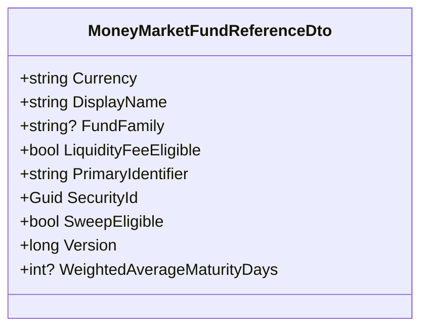

<!-- Generated by build/scripts/schema-control.py. Do not edit directly. -->

# `money-market-contracts` data objects

This is an explicit module association, not a claim that a DTO is identical to a table.

Mapped physical schemas: `money_market`.
Catalogued objects: 1.

