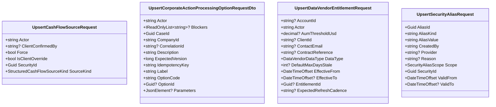

<!-- Generated by build/scripts/schema-control.py. Do not edit directly. -->

# `security-master-contracts` data objects - page 4 of 4

Objects 241-244 of 244. References crossing pages remain available in the dependency manifest.

