<!-- Generated by build/scripts/schema-control.py. Do not edit directly. -->

# `asset_operations` schema

- Relations: 16
- Functions/procedures: 1
- Triggers: 2
- Row-level security policies: 0

The SQL migrations and the PostgreSQL catalog are authoritative. Object identifiers and hashes are normalized for review.

```mermaid
erDiagram
    asset_operations_asset_accounting_event_projections {
        uuid event_id PK
        bigint event_version PK
        bigint spine_version PK
        bigint prior_spine_version
        text event_kind
        uuid security_id
        bigint expected_security_version
        uuid book_position_id FK
        bigint expected_book_position_version
        uuid ledger_book_id
        uuid period_id
        date effective_date
        numeric_38_18_ event_amount
        text currency
        text source_content_hash
        uuid projection_run_id
        text projection_model_key
        text projection_model_version
        uuid posted_journal_entry_id
        uuid tax_lot_mutation_batch_id
        character_64_ canonical_fingerprint
        jsonb payload
        timestamp_with_time_zone created_at
    }
    asset_operations_asset_actual_activity {
        uuid id PK
        uuid security_id
        text source_domain
        text source_entity_id
        jsonb payload
        timestamp_with_time_zone created_at
    }
    asset_operations_asset_cash_flow_projection_runs {
        uuid id PK
        uuid security_id
        text source_domain
        text source_entity_id
        jsonb payload
        timestamp_with_time_zone created_at
    }
    asset_operations_asset_ledger_projections {
        uuid id PK
        uuid security_id
        text source_domain
        text source_entity_id
        jsonb payload
        timestamp_with_time_zone created_at
    }
    asset_operations_asset_lifecycle_events {
        uuid id PK
        uuid security_id
        text source_domain
        text source_entity_id
        jsonb payload
        timestamp_with_time_zone created_at
    }
    asset_operations_asset_operation_subjects {
        uuid id PK
        uuid security_id
        text source_domain
        text source_entity_id
        jsonb payload
        timestamp_with_time_zone created_at
    }
    asset_operations_asset_operations_readiness {
        uuid id PK
        uuid security_id
        text source_domain
        text source_entity_id
        jsonb payload
        timestamp_with_time_zone created_at
    }
    asset_operations_asset_operations_schema_migrations {
        text migration_id PK
        text checksum
        timestamp_with_time_zone applied_at
    }
    asset_operations_asset_projected_cash_flows {
        uuid id PK
        uuid security_id
        text source_domain
        text source_entity_id
        jsonb payload
        timestamp_with_time_zone created_at
    }
    asset_operations_asset_reconciliation_results {
        uuid id PK
        uuid security_id
        text source_domain
        text source_entity_id
        jsonb payload
        timestamp_with_time_zone created_at
    }
    asset_operations_asset_reconciliation_runs {
        uuid id PK
        uuid security_id
        text source_domain
        text source_entity_id
        jsonb payload
        timestamp_with_time_zone created_at
    }
    asset_operations_asset_terms_versions {
        uuid id PK
        uuid security_id
        text source_domain
        text source_entity_id
        jsonb payload
        timestamp_with_time_zone created_at
    }
    asset_operations_asset_workflow_audit {
        uuid id PK
        uuid security_id
        text source_domain
        text source_entity_id
        jsonb payload
        timestamp_with_time_zone created_at
    }
    asset_operations_book_position_projections {
        uuid position_id PK
        uuid security_id FK
        uuid role_id FK
        uuid ledger_book_id
        text owner_scope_id FK
        text owner_scope_kind FK
        date effective_from
        date effective_to
        bigint version
        uuid source_event_id
        text approval_actor
        text approval_reference
        timestamp_with_time_zone approved_at
        jsonb evidence_links
        jsonb payload
        timestamp_with_time_zone created_at
        timestamp_with_time_zone updated_at
        text position_side
        text position_status
        text approval_rationale
        text source_domain
        text source_entity_id
        text source_content_hash
        uuid projection_run_id
        uuid projection_event_id
    }
    asset_operations_instrument_role_projections {
        uuid role_id PK
        uuid security_id
        text owner_scope_id
        text owner_scope_kind
        text role_kind
        date effective_from
        date effective_to
        bigint version
        uuid source_event_id
        text approval_actor
        text approval_reference
        timestamp_with_time_zone approved_at
        jsonb evidence_links
        jsonb payload
        timestamp_with_time_zone created_at
        timestamp_with_time_zone updated_at
        text approval_rationale
        text source_domain
        text source_entity_id
        text source_content_hash
    }
    asset_operations_position_economic_state_projections {
        uuid economic_state_id PK
        uuid position_id FK
        uuid security_id FK
        date as_of_date
        bigint version
        uuid source_event_id
        text approval_actor
        text approval_reference
        timestamp_with_time_zone approved_at
        jsonb evidence_links
        jsonb payload
        timestamp_with_time_zone created_at
        uuid ledger_book_id FK
        text owner_scope_id FK
        text owner_scope_kind FK
        text approval_rationale
        text source_domain
        text source_entity_id
        text source_content_hash
        uuid projection_run_id
        uuid projection_event_id
    }
    asset_operations_book_position_projections ||--o{ asset_operations_asset_accounting_event_projections : "fk_asset_accounting_event_book_position"
    asset_operations_book_position_projections ||--o{ asset_operations_position_economic_state_projections : "fk_position_economic_state_position_scope"
    asset_operations_instrument_role_projections ||--o{ asset_operations_book_position_projections : "fk_book_position_projection_role_scope"
```

| Relation | Kind | Columns | Primary key | Foreign keys | Indexes | Comment |
| --- | --- | ---: | --- | ---: | ---: | --- |
| `asset_accounting_event_projections` | table | 23 | `event_id`, `event_version`, `spine_version` | 1 | 5 | - |
| `asset_actual_activity` | table | 6 | `id` | 0 | 2 | - |
| `asset_cash_flow_projection_runs` | table | 6 | `id` | 0 | 2 | - |
| `asset_ledger_projections` | table | 6 | `id` | 0 | 2 | - |
| `asset_lifecycle_events` | table | 6 | `id` | 0 | 2 | - |
| `asset_operation_subjects` | table | 6 | `id` | 0 | 2 | - |
| `asset_operations_readiness` | table | 6 | `id` | 0 | 2 | - |
| `asset_operations_schema_migrations` | table | 3 | `migration_id` | 0 | 1 | - |
| `asset_projected_cash_flows` | table | 6 | `id` | 0 | 2 | - |
| `asset_reconciliation_results` | table | 6 | `id` | 0 | 2 | - |
| `asset_reconciliation_runs` | table | 6 | `id` | 0 | 2 | - |
| `asset_terms_versions` | table | 6 | `id` | 0 | 2 | - |
| `asset_workflow_audit` | table | 6 | `id` | 0 | 2 | - |
| `book_position_projections` | table | 25 | `position_id` | 1 | 5 | - |
| `instrument_role_projections` | table | 20 | `role_id` | 0 | 4 | - |
| `position_economic_state_projections` | table | 21 | `economic_state_id` | 1 | 5 | - |
