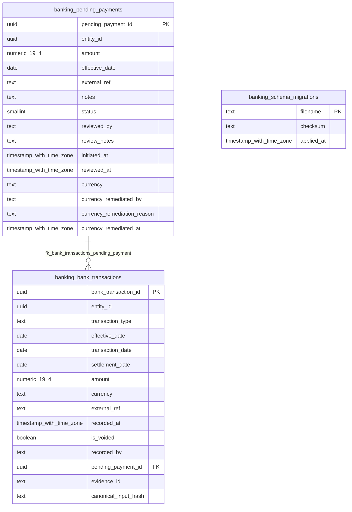

<!-- Generated by build/scripts/schema-control.py. Do not edit directly. -->

# `banking` schema

- Relations: 3
- Functions/procedures: 0
- Triggers: 0
- Row-level security policies: 0

The SQL migrations and the PostgreSQL catalog are authoritative. Object identifiers and hashes are normalized for review.

| Relation | Kind | Columns | Primary key | Foreign keys | Indexes | Comment |
| --- | --- | ---: | --- | ---: | ---: | --- |
| `bank_transactions` | table | 15 | `bank_transaction_id` | 1 | 5 | - |
| `pending_payments` | table | 15 | `pending_payment_id` | 0 | 3 | - |
| `schema_migrations` | table | 3 | `filename` | 0 | 1 | - |
