<!-- Generated by build/scripts/schema-control.py. Do not edit directly. -->

# `fund_structure` schema

- Relations: 11
- Functions/procedures: 0
- Triggers: 0
- Row-level security policies: 0

The SQL migrations and the PostgreSQL catalog are authoritative. Object identifiers and hashes are normalized for review.

```mermaid
erDiagram
    fund_structure_business {
        uuid business_id PK
        uuid organization_id
        text business_kind
        text code
        text name
        text base_currency
        boolean is_active
        timestamp_with_time_zone effective_from
        timestamp_with_time_zone effective_to
        jsonb client_ids
        jsonb fund_ids
        jsonb investment_portfolio_ids
        text description
        timestamp_with_time_zone updated_at
    }
    fund_structure_client {
        uuid client_id PK
        uuid business_id
        text code
        text name
        text base_currency
        boolean is_active
        timestamp_with_time_zone effective_from
        timestamp_with_time_zone effective_to
        jsonb investment_portfolio_ids
        text description
        text client_segment_kind
        timestamp_with_time_zone updated_at
    }
    fund_structure_fund {
        uuid fund_id PK
        uuid business_id
        text code
        text name
        text base_currency
        boolean is_active
        timestamp_with_time_zone effective_from
        timestamp_with_time_zone effective_to
        jsonb sleeve_ids
        jsonb vehicle_ids
        jsonb entity_ids
        jsonb investment_portfolio_ids
        jsonb account_ids
        text description
        timestamp_with_time_zone updated_at
    }
    fund_structure_fund_structure_assignment {
        uuid assignment_id PK
        uuid node_id
        text assignment_type
        text assignment_reference
        timestamp_with_time_zone effective_from
        timestamp_with_time_zone effective_to
        boolean is_primary
        timestamp_with_time_zone updated_at
    }
    fund_structure_fund_structure_schema_migrations {
        text filename PK
        text checksum
        timestamp_with_time_zone applied_at
    }
    fund_structure_investment_portfolio {
        uuid investment_portfolio_id PK
        uuid business_id
        text code
        text name
        text base_currency
        boolean is_active
        timestamp_with_time_zone effective_from
        timestamp_with_time_zone effective_to
        uuid client_id
        uuid fund_id
        uuid sleeve_id
        uuid vehicle_id
        uuid entity_id
        jsonb account_ids
        text description
        timestamp_with_time_zone updated_at
    }
    fund_structure_legal_entity {
        uuid entity_id PK
        text entity_type
        text legal_form
        text lifecycle_status
        text code
        text name
        text jurisdiction
        text base_currency
        boolean is_active
        timestamp_with_time_zone effective_from
        timestamp_with_time_zone effective_to
        text registration_number
        jsonb beneficial_owners
        jsonb lifecycle_events
        text description
        timestamp_with_time_zone updated_at
    }
    fund_structure_organization {
        uuid organization_id PK
        text code
        text name
        text base_currency
        boolean is_active
        timestamp_with_time_zone effective_from
        timestamp_with_time_zone effective_to
        jsonb business_ids
        text description
        timestamp_with_time_zone updated_at
    }
    fund_structure_ownership_link {
        uuid ownership_link_id PK
        uuid parent_node_id
        uuid child_node_id
        text relationship_type
        numeric_18_8_ ownership_percent
        boolean is_primary
        timestamp_with_time_zone effective_from
        timestamp_with_time_zone effective_to
        text notes
        timestamp_with_time_zone updated_at
    }
    fund_structure_sleeve {
        uuid sleeve_id PK
        uuid fund_id
        text code
        text name
        text mandate
        boolean is_active
        timestamp_with_time_zone effective_from
        timestamp_with_time_zone effective_to
        jsonb strategy_ids
        jsonb investment_portfolio_ids
        jsonb account_ids
        timestamp_with_time_zone updated_at
    }
    fund_structure_vehicle {
        uuid vehicle_id PK
        uuid fund_id
        uuid legal_entity_id
        text code
        text name
        text base_currency
        boolean is_active
        timestamp_with_time_zone effective_from
        timestamp_with_time_zone effective_to
        jsonb investment_portfolio_ids
        jsonb account_ids
        text description
        timestamp_with_time_zone updated_at
    }
```

| Relation | Kind | Columns | Primary key | Foreign keys | Indexes | Comment |
| --- | --- | ---: | --- | ---: | ---: | --- |
| `business` | table | 14 | `business_id` | 0 | 1 | - |
| `client` | table | 12 | `client_id` | 0 | 1 | - |
| `fund` | table | 15 | `fund_id` | 0 | 1 | - |
| `fund_structure_assignment` | table | 8 | `assignment_id` | 0 | 2 | - |
| `fund_structure_schema_migrations` | table | 3 | `filename` | 0 | 1 | - |
| `investment_portfolio` | table | 16 | `investment_portfolio_id` | 0 | 1 | - |
| `legal_entity` | table | 16 | `entity_id` | 0 | 1 | - |
| `organization` | table | 10 | `organization_id` | 0 | 1 | - |
| `ownership_link` | table | 10 | `ownership_link_id` | 0 | 3 | - |
| `sleeve` | table | 12 | `sleeve_id` | 0 | 1 | - |
| `vehicle` | table | 13 | `vehicle_id` | 0 | 1 | - |
