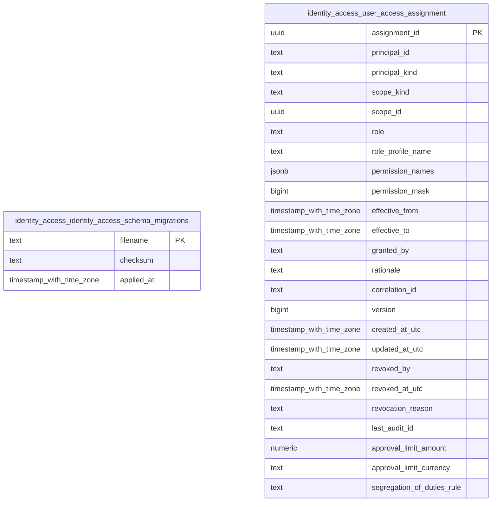

<!-- Generated by build/scripts/schema-control.py. Do not edit directly. -->

# `identity_access` schema

- Relations: 2
- Functions/procedures: 0
- Triggers: 0
- Row-level security policies: 0

The SQL migrations and the PostgreSQL catalog are authoritative. Object identifiers and hashes are normalized for review.

| Relation | Kind | Columns | Primary key | Foreign keys | Indexes | Comment |
| --- | --- | ---: | --- | ---: | ---: | --- |
| `identity_access_schema_migrations` | table | 3 | `filename` | 0 | 1 | - |
| `user_access_assignment` | table | 24 | `assignment_id` | 0 | 2 | - |
