<!-- Generated by build/scripts/schema-control.py. Do not edit directly. -->

# `reporting` schema

- Relations: 20
- Functions/procedures: 18
- Triggers: 21
- Row-level security policies: 0

The SQL migrations and the PostgreSQL catalog are authoritative. Object identifiers and hashes are normalized for review.

```mermaid
erDiagram
    reporting_reporting_access_grants {
        text grant_id PK
        text token_hash_sha256
        text tenant_id
        text audience
        text package_id
        boolean allow_package_read
        text[] artifact_ids
        timestamp_with_time_zone created_at_utc
        timestamp_with_time_zone expires_at_utc
        integer max_uses
        integer use_count
        timestamp_with_time_zone last_used_at_utc
        timestamp_with_time_zone revoked_at_utc
        text revoked_by
        text revocation_reason
        bigint version
        text run_id
        integer audience_kind
        text[] consumed_artifact_ids
    }
    reporting_reporting_artifact_audit {
        bigint sequence PK
        text event_id
        timestamp_with_time_zone occurred_at_utc
        text action
        text actor_tenant_id
        text target_tenant_id
        text package_id
        text artifact_id
        text previous_hash
        text entry_hash
        text event_payload
        timestamp_with_time_zone appended_at_utc
    }
    reporting_reporting_artifact_audit_chain_head {
        smallint chain_id PK
        bigint next_sequence
        text last_hash
    }
    reporting_reporting_artifact_blobs {
        text tenant_id PK
        text content_hash_sha256 PK
        bigint byte_size
        bytea content
        timestamp_with_time_zone stored_at_utc
    }
    reporting_reporting_artifact_catalog {
        text tenant_id PK,FK
        text package_id PK,FK
        text artifact_id PK
        text artifact_hash_sha256
        text artifact_payload
        timestamp_with_time_zone stored_at_utc
    }
    reporting_reporting_artifact_packages {
        text tenant_id PK
        text package_id PK
        text package_hash_sha256
        text package_payload
        integer artifact_count
        timestamp_with_time_zone stored_at_utc
    }
    reporting_reporting_delivery_jobs {
        text job_id PK
        text tenant_id
        text package_id
        text distribution_id
        text transport_id
        jsonb release_authorization
        text requested_by
        text idempotency_key
        jsonb payload
        integer state
        integer attempt_count
        integer max_attempts
        timestamp_with_time_zone created_at_utc
        timestamp_with_time_zone updated_at_utc
        timestamp_with_time_zone next_attempt_at_utc
        text lease_owner
        timestamp_with_time_zone lease_expires_at_utc
        text last_error_code
        text last_error
        text provider_message_id
        text access_grant_id
        bigint version
    }
    reporting_reporting_delivery_receipts {
        bigint receipt_sequence
        text job_id PK,FK
        text tenant_id FK
        text receipt_id PK
        integer kind
        timestamp_with_time_zone occurred_at_utc
        text transport_id
        text provider_reference
        text evidence_reference
        text detail
        timestamp_with_time_zone stored_at_utc
    }
    reporting_reporting_delivery_receipts_receipt_sequence_seq {
        text catalogued_object
    }
    reporting_reporting_governance_audit {
        text tenant_id PK
        smallint aggregate_kind PK
        text aggregate_id PK
        bigint aggregate_version PK
        text event_id
        timestamp_with_time_zone occurred_at_utc
        text previous_hash
        text event_hash
        text event_payload
        text payload_hash_sha256
        smallint hash_format_version
    }
    reporting_reporting_governed_runs {
        text tenant_id PK
        text run_id PK
        text series_id
        integer revision
        text organization_id
        text company_id
        bigint aggregate_version
        smallint execution_state
        smallint governance_state
        text state_payload
        text state_hash_sha256
        timestamp_with_time_zone created_at_utc
        timestamp_with_time_zone updated_at_utc
        smallint state_format_version
    }
    reporting_reporting_reconciliation_evidence {
        text tenant_id PK
        text receipt_key_sha256 PK
        text organization_id
        text company_id
        text fund_id
        text ledger_book_id
        text accounting_period_id
        text accounting_basis
        date as_of_date
        text source_checkpoint_id
        text source_checkpoint_hash
        text reconciliation_checkpoint_id
        text reconciliation_checkpoint_hash
        text receipt_payload
        text receipt_hash_sha256
        timestamp_with_time_zone retained_at_utc
    }
    reporting_reporting_reconciliation_evidence_v2 {
        text tenant_id PK
        text receipt_key_sha256 PK
        text organization_id
        text company_id
        text fund_id
        text ledger_book_id
        text accounting_period_id
        text accounting_basis
        date as_of_date
        text source_checkpoint_id
        text source_checkpoint_hash
        text reconciliation_checkpoint_id
        text reconciliation_checkpoint_hash
        text receipt_payload
        text receipt_hash_sha256
        timestamp_with_time_zone retained_at_utc
        smallint receipt_format_version
        text supersedes_legacy_receipt_key_sha256
    }
    reporting_reporting_restatement_requests {
        text tenant_id PK,FK
        text request_id PK
        text series_id
        text predecessor_run_id FK
        bigint aggregate_version
        smallint request_state
        text state_payload
        text state_hash_sha256
        timestamp_with_time_zone created_at_utc
        timestamp_with_time_zone updated_at_utc
        smallint state_format_version
    }
    reporting_reporting_run_create_claims {
        text tenant_id PK
        text run_id
        text run_id_key PK
        text lease_owner
        timestamp_with_time_zone claimed_at_utc
        timestamp_with_time_zone lease_expires_at_utc
        bigint lease_version
    }
    reporting_reporting_run_snapshots {
        text tenant_id PK
        text run_id
        text run_id_key PK
        jsonb manifest_payload
        jsonb audit_payload
        timestamp_with_time_zone updated_at_utc
        text certified_dataset_hash_sha256
        text manifest_hash_sha256
        text audit_hash_sha256
        text state_hash_sha256
    }
    reporting_reporting_schedule_snapshots {
        text tenant_id PK
        text company_id PK
        text schedule_id
        text schedule_id_key PK
        jsonb schedule_payload
        text payload_hash_sha256
        timestamp_with_time_zone due_at_utc
        text lease_owner
        timestamp_with_time_zone lease_expires_at_utc
        bigint lease_version
        timestamp_with_time_zone stored_at_utc
    }
    reporting_reporting_schema_migrations {
        text filename PK
        text checksum
        timestamp_with_time_zone applied_at
    }
    reporting_reporting_statement_reconciliation_document_revisions {
        text tenant_id PK,FK
        text company_id PK
        text workflow_id PK
        text document_key PK
        bigint document_version PK
        text previous_content_hash_sha256 FK
        bigint previous_byte_size
        timestamp_with_time_zone previous_updated_at_utc
        text content_hash_sha256 FK
        bigint byte_size
        boolean is_immutable
        timestamp_with_time_zone mapping_stored_at_utc
        timestamp_with_time_zone mapping_updated_at_utc
        timestamp_with_time_zone recorded_at_utc
    }
    reporting_reporting_statement_reconciliation_documents {
        text tenant_id PK,FK
        text company_id PK
        text workflow_id PK
        text document_key PK
        text content_hash_sha256 FK
        bigint byte_size
        boolean is_immutable
        bigint document_version
        timestamp_with_time_zone stored_at_utc
        timestamp_with_time_zone updated_at_utc
    }
    reporting_reporting_artifact_blobs ||--o{ reporting_reporting_statement_reconciliation_document_revisions : "fk_reporting_statement_revision_blob"
    reporting_reporting_artifact_blobs ||--o{ reporting_reporting_statement_reconciliation_document_revisions : "fk_reporting_statement_revision_previous_blob"
    reporting_reporting_artifact_blobs ||--o{ reporting_reporting_statement_reconciliation_documents : "fk_reporting_statement_document_blob"
    reporting_reporting_artifact_packages ||--o{ reporting_reporting_artifact_catalog : "fk_reporting_artifact_catalog_package"
    reporting_reporting_delivery_jobs ||--o{ reporting_reporting_delivery_receipts : "fk_reporting_delivery_receipt_job"
    reporting_reporting_governed_runs ||--o{ reporting_reporting_restatement_requests : "fk_reporting_restatement_predecessor"
```

| Relation | Kind | Columns | Primary key | Foreign keys | Indexes | Comment |
| --- | --- | ---: | --- | ---: | ---: | --- |
| `reporting_access_grants` | table | 19 | `grant_id` | 0 | 4 | - |
| `reporting_artifact_audit` | table | 12 | `sequence` | 0 | 3 | - |
| `reporting_artifact_audit_chain_head` | table | 3 | `chain_id` | 0 | 1 | - |
| `reporting_artifact_blobs` | table | 5 | `tenant_id`, `content_hash_sha256` | 0 | 2 | - |
| `reporting_artifact_catalog` | table | 6 | `tenant_id`, `package_id`, `artifact_id` | 1 | 2 | - |
| `reporting_artifact_packages` | table | 6 | `tenant_id`, `package_id` | 0 | 1 | - |
| `reporting_delivery_jobs` | table | 22 | `job_id` | 0 | 7 | - |
| `reporting_delivery_receipts` | table | 11 | `job_id`, `receipt_id` | 1 | 2 | - |
| `reporting_delivery_receipts_receipt_sequence_seq` | sequence | 0 | - | 0 | 0 | - |
| `reporting_governance_audit` | table | 11 | `tenant_id`, `aggregate_kind`, `aggregate_id`, `aggregate_version` | 0 | 3 | - |
| `reporting_governed_runs` | table | 14 | `tenant_id`, `run_id` | 0 | 4 | - |
| `reporting_reconciliation_evidence` | table | 16 | `tenant_id`, `receipt_key_sha256` | 0 | 3 | - |
| `reporting_reconciliation_evidence_v2` | table | 18 | `tenant_id`, `receipt_key_sha256` | 0 | 3 | - |
| `reporting_restatement_requests` | table | 11 | `tenant_id`, `request_id` | 1 | 2 | - |
| `reporting_run_create_claims` | table | 7 | `tenant_id`, `run_id_key` | 0 | 2 | - |
| `reporting_run_snapshots` | table | 10 | `tenant_id`, `run_id_key` | 0 | 2 | - |
| `reporting_schedule_snapshots` | table | 11 | `tenant_id`, `company_id`, `schedule_id_key` | 0 | 2 | - |
| `reporting_schema_migrations` | table | 3 | `filename` | 0 | 1 | - |
| `reporting_statement_reconciliation_document_revisions` | table | 14 | `tenant_id`, `company_id`, `workflow_id`, `document_key`, `document_version` | 2 | 2 | - |
| `reporting_statement_reconciliation_documents` | table | 10 | `tenant_id`, `company_id`, `workflow_id`, `document_key` | 1 | 3 | - |
