# Project Dependency Graph

> Generated: 2026-04-08 03:32:19 UTC

## Summary

| Metric | Value |
|--------|-------|
| Total Projects | 34 |
| Root Projects | 12 |
| Leaf Projects | 5 |
| Circular Dependencies | 0 |

## Entry Point Projects

These projects are not referenced by other projects:

- **DocGenerator**
  - NuGet Packages: 1
- **FSharpInteropGenerator**
- **Meridian.Backtesting.Tests**
  - Dependencies: 3
  - NuGet Packages: 5
- **Meridian.Benchmarks**
  - Dependencies: 5
  - NuGet Packages: 4
- **Meridian.DirectLending.Tests**
  - Dependencies: 3
  - NuGet Packages: 7
- **Meridian.Mcp**
  - NuGet Packages: 2
- **Meridian.McpServer.Tests**
  - Dependencies: 4
  - NuGet Packages: 7
- **Meridian.QuantScript.Tests**
  - Dependencies: 1
  - NuGet Packages: 8
- **Meridian.Tests**
  - Dependencies: 14
  - NuGet Packages: 14
- **Meridian.Ui**
  - Dependencies: 1
  - NuGet Packages: 3
- **Meridian.Ui.Tests**
  - Dependencies: 1
  - NuGet Packages: 6
- **Meridian.Wpf.Tests**
  - Dependencies: 4
  - NuGet Packages: 7

## Most Complex Projects

Projects with the most dependencies:

| Project | Project Deps | Package Deps | Total |
|---------|--------------|--------------|-------|
| Meridian.Application | 10 | 33 | 43 |
| Meridian.Infrastructure | 7 | 23 | 30 |
| Meridian.Tests | 14 | 14 | 28 |
| Meridian.Wpf | 5 | 18 | 23 |
| Meridian | 10 | 9 | 19 |
| Meridian.Storage | 4 | 12 | 16 |
| Meridian.Infrastructure.CppTrader | 7 | 6 | 13 |
| Meridian.McpServer | 4 | 8 | 12 |
| Meridian.QuantScript | 7 | 4 | 11 |
| Meridian.Strategies | 9 | 2 | 11 |

## Dependency Graph

```mermaid
graph LR
    Meridian[Meridian] --> Meridian_Application[Meridian.Application]
    Meridian[Meridian] --> Meridian_Backtesting[Meridian.Backtesting]
    Meridian[Meridian] --> Meridian_Infrastructure[Meridian.Infrastructure]
    Meridian[Meridian] --> Meridian_Infrastructure_CppTrader[Meridian.Infrastructure.CppTrader]
    Meridian[Meridian] --> Meridian_Storage[Meridian.Storage]
    Meridian[Meridian] --> Meridian_Core[Meridian.Core]
    Meridian[Meridian] --> Meridian_Domain[Meridian.Domain]
    Meridian[Meridian] --> Meridian_Contracts[Meridian.Contracts]
    Meridian[Meridian] --> Meridian_ProviderSdk[Meridian.ProviderSdk]
    Meridian[Meridian] --> Meridian_Ui_Shared[Meridian.Ui.Shared]
    Meridian_Application[Meridian.Application] --> Meridian_Infrastructure[Meridian.Infrastructure]
    Meridian_Application[Meridian.Application] --> Meridian_Storage[Meridian.Storage]
    Meridian_Application[Meridian.Application] --> Meridian_Core[Meridian.Core]
    Meridian_Application[Meridian.Application] --> Meridian_Domain[Meridian.Domain]
    Meridian_Application[Meridian.Application] --> Meridian_Contracts[Meridian.Contracts]
    Meridian_Application[Meridian.Application] --> Meridian_ProviderSdk[Meridian.ProviderSdk]
    Meridian_Application[Meridian.Application] --> Meridian_FSharp[Meridian.FSharp]
    Meridian_Application[Meridian.Application] --> Meridian_FSharp_DirectLending_Aggregates[Meridian.FSharp.DirectLending.Aggregates]
    Meridian_Application[Meridian.Application] --> Meridian_FSharp_Ledger[Meridian.FSharp.Ledger]
    Meridian_Application[Meridian.Application] --> Meridian_Ledger[Meridian.Ledger]
    Meridian_Backtesting[Meridian.Backtesting] --> Meridian_Backtesting_Sdk[Meridian.Backtesting.Sdk]
    Meridian_Backtesting[Meridian.Backtesting] --> Meridian_Storage[Meridian.Storage]
    Meridian_Backtesting[Meridian.Backtesting] --> Meridian_Application[Meridian.Application]
    Meridian_Backtesting[Meridian.Backtesting] --> Meridian_Strategies[Meridian.Strategies]
    Meridian_Backtesting_Sdk[Meridian.Backtesting.Sdk] --> Meridian_Contracts[Meridian.Contracts]
    Meridian_Backtesting_Sdk[Meridian.Backtesting.Sdk] --> Meridian_Ledger[Meridian.Ledger]
    Meridian_Backtesting_Tests[Meridian.Backtesting.Tests] --> Meridian_Backtesting[Meridian.Backtesting]
    Meridian_Backtesting_Tests[Meridian.Backtesting.Tests] --> Meridian_Backtesting_Sdk[Meridian.Backtesting.Sdk]
    Meridian_Backtesting_Tests[Meridian.Backtesting.Tests] --> Meridian_Infrastructure[Meridian.Infrastructure]
    Meridian_Benchmarks[Meridian.Benchmarks] --> Meridian[Meridian]
    Meridian_Benchmarks[Meridian.Benchmarks] --> Meridian_Application[Meridian.Application]
    Meridian_Benchmarks[Meridian.Benchmarks] --> Meridian_Core[Meridian.Core]
    Meridian_Benchmarks[Meridian.Benchmarks] --> Meridian_Domain[Meridian.Domain]
    Meridian_Benchmarks[Meridian.Benchmarks] --> Meridian_Storage[Meridian.Storage]
    Meridian_Core[Meridian.Core] --> Meridian_Contracts[Meridian.Contracts]
    Meridian_Core[Meridian.Core] --> Meridian_Domain[Meridian.Domain]
    Meridian_Core[Meridian.Core] --> Meridian_ProviderSdk[Meridian.ProviderSdk]
    Meridian_DirectLending_Tests[Meridian.DirectLending.Tests] --> Meridian_Application[Meridian.Application]
    Meridian_DirectLending_Tests[Meridian.DirectLending.Tests] --> Meridian_Contracts[Meridian.Contracts]
    Meridian_DirectLending_Tests[Meridian.DirectLending.Tests] --> Meridian_Storage[Meridian.Storage]
    Meridian_Domain[Meridian.Domain] --> Meridian_Contracts[Meridian.Contracts]
    Meridian_Domain[Meridian.Domain] --> Meridian_ProviderSdk[Meridian.ProviderSdk]
    Meridian_Execution[Meridian.Execution] --> Meridian_Execution_Sdk[Meridian.Execution.Sdk]
    Meridian_Execution[Meridian.Execution] --> Meridian_Ledger[Meridian.Ledger]
    Meridian_Execution[Meridian.Execution] --> Meridian_Application[Meridian.Application]
    Meridian_Execution[Meridian.Execution] --> Meridian_Core[Meridian.Core]
    Meridian_Execution[Meridian.Execution] --> Meridian_Contracts[Meridian.Contracts]
    Meridian_Execution[Meridian.Execution] --> Meridian_Storage[Meridian.Storage]
    Meridian_Execution_Sdk[Meridian.Execution.Sdk] --> Meridian_Contracts[Meridian.Contracts]
    Meridian_Infrastructure[Meridian.Infrastructure] --> Meridian_Core[Meridian.Core]
    Meridian_Infrastructure[Meridian.Infrastructure] --> Meridian_Domain[Meridian.Domain]
    Meridian_Infrastructure[Meridian.Infrastructure] --> Meridian_Contracts[Meridian.Contracts]
    Meridian_Infrastructure[Meridian.Infrastructure] --> Meridian_ProviderSdk[Meridian.ProviderSdk]
    Meridian_Infrastructure[Meridian.Infrastructure] --> Meridian_Execution_Sdk[Meridian.Execution.Sdk]
    Meridian_Infrastructure[Meridian.Infrastructure] --> Meridian_Storage[Meridian.Storage]
    Meridian_Infrastructure[Meridian.Infrastructure] --> Meridian_IbApi_SmokeStub[Meridian.IbApi.SmokeStub]
    Meridian_Infrastructure_CppTrader[Meridian.Infrastructure.CppTrader] --> Meridian_Execution[Meridian.Execution]
    Meridian_Infrastructure_CppTrader[Meridian.Infrastructure.CppTrader] --> Meridian_Execution_Sdk[Meridian.Execution.Sdk]
    Meridian_Infrastructure_CppTrader[Meridian.Infrastructure.CppTrader] --> Meridian_Infrastructure[Meridian.Infrastructure]
    Meridian_Infrastructure_CppTrader[Meridian.Infrastructure.CppTrader] --> Meridian_ProviderSdk[Meridian.ProviderSdk]
    Meridian_Infrastructure_CppTrader[Meridian.Infrastructure.CppTrader] --> Meridian_Contracts[Meridian.Contracts]
    Meridian_Infrastructure_CppTrader[Meridian.Infrastructure.CppTrader] --> Meridian_Core[Meridian.Core]
    Meridian_Infrastructure_CppTrader[Meridian.Infrastructure.CppTrader] --> Meridian_Domain[Meridian.Domain]
    Meridian_Ledger[Meridian.Ledger] --> Meridian_Core[Meridian.Core]
    Meridian_Ledger[Meridian.Ledger] --> Meridian_FSharp_Ledger[Meridian.FSharp.Ledger]
    Meridian_McpServer[Meridian.McpServer] --> Meridian_Application[Meridian.Application]
    Meridian_McpServer[Meridian.McpServer] --> Meridian_Contracts[Meridian.Contracts]
    Meridian_McpServer[Meridian.McpServer] --> Meridian_Core[Meridian.Core]
    Meridian_McpServer[Meridian.McpServer] --> Meridian_Storage[Meridian.Storage]
    Meridian_McpServer_Tests[Meridian.McpServer.Tests] --> Meridian_McpServer[Meridian.McpServer]
    Meridian_McpServer_Tests[Meridian.McpServer.Tests] --> Meridian_Application[Meridian.Application]
    Meridian_McpServer_Tests[Meridian.McpServer.Tests] --> Meridian_Storage[Meridian.Storage]
    Meridian_McpServer_Tests[Meridian.McpServer.Tests] --> Meridian_Contracts[Meridian.Contracts]
    Meridian_ProviderSdk[Meridian.ProviderSdk] --> Meridian_Contracts[Meridian.Contracts]
    Meridian_QuantScript[Meridian.QuantScript] --> Meridian_ProviderSdk[Meridian.ProviderSdk]
    Meridian_QuantScript[Meridian.QuantScript] --> Meridian_Backtesting[Meridian.Backtesting]
    Meridian_QuantScript[Meridian.QuantScript] --> Meridian_Backtesting_Sdk[Meridian.Backtesting.Sdk]
    Meridian_QuantScript[Meridian.QuantScript] --> Meridian_Application[Meridian.Application]
    Meridian_QuantScript[Meridian.QuantScript] --> Meridian_Storage[Meridian.Storage]
    Meridian_QuantScript[Meridian.QuantScript] --> Meridian_Contracts[Meridian.Contracts]
    Meridian_QuantScript[Meridian.QuantScript] --> Meridian_Domain[Meridian.Domain]
    Meridian_QuantScript_Tests[Meridian.QuantScript.Tests] --> Meridian_QuantScript[Meridian.QuantScript]
    Meridian_Risk[Meridian.Risk] --> Meridian_Execution_Sdk[Meridian.Execution.Sdk]
    Meridian_Risk[Meridian.Risk] --> Meridian_Execution[Meridian.Execution]
    Meridian_Risk[Meridian.Risk] --> Meridian_Contracts[Meridian.Contracts]
    Meridian_Risk[Meridian.Risk] --> Meridian_FSharp[Meridian.FSharp]
    Meridian_Storage[Meridian.Storage] --> Meridian_Core[Meridian.Core]
    Meridian_Storage[Meridian.Storage] --> Meridian_Domain[Meridian.Domain]
    Meridian_Storage[Meridian.Storage] --> Meridian_Contracts[Meridian.Contracts]
    Meridian_Storage[Meridian.Storage] --> Meridian_ProviderSdk[Meridian.ProviderSdk]
    Meridian_Strategies[Meridian.Strategies] --> Meridian_Backtesting_Sdk[Meridian.Backtesting.Sdk]
    Meridian_Strategies[Meridian.Strategies] --> Meridian_Contracts[Meridian.Contracts]
    Meridian_Strategies[Meridian.Strategies] --> Meridian_Core[Meridian.Core]
    Meridian_Strategies[Meridian.Strategies] --> Meridian_Execution[Meridian.Execution]
    Meridian_Strategies[Meridian.Strategies] --> Meridian_Execution_Sdk[Meridian.Execution.Sdk]
    Meridian_Strategies[Meridian.Strategies] --> Meridian_FSharp[Meridian.FSharp]
    Meridian_Strategies[Meridian.Strategies] --> Meridian_FSharp_Ledger[Meridian.FSharp.Ledger]
    Meridian_Strategies[Meridian.Strategies] --> Meridian_FSharp_Trading[Meridian.FSharp.Trading]
    Meridian_Strategies[Meridian.Strategies] --> Meridian_Infrastructure[Meridian.Infrastructure]
    Meridian_Tests[Meridian.Tests] --> Meridian[Meridian]
    Meridian_Tests[Meridian.Tests] --> Meridian_Application[Meridian.Application]
    Meridian_Tests[Meridian.Tests] --> Meridian_Backtesting_Sdk[Meridian.Backtesting.Sdk]
    Meridian_Tests[Meridian.Tests] --> Meridian_Execution[Meridian.Execution]
    Meridian_Tests[Meridian.Tests] --> Meridian_Execution_Sdk[Meridian.Execution.Sdk]
    Meridian_Tests[Meridian.Tests] --> Meridian_Infrastructure[Meridian.Infrastructure]
    Meridian_Tests[Meridian.Tests] --> Meridian_Infrastructure_CppTrader[Meridian.Infrastructure.CppTrader]
    Meridian_Tests[Meridian.Tests] --> Meridian_Ledger[Meridian.Ledger]
    Meridian_Tests[Meridian.Tests] --> Meridian_Risk[Meridian.Risk]
    Meridian_Tests[Meridian.Tests] --> Meridian_Storage[Meridian.Storage]
    Meridian_Tests[Meridian.Tests] --> Meridian_Strategies[Meridian.Strategies]
    Meridian_Tests[Meridian.Tests] --> Meridian_Core[Meridian.Core]
    Meridian_Tests[Meridian.Tests] --> Meridian_Domain[Meridian.Domain]
    Meridian_Tests[Meridian.Tests] --> Meridian_Ui_Shared[Meridian.Ui.Shared]
    Meridian_Ui[Meridian.Ui] --> Meridian_Ui_Shared[Meridian.Ui.Shared]
    Meridian_Ui_Services[Meridian.Ui.Services] --> Meridian_Contracts[Meridian.Contracts]
    Meridian_Ui_Shared[Meridian.Ui.Shared] --> Meridian_Contracts[Meridian.Contracts]
    Meridian_Ui_Shared[Meridian.Ui.Shared] --> Meridian_Application[Meridian.Application]
    Meridian_Ui_Shared[Meridian.Ui.Shared] --> Meridian_Execution[Meridian.Execution]
    Meridian_Ui_Shared[Meridian.Ui.Shared] --> Meridian_Infrastructure_CppTrader[Meridian.Infrastructure.CppTrader]
    Meridian_Ui_Shared[Meridian.Ui.Shared] --> Meridian_Storage[Meridian.Storage]
    Meridian_Ui_Shared[Meridian.Ui.Shared] --> Meridian_Strategies[Meridian.Strategies]
    Meridian_Ui_Tests[Meridian.Ui.Tests] --> Meridian_Ui_Services[Meridian.Ui.Services]
    Meridian_Wpf[Meridian.Wpf] --> Meridian_Ui_Services[Meridian.Ui.Services]
    Meridian_Wpf[Meridian.Wpf] --> Meridian_Ui_Shared[Meridian.Ui.Shared]
    Meridian_Wpf[Meridian.Wpf] --> Meridian_Backtesting[Meridian.Backtesting]
    Meridian_Wpf[Meridian.Wpf] --> Meridian_Strategies[Meridian.Strategies]
    Meridian_Wpf[Meridian.Wpf] --> Meridian_QuantScript[Meridian.QuantScript]
    Meridian_Wpf_Tests[Meridian.Wpf.Tests] --> Meridian_Application[Meridian.Application]
    Meridian_Wpf_Tests[Meridian.Wpf.Tests] --> Meridian_Strategies[Meridian.Strategies]
    Meridian_Wpf_Tests[Meridian.Wpf.Tests] --> Meridian_Wpf[Meridian.Wpf]
    Meridian_Wpf_Tests[Meridian.Wpf.Tests] --> Meridian_Ui_Services[Meridian.Ui.Services]
```

## Project Details

### DocGenerator

**Path:** `build\dotnet\DocGenerator\DocGenerator.csproj`

**NuGet Packages (1):**
- System.CommandLine

### FSharpInteropGenerator

**Path:** `build\dotnet\FSharpInteropGenerator\FSharpInteropGenerator.csproj`

### Meridian

**Path:** `src\Meridian\Meridian.csproj`

**Project References:**
- Meridian.Application
- Meridian.Backtesting
- Meridian.Contracts
- Meridian.Core
- Meridian.Domain
- Meridian.Infrastructure
- Meridian.Infrastructure.CppTrader
- Meridian.ProviderSdk
- Meridian.Storage
- Meridian.Ui.Shared

**Referenced By:**
- Meridian.Benchmarks
- Meridian.Tests

**NuGet Packages (9):**
- Microsoft.AspNetCore.OpenApi
- Microsoft.Extensions.Hosting
- QuantConnect.Common
- QuantConnect.Indicators
- QuantConnect.Lean
- QuantConnect.Lean.Engine
- Serilog
- Serilog.Extensions.Logging
- Swashbuckle.AspNetCore

### Meridian.Application

**Path:** `src\Meridian.Application\Meridian.Application.csproj`

**Project References:**
- Meridian.Contracts
- Meridian.Core
- Meridian.Domain
- Meridian.FSharp
- Meridian.FSharp.DirectLending.Aggregates
- Meridian.FSharp.Ledger
- Meridian.Infrastructure
- Meridian.Ledger
- Meridian.ProviderSdk
- Meridian.Storage

**Referenced By:**
- Meridian
- Meridian.Backtesting
- Meridian.Benchmarks
- Meridian.DirectLending.Tests
- Meridian.Execution
- Meridian.McpServer
- Meridian.McpServer.Tests
- Meridian.QuantScript
- Meridian.Tests
- Meridian.Ui.Shared
- Meridian.Wpf.Tests

**NuGet Packages (33):**
- FluentValidation
- Microsoft.Extensions.Configuration
- Microsoft.Extensions.Configuration.Binder
- Microsoft.Extensions.Configuration.CommandLine
- Microsoft.Extensions.Configuration.EnvironmentVariables
- Microsoft.Extensions.Configuration.Json
- Microsoft.Extensions.DependencyInjection
- Microsoft.Extensions.DependencyInjection.Abstractions
- Microsoft.Extensions.Hosting
- Microsoft.Extensions.Http
- ... and 23 more

### Meridian.Backtesting

**Path:** `src\Meridian.Backtesting\Meridian.Backtesting.csproj`

**Project References:**
- Meridian.Application
- Meridian.Backtesting.Sdk
- Meridian.Storage
- Meridian.Strategies

**Referenced By:**
- Meridian
- Meridian.Backtesting.Tests
- Meridian.QuantScript
- Meridian.Wpf

**NuGet Packages (2):**
- Microsoft.Extensions.Logging
- Microsoft.Extensions.Logging.Abstractions

### Meridian.Backtesting.Sdk

**Path:** `src\Meridian.Backtesting.Sdk\Meridian.Backtesting.Sdk.csproj`

**Project References:**
- Meridian.Contracts
- Meridian.Ledger

**Referenced By:**
- Meridian.Backtesting
- Meridian.Backtesting.Tests
- Meridian.QuantScript
- Meridian.Strategies
- Meridian.Tests

### Meridian.Backtesting.Tests

**Path:** `tests\Meridian.Backtesting.Tests\Meridian.Backtesting.Tests.csproj`

**Project References:**
- Meridian.Backtesting
- Meridian.Backtesting.Sdk
- Meridian.Infrastructure

**NuGet Packages (5):**
- FluentAssertions
- Microsoft.NET.Test.Sdk
- coverlet.collector
- xunit
- xunit.runner.visualstudio

### Meridian.Benchmarks

**Path:** `benchmarks\Meridian.Benchmarks\Meridian.Benchmarks.csproj`

**Project References:**
- Meridian
- Meridian.Application
- Meridian.Core
- Meridian.Domain
- Meridian.Storage

**NuGet Packages (4):**
- BenchmarkDotNet
- BenchmarkDotNet.Diagnostics.Windows
- Newtonsoft.Json
- System.Text.Json

### Meridian.Contracts

**Path:** `src\Meridian.Contracts\Meridian.Contracts.csproj`

**Referenced By:**
- Meridian
- Meridian.Application
- Meridian.Backtesting.Sdk
- Meridian.Core
- Meridian.DirectLending.Tests
- Meridian.Domain
- Meridian.Execution
- Meridian.Execution.Sdk
- Meridian.Infrastructure
- Meridian.Infrastructure.CppTrader
- Meridian.McpServer
- Meridian.McpServer.Tests
- Meridian.ProviderSdk
- Meridian.QuantScript
- Meridian.Risk
- Meridian.Storage
- Meridian.Strategies
- Meridian.Ui.Services
- Meridian.Ui.Shared

**NuGet Packages (1):**
- System.Text.Json

### Meridian.Core

**Path:** `src\Meridian.Core\Meridian.Core.csproj`

**Project References:**
- Meridian.Contracts
- Meridian.Domain
- Meridian.ProviderSdk

**Referenced By:**
- Meridian
- Meridian.Application
- Meridian.Benchmarks
- Meridian.Execution
- Meridian.Infrastructure
- Meridian.Infrastructure.CppTrader
- Meridian.Ledger
- Meridian.McpServer
- Meridian.Storage
- Meridian.Strategies
- Meridian.Tests

**NuGet Packages (7):**
- Microsoft.Extensions.Configuration
- Serilog
- Serilog.Settings.Configuration
- Serilog.Sinks.Console
- Serilog.Sinks.File
- System.Text.Json
- System.Threading.Channels

### Meridian.DirectLending.Tests

**Path:** `tests\Meridian.DirectLending.Tests\Meridian.DirectLending.Tests.csproj`

**Project References:**
- Meridian.Application
- Meridian.Contracts
- Meridian.Storage

**NuGet Packages (7):**
- FluentAssertions
- Microsoft.NET.Test.Sdk
- Npgsql
- Testcontainers.PostgreSql
- coverlet.collector
- xunit
- xunit.runner.visualstudio

### Meridian.Domain

**Path:** `src\Meridian.Domain\Meridian.Domain.csproj`

**Project References:**
- Meridian.Contracts
- Meridian.ProviderSdk

**Referenced By:**
- Meridian
- Meridian.Application
- Meridian.Benchmarks
- Meridian.Core
- Meridian.Infrastructure
- Meridian.Infrastructure.CppTrader
- Meridian.QuantScript
- Meridian.Storage
- Meridian.Tests

### Meridian.Execution

**Path:** `src\Meridian.Execution\Meridian.Execution.csproj`

**Project References:**
- Meridian.Application
- Meridian.Contracts
- Meridian.Core
- Meridian.Execution.Sdk
- Meridian.Ledger
- Meridian.Storage

**Referenced By:**
- Meridian.Infrastructure.CppTrader
- Meridian.Risk
- Meridian.Strategies
- Meridian.Tests
- Meridian.Ui.Shared

**NuGet Packages (3):**
- Microsoft.Extensions.DependencyInjection.Abstractions
- Microsoft.Extensions.Logging.Abstractions
- System.Threading.Channels

### Meridian.Execution.Sdk

**Path:** `src\Meridian.Execution.Sdk\Meridian.Execution.Sdk.csproj`

**Project References:**
- Meridian.Contracts

**Referenced By:**
- Meridian.Execution
- Meridian.Infrastructure
- Meridian.Infrastructure.CppTrader
- Meridian.Risk
- Meridian.Strategies
- Meridian.Tests

### Meridian.IbApi.SmokeStub

**Path:** `src\Meridian.IbApi.SmokeStub\Meridian.IbApi.SmokeStub.csproj`

**Referenced By:**
- Meridian.Infrastructure

### Meridian.Infrastructure

**Path:** `src\Meridian.Infrastructure\Meridian.Infrastructure.csproj`

**Project References:**
- Meridian.Contracts
- Meridian.Core
- Meridian.Domain
- Meridian.Execution.Sdk
- Meridian.IbApi.SmokeStub
- Meridian.ProviderSdk
- Meridian.Storage

**Referenced By:**
- Meridian
- Meridian.Application
- Meridian.Backtesting.Tests
- Meridian.Infrastructure.CppTrader
- Meridian.Strategies
- Meridian.Tests

**NuGet Packages (23):**
- FluentValidation
- Microsoft.Extensions.DependencyInjection.Abstractions
- Microsoft.Extensions.Hosting
- Microsoft.Extensions.Http
- Microsoft.Extensions.Http.Polly
- Microsoft.Extensions.ObjectPool
- Polly
- Polly.Extensions
- Renci.SshNet
- Serilog
- ... and 13 more

### Meridian.Infrastructure.CppTrader

**Path:** `src\Meridian.Infrastructure.CppTrader\Meridian.Infrastructure.CppTrader.csproj`

**Project References:**
- Meridian.Contracts
- Meridian.Core
- Meridian.Domain
- Meridian.Execution
- Meridian.Execution.Sdk
- Meridian.Infrastructure
- Meridian.ProviderSdk

**Referenced By:**
- Meridian
- Meridian.Tests
- Meridian.Ui.Shared

**NuGet Packages (6):**
- Microsoft.Extensions.DependencyInjection.Abstractions
- Microsoft.Extensions.Hosting.Abstractions
- Microsoft.Extensions.Logging.Abstractions
- Microsoft.Extensions.Options
- Microsoft.Extensions.Options.ConfigurationExtensions
- System.Threading.Channels

### Meridian.Ledger

**Path:** `src\Meridian.Ledger\Meridian.Ledger.csproj`

**Project References:**
- Meridian.Core
- Meridian.FSharp.Ledger

**Referenced By:**
- Meridian.Application
- Meridian.Backtesting.Sdk
- Meridian.Execution
- Meridian.Tests

### Meridian.Mcp

**Path:** `src\Meridian.Mcp\Meridian.Mcp.csproj`

**NuGet Packages (2):**
- Microsoft.Extensions.Hosting
- ModelContextProtocol

### Meridian.McpServer

**Path:** `src\Meridian.McpServer\Meridian.McpServer.csproj`

**Project References:**
- Meridian.Application
- Meridian.Contracts
- Meridian.Core
- Meridian.Storage

**Referenced By:**
- Meridian.McpServer.Tests

**NuGet Packages (8):**
- Microsoft.Extensions.Hosting
- Microsoft.Extensions.Logging
- ModelContextProtocol
- ModelContextProtocol.AspNetCore
- Serilog.Extensions.Logging
- Serilog.Settings.Configuration
- Serilog.Sinks.Console
- System.Text.Json

### Meridian.McpServer.Tests

**Path:** `tests\Meridian.McpServer.Tests\Meridian.McpServer.Tests.csproj`

**Project References:**
- Meridian.Application
- Meridian.Contracts
- Meridian.McpServer
- Meridian.Storage

**NuGet Packages (7):**
- FluentAssertions
- Microsoft.NET.Test.Sdk
- ModelContextProtocol
- Moq
- coverlet.collector
- xunit
- xunit.runner.visualstudio

### Meridian.ProviderSdk

**Path:** `src\Meridian.ProviderSdk\Meridian.ProviderSdk.csproj`

**Project References:**
- Meridian.Contracts

**Referenced By:**
- Meridian
- Meridian.Application
- Meridian.Core
- Meridian.Domain
- Meridian.Infrastructure
- Meridian.Infrastructure.CppTrader
- Meridian.QuantScript
- Meridian.Storage

**NuGet Packages (2):**
- Microsoft.Extensions.DependencyInjection.Abstractions
- Microsoft.Extensions.Logging.Abstractions

### Meridian.QuantScript

**Path:** `src\Meridian.QuantScript\Meridian.QuantScript.csproj`

**Project References:**
- Meridian.Application
- Meridian.Backtesting
- Meridian.Backtesting.Sdk
- Meridian.Contracts
- Meridian.Domain
- Meridian.ProviderSdk
- Meridian.Storage

**Referenced By:**
- Meridian.QuantScript.Tests
- Meridian.Wpf

**NuGet Packages (4):**
- Microsoft.CodeAnalysis.CSharp.Scripting
- Microsoft.Extensions.Logging.Abstractions
- Microsoft.Extensions.Options
- Skender.Stock.Indicators

### Meridian.QuantScript.Tests

**Path:** `tests\Meridian.QuantScript.Tests\Meridian.QuantScript.Tests.csproj`

**Project References:**
- Meridian.QuantScript

**NuGet Packages (8):**
- FluentAssertions
- Microsoft.Extensions.Logging.Abstractions
- Microsoft.Extensions.Options
- Microsoft.NET.Test.Sdk
- Moq
- coverlet.collector
- xunit
- xunit.runner.visualstudio

### Meridian.Risk

**Path:** `src\Meridian.Risk\Meridian.Risk.csproj`

**Project References:**
- Meridian.Contracts
- Meridian.Execution
- Meridian.Execution.Sdk
- Meridian.FSharp

**Referenced By:**
- Meridian.Tests

**NuGet Packages (2):**
- Microsoft.Extensions.DependencyInjection.Abstractions
- Microsoft.Extensions.Logging.Abstractions

### Meridian.Storage

**Path:** `src\Meridian.Storage\Meridian.Storage.csproj`

**Project References:**
- Meridian.Contracts
- Meridian.Core
- Meridian.Domain
- Meridian.ProviderSdk

**Referenced By:**
- Meridian
- Meridian.Application
- Meridian.Backtesting
- Meridian.Benchmarks
- Meridian.DirectLending.Tests
- Meridian.Execution
- Meridian.Infrastructure
- Meridian.McpServer
- Meridian.McpServer.Tests
- Meridian.QuantScript
- Meridian.Tests
- Meridian.Ui.Shared

**NuGet Packages (12):**
- Apache.Arrow
- K4os.Compression.LZ4.Streams
- Microsoft.Extensions.DependencyInjection.Abstractions
- Microsoft.Extensions.Hosting
- Npgsql
- Parquet.Net
- Serilog
- System.IO.Compression
- System.Text.Json
- System.Threading.Channels
- ... and 2 more

### Meridian.Strategies

**Path:** `src\Meridian.Strategies\Meridian.Strategies.csproj`

**Project References:**
- Meridian.Backtesting.Sdk
- Meridian.Contracts
- Meridian.Core
- Meridian.Execution
- Meridian.Execution.Sdk
- Meridian.FSharp
- Meridian.FSharp.Ledger
- Meridian.FSharp.Trading
- Meridian.Infrastructure

**Referenced By:**
- Meridian.Backtesting
- Meridian.Tests
- Meridian.Ui.Shared
- Meridian.Wpf
- Meridian.Wpf.Tests

**NuGet Packages (2):**
- Microsoft.Extensions.DependencyInjection.Abstractions
- Microsoft.Extensions.Logging.Abstractions

### Meridian.Tests

**Path:** `tests\Meridian.Tests\Meridian.Tests.csproj`

**Project References:**
- Meridian
- Meridian.Application
- Meridian.Backtesting.Sdk
- Meridian.Core
- Meridian.Domain
- Meridian.Execution
- Meridian.Execution.Sdk
- Meridian.Infrastructure
- Meridian.Infrastructure.CppTrader
- Meridian.Ledger
- Meridian.Risk
- Meridian.Storage
- Meridian.Strategies
- Meridian.Ui.Shared

**NuGet Packages (14):**
- Bogus
- FluentAssertions
- Microsoft.AspNetCore.Mvc.Testing
- Microsoft.NET.Test.Sdk
- Moq
- NSubstitute
- Npgsql
- System.Reactive
- Testcontainers.PostgreSql
- TngTech.ArchUnitNET
- ... and 4 more

### Meridian.Ui

**Path:** `src\Meridian.Ui\Meridian.Ui.csproj`

**Project References:**
- Meridian.Ui.Shared

**NuGet Packages (3):**
- Microsoft.AspNetCore.OpenApi
- Serilog.AspNetCore
- prometheus-net.AspNetCore

### Meridian.Ui.Services

**Path:** `src\Meridian.Ui.Services\Meridian.Ui.Services.csproj`

**Project References:**
- Meridian.Contracts

**Referenced By:**
- Meridian.Ui.Tests
- Meridian.Wpf
- Meridian.Wpf.Tests

**NuGet Packages (5):**
- CommunityToolkit.Mvvm
- Microsoft.Extensions.Http
- Microsoft.Extensions.Http.Polly
- System.Text.Json
- ZstdSharp.Port

### Meridian.Ui.Shared

**Path:** `src\Meridian.Ui.Shared\Meridian.Ui.Shared.csproj`

**Project References:**
- Meridian.Application
- Meridian.Contracts
- Meridian.Execution
- Meridian.Infrastructure.CppTrader
- Meridian.Storage
- Meridian.Strategies

**Referenced By:**
- Meridian
- Meridian.Tests
- Meridian.Ui
- Meridian.Wpf

**NuGet Packages (3):**
- Microsoft.AspNetCore.OpenApi
- Serilog
- Swashbuckle.AspNetCore

### Meridian.Ui.Tests

**Path:** `tests\Meridian.Ui.Tests\Meridian.Ui.Tests.csproj`

**Project References:**
- Meridian.Ui.Services

**NuGet Packages (6):**
- FluentAssertions
- Microsoft.NET.Test.Sdk
- Moq
- coverlet.collector
- xunit
- xunit.runner.visualstudio

### Meridian.Wpf

**Path:** `src\Meridian.Wpf\Meridian.Wpf.csproj`

**Project References:**
- Meridian.Backtesting
- Meridian.QuantScript
- Meridian.Strategies
- Meridian.Ui.Services
- Meridian.Ui.Shared

**Referenced By:**
- Meridian.Wpf.Tests

**NuGet Packages (18):**
- AvalonEdit
- CommunityToolkit.Mvvm
- Dirkster.AvalonDock
- FSharp.Core
- LiveChartsCore.SkiaSharpView.WPF
- MaterialDesignThemes
- Microsoft.Extensions.DependencyInjection
- Microsoft.Extensions.Hosting
- Microsoft.Extensions.Http
- Microsoft.Extensions.Http.Polly
- ... and 8 more

### Meridian.Wpf.Tests

**Path:** `tests\Meridian.Wpf.Tests\Meridian.Wpf.Tests.csproj`

**Project References:**
- Meridian.Application
- Meridian.Strategies
- Meridian.Ui.Services
- Meridian.Wpf

**NuGet Packages (7):**
- FluentAssertions
- Microsoft.NET.Test.Sdk
- Moq
- NSubstitute
- coverlet.collector
- xunit
- xunit.runner.visualstudio

---

*This report is auto-generated. Run `python3 build/scripts/docs/generate-dependency-graph.py` to regenerate.*
