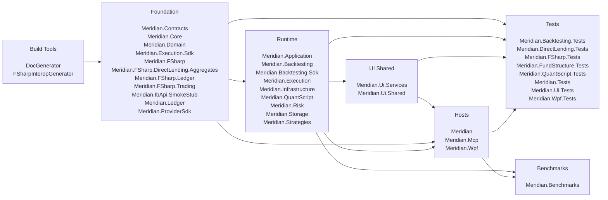

# Project Dependency Graph

> Generated: 2026-06-02 08:11:40 UTC

## Summary

| Metric | Value |
|--------|-------|
| Total Projects | 36 |
| Foundation Projects | 11 |
| Runtime Projects | 9 |
| UI/Host Projects | 5 |
| Test Projects | 8 |
| Build/Benchmark Projects | 3 |
| Root Projects | 12 |
| Leaf Projects | 7 |
| Circular Dependencies | 0 |

> This file is auto-generated. Do not edit manually.

## Project Family Overview

```mermaid
flowchart LR
    BuildTools["Build Tools<br/><br/>DocGenerator<br/>FSharpInteropGenerator"]
    Foundation["Foundation<br/><br/>Meridian.Contracts<br/>Meridian.Core<br/>Meridian.Domain<br/>Meridian.Execution.Sdk<br/>Meridian.FSharp<br/>Meridian.FSharp.DirectLending.Aggregates<br/>Meridian.FSharp.Ledger<br/>Meridian.FSharp.Trading<br/>Meridian.IbApi.SmokeStub<br/>Meridian.Ledger<br/>Meridian.ProviderSdk"]
    Runtime["Runtime<br/><br/>Meridian.Application<br/>Meridian.Backtesting<br/>Meridian.Backtesting.Sdk<br/>Meridian.Execution<br/>Meridian.Infrastructure<br/>Meridian.QuantScript<br/>Meridian.Risk<br/>Meridian.Storage<br/>Meridian.Strategies"]
    UIShared["UI Shared<br/><br/>Meridian.Ui.Services<br/>Meridian.Ui.Shared"]
    Hosts["Hosts<br/><br/>Meridian<br/>Meridian.Mcp<br/>Meridian.Wpf"]
    Benchmarks["Benchmarks<br/><br/>Meridian.Benchmarks"]
    Tests["Tests<br/><br/>Meridian.Backtesting.Tests<br/>Meridian.DirectLending.Tests<br/>Meridian.FSharp.Tests<br/>Meridian.FundStructure.Tests<br/>Meridian.QuantScript.Tests<br/>Meridian.Tests<br/>Meridian.Ui.Tests<br/>Meridian.Wpf.Tests"]
    BuildTools --> Foundation
    Foundation --> Runtime
    Runtime --> UIShared
    UIShared --> Hosts
    Foundation --> Hosts
    Runtime --> Hosts
    Foundation --> Tests
    Runtime --> Tests
    UIShared --> Tests
    Hosts --> Tests
    Runtime --> Benchmarks
    Hosts --> Benchmarks
```

## Runtime Project Graph

Shows the current source/runtime dependency shape without tests, benchmarks, or build tooling noise.

```mermaid
graph LR
    Meridian[Meridian]
    Meridian_Application[Meridian.Application]
    Meridian_Backtesting[Meridian.Backtesting]
    Meridian_Backtesting_Sdk[Meridian.Backtesting.Sdk]
    Meridian_Contracts[Meridian.Contracts]
    Meridian_Core[Meridian.Core]
    Meridian_Domain[Meridian.Domain]
    Meridian_Execution[Meridian.Execution]
    Meridian_Execution_Sdk[Meridian.Execution.Sdk]
    Meridian_FSharp[Meridian.FSharp]
    Meridian_FSharp_DirectLending_Aggregates[Meridian.FSharp.DirectLending.Aggregates]
    Meridian_FSharp_Ledger[Meridian.FSharp.Ledger]
    Meridian_FSharp_Trading[Meridian.FSharp.Trading]
    Meridian_IbApi_SmokeStub[Meridian.IbApi.SmokeStub]
    Meridian_Infrastructure[Meridian.Infrastructure]
    Meridian_Ledger[Meridian.Ledger]
    Meridian_Mcp[Meridian.Mcp]
    Meridian_ProviderSdk[Meridian.ProviderSdk]
    Meridian_QuantScript[Meridian.QuantScript]
    Meridian_Risk[Meridian.Risk]
    Meridian_Storage[Meridian.Storage]
    Meridian_Strategies[Meridian.Strategies]
    Meridian_Ui_Services[Meridian.Ui.Services]
    Meridian_Ui_Shared[Meridian.Ui.Shared]
    Meridian_Wpf[Meridian.Wpf]
    Meridian[Meridian] --> Meridian_Application[Meridian.Application]
    Meridian[Meridian] --> Meridian_Infrastructure[Meridian.Infrastructure]
    Meridian[Meridian] --> Meridian_Storage[Meridian.Storage]
    Meridian[Meridian] --> Meridian_Core[Meridian.Core]
    Meridian[Meridian] --> Meridian_Domain[Meridian.Domain]
    Meridian[Meridian] --> Meridian_Contracts[Meridian.Contracts]
    Meridian[Meridian] --> Meridian_ProviderSdk[Meridian.ProviderSdk]
    Meridian[Meridian] --> Meridian_QuantScript[Meridian.QuantScript]
    Meridian[Meridian] --> Meridian_Ui_Shared[Meridian.Ui.Shared]
    Meridian[Meridian] --> Meridian_Ui_Services[Meridian.Ui.Services]
    Meridian_Application[Meridian.Application] --> Meridian_Infrastructure[Meridian.Infrastructure]
    Meridian_Application[Meridian.Application] --> Meridian_Storage[Meridian.Storage]
    Meridian_Application[Meridian.Application] --> Meridian_Core[Meridian.Core]
    Meridian_Application[Meridian.Application] --> Meridian_Domain[Meridian.Domain]
    Meridian_Application[Meridian.Application] --> Meridian_Contracts[Meridian.Contracts]
    Meridian_Application[Meridian.Application] --> Meridian_ProviderSdk[Meridian.ProviderSdk]
    Meridian_Application[Meridian.Application] --> Meridian_FSharp[Meridian.FSharp]
    Meridian_Application[Meridian.Application] --> Meridian_FSharp_DirectLending_Aggregates[Meridian.FSharp.DirectLending.Aggregates]
    Meridian_Application[Meridian.Application] --> Meridian_FSharp_Ledger[Meridian.FSharp.Ledger]
    Meridian_Application[Meridian.Application] --> Meridian_Ledger[Meridian.Ledger]
    Meridian_Backtesting[Meridian.Backtesting] --> Meridian_Backtesting_Sdk[Meridian.Backtesting.Sdk]
    Meridian_Backtesting[Meridian.Backtesting] --> Meridian_Storage[Meridian.Storage]
    Meridian_Backtesting[Meridian.Backtesting] --> Meridian_Application[Meridian.Application]
    Meridian_Backtesting[Meridian.Backtesting] --> Meridian_Strategies[Meridian.Strategies]
    Meridian_Backtesting_Sdk[Meridian.Backtesting.Sdk] --> Meridian_Contracts[Meridian.Contracts]
    Meridian_Backtesting_Sdk[Meridian.Backtesting.Sdk] --> Meridian_Ledger[Meridian.Ledger]
    Meridian_Core[Meridian.Core] --> Meridian_Contracts[Meridian.Contracts]
    Meridian_Core[Meridian.Core] --> Meridian_Domain[Meridian.Domain]
    Meridian_Core[Meridian.Core] --> Meridian_ProviderSdk[Meridian.ProviderSdk]
    Meridian_Domain[Meridian.Domain] --> Meridian_Contracts[Meridian.Contracts]
    Meridian_Domain[Meridian.Domain] --> Meridian_ProviderSdk[Meridian.ProviderSdk]
    Meridian_Execution[Meridian.Execution] --> Meridian_Execution_Sdk[Meridian.Execution.Sdk]
    Meridian_Execution[Meridian.Execution] --> Meridian_Ledger[Meridian.Ledger]
    Meridian_Execution[Meridian.Execution] --> Meridian_Application[Meridian.Application]
    Meridian_Execution[Meridian.Execution] --> Meridian_Core[Meridian.Core]
    Meridian_Execution[Meridian.Execution] --> Meridian_Contracts[Meridian.Contracts]
    Meridian_Execution_Sdk[Meridian.Execution.Sdk] --> Meridian_Contracts[Meridian.Contracts]
    Meridian_FSharp[Meridian.FSharp] --> Meridian_Contracts[Meridian.Contracts]
    Meridian_FSharp[Meridian.FSharp] --> Meridian_Execution_Sdk[Meridian.Execution.Sdk]
    Meridian_FSharp[Meridian.FSharp] --> Meridian_Backtesting_Sdk[Meridian.Backtesting.Sdk]
    Meridian_FSharp_DirectLending_Aggregates[Meridian.FSharp.DirectLending.Aggregates] --> Meridian_Contracts[Meridian.Contracts]
    Meridian_FSharp_DirectLending_Aggregates[Meridian.FSharp.DirectLending.Aggregates] --> Meridian_FSharp[Meridian.FSharp]
    Meridian_Infrastructure[Meridian.Infrastructure] --> Meridian_Core[Meridian.Core]
    Meridian_Infrastructure[Meridian.Infrastructure] --> Meridian_Domain[Meridian.Domain]
    Meridian_Infrastructure[Meridian.Infrastructure] --> Meridian_Contracts[Meridian.Contracts]
    Meridian_Infrastructure[Meridian.Infrastructure] --> Meridian_ProviderSdk[Meridian.ProviderSdk]
    Meridian_Infrastructure[Meridian.Infrastructure] --> Meridian_Execution_Sdk[Meridian.Execution.Sdk]
    Meridian_Infrastructure[Meridian.Infrastructure] --> Meridian_Storage[Meridian.Storage]
    Meridian_Infrastructure[Meridian.Infrastructure] --> Meridian_IbApi_SmokeStub[Meridian.IbApi.SmokeStub]
    Meridian_Ledger[Meridian.Ledger] --> Meridian_Core[Meridian.Core]
    Meridian_Ledger[Meridian.Ledger] --> Meridian_FSharp_Ledger[Meridian.FSharp.Ledger]
    Meridian_ProviderSdk[Meridian.ProviderSdk] --> Meridian_Contracts[Meridian.Contracts]
    Meridian_QuantScript[Meridian.QuantScript] --> Meridian_ProviderSdk[Meridian.ProviderSdk]
    Meridian_QuantScript[Meridian.QuantScript] --> Meridian_Backtesting[Meridian.Backtesting]
    Meridian_QuantScript[Meridian.QuantScript] --> Meridian_Backtesting_Sdk[Meridian.Backtesting.Sdk]
    Meridian_QuantScript[Meridian.QuantScript] --> Meridian_Application[Meridian.Application]
    Meridian_QuantScript[Meridian.QuantScript] --> Meridian_Storage[Meridian.Storage]
    Meridian_QuantScript[Meridian.QuantScript] --> Meridian_Contracts[Meridian.Contracts]
    Meridian_QuantScript[Meridian.QuantScript] --> Meridian_Domain[Meridian.Domain]
    Meridian_Risk[Meridian.Risk] --> Meridian_Execution_Sdk[Meridian.Execution.Sdk]
    Meridian_Risk[Meridian.Risk] --> Meridian_Execution[Meridian.Execution]
    Meridian_Risk[Meridian.Risk] --> Meridian_Contracts[Meridian.Contracts]
    Meridian_Risk[Meridian.Risk] --> Meridian_FSharp[Meridian.FSharp]
    Meridian_Storage[Meridian.Storage] --> Meridian_Core[Meridian.Core]
    Meridian_Storage[Meridian.Storage] --> Meridian_Domain[Meridian.Domain]
    Meridian_Storage[Meridian.Storage] --> Meridian_Contracts[Meridian.Contracts]
    Meridian_Storage[Meridian.Storage] --> Meridian_Ledger[Meridian.Ledger]
    Meridian_Storage[Meridian.Storage] --> Meridian_ProviderSdk[Meridian.ProviderSdk]
    Meridian_Strategies[Meridian.Strategies] --> Meridian_Backtesting_Sdk[Meridian.Backtesting.Sdk]
    Meridian_Strategies[Meridian.Strategies] --> Meridian_Contracts[Meridian.Contracts]
    Meridian_Strategies[Meridian.Strategies] --> Meridian_Core[Meridian.Core]
    Meridian_Strategies[Meridian.Strategies] --> Meridian_Execution[Meridian.Execution]
    Meridian_Strategies[Meridian.Strategies] --> Meridian_Execution_Sdk[Meridian.Execution.Sdk]
    Meridian_Strategies[Meridian.Strategies] --> Meridian_FSharp[Meridian.FSharp]
    Meridian_Strategies[Meridian.Strategies] --> Meridian_FSharp_Ledger[Meridian.FSharp.Ledger]
    Meridian_Strategies[Meridian.Strategies] --> Meridian_FSharp_Trading[Meridian.FSharp.Trading]
    Meridian_Strategies[Meridian.Strategies] --> Meridian_Infrastructure[Meridian.Infrastructure]
    Meridian_Ui_Services[Meridian.Ui.Services] --> Meridian_Contracts[Meridian.Contracts]
    Meridian_Ui_Services[Meridian.Ui.Services] --> Meridian_Infrastructure[Meridian.Infrastructure]
    Meridian_Ui_Services[Meridian.Ui.Services] --> Meridian_Storage[Meridian.Storage]
    Meridian_Ui_Services[Meridian.Ui.Services] --> Meridian_Ui_Shared[Meridian.Ui.Shared]
    Meridian_Ui_Shared[Meridian.Ui.Shared] --> Meridian_Contracts[Meridian.Contracts]
    Meridian_Ui_Shared[Meridian.Ui.Shared] --> Meridian_Application[Meridian.Application]
    Meridian_Ui_Shared[Meridian.Ui.Shared] --> Meridian_Backtesting[Meridian.Backtesting]
    Meridian_Ui_Shared[Meridian.Ui.Shared] --> Meridian_Backtesting_Sdk[Meridian.Backtesting.Sdk]
    Meridian_Ui_Shared[Meridian.Ui.Shared] --> Meridian_Execution[Meridian.Execution]
    Meridian_Ui_Shared[Meridian.Ui.Shared] --> Meridian_FSharp[Meridian.FSharp]
    Meridian_Ui_Shared[Meridian.Ui.Shared] --> Meridian_FSharp_Ledger[Meridian.FSharp.Ledger]
    Meridian_Ui_Shared[Meridian.Ui.Shared] --> Meridian_QuantScript[Meridian.QuantScript]
    Meridian_Ui_Shared[Meridian.Ui.Shared] --> Meridian_Storage[Meridian.Storage]
    Meridian_Ui_Shared[Meridian.Ui.Shared] --> Meridian_Strategies[Meridian.Strategies]
    Meridian_Wpf[Meridian.Wpf] --> Meridian_Ui_Services[Meridian.Ui.Services]
    Meridian_Wpf[Meridian.Wpf] --> Meridian_Ui_Shared[Meridian.Ui.Shared]
    Meridian_Wpf[Meridian.Wpf] --> Meridian_Backtesting[Meridian.Backtesting]
    Meridian_Wpf[Meridian.Wpf] --> Meridian_Storage[Meridian.Storage]
    Meridian_Wpf[Meridian.Wpf] --> Meridian_Strategies[Meridian.Strategies]
    Meridian_Wpf[Meridian.Wpf] --> Meridian_QuantScript[Meridian.QuantScript]
```

## Entry Point Projects

These projects are not referenced by other projects:

- **DocGenerator**
  - NuGet Packages: 1
- **FSharpInteropGenerator**
- **Meridian.Backtesting.Tests**
  - Dependencies: 3
  - NuGet Packages: 6
- **Meridian.Benchmarks**
  - Dependencies: 6
  - NuGet Packages: 3
- **Meridian.DirectLending.Tests**
  - Dependencies: 3
  - NuGet Packages: 7
- **Meridian.FSharp.Tests**
  - Dependencies: 8
  - NuGet Packages: 7
- **Meridian.FundStructure.Tests**
  - Dependencies: 3
  - NuGet Packages: 4
- **Meridian.Mcp**
  - NuGet Packages: 2
- **Meridian.QuantScript.Tests**
  - Dependencies: 1
  - NuGet Packages: 8
- **Meridian.Tests**
  - Dependencies: 15
  - NuGet Packages: 15
- **Meridian.Ui.Tests**
  - Dependencies: 1
  - NuGet Packages: 6
- **Meridian.Wpf.Tests**
  - Dependencies: 2
  - NuGet Packages: 7

## Most Complex Projects

Projects with the most dependencies:

| Project | Project Deps | Package Deps | Total |
|---------|--------------|--------------|-------|
| Meridian.Application | 10 | 22 | 32 |
| Meridian.Tests | 15 | 15 | 30 |
| Meridian.Wpf | 6 | 14 | 20 |
| Meridian.Infrastructure | 7 | 12 | 19 |
| Meridian | 10 | 8 | 18 |
| Meridian.FSharp.Tests | 8 | 7 | 15 |
| Meridian.Storage | 5 | 9 | 14 |
| Meridian.Ui.Shared | 10 | 3 | 13 |
| Meridian.QuantScript | 7 | 5 | 12 |
| Meridian.Strategies | 9 | 2 | 11 |

## Full Dependency Graph

```mermaid
graph LR
    DocGenerator[DocGenerator]
    FSharpInteropGenerator[FSharpInteropGenerator]
    Meridian[Meridian]
    Meridian_Application[Meridian.Application]
    Meridian_Backtesting[Meridian.Backtesting]
    Meridian_Backtesting_Sdk[Meridian.Backtesting.Sdk]
    Meridian_Backtesting_Tests[Meridian.Backtesting.Tests]
    Meridian_Benchmarks[Meridian.Benchmarks]
    Meridian_Contracts[Meridian.Contracts]
    Meridian_Core[Meridian.Core]
    Meridian_DirectLending_Tests[Meridian.DirectLending.Tests]
    Meridian_Domain[Meridian.Domain]
    Meridian_Execution[Meridian.Execution]
    Meridian_Execution_Sdk[Meridian.Execution.Sdk]
    Meridian_FSharp[Meridian.FSharp]
    Meridian_FSharp_DirectLending_Aggregates[Meridian.FSharp.DirectLending.Aggregates]
    Meridian_FSharp_Ledger[Meridian.FSharp.Ledger]
    Meridian_FSharp_Tests[Meridian.FSharp.Tests]
    Meridian_FSharp_Trading[Meridian.FSharp.Trading]
    Meridian_FundStructure_Tests[Meridian.FundStructure.Tests]
    Meridian_IbApi_SmokeStub[Meridian.IbApi.SmokeStub]
    Meridian_Infrastructure[Meridian.Infrastructure]
    Meridian_Ledger[Meridian.Ledger]
    Meridian_Mcp[Meridian.Mcp]
    Meridian_ProviderSdk[Meridian.ProviderSdk]
    Meridian_QuantScript[Meridian.QuantScript]
    Meridian_QuantScript_Tests[Meridian.QuantScript.Tests]
    Meridian_Risk[Meridian.Risk]
    Meridian_Storage[Meridian.Storage]
    Meridian_Strategies[Meridian.Strategies]
    Meridian_Tests[Meridian.Tests]
    Meridian_Ui_Services[Meridian.Ui.Services]
    Meridian_Ui_Shared[Meridian.Ui.Shared]
    Meridian_Ui_Tests[Meridian.Ui.Tests]
    Meridian_Wpf[Meridian.Wpf]
    Meridian_Wpf_Tests[Meridian.Wpf.Tests]
    Meridian[Meridian] --> Meridian_Application[Meridian.Application]
    Meridian[Meridian] --> Meridian_Infrastructure[Meridian.Infrastructure]
    Meridian[Meridian] --> Meridian_Storage[Meridian.Storage]
    Meridian[Meridian] --> Meridian_Core[Meridian.Core]
    Meridian[Meridian] --> Meridian_Domain[Meridian.Domain]
    Meridian[Meridian] --> Meridian_Contracts[Meridian.Contracts]
    Meridian[Meridian] --> Meridian_ProviderSdk[Meridian.ProviderSdk]
    Meridian[Meridian] --> Meridian_QuantScript[Meridian.QuantScript]
    Meridian[Meridian] --> Meridian_Ui_Shared[Meridian.Ui.Shared]
    Meridian[Meridian] --> Meridian_Ui_Services[Meridian.Ui.Services]
    Meridian_Application[Meridian.Application] --> Meridian_Infrastructure[Meridian.Infrastructure]
    Meridian_Application[Meridian.Application] --> Meridian_Storage[Meridian.Storage]
    Meridian_Application[Meridian.Application] --> Meridian_Core[Meridian.Core]
    Meridian_Application[Meridian.Application] --> Meridian_Domain[Meridian.Domain]
    Meridian_Application[Meridian.Application] --> Meridian_Contracts[Meridian.Contracts]
    Meridian_Application[Meridian.Application] --> Meridian_ProviderSdk[Meridian.ProviderSdk]
    Meridian_Application[Meridian.Application] --> Meridian_FSharp[Meridian.FSharp]
    Meridian_Application[Meridian.Application] --> Meridian_FSharp_DirectLending_Aggregates[Meridian.FSharp.DirectLending.Aggregates]
    Meridian_Application[Meridian.Application] --> Meridian_FSharp_Ledger[Meridian.FSharp.Ledger]
    Meridian_Application[Meridian.Application] --> Meridian_Ledger[Meridian.Ledger]
    Meridian_Backtesting[Meridian.Backtesting] --> Meridian_Backtesting_Sdk[Meridian.Backtesting.Sdk]
    Meridian_Backtesting[Meridian.Backtesting] --> Meridian_Storage[Meridian.Storage]
    Meridian_Backtesting[Meridian.Backtesting] --> Meridian_Application[Meridian.Application]
    Meridian_Backtesting[Meridian.Backtesting] --> Meridian_Strategies[Meridian.Strategies]
    Meridian_Backtesting_Sdk[Meridian.Backtesting.Sdk] --> Meridian_Contracts[Meridian.Contracts]
    Meridian_Backtesting_Sdk[Meridian.Backtesting.Sdk] --> Meridian_Ledger[Meridian.Ledger]
    Meridian_Backtesting_Tests[Meridian.Backtesting.Tests] --> Meridian_Backtesting[Meridian.Backtesting]
    Meridian_Backtesting_Tests[Meridian.Backtesting.Tests] --> Meridian_Backtesting_Sdk[Meridian.Backtesting.Sdk]
    Meridian_Backtesting_Tests[Meridian.Backtesting.Tests] --> Meridian_Infrastructure[Meridian.Infrastructure]
    Meridian_Benchmarks[Meridian.Benchmarks] --> Meridian[Meridian]
    Meridian_Benchmarks[Meridian.Benchmarks] --> Meridian_Application[Meridian.Application]
    Meridian_Benchmarks[Meridian.Benchmarks] --> Meridian_Core[Meridian.Core]
    Meridian_Benchmarks[Meridian.Benchmarks] --> Meridian_Strategies[Meridian.Strategies]
    Meridian_Benchmarks[Meridian.Benchmarks] --> Meridian_Domain[Meridian.Domain]
    Meridian_Benchmarks[Meridian.Benchmarks] --> Meridian_Storage[Meridian.Storage]
    Meridian_Core[Meridian.Core] --> Meridian_Contracts[Meridian.Contracts]
    Meridian_Core[Meridian.Core] --> Meridian_Domain[Meridian.Domain]
    Meridian_Core[Meridian.Core] --> Meridian_ProviderSdk[Meridian.ProviderSdk]
    Meridian_DirectLending_Tests[Meridian.DirectLending.Tests] --> Meridian_Application[Meridian.Application]
    Meridian_DirectLending_Tests[Meridian.DirectLending.Tests] --> Meridian_Contracts[Meridian.Contracts]
    Meridian_DirectLending_Tests[Meridian.DirectLending.Tests] --> Meridian_Storage[Meridian.Storage]
    Meridian_Domain[Meridian.Domain] --> Meridian_Contracts[Meridian.Contracts]
    Meridian_Domain[Meridian.Domain] --> Meridian_ProviderSdk[Meridian.ProviderSdk]
    Meridian_Execution[Meridian.Execution] --> Meridian_Execution_Sdk[Meridian.Execution.Sdk]
    Meridian_Execution[Meridian.Execution] --> Meridian_Ledger[Meridian.Ledger]
    Meridian_Execution[Meridian.Execution] --> Meridian_Application[Meridian.Application]
    Meridian_Execution[Meridian.Execution] --> Meridian_Core[Meridian.Core]
    Meridian_Execution[Meridian.Execution] --> Meridian_Contracts[Meridian.Contracts]
    Meridian_Execution_Sdk[Meridian.Execution.Sdk] --> Meridian_Contracts[Meridian.Contracts]
    Meridian_FSharp[Meridian.FSharp] --> Meridian_Contracts[Meridian.Contracts]
    Meridian_FSharp[Meridian.FSharp] --> Meridian_Execution_Sdk[Meridian.Execution.Sdk]
    Meridian_FSharp[Meridian.FSharp] --> Meridian_Backtesting_Sdk[Meridian.Backtesting.Sdk]
    Meridian_FSharp_DirectLending_Aggregates[Meridian.FSharp.DirectLending.Aggregates] --> Meridian_Contracts[Meridian.Contracts]
    Meridian_FSharp_DirectLending_Aggregates[Meridian.FSharp.DirectLending.Aggregates] --> Meridian_FSharp[Meridian.FSharp]
    Meridian_FSharp_Tests[Meridian.FSharp.Tests] --> Meridian_Backtesting_Sdk[Meridian.Backtesting.Sdk]
    Meridian_FSharp_Tests[Meridian.FSharp.Tests] --> Meridian_Contracts[Meridian.Contracts]
    Meridian_FSharp_Tests[Meridian.FSharp.Tests] --> Meridian_Execution_Sdk[Meridian.Execution.Sdk]
    Meridian_FSharp_Tests[Meridian.FSharp.Tests] --> Meridian_FSharp[Meridian.FSharp]
    Meridian_FSharp_Tests[Meridian.FSharp.Tests] --> Meridian_FSharp_DirectLending_Aggregates[Meridian.FSharp.DirectLending.Aggregates]
    Meridian_FSharp_Tests[Meridian.FSharp.Tests] --> Meridian_FSharp_Trading[Meridian.FSharp.Trading]
    Meridian_FSharp_Tests[Meridian.FSharp.Tests] --> Meridian_FSharp_Ledger[Meridian.FSharp.Ledger]
    Meridian_FSharp_Tests[Meridian.FSharp.Tests] --> Meridian_Ledger[Meridian.Ledger]
    Meridian_FundStructure_Tests[Meridian.FundStructure.Tests] --> Meridian_Application[Meridian.Application]
    Meridian_FundStructure_Tests[Meridian.FundStructure.Tests] --> Meridian_Contracts[Meridian.Contracts]
    Meridian_FundStructure_Tests[Meridian.FundStructure.Tests] --> Meridian_Ui_Shared[Meridian.Ui.Shared]
    Meridian_Infrastructure[Meridian.Infrastructure] --> Meridian_Core[Meridian.Core]
    Meridian_Infrastructure[Meridian.Infrastructure] --> Meridian_Domain[Meridian.Domain]
    Meridian_Infrastructure[Meridian.Infrastructure] --> Meridian_Contracts[Meridian.Contracts]
    Meridian_Infrastructure[Meridian.Infrastructure] --> Meridian_ProviderSdk[Meridian.ProviderSdk]
    Meridian_Infrastructure[Meridian.Infrastructure] --> Meridian_Execution_Sdk[Meridian.Execution.Sdk]
    Meridian_Infrastructure[Meridian.Infrastructure] --> Meridian_Storage[Meridian.Storage]
    Meridian_Infrastructure[Meridian.Infrastructure] --> Meridian_IbApi_SmokeStub[Meridian.IbApi.SmokeStub]
    Meridian_Ledger[Meridian.Ledger] --> Meridian_Core[Meridian.Core]
    Meridian_Ledger[Meridian.Ledger] --> Meridian_FSharp_Ledger[Meridian.FSharp.Ledger]
    Meridian_ProviderSdk[Meridian.ProviderSdk] --> Meridian_Contracts[Meridian.Contracts]
    Meridian_QuantScript[Meridian.QuantScript] --> Meridian_ProviderSdk[Meridian.ProviderSdk]
    Meridian_QuantScript[Meridian.QuantScript] --> Meridian_Backtesting[Meridian.Backtesting]
    Meridian_QuantScript[Meridian.QuantScript] --> Meridian_Backtesting_Sdk[Meridian.Backtesting.Sdk]
    Meridian_QuantScript[Meridian.QuantScript] --> Meridian_Application[Meridian.Application]
    Meridian_QuantScript[Meridian.QuantScript] --> Meridian_Storage[Meridian.Storage]
    Meridian_QuantScript[Meridian.QuantScript] --> Meridian_Contracts[Meridian.Contracts]
    Meridian_QuantScript[Meridian.QuantScript] --> Meridian_Domain[Meridian.Domain]
    Meridian_QuantScript_Tests[Meridian.QuantScript.Tests] --> Meridian_QuantScript[Meridian.QuantScript]
    Meridian_Risk[Meridian.Risk] --> Meridian_Execution_Sdk[Meridian.Execution.Sdk]
    Meridian_Risk[Meridian.Risk] --> Meridian_Execution[Meridian.Execution]
    Meridian_Risk[Meridian.Risk] --> Meridian_Contracts[Meridian.Contracts]
    Meridian_Risk[Meridian.Risk] --> Meridian_FSharp[Meridian.FSharp]
    Meridian_Storage[Meridian.Storage] --> Meridian_Core[Meridian.Core]
    Meridian_Storage[Meridian.Storage] --> Meridian_Domain[Meridian.Domain]
    Meridian_Storage[Meridian.Storage] --> Meridian_Contracts[Meridian.Contracts]
    Meridian_Storage[Meridian.Storage] --> Meridian_Ledger[Meridian.Ledger]
    Meridian_Storage[Meridian.Storage] --> Meridian_ProviderSdk[Meridian.ProviderSdk]
    Meridian_Strategies[Meridian.Strategies] --> Meridian_Backtesting_Sdk[Meridian.Backtesting.Sdk]
    Meridian_Strategies[Meridian.Strategies] --> Meridian_Contracts[Meridian.Contracts]
    Meridian_Strategies[Meridian.Strategies] --> Meridian_Core[Meridian.Core]
    Meridian_Strategies[Meridian.Strategies] --> Meridian_Execution[Meridian.Execution]
    Meridian_Strategies[Meridian.Strategies] --> Meridian_Execution_Sdk[Meridian.Execution.Sdk]
    Meridian_Strategies[Meridian.Strategies] --> Meridian_FSharp[Meridian.FSharp]
    Meridian_Strategies[Meridian.Strategies] --> Meridian_FSharp_Ledger[Meridian.FSharp.Ledger]
    Meridian_Strategies[Meridian.Strategies] --> Meridian_FSharp_Trading[Meridian.FSharp.Trading]
    Meridian_Strategies[Meridian.Strategies] --> Meridian_Infrastructure[Meridian.Infrastructure]
    Meridian_Tests[Meridian.Tests] --> Meridian[Meridian]
    Meridian_Tests[Meridian.Tests] --> Meridian_Application[Meridian.Application]
    Meridian_Tests[Meridian.Tests] --> Meridian_Backtesting[Meridian.Backtesting]
    Meridian_Tests[Meridian.Tests] --> Meridian_Backtesting_Sdk[Meridian.Backtesting.Sdk]
    Meridian_Tests[Meridian.Tests] --> Meridian_Execution[Meridian.Execution]
    Meridian_Tests[Meridian.Tests] --> Meridian_Execution_Sdk[Meridian.Execution.Sdk]
    Meridian_Tests[Meridian.Tests] --> Meridian_Infrastructure[Meridian.Infrastructure]
    Meridian_Tests[Meridian.Tests] --> Meridian_Ledger[Meridian.Ledger]
    Meridian_Tests[Meridian.Tests] --> Meridian_Risk[Meridian.Risk]
    Meridian_Tests[Meridian.Tests] --> Meridian_Storage[Meridian.Storage]
    Meridian_Tests[Meridian.Tests] --> Meridian_Strategies[Meridian.Strategies]
    Meridian_Tests[Meridian.Tests] --> Meridian_Core[Meridian.Core]
    Meridian_Tests[Meridian.Tests] --> Meridian_Domain[Meridian.Domain]
    Meridian_Tests[Meridian.Tests] --> Meridian_Ui_Shared[Meridian.Ui.Shared]
    Meridian_Tests[Meridian.Tests] --> Meridian_Ui_Services[Meridian.Ui.Services]
    Meridian_Ui_Services[Meridian.Ui.Services] --> Meridian_Contracts[Meridian.Contracts]
    Meridian_Ui_Services[Meridian.Ui.Services] --> Meridian_Infrastructure[Meridian.Infrastructure]
    Meridian_Ui_Services[Meridian.Ui.Services] --> Meridian_Storage[Meridian.Storage]
    Meridian_Ui_Services[Meridian.Ui.Services] --> Meridian_Ui_Shared[Meridian.Ui.Shared]
    Meridian_Ui_Shared[Meridian.Ui.Shared] --> Meridian_Contracts[Meridian.Contracts]
    Meridian_Ui_Shared[Meridian.Ui.Shared] --> Meridian_Application[Meridian.Application]
    Meridian_Ui_Shared[Meridian.Ui.Shared] --> Meridian_Backtesting[Meridian.Backtesting]
    Meridian_Ui_Shared[Meridian.Ui.Shared] --> Meridian_Backtesting_Sdk[Meridian.Backtesting.Sdk]
    Meridian_Ui_Shared[Meridian.Ui.Shared] --> Meridian_Execution[Meridian.Execution]
    Meridian_Ui_Shared[Meridian.Ui.Shared] --> Meridian_FSharp[Meridian.FSharp]
    Meridian_Ui_Shared[Meridian.Ui.Shared] --> Meridian_FSharp_Ledger[Meridian.FSharp.Ledger]
    Meridian_Ui_Shared[Meridian.Ui.Shared] --> Meridian_QuantScript[Meridian.QuantScript]
    Meridian_Ui_Shared[Meridian.Ui.Shared] --> Meridian_Storage[Meridian.Storage]
    Meridian_Ui_Shared[Meridian.Ui.Shared] --> Meridian_Strategies[Meridian.Strategies]
    Meridian_Ui_Tests[Meridian.Ui.Tests] --> Meridian_Ui_Services[Meridian.Ui.Services]
    Meridian_Wpf[Meridian.Wpf] --> Meridian_Ui_Services[Meridian.Ui.Services]
    Meridian_Wpf[Meridian.Wpf] --> Meridian_Ui_Shared[Meridian.Ui.Shared]
    Meridian_Wpf[Meridian.Wpf] --> Meridian_Backtesting[Meridian.Backtesting]
    Meridian_Wpf[Meridian.Wpf] --> Meridian_Storage[Meridian.Storage]
    Meridian_Wpf[Meridian.Wpf] --> Meridian_Strategies[Meridian.Strategies]
    Meridian_Wpf[Meridian.Wpf] --> Meridian_QuantScript[Meridian.QuantScript]
    Meridian_Wpf_Tests[Meridian.Wpf.Tests] --> Meridian_Wpf[Meridian.Wpf]
    Meridian_Wpf_Tests[Meridian.Wpf.Tests] --> Meridian_Ui_Services[Meridian.Ui.Services]
```

## Project Details

### DocGenerator

**Path:** `build/dotnet/DocGenerator/DocGenerator.csproj`

**NuGet Packages (1):**
- System.CommandLine

### FSharpInteropGenerator

**Path:** `build/dotnet/FSharpInteropGenerator/FSharpInteropGenerator.csproj`

### Meridian

**Path:** `src/Meridian/Meridian.csproj`

**Project References:**
- Meridian.Application
- Meridian.Contracts
- Meridian.Core
- Meridian.Domain
- Meridian.Infrastructure
- Meridian.ProviderSdk
- Meridian.QuantScript
- Meridian.Storage
- Meridian.Ui.Services
- Meridian.Ui.Shared

**Referenced By:**
- Meridian.Benchmarks
- Meridian.Tests

**NuGet Packages (8):**
- Microsoft.AspNetCore.OpenApi
- QuantConnect.Common
- QuantConnect.Indicators
- QuantConnect.Lean
- QuantConnect.Lean.Engine
- Serilog
- Serilog.Extensions.Logging
- Swashbuckle.AspNetCore

### Meridian.Application

**Path:** `src/Meridian.Application/Meridian.Application.csproj`

**Project References:**
- Meridian.Contracts
- Meridian.Core
- Meridian.Domain
- Meridian.FSharp
- Meridian.FSharp.DirectLending.Aggregates
- Meridian.FSharp.Ledger
- Meridian.Infrastructure
- Meridian.Ledger
- Meridian.ProviderSdk
- Meridian.Storage

**Referenced By:**
- Meridian
- Meridian.Backtesting
- Meridian.Benchmarks
- Meridian.DirectLending.Tests
- Meridian.Execution
- Meridian.FundStructure.Tests
- Meridian.QuantScript
- Meridian.Tests
- Meridian.Ui.Shared

**NuGet Packages (22):**
- FluentValidation
- Microsoft.Extensions.Http.Polly
- Npgsql
- OpenTelemetry
- OpenTelemetry.Api
- OpenTelemetry.Exporter.Console
- OpenTelemetry.Exporter.OpenTelemetryProtocol
- OpenTelemetry.Exporter.Prometheus.AspNetCore
- OpenTelemetry.Extensions.Hosting
- OpenTelemetry.Instrumentation.AspNetCore
- ... and 12 more

### Meridian.Backtesting

**Path:** `src/Meridian.Backtesting/Meridian.Backtesting.csproj`

**Project References:**
- Meridian.Application
- Meridian.Backtesting.Sdk
- Meridian.Storage
- Meridian.Strategies

**Referenced By:**
- Meridian.Backtesting.Tests
- Meridian.QuantScript
- Meridian.Tests
- Meridian.Ui.Shared
- Meridian.Wpf

**NuGet Packages (1):**
- Microsoft.Extensions.Logging.Abstractions

### Meridian.Backtesting.Sdk

**Path:** `src/Meridian.Backtesting.Sdk/Meridian.Backtesting.Sdk.csproj`

**Project References:**
- Meridian.Contracts
- Meridian.Ledger

**Referenced By:**
- Meridian.Backtesting
- Meridian.Backtesting.Tests
- Meridian.FSharp
- Meridian.FSharp.Tests
- Meridian.QuantScript
- Meridian.Strategies
- Meridian.Tests
- Meridian.Ui.Shared

### Meridian.Backtesting.Tests

**Path:** `tests/Meridian.Backtesting.Tests/Meridian.Backtesting.Tests.csproj`

**Project References:**
- Meridian.Backtesting
- Meridian.Backtesting.Sdk
- Meridian.Infrastructure

**NuGet Packages (6):**
- FluentAssertions
- FsCheck.Xunit
- Microsoft.NET.Test.Sdk
- coverlet.collector
- xunit
- xunit.runner.visualstudio

### Meridian.Benchmarks

**Path:** `benchmarks/Meridian.Benchmarks/Meridian.Benchmarks.csproj`

**Project References:**
- Meridian
- Meridian.Application
- Meridian.Core
- Meridian.Domain
- Meridian.Storage
- Meridian.Strategies

**NuGet Packages (3):**
- BenchmarkDotNet
- BenchmarkDotNet.Diagnostics.Windows
- Newtonsoft.Json

### Meridian.Contracts

**Path:** `src/Meridian.Contracts/Meridian.Contracts.csproj`

**Referenced By:**
- Meridian
- Meridian.Application
- Meridian.Backtesting.Sdk
- Meridian.Core
- Meridian.DirectLending.Tests
- Meridian.Domain
- Meridian.Execution
- Meridian.Execution.Sdk
- Meridian.FSharp
- Meridian.FSharp.DirectLending.Aggregates
- Meridian.FSharp.Tests
- Meridian.FundStructure.Tests
- Meridian.Infrastructure
- Meridian.ProviderSdk
- Meridian.QuantScript
- Meridian.Risk
- Meridian.Storage
- Meridian.Strategies
- Meridian.Ui.Services
- Meridian.Ui.Shared

### Meridian.Core

**Path:** `src/Meridian.Core/Meridian.Core.csproj`

**Project References:**
- Meridian.Contracts
- Meridian.Domain
- Meridian.ProviderSdk

**Referenced By:**
- Meridian
- Meridian.Application
- Meridian.Benchmarks
- Meridian.Execution
- Meridian.Infrastructure
- Meridian.Ledger
- Meridian.Storage
- Meridian.Strategies
- Meridian.Tests

**NuGet Packages (5):**
- Microsoft.Extensions.Configuration
- Serilog
- Serilog.Settings.Configuration
- Serilog.Sinks.Console
- Serilog.Sinks.File

### Meridian.DirectLending.Tests

**Path:** `tests/Meridian.DirectLending.Tests/Meridian.DirectLending.Tests.csproj`

**Project References:**
- Meridian.Application
- Meridian.Contracts
- Meridian.Storage

**NuGet Packages (7):**
- FluentAssertions
- Microsoft.NET.Test.Sdk
- Npgsql
- Testcontainers.PostgreSql
- coverlet.collector
- xunit
- xunit.runner.visualstudio

### Meridian.Domain

**Path:** `src/Meridian.Domain/Meridian.Domain.csproj`

**Project References:**
- Meridian.Contracts
- Meridian.ProviderSdk

**Referenced By:**
- Meridian
- Meridian.Application
- Meridian.Benchmarks
- Meridian.Core
- Meridian.Infrastructure
- Meridian.QuantScript
- Meridian.Storage
- Meridian.Tests

### Meridian.Execution

**Path:** `src/Meridian.Execution/Meridian.Execution.csproj`

**Project References:**
- Meridian.Application
- Meridian.Contracts
- Meridian.Core
- Meridian.Execution.Sdk
- Meridian.Ledger

**Referenced By:**
- Meridian.Risk
- Meridian.Strategies
- Meridian.Tests
- Meridian.Ui.Shared

**NuGet Packages (2):**
- Microsoft.Extensions.DependencyInjection.Abstractions
- Microsoft.Extensions.Logging.Abstractions

### Meridian.Execution.Sdk

**Path:** `src/Meridian.Execution.Sdk/Meridian.Execution.Sdk.csproj`

**Project References:**
- Meridian.Contracts

**Referenced By:**
- Meridian.Execution
- Meridian.FSharp
- Meridian.FSharp.Tests
- Meridian.Infrastructure
- Meridian.Risk
- Meridian.Strategies
- Meridian.Tests

### Meridian.FSharp

**Path:** `src/Meridian.FSharp/Meridian.FSharp.fsproj`

**Project References:**
- Meridian.Backtesting.Sdk
- Meridian.Contracts
- Meridian.Execution.Sdk

**Referenced By:**
- Meridian.Application
- Meridian.FSharp.DirectLending.Aggregates
- Meridian.FSharp.Tests
- Meridian.Risk
- Meridian.Strategies
- Meridian.Ui.Shared

**NuGet Packages (1):**
- FSharp.Core

### Meridian.FSharp.DirectLending.Aggregates

**Path:** `src/Meridian.FSharp.DirectLending.Aggregates/Meridian.FSharp.DirectLending.Aggregates.fsproj`

**Project References:**
- Meridian.Contracts
- Meridian.FSharp

**Referenced By:**
- Meridian.Application
- Meridian.FSharp.Tests

**NuGet Packages (2):**
- FSharp.Core
- Sharpino

### Meridian.FSharp.Ledger

**Path:** `src/Meridian.FSharp.Ledger/Meridian.FSharp.Ledger.fsproj`

**Referenced By:**
- Meridian.Application
- Meridian.FSharp.Tests
- Meridian.Ledger
- Meridian.Strategies
- Meridian.Ui.Shared

**NuGet Packages (1):**
- FSharp.Core

### Meridian.FSharp.Tests

**Path:** `tests/Meridian.FSharp.Tests/Meridian.FSharp.Tests.fsproj`

**Project References:**
- Meridian.Backtesting.Sdk
- Meridian.Contracts
- Meridian.Execution.Sdk
- Meridian.FSharp
- Meridian.FSharp.DirectLending.Aggregates
- Meridian.FSharp.Ledger
- Meridian.FSharp.Trading
- Meridian.Ledger

**NuGet Packages (7):**
- FSharp.Core
- FsCheck.Xunit
- FsUnit.xUnit
- Microsoft.NET.Test.Sdk
- coverlet.collector
- xunit
- xunit.runner.visualstudio

### Meridian.FSharp.Trading

**Path:** `src/Meridian.FSharp.Trading/Meridian.FSharp.Trading.fsproj`

**Referenced By:**
- Meridian.FSharp.Tests
- Meridian.Strategies

**NuGet Packages (1):**
- FSharp.Core

### Meridian.FundStructure.Tests

**Path:** `tests/Meridian.FundStructure.Tests/Meridian.FundStructure.Tests.csproj`

**Project References:**
- Meridian.Application
- Meridian.Contracts
- Meridian.Ui.Shared

**NuGet Packages (4):**
- Microsoft.NET.Test.Sdk
- coverlet.collector
- xunit
- xunit.runner.visualstudio

### Meridian.IbApi.SmokeStub

**Path:** `src/Meridian.IbApi.SmokeStub/Meridian.IbApi.SmokeStub.csproj`

**Referenced By:**
- Meridian.Infrastructure

### Meridian.Infrastructure

**Path:** `src/Meridian.Infrastructure/Meridian.Infrastructure.csproj`

**Project References:**
- Meridian.Contracts
- Meridian.Core
- Meridian.Domain
- Meridian.Execution.Sdk
- Meridian.IbApi.SmokeStub
- Meridian.ProviderSdk
- Meridian.Storage

**Referenced By:**
- Meridian
- Meridian.Application
- Meridian.Backtesting.Tests
- Meridian.Strategies
- Meridian.Tests
- Meridian.Ui.Services

**NuGet Packages (12):**
- FluentValidation
- Microsoft.Extensions.DependencyInjection.Abstractions
- Microsoft.Extensions.Hosting
- Microsoft.Extensions.Http
- Microsoft.Extensions.Http.Polly
- Microsoft.Extensions.ObjectPool
- Polly
- Polly.Extensions
- SSH.NET
- Serilog
- ... and 2 more

### Meridian.Ledger

**Path:** `src/Meridian.Ledger/Meridian.Ledger.csproj`

**Project References:**
- Meridian.Core
- Meridian.FSharp.Ledger

**Referenced By:**
- Meridian.Application
- Meridian.Backtesting.Sdk
- Meridian.Execution
- Meridian.FSharp.Tests
- Meridian.Storage
- Meridian.Tests

### Meridian.Mcp

**Path:** `src/Meridian.Mcp/Meridian.Mcp.csproj`

**NuGet Packages (2):**
- Microsoft.Extensions.Hosting
- ModelContextProtocol

### Meridian.ProviderSdk

**Path:** `src/Meridian.ProviderSdk/Meridian.ProviderSdk.csproj`

**Project References:**
- Meridian.Contracts

**Referenced By:**
- Meridian
- Meridian.Application
- Meridian.Core
- Meridian.Domain
- Meridian.Infrastructure
- Meridian.QuantScript
- Meridian.Storage

**NuGet Packages (2):**
- Microsoft.Extensions.DependencyInjection.Abstractions
- Microsoft.Extensions.Logging.Abstractions

### Meridian.QuantScript

**Path:** `src/Meridian.QuantScript/Meridian.QuantScript.csproj`

**Project References:**
- Meridian.Application
- Meridian.Backtesting
- Meridian.Backtesting.Sdk
- Meridian.Contracts
- Meridian.Domain
- Meridian.ProviderSdk
- Meridian.Storage

**Referenced By:**
- Meridian
- Meridian.QuantScript.Tests
- Meridian.Ui.Shared
- Meridian.Wpf

**NuGet Packages (5):**
- Microsoft.CodeAnalysis.CSharp.Scripting
- Microsoft.Extensions.DependencyInjection.Abstractions
- Microsoft.Extensions.Logging.Abstractions
- Microsoft.Extensions.Options
- Skender.Stock.Indicators

### Meridian.QuantScript.Tests

**Path:** `tests/Meridian.QuantScript.Tests/Meridian.QuantScript.Tests.csproj`

**Project References:**
- Meridian.QuantScript

**NuGet Packages (8):**
- FluentAssertions
- Microsoft.Extensions.Logging.Abstractions
- Microsoft.Extensions.Options
- Microsoft.NET.Test.Sdk
- Moq
- coverlet.collector
- xunit
- xunit.runner.visualstudio

### Meridian.Risk

**Path:** `src/Meridian.Risk/Meridian.Risk.csproj`

**Project References:**
- Meridian.Contracts
- Meridian.Execution
- Meridian.Execution.Sdk
- Meridian.FSharp

**Referenced By:**
- Meridian.Tests

**NuGet Packages (2):**
- Microsoft.Extensions.DependencyInjection.Abstractions
- Microsoft.Extensions.Logging.Abstractions

### Meridian.Storage

**Path:** `src/Meridian.Storage/Meridian.Storage.csproj`

**Project References:**
- Meridian.Contracts
- Meridian.Core
- Meridian.Domain
- Meridian.Ledger
- Meridian.ProviderSdk

**Referenced By:**
- Meridian
- Meridian.Application
- Meridian.Backtesting
- Meridian.Benchmarks
- Meridian.DirectLending.Tests
- Meridian.Infrastructure
- Meridian.QuantScript
- Meridian.Tests
- Meridian.Ui.Services
- Meridian.Ui.Shared
- Meridian.Wpf

**NuGet Packages (9):**
- Apache.Arrow
- K4os.Compression.LZ4.Streams
- Microsoft.Extensions.DependencyInjection.Abstractions
- Microsoft.Extensions.Hosting
- Npgsql
- Parquet.Net
- Serilog
- ZstdSharp.Port
- prometheus-net

### Meridian.Strategies

**Path:** `src/Meridian.Strategies/Meridian.Strategies.csproj`

**Project References:**
- Meridian.Backtesting.Sdk
- Meridian.Contracts
- Meridian.Core
- Meridian.Execution
- Meridian.Execution.Sdk
- Meridian.FSharp
- Meridian.FSharp.Ledger
- Meridian.FSharp.Trading
- Meridian.Infrastructure

**Referenced By:**
- Meridian.Backtesting
- Meridian.Benchmarks
- Meridian.Tests
- Meridian.Ui.Shared
- Meridian.Wpf

**NuGet Packages (2):**
- Microsoft.Extensions.DependencyInjection.Abstractions
- Microsoft.Extensions.Logging.Abstractions

### Meridian.Tests

**Path:** `tests/Meridian.Tests/Meridian.Tests.csproj`

**Project References:**
- Meridian
- Meridian.Application
- Meridian.Backtesting
- Meridian.Backtesting.Sdk
- Meridian.Core
- Meridian.Domain
- Meridian.Execution
- Meridian.Execution.Sdk
- Meridian.Infrastructure
- Meridian.Ledger
- Meridian.Risk
- Meridian.Storage
- Meridian.Strategies
- Meridian.Ui.Services
- Meridian.Ui.Shared

**NuGet Packages (15):**
- Bogus
- FluentAssertions
- FsCheck.Xunit
- Microsoft.AspNetCore.Mvc.Testing
- Microsoft.NET.Test.Sdk
- Moq
- NSubstitute
- Npgsql
- System.Reactive
- Testcontainers.PostgreSql
- ... and 5 more

### Meridian.Ui.Services

**Path:** `src/Meridian.Ui.Services/Meridian.Ui.Services.csproj`

**Project References:**
- Meridian.Contracts
- Meridian.Infrastructure
- Meridian.Storage
- Meridian.Ui.Shared

**Referenced By:**
- Meridian
- Meridian.Tests
- Meridian.Ui.Tests
- Meridian.Wpf
- Meridian.Wpf.Tests

**NuGet Packages (4):**
- CommunityToolkit.Mvvm
- Microsoft.Extensions.Http
- Microsoft.Extensions.Http.Polly
- ZstdSharp.Port

### Meridian.Ui.Shared

**Path:** `src/Meridian.Ui.Shared/Meridian.Ui.Shared.csproj`

**Project References:**
- Meridian.Application
- Meridian.Backtesting
- Meridian.Backtesting.Sdk
- Meridian.Contracts
- Meridian.Execution
- Meridian.FSharp
- Meridian.FSharp.Ledger
- Meridian.QuantScript
- Meridian.Storage
- Meridian.Strategies

**Referenced By:**
- Meridian
- Meridian.FundStructure.Tests
- Meridian.Tests
- Meridian.Ui.Services
- Meridian.Wpf

**NuGet Packages (3):**
- Microsoft.AspNetCore.OpenApi
- Serilog
- Swashbuckle.AspNetCore

### Meridian.Ui.Tests

**Path:** `tests/Meridian.Ui.Tests/Meridian.Ui.Tests.csproj`

**Project References:**
- Meridian.Ui.Services

**NuGet Packages (6):**
- FluentAssertions
- Microsoft.NET.Test.Sdk
- Moq
- coverlet.collector
- xunit
- xunit.runner.visualstudio

### Meridian.Wpf

**Path:** `src/Meridian.Wpf/Meridian.Wpf.csproj`

**Project References:**
- Meridian.Backtesting
- Meridian.QuantScript
- Meridian.Storage
- Meridian.Strategies
- Meridian.Ui.Services
- Meridian.Ui.Shared

**Referenced By:**
- Meridian.Wpf.Tests

**NuGet Packages (14):**
- AvalonEdit
- CommunityToolkit.Mvvm
- Dirkster.AvalonDock
- FSharp.Core
- LiveChartsCore.SkiaSharpView.WPF
- MaterialDesignThemes
- Microsoft.Extensions.DependencyInjection
- Microsoft.Extensions.Hosting
- Microsoft.Extensions.Http
- Microsoft.Extensions.Http.Polly
- ... and 4 more

### Meridian.Wpf.Tests

**Path:** `tests/Meridian.Wpf.Tests/Meridian.Wpf.Tests.csproj`

**Project References:**
- Meridian.Ui.Services
- Meridian.Wpf

**NuGet Packages (7):**
- FluentAssertions
- Microsoft.NET.Test.Sdk
- Moq
- NSubstitute
- coverlet.collector
- xunit
- xunit.runner.visualstudio

---

*This report is auto-generated. Run `python3 build/scripts/docs/generate-dependency-graph.py` to regenerate.*
