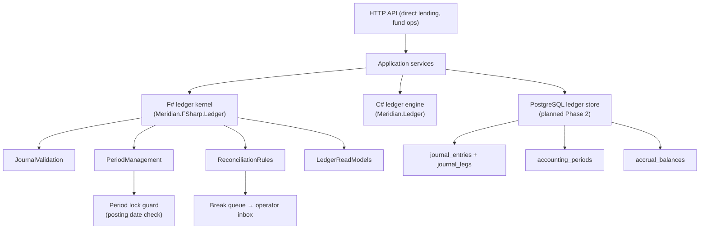

# Meridian Ledger Implementation Plan

**Owner:** Core Team
**Audience:** Engineering leads, implementers, and reviewers
**Last Updated:** 2026-05-08
**Status:** Active execution roadmap aligned to Wave 4 governance and fund-operations productization

## Overview

This document defines the phased implementation plan for the Meridian ledger subsystem — the
double-entry accounting kernel, period management, trial-balance and P&L reporting, accrual
tracking, and the reconciliation integration that forms the accounting backbone of the broader
governance and fund-operations product track.

The ledger plan is subordinate to
[`governance-fund-ops-blueprint.md`](governance-fund-ops-blueprint.md) and directly supports
Wave 4 operator-readiness acceptance criteria.

## Current Implementation Foundation

### `src/Meridian.Ledger/` — C# in-memory ledger engine

| File | Purpose |
| ---- | ------- |
| `Ledger.cs` | Double-entry ledger; validates and posts `JournalEntry` records, maintains per-account totals |
| `LedgerAccount.cs` | Named account with type, optional symbol, and optional financial-account ID |
| `LedgerAccountType.cs` | Asset / Liability / Equity / Revenue / Expense ordinals |
| `JournalEntry.cs` | Balanced set of `LedgerEntry` lines |
| `JournalEntryMetadata.cs` | Command/correlation/causation lineage attached to a journal entry |
| `FundLedgerBook.cs` | Fund-scoped ledger book wrapping an inner `Ledger` instance |
| `ProjectLedgerBook.cs` | Run/project-scoped ledger book |
| `LedgerSnapshot.cs` | Point-in-time snapshot of account balances |
| `LedgerQuery.cs` | Filtered journal and balance query helpers |

### `src/Meridian.FSharp.Ledger/` — F# accounting kernel

| File | Purpose |
| ---- | ------- |
| `LedgerTypes.fs` | `LedgerLineInput` and `LedgerBalanceInput` CLIMutable records |
| `JournalValidation.fs` | Double-entry balance check; debit/credit line timestamp and description invariants |
| `Posting.fs` | Debit-normal / credit-normal net-balance rules |
| `ReconciliationTypes.fs` | `BreakSeverity`, `LedgerBreakClassification`, `BreakRecord`, `ReconciliationOutcome`, `ReconciliationRun` |
| `Reconciliation.fs` | `ProjectedFlow` / `ActualCashEvent` matching; cash-ledger event types |
| `ReconciliationClassification.fs` | Canonical break-class taxonomy with reason codes and severity derivation |
| `ReconciliationRules.fs` | Configurable `MatchingRule` evaluation; `classifyBreaks` batch helper |
| `LedgerReadModels.fs` | `buildTrialBalance` — groups balance inputs into `TrialBalanceRow` output |
| `PeriodManagement.fs` | `AccountingPeriod`, `PeriodStatus`, `PeriodCloseEvent`, period locking and posting-date guards |
| `Interop.fs` | Sealed `LedgerInterop` class exposing all F# ledger primitives to C# consumers |

## Scope

### In Scope

- Accounting period lifecycle (Open → Soft-Close → Hard-Close)
- PostgreSQL-backed journal entry persistence with full event lineage
- Multi-ledger model aligned to the `FundStructure` node hierarchy (fund, sleeve, vehicle, entity, account)
- Period locking and close workflow with operator sign-off
- Trial balance and period-over-period P&L summary
- Accrual tracking integrated with direct-lending payment schedules
- Reconciliation expansion: servicer-report vs. ledger break detection and queue propagation
- Governing report artifacts sourced from verified ledger state

### Out of Scope

- Tax-lot accounting and realized-gain computation (separate roadmap item)
- Mark-to-market / GAAP fair-value adjustments (planned but not in scope here)
- Full XBRL/iXBRL output (reporting layer, not core ledger kernel)
- Non-direct-lending instrument accrual templates (future UFL package work)

## Architecture



## Phase 1 — F# Kernel Hardening (Current)

**Goal:** Complete the F# ledger kernel so downstream application code and direct-lending
projections can rely on stable, tested primitives.

- [x] `PeriodManagement.fs` — `AccountingPeriod`, `PeriodStatus`, `PeriodCloseEvent`,
  `PeriodCloseResult`, `PostingCheck`, and the `PeriodManagement` module with `close`,
  `applyClose`, `checkPostingDate`, `openPeriods`, `lastHardClosed`, and
  `generateCalendarMonthPeriods` helpers
- [x] `LedgerInterop` period members — `GenerateCalendarMonthPeriods`, `CheckPostingDate`,
  `TryClosePeriod` so C# application code can use the period kernel without F# boilerplate
- [ ] Unit tests for `PeriodManagement` — valid transitions, invalid transitions, posting-date
  guards for all three period statuses, adjustment override, period-not-found, calendar generation
- [ ] Unit tests for `PeriodStatus` — `fromString` round-trip, `isPostable`, `isAdjustable`,
  `isValidTransition` exhaustive matrix

## Phase 2 — PostgreSQL Journal Persistence

**Goal:** Persist journal entries and accounting periods to PostgreSQL so ledger state survives
restarts and supports audit replay.

- [ ] Migration `V_ledger_001__journal_entries.sql` — `ledger.journal_entries` and
  `ledger.journal_legs` tables with `aggregate_id`, `period_id`, `command_id`, `correlation_id`
  lineage columns and a `UNIQUE (journal_entry_id)` constraint
- [ ] Migration `V_ledger_002__accounting_periods.sql` — `ledger.accounting_periods` with
  optimistic-version column and a `period_close_events` audit table
- [ ] `ILedgerJournalStore` interface — `AppendAsync`, `GetByPeriodAsync`, `GetByAggregateAsync`,
  `GetPeriodAsync`, `SavePeriodAsync`
- [ ] `PostgresLedgerJournalStore` — Npgsql-backed implementation with serializable transactions
  and version-guard on period updates
- [ ] `LedgerJournalStoreOptions` — connection string, schema name, enable-period-locking flag
- [ ] `LedgerStoreExtensions` — `AddLedgerJournalStore(string connStr)` DI helper

## Phase 3 — Multi-Ledger Model and Period-Close Workflow

**Goal:** Align ledger books to the fund-structure hierarchy and introduce operator-mediated
period-close workflows surfaced through the operator inbox.

- [ ] `ILedgerBookService` interface — create/get/list books scoped to fund-structure nodes;
  enumerate open periods; initiate soft-close and hard-close sequences
- [ ] `PostgresLedgerBookService` — persisted implementation backed by `ILedgerJournalStore`
- [ ] Period-close work items propagated to `IOperatorInboxService` with required sign-off role,
  tolerance profile reference, and `FundReconciliation` navigation hint
- [ ] `LedgerPeriodSummaryDto` — trial balance, debit/credit totals, net income, period-on-period
  variance, open-break count, and sign-off status for a completed period
- [ ] `/api/ledger/periods` (GET/POST) and `/api/ledger/periods/{id}/close` (POST) endpoints

## Phase 4 — Accrual Tracking and Direct Lending Integration

**Goal:** Feed direct-lending accrual events into the ledger kernel so interest income, discount
amortization, and PIK capitalisation are reflected in the period trial balance.

- [ ] `AccrualEntry` and `AccrualSummary` F# types added to `Meridian.FSharp.Ledger` — one entry
  per accrual period-slice with reference to the originating loan ID and event lineage
- [ ] `LoanAccountingProjector` wired to `ILedgerJournalStore` so drawdown, accrual, receipt,
  discount/premium amortization, restructuring, and write-off events post balanced journal entries
  in the same database transaction as the loan event append
- [ ] `IAccrualLedgerService` interface — `AccrueAsync` and `ReverseAccrualAsync` supporting
  correcting entries within the same open period
- [ ] `DailyAccrualWorker` extended to check `PeriodManagement.CheckPostingDate` before posting
  and route failures to the operator inbox as period-blocked items

## Phase 5 — Reporting and Governed Outputs

**Goal:** Surface verified ledger state as governed report artifacts (trial balance, P&L summary,
accrual schedule) that can be exported and attached to the operator report pack.

- [ ] `TrialBalanceReportDto` — signed, period-locked trial balance with aggregate-level totals and
  per-account detail rows
- [ ] `PeriodPnlSummaryDto` — realized income/expense P&L with prior-period comparatives and
  accrual-basis adjustments
- [ ] `/api/ledger/reports/trial-balance` and `/api/ledger/reports/pnl-summary` endpoints
- [ ] `FundOperationsWorkspaceReadService` extended to include `LedgerSummary` from
  `ILedgerBookService` so the governance workspace view includes period trial-balance posture
- [ ] Governed report-pack artifact generation for trial balance (XLSX export via existing export
  infrastructure)

## Interface Contracts

The following new interfaces are planned for Phases 2-4:

```csharp
namespace Meridian.Application.Ledger;

public interface ILedgerJournalStore
{
    Task AppendAsync(JournalEntry entry, Guid periodId, CancellationToken ct = default);
    Task<IReadOnlyList<JournalEntry>> GetByPeriodAsync(Guid periodId, CancellationToken ct = default);
    Task<IReadOnlyList<JournalEntry>> GetByAggregateAsync(Guid aggregateId, CancellationToken ct = default);
    Task<AccountingPeriodDto?> GetPeriodAsync(Guid periodId, CancellationToken ct = default);
    Task SavePeriodAsync(AccountingPeriodDto period, CancellationToken ct = default);
}

public interface ILedgerBookService
{
    Task<LedgerPeriodSummaryDto> GetPeriodSummaryAsync(Guid periodId, CancellationToken ct = default);
    Task<AccountingPeriodDto> SoftCloseAsync(Guid periodId, string closedBy, string notes, CancellationToken ct = default);
    Task<AccountingPeriodDto> HardCloseAsync(Guid periodId, string closedBy, string notes, CancellationToken ct = default);
}

public interface IAccrualLedgerService
{
    Task AccrueAsync(Guid loanId, AccrualEntryDto entry, CancellationToken ct = default);
    Task ReverseAccrualAsync(Guid accrualId, string reason, CancellationToken ct = default);
}
```

## REST API Surface

Existing endpoints that feed ledger data:

- `GET /api/loans/{loanId}/projections/accruals` — accrual schedule for a loan
- `GET /api/fund-structure/workspace-view` — includes `fundLedgerJournalSummary` from existing
  `FundOperationsWorkspaceReadService`

Planned new endpoints:

- `GET /api/ledger/periods` — list accounting periods with status and coverage
- `POST /api/ledger/periods` — create a new accounting period
- `POST /api/ledger/periods/{id}/close` — initiate soft-close or hard-close
- `GET /api/ledger/periods/{id}/trial-balance` — trial balance for a specific period
- `GET /api/ledger/periods/{id}/pnl-summary` — P&L summary with prior-period comparatives
- `GET /api/ledger/reports/trial-balance` — cross-period trial-balance export
- `GET /api/ledger/reports/pnl-summary` — governed P&L summary export

## PR Sequencing

| PR | Title | Depends on | Primary write scope |
| -- | ----- | ---------- | ------------------- |
| L-01 | Period management tests | None (kernel already in) | `tests/Meridian.FSharp.Tests` |
| L-02 | PostgreSQL journal and period persistence | L-01 | `src/Meridian.Storage`, `deploy/sql/ledger/` |
| L-03 | Multi-ledger book service | L-02 | `src/Meridian.Application`, `src/Meridian.Contracts` |
| L-04 | Period-close work items and operator inbox | L-03 | `src/Meridian.Application`, `src/Meridian.Ui.Shared` |
| L-05 | Accrual tracking and direct-lending integration | L-03 | `src/Meridian.Application/DirectLending`, `src/Meridian.FSharp.Ledger` |
| L-06 | Ledger reporting endpoints and governed artifacts | L-04, L-05 | `src/Meridian.Ui.Shared`, `src/Meridian.Application` |

## Validation Commands

```bash
# Build the F# ledger kernel
dotnet build src/Meridian.FSharp.Ledger/Meridian.FSharp.Ledger.fsproj -c Release /p:EnableWindowsTargeting=true

# Run F# ledger tests
dotnet test tests/Meridian.FSharp.Tests/Meridian.FSharp.Tests.fsproj -c Release /p:EnableWindowsTargeting=true

# Build the full solution to confirm no downstream breaks
dotnet build Meridian.sln -c Release --no-restore /p:EnableWindowsTargeting=true
```

## Related Documents

- [`governance-fund-ops-blueprint.md`](governance-fund-ops-blueprint.md) — umbrella blueprint for
  Wave 4 accounting, reconciliation, and governed-output workflows
- [`ufl-direct-lending-implementation-roadmap.md`](ufl-direct-lending-implementation-roadmap.md) —
  direct-lending delivery path that feeds into the ledger journal
- [`ufl-direct-lending-target-state-v2.md`](ufl-direct-lending-target-state-v2.md) — target-state
  accounting tables and journal projection contract for direct lending
- [`fund-management-pr-sequenced-roadmap.md`](fund-management-pr-sequenced-roadmap.md) — PR-09
  (multi-ledger kernel baseline) and PR-12 (trial balance surfaces) are the closest overlapping
  slices in the fund-management roadmap
