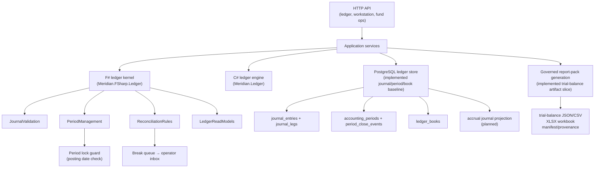

# Meridian Ledger Implementation Plan

**Owner:** Core Team
**Audience:** Engineering leads, implementers, and reviewers
**Last Updated:** 2026-05-20
**Status:** Active execution roadmap; F# period management, PostgreSQL ledger persistence, ledger
book/period APIs, period-close inbox routing, period posting-kind guards, run-ledger drill-ins, and
the first governed trial-balance report-pack artifact slice are complete. Accrual-to-ledger posting
and ledger-specific reporting endpoints remain open.

## Overview

This document defines the phased implementation plan for the Meridian ledger subsystem — the
double-entry accounting kernel, period management, trial-balance and P&L reporting, accrual
tracking, and the reconciliation integration that forms the accounting backbone of the broader
governance and fund-operations product track.

The ledger plan is subordinate to
[`governance-fund-ops-blueprint.md`](governance-fund-ops-blueprint.md) and directly supports
Wave 4 operator-readiness acceptance criteria.

As of 2026-05-13, the implementation baseline is no longer only an in-memory kernel. The repo now
contains the tested F# period-management kernel, PostgreSQL-backed journal/period/book persistence,
shared ledger book service contracts, HTTP endpoints for book/period creation and period close,
operator-inbox work items for close sign-off, route-only run-ledger artifact references, and
fund-scoped governed report-pack generation for trial-balance artifacts. The remaining ledger
roadmap should focus on direct-lending accrual projection into durable journal entries, richer
period-close casework, and ledger-specific reporting endpoints rather than re-building the delivered
baseline.

## Current Implementation Foundation

### `src/Meridian.Ledger/` — C# in-memory ledger engine

| File | Purpose |
| ---- | ------- |
| `Ledger.cs` | Double-entry ledger; validates and posts `JournalEntry` records, maintains per-account totals |
| `LedgerAccount.cs` | Named account with type, optional symbol, and optional financial-account ID |
| `LedgerAccountType.cs` | Asset / Liability / Equity / Revenue / Expense ordinals |
| `JournalEntry.cs` | Balanced set of `LedgerEntry` lines |
| `JournalEntryMetadata.cs` | Command/correlation/causation lineage attached to a journal entry |
| `FundLedgerBook.cs` | Fund-scoped ledger book wrapping an inner `Ledger` instance |
| `ProjectLedgerBook.cs` | Run/project-scoped ledger book |
| `LedgerSnapshot.cs` | Point-in-time snapshot of account balances |
| `LedgerQuery.cs` | Filtered journal and balance query helpers |

### Ledger-compatible CLI journal reports

Meridian also exposes a bounded Ledger-style text journal command for local accounting checks:

```bash
dotnet run --project src/Meridian/Meridian.csproj -- ledger -f ledger.dat balance
dotnet run --project src/Meridian/Meridian.csproj -- ledger -f ledger.dat register checking
dotnet run --project src/Meridian/Meridian.csproj -- ledger -f ledger.dat print
dotnet run --project src/Meridian/Meridian.csproj -- ledger -f ledger.dat accounts
```

The command reads the source journal without modifying it, parses v1 Ledger-style transaction
headers and indented postings, infers one omitted posting amount per transaction, posts the result
through `Meridian.Ledger`, and reports validation failures with source line numbers. It supports
`yyyy/MM/dd` and `yyyy-MM-dd` dates, account roots under `Assets`, `Liabilities`, `Equity`,
`Income`/`Revenue`, and `Expenses`, and decimal amounts with an optional leading `$`.

The parser, report renderer, and `LedgerTextJournalReportService` live under
`src/Meridian.Application/Ledger/TextJournal/` so the CLI entry point remains a thin command
wrapper. Browser/API integration should reuse that application adapter and should not expose
endpoints that read arbitrary server-side journal paths; future preview surfaces should accept
uploaded or pasted journal text.

Strategy-run evidence packets now also expose ledger drill-in routes as artifact references on the
existing `run-ledger` node. The references point to the run ledger journal and trial-balance
workstation endpoints; they are route-only until a retained ledger export or manifest flow owns a
file path and content hash.

The pilot readiness artifact now carries the same `ledgerArtifactRefs` collection so CI evidence
can prove the ledger journal and trial-balance routes are present while keeping `path` and `hash`
null. The dashboard treats a missing or non-route-only ledger artifact ref as a golden-path gap.

### `src/Meridian.Storage/Ledger/` — PostgreSQL persistence and book service

| File | Purpose |
| ---- | ------- |
| `Migrations/V_ledger_001__journal_entries.sql` | `ledger.journal_entries` and `ledger.journal_legs` with aggregate, period, command, and correlation lineage |
| `Migrations/V_ledger_002__accounting_periods.sql` | `ledger.accounting_periods` plus `period_close_events` audit history and optimistic versioning |
| `Migrations/V_ledger_003__ledger_books.sql` | `ledger.ledger_books`, fund-structure scope, and book-scoped accounting periods |
| `Migrations/V_ledger_006__journal_posting_kind.sql` | `posting_kind` columns for originating vs. adjustment journal writes |
| `ILedgerJournalStore.cs` | Journal, period, close-event, and ledger-book persistence contract |
| `PostgresLedgerJournalStore.cs` | Npgsql implementation using serializable transactions and optimistic period version guards |
| `LedgerPeriodPostingGuard.cs` | Central posting-date and period-status guard for durable ledger writes |
| `LedgerJournalStoreOptions.cs` | Connection string, schema name, and period-locking configuration |
| `LedgerStoreExtensions.cs` | DI registration for `ILedgerJournalStore` and `ILedgerBookService` |
| `PostgresLedgerBookService.cs` | Book creation/listing, period creation/listing, period-close summaries, and operator-inbox work-item propagation |

### Basis-aware ledger foundation

The first basis-aware slice extends the book/journal/period baseline without reclassifying legacy
history. Ledger books now carry an `AccountingBasis` of `Primary`, `Gaap`, `Cash`, `Tax`, or
`Statutory` plus an accounting-policy ID/version. Existing books and journal rows migrate as
`Primary` with `legacy-v1` policy lineage.

Journal entries and journal legs now preserve `accounting_basis`, `accounting_policy_id`,
`accounting_policy_version`, optional rule ID/version, `source_event_id`, and
`source_journal_entry_id`. Appends validate that a journal entry's basis matches the ledger book
owning the target period. Parallel basis books are unique by fund profile, fund-structure node, and
basis, enabling independent close/report workflows for the same fund node.

Journal entries and journal legs also preserve `posting_kind`, currently `Originating` or
`Adjustment`. The durable append path validates the journal timestamp against the selected period
and applies period status controls before insert: open periods accept both posting kinds,
soft-closed periods accept only adjustments, and hard-closed periods reject all postings. This keeps
closed-period discipline centralized in the ledger store instead of relying on endpoint or UI code.

`Meridian.Application.Ledger` contains the v1 accounting-policy service and basis projection
adapter. It resolves active policies by basis, effective date, optional fund node, instrument, and
source event, then produces lineage-stamped journal writes that still flow through the existing
balanced-entry validation and period-lock path. This is an accounting-policy engine foundation, not
a certification of GAAP, tax, cash, or statutory compliance; operator reports should continue to
say "basis per configured policy" until accountant review.

### Shared ledger API and reporting surfaces

- `src/Meridian.Contracts/Ledger/LedgerBookDtos.cs` defines ledger book, period, period-close,
  trial-balance summary, and `ILedgerBookService` contracts.
- `src/Meridian.Ui.Shared/Endpoints/LedgerEndpoints.cs` maps `/api/ledger/books`,
  `/api/ledger/books/{ledgerBookId}`, `/api/ledger/periods`, and
  `/api/ledger/periods/{periodId}/close`.
- `src/Meridian.Ui.Shared/Endpoints/WorkstationEndpoints.cs` maps strategy-run ledger, journal,
  and trial-balance drill-ins under `/api/workstation/runs/{runId}/ledger`.
- `src/Meridian.Ui.Shared/Services/FundOperationsWorkspaceReadService.cs` builds fund ledger
  summaries, selected-ledger trial-balance views, reconciliation snapshots, and governed report-pack
  artifacts.
- `src/Meridian.Application/Services/ReportGenerationService.cs` generates trial-balance and
  asset-class report-pack content from a `FundLedgerBook`, enriched with Security Master context
  when available.

### `src/Meridian.FSharp.Ledger/` — F# accounting kernel

| File | Purpose |
| ---- | ------- |
| `LedgerTypes.fs` | `LedgerLineInput` and `LedgerBalanceInput` CLIMutable records |
| `JournalValidation.fs` | Double-entry balance check; debit/credit line timestamp and description invariants |
| `Posting.fs` | Debit-normal / credit-normal net-balance rules |
| `ReconciliationTypes.fs` | `BreakSeverity`, `LedgerBreakClassification`, `BreakRecord`, `ReconciliationOutcome`, `ReconciliationRun` |
| `Reconciliation.fs` | `ProjectedFlow` / `ActualCashEvent` matching; cash-ledger event types |
| `ReconciliationClassification.fs` | Canonical break-class taxonomy with reason codes and severity derivation |
| `ReconciliationRules.fs` | Configurable `MatchingRule` evaluation; `classifyBreaks` batch helper |
| `LedgerReadModels.fs` | `buildTrialBalance` — groups balance inputs into `TrialBalanceRow` output |
| `PeriodManagement.fs` | `AccountingPeriod`, `PeriodStatus`, `PeriodCloseEvent`, period locking and posting-date guards |
| `Interop.fs` | Sealed `LedgerInterop` class exposing all F# ledger primitives to C# consumers |

## Scope

### In Scope

- Accounting period lifecycle (Open → Soft-Close → Hard-Close)
- PostgreSQL-backed journal entry persistence with full event lineage
- Multi-ledger model aligned to the `FundStructure` node hierarchy (fund, sleeve, vehicle, entity, account)
- Period locking and close workflow with operator sign-off
- Trial balance and period-over-period P&L summary
- Accrual tracking integrated with direct-lending payment schedules
- Reconciliation expansion: servicer-report vs. ledger break detection and queue propagation
- Governing report artifacts sourced from verified ledger state

### Out of Scope

- Tax-lot accounting and realized-gain computation (separate roadmap item)
- Mark-to-market / GAAP fair-value adjustments (planned but not in scope here)
- Full XBRL/iXBRL output (reporting layer, not core ledger kernel)
- Non-direct-lending instrument accrual templates (future UFL package work)

## Architecture



## Phase 1 — F# Kernel Hardening (Complete)

**Goal:** Complete the F# ledger kernel so downstream application code and direct-lending
projections can rely on stable, tested primitives.

- [x] `PeriodManagement.fs` — `AccountingPeriod`, `PeriodStatus`, `PeriodCloseEvent`,
  `PeriodCloseResult`, `PostingCheck`, and the `PeriodManagement` module with `close`,
  `applyClose`, `checkPostingDate`, `openPeriods`, `lastHardClosed`, and
  `generateCalendarMonthPeriods` helpers
- [x] `LedgerInterop` period members — `GenerateCalendarMonthPeriods`, `CheckPostingDate`,
  `TryClosePeriod` so C# application code can use the period kernel without F# boilerplate
- [x] Unit tests for `PeriodManagement` — valid transitions, invalid transitions, posting-date
  guards for all three period statuses, adjustment override, period-not-found, calendar generation
- [x] Unit tests for `PeriodStatus` — `fromString` round-trip, `isPostable`, `isAdjustable`,
  `isValidTransition` exhaustive matrix

Validation evidence: `tests/Meridian.FSharp.Tests/PeriodManagementTests.fs`.

## Phase 2 — PostgreSQL Journal, Period, and Book Persistence (Complete)

**Goal:** Persist journal entries and accounting periods to PostgreSQL so ledger state survives
restarts and supports audit replay.

- [x] Migration `V_ledger_001__journal_entries.sql` — `ledger.journal_entries` and
  `ledger.journal_legs` tables with `aggregate_id`, `period_id`, `command_id`, `correlation_id`
  lineage columns and a `UNIQUE (journal_entry_id)` constraint
- [x] Migration `V_ledger_002__accounting_periods.sql` — `ledger.accounting_periods` with
  optimistic-version column and a `period_close_events` audit table
- [x] Migration `V_ledger_003__ledger_books.sql` — `ledger.ledger_books`, fund-structure scope,
  and book-scoped accounting periods
- [x] `ILedgerJournalStore` interface — `AppendAsync`, `GetByPeriodAsync`, `GetByAggregateAsync`,
  `GetPeriodAsync`, `SavePeriodAsync`
- [x] `PostgresLedgerJournalStore` — Npgsql-backed implementation with serializable transactions
  and version-guard on period updates
- [x] `LedgerJournalStoreOptions` — connection string, schema name, enable-period-locking flag
- [x] `LedgerStoreExtensions` — `AddLedgerJournalStore(string connStr)` DI helper
- [x] Store and migration tests — options defaults, DI registration, unbalanced-entry rejection,
  period posting-kind guards, and migration shape checks

Validation evidence: `tests/Meridian.Tests/Storage/LedgerJournalStoreTests.cs`.

## Phase 3 — Multi-Ledger Model and Period-Close Workflow (Complete for shared API baseline)

**Goal:** Align ledger books to the fund-structure hierarchy and introduce operator-mediated
period-close workflows surfaced through the operator inbox.

- [x] `ILedgerBookService` interface — create/get/list books scoped to fund-structure nodes;
  enumerate open periods; initiate soft-close and hard-close sequences
- [x] `PostgresLedgerBookService` — persisted implementation backed by `ILedgerJournalStore`
- [x] Period-close work items propagated to `IOperatorInboxService` with machine-readable required
  sign-off role, tolerance profile reference, sign-off status, and `FundReconciliation` navigation
  hint
- [x] `LedgerPeriodSummaryDto` — trial balance, debit/credit totals, net income, period-on-period
  variance, open-break count, and sign-off status for a completed period
- [x] `/api/ledger/books` (GET/POST), `/api/ledger/books/{id}` (GET),
  `/api/ledger/periods` (GET/POST), and `/api/ledger/periods/{id}/close` (POST) endpoints
- [x] Endpoint and service tests for create/list/close flows, close-summary totals, and inbox
  navigation metadata

Validation evidence: `tests/Meridian.Tests/Storage/LedgerBookServiceTests.cs`.

## Phase 4 — Accrual Tracking and Direct Lending Integration

**Goal:** Feed direct-lending accrual events into the ledger kernel so interest income, discount
amortization, and PIK capitalisation are reflected in the period trial balance.

Delivered prerequisite: direct-lending services already expose `DailyAccrualEntryDto` projections
and posting APIs for loan accruals. That is not yet the same as balanced ledger journal projection,
so the Phase 4 ledger-posting work remains open.

- [ ] `AccrualEntry` and `AccrualSummary` F# types added to `Meridian.FSharp.Ledger` — one entry
  per accrual period-slice with reference to the originating loan ID and event lineage
- [ ] `LoanAccountingProjector` wired to `ILedgerJournalStore` so drawdown, accrual, receipt,
  discount/premium amortization, restructuring, and write-off events post balanced journal entries
  in the same database transaction as the loan event append
- [ ] `IAccrualLedgerService` interface — `AccrueAsync` and `ReverseAccrualAsync` supporting
  correcting entries within the same open period
- [ ] `DailyAccrualWorker` extended to check `PeriodManagement.CheckPostingDate` before posting
  and route failures to the operator inbox as period-blocked items

## Phase 5 — Reporting and Governed Outputs (Partial)

**Goal:** Surface verified ledger state as governed report artifacts (trial balance, P&L summary,
accrual schedule) that can be exported and attached to the operator report pack.

- [ ] `TrialBalanceReportDto` — signed, period-locked trial balance with aggregate-level totals and
  per-account detail rows
- [ ] `PeriodPnlSummaryDto` — realized income/expense P&L with prior-period comparatives and
  accrual-basis adjustments
- [ ] `/api/ledger/reports/trial-balance` and `/api/ledger/reports/pnl-summary` endpoints
- [x] `FundOperationsWorkspaceReadService` includes `FundLedgerSummary`,
  `FundLedgerReconciliationSnapshot`, selected-ledger filtering, and trial-balance rows in the
  fund-operations workspace projection
- [x] Governed report-pack artifact generation for trial balance: JSON/CSV trial-balance outputs,
  asset-class sections, XLSX workbook output, provenance, warnings, repository-backed history, and
  detail retrieval

Validation evidence:
`tests/Meridian.Tests/Application/Services/FundOperationsWorkspaceReadServiceTests.cs`,
`tests/Meridian.Tests/Ui/WorkstationEndpointsTests.cs`, and
`docs/plans/governance-fund-ops-blueprint.md`.

## Interface Contracts

The following core interfaces are used by Phases 2-4:

```csharp
namespace Meridian.Application.Ledger;

public interface ILedgerJournalStore
{
    Task AppendAsync(LedgerJournalEntryWrite entry, CancellationToken ct = default);
    Task<IReadOnlyList<LedgerJournalEntryRecord>> GetByPeriodAsync(Guid periodId, CancellationToken ct = default);
    Task<IReadOnlyList<LedgerJournalEntryRecord>> GetByAggregateAsync(Guid aggregateId, CancellationToken ct = default);
    Task<LedgerAccountingPeriod?> GetPeriodAsync(Guid periodId, CancellationToken ct = default);
    Task<IReadOnlyList<LedgerAccountingPeriod>> ListPeriodsAsync(Guid? ledgerBookId = null, string? status = null, string? fundProfileId = null, Guid? fundStructureNodeId = null, CancellationToken ct = default);
    Task<LedgerAccountingPeriod> SavePeriodAsync(LedgerAccountingPeriod period, long expectedVersion, PeriodCloseEventRecord? closeEvent = null, CancellationToken ct = default);
    Task<LedgerBookRecord?> GetLedgerBookAsync(Guid ledgerBookId, CancellationToken ct = default);
    Task<IReadOnlyList<LedgerBookRecord>> ListLedgerBooksAsync(string? fundProfileId = null, Guid? fundStructureNodeId = null, FundStructureNodeKindDto? fundStructureNodeKind = null, CancellationToken ct = default);
    Task<LedgerBookRecord> SaveLedgerBookAsync(LedgerBookRecord book, CancellationToken ct = default);
}

public interface ILedgerBookService
{
    Task<LedgerBookDto> CreateBookAsync(CreateLedgerBookRequest request, CancellationToken ct = default);
    Task<LedgerBookDto?> GetBookAsync(Guid ledgerBookId, CancellationToken ct = default);
    Task<IReadOnlyList<LedgerBookDto>> ListBooksAsync(LedgerBookQuery query, CancellationToken ct = default);
    Task<LedgerPeriodDto> CreatePeriodAsync(CreateLedgerPeriodRequest request, CancellationToken ct = default);
    Task<IReadOnlyList<LedgerPeriodDto>> ListPeriodsAsync(LedgerPeriodQuery query, CancellationToken ct = default);
    Task<IReadOnlyList<LedgerPeriodDto>> ListOpenPeriodsAsync(Guid? ledgerBookId = null, CancellationToken ct = default);
    Task<LedgerPeriodSummaryDto?> GetPeriodSummaryAsync(Guid periodId, CancellationToken ct = default);
    Task<LedgerPeriodCloseResultDto> ClosePeriodAsync(Guid periodId, CloseLedgerPeriodRequest request, CancellationToken ct = default);
}

public interface IAccrualLedgerService
{
    Task AccrueAsync(Guid loanId, AccrualEntryDto entry, CancellationToken ct = default);
    Task ReverseAccrualAsync(Guid accrualId, string reason, CancellationToken ct = default);
}
```

## REST API Surface

Existing endpoints that feed ledger data:

- `GET /api/loans/{loanId}/projections/accruals` — accrual schedule for a loan
- `GET /api/fund-structure/workspace-view` — includes `fundLedgerJournalSummary` from existing
  `FundOperationsWorkspaceReadService`
- `GET /api/workstation/runs/{runId}/ledger` — run-level ledger summary
- `GET /api/workstation/runs/{runId}/ledger/journal` — run-level ledger journal rows
- `GET /api/workstation/runs/{runId}/ledger/trial-balance` — run-level ledger trial balance,
  optionally filtered by account type

Implemented ledger book and period endpoints:

- `GET /api/ledger/books` — list ledger books scoped by fund profile or fund-structure node
- `GET /api/ledger/books/{ledgerBookId}` — load one ledger book
- `POST /api/ledger/books` — create or return the existing book for a fund-structure node scope
- `GET /api/ledger/periods` — list accounting periods with status and coverage
- `POST /api/ledger/periods` — create a new accounting period
- `POST /api/ledger/periods/{id}/close` — initiate soft-close or hard-close and propagate a
  `LedgerPeriodClose` work item to the operator inbox with `FundReconciliation` navigation

Implemented governed report-pack endpoints with ledger/trial-balance artifacts:

- `POST /api/fund-structure/report-pack-preview` — report-pack preview
- `POST /api/fund-structure/report-packs` — generate and persist governed report-pack artifacts
- `GET /api/fund-structure/report-packs` — report-pack history
- `GET /api/fund-structure/report-packs/{reportId}` — persisted report-pack detail

Planned reporting endpoints:

- `GET /api/ledger/periods/{id}/trial-balance` — trial balance for a specific period
- `GET /api/ledger/periods/{id}/pnl-summary` — P&L summary with prior-period comparatives
- `GET /api/ledger/reports/trial-balance` — cross-period trial-balance export
- `GET /api/ledger/reports/pnl-summary` — governed P&L summary export

## PR Sequencing

| PR | Title | Status | Depends on | Primary write scope |
| -- | ----- | ------ | ---------- | ------------------- |
| L-01 | Period management tests | Complete | None (kernel already in) | `tests/Meridian.FSharp.Tests` |
| L-02 | PostgreSQL journal, period, and book persistence | Complete | L-01 | `src/Meridian.Storage/Ledger`, `tests/Meridian.Tests/Storage` |
| L-03 | Multi-ledger book service and ledger endpoints | Complete | L-02 | `src/Meridian.Contracts`, `src/Meridian.Storage/Ledger`, `src/Meridian.Ui.Shared` |
| L-04 | Period-close work items and operator inbox routing | Complete | L-03 | `src/Meridian.Storage/Ledger`, `src/Meridian.Ui.Shared`, `tests/Meridian.Tests/Storage` |
| L-05 | Accrual tracking and direct-lending ledger integration | Open | L-03 | `src/Meridian.Application/DirectLending`, `src/Meridian.FSharp.Ledger`, `src/Meridian.Storage/Ledger` |
| L-06A | Governed report-pack trial-balance artifact slice | Complete | L-03 | `src/Meridian.Ui.Shared`, `src/Meridian.Application`, `tests/Meridian.Tests/Application` |
| L-06B | Ledger-specific reporting endpoints and P&L summaries | Open | L-04, L-05 | `src/Meridian.Ui.Shared`, `src/Meridian.Application`, `src/Meridian.Contracts` |

## Validation Commands

```bash
# Build the F# ledger kernel
dotnet build src/Meridian.FSharp.Ledger/Meridian.FSharp.Ledger.fsproj -c Release /p:EnableWindowsTargeting=true

# Run F# ledger tests
dotnet test tests/Meridian.FSharp.Tests/Meridian.FSharp.Tests.fsproj -c Release /p:EnableWindowsTargeting=true

# Run the completed ledger persistence/API/report-pack slices
dotnet test tests/Meridian.Tests/Meridian.Tests.csproj --filter "FullyQualifiedName~LedgerJournalStoreTests|FullyQualifiedName~LedgerBookServiceTests|FullyQualifiedName~FundOperationsWorkspaceReadServiceTests" --logger "console;verbosity=normal"

# Build the full solution to confirm no downstream breaks
dotnet build Meridian.sln -c Release --no-restore /p:EnableWindowsTargeting=true

# Docs reconciliation check
python build/scripts/docs/run-docs-automation.py --profile quick --dry-run
```

## Related Documents

- [`governance-fund-ops-blueprint.md`](governance-fund-ops-blueprint.md) — umbrella blueprint for
  Wave 4 accounting, reconciliation, and governed-output workflows
- [`ufl-direct-lending-implementation-roadmap.md`](ufl-direct-lending-implementation-roadmap.md) —
  direct-lending delivery path that feeds into the ledger journal
- [`ufl-direct-lending-target-state-v2.md`](ufl-direct-lending-target-state-v2.md) — target-state
  accounting tables and journal projection contract for direct lending
- [`fund-management-pr-sequenced-roadmap.md`](fund-management-pr-sequenced-roadmap.md) — PR-09
  (multi-ledger kernel baseline) and PR-12 (trial balance surfaces) are the closest overlapping
  slices in the fund-management roadmap
