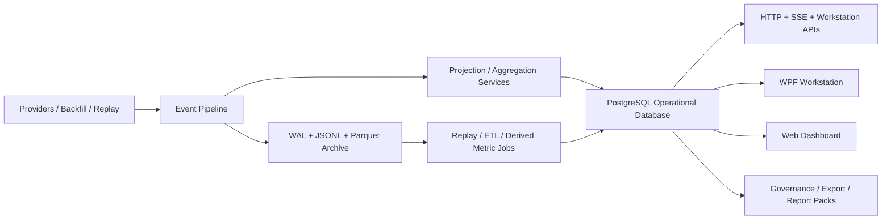

# Meridian Database Blueprint

**Owner:** Core Team  
**Audience:** Platform, storage, workstation, strategy, governance, and API contributors  
**Last Updated:** 2026-03-21  
**Status:** Proposed blueprint grounded in current repository architecture

## Scope

**In Scope:** A database blueprint that supports Meridian's intended end-state across `Research`, `Trading`, `Data Operations`, and `Governance`, while fitting the current archival-first storage architecture and existing workstation/security-master code.

**Out of Scope:** Replacing the existing WAL + JSONL + Parquet event archive, introducing cloud-only data services, or designing a pure timeseries database as the sole storage model for market events.

**Assumptions:**

- Meridian remains a hybrid platform:
  - market-event truth stays in the existing storage stack
  - relational database storage is added for operational state, read models, orchestration, and audit workflows
- The roadmap target state remains the active product direction:
  - unified `StrategyRun` across backtest, paper, and live
  - first-class portfolio and ledger workflows
  - Security Master as the authoritative instrument-definition layer
  - future governance, reconciliation, QuantScript, and L3 simulation capabilities
- PostgreSQL is the preferred operational database because Meridian already has a checked-in PostgreSQL Security Master store under `src/Meridian.Storage/SecurityMaster/`.

**Depth Mode:** full

## Architectural Overview

### Context Diagram



### Design Decisions

- **Decision:** Keep market-event archival storage outside the relational database.
  **Alternatives:** Put all ticks, quotes, depth, and bars into PostgreSQL.
  **Rationale:** This matches ADR-002 and the current `StorageDesign` direction: Meridian is archival-first and optimized for high-throughput ingestion plus export.
  **Consequences:** The relational database becomes the operational and query coordination plane, not the raw event sink.

- **Decision:** Add one PostgreSQL database with multiple schemas instead of many databases.
  **Alternatives:** Separate database per domain, SQLite for desktop-only flows, document store for flexible records.
  **Rationale:** Meridian already has PostgreSQL integration, and one database with domain schemas keeps joins, migrations, security, and backups manageable.
  **Consequences:** We need strong schema boundaries and retention rules to avoid turning PostgreSQL into an unbounded event lake.

- **Decision:** Model workstation-facing state as read models and journals, not only normalized OLTP tables.
  **Alternatives:** Fully normalized only; fully denormalized only.
  **Rationale:** The repo already exposes read-model DTOs such as `StrategyRunSummary`, `PortfolioSummary`, and `LedgerSummary`. The workstation needs fast browse/detail queries.
  **Consequences:** Projection jobs and refresh logic become first-class application responsibilities.

- **Decision:** Use append-friendly domain journals for runs, orders, fills, and ledger/reconciliation activity.
  **Alternatives:** Mutable status-only rows with minimal history.
  **Rationale:** Meridian's roadmap emphasizes auditability, promotion workflows, governance, and operator trust.
  **Consequences:** Write volume grows moderately, but audit and replay improve significantly.

## Verified Constraints From The Repository

- `docs/adr/002-tiered-storage-architecture.md` rejects a single database as the primary ingestion store for market data.
- `docs/architecture/storage-design.md` defines Meridian as a collection and archival system first.
- `src/Meridian.Storage/SecurityMaster/` already contains PostgreSQL-backed stores and migrations.
- `src/Meridian.Contracts/Workstation/StrategyRunReadModels.cs` already defines shared run, portfolio, and ledger read models for the workstation.
- `src/Meridian.Strategies/Storage/StrategyRunStore.cs` is intentionally in-memory today and explicitly calls out future persistence.
- `docs/plans/trading-workstation-migration-blueprint.md` defines the target workflow around `Strategy`, `Run`, `Portfolio`, `Ledger`, `Dataset/Feed`, and `Workspace`.
- `docs/plans/governance-fund-ops-blueprint.md` requires Security Master, multi-ledger accounting, reconciliation, trial balance, cash-flow modeling, and report packs.

## Proposed Database Role

The database should support six categories of responsibility:

1. **Reference data**
   - Security Master
   - canonical symbol and identifier resolution
   - venue, provider, dataset, and account metadata

2. **Operational orchestration**
   - provider sessions
   - subscriptions
   - backfill jobs and schedules
   - maintenance jobs
   - promotion workflow state

3. **Strategy and trading lifecycle**
   - strategies
   - strategy versions
   - runs across backtest, paper, and live
   - orders, fills, positions, executions, and risk events

4. **Portfolio and accounting**
   - portfolio snapshots
   - holdings
   - cash balances
   - ledger books, journal entries, trial balance projections
   - reconciliation runs and breaks

5. **Analytics and workstation read models**
   - run comparisons
   - performance metrics
   - research artifacts
   - QuantScript metadata
   - governance report-pack manifests

6. **Audit and lineage**
   - user/operator actions
   - workflow promotion approvals
   - provenance links to archive files, exports, and external statements

## Database Topology

### Logical Database

- Database: `meridian`
- Engine: PostgreSQL 16+
- Access pattern:
  - application writes through repository/services
  - projection workers build workstation-facing read models
  - no direct hot-path tick ingestion into PostgreSQL

### Schema Layout

| Schema | Purpose |
|---|---|
| `ref` | Security Master, symbol identity, provider and venue reference data |
| `ops` | ingestion jobs, backfill jobs, schedules, maintenance, subscriptions, provider health snapshots |
| `strategy` | strategy definitions, versions, parameter sets, run manifests, run metrics, promotion workflow |
| `trading` | orders, fills, execution sessions, positions, risk alerts, paper/live session state |
| `portfolio` | portfolio snapshots, holdings, cash ledgers, exposures, attribution series |
| `accounting` | ledger books, journal entries, account balances, trial balance, reconciliation |
| `research` | datasets, experiments, backtest artifacts, QuantScript runs, simulation outputs |
| `audit` | action log, workflow approvals, lineage edges, report-pack provenance |
| `read` | denormalized workstation query models and materialized views |

## Interface & API Contracts

### New Storage Contracts

```csharp
namespace Meridian.Storage.Operational;

public interface IOperationalDatabase
{
    Task<T> WithConnectionAsync<T>(
        Func<NpgsqlConnection, Task<T>> callback,
        CancellationToken ct = default);
}

public interface IStrategyRunRepository
{
    Task UpsertRunAsync(StrategyRunRecord record, CancellationToken ct = default);
    Task<StrategyRunRecord?> GetRunAsync(string runId, CancellationToken ct = default);
    Task<IReadOnlyList<StrategyRunRecord>> SearchRunsAsync(
        StrategyRunQuery query,
        CancellationToken ct = default);
}

public interface IProjectionCheckpointStore
{
    Task<long?> GetCheckpointAsync(string projectionName, CancellationToken ct = default);
    Task SaveCheckpointAsync(string projectionName, long position, CancellationToken ct = default);
}
```

### Modified Interfaces

- `Meridian.Strategies.Storage.StrategyRunStore`
  - keep current in-memory implementation for tests/dev
  - add a production PostgreSQL implementation behind the same repository abstraction
- `PortfolioReadService` and `LedgerReadService`
  - continue supporting in-memory derivation from `StrategyRunEntry`
  - add database-backed query paths for cross-run, cross-session, and governance views

### Configuration Schema

```csharp
public sealed class OperationalDatabaseOptions
{
    public string ConnectionString { get; set; } = string.Empty;
    public string Database { get; set; } = "meridian";
    public string SecurityMasterSchema { get; set; } = "ref";
    public string StrategySchema { get; set; } = "strategy";
    public string TradingSchema { get; set; } = "trading";
    public string AccountingSchema { get; set; } = "accounting";
    public string ReadSchema { get; set; } = "read";
    public bool EnableMaterializedViews { get; set; } = true;
    public bool EnableProjectionWorkers { get; set; } = true;
}
```

## Component Design

### `PostgresStrategyRunRepository`

**Namespace:** `Meridian.Strategies.Storage`  
**Type:** `sealed class`  
**Lifetime:** Singleton  
**Responsibilities:**

- persist `StrategyRunEntry` into normalized strategy/run tables
- maintain immutable run manifest and mutable status/summary fields
- support workstation run browser queries
- expose run metadata independently of archive files

**Dependencies:** `NpgsqlDataSource`, serialization helpers, projection checkpoint store  
**Concurrency Model:** optimistic upsert by `run_id` and `row_version`  
**Error Handling:** database exceptions mapped to strategy persistence errors; duplicate version writes rejected  

### `OperationalProjectionWorker`

**Namespace:** `Meridian.Application.Projections`  
**Type:** `BackgroundService`  
**Lifetime:** Singleton  
**Responsibilities:**

- consume completed runs, ledger updates, and maintenance events
- build `read.*` materialized read models
- refresh portfolio, ledger, and governance projections
- save projection checkpoints

**Dependencies:** domain repositories, `IProjectionCheckpointStore`, metrics  
**Concurrency Model:** serialized per projection stream; parallel across independent projection families  
**Error Handling:** retry with checkpoint safety; projection idempotency required  

### `PostgresBackfillJobStore`

**Namespace:** `Meridian.Application.Backfill`  
**Type:** `sealed class`  
**Lifetime:** Singleton  
**Responsibilities:**

- persist scheduled and ad hoc backfill jobs
- record provider attempts, quotas, and completion states
- support workstation schedule management and operational reporting

### `GovernanceReadRepository`

**Namespace:** `Meridian.Application.Governance`  
**Type:** `sealed class`  
**Lifetime:** Singleton  
**Responsibilities:**

- query reconciliations, breaks, cash ladders, and report packs
- join Security Master, portfolio, and accounting domains
- provide workstation-ready drill-downs without scanning raw archive files

## Data Model

### 1. `ref` schema

This extends the already-existing Security Master PostgreSQL design.

#### Core tables

- `ref.security_events`
- `ref.securities`
- `ref.security_identifiers`
- `ref.security_aliases`
- `ref.security_snapshots`
- `ref.projection_checkpoint`

#### Additional tables

- `ref.providers`
- `ref.provider_capabilities`
- `ref.venues`
- `ref.datasets`
- `ref.dataset_members`
- `ref.financial_accounts`
- `ref.counterparties`

#### Notes

- Keep the current event-sourced Security Master model.
- Add `datasets` because workstation flows repeatedly refer to `DatasetReference` and `FeedReference`.
- Add explicit `financial_accounts` and `counterparties` to support governance, reconciliation, and multi-ledger views.

### 2. `ops` schema

#### Tables

- `ops.provider_sessions`
- `ops.provider_health_snapshots`
- `ops.subscription_assignments`
- `ops.backfill_jobs`
- `ops.backfill_job_attempts`
- `ops.backfill_schedules`
- `ops.maintenance_jobs`
- `ops.maintenance_job_runs`
- `ops.export_jobs`
- `ops.import_jobs`

#### Key fields

`ops.backfill_jobs`

| Column | Type | Notes |
|---|---|---|
| `job_id` | `uuid` | primary key |
| `job_type` | `text` | gap repair, manual, scheduled |
| `provider` | `text` | provider id |
| `symbol` | `text` | canonical symbol |
| `requested_range` | `tstzrange` | requested time range |
| `priority` | `smallint` | aligns with priority queue |
| `status` | `text` | pending/running/completed/failed/cancelled |
| `requested_by` | `text` | operator or system |
| `created_at` | `timestamptz` | |
| `started_at` | `timestamptz` | |
| `completed_at` | `timestamptz` | |
| `output_manifest_id` | `uuid` | link to archive/export manifest |

### 3. `strategy` schema

#### Tables

- `strategy.strategies`
- `strategy.strategy_versions`
- `strategy.strategy_parameter_sets`
- `strategy.strategy_runs`
- `strategy.run_tags`
- `strategy.run_metrics`
- `strategy.run_artifacts`
- `strategy.run_comparisons`
- `strategy.run_promotions`

#### Core `strategy_runs` table

| Column | Type | Notes |
|---|---|---|
| `run_id` | `text` | matches current `StrategyRunEntry.RunId` |
| `strategy_id` | `text` | matches current contracts |
| `strategy_name` | `text` | |
| `mode` | `text` | Backtest, Paper, Live |
| `engine` | `text` | MeridianNative, Lean, BrokerPaper, BrokerLive |
| `status` | `text` | normalized workstation status |
| `dataset_reference` | `text` | nullable |
| `feed_reference` | `text` | nullable |
| `portfolio_id` | `text` | nullable |
| `ledger_reference` | `text` | nullable |
| `audit_reference` | `text` | nullable |
| `parameter_set_id` | `uuid` | nullable normalized reference |
| `started_at` | `timestamptz` | |
| `completed_at` | `timestamptz` | nullable |
| `net_pnl` | `numeric(20,8)` | cached summary |
| `total_return` | `numeric(20,8)` | cached summary |
| `final_equity` | `numeric(20,8)` | cached summary |
| `fill_count` | `integer` | cached summary |
| `max_drawdown` | `numeric(20,8)` | cached summary |
| `sharpe_ratio` | `double precision` | cached summary |
| `created_at` | `timestamptz` | |
| `updated_at` | `timestamptz` | |

#### Notes

- This directly supports the existing `StrategyRunSummary` and `StrategyRunComparison` contracts.
- `run_artifacts` stores pointers to archive files, exports, charts, report packs, simulation outputs, and notebooks rather than the large blobs themselves.

### 4. `trading` schema

#### Tables

- `trading.execution_sessions`
- `trading.orders`
- `trading.order_events`
- `trading.executions`
- `trading.position_lots`
- `trading.position_snapshots`
- `trading.risk_alerts`
- `trading.watchlists`
- `trading.watchlist_members`

#### Why this schema exists

- The roadmap calls for a paper-trading cockpit and future live workflows.
- The workstation needs trading-history joins that are too operational for archive-only JSONL scans.
- Execution realism and L3 inference outputs can attach here as execution-session artifacts and diagnostics.

### 5. `portfolio` schema

#### Tables

- `portfolio.portfolios`
- `portfolio.portfolio_snapshots`
- `portfolio.portfolio_positions`
- `portfolio.cash_balances`
- `portfolio.exposure_snapshots`
- `portfolio.pnl_attribution`
- `portfolio.performance_series`

#### Modeling rule

- Snapshots are append-only by `as_of`.
- Latest state is queried through views.
- Position and attribution rows are keyed by `portfolio_id`, `run_id`, `symbol`, and `as_of`.

### 6. `accounting` schema

#### Tables

- `accounting.ledger_books`
- `accounting.ledger_book_groups`
- `accounting.ledger_accounts`
- `accounting.journal_entries`
- `accounting.journal_lines`
- `accounting.account_balance_snapshots`
- `accounting.trial_balance_snapshots`
- `accounting.cash_flow_projections`
- `accounting.cash_flow_projection_lines`
- `accounting.reconciliation_runs`
- `accounting.reconciliation_matches`
- `accounting.reconciliation_breaks`
- `accounting.external_statement_imports`

#### Core accounting principles

- Journal entries are immutable after posting.
- Corrections happen through reversing or adjustment entries.
- Trial balance and account-balance snapshots are derived projections.
- Multi-ledger support is modeled through `ledger_books` plus `ledger_book_groups`.

### 7. `research` schema

#### Tables

- `research.experiments`
- `research.experiment_runs`
- `research.quant_scripts`
- `research.quant_script_runs`
- `research.simulation_runs`
- `research.simulation_diagnostics`
- `research.run_annotations`
- `research.export_profiles`

#### Purpose

- support QuantScript, L3 simulation, sensitivity analysis, run annotations, and research artifact tracking
- unify backtest-first and research-first workflows under the same strategy/run identity model

### 8. `audit` schema

#### Tables

- `audit.action_log`
- `audit.workflow_approvals`
- `audit.lineage_edges`
- `audit.report_packs`
- `audit.report_pack_sections`
- `audit.report_pack_artifacts`
- `audit.operator_notes`

#### Notes

- `lineage_edges` ties together raw archive files, derived database records, exports, simulations, and governance reports.
- This is essential for the governance blueprint and for promotion workflow trust.

### 9. `read` schema

#### Materialized views / projection tables

- `read.run_browser_rows`
- `read.run_detail_rows`
- `read.portfolio_overview_rows`
- `read.ledger_overview_rows`
- `read.governance_break_queue_rows`
- `read.provider_operations_rows`
- `read.dataset_coverage_rows`

#### Purpose

- Keep WPF and HTTP browse paths simple and fast.
- Avoid overloading domain tables with workstation-specific query shapes.

## Data Flow

### Operation: Record a strategy run

1. A backtest, paper, or live session begins.
2. Application creates a `StrategyRunEntry`.
3. `strategy.strategy_runs` stores the run manifest and current status.
4. Parameter sets and tags are normalized into `strategy.strategy_parameter_sets` and `strategy.run_tags`.
5. On completion, summary metrics are persisted to `strategy.run_metrics`.
6. Portfolio and ledger projections are written to `portfolio.*` and `accounting.*`.
7. Projection worker refreshes `read.run_browser_rows`, `read.run_detail_rows`, and workstation views.

### Operation: Paper/live trading session

1. Trading cockpit opens or resumes an execution session.
2. Orders are inserted into `trading.orders`.
3. State changes append to `trading.order_events`.
4. Fills append to `trading.executions`.
5. Position, portfolio, and ledger projections update.
6. Risk alerts append to `trading.risk_alerts`.
7. Audit lineage links executions to run, portfolio, ledger, and raw data artifacts.

### Operation: Governance reconciliation

1. Operator imports an external statement or selects internal sources.
2. `accounting.reconciliation_runs` records the requested reconciliation.
3. Matching logic writes `reconciliation_matches` and `reconciliation_breaks`.
4. Break queue projections refresh `read.governance_break_queue_rows`.
5. Report pack generation stores artifacts and provenance in `audit.report_packs` tables.

### Operation: Backfill and data operations

1. Operator creates a backfill request from WPF or API.
2. `ops.backfill_jobs` stores request intent and range.
3. Attempts are recorded in `ops.backfill_job_attempts`.
4. Archive data lands in existing JSONL/Parquet/WAL paths.
5. `audit.lineage_edges` connect the backfill job to produced manifests and derived dataset records.

## Partitioning, Indexing, and Retention

### Partitioning Rules

- Partition by time for append-heavy operational tables:
  - `strategy.strategy_runs` by month on `started_at`
  - `trading.order_events` and `trading.executions` by month on `event_timestamp`
  - `portfolio.portfolio_snapshots` by month on `as_of`
  - `accounting.journal_entries` by month on `posted_at`
  - `ops.provider_health_snapshots` by day or month depending on volume

### High-Value Indexes

- `strategy.strategy_runs (strategy_id, started_at desc)`
- `strategy.strategy_runs (mode, status, started_at desc)`
- `trading.orders (run_id, created_at desc)`
- `trading.executions (order_id, execution_timestamp)`
- `portfolio.portfolio_positions (portfolio_id, as_of desc, symbol)`
- `accounting.journal_lines (ledger_book_id, account_id, posted_at desc)`
- `accounting.reconciliation_breaks (status, severity, detected_at desc)`
- `ops.backfill_jobs (status, provider, created_at desc)`

### Retention Rules

- Keep operational summaries and audit journals in PostgreSQL.
- Keep raw market events and bulky analytical datasets in archive storage.
- Large artifacts stay in the file archive or package store; database stores metadata, manifest ids, checksums, and pointers.
- Apply aggressive retention or downsampling to ephemeral health snapshots and transient diagnostics.

## Migration Strategy

### Phase 1: Foundation

- Reuse existing Security Master PostgreSQL infrastructure.
- Introduce shared `OperationalDatabaseOptions`.
- Add schema runner for `strategy`, `portfolio`, `accounting`, `ops`, `audit`, `read`, `research`, and `trading`.

### Phase 2: Strategy run persistence

- Implement PostgreSQL-backed strategy run repository.
- Persist `StrategyRunEntry` instead of keeping workstation history in memory only.
- Backfill current run artifacts from existing test/dev fixtures where helpful.

### Phase 3: Portfolio and ledger projections

- Write run-completion projections into `portfolio.*` and `accounting.*`.
- Build `read.run_browser_rows`, `read.portfolio_overview_rows`, and `read.ledger_overview_rows`.

### Phase 4: Trading and governance

- Add paper/live order, fill, risk, and reconciliation persistence.
- Introduce multi-ledger grouping, cash-flow projection, and report-pack metadata.

### Phase 5: Research and advanced workflows

- Persist QuantScript run metadata, simulation runs, and sensitivity-analysis artifacts.
- Add dataset lineage and promotion workflow approvals.

## Test Plan

### Unit Tests

| Test Name | What It Verifies |
|---|---|
| `StrategyRunRepository_UpsertsAndReadsSummary` | run manifest and summary persistence |
| `PortfolioProjection_WritesLatestSnapshot` | portfolio read model generation |
| `LedgerProjection_PreservesTrialBalance` | ledger projection correctness |
| `ReconciliationStore_RecordsBreakLifecycle` | reconciliation and break workflow persistence |
| `BackfillJobStore_TracksAttemptsAndStatus` | operational job lifecycle |

### Integration Tests

| Test Name | What It Verifies |
|---|---|
| `OperationalDatabase_MigrationsCreateExpectedSchemas` | migration shape |
| `RunCompletion_ProjectsToReadModels` | end-to-end run persistence and workstation projection |
| `PaperTradingSession_WritesOrdersExecutionsAndPortfolio` | trading lifecycle persistence |
| `SecurityMasterAndGovernanceJoin_ReturnsWorkstationDto` | reference-to-governance joins |
| `LineageEdges_LinkArchiveArtifactsToReportPack` | provenance chain integrity |

### Test Infrastructure Needed

- PostgreSQL testcontainer fixture
- migration runner harness
- deterministic seed builders for strategy runs, ledger books, reconciliation inputs, and report packs

## Implementation Checklist

**Estimated effort:** High  
**Suggested branch:** `codex/meridian-database-blueprint`

### Phase 1: Foundation

- [ ] Add `OperationalDatabaseOptions`
- [ ] Add PostgreSQL connection factory / data source registration
- [ ] Add migration runner for all non-Security-Master schemas
- [ ] Document backup, restore, and local-dev bootstrap flow

### Phase 2: Strategy and workstation persistence

- [ ] Add `IStrategyRunRepository` production implementation
- [ ] Persist current workstation run model in PostgreSQL
- [ ] Add `read.run_browser_rows`
- [ ] Switch WPF/browser queries to repository-backed history

### Phase 3: Portfolio and accounting

- [ ] Persist portfolio snapshots and positions
- [ ] Persist ledger books, journal entries, and trial balance projections
- [ ] Add multi-ledger grouping support
- [ ] Add reconciliation tables and workflow statuses

### Phase 4: Trading and operations

- [ ] Add order, execution, and risk-event persistence
- [ ] Add backfill/maintenance/export job stores
- [ ] Add provider-session and subscription-assignment persistence

### Phase 5: Research and governance

- [ ] Add QuantScript and simulation metadata persistence
- [ ] Add report-pack metadata and lineage
- [ ] Add promotion approval workflow tables
- [ ] Add workstation and API query endpoints over `read.*`

### Final Phase: Wrap-up

- [ ] Add config defaults and schema docs
- [ ] Add migration smoke tests
- [ ] Add retention and vacuum guidance
- [ ] ADR compliance review against archival-first storage decisions

## Open Questions

| # | Question | Owner | Impact |
|---|---|---|---|
| 1 | Should paper/live order events be stored only in PostgreSQL, or dual-written to JSONL for external audit portability? | Core Team | Medium |
| 2 | Should `read.*` use PostgreSQL materialized views, projection tables, or both? | Platform | Medium |
| 3 | Do we want native PostgreSQL partitioning only, or TimescaleDB as an optional extension for operational series? | Platform | Medium |
| 4 | Which governance artifacts must be immutable versus replaceable drafts? | Governance | High |
| 5 | How much historical portfolio/ledger recomputation should be supported from archive replay alone? | Strategy + Storage | High |

## Risks

| Risk | Likelihood | Impact | Mitigation |
|---|---|---|---|
| Database scope grows until it competes with the archive store | Medium | High | Enforce rule that raw market-event storage remains file-based |
| Projection drift creates inconsistent workstation views | Medium | High | Use idempotent projection workers and checkpoints |
| Governance joins become too slow on normalized tables | Medium | Medium | Precompute `read.*` projections and targeted indexes |
| Paper/live workflows diverge from backtest run model | Medium | High | Keep `strategy.strategy_runs` as the shared root aggregate |
| Too many JSON blobs reduce queryability | Medium | Medium | Keep JSON for flexible terms/provenance only; normalize workflow-critical fields |

## Recommended Outcome

Meridian should adopt a **hybrid storage architecture**:

- **Archive system of record:** WAL + JSONL + Parquet for market events and large analytical artifacts
- **Operational system of record:** PostgreSQL for Security Master, strategy/run lifecycle, workstation read models, portfolio/accounting state, governance workflows, and audit lineage

That design is the smallest database expansion that still supports the full proposed Meridian product surface without violating the repository's current storage decisions.
