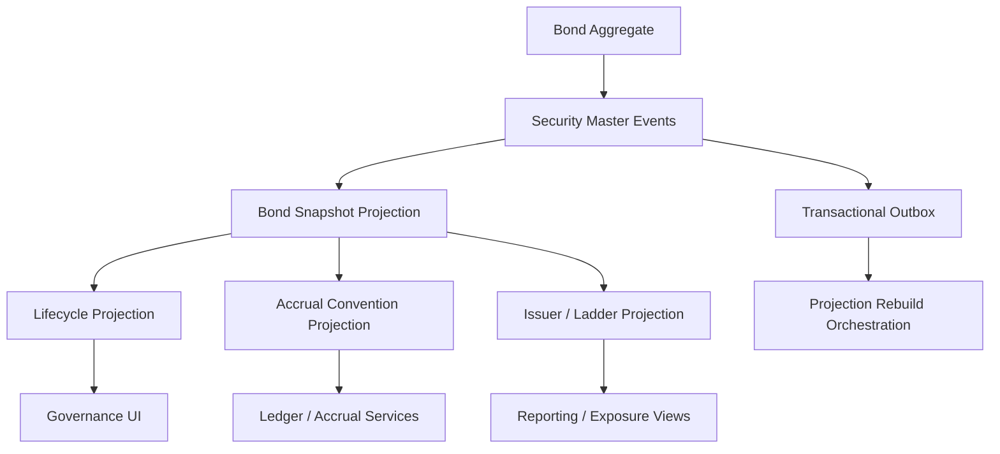

# UFL Bond Target-State Package V2

**Owner:** Core Team  
**Audience:** Product, architecture, domain, storage, and application contributors  
**Last Updated:** 2026-03-22  
**Status:** active  
**Reviewed:** 2026-03-22

## Summary

This document captures the target-state V2 package for `UFL` bond assets inside Meridian's broader security-master, fixed-income, and governance expansion.

It assumes:

- a modular monolith
- canonical bond definitions stored in security master
- fixed-income lifecycle and accrual reference views modeled as projections
- issuer and identifier lineage preserved independently from pricing or portfolio state
- replay-safe rebuilds for bond terms, lifecycle, and accrual conventions

This package turns the existing modeled bond support into a concrete build plan for reference data, lifecycle tracking, accrual conventions, and fixed-income APIs.

## Repo Fit

### Verified Meridian constraints

- Meridian already models `SecurityKind.Bond` and `BondTerms` in `src/Meridian.FSharp/Domain/SecurityMaster.fs`.
- `SecurityMasterMapping` already maps the `"Bond"` asset class.
- current validation already enforces nonnegative coupon rates when present.
- ledger, reconciliation, and governance planning already make bond lifecycle and accrual reference data valuable downstream.

### Proposed UFL-specific additions

- bond lifecycle and accrual-convention projections
- issuer and maturity-ladder read models
- bond reference and lifecycle endpoints
- additive convention storage for future callable or amortizing extensions

### Suggested Meridian mapping if implemented in-place

- F# domain support in `src/Meridian.FSharp/Domain/`
- application services in `src/Meridian.Application/FixedIncome/`
- contracts in `src/Meridian.Contracts/FixedIncome/`
- storage in `src/Meridian.Storage/SecurityMaster/`
- endpoints in `src/Meridian.Ui.Shared/Endpoints/`

## Scope

**In Scope:** canonical bond identity, issuer lineage, maturity metadata, coupon and day-count conventions, lifecycle state, replay-safe rebuilds, and bond reference/query APIs.

**Out of Scope:** structured products, mortgage-backed securities, full pricing engines, and complete callable/amortizing schedule models.

## Knowledge Graph



## 1. Architecture Blueprint

### 1.1 System shape

**Write side**

- canonical bond aggregate via security master
- issuer enrichment boundary
- accrual-convention enrichment boundary

**Read side**

- current bond snapshot
- bond lifecycle snapshot
- bond accrual-convention snapshot
- issuer and maturity-ladder snapshot

**Processing**

- security create/amend/deactivate handlers
- issuer enrichment worker
- lifecycle-state worker
- accrual-convention projection worker
- rebuild orchestration

### 1.2 Design principles

1. Canonical bond identity is separate from pricing, positions, and analytics.
2. Coupon, maturity, and day-count data are versioned facts with provenance.
3. Lifecycle state should be projected rather than inferred ad hoc in every consumer.
4. Future callable or amortizing extensions should layer on top of the existing bond base shape.
5. Ledger and accrual consumers should rely on canonical projections, not provider-native payloads.

## 2. F# Aggregate and Domain Shapes

### 2.1 Shared kernel

```fsharp
type BondId = SecurityId

type BondLifecycleState =
    | Issued
    | Active
    | Matured
    | Inactive
```

### 2.2 Bond aggregate

The canonical bond definition remains:

```fsharp
type BondTerms = {
    Maturity: DateOnly
    CouponRate: decimal option
    DayCount: string option
}
```

Proposed additive projection shapes:

```fsharp
type BondAccrualConventionProjection = {
    SecurityId: SecurityId
    DayCount: string option
    CouponRate: decimal option
    Maturity: DateOnly
}

type BondLifecycleProjection = {
    SecurityId: SecurityId
    State: BondLifecycleState
    Maturity: DateOnly
}
```

### 2.3 Projection lineage model

- security-master events rebuild canonical bond state
- issuer enrichment rebuilds issuer and ladder views
- maturity evaluation rebuilds lifecycle projections

## 3. Event Catalog

### 3.1 Domain events

- `SecurityCreated`
- `TermsAmended`
- `SecurityDeactivated`
- `BondLifecycleStateChanged`
- `BondIssuerLinked`
- `BondAccrualConventionProjected`

### 3.2 Process events

- `BondProjectionRebuildCompleted`
- `BondMaturitySweepCompleted`
- `BondIssuerRefreshCompleted`

### 3.3 Event naming and versioning policy

- keep canonical bond-definition events aligned with security master
- version issuer and convention projection payloads as additive metadata evolves
- include source system and effective timestamp in all enrichment records

## 4. SQL DDL Design

### 4.1 Core table groups

- `security_master_projection`
- `bond_projection`
- `bond_lifecycle_projection`
- `bond_accrual_convention_projection`
- `bond_issuer_projection`
- `bond_projection_checkpoint`

### 4.2 Implementation notes

- index lifecycle by maturity and current state
- issuer and ladder projections should index issuer name and maturity bucket
- accrual-convention tables should preserve the event lineage used for rebuild

## 5. Service Boundaries

### 5.1 Bond Reference module

- owns bond identity, issuer, and current terms query APIs

### 5.2 Lifecycle module

- owns active, matured, and inactive state projections

### 5.3 Accrual Convention module

- owns day-count and coupon reference views for ledger and accrual consumers

### 5.4 Platform module

- owns rebuild orchestration and outbox dispatch

## 6. Core Workflows

### 6.1 Create bond

1. create canonical bond via security master
2. persist `SecurityCreated`
3. rebuild bond snapshot
4. materialize lifecycle and convention projections

### 6.2 Amend bond terms

1. amend common or bond-specific terms
2. persist `TermsAmended`
3. rebuild bond snapshot and accrual convention views

### 6.3 Evaluate maturity lifecycle

1. compare maturity to as-of date
2. update lifecycle projection
3. publish maturity-state event if changed

### 6.4 Refresh issuer and ladder views

1. normalize issuer metadata
2. attach issuer grouping to canonical bond
3. rebuild maturity-ladder views

### 6.5 Read-model rebuild

1. replay canonical security events
2. replay issuer enrichments
3. replay lifecycle-state transitions
4. checkpoint rebuilt projections

## 7. Phase Sequence

### 7.1 Phase 1 goal

Deliver canonical bond identity, lifecycle projections, accrual-convention read models, and reference APIs.

### 7.2 Phase 1 implementation order

1. add bond DTOs and query contracts
2. add lifecycle and accrual-convention projection tables
3. implement bond reference service
4. implement maturity lifecycle service
5. expose bond reference endpoints
6. add rebuild and maturity tests

### 7.3 Phase 1 exit criteria

- bonds can be queried through canonical read APIs
- lifecycle and convention data rebuild deterministically
- issuer and maturity views support governance and reporting consumers

### 7.4 Phase 2 goals

- callable and amortizing extensions
- richer fixed-income governance views
- deeper ledger integration for accrual scheduling

## 8. Target API Surface

### 8.1 Reference

- `GET /api/security-master/bonds/{securityId}`
- `GET /api/security-master/bonds/search`

### 8.2 Lifecycle

- `GET /api/security-master/bonds/{securityId}/lifecycle`

### 8.3 Conventions

- `GET /api/security-master/bonds/{securityId}/accrual-conventions`

## 9. Proposed Repo Structure

```text
src/
  Meridian.Application/
    FixedIncome/
      IBondReferenceService.cs
      BondReferenceService.cs
      IBondLifecycleService.cs
      BondLifecycleService.cs
  Meridian.Contracts/
    FixedIncome/
      BondReferenceDtos.cs
  Meridian.Storage/
    SecurityMaster/
      BondProjectionStore.cs
  Meridian.Ui.Shared/
    Endpoints/
      BondReferenceEndpoints.cs
tests/
  Meridian.Tests/
    FixedIncome/
    SecurityMaster/
```

## 10. Recommended First Ten Implementation Tickets

1. Add bond DTOs and query contracts.
2. Add bond lifecycle projection records.
3. Add bond accrual-convention projection records.
4. Implement bond reference service.
5. Implement maturity lifecycle service.
6. Expose bond reference endpoints.
7. Add maturity-state sweep tests.
8. Add issuer grouping and ladder projections.
9. Add rebuild orchestration coverage.
10. Add governance views for bond lifecycle and maturity ladders.

## 11. Final Target State

Meridian treats a bond as a canonical fixed-income identity with explainable issuer lineage, maturity lifecycle, and accrual conventions. Reporting, governance, and ledger consumers all use the same rebuilt reference surface rather than reinterpreting provider payloads independently.

## Related Documents

- [UFL Supported Asset Packages](ufl-supported-assets-index.md)
- [UFL Direct Lending Target-State Package V2](ufl-direct-lending-target-state-v2.md)
- [Governance and Fund Operations Blueprint](governance-fund-ops-blueprint.md)
