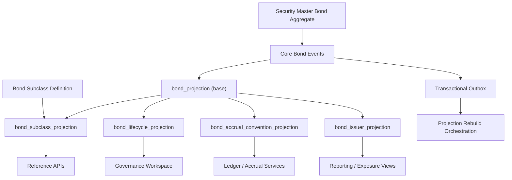

# UFL Bond Target-State Package V2

**Owner:** Core Team
**Audience:** Product, architecture, domain, storage, and application contributors
**Last Updated:** 2026-03-26
**Status:** active
**Reviewed:** 2026-03-26

> **Naming standard:** All new F# types and DTOs in this package must follow the
> [Domain Naming Standard](../ai/claude/CLAUDE.domain-naming.md).
> For bonds: top-level definition record → `BondDef`; issuer join → `SecIssLnk`;
> callable flag → `IsCallable: bool`; maturity field → `MaturityDt: DateOnly option`;
> coupon rate → `CpnRate: decimal option`; bond status union → `BondStat`.

## Summary

This package defines the **implementation-ready target state** for `UFL` bond assets in Meridian’s security-master and fixed-income stack.

The outcome is a canonical bond reference surface with:

- issuer lineage and identifier provenance,
- deterministic lifecycle projection,
- accrual-convention reference views,
- replay-safe rebuild semantics,
- API contracts for governance, ledger, and reporting consumers.

This intentionally does **not** introduce pricing engines, risk analytics, or portfolio-state logic.

## Repo Fit

### Verified Meridian constraints

- `SecurityKind.Bond` and `BondTerms` already exist in `src/Meridian.FSharp/Domain/SecurityMaster.fs`.
- `SecurityMasterMapping` already maps the `"Bond"` asset class.
- Bond validation already rejects negative coupon values when a coupon is provided.
- Ledger/reconciliation/gov workflows can already consume projected reference data.

### UFL additions in this package

- bond lifecycle projection (`Issued`, `Active`, `Matured`, `Inactive`)
- bond accrual-convention projection (day count, coupon, maturity)
- issuer + maturity-ladder read models
- deterministic rebuild + checkpoint orchestration
- fixed-income read APIs for bond reference and lifecycle
- extensible bond subclass model for treasury, corporate, municipal, and securitized variants

### Suggested implementation locations

- F# domain: `src/Meridian.FSharp/Domain/`
- application services: `src/Meridian.Application/FixedIncome/`
- contracts/DTOs: `src/Meridian.Contracts/FixedIncome/`
- storage/projections: `src/Meridian.Storage/SecurityMaster/`
- HTTP endpoints: `src/Meridian.Ui.Shared/Endpoints/`

## Scope

### In scope

- canonical bond identity + common identifiers
- subclass-aware bond contracts and extension points
- issuer linkage and maturity-ladder projection
- maturity lifecycle state model
- coupon/day-count conventions as reference data
- replay-safe projection rebuilds from authoritative events
- query APIs for bond, lifecycle, and accrual conventions

### Out of scope

- callable/puttable schedule engines
- amortizing principal schedule modeling (beyond extension hooks)
- fixed-income pricing/yield analytics
- MBS/ABS/structured products
- portfolio positions, PnL, or execution workflows

## Architecture Blueprint

### Knowledge graph



### Abstraction layers (authoritative)

The design is intentionally split into four abstraction layers to reduce coupling:

1. **Canonical Bond Core**
   Owns immutable identity and base terms (`SecurityId`, maturity, coupon, day count).
2. **Subclass Capability Layer**
   Owns additive features by subtype (convertible, floating-rate, inflation-linked, etc.).
3. **Projection + Query Layer**
   Owns denormalized read models and stable query contracts for downstream consumers.
4. **Orchestration Layer**
   Owns replay, checkpointing, sweep scheduling, and transactional outbox dispatch.

Consumer systems (ledger/reporting/governance) may depend on layers 3-4 only, never provider payloads directly.

### System shape

**Write side**

- canonical security-master aggregate for bond definitions
- issuer enrichment boundary (external + normalized internal mappings)
- accrual-convention enrichment boundary (normalization + provenance)

**Read side**

- `bond_projection` (current canonical bond snapshot)
- `bond_subclass_projection` (base bond + subclass attributes)
- `bond_lifecycle_projection` (state + transition metadata)
- `bond_accrual_convention_projection` (day count/coupon metadata)
- `bond_issuer_projection` (issuer lineage + maturity bucket)

**Processing**

- security create/amend/deactivate handlers
- issuer enrichment worker
- maturity lifecycle worker (scheduled sweep + event-driven updates)
- accrual-convention projector
- rebuild orchestrator + checkpoint manager

### Design principles

1. Bond identity is canonical and independent of pricing/positions.
2. Terms and conventions are immutable versioned facts with effective timestamps.
3. Lifecycle is projected once and consumed consistently (no per-consumer inference drift).
4. Projection rebuild must be deterministic from ordered event streams.
5. Future callable/amortizing support extends via additive contracts and tables.
6. Subclass-specific behavior is additive and never mutates base bond invariants.
7. Unknown subclass payloads are retained as opaque extension data to preserve forward compatibility.
8. Subclass policies are composed through explicit interfaces, not `if/else` logic in shared services.
9. Every read model is derivable from events + enrichments without hidden side effects.

## Domain and Projection Shapes

### Shared kernel

```fsharp
type BondId = SecurityId

type BondLifecycleState =
    | Issued
    | Active
    | Matured
    | Inactive
```

### Existing canonical bond terms

```fsharp
type BondTerms = {
    Maturity: DateOnly
    CouponRate: decimal option
    DayCount: string option
}
```

### Subclass taxonomy (target)

```fsharp
type BondSubclass =
    | Sovereign
    | Corporate
    | Municipal
    | Agency
    | Convertible
    | InflationLinked
    | ZeroCoupon
    | FloatingRate
    | AssetBacked
    | Other of string
```

`Other` allows provider/issuer-specific types without blocking ingestion while governance validates a canonical mapping.

### Proposed additive read models

```fsharp
type BondSubclassProjection = {
    SecurityId: SecurityId
    Subclass: BondSubclass
    ExtensionJson: string option
    EffectiveAtUtc: DateTime
    Source: string
}

type BondAccrualConventionProjection = {
    SecurityId: SecurityId
    DayCount: string option
    CouponRate: decimal option
    Maturity: DateOnly
    EffectiveAtUtc: DateTime
    Source: string
}

type BondLifecycleProjection = {
    SecurityId: SecurityId
    State: BondLifecycleState
    Maturity: DateOnly
    AsOfDate: DateOnly
    ChangedAtUtc: DateTime
}
```

### Subclass extension contracts

Implement subclass fields using additive DTO contracts keyed by `BondSubclass`:

- `FloatingRate`: `ReferenceIndex`, `SpreadBps`, `ResetFrequency`, `Cap`, `Floor`
- `Convertible`: `ConversionRatio`, `ConversionWindowStart`, `ConversionWindowEnd`
- `InflationLinked`: `InflationIndex`, `BaseCpi`, `LagMonths`
- `AssetBacked`: `CollateralType`, `Tranche`, `CreditEnhancementType`

Store subclass payloads in normalized extension tables when the shape stabilizes; until then persist validated JSON in `ExtensionJson`.

### Subclass abstraction contract

Define per-subclass policy handlers so extension logic is modular and testable:

```csharp
public interface IBondSubclassPolicy
{
    BondSubclass Subclass { get; }
    ValidationResult Validate(BondSubclassPayload payload);
    BondSubclassProjection Project(SecurityId securityId, BondSubclassPayload payload, DateTime effectiveAtUtc, string source);
    IEnumerable<IDomainEvent> DeriveEvents(BondSnapshot previous, BondSnapshot current, BondSubclassPayload payload);
}
```

Resolver contract:

```csharp
public interface IBondSubclassPolicyResolver
{
    bool TryResolve(BondSubclass subclass, out IBondSubclassPolicy policy);
}
```

This keeps subclass growth additive: new subclass = new policy implementation + DTO contract, no core service rewrite.

### Core invariants (must hold across all subclasses)

- `SecurityId` uniqueness remains global and subtype-agnostic.
- `Maturity` remains mandatory for all bond subclasses.
- `CouponRate` may be null, but if present must be `>= 0`.
- lifecycle state machine is shared by all subclasses.
- subclass payload may add fields but cannot redefine base semantics (`Maturity`, `DayCount`, identifiers).

### Lifecycle derivation rules

- `ActivationDateUtc` (derived): the instant the bond becomes eligible to trade/settle. For projections, this is:
  - `EffectiveAtUtc` from `SecurityCreated` (or latest `TermsAmended`) if provided, otherwise
  - `CreatedAtUtc` from `SecurityCreated`.
- `Issued`: bond exists but `AsOfDate < ActivationDateUtc` (created but not yet active).
- `Active`: `AsOfDate >= ActivationDateUtc`, not deactivated, and `AsOfDate < Maturity`.
- `Matured`: not deactivated and `AsOfDate >= Maturity`.
- `Inactive`: explicitly deactivated (terminal unless reactivation is introduced later).

If maturity and deactivation conflict on same as-of boundary, `Inactive` wins.

## Event Catalog

### Domain events

- `SecurityCreated`
- `TermsAmended`
- `SecurityDeactivated`
- `BondSubclassAssigned`
- `BondLifecycleStateChanged`
- `BondIssuerLinked`
- `BondAccrualConventionProjected`

### Process events

- `BondProjectionRebuildCompleted`
- `BondMaturitySweepCompleted`
- `BondIssuerRefreshCompleted`
- `BondSubclassBackfillCompleted`

### Event metadata requirements

Every enrichment/process event must include:

- `SourceSystem`
- `EffectiveAtUtc`
- `ObservedAtUtc`
- `CorrelationId`
- `SchemaVersion`

For subclass events, include additionally:

- `Subclass`
- `SubclassSchemaVersion`
- `PolicyVersion`

## SQL DDL Design

### Core table groups

- `security_master_projection`
- `bond_projection`
- `bond_subclass_projection`
- `bond_lifecycle_projection`
- `bond_accrual_convention_projection`
- `bond_issuer_projection`
- `projection_checkpoint` (shared; use `projection_name = 'bond_projection'` for bonds)

### Key constraints and indexing

- `bond_projection(SecurityId)` unique.
- `bond_subclass_projection(SecurityId)` unique current row + optional history table.
- `bond_lifecycle_projection(SecurityId)` unique current row + optional history table.
- index lifecycle by `(State, Maturity)` for sweeps and governance dashboards.
- index issuer ladder by `(IssuerNormalized, MaturityBucket)`.
- index subclass lookups by `Subclass` on `bond_subclass_projection`; expose `(Subclass, Maturity, IssuerNormalized)` via a dedicated screening view/projection and index that view for screening APIs.
- store event lineage columns (`EventId`, `EventSequence`, `SourceSystem`) on projection rows.
- add optimistic concurrency token (for Postgres: `version bigint` and/or `updated_at` with compare-and-swap in upserts) to all mutable projection tables.

### Schema abstraction pattern

Use a **base + extension** schema strategy:

- `bond_projection`: canonical columns common to all bonds
- `bond_subclass_projection`: subtype discriminator + schema/version fields + extension payload pointer
- optional stabilized subtype tables (example: `bond_floating_rate_projection`) for high-frequency query paths

This avoids schema churn in base tables while enabling performant subtype queries where needed.

## Service Boundaries

### Bond Reference module

Owns canonical bond read APIs (identity, terms, issuer summary, identifiers, subclass profile).

### Lifecycle module

Owns lifecycle transitions, maturity sweep logic, and lifecycle query APIs.

### Accrual Convention module

Owns day-count/coupon convention normalization and read APIs for ledger consumers.

### Bond Subclass module

Owns subclass assignment, subclass schema validation, and extension payload normalization.

#### Dependency rule

`BondSubclass` module can depend on Bond Reference contracts, but Bond Reference cannot depend on concrete subclass policy implementations.

### Platform module

Owns outbox dispatch, projection replay orchestration, and checkpoint persistence.

## Core Workflows

### 1) Create bond

1. Persist canonical bond in security master.
2. Emit `SecurityCreated`.
3. Resolve subclass mapping from provider payload.
4. Build `bond_projection` + `bond_subclass_projection` snapshots.
5. Build lifecycle + accrual-convention projections.
6. Emit projection completion process event.

### 2) Amend bond terms

1. Persist amendment in security master.
2. Emit `TermsAmended` with new effective timestamp.
3. Re-validate subclass payload if subclass fields changed.
4. Re-project bond and accrual-convention snapshots.
5. Re-evaluate lifecycle if maturity changed.

### 3) Maturity lifecycle evaluation

1. Worker compares `AsOfDate` and `Maturity`.
2. If state changed, update projection and emit `BondLifecycleStateChanged`.
3. Emit sweep completion telemetry for observability.

### 4) Issuer + ladder refresh

1. Normalize issuer aliases to canonical issuer key.
2. Update issuer projection lineage.
3. Recompute maturity bucket (`0-1Y`, `1-3Y`, `3-5Y`, `5-10Y`, `10Y+`).

### 5) Read-model rebuild

1. Replay security-master events in deterministic order.
2. Replay subclass assignment events by sequence.
3. Replay enrichment streams by sequence.
4. Recompute projections idempotently.
5. Persist `bond_projection_checkpoint`.
6. Emit `BondProjectionRebuildCompleted`.

### 6) Introduce new subclass (operational workflow)

1. Add subclass enum member + DTO contract.
2. Implement `IBondSubclassPolicy`.
3. Register policy in resolver with feature flag.
4. Run replay on golden fixtures and confirm deterministic projections.
5. Enable subclass ingestion for selected providers.
6. Remove feature flag after governance sign-off.

## API Surface (Target)

### Reference

- `GET /api/security-master/bonds/{securityId}`
- `GET /api/security-master/bonds/search?issuer=&subclass=&state=&maturityFrom=&maturityTo=&page=&pageSize=`
- `GET /api/security-master/bonds/subclasses`
- `GET /api/security-master/bonds/{securityId}/subclass`

### Lifecycle

- `GET /api/security-master/bonds/{securityId}/lifecycle`

### Accrual conventions

- `GET /api/security-master/bonds/{securityId}/accrual-conventions`

### Response requirements

- include `asOfDate` in lifecycle responses
- include `sourceSystem` and `effectiveAtUtc` in accrual convention responses
- include `subclass`, `subclassSchemaVersion` (schema version), `policyVersion` (policy implementation version), and `extensionSchema` in bond reference payloads
- use stable error codes (`BondNotFound`, `InvalidQueryRange`, `InvalidSecurityKind`, `InvalidBondSubclass`)

## Delivery Plan

### Phase 1 (target)

Deliver canonical bond identity, lifecycle projections, accrual read models, and APIs.

**Implementation order**

1. Add contracts/DTOs for bond reference + lifecycle + conventions.
2. Add subclass contracts and validation rules.
3. Add projection tables and indexes.
4. Implement reference/lifecycle services.
5. Implement maturity sweep worker.
6. Expose endpoints.
7. Add rebuild + lifecycle transition tests.

**Exit criteria**

- bond reference APIs serve deterministic canonical views,
- lifecycle and conventions rebuild deterministically from replay,
- issuer/maturity-ladder queries support governance/reporting use cases,
- subclass filters and subclass payload contracts are stable across replay.

### Phase 2 (extensions)

- callable/amortizing extensions via additive models,
- expanded governance views and breach alerts,
- deeper ledger integration for accrual scheduling orchestration,
- subclass-specific accrual and lifecycle policy modules.

### Phase 3 (abstraction hardening)

- migrate high-volume subclasses from JSON extension payloads to stabilized projection tables,
- introduce policy conformance tests shared across all `IBondSubclassPolicy` implementations,
- add policy-version compatibility checks in rebuild pipelines.

## Testing Strategy

- domain unit tests for lifecycle derivation edge cases (maturity boundary, deactivated bonds)
- domain tests for subclass validation and fallback behavior (`Other of string`)
- storage tests for idempotent projection upserts and checkpoint recovery
- API tests for query filtering, pagination, and error contracts
- rebuild tests validating deterministic outputs from identical event streams
- compatibility tests for unknown subclass extension payload persistence
- contract tests ensuring each subclass policy satisfies shared invariants
- golden master tests proving new subclass registration does not change existing subclass projections

Suggested commands:

- `dotnet test tests/Meridian.FSharp.Tests -c Release /p:EnableWindowsTargeting=true`
- `dotnet test tests/Meridian.Tests -c Release /p:EnableWindowsTargeting=true --filter Bond`

## Risks and Mitigations

- **Risk:** lifecycle drift between event-driven updates and scheduled sweeps.
  **Mitigation:** single lifecycle projector with deterministic transition function.
- **Risk:** issuer normalization inconsistency across providers.
  **Mitigation:** canonical issuer key + alias table with provenance.
- **Risk:** rebuild regressions after schema evolution.
  **Mitigation:** schema-versioned events + golden replay fixtures.
- **Risk:** subclass explosion causing contract sprawl and inconsistent consumer logic.
  **Mitigation:** strict subclass registry + additive schema versioning + bounded extension ownership.
- **Risk:** policy implementation drift between teams.
  **Mitigation:** shared `IBondSubclassPolicy` conformance suite + versioned policy registry.

## Proposed Repo Structure

```text
src/
  Meridian.Application/
    FixedIncome/
      IBondReferenceService.cs
      BondReferenceService.cs
      IBondLifecycleService.cs
      BondLifecycleService.cs
      BondAccrualConventionService.cs
      IBondSubclassService.cs
      BondSubclassService.cs
  Meridian.Contracts/
    FixedIncome/
      BondReferenceDtos.cs
      BondLifecycleDtos.cs
      BondAccrualConventionDtos.cs
      BondSubclassDtos.cs
  Meridian.Storage/
    SecurityMaster/
      BondProjectionStore.cs
      BondSubclassProjectionStore.cs
      BondLifecycleProjectionStore.cs
      BondAccrualConventionProjectionStore.cs
  Meridian.Ui.Shared/
    Endpoints/
      BondReferenceEndpoints.cs
      BondLifecycleEndpoints.cs
      BondSubclassEndpoints.cs
tests/
  Meridian.Tests/
    FixedIncome/
    SecurityMaster/
  Meridian.FSharp.Tests/
    SecurityMaster/
```

## Recommended First Ten Implementation Tickets

1. Add bond subclass enum + DTO contracts.
2. Add subclass validation policy and registry.
3. Introduce lifecycle projection table + indexes.
4. Introduce accrual projection table + lineage columns.
5. Introduce subclass projection table + schema versioning.
6. Implement `IBondReferenceService` and query handlers.
7. Implement lifecycle derivation service + transition event emission.
8. Add lifecycle/convention/subclass endpoints.
9. Add maturity sweep worker + telemetry.
10. Add issuer normalization + ladder projection + replay coverage.

## Final Target State

Meridian treats every bond as a canonical fixed-income identity with auditable issuer lineage, deterministic lifecycle state, explicit accrual conventions, and extensible subclass semantics. Governance, reporting, and ledger consumers read one rebuilt reference surface instead of reinterpreting provider payloads independently.

## Related Documents

- [UFL Supported Asset Packages](ufl-supported-assets-index.md)
- [UFL Direct Lending Target-State Package V2](ufl-direct-lending-target-state-v2.md)
- [Governance and Fund Operations Blueprint](governance-fund-ops-blueprint.md)
