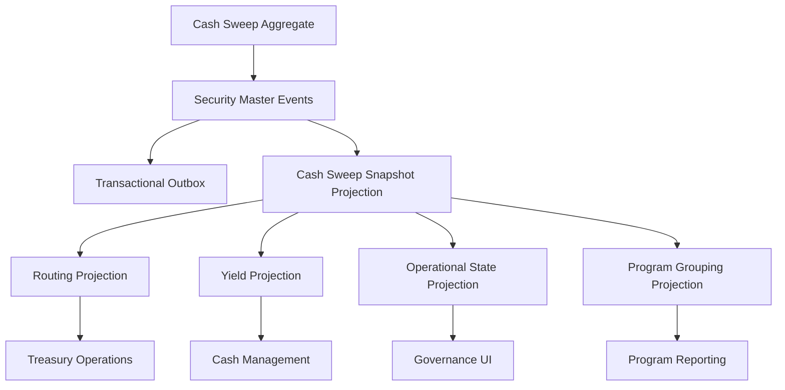

# UFL Cash Sweep Target-State Package V2

**Owner:** Core Team  
**Audience:** Product, architecture, domain, storage, and application contributors  
**Last Updated:** 2026-03-26  
**Status:** active  
**Reviewed:** 2026-03-26

> **Naming standard:** All new F# types and DTOs in this package must follow the
> [Domain Naming Standard](../ai/claude/CLAUDE.domain-naming.md).
> Cash sweeps: definition record → `CashSweepDef`; sweep vehicle type → `SweepVehicleType: string option`; sweep eligible → `IsSweepEligible: bool`.

## Summary

This document captures the target-state V2 package for `UFL` cash-sweep assets inside Meridian's broader treasury, cash-management, and governance expansion.

It assumes:

- a modular monolith
- canonical sweep-program identities stored in security master
- operational routing, eligibility, and yield views modeled as projections
- replay-safe rebuilds across sweep frequency, target-account, and yield metadata
- downstream treasury and governance services querying canonical projections

This package turns the existing `CashSweepTerms` support into an implementation-ready plan for cash-sweep reference data, operational views, and APIs.

## Repo Fit

### Verified Meridian constraints

- Meridian already models `SecurityKind.CashSweep` and `CashSweepTerms` in `src/Meridian.FSharp/Domain/SecurityMaster.fs`.
- `SecurityMasterMapping` already maps the `"CashSweep"` asset class.
- security-master validation already enforces nonblank program name, nonblank sweep vehicle type, and nonnegative yield rate when present.
- `SecurityMasterAssetClassSupportTests` already verifies base create support for cash-sweep instruments.

### Proposed UFL-specific additions

- routing and target-account projections
- yield-history and operational cutoff projections
- sweep-program grouping views
- cash-sweep-specific query contracts and endpoints

### Suggested Meridian mapping if implemented in-place

- F# domain support in `src/Meridian.FSharp/Domain/`
- application services in `src/Meridian.Application/Treasury/`
- contracts in `src/Meridian.Contracts/Treasury/`
- storage in `src/Meridian.Storage/SecurityMaster/`
- endpoints in `src/Meridian.Ui.Shared/Endpoints/`

## Scope

**In Scope:** canonical cash-sweep identity, routing metadata, target-account and frequency metadata, yield state, replay-safe rebuilds, and treasury/reference APIs.

**Out of Scope:** broker-specific operational connectors, intraday cash-forecast engines, MMF internals beyond referenced sweep vehicles, and generalized cash-allocation optimization.

## Knowledge Graph



## 1. Architecture Blueprint

### 1.1 System shape

**Write side**

- canonical cash-sweep aggregate via security master
- routing and cutoff enrichment boundary
- yield and operational-state projection boundary

**Read side**

- current cash-sweep snapshot
- routing snapshot
- yield snapshot
- operational-state snapshot
- program-grouping snapshot

**Processing**

- security create/amend/deactivate handlers
- routing projection worker
- yield projection worker
- operational-state worker
- rebuild orchestration

### 1.2 Design principles

1. A sweep program is a canonical identity even when routing choices evolve over time.
2. Routing, target-account, and cutoff rules should be projected and versioned with provenance.
3. Yield history should enrich the sweep program without redefining its identity.
4. Treasury automation and governance consumers should query one rebuilt projection surface.
5. Broker-specific logic should remain downstream from canonical program identity.

## 2. F# Aggregate and Domain Shapes

### 2.1 Shared kernel

```fsharp
type CashSweepId = SecurityId

type CashSweepOperationalState =
    | Active
    | Restricted
    | Suspended
    | Inactive
```

### 2.2 Cash-sweep aggregate

The canonical sweep-program definition remains:

```fsharp
type CashSweepTerms = {
    ProgramName: string
    SweepVehicleType: string
    SweepFrequency: string option
    TargetAccountType: string option
    YieldRate: decimal option
}
```

Proposed additive projection shapes:

```fsharp
type CashSweepRoutingProjection = {
    SecurityId: SecurityId
    SweepVehicleType: string
    SweepFrequency: string option
    TargetAccountType: string option
}

type CashSweepYieldProjection = {
    SecurityId: SecurityId
    YieldRate: decimal option
    State: CashSweepOperationalState
}
```

### 2.3 Projection lineage model

- security-master events rebuild canonical sweep-program terms
- routing and cutoff enrichments rebuild operational views
- yield updates rebuild yield-history projections

## 3. Event Catalog

### 3.1 Domain events

- `SecurityCreated`
- `TermsAmended`
- `SecurityDeactivated`
- `CashSweepRoutingProjected`
- `CashSweepYieldUpdated`
- `CashSweepOperationalStateChanged`

### 3.2 Process events

- `CashSweepYieldRefreshCompleted`
- `CashSweepProjectionRebuildCompleted`
- `CashSweepRoutingRefreshCompleted`

### 3.3 Event naming and versioning policy

- align base sweep-definition events with security master
- version routing and yield payloads independently from definition payloads
- include source system and effective date in all operational projections

## 4. SQL DDL Design

### 4.1 Core table groups

- `security_master_projection`
- `cash_sweep_projection`
- `cash_sweep_routing_projection`
- `cash_sweep_yield_projection`
- `cash_sweep_operational_projection`
- `cash_sweep_projection_checkpoint`

### 4.2 Implementation notes

- routing projections should index target account type and vehicle type
- yield projections should index current yield and effective date
- operational projections should index state and cutoff bucket for governance queries

## 5. Service Boundaries

### 5.1 Cash Sweep Reference module

- owns canonical sweep-program query APIs

### 5.2 Routing module

- owns routing, target-account, and frequency views

### 5.3 Yield / Operational module

- owns yield and operational-state projections

### 5.4 Platform module

- owns rebuild orchestration and outbox dispatch

## 6. Core Workflows

### 6.1 Create cash-sweep program

1. create canonical program in security master
2. persist `SecurityCreated`
3. rebuild snapshot and routing projections
4. attach yield and operational views

### 6.2 Amend sweep terms

1. amend common or sweep-specific terms
2. persist `TermsAmended`
3. rebuild routing and yield views

### 6.3 Refresh routing and cutoff metadata

1. ingest operational metadata
2. rebuild routing and operational projections
3. publish outbox event for treasury consumers

### 6.4 Refresh yield state

1. ingest yield update
2. rebuild yield projection
3. update governance and reporting views

### 6.5 Read-model rebuild

1. replay canonical security events
2. replay routing and yield updates
3. checkpoint rebuilt projections

## 7. Phase Sequence

### 7.1 Phase 1 goal

Deliver canonical cash-sweep identity, routing and yield projections, and treasury/reference APIs.

### 7.2 Phase 1 implementation order

1. add cash-sweep DTOs and query contracts
2. add routing, yield, and operational projection tables
3. implement cash-sweep reference service
4. implement routing and yield services
5. expose cash-sweep reference endpoints
6. add routing and yield-state tests

### 7.3 Phase 1 exit criteria

- cash-sweep programs query through canonical APIs
- routing and yield views rebuild deterministically
- treasury and governance consumers can rely on the same operational projections

### 7.4 Phase 2 goals

- broker-specific routing overlays
- richer cutoff and alert metadata
- deeper cash-management integration

## 8. Target API Surface

### 8.1 Reference

- `GET /api/security-master/cash-sweeps/{securityId}`
- `GET /api/security-master/cash-sweeps/search`

### 8.2 Routing

- `GET /api/security-master/cash-sweeps/{securityId}/routing`

### 8.3 Yield

- `GET /api/security-master/cash-sweeps/{securityId}/yield`

## 9. Proposed Repo Structure

```text
src/
  Meridian.Application/
    Treasury/
      ICashSweepService.cs
      CashSweepService.cs
      ICashSweepRoutingService.cs
      CashSweepRoutingService.cs
  Meridian.Contracts/
    Treasury/
      CashSweepDtos.cs
  Meridian.Storage/
    SecurityMaster/
      CashSweepProjectionStore.cs
  Meridian.Ui.Shared/
    Endpoints/
      CashSweepEndpoints.cs
tests/
  Meridian.Tests/
    Treasury/
    SecurityMaster/
```

## 10. Recommended First Ten Implementation Tickets

1. Add cash-sweep DTOs and query contracts.
2. Add routing and yield projection records.
3. Add operational-state projection records.
4. Implement cash-sweep reference service.
5. Implement routing and yield services.
6. Expose cash-sweep reference endpoints.
7. Add routing normalization tests.
8. Add yield-state and operational projection tests.
9. Add rebuild orchestration coverage.
10. Add treasury and governance operational views.

## 11. Final Target State

Meridian treats a cash-sweep program as a canonical treasury identity with explainable routing, yield, and operational state. Treasury, cash-management, and governance consumers all use the same rebuilt reference model.

## Related Documents

- [UFL Supported Asset Packages](ufl-supported-assets-index.md)
- [UFL Direct Lending Target-State Package V2](ufl-direct-lending-target-state-v2.md)
- [Governance and Fund Operations Blueprint](governance-fund-ops-blueprint.md)
