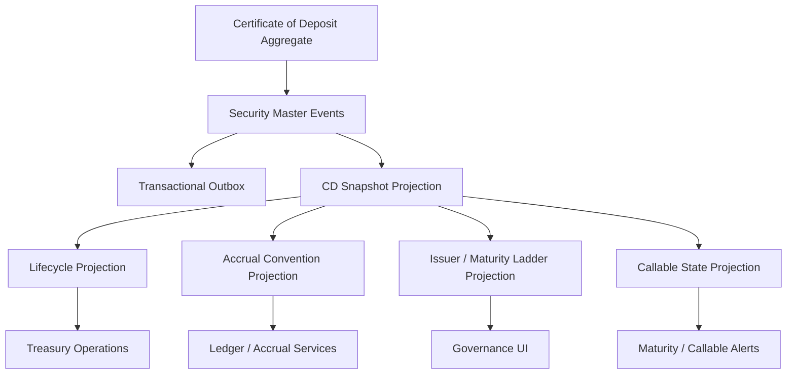

# UFL Certificate of Deposit Target-State Package V2

**Owner:** Core Team  
**Audience:** Product, architecture, domain, storage, and application contributors  
**Last Updated:** 2026-03-22  
**Status:** active  
**Reviewed:** 2026-03-22

## Summary

This document captures the target-state V2 package for `UFL` certificate-of-deposit assets inside Meridian's broader treasury, fixed-income, and governance expansion.

It assumes:

- a modular monolith
- canonical CD definitions stored in security master
- lifecycle state and treasury operations modeled as projections over canonical instrument identity
- replay-safe rebuilds across maturity, callable state, and issuer lineage
- downstream accounting and treasury consumers reading canonical projections rather than provider-native payloads

This package turns the existing `CertificateOfDepositTerms` support into an implementation-ready plan for reference data, lifecycle management, treasury views, and APIs.

## Repo Fit

### Verified Meridian constraints

- Meridian already models `SecurityKind.CertificateOfDeposit` and `CertificateOfDepositTerms` in `src/Meridian.FSharp/Domain/SecurityMaster.fs`.
- `SecurityMasterMapping` already maps the `"CertificateOfDeposit"` asset class.
- security-master validation already enforces nonblank issuer name, nonnegative coupon rate, and callable-date ordering relative to maturity.
- `SecurityMasterAssetClassSupportTests` already verifies basic create support for CDs.

### Proposed UFL-specific additions

- certificate-of-deposit lifecycle and maturity projections
- issuer and ladder views for treasury operations
- additive callable-state projections
- CD-specific query contracts and endpoints

### Suggested Meridian mapping if implemented in-place

- F# domain support in `src/Meridian.FSharp/Domain/`
- application services in `src/Meridian.Application/Treasury/`
- contracts in `src/Meridian.Contracts/Treasury/`
- storage in `src/Meridian.Storage/SecurityMaster/`
- endpoints in `src/Meridian.Ui.Shared/Endpoints/`

## Scope

**In Scope:** canonical CD identity, issuer lineage, maturity and callable metadata, coupon and day-count reference data, lifecycle state, replay-safe rebuilds, and treasury/reference APIs.

**Out of Scope:** brokered-CD marketplace logic, secondary-market pricing, early-redemption penalty engines, and generalized bank-product accounting.

## Knowledge Graph



## 1. Architecture Blueprint

### 1.1 System shape

**Write side**

- canonical CD aggregate via security master
- issuer enrichment boundary
- callable-state and maturity projection boundary

**Read side**

- current CD snapshot
- lifecycle snapshot
- callable-state snapshot
- accrual-convention snapshot
- issuer and ladder snapshot

**Processing**

- security create/amend/deactivate handlers
- lifecycle-state worker
- callable-state worker
- ladder projection worker
- rebuild orchestration

### 1.2 Design principles

1. The CD definition is canonical even when treasury operations change around it.
2. Callable and maturity state should be projected from immutable terms and lifecycle events.
3. Issuer lineage must stay stable across provider aliases and naming differences.
4. Treasury alerts should read from canonical rebuilt state, not one-off calculations.
5. Future renewal or rollover behavior should extend the lifecycle model, not rewrite the base identity.

## 2. F# Aggregate and Domain Shapes

### 2.1 Shared kernel

```fsharp
type CertificateOfDepositId = SecurityId

type CdLifecycleState =
    | Open
    | Callable
    | Matured
    | Redeemed
    | Inactive
```

### 2.2 Certificate-of-deposit aggregate

The canonical instrument definition remains:

```fsharp
type CertificateOfDepositTerms = {
    IssuerName: string
    Maturity: DateOnly
    CouponRate: decimal option
    CallableDate: DateOnly option
    DayCount: string option
}
```

Proposed additive projection shapes:

```fsharp
type CdLifecycleProjection = {
    SecurityId: SecurityId
    State: CdLifecycleState
    Maturity: DateOnly
    CallableDate: DateOnly option
}

type CdAccrualConventionProjection = {
    SecurityId: SecurityId
    CouponRate: decimal option
    DayCount: string option
    Maturity: DateOnly
}
```

### 2.3 Projection lineage model

- security-master events rebuild canonical CD terms
- lifecycle evaluation rebuilds maturity and callable views
- issuer normalization rebuilds ladder and grouping projections

## 3. Event Catalog

### 3.1 Domain events

- `SecurityCreated`
- `TermsAmended`
- `SecurityDeactivated`
- `CdLifecycleStateChanged`
- `CdCallableStateProjected`
- `CdIssuerLinked`

### 3.2 Process events

- `CdMaturitySweepCompleted`
- `CdProjectionRebuildCompleted`
- `CdIssuerRefreshCompleted`

### 3.3 Event naming and versioning policy

- keep base instrument-definition events aligned with security master
- version callable and lifecycle payloads independently from definition payloads
- include source system and effective date in all issuer and state projections

## 4. SQL DDL Design

### 4.1 Core table groups

- `security_master_projection`
- `cd_projection`
- `cd_lifecycle_projection`
- `cd_callable_projection`
- `cd_accrual_convention_projection`
- `cd_issuer_ladder_projection`

### 4.2 Implementation notes

- index lifecycle and callable tables by maturity and callable date
- ladder projections should index issuer and maturity bucket
- projection rows should retain source event lineage for replay explainability

## 5. Service Boundaries

### 5.1 CD Reference module

- owns canonical CD reference queries and issuer normalization

### 5.2 Lifecycle module

- owns open, callable, matured, and redeemed state projections

### 5.3 Accrual Convention module

- owns coupon and day-count reference views for treasury and accounting consumers

### 5.4 Platform module

- owns rebuild orchestration, alerts, and outbox dispatch

## 6. Core Workflows

### 6.1 Create certificate of deposit

1. create canonical CD via security master
2. persist `SecurityCreated`
3. rebuild snapshot and accrual-convention projections
4. attach issuer and ladder metadata

### 6.2 Amend CD terms

1. amend common or CD-specific terms
2. persist `TermsAmended`
3. rebuild snapshot, callable, and lifecycle views

### 6.3 Evaluate callable window

1. compare as-of date to callable date
2. update callable and lifecycle projections
3. publish alert-oriented outbox event if state changes

### 6.4 Evaluate maturity

1. compare as-of date to maturity
2. update lifecycle and ladder projections
3. rebuild treasury and governance views

### 6.5 Read-model rebuild

1. replay canonical security events
2. replay issuer normalization and lifecycle events
3. checkpoint rebuilt projections

## 7. Phase Sequence

### 7.1 Phase 1 goal

Deliver canonical CD identity, lifecycle and callable projections, and treasury/reference APIs.

### 7.2 Phase 1 implementation order

1. add CD DTOs and query contracts
2. add lifecycle, callable, and ladder projection tables
3. implement CD reference service
4. implement lifecycle and callable projection services
5. expose CD reference endpoints
6. add maturity and callable-state tests

### 7.3 Phase 1 exit criteria

- CDs can be queried through canonical APIs
- maturity and callable state rebuild deterministically
- treasury and governance consumers can rely on issuer and ladder views

### 7.4 Phase 2 goals

- renewal workflows
- richer treasury alerting
- deeper accounting integration

## 8. Target API Surface

### 8.1 Reference

- `GET /api/security-master/certificates-of-deposit/{securityId}`
- `GET /api/security-master/certificates-of-deposit/search`

### 8.2 Lifecycle

- `GET /api/security-master/certificates-of-deposit/{securityId}/lifecycle`

### 8.3 Conventions

- `GET /api/security-master/certificates-of-deposit/{securityId}/accrual-conventions`

## 9. Proposed Repo Structure

```text
src/
  Meridian.Application/
    Treasury/
      ICertificateOfDepositService.cs
      CertificateOfDepositService.cs
      ICdLifecycleService.cs
      CdLifecycleService.cs
  Meridian.Contracts/
    Treasury/
      CertificateOfDepositDtos.cs
  Meridian.Storage/
    SecurityMaster/
      CdProjectionStore.cs
  Meridian.Ui.Shared/
    Endpoints/
      CertificateOfDepositEndpoints.cs
tests/
  Meridian.Tests/
    Treasury/
    SecurityMaster/
```

## 10. Recommended First Ten Implementation Tickets

1. Add CD DTOs and query contracts.
2. Add lifecycle and callable projection records.
3. Add issuer and ladder projection records.
4. Implement CD reference service.
5. Implement lifecycle and callable services.
6. Expose CD reference endpoints.
7. Add maturity and callable-state sweep tests.
8. Add issuer normalization coverage.
9. Add rebuild orchestration coverage.
10. Add governance and treasury alert views.

## 11. Final Target State

Meridian treats a certificate of deposit as a canonical treasury instrument with explainable issuer lineage, lifecycle state, and accrual conventions. Treasury operations, governance, and accounting all consume the same rebuilt reference model.

## Related Documents

- [UFL Supported Asset Packages](ufl-supported-assets-index.md)
- [UFL Direct Lending Target-State Package V2](ufl-direct-lending-target-state-v2.md)
- [Governance and Fund Operations Blueprint](governance-fund-ops-blueprint.md)
