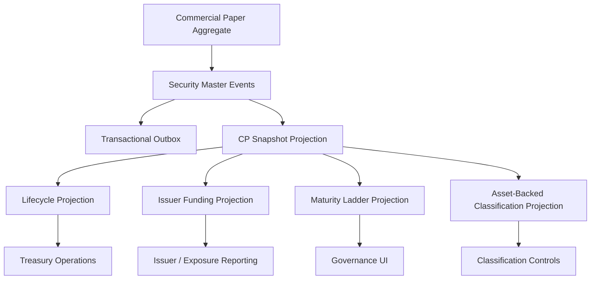

# UFL Commercial Paper Target-State Package V2

**Owner:** Core Team  
**Audience:** Product, architecture, domain, storage, and application contributors  
**Last Updated:** 2026-03-22  
**Status:** active  
**Reviewed:** 2026-03-22

## Summary

This document captures the target-state V2 package for `UFL` commercial-paper assets inside Meridian's broader treasury, short-duration, and governance expansion.

It assumes:

- a modular monolith
- canonical commercial-paper instruments stored in security master
- lifecycle, issuer, and funding views modeled as projections
- replay-safe rebuilds across maturity and issuer-grouping state
- downstream treasury and governance services querying canonical projections

This package turns the existing `CommercialPaperTerms` support into an implementation-ready plan for reference data, maturity ladders, issuer views, and APIs.

## Repo Fit

### Verified Meridian constraints

- Meridian already models `SecurityKind.CommercialPaper` and `CommercialPaperTerms` in `src/Meridian.FSharp/Domain/SecurityMaster.fs`.
- `SecurityMasterMapping` already maps the `"CommercialPaper"` asset class.
- security-master validation already enforces nonblank issuer name and nonnegative discount rate when present.
- `SecurityMasterAssetClassSupportTests` already verifies base create support for commercial paper.

### Proposed UFL-specific additions

- commercial-paper lifecycle and issuer-funding projections
- maturity ladder views for short-duration governance
- additive asset-backed classification views
- CP-specific query contracts and endpoints

### Suggested Meridian mapping if implemented in-place

- F# domain support in `src/Meridian.FSharp/Domain/`
- application services in `src/Meridian.Application/Treasury/`
- contracts in `src/Meridian.Contracts/Treasury/`
- storage in `src/Meridian.Storage/SecurityMaster/`
- endpoints in `src/Meridian.Ui.Shared/Endpoints/`

## Scope

**In Scope:** canonical commercial-paper identity, issuer lineage, maturity metadata, discount and day-count conventions, asset-backed classification, lifecycle state, replay-safe rebuilds, and treasury/reference APIs.

**Out of Scope:** dealer placement logic, issuance-program management, credit analytics beyond reference classification, and full short-term funding optimization.

## Knowledge Graph



## 1. Architecture Blueprint

### 1.1 System shape

**Write side**

- canonical commercial-paper aggregate via security master
- issuer normalization boundary
- lifecycle and ladder projection boundary

**Read side**

- current CP snapshot
- lifecycle snapshot
- maturity ladder snapshot
- issuer funding snapshot
- asset-backed classification snapshot

**Processing**

- security create/amend/deactivate handlers
- maturity-state worker
- issuer normalization worker
- classification projection worker
- rebuild orchestration

### 1.2 Design principles

1. Commercial paper remains a canonical instrument identity even as funding views evolve.
2. Short-duration lifecycle state should be projected explicitly because maturity windows are operationally sensitive.
3. Asset-backed classification is a governed data point with provenance, not a casual label.
4. Issuer-grouping and funding ladders must rebuild deterministically from canonical history.
5. Treasury and governance consumers should query projections, not ad hoc provider payloads.

## 2. F# Aggregate and Domain Shapes

### 2.1 Shared kernel

```fsharp
type CommercialPaperId = SecurityId

type CpLifecycleState =
    | Active
    | Maturing
    | Matured
    | Inactive
```

### 2.2 Commercial-paper aggregate

The canonical instrument definition remains:

```fsharp
type CommercialPaperTerms = {
    IssuerName: string
    Maturity: DateOnly
    DiscountRate: decimal option
    DayCount: string option
    IsAssetBacked: bool
}
```

Proposed additive projection shapes:

```fsharp
type CpLifecycleProjection = {
    SecurityId: SecurityId
    State: CpLifecycleState
    Maturity: DateOnly
}

type CpIssuerFundingProjection = {
    SecurityId: SecurityId
    IssuerName: string
    IsAssetBacked: bool
    MaturityBucket: string
}
```

### 2.3 Projection lineage model

- security-master events rebuild canonical CP terms
- lifecycle evaluation rebuilds maturity views
- issuer normalization rebuilds exposure and ladder views

## 3. Event Catalog

### 3.1 Domain events

- `SecurityCreated`
- `TermsAmended`
- `SecurityDeactivated`
- `CpLifecycleStateChanged`
- `CpIssuerLinked`
- `CpClassificationProjected`

### 3.2 Process events

- `CpMaturitySweepCompleted`
- `CpProjectionRebuildCompleted`
- `CpIssuerRefreshCompleted`

### 3.3 Event naming and versioning policy

- align canonical instrument-definition events with security master
- version classification payloads independently from definition payloads
- carry effective date and source provenance on issuer and classification projections

## 4. SQL DDL Design

### 4.1 Core table groups

- `security_master_projection`
- `commercial_paper_projection`
- `commercial_paper_lifecycle_projection`
- `commercial_paper_issuer_projection`
- `commercial_paper_ladder_projection`
- `commercial_paper_classification_projection`

### 4.2 Implementation notes

- index by issuer and maturity for ladder and exposure views
- classification projection should index asset-backed flag and issuer
- lifecycle projection should index near-dated maturity windows for alerts

## 5. Service Boundaries

### 5.1 CP Reference module

- owns canonical commercial-paper query APIs

### 5.2 Lifecycle module

- owns active, maturing, matured, and inactive state projections

### 5.3 Issuer Funding module

- owns issuer-grouping, maturity ladder, and classification views

### 5.4 Platform module

- owns rebuild orchestration and outbox dispatch

## 6. Core Workflows

### 6.1 Create commercial paper

1. create canonical instrument in security master
2. persist `SecurityCreated`
3. rebuild snapshot and classification projections
4. attach issuer and ladder views

### 6.2 Amend terms

1. amend common or CP-specific terms
2. persist `TermsAmended`
3. rebuild canonical snapshot and maturity views

### 6.3 Evaluate maturity ladder

1. compare as-of date to maturity
2. update lifecycle and ladder projections
3. publish alert-oriented outbox event if state changes

### 6.4 Refresh issuer and classification

1. normalize issuer metadata
2. project asset-backed classification
3. rebuild issuer funding and reporting views

### 6.5 Read-model rebuild

1. replay canonical security events
2. replay lifecycle and classification events
3. checkpoint rebuilt projections

## 7. Phase Sequence

### 7.1 Phase 1 goal

Deliver canonical commercial-paper identity, lifecycle and issuer projections, and treasury/reference APIs.

### 7.2 Phase 1 implementation order

1. add CP DTOs and query contracts
2. add lifecycle, issuer, and ladder projection tables
3. implement CP reference service
4. implement maturity ladder service
5. expose CP reference endpoints
6. add maturity and classification tests

### 7.3 Phase 1 exit criteria

- commercial-paper instruments query through canonical APIs
- maturity and issuer views rebuild deterministically
- governance and treasury consumers can inspect asset-backed classifications and ladders

### 7.4 Phase 2 goals

- issuance-program overlays
- richer treasury alerting
- exposure controls by issuer cohort

## 8. Target API Surface

### 8.1 Reference

- `GET /api/security-master/commercial-paper/{securityId}`
- `GET /api/security-master/commercial-paper/search`

### 8.2 Lifecycle

- `GET /api/security-master/commercial-paper/{securityId}/lifecycle`

### 8.3 Issuer / ladder

- `GET /api/security-master/commercial-paper/ladders`

## 9. Proposed Repo Structure

```text
src/
  Meridian.Application/
    Treasury/
      ICommercialPaperService.cs
      CommercialPaperService.cs
      ICpLifecycleService.cs
      CpLifecycleService.cs
  Meridian.Contracts/
    Treasury/
      CommercialPaperDtos.cs
  Meridian.Storage/
    SecurityMaster/
      CommercialPaperProjectionStore.cs
  Meridian.Ui.Shared/
    Endpoints/
      CommercialPaperEndpoints.cs
tests/
  Meridian.Tests/
    Treasury/
    SecurityMaster/
```

## 10. Recommended First Ten Implementation Tickets

1. Add CP DTOs and query contracts.
2. Add lifecycle and issuer projection records.
3. Add ladder and classification projection records.
4. Implement CP reference service.
5. Implement maturity ladder service.
6. Expose CP reference endpoints.
7. Add maturity-state sweep tests.
8. Add issuer normalization coverage.
9. Add asset-backed classification tests.
10. Add governance and treasury ladder views.

## 11. Final Target State

Meridian treats commercial paper as a canonical short-duration funding instrument with explainable issuer lineage, lifecycle state, and classification. Treasury, governance, and reporting consumers all use the same rebuilt reference projections.

## Related Documents

- [UFL Supported Asset Packages](ufl-supported-assets-index.md)
- [UFL Direct Lending Target-State Package V2](ufl-direct-lending-target-state-v2.md)
- [Governance and Fund Operations Blueprint](governance-fund-ops-blueprint.md)
