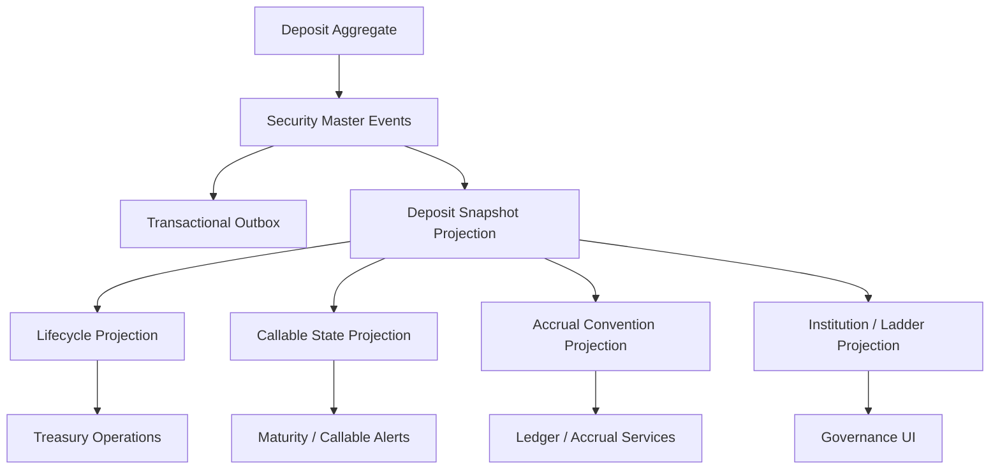

# UFL Deposit Target-State Package V2

**Owner:** Core Team
**Audience:** Product, architecture, domain, storage, and application contributors
**Last Updated:** 2026-03-26
**Status:** active
**Reviewed:** 2026-03-26

> **Naming standard:** All new F# types and DTOs in this package must follow the
> [Domain Naming Standard](../ai/claude/CLAUDE.domain-naming.md).
> Deposits: definition record → `DepositDef`; interest rate → `IntRate: decimal option`; maturity → `MaturityDt: DateOnly option`; term deposit flag → `IsTermDeposit: bool`.

## Summary

This document captures the target-state V2 package for `UFL` deposit assets inside Meridian's broader treasury, cash-management, and governance expansion.

It assumes:

- a modular monolith
- canonical deposit instruments stored in security master
- treasury lifecycle and accrual views modeled as projections over the canonical identity
- replay-safe rebuilds across maturity, callable state, and institution lineage
- downstream treasury, governance, and accounting services querying canonical projections

This package turns the existing `DepositTerms` support into an implementation-ready plan for deposit reference data, lifecycle management, treasury views, and APIs.

## Repo Fit

### Verified Meridian constraints

- Meridian already models `SecurityKind.Deposit` and `DepositTerms` in `src/Meridian.FSharp/Domain/SecurityMaster.fs`.
- `SecurityMasterMapping` already maps the `"Deposit"` asset class.
- security-master validation already enforces nonblank deposit type, nonblank institution name, and nonnegative interest rates when present.
- `SecurityMasterAssetClassSupportTests` already verifies base create support for deposits.

### Proposed UFL-specific additions

- deposit lifecycle and maturity projections
- institution and ladder views for treasury operations
- callable-state and accrual-convention projections
- deposit-specific query contracts and endpoints

### Suggested Meridian mapping if implemented in-place

- F# domain support in `src/Meridian.FSharp/Domain/`
- application services in `src/Meridian.Application/Treasury/`
- contracts in `src/Meridian.Contracts/Treasury/`
- storage in `src/Meridian.Storage/SecurityMaster/`
- endpoints in `src/Meridian.Ui.Shared/Endpoints/`

## Scope

**In Scope:** canonical deposit identity, institution lineage, maturity and callable metadata, interest-rate and day-count reference data, lifecycle state, replay-safe rebuilds, and treasury/reference APIs.

**Out of Scope:** bank covenant management, generalized cash forecasting, counterparty-risk engines, and bank-operations integrations beyond reference and lifecycle support.

## Knowledge Graph



## 1. Architecture Blueprint

### 1.1 System shape

**Write side**

- canonical deposit aggregate via security master
- institution normalization boundary
- lifecycle and callable projection boundary

**Read side**

- current deposit snapshot
- lifecycle snapshot
- callable-state snapshot
- accrual-convention snapshot
- institution and ladder snapshot

**Processing**

- security create/amend/deactivate handlers
- lifecycle-state worker
- callable-state worker
- institution normalization worker
- rebuild orchestration

### 1.2 Design principles

1. A deposit definition is canonical even when treasury events change around it.
2. Callable and maturity state should be projected from immutable terms and lifecycle rules.
3. Institution lineage must stay normalized for exposure and governance reporting.
4. Treasury alerts should flow from rebuilt projections, not duplicated service logic.
5. Future renewal behavior should extend lifecycle state without replacing the base identity.

## 2. F# Aggregate and Domain Shapes

### 2.1 Shared kernel

```fsharp
type DepositId = SecurityId

type DepositLifecycleState =
    | Open
    | Callable
    | Maturing
    | Matured
    | Closed
    | Inactive
```

### 2.2 Deposit aggregate

The canonical instrument definition remains:

```fsharp
type DepositTerms = {
    DepositType: string
    InstitutionName: string
    Maturity: DateOnly option
    InterestRate: decimal option
    DayCount: string option
    IsCallable: bool
}
```

Proposed additive projection shapes:

```fsharp
type DepositLifecycleProjection = {
    SecurityId: SecurityId
    State: DepositLifecycleState
    Maturity: DateOnly option
    IsCallable: bool
}

type DepositAccrualConventionProjection = {
    SecurityId: SecurityId
    InterestRate: decimal option
    DayCount: string option
    InstitutionName: string
}
```

### 2.3 Projection lineage model

- security-master events rebuild canonical deposit terms
- lifecycle evaluation rebuilds maturity and callable views
- institution normalization rebuilds ladder and grouping projections

## 3. Event Catalog

### 3.1 Domain events

- `SecurityCreated`
- `TermsAmended`
- `SecurityDeactivated`
- `DepositLifecycleStateChanged`
- `DepositCallableStateProjected`
- `DepositInstitutionLinked`

### 3.2 Process events

- `DepositMaturitySweepCompleted`
- `DepositProjectionRebuildCompleted`
- `DepositInstitutionRefreshCompleted`

### 3.3 Event naming and versioning policy

- align base deposit-definition events with security master
- version callable and lifecycle payloads independently from definition payloads
- include source system and effective date in enrichment and state projections

## 4. SQL DDL Design

### 4.1 Core table groups

- `security_master_projection`
- `deposit_projection`
- `deposit_lifecycle_projection`
- `deposit_callable_projection`
- `deposit_accrual_convention_projection`
- `deposit_institution_ladder_projection`

### 4.2 Implementation notes

- index lifecycle tables by maturity and state
- callable tables should index callable flag and maturity
- institution ladder projections should index institution name and maturity bucket

## 5. Service Boundaries

### 5.1 Deposit Reference module

- owns canonical deposit reference queries

### 5.2 Lifecycle module

- owns open, callable, maturing, matured, and closed state projections

### 5.3 Accrual Convention module

- owns interest-rate and day-count views for treasury and accounting consumers

### 5.4 Platform module

- owns rebuild orchestration, alerts, and outbox dispatch

## 6. Core Workflows

### 6.1 Create deposit

1. create canonical deposit in security master
2. persist `SecurityCreated`
3. rebuild snapshot and accrual-convention projections
4. attach institution and ladder metadata

### 6.2 Amend deposit terms

1. amend common or deposit-specific terms
2. persist `TermsAmended`
3. rebuild snapshot, lifecycle, and callable views

### 6.3 Evaluate callable and maturity state

1. inspect maturity and callable flags
2. update lifecycle and callable projections
3. publish alert-oriented outbox event if state changes

### 6.4 Refresh institution views

1. normalize institution metadata
2. rebuild institution and ladder projections
3. update governance and reporting views

### 6.5 Read-model rebuild

1. replay canonical security events
2. replay lifecycle and institution events
3. checkpoint rebuilt projections

## 7. Phase Sequence

### 7.1 Phase 1 goal

Deliver canonical deposit identity, lifecycle and callable projections, and treasury/reference APIs.

### 7.2 Phase 1 implementation order

1. add deposit DTOs and query contracts
2. add lifecycle, callable, and ladder projection tables
3. implement deposit reference service
4. implement lifecycle and callable services
5. expose deposit reference endpoints
6. add maturity and callable-state tests

### 7.3 Phase 1 exit criteria

- deposits query through canonical APIs
- lifecycle and callable views rebuild deterministically
- treasury and governance consumers can use institution and ladder projections

### 7.4 Phase 2 goals

- renewal workflows
- richer alerting
- deeper accounting integration

## 8. Target API Surface

### 8.1 Reference

- `GET /api/security-master/deposits/{securityId}`
- `GET /api/security-master/deposits/search`

### 8.2 Lifecycle

- `GET /api/security-master/deposits/{securityId}/lifecycle`

### 8.3 Conventions

- `GET /api/security-master/deposits/{securityId}/accrual-conventions`

## 9. Proposed Repo Structure

```text
src/
  Meridian.Application/
    Treasury/
      IDepositService.cs
      DepositService.cs
      IDepositLifecycleService.cs
      DepositLifecycleService.cs
  Meridian.Contracts/
    Treasury/
      DepositDtos.cs
  Meridian.Storage/
    SecurityMaster/
      DepositProjectionStore.cs
  Meridian.Ui.Shared/
    Endpoints/
      DepositEndpoints.cs
tests/
  Meridian.Tests/
    Treasury/
    SecurityMaster/
```

## 10. Recommended First Ten Implementation Tickets

1. Add deposit DTOs and query contracts.
2. Add lifecycle and callable projection records.
3. Add institution and ladder projection records.
4. Implement deposit reference service.
5. Implement lifecycle and callable services.
6. Expose deposit reference endpoints.
7. Add maturity and callable-state sweep tests.
8. Add institution normalization coverage.
9. Add rebuild orchestration coverage.
10. Add treasury and governance lifecycle views.

## 11. Final Target State

Meridian treats a deposit as a canonical treasury instrument with explainable institution lineage, lifecycle state, and accrual conventions. Treasury, governance, and accounting consumers all use the same rebuilt reference model.

## Related Documents

- [UFL Supported Asset Packages](ufl-supported-assets-index.md)
- [UFL Direct Lending Target-State Package V2](ufl-direct-lending-target-state-v2.md)
- [Governance and Fund Operations Blueprint](governance-fund-ops-blueprint.md)
