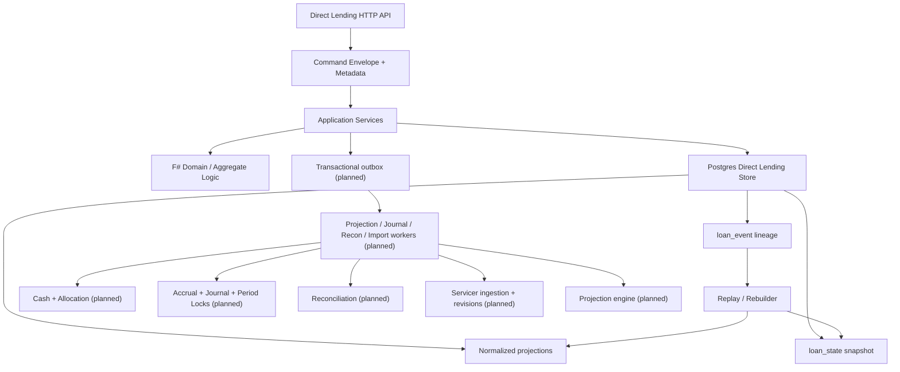

# UFL Direct Lending Implementation Roadmap

**Owner:** Core Team
**Audience:** Engineering leads, implementers, reviewers, and product stakeholders
**Last Updated:** 2026-03-22
**Status:** Active execution roadmap

## Scope

**In Scope:** A dependency-aware implementation roadmap from the current Meridian direct-lending slice to the full UFL direct-lending target state, including contract servicing, event lineage, relational projections, cash, accruals, projections, accounting, reconciliation, servicer ingestion, and operational hardening.

**Out of Scope:** Other UFL asset packages, broad workstation redesign outside direct-lending needs, non-direct-lending collateral workflows, syndications, impairment/ECL, and major portfolio-analytics work beyond what is required to complete Phase 1 and the first production-ready Phase 2 controls.

**Assumptions:**

- The existing direct-lending slice in `src/Meridian.Application/DirectLending/`, `src/Meridian.Storage/DirectLending/`, `src/Meridian.Contracts/DirectLending/`, `src/Meridian.Ui.Shared/Endpoints/DirectLendingEndpoints.cs`, and `src/Meridian.FSharp/Domain/DirectLending.fs` remains the starting point.
- PostgreSQL remains the operational database and the current direct-lending schema under `direct_lending` is retained as the evolution base.
- Sharpino is still the intended end-state write-model foundation, even though the current implementation uses a lighter event-lineage plus projection model.
- The roadmap should minimize churn by evolving the current slice rather than replacing it wholesale.

**Depth Mode:** full

## Architectural Overview

### Context Diagram



### Design Decisions

- **Decision:** Use the current Meridian direct-lending slice as the migration base instead of restarting with a new bounded-context project tree.
  **Alternatives:** Start fresh under `src/Ufl.*`; wait until every UFL asset has a shared shell.
  **Rationale:** Meridian already contains a working direct-lending vertical slice with HTTP APIs, PostgreSQL storage, replay logic, normalized projections, and metadata ingress.
  **Consequences:** Near-term delivery is faster, but a future extraction boundary should stay visible in code organization.

- **Decision:** Keep event lineage authoritative while progressively replacing snapshot-dependent behavior with normalized relational projections.
  **Alternatives:** Jump immediately to fully normalized reads everywhere; keep JSON snapshots as the long-term read surface.
  **Rationale:** The repo now has both lineage and relational projections; this roadmap should continue converging on rebuildable relational reads without destabilizing current endpoints.
  **Consequences:** There is temporary dual persistence, but replay safety and operability improve steadily.

- **Decision:** Introduce command/event metadata at ingress now, and outbox/worker propagation next.
  **Alternatives:** Continue generating IDs inside services; defer lineage propagation until async workflows exist.
  **Rationale:** The HTTP/API boundary now accepts caller-supplied command metadata, so downstream workflow propagation should build on that rather than rework it later.
  **Consequences:** Outbox and worker designs must explicitly preserve `commandId`, `correlationId`, and `causationId`.

- **Decision:** Sequence completion through PR-sized lanes instead of one monolithic “finish direct lending” backlog.
  **Alternatives:** Feature-by-feature ad hoc delivery; one large epic without file ownership boundaries.
  **Rationale:** Meridian already uses PR-sequenced roadmaps effectively, and direct lending now spans contracts, storage, endpoints, F#, workers, and tests.
  **Consequences:** Ownership boundaries and low-conflict write scopes can be planned up front.

## Interface & API Contracts

### New Interfaces (C# 13)

The roadmap should deliver these additional interfaces or interface families:

```csharp
namespace Meridian.Application.DirectLending;

public interface IDirectLendingCommandContextAccessor
{
    DirectLendingCommandMetadataDto Current { get; }
}

public interface IDirectLendingOutboxPublisher
{
    Task PublishAsync(DirectLendingOutboxMessage message, CancellationToken ct = default);
}

public interface ILoanProjectionService
{
    Task<ProjectionRunDto> RunAsync(Guid loanId, ProjectionRequestDto request, CancellationToken ct = default);
}

public interface IDirectLendingCashService
{
    Task RecordCashAsync(Guid loanId, CashCommandDto command, CancellationToken ct = default);
}

public interface IDirectLendingJournalService
{
    Task<JournalEntryDto> CreateDraftAsync(Guid loanId, JournalRequestDto request, CancellationToken ct = default);
}

public interface IDirectLendingReconciliationService
{
    Task<ReconciliationRunDto> RunAsync(Guid loanId, ReconciliationRequestDto request, CancellationToken ct = default);
}

public interface IServicerReportIngestionService
{
    Task<ServicerBatchDto> IngestAsync(ServicerBatchIngestRequest request, CancellationToken ct = default);
}
```

These are proposed interfaces for the next implementation phases, not yet present in the repo.

### Modified Interfaces

Current direct-lending interfaces already changed recently and should now be treated as the stable near-term base:

- `IDirectLendingService`
- `IDirectLendingStateStore`

⚠️ Breaking Change Risk

- If the team later splits direct-lending commands into separate command/query services, all endpoint registrations and tests in `src/Meridian.Ui.Shared/Endpoints/DirectLendingEndpoints.cs` and `tests/Meridian.Tests/` will need migration.
- If the team replaces the current service with Sharpino-native command handlers, keep the current DTO and endpoint surface stable to avoid client churn.

### F# Domain Types

Near-term F# expansion should introduce explicit command/event aggregate types that mirror the target-state package rather than leaving the current domain logic as pure math helpers only:

- `ContractCommand`
- `ContractEvent`
- `ContractState`
- `ServicingCommand`
- `ServicingEvent`
- `ServicingState`
- `ProjectionTrigger`
- `PaymentBreakdown`
- `MixedPaymentResolution`

These should live under the existing F# domain/project boundaries first, likely extending `src/Meridian.FSharp/Domain/DirectLending.fs`, before any extraction to a dedicated `Ufl.Domain` tree.

### Configuration Schema

The roadmap should keep extending the current direct-lending settings surface rather than inventing a second options object:

```csharp
namespace Meridian.Contracts.DirectLending;

public sealed class DirectLendingOptions
{
    public string ConnectionString { get; set; } = string.Empty;
    public string Schema { get; set; } = "direct_lending";
    public int SnapshotIntervalVersions { get; set; } = 50; // proposed
    public int ReplayBatchSize { get; set; } = 500;         // proposed
    public bool EnableOutbox { get; set; } = true;          // proposed
}
```

### REST API Surface

Existing, verified baseline:

- `POST /api/loans`
- `GET /api/loans/{loanId}`
- `GET /api/loans/{loanId}/history`
- `POST /api/loans/{loanId}/rebuild-state`
- `GET /api/loans/{loanId}/terms-versions`
- `PUT /api/loans/{loanId}/terms`
- `POST /api/loans/{loanId}/activate`
- `GET /api/loans/{loanId}/servicing-state`
- `POST /api/loans/{loanId}/drawdowns`
- `POST /api/loans/{loanId}/rate-resets`
- `POST /api/loans/{loanId}/payments/principal`
- `POST /api/loans/{loanId}/accruals/daily`
- `GET /api/loans/{loanId}/projections/contract`
- `GET /api/loans/{loanId}/projections/terms-versions`
- `GET /api/loans/{loanId}/projections/servicing`
- `GET /api/loans/{loanId}/projections/drawdown-lots`
- `GET /api/loans/{loanId}/projections/revisions`
- `GET /api/loans/{loanId}/projections/accruals`

Planned additions to complete direct lending:

- `POST /api/loans/{loanId}/payments`
- `POST /api/loans/{loanId}/fees`
- `POST /api/loans/{loanId}/writeoffs`
- `POST /api/loans/{loanId}/projections`
- `GET /api/loans/{loanId}/projections`
- `GET /api/projections/{projectionRunId}/flows`
- `POST /api/loans/{loanId}/reconcile`
- `GET /api/loans/{loanId}/reconciliation-runs`
- `GET /api/loans/{loanId}/journals`
- `POST /api/servicer-reports`

## Component Design

### Direct Lending Write Model

**Namespace:** `Meridian.Application.DirectLending`, `Meridian.FSharp.Domain`
**Type:** proposed aggregate + command-handler flow
**Lifetime:** Scoped or transient command handlers over singleton stores
**Responsibilities:**

- validate contract and servicing commands
- apply aggregate evolution
- emit event lineage with supplied metadata
- write snapshots and normalized projections
- queue downstream outbox work

**Dependencies:**

- direct-lending store
- F# aggregate logic
- metadata/context accessor
- outbox publisher

**Concurrency Model:** optimistic versioning per loan aggregate
**Error Handling:** business validation failures return 400-style domain errors; version conflicts return retryable concurrency errors
**Hot Config Reload:** not required for command behavior; store/worker tuning may move to `IOptionsMonitor<DirectLendingOptions>`

### Direct Lending Projection Store

**Namespace:** `Meridian.Storage.DirectLending`
**Type:** `sealed class PostgresDirectLendingStateStore`
**Lifetime:** Singleton
**Responsibilities:**

- append `loan_event`
- maintain normalized relational projections
- expose projection queries for ops/audit and read-side APIs
- support replay-backed rebuild writes

**Dependencies:** `DirectLendingOptions`, `NpgsqlConnection`
**Key Internal State:** schema-qualified table access only
**Concurrency Model:** serializable transactions with aggregate-version checks
**Error Handling:** fail fast on deserialization, SQL schema mismatch, or concurrency conflicts
**Hot Config Reload:** currently static options; live reload not recommended until store lifetime and connection policy are revisited

### Outbox and Worker Layer

**Namespace:** `Meridian.Application.DirectLending` plus `Meridian.Workers`-style host area
**Type:** proposed services and hosted workers
**Lifetime:** Singleton workers, singleton publisher
**Responsibilities:**

- persist projection/journal/reconciliation/import work requests
- carry command/correlation/causation lineage into async flows
- enforce replay-safe suppression modes

**Dependencies:** outbox table, direct-lending services, logging, metrics
**Concurrency Model:** idempotent dequeue and retry
**Error Handling:** poison-message tracking, retry counters, dead-letter or operator queue
**Hot Config Reload:** polling interval and batch size can use `IOptionsMonitor<T>`

### Servicer Ingestion and Revision Control

**Namespace:** `Meridian.Application.DirectLending.ServicerImport` and `Meridian.Storage.DirectLending`
**Type:** proposed service + staging store + workers
**Lifetime:** Singleton ingestion orchestrator, singleton stores
**Responsibilities:**

- accept raw servicer files
- preserve raw lineage
- stage position and transaction detail rows
- validate and normalize into canonical servicing revisions
- trigger projection, reconciliation, and accounting workflows

**Dependencies:** direct-lending store, blob/file storage if needed, outbox publisher
**Concurrency Model:** batch-based processing with idempotent batch keys
**Error Handling:** explicit batch status transitions and rejection reasons
**Hot Config Reload:** parser/provider settings can be monitor-backed

### Projection / Accounting / Reconciliation Modules

**Namespace:** `Meridian.Application.DirectLending.*`, `Meridian.Storage.DirectLending`, selected F# ledger modules
**Type:** proposed services and relational stores
**Lifetime:** Singleton workers with scoped command execution
**Responsibilities:**

- immutable cashflow projections
- journals and period controls
- expected-versus-actual reconciliation
- explainable exceptions and audit links

**Dependencies:** event lineage, servicing revisions, reference data, ledger/reconciliation kernels
**Concurrency Model:** asynchronous worker-driven processing keyed by loan and run IDs
**Error Handling:** explicit run statuses and retries
**Hot Config Reload:** tolerance, engine version, and processing cadence should be configurable

## Data Flow

### Command Ingress to Event Lineage (Current Near-Term Target)

1. Client sends direct-lending command as either raw command JSON or `DirectLendingCommandEnvelope<T>`.
2. `DirectLendingEndpoints` binds the command and merges ingress headers into metadata.
3. `IDirectLendingService` validates the command.
4. Service applies business logic and prepares event payload.
5. `PostgresDirectLendingStateStore` appends `loan_event`, updates `loan_state`, and refreshes normalized projections in one transaction.
6. Query endpoints serve either business read models or explicit projection views.

### Command to Async Workflow (Planned)

1. Command completes successfully and emits event lineage with ingress metadata.
2. Outbox publisher stores downstream work requests with preserved `commandId`, `correlationId`, and `causationId`.
3. Worker dequeues request and uses prior message `commandId` as new `causationId`.
4. Worker performs projection, accounting, reconciliation, or ingestion work.
5. New downstream artifacts store full lineage back to source events and prior worker messages.

### Replay / Rebuild (Target Completion Path)

1. Operator or automation requests replay-safe rebuild.
2. System reads `loan_event` ordered by `aggregate_version`.
3. Rebuilder reconstructs contract and servicing state.
4. System rewrites normalized projections and optional snapshots.
5. External side effects remain suppressed while checkpoints advance.

### Error Path

1. Validation failure or version conflict occurs in the application service.
2. No partial projection/outbox writes are committed.
3. API returns explicit error result.
4. For worker flows, run status or outbox error count is updated for operator review.

## XAML Design

N/A - backend and API roadmap only.

## Test Plan

### Unit Tests - DirectLendingService

| Test Name | What It Verifies | Setup |
|-----------|-----------------|-------|
| `CreateLoanAsync_PreservesEnvelopeMetadata` | caller-supplied command/correlation/causation IDs survive into event history | in-memory direct-lending service |
| `GetServicingProjectionAsync_ReturnsProjectedAccruals` | servicing projection reads do not depend on snapshots for accrual rows | in-memory or projection-backed store |
| `RebuildStateFromHistoryAsync_RewritesNormalizedProjections` | replay path restores relational projections from event lineage | direct-lending store + rebuilder |
| `ApplyMixedPaymentAsync_ProducesAllocationLineage` | future mixed-payment event and allocation lineage remain consistent | proposed after mixed-payment implementation |

### Unit Tests - DirectLendingEndpoints

| Test Name | What It Verifies |
|-----------|-----------------|
| `DirectLendingEndpoints_ShouldAcceptEnvelopePayloads` | endpoint binds `{ command, metadata }` shape |
| `DirectLendingEndpoints_ShouldMergeHeaderMetadata` | header-provided IDs populate event history when body metadata is absent |
| `ProjectionEndpoints_ShouldExposeNormalizedRows` | ops/audit endpoints return relational projection data |

### Integration Tests

| Test Name | What It Verifies |
|-----------|-----------------|
| `PostgresDirectLendingStore_ShouldRoundTripContractServicingAndHistory` | event append + projection writes + relational reads succeed against PostgreSQL |
| `DirectLendingReplay_ShouldRebuildFromLoanEventOnly` | snapshot deletion does not break rebuild or projection recovery |
| `DirectLendingOutbox_ShouldPreserveCorrelationChain` | future async workers retain correlation and causation metadata |
| `ServicerBatchIngestion_ShouldCreateCanonicalRevisionAndTriggers` | future batch ingestion path persists raw lines and triggers downstream workflows |

### Test Infrastructure Needed

- PostgreSQL-backed integration fixture for `direct_lending` schema migrations
- deterministic event metadata fixtures for command envelope tests
- worker/outbox harness for async lineage propagation
- staged-file fixtures for servicer ingestion and transaction-detail normalization

## Implementation Checklist

**Estimated effort:** XL
**Suggested branch:** `feature/direct-lending-roadmap`

### Phase 0: Stabilize Current Slice

- [ ] Add PostgreSQL integration tests for current `loan_event`, snapshots, and normalized projections
- [ ] Add direct-lending-specific migration reset/bootstrap helper similar to Security Master test infrastructure
- [ ] Add smoke tests for all current direct-lending endpoints, including projection endpoints and command envelopes
- [ ] Expand docs for current direct-lending environment variables and operational schema expectations

### Phase 1: Write Model Completion

- [ ] Replace ad hoc service mutation flow with explicit aggregate-oriented contract and servicing command handling
- [ ] Move current F# direct-lending code from math helpers toward full aggregate command/event/state modules
- [ ] Add event schema versioning and deserializer compatibility policy to the direct-lending event store
- [ ] Add command validation/result model instead of generic `InvalidOperationException` flows
- [ ] Introduce snapshot interval policy in `DirectLendingOptions`

### Phase 2: Operational Ledger Completion

- [ ] Implement fee assessment commands/events and projections
- [ ] Implement mixed payment commands/events with resolved payment intent stored in event payloads
- [ ] Add cash transaction tables and services
- [ ] Add payment allocation tables and allocation engine
- [ ] Add deterministic accrual keys and accrual idempotency
- [ ] Add write-off and accrual-reversal flows

### Phase 3: Projection Engine and Outbox

- [ ] Add direct-lending outbox schema and publisher
- [ ] Add projection request/complete/fail workflow messages
- [ ] Implement immutable `projection_run` and `projected_cash_flow`
- [ ] Add projection engine versioning and lineage stamping
- [ ] Add latest-projection and projection-history query endpoints
- [ ] Preserve ingress metadata across outbox and worker boundaries

### Phase 4: Accounting and Reconciliation

- [ ] Implement `journal_entry`, `journal_line`, and accounting period locks
- [ ] Add event-to-journal mapping for drawdown, accrual, fees, payment, reversal, and write-off events
- [ ] Implement reconciliation runs, results, exceptions, and operator resolution flow
- [ ] Add rule-driven amount/date tolerance configuration
- [ ] Add APIs for journals, reconciliation runs, results, and exception resolution

### Phase 5: Servicer Ingestion and Revision Control

- [ ] Add servicer batch, position-line, transaction-line, and revision tables
- [ ] Implement CSV/Excel/API staging and raw payload preservation
- [ ] Normalize accepted batches into canonical servicing revisions
- [ ] Add revision-source linking and processing status tracking
- [ ] Trigger projection, journal, and reconciliation workflows from accepted revisions
- [ ] Add servicer-report and revision APIs

### Phase 6: Worker Orchestration and Replay Safety

- [ ] Add hosted workers for outbox dispatch, projections, accruals, journals, reconciliation, and servicer import
- [ ] Introduce replay-safe suppression rules for external side effects
- [ ] Add read-model checkpoints and rebuild orchestration
- [ ] Add shadow rebuild and cutover support
- [ ] Add dead-letter / retry handling for failed async work

### Phase 7: Hardening and Production Readiness

- [ ] Add partitioning plan for cash, journal, and reconciliation tables
- [ ] Add rate-fixing and daily-snapshot time-series tables where needed
- [ ] Add observability dashboards and direct-lending health endpoints
- [ ] Add performance pack for multi-loan replay, projection, and ingestion workloads
- [ ] Add operational runbooks for rebuilds, servicer import failures, and accounting close windows

### PR-Sequenced Delivery Plan

- [ ] `DL-01` PostgreSQL integration-test harness and migration hardening
- [ ] `DL-02` F# aggregate shape expansion and event schema versioning
- [ ] `DL-03` fee, mixed-payment, and write-off command family
- [ ] `DL-04` cash transaction + allocation persistence
- [ ] `DL-05` direct-lending outbox and metadata propagation
- [ ] `DL-06` projection engine tables, worker, and APIs
- [ ] `DL-07` journal + period-lock implementation
- [ ] `DL-08` reconciliation persistence and workflow
- [ ] `DL-09` servicer ingestion staging + revision control
- [ ] `DL-10` replay-safe rebuild orchestration and production hardening

### Final Phase: Wrap-up

- [ ] Update environment variable reference and direct-lending documentation index entries
- [ ] ADR compliance check for event sourcing, storage, and async processing choices
- [ ] XML doc comments on all public direct-lending APIs
- [ ] PR review checklist and release-readiness walkthrough

## Open Questions

| # | Question | Owner | Impact |
|---|---------|-------|--------|
| 1 | Should direct lending stay inside existing `Meridian.*` projects through Phase 1, or do we carve out `Ufl.*` projects before workers and ingestion land? | Architecture | Medium |
| 2 | Do we want Sharpino introduced before mixed payments and projections, or after the current direct-lending slice reaches full Phase 1 behavior? | Core engineering | High |
| 3 | Should outbox messages share a generic Meridian envelope with Security Master and other future UFL assets? | Platform | High |
| 4 | Where should servicer raw files live long-term: PostgreSQL only, filesystem, or object storage with DB metadata? | Platform / Ops | Medium |
| 5 | Do accounting journals belong in the existing ledger projects or in a dedicated direct-lending accounting module first? | Ledger owners | High |

## Risks

| Risk | Likelihood | Impact | Mitigation |
|------|-----------|--------|------------|
| Dual persistence drift between snapshots, projections, and lineage during the transition period | Medium | High | keep replay authoritative, add projection-vs-rebuild integration tests, and prefer replay fallback over silent nulls |
| Introducing Sharpino too early could force broad refactors across the working slice | Medium | High | treat Sharpino as a staged migration with adapter layers and keep DTO/API surface stable |
| Async workflows may break correlation chains if the outbox envelope is not standardized early | High | High | define a shared outbox metadata envelope before worker rollout |
| Servicer ingestion complexity can expand faster than the current core lending model supports | High | High | land staging + validation + revision control before deep normalization rules |
| Broader `Meridian.Tests` compile instability slows direct-lending verification | High | Medium | add isolated integration and focused test projects that are not blocked by unrelated suites |

## Related Documents

- [UFL Direct Lending Target-State Package V2](ufl-direct-lending-target-state-v2.md)
- [Governance and Fund Operations Blueprint](governance-fund-ops-blueprint.md)
- [Fund Management PR-Sequenced Execution Roadmap](fund-management-pr-sequenced-roadmap.md)
- [Meridian Database Blueprint](meridian-database-blueprint.md)
