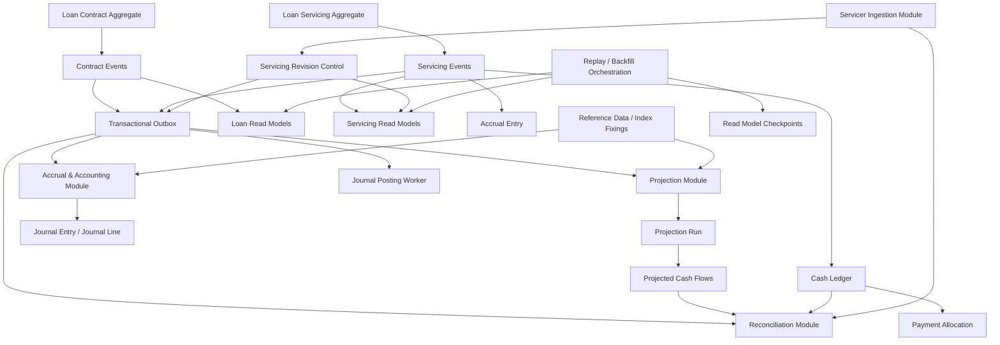

# UFL Direct Lending Target-State Package V2

**Owner:** Core Team
**Audience:** Product, architecture, domain, storage, and application contributors
**Last Updated:** 2026-03-26
**Status:** active
**Reviewed:** 2026-03-26

> **Naming standard:** All new F# types and DTOs in this package must follow the
> [Domain Naming Standard](../ai/claude/CLAUDE.domain-naming.md).
> Direct loans: definition record → `DirectLoanDef`; coupon rate → `CpnRate: decimal option`; callable flag → `IsCallable: bool`; maturity → `MaturityDt: DateOnly option`.

## Summary

This document captures the target-state V2 package for `UFL` direct lending inside Meridian's broader governance and fund-operations expansion.

It assumes:

- a modular monolith
- F# domain kernels with C# orchestration and API layers where appropriate
- PostgreSQL as the operational database
- Sharpino for write-side event-sourced aggregates
- versioned read models for projections and current-state views
- relational accounting and cash tables for operational correctness
- TimescaleDB only for true time-series workloads such as benchmark fixings, daily snapshots, and long-horizon analytics
- PostgreSQL partitioning for large date-driven operational tables
- a transactional outbox for reliable downstream processing
- a formal servicer-ingestion and revision-control layer that supports both position-level and transaction-detail servicer reporting

This is a specialized, implementation-ready vertical slice beneath the broader governance and fund-ops planning set documented elsewhere in Meridian. The broad roadmap stays authoritative for overall sequencing; this blueprint makes the direct-lending target state concrete.

## Repo Fit

### Verified Meridian constraints

- Meridian already prefers F# for rule-heavy, math-heavy, and state-heavy kernels.
- Existing planning documents already position governance, ledger, reconciliation, cash-flow, and reporting as core product tracks.
- PostgreSQL is already an approved operational-database direction in the active planning set.
- Existing F# ledger work under `src/Meridian.FSharp.Ledger/` and governance/read-model work under `src/Meridian.Strategies/` are the nearest active repo anchors.

### Proposed UFL-specific additions

- New direct-lending bounded-context projects under `src/Ufl.*` are proposed, not existing.
- Sharpino-backed aggregates would own contract and servicing write models.
- Existing governance planning remains the umbrella; `UFL` becomes the first deep lending implementation slice inside that umbrella.

### Suggested Meridian mapping if implemented in-place

If the team chooses not to introduce `src/Ufl.*` projects immediately, the closest current repo anchors are:

- F# domain kernels in `src/Meridian.FSharp/Domain/`
- accounting and reconciliation kernels in `src/Meridian.FSharp.Ledger/`
- orchestration and read services in `src/Meridian.Application/` and `src/Meridian.Strategies/`
- contracts in `src/Meridian.Contracts/`
- storage, migrations, and PostgreSQL integration in `src/Meridian.Storage/`
- HTTP and workstation endpoints in `src/Meridian.Ui.Shared/`
- governance UX in `src/Meridian.Wpf/`

## Scope

**In Scope:** Contract versioning, servicing state, accruals, cash, projection lineage, servicer ingestion, servicing revisions, reconciliation, journals, period locks, replay-safe rebuilds, and direct-lending API surface.

**Out of Scope:** Syndication, participations, impairment/ECL, collateral lifecycle, complex restructuring, full multi-currency, and non-direct-lending asset classes.

## Knowledge Graph



## 1. Architecture Blueprint

### 1.1 System shape

**Write side**

- Loan Contract aggregate
- Loan Servicing aggregate
- optional Portfolio or Batch aggregate later

**Read side**

- Current loan snapshot
- Outstanding balances
- Projection runs
- Projected cash flows
- Accrual balances
- Reconciliation state
- Accounting state
- Servicing revisions
- Servicer report batches and staged report views

**Processing**

- command handlers
- projection workers
- accrual worker
- reconciliation worker
- journal posting worker
- servicer import worker
- outbox dispatcher
- replay and backfill orchestration

### 1.2 Design principles

1. Contract facts are events.
2. Accounting facts are posted rows with event lineage.
3. Forecasts are immutable, versioned snapshots.
4. No destructive updates for financial meaning.
5. Every downstream artifact points back to source event(s).
6. Servicing revision is a first-class control field.
7. Event contracts are explicitly versioned.
8. Read models must be rebuildable in replay-safe mode.
9. Resolved payment intent is stored in the domain event when known.
10. Raw servicer data is preserved separately from canonical servicing state.

## 2. F# Aggregate and Domain Shapes

### 2.1 Shared kernel

```fsharp
namespace Ufl.Domain

open System

type LoanId = LoanId of Guid
type EventId = EventId of Guid
type ProjectionRunId = ProjectionRunId of Guid
type CashTxnId = CashTxnId of Guid
type AccrualEntryId = AccrualEntryId of Guid
type JournalEntryId = JournalEntryId of Guid
type ReconciliationRunId = ReconciliationRunId of Guid
type ServicerReportBatchId = ServicerReportBatchId of Guid
type ServicerReportLineId = ServicerReportLineId of Guid
type ServicingRevisionNo = ServicingRevisionNo of int64

type Currency =
    | USD | EUR | GBP | JPY | Other of string

type LoanStatus =
    | Draft
    | Approved
    | Active
    | Suspended
    | Matured
    | Closed
    | Defaulted

type DayCountBasis =
    | Act360
    | Act365F
    | Thirty360

type RateType =
    | Fixed of annualRate: decimal
    | Floating of indexName: string * spreadBps: decimal * floorRate: decimal option * capRate: decimal option

type PaymentFrequency =
    | Monthly
    | Quarterly
    | SemiAnnual
    | Annual
    | Bullet

type AmortizationType =
    | Bullet
    | InterestOnly
    | StraightLine
    | CustomSchedule

type FeeType =
    | Origination
    | Commitment
    | Exit
    | Prepayment
    | DefaultInterest
    | OtherFee of string

type Money =
    { Amount: decimal
      Currency: Currency }

type DateRange =
    { StartDate: DateOnly
      EndDate: DateOnly }
```

### 2.2 Loan Contract aggregate

This aggregate owns the contractual state.

```fsharp
type CovenantPayload = string

type DirectLendingTerms =
    { OriginationDate: DateOnly
      MaturityDate: DateOnly
      CommitmentAmount: decimal
      BaseCurrency: Currency
      RateType: RateType
      DayCountBasis: DayCountBasis
      PaymentFrequency: PaymentFrequency
      AmortizationType: AmortizationType
      CommitmentFeeRate: decimal option
      DefaultRateSpreadBps: decimal option
      PrepaymentAllowed: bool
      Covenants: CovenantPayload option }

type BorrowerInfo =
    { BorrowerId: Guid
      BorrowerName: string
      LegalEntityId: Guid option }

type LoanHeader =
    { LoanId: LoanId
      FacilityName: string
      Borrower: BorrowerInfo
      Status: LoanStatus
      EffectiveDate: DateOnly
      CurrentTermsVersion: int64 }

type TermsVersion =
    { VersionNo: int64
      TermsHash: string
      Terms: DirectLendingTerms
      SourceEventId: EventId
      RecordedAt: DateTimeOffset }

type ContractState =
    { Header: LoanHeader option
      TermsVersions: TermsVersion list
      ActivationDate: DateOnly option
      CloseDate: DateOnly option
      LastEventId: EventId option }
```

**Commands**

```fsharp
type ContractCommand =
    | CreateLoan of facilityName:string * borrower:BorrowerInfo * effectiveDate:DateOnly * terms:DirectLendingTerms
    | AmendTerms of newTerms:DirectLendingTerms * amendmentReason:string
    | ActivateLoan of activationDate:DateOnly
    | SuspendLoan of asOf:DateOnly * reason:string
    | MarkMatured of asOf:DateOnly
    | CloseLoan of asOf:DateOnly
    | MarkDefaulted of asOf:DateOnly * reason:string
```

**Events**

```fsharp
type ContractEvent =
    | LoanCreated of header:LoanHeader * termsVersion:TermsVersion
    | TermsAmended of termsVersion:TermsVersion * amendmentReason:string
    | LoanActivated of activationDate:DateOnly
    | LoanSuspended of asOf:DateOnly * reason:string
    | LoanMatured of asOf:DateOnly
    | LoanClosed of asOf:DateOnly
    | LoanDefaulted of asOf:DateOnly * reason:string
```

**Evolve**

```fsharp
module ContractAggregate =

    let initial : ContractState =
        { Header = None
          TermsVersions = []
          ActivationDate = None
          CloseDate = None
          LastEventId = None }

    let evolve (state: ContractState) (eventId: EventId) (event: ContractEvent) =
        match event with
        | LoanCreated (header, tv) ->
            { state with
                Header = Some header
                TermsVersions = [ tv ]
                LastEventId = Some eventId }

        | TermsAmended (tv, _) ->
            let updatedHeader =
                state.Header
                |> Option.map (fun h -> { h with CurrentTermsVersion = tv.VersionNo })

            { state with
                Header = updatedHeader
                TermsVersions = tv :: state.TermsVersions
                LastEventId = Some eventId }

        | LoanActivated d ->
            { state with
                ActivationDate = Some d
                Header = state.Header |> Option.map (fun h -> { h with Status = Active })
                LastEventId = Some eventId }

        | LoanSuspended (_, _) ->
            { state with
                Header = state.Header |> Option.map (fun h -> { h with Status = Suspended })
                LastEventId = Some eventId }

        | LoanMatured d ->
            { state with
                Header = state.Header |> Option.map (fun h -> { h with Status = Matured })
                CloseDate = Some d
                LastEventId = Some eventId }

        | LoanClosed d ->
            { state with
                Header = state.Header |> Option.map (fun h -> { h with Status = Closed })
                CloseDate = Some d
                LastEventId = Some eventId }

        | LoanDefaulted (_, _) ->
            { state with
                Header = state.Header |> Option.map (fun h -> { h with Status = Defaulted })
                LastEventId = Some eventId }
```

### 2.3 Loan Servicing aggregate

This aggregate owns the economic state used for accrual, servicing, and validation.

```fsharp
type OutstandingBalances =
    { PrincipalOutstanding: decimal
      InterestAccruedUnpaid: decimal
      CommitmentFeeAccruedUnpaid: decimal
      FeesAccruedUnpaid: decimal
      PenaltyAccruedUnpaid: decimal }

type DrawdownLot =
    { LotId: Guid
      DrawdownDate: DateOnly
      OriginalPrincipal: decimal
      RemainingPrincipal: decimal }

type RateReset =
    { EffectiveDate: DateOnly
      IndexName: string
      ObservedRate: decimal
      SpreadBps: decimal
      AllInRate: decimal
      SourceRef: string option }

type ServicingState =
    { LoanId: LoanId
      Status: LoanStatus
      CurrentCommitment: decimal
      TotalDrawn: decimal
      AvailableToDraw: decimal
      Balances: OutstandingBalances
      DrawdownLots: DrawdownLot list
      CurrentRateReset: RateReset option
      LastAccrualDate: DateOnly option
      LastPaymentDate: DateOnly option
      ServicingRevision: int64
      LastEventId: EventId option }
```

**Commands**

```fsharp
type PaymentBreakdown =
    { ToInterest: decimal
      ToCommitmentFee: decimal
      ToFees: decimal
      ToPenalty: decimal
      ToPrincipal: decimal }

type MixedPaymentResolution =
    { Breakdown: PaymentBreakdown
      ResolutionBasis: string
      RuleVersion: string option
      UnappliedAmount: decimal }

type ServicingCommand =
    | BookDrawdown of amount:decimal * tradeDate:DateOnly * settleDate:DateOnly * externalRef:string option
    | ApplyPrincipalPayment of amount:decimal * effectiveDate:DateOnly * externalRef:string option
    | ApplyMixedPayment of amount:decimal * effectiveDate:DateOnly * breakdown:PaymentBreakdown option * externalRef:string option
    | AssessFee of feeType:FeeType * amount:decimal * effectiveDate:DateOnly * note:string option
    | ApplyRateReset of effectiveDate:DateOnly * indexName:string * observedRate:decimal * spreadBps:decimal * sourceRef:string option
    | PostDailyAccrual of accrualDate:DateOnly
    | ReverseAccrual of accrualDate:DateOnly * reason:string
    | ApplyWriteOff of amount:decimal * effectiveDate:DateOnly * reason:string
```

**Events**

```fsharp
type ServicingEvent =
    | DrawdownBooked of lotId:Guid * amount:decimal * tradeDate:DateOnly * settleDate:DateOnly * externalRef:string option
    | PrincipalPaymentApplied of amount:decimal * effectiveDate:DateOnly * externalRef:string option
    | PaymentReceivedUnapplied of amount:decimal * effectiveDate:DateOnly * reason:string * externalRef:string option
    | MixedPaymentApplied of amount:decimal * effectiveDate:DateOnly * resolution:MixedPaymentResolution * externalRef:string option
    | FeeAssessed of feeType:FeeType * amount:decimal * effectiveDate:DateOnly * note:string option
    | RateResetApplied of rateReset:RateReset
    | DailyAccrualPosted of accrualDate:DateOnly * interestAmount:decimal * commitmentFeeAmount:decimal * penaltyAmount:decimal
    | AccrualReversed of accrualDate:DateOnly * interestAmount:decimal * commitmentFeeAmount:decimal * penaltyAmount:decimal * reason:string
    | WriteOffApplied of amount:decimal * effectiveDate:DateOnly * reason:string
```

This aggregate deliberately does not hold every historical projected flow or every accounting journal. It holds the balances, lots, and revision identity needed for business validation and event production. Snapshotting is appropriate for long-lived streams.

### 2.4 Servicer ingestion and revision control

This layer supports both consolidated position-level and transaction-detail servicer reporting while keeping raw external evidence separate from canonical servicing state.

```fsharp
type ServicerReportType =
    | ConsolidatedPosition
    | TransactionDetail
    | PositionAndTransactionDetail
    | CashOnly
    | AccrualOnly
    | AdjustmentFile
    | ManualCorrection

type ServicerSourceFormat =
    | CsvTape
    | ExcelWorkbook
    | ApiFeed
    | SftpFlatFile
    | ManualUpload

type ServicerBatchStatus =
    | Received
    | Parsed
    | Validated
    | Loaded
    | Rejected

type ServicingRevisionSourceType =
    | ServicerReport
    | InternalEvent
    | Backfill
    | ManualCorrection
```

### 2.5 Projection lineage model

Projection runs are immutable derived artifacts.

```fsharp
type ProjectionTrigger =
    | TriggeredByTermsAmendment of EventId
    | TriggeredByDrawdown of EventId
    | TriggeredByRateReset of EventId
    | TriggeredByManualRequest of EventId
    | TriggeredByBackfill of EventId
    | TriggeredByServicingRevision of LoanId * ServicingRevisionNo

type ProjectionLineage =
    { ProjectionRunId: ProjectionRunId
      LoanId: LoanId
      LoanTermsVersion: int64
      ServicingRevision: int64
      Trigger: ProjectionTrigger
      ProjectionAsOf: DateOnly
      MarketDataAsOf: DateOnly option
      TermsHash: string
      EngineVersion: string
      GeneratedAt: DateTimeOffset
      ServicerReportType: ServicerReportType option
      ServicerReportBatchId: ServicerReportBatchId option }
```

## 3. Event Catalog

Split the catalog into domain events and process events.

### 3.1 Domain events

**Contract stream**

- `LoanCreated`
- `TermsAmended`
- `LoanActivated`
- `LoanSuspended`
- `LoanMatured`
- `LoanClosed`
- `LoanDefaulted`

**Servicing stream**

- `DrawdownBooked`
- `PrincipalPaymentApplied`
- `PaymentReceivedUnapplied`
- `MixedPaymentApplied`
- `FeeAssessed`
- `RateResetApplied`
- `DailyAccrualPosted`
- `AccrualReversed`
- `WriteOffApplied`

### 3.2 Process events

- `ProjectionRequested`
- `ProjectionCompleted`
- `ProjectionFailed`
- `ReconciliationRequested`
- `ReconciliationCompleted`
- `ReconciliationFailed`
- `JournalPostingRequested`
- `JournalPosted`
- `JournalPostingFailed`
- `AccrualBatchRequested`
- `AccrualBatchCompleted`
- `ServicerReportBatchReceived`
- `ServicerReportBatchValidated`
- `ServicerReportBatchRejected`
- `ServicingRevisionCreated`
- `ServicingRevisionApplied`
- `ServicingRevisionFailed`

### 3.3 Event naming and versioning policy

Every stored event carries:

- `event_type` as a stable, domain-focused name such as `loan.drawdown-booked`
- `event_schema_version` as an integer
- versioned JSON payload contracts with explicit nullability and property-name stability

**Policy**

- use past-tense domain names
- avoid generic verbs like `updated` unless the business meaning is truly generic
- additive optional fields may remain within a version if consumers tolerate them
- semantic meaning changes require a version bump
- never silently reinterpret old payloads
- keep deserializers for historical active versions

### 3.4 Event metadata envelope

```fsharp
type EventMetadata =
    { EventId: EventId
      AggregateId: Guid
      AggregateType: string
      AggregateVersion: int64
      CausationId: Guid option
      CorrelationId: Guid option
      CommandId: Guid option
      UserId: string option
      SourceSystem: string option
      RecordedAt: DateTimeOffset
      EffectiveDate: DateOnly option
      ReplayFlag: bool }
```

## 4. SQL DDL Design

The target-state schema keeps:

- event store append-only
- terms history explicit
- servicing revision explicit
- raw servicer data staged separately from canonical state
- accounting tables relational and constrained
- projections immutable
- reconciliations explainable
- large operational tables partitionable

### 4.1 Core table groups

The detailed table set in this target state is:

1. `es_stream`, `es_event`, `es_snapshot`
2. `loan`, `loan_terms_version`
3. `loan_servicing_state`
4. `servicer_report_batch`, `servicer_position_report_line`, `servicer_transaction_report_line`
5. `servicing_revision`, `servicing_revision_source`, `servicing_revision_processing`
6. `drawdown_lot`
7. `cash_transaction`
8. `accrual_entry`
9. `fee_balance`
10. `projection_run`, `projected_cash_flow`
11. `payment_allocation`
12. `reconciliation_run`, `reconciliation_result`, `reconciliation_exception`
13. `journal_entry`, `journal_line`
14. `accounting_period_lock`
15. `read_model_checkpoint`
16. `outbox_message`
17. `index_fixing`, `loan_daily_snapshot`

### 4.2 Implementation notes

- `cash_transaction`, `journal_line`, and `reconciliation_result` should move to PostgreSQL partitioning when volume justifies it.
- `index_fixing` and `loan_daily_snapshot` are the primary TimescaleDB candidates.
- `accrual_key` must be deterministic and serve as the idempotency anchor.
- External-reference uniqueness should be partial and scoped so imports remain replay-safe.

### 4.3 DDL appendix

The V2 DDL in the package should be treated as the target-state table specification for implementation. When the first migration set is created, preserve naming stability unless a materially better repo-wide naming convention is adopted up front.

## 5. Service Boundaries

Start as a modular monolith with hard module boundaries and one deployment unit.

### 5.1 Loan Contract module

**Owns**

- `loan`
- `loan_terms_version`
- contract stream
- lifecycle and amendment validation

### 5.2 Loan Servicing module

**Owns**

- servicing stream
- `loan_servicing_state`
- `drawdown_lot`
- servicing validations
- canonical `servicing_revision` on servicing state

### 5.3 Servicer Ingestion module

**Owns**

- staged servicer batch and line tables
- servicing revision creation and source linkage
- validation and normalization of inbound data

### 5.4 Projection module

**Owns**

- `projection_run`
- `projected_cash_flow`
- immutable projection lineage

### 5.5 Cash Ledger module

**Owns**

- `cash_transaction`
- `payment_allocation`

### 5.6 Accrual and Accounting module

**Owns**

- `accrual_entry`
- `journal_entry`
- `journal_line`
- `accounting_period_lock`

### 5.7 Reconciliation module

**Owns**

- `reconciliation_run`
- `reconciliation_result`
- `reconciliation_exception`

### 5.8 Reference Data module

**Owns**

- `index_fixing`
- later spread curves and FX if needed

### 5.9 Platform module

**Owns**

- outbox dispatcher
- worker scheduling
- observability
- replay and backfill orchestration
- `read_model_checkpoint`

## 6. Core Workflows

### 6.1 Create and activate loan

1. `CreateLoan`
2. write `LoanCreated`
3. update `loan` and `loan_terms_version`
4. outbox `ProjectionRequested`
5. optionally `ActivateLoan`
6. write `LoanActivated`
7. outbox `ProjectionRequested`

### 6.2 Drawdown

1. `BookDrawdown`
2. validate available commitment
3. write `DrawdownBooked`
4. update `loan_servicing_state` and `drawdown_lot`
5. increment canonical servicing revision
6. insert `cash_transaction`
7. outbox downstream processing requests

### 6.3 Daily accrual

1. scheduler sends `PostDailyAccrual`
2. servicing aggregate computes accrual inputs
3. write `DailyAccrualPosted`
4. insert `accrual_entry`
5. generate journal entry
6. update balances

### 6.4 Payment

1. import or API call records cash
2. `ApplyMixedPayment`
3. servicing emits `MixedPaymentApplied` with resolved business breakdown when known
4. cash ledger allocates via waterfall
5. accounting posts cash and accrual reversals
6. reconciliation updates expected versus actual

### 6.5 Terms amendment or servicing revision

1. contract event or accepted servicing revision occurs
2. outbox `ProjectionRequested`
3. projection engine generates a new immutable run
4. prior latest run is marked superseded where applicable

### 6.6 Servicer position import

1. receive batch
2. store `servicer_report_batch`
3. load position lines
4. validate and compare to canonical balances
5. if accepted, create servicing revision, link sources, update servicing state, and trigger downstream processing

### 6.7 Servicer transaction import

1. receive batch
2. store `servicer_report_batch`
3. load transaction lines
4. normalize rows into servicing and cash actions
5. update canonical servicing and cash state
6. create servicing revision
7. publish downstream requests

### 6.8 Read-model rebuild

1. enter replay-safe mode
2. suppress downstream posting and external side effects
3. rebuild pure read models from events
4. preserve immutable historical projections unless explicit recompute mode is invoked
5. write progress to `read_model_checkpoint`
6. cut over shadow tables where used

## 7. Phase Sequence

### 7.1 Phase 1 goal

Support fixed-rate and simple floating-rate term loans with:

- terms versioning
- drawdowns
- principal repayments
- daily accruals
- fees
- immutable projections
- basic reconciliation
- journal generation
- servicer position and transaction-detail ingestion
- period controls
- replay-safe rebuild controls

### 7.2 Phase 1 implementation order

#### Phase 1A: foundation

- event store tables
- snapshot table
- outbox table
- `read_model_checkpoint`
- base app skeleton
- command pipeline
- event envelope and serialization
- event naming and versioning policy
- idempotency middleware
- replay-safe rebuild suppression rules

#### Phase 1B: contract module

- Loan Contract aggregate
- `loan`
- `loan_terms_version`
- create, amend, activate, close commands and events
- terms hashing
- contract query endpoints

#### Phase 1C: servicing module

- Loan Servicing aggregate
- `loan_servicing_state`
- `drawdown_lot`
- servicing revision increment rules
- drawdown, payment, fee, and rate-reset logic

#### Phase 1D: accrual and cash

- `cash_transaction`
- `accrual_entry`
- deterministic accrual keys
- daily accrual scheduler
- mixed-payment waterfall engine
- `payment_allocation`

#### Phase 1D.5: servicer ingestion foundation

- servicer batch and staging tables
- `servicing_revision`
- `servicing_revision_source`
- batch validation and normalization layer

#### Phase 1E: projection engine

- `projection_run`
- `projected_cash_flow`
- fixed-rate and simple floating-rate schedule generator
- lineage stamping
- supersede logic
- latest projection query

#### Phase 1F: accounting

- `journal_entry`
- `journal_line`
- `accounting_period_lock`
- event-to-journal mapping
- accounting-date controls

#### Phase 1G: reconciliation

- reconciliation run, result, and exception tables
- rule-based matcher by loan, flow type, amount tolerance, date tolerance, position variance, and activity variance

#### Phase 1H: hardening

- partitioning strategy
- Timescale hypertables
- monitoring and alerting
- backfill and replay utility
- shadow rebuild and cutover tooling

### 7.3 Phase 1 exit criteria

Phase 1 is done when the platform can:

1. create a loan
2. amend terms and preserve history
3. fund a drawdown
4. produce a projection run with lineage and servicing revision identity
5. post daily accruals
6. record a mixed payment
7. allocate that payment across interest, fees, and principal
8. produce journals with period-lock enforcement
9. reconcile expected versus actual
10. import both consolidated-position and transaction-detail servicer files
11. create servicing revisions from accepted servicer data
12. replay event streams and rebuild read models without changing financial results

### 7.4 Phase 2 goals

Phase 2 extends the platform for production-grade servicing complexity:

- partial paydowns across multiple lots
- late payment and default logic
- accrual reversals and non-accrual status
- back-dated corrections
- hardening of accounting period controls
- richer floating-rate conventions
- performance scale-out

## 8. Target API Surface

### 8.1 Contract

- `POST /api/loans`
- `PUT /api/loans/{loanId}/terms`
- `POST /api/loans/{loanId}/activate`
- `POST /api/loans/{loanId}/suspend`
- `POST /api/loans/{loanId}/close`
- `GET /api/loans/{loanId}`
- `GET /api/loans/{loanId}/history`
- `GET /api/loans/{loanId}/terms-versions`

### 8.2 Servicing

- `POST /api/loans/{loanId}/drawdowns`
- `POST /api/loans/{loanId}/payments`
- `POST /api/loans/{loanId}/fees`
- `POST /api/loans/{loanId}/rate-resets`
- `POST /api/loans/{loanId}/accruals/daily`
- `GET /api/loans/{loanId}/servicing-state`
- `GET /api/loans/{loanId}/servicing-revisions`
- `GET /api/loans/{loanId}/servicing-revisions/{revisionNo}`
- `GET /api/loans/{loanId}/servicing-revisions/{revisionNo}/sources`

### 8.3 Servicer ingestion

- `POST /api/servicer-reports`
- `GET /api/servicer-reports/{batchId}`
- `GET /api/servicer-reports/{batchId}/position-lines`
- `GET /api/servicer-reports/{batchId}/transaction-lines`

### 8.4 Projection

- `POST /api/loans/{loanId}/projections`
- `GET /api/loans/{loanId}/projections`
- `GET /api/projections/{projectionRunId}`
- `GET /api/projections/{projectionRunId}/flows`

### 8.5 Accounting

- `GET /api/loans/{loanId}/accruals`
- `GET /api/loans/{loanId}/journals`
- `POST /api/journals/{journalEntryId}/post`

### 8.6 Reconciliation

- `POST /api/loans/{loanId}/reconcile`
- `GET /api/loans/{loanId}/reconciliation-runs`
- `GET /api/reconciliation/{runId}/results`
- `GET /api/reconciliation/exceptions`
- `POST /api/reconciliation/exceptions/{exceptionId}/resolve`

## 9. Proposed Repo Structure

These paths are proposed additions for the direct-lending bounded context.

```text
src/
  Ufl.Domain/
    Shared.fs
    Contract.fs
    Servicing.fs
    ServicerIngestion.fs
    ServicingRevision.fs
    Events.fs
    Commands.fs
    Money.fs

  Ufl.Application/
    CommandHandlers/
    QueryHandlers/
    ProjectionOrchestrator/
    AccrualService/
    ReconciliationService/
    JournalService/
    ServicerReportIngestion/
    ServicingRevisionOrchestrator/

  Ufl.Infrastructure/
    EventStore/
    SharpinoAdapters/
    Sql/
    Outbox/
    TimeSeries/
    Serialization/
    ServicerImport/
    RevisionControl/

  Ufl.Api/
    HttpHandlers/
    Contracts/
    Auth/
    Validation/

  Ufl.Workers/
    OutboxDispatcher/
    ProjectionWorker/
    AccrualWorker/
    ReconciliationWorker/
    JournalWorker/
    ServicerImportWorker/

tests/
  Ufl.Domain.Tests/
  Ufl.Application.Tests/
  Ufl.IntegrationTests/
```

## 10. Recommended First Ten Implementation Tickets

1. Create event store, snapshot, outbox, and rebuild-checkpoint schema.
2. Implement Loan Contract aggregate with create, amend, and activate.
3. Persist `loan` and `loan_terms_version` read models.
4. Implement Loan Servicing aggregate with drawdown and servicing-revision increment.
5. Persist `loan_servicing_state` and `drawdown_lot`.
6. Implement daily accrual posting and `accrual_entry`.
7. Implement servicer report batch plus position and transaction staging tables.
8. Implement servicing revision creation and source linking.
9. Implement projection run and projected-flow persistence with servicing-revision uniqueness.
10. Implement cash payment, allocation, and basic reconciliation.

## 11. Final Target State

The target state is:

- Sharpino-backed event-sourced write models for contract and servicing facts
- immutable terms versions
- canonical servicing revision control
- raw servicer ingestion for both consolidated-position and transaction-detail reporting
- immutable projection runs
- relational actuals and accounting
- resolved mixed-payment business meaning stored in events when known
- explicit event versioning policy
- read-model rebuild strategy from day one
- outbox-driven asynchronous processing
- Timescale only for genuine time-series workloads
- partitioned large transactional tables when volume demands it

That combination is the cleanest robust implementation for a direct-lending ledger that needs auditability, replayability, operational practicality, and real-world servicer integration.

## Related Documents

- [Governance and Fund Operations Blueprint](governance-fund-ops-blueprint.md)
- [Fund Management Product Vision and Capability Matrix](fund-management-product-vision-and-capability-matrix.md)
- [Fund Management Module Implementation Backlog](fund-management-module-implementation-backlog.md)
- [Fund Management PR-Sequenced Roadmap](fund-management-pr-sequenced-roadmap.md)
- [UFL Direct Lending Implementation Roadmap](ufl-direct-lending-implementation-roadmap.md)
- [Project Roadmap](../status/ROADMAP.md)
- [Meridian Database Blueprint](meridian-database-blueprint.md)
