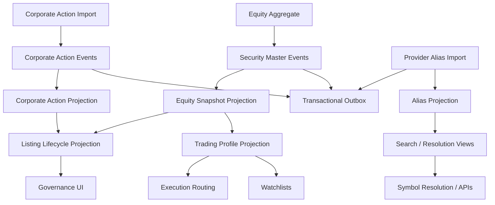

# UFL Equity Target-State Package V2

**Owner:** Core Team  
**Audience:** Product, architecture, domain, storage, and application contributors  
**Last Updated:** 2026-03-22  
**Status:** active  
**Reviewed:** 2026-03-22

## Summary

This document captures the target-state V2 package for `UFL` equity assets inside Meridian's broader security-master, market-data, execution, and governance expansion.

It assumes:

- a modular monolith
- F# domain kernels with C# orchestration and API layers where appropriate
- PostgreSQL as the operational database
- versioned read models for reference, lifecycle, and corporate-action projections
- transactional outbox delivery for downstream rebuilds and notifications
- replay-safe rebuilds for all derived equity state
- provider alias handling that maps many vendor symbols to one canonical security identity

This package is the implementation-ready equity slice beneath the broader governance and fund-ops planning set. It is intentionally more detailed than a product brief and is meant to let another engineer implement the first end-to-end slice without inventing core architecture.

## Repo Fit

### Verified Meridian constraints

- Meridian already models `SecurityKind.Equity` and `EquityTerms` in `src/Meridian.FSharp/Domain/SecurityMaster.fs`.
- Security creation, amendment, and projection rebuilds already flow through `src/Meridian.Application/SecurityMaster/`.
- Subscriptions, watchlists, symbol-management, and execution handoff already provide the nearest runtime consumers for canonical equity identities.
- Existing provider and symbol-alias infrastructure means equity reference data must separate canonical identity from provider-specific ticker formats.

### Proposed UFL-specific additions

- A dedicated equity-reference service layer under `src/Meridian.Application/Equities/`.
- Projection tables for listing status, trading profile, and corporate-action lineage.
- Endpoint and workstation slices for security-reference lookup and lifecycle inspection.
- Optional provider-ingestion workers for equity metadata refresh and corporate-action import.

### Suggested Meridian mapping if implemented in-place

- F# domain kernels in `src/Meridian.FSharp/Domain/`
- application orchestration in `src/Meridian.Application/SecurityMaster/` and `src/Meridian.Application/Equities/`
- shared contracts in `src/Meridian.Contracts/SecurityMaster/` and `src/Meridian.Contracts/Equities/`
- projection storage in `src/Meridian.Storage/SecurityMaster/`
- UI endpoints in `src/Meridian.Ui.Shared/Endpoints/`
- governance and workstation UX in `src/Meridian.Wpf/`

## Scope

**In Scope:** canonical equity identity, identifier lineage, listing metadata, share-class metadata, exchange and venue profile, trading status, corporate-action lineage, alias management, replay-safe projection rebuilds, and an API surface for reference and lifecycle queries.

**Out of Scope:** equity options, borrow availability, securities lending, full fundamental-data warehousing, private placements, and strategy-specific analytics.

## Knowledge Graph



## 1. Architecture Blueprint

### 1.1 System shape

**Write side**

- canonical equity security aggregate via security master
- corporate-action event ingestion boundary
- provider-alias ingestion boundary

**Read side**

- current equity snapshot
- identifier and alias snapshot
- trading profile snapshot
- listing lifecycle snapshot
- corporate-action history snapshot

**Processing**

- security create/amend/deactivate handlers
- alias normalization worker
- corporate-action import worker
- projection rebuild worker
- outbox dispatcher

### 1.2 Design principles

1. One legal/canonical equity identity can have many provider aliases.
2. Corporate actions are immutable facts, not destructive edits.
3. Listing and trading state are projections over canonical identity plus event history.
4. Search and resolution services must prefer canonical security IDs over raw ticker strings.
5. Every lifecycle change must be explainable from source events and provider provenance.
6. Projection rebuilds must be deterministic across splits, symbol changes, and delistings.

## 2. F# Aggregate and Domain Shapes

### 2.1 Shared kernel

```fsharp
type EquityId = SecurityId
type CorporateActionId = CorporateActionId of Guid

type ListingStatus =
    | Draft
    | Listed
    | Suspended
    | Delisted

type CorporateActionType =
    | CashDividend
    | StockDividend
    | Split
    | ReverseSplit
    | SymbolChange
    | NameChange
```

### 2.2 Equity aggregate

The canonical aggregate remains the security-master record and keeps the current modeled terms:

```fsharp
type EquityTerms = {
    ShareClass: string option
}
```

Proposed additive projection shapes:

```fsharp
type EquityTradingProfile = {
    SecurityId: SecurityId
    PrimaryExchange: string option
    TradingCurrency: string
    LotSize: decimal option
    TickSize: decimal option
    IsTradable: bool
    ListingStatus: ListingStatus
}

type CorporateActionRecord = {
    CorporateActionId: CorporateActionId
    SecurityId: SecurityId
    ActionType: CorporateActionType
    EffectiveDate: DateOnly
    SourceEventId: Guid
}
```

### 2.3 Projection lineage model

- `SecurityCreated` and `TermsAmended` rebuild the base equity snapshot.
- corporate-action events rebuild lifecycle and adjustment projections
- alias imports rebuild symbol-resolution views
- deactivation rebuilds lifecycle and trading-profile projections without deleting history

## 3. Event Catalog

### 3.1 Domain events

- `SecurityCreated`
- `TermsAmended`
- `SecurityDeactivated`
- `EquityCorporateActionCaptured`
- `EquityAliasMapped`
- `EquityTradingProfileUpdated`

### 3.2 Process events

- `EquityCorporateActionImportCompleted`
- `EquityAliasRefreshCompleted`
- `EquityProjectionRebuildCompleted`

### 3.3 Event naming and versioning policy

- keep security-master event names aligned with existing aggregate naming
- add equity-specific events only for additive projection domains
- version payloads explicitly when corporate-action schemas evolve

## 4. SQL DDL Design

### 4.1 Core table groups

- `security_master_projection`
- `security_master_alias`
- `equity_trading_profile`
- `equity_listing_lifecycle`
- `equity_corporate_action`
- `equity_projection_checkpoint`

### 4.2 Implementation notes

- index by `(security_id, as_of)` for rebuild-safe time slicing
- index aliases by normalized symbol, provider, and exchange
- corporate actions should keep effective-date and event-order columns for deterministic replay

## 5. Service Boundaries

### 5.1 Equity Reference module

- owns canonical read APIs for equity terms, identifiers, and aliases

### 5.2 Corporate Action module

- owns import, storage, and replay of splits, dividends, and symbol/name changes

### 5.3 Trading Profile module

- owns trading-status, venue, and orderability projections

### 5.4 Platform module

- owns outbox dispatch, projection rebuild orchestration, and health/reporting hooks

## 6. Core Workflows

### 6.1 Create equity

1. create canonical security via security master
2. persist `SecurityCreated`
3. build equity snapshot and alias baseline
4. expose new identity through search and reference APIs

### 6.2 Amend terms

1. amend common terms or share class
2. persist `TermsAmended`
3. rebuild current snapshot
4. publish outbox event for downstream consumers

### 6.3 Capture corporate action

1. import provider payload
2. normalize into canonical action type
3. persist immutable action record
4. rebuild lifecycle and adjustment views

### 6.4 Resolve provider alias

1. ingest provider symbol metadata
2. normalize alias keys
3. attach alias to canonical security
4. rebuild search and resolution projections

### 6.5 Read-model rebuild

1. replay canonical security events
2. replay corporate-action events
3. replay alias imports
4. checkpoint rebuilt projections

## 7. Phase Sequence

### 7.1 Phase 1 goal

Deliver canonical equity identity, alias resolution, trading profile projection, and reference endpoints.

### 7.2 Phase 1 implementation order

1. stabilize equity-specific contracts and DTOs
2. add projection tables and storage interfaces
3. implement reference query service
4. implement alias projection service
5. expose read endpoints
6. add rebuild coverage and deterministic tests

### 7.3 Phase 1 exit criteria

- equities can be created and amended through security master
- aliases resolve deterministically to one canonical security
- trading profile and lifecycle data can be queried without provider-native payloads

### 7.4 Phase 2 goals

- corporate-action ingestion
- governance UI surfaces
- richer delisting and orderability controls

## 8. Target API Surface

### 8.1 Reference

- `GET /api/security-master/equities/{securityId}`
- `GET /api/security-master/equities/search`

### 8.2 Trading profile

- `GET /api/security-master/equities/{securityId}/trading-profile`

### 8.3 Corporate actions

- `GET /api/security-master/equities/{securityId}/corporate-actions`
- `POST /api/security-master/equities/corporate-actions/import`

## 9. Proposed Repo Structure

```text
src/
  Meridian.Application/
    Equities/
      IEquityReferenceService.cs
      EquityReferenceService.cs
      ICorporateActionService.cs
      CorporateActionService.cs
  Meridian.Contracts/
    Equities/
      EquityDtos.cs
      CorporateActionDtos.cs
  Meridian.Storage/
    SecurityMaster/
      EquityProjectionStore.cs
  Meridian.Ui.Shared/
    Endpoints/
      EquityReferenceEndpoints.cs
tests/
  Meridian.Tests/
    SecurityMaster/
    Equities/
```

## 10. Recommended First Ten Implementation Tickets

1. Add equity DTOs and query contracts.
2. Add equity trading-profile projection storage.
3. Add alias-resolution projection and rebuild path.
4. Implement `IEquityReferenceService`.
5. Expose equity reference endpoints.
6. Add deterministic alias-resolution tests.
7. Add lifecycle projection model for listed/suspended/delisted states.
8. Implement corporate-action import record storage.
9. Add rebuild orchestration for corporate actions.
10. Add workstation governance views for equity lifecycle inspection.

## 11. Final Target State

Meridian treats an equity as a canonical security identity with explainable aliases, lifecycle state, and corporate-action lineage. Watchlists, execution, governance, and search all consume the same rebuilt projections instead of inventing parallel symbol semantics.

## Related Documents

- [UFL Supported Asset Packages](ufl-supported-assets-index.md)
- [UFL Direct Lending Target-State Package V2](ufl-direct-lending-target-state-v2.md)
- [Governance and Fund Operations Blueprint](governance-fund-ops-blueprint.md)
