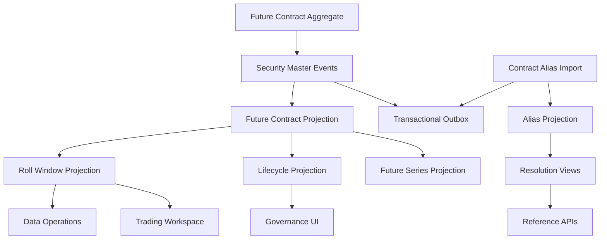

# UFL Future Target-State Package V2

**Owner:** Core Team  
**Audience:** Product, architecture, domain, storage, and application contributors  
**Last Updated:** 2026-03-26  
**Status:** active  
**Reviewed:** 2026-03-26

> **Naming standard:** All new F# types and DTOs in this package must follow the
> [Domain Naming Standard](../ai/claude/CLAUDE.domain-naming.md).
> For futures: definition record → `FutDef`; expiry field → `ExpiryDt: DateOnly`;
> notional field → `NotionalAmt: decimal option`; settlement style → `SettleStyle = Physical | Cash`;
> delivery location field → `DeliveryCtry: string option`.

## Summary

This document captures the target-state V2 package for `UFL` future assets inside Meridian's broader security-master, derivatives, market-data, and execution expansion.

It assumes:

- a modular monolith
- canonical futures contracts stored in security master
- root-series and roll-window views modeled as projections rather than distinct identities
- provider symbology normalized to canonical contract IDs
- deterministic replay of listing, expiry, and roll metadata

This package turns the existing `FutureTerms` support into a concrete implementation plan for contract identity, series grouping, lifecycle state, and operational roll workflows.

## Repo Fit

### Verified Meridian constraints

- Meridian already models `SecurityKind.Future` and `FutureTerms` in `src/Meridian.FSharp/Domain/SecurityMaster.fs`.
- `SecurityMasterMapping` already maps the `"Future"` asset class into the F# domain.
- subscriptions, symbol-management, and StockSharp security-type mapping already provide nearby runtime consumers.
- current validation already enforces nonblank root symbol, nonblank contract month, and positive multiplier.

### Proposed UFL-specific additions

- futures-series and lifecycle projections
- roll-window and front-contract services
- alias-resolution storage for exchange and vendor contract codes
- reference endpoints for contract, series, and roll views

### Suggested Meridian mapping if implemented in-place

- F# domain support in `src/Meridian.FSharp/Domain/`
- application services in `src/Meridian.Application/Futures/`
- contracts in `src/Meridian.Contracts/Futures/`
- storage in `src/Meridian.Storage/SecurityMaster/`
- endpoints in `src/Meridian.Ui.Shared/Endpoints/`

## Scope

**In Scope:** canonical futures contract identity, root-series grouping, expiry metadata, roll windows, alias normalization, lifecycle tracking, replay-safe projections, and contract/series query APIs.

**Out of Scope:** futures options, delivery-notice processing, exchange margin schedules, and strategy-specific continuous-contract synthesis.

## Knowledge Graph



## 1. Architecture Blueprint

### 1.1 System shape

**Write side**

- canonical futures contract aggregate via security master
- alias import boundary
- roll-metadata update boundary

**Read side**

- current futures contract snapshot
- futures root-series snapshot
- futures lifecycle snapshot
- roll-window snapshot
- alias-resolution snapshot

**Processing**

- contract create/amend/deactivate handlers
- alias normalization worker
- lifecycle-state worker
- roll-window worker
- rebuild orchestration

### 1.2 Design principles

1. A specific futures contract month is a canonical security identity.
2. Root-series and front-contract views are projections over contracts, not replacement identities.
3. Continuous-symbol semantics must remain derived and explainable.
4. Roll state must use explicit dates, not informal symbol naming rules.
5. Provider aliases must normalize toward one contract identity across venues and vendors.

## 2. F# Aggregate and Domain Shapes

### 2.1 Shared kernel

```fsharp
type FutureContractId = SecurityId
type FutureSeriesId = FutureSeriesId of Guid

type FutureLifecycleState =
    | Listed
    | Active
    | FirstNoticeRisk
    | LastTradeRisk
    | Expired
```

### 2.2 Future contract aggregate

The canonical contract remains the current modeled terms:

```fsharp
type FutureTerms = {
    RootSymbol: string
    ContractMonth: string
    Expiry: DateOnly
    Multiplier: decimal
}
```

Proposed additive projection shapes:

```fsharp
type FutureSeriesProjection = {
    RootSymbol: string
    FrontContractSecurityId: SecurityId option
    NextContractSecurityId: SecurityId option
}

type FutureRollWindowProjection = {
    SecurityId: SecurityId
    Expiry: DateOnly
    FirstNoticeDate: DateOnly option
    LastTradeDate: DateOnly option
    PreferredRollStart: DateOnly option
}
```

### 2.3 Projection lineage model

- security-master events rebuild canonical contract state
- roll-metadata updates rebuild lifecycle and roll-window projections
- alias imports rebuild resolution and search views

## 3. Event Catalog

### 3.1 Domain events

- `SecurityCreated`
- `TermsAmended`
- `SecurityDeactivated`
- `FutureAliasMapped`
- `FutureRollWindowUpdated`
- `FutureLifecycleStateChanged`

### 3.2 Process events

- `FutureAliasImportCompleted`
- `FutureRollSweepCompleted`
- `FutureProjectionRebuildCompleted`

### 3.3 Event naming and versioning policy

- keep canonical contract-definition events aligned with security master
- version roll-window payloads independently as metadata grows
- include source provider and effective date in all roll metadata events

## 4. SQL DDL Design

### 4.1 Core table groups

- `security_master_projection`
- `future_contract_projection`
- `future_series_projection`
- `future_lifecycle_projection`
- `future_roll_window_projection`
- `future_alias_projection`

### 4.2 Implementation notes

- index by `(root_symbol, contract_month)` for canonical uniqueness
- lifecycle and roll tables should index expiry and preferred roll start
- alias tables should keep provider, venue, and normalized code columns

## 5. Service Boundaries

### 5.1 Futures Reference module

- owns canonical contract and root-series query APIs

### 5.2 Lifecycle module

- owns listed, active, risk-window, and expired state projections

### 5.3 Roll module

- owns front/next contract selection and roll-window materialization

### 5.4 Platform module

- owns alias imports, rebuild orchestration, and outbox dispatch

## 6. Core Workflows

### 6.1 Create future contract

1. create canonical contract via security master
2. persist `SecurityCreated`
3. rebuild contract projection
4. attach contract to root-series projection

### 6.2 Import contract aliases

1. ingest vendor or venue symbols
2. normalize alias keys
3. map aliases to canonical contract IDs
4. rebuild search and resolution projections

### 6.3 Publish roll window

1. ingest first-notice and last-trade metadata
2. calculate preferred roll interval
3. rebuild roll-window and lifecycle projections
4. publish outbox event for trading consumers

### 6.4 Expire contract

1. evaluate expiry and risk dates
2. transition lifecycle state
3. rebuild active and expired views

### 6.5 Read-model rebuild

1. replay security-master events
2. replay alias imports
3. replay roll-window metadata
4. checkpoint series and lifecycle projections

## 7. Phase Sequence

### 7.1 Phase 1 goal

Deliver canonical futures identity, root-series projections, alias resolution, and roll-window query APIs.

### 7.2 Phase 1 implementation order

1. add futures DTOs and query contracts
2. add contract, series, and roll-window projection tables
3. implement futures reference service
4. implement alias-resolution service
5. implement roll-window projection service
6. expose reference endpoints

### 7.3 Phase 1 exit criteria

- futures contracts resolve deterministically to canonical IDs
- root-series and front-contract views are queryable
- lifecycle and roll data can be rebuilt from event history

### 7.4 Phase 2 goals

- workstation roll tooling
- first-notice and delivery-risk controls
- richer continuous-contract analytics

## 8. Target API Surface

### 8.1 Reference

- `GET /api/security-master/futures/{securityId}`
- `GET /api/security-master/futures/search`

### 8.2 Series

- `GET /api/security-master/futures/series/{rootSymbol}`

### 8.3 Roll

- `GET /api/security-master/futures/{securityId}/roll-window`

## 9. Proposed Repo Structure

```text
src/
  Meridian.Application/
    Futures/
      IFuturesReferenceService.cs
      FuturesReferenceService.cs
      IFuturesRollService.cs
      FuturesRollService.cs
  Meridian.Contracts/
    Futures/
      FuturesReferenceDtos.cs
  Meridian.Storage/
    SecurityMaster/
      FuturesProjectionStore.cs
  Meridian.Ui.Shared/
    Endpoints/
      FuturesReferenceEndpoints.cs
tests/
  Meridian.Tests/
    Futures/
    SecurityMaster/
```

## 10. Recommended First Ten Implementation Tickets

1. Add futures DTOs and query contracts.
2. Add futures contract and series projection records.
3. Add roll-window projection storage.
4. Implement futures reference service.
5. Implement alias-resolution service.
6. Expose futures reference endpoints.
7. Add roll-window rebuild tests.
8. Add lifecycle-state sweep logic.
9. Add first-notice metadata support.
10. Add workstation roll inspection views.

## 11. Final Target State

Meridian treats a future as a canonical contract identity with stable alias resolution, explicit roll metadata, and deterministic series projections. Execution, subscriptions, and governance all consume the same rebuilt reference surface instead of inventing parallel contract semantics.

## Related Documents

- [UFL Supported Asset Packages](ufl-supported-assets-index.md)
- [UFL Direct Lending Target-State Package V2](ufl-direct-lending-target-state-v2.md)
- [Governance and Fund Operations Blueprint](governance-fund-ops-blueprint.md)
