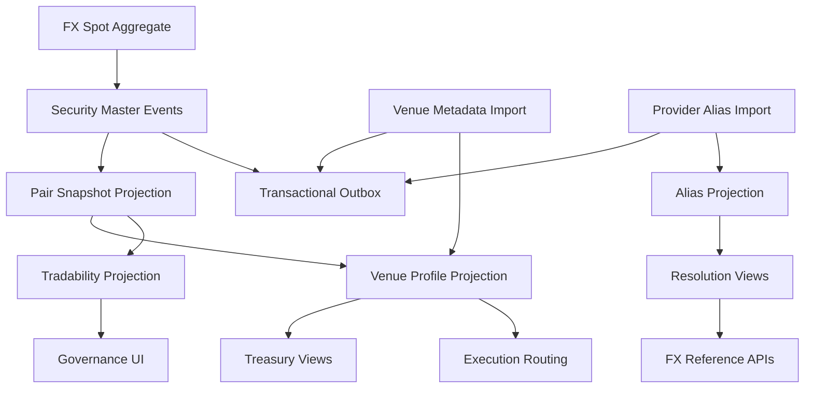

# UFL FX Spot Target-State Package V2

**Owner:** Core Team  
**Audience:** Product, architecture, domain, storage, and application contributors  
**Last Updated:** 2026-03-26  
**Status:** active  
**Reviewed:** 2026-03-26

> **Naming standard:** All new F# types and DTOs in this package must follow the
> [Domain Naming Standard](../ai/claude/CLAUDE.domain-naming.md).
> FX spot: definition record → `FxDef`; base currency → `BaseCcy: string`; quote currency → `QuoteCcy: string`; tenor → `Tenor: string option`.

## Summary

This document captures the target-state V2 package for `UFL` FX spot assets inside Meridian's broader security-master, treasury, market-data, and execution expansion.

It assumes:

- a modular monolith
- canonical currency-pair identities stored in security master
- provider and venue-specific pair codes normalized to one directional pair identity
- trading-profile and session metadata modeled as projections
- replay-safe rebuilds across aliases, lifecycle state, and venue metadata

This package turns the existing `FxSpotTerms` support into a concrete implementation plan for pair identity, alias resolution, trading profile, and treasury/execution APIs.

## Repo Fit

### Verified Meridian constraints

- Meridian already models `SecurityKind.FxSpot` and `FxSpotTerms` in `src/Meridian.FSharp/Domain/SecurityMaster.fs`.
- `SecurityMasterMapping` already maps the `"FxSpot"` asset class into the canonical domain.
- current validation already enforces nonblank base and quote currencies and prevents identical currency values.
- existing Lean/security-type mapping and market-data provider infrastructure already provide nearby FX consumers.

### Proposed UFL-specific additions

- FX alias-resolution and venue-profile projections
- pair lifecycle and tradability views
- treasury and execution query contracts for canonical pairs
- optional session and settlement metadata overlays

### Suggested Meridian mapping if implemented in-place

- F# domain support in `src/Meridian.FSharp/Domain/`
- application services in `src/Meridian.Application/Fx/`
- contracts in `src/Meridian.Contracts/Fx/`
- storage in `src/Meridian.Storage/SecurityMaster/`
- endpoints in `src/Meridian.Ui.Shared/Endpoints/`

## Scope

**In Scope:** canonical FX spot pair identity, alias normalization, venue and session metadata, tradability lifecycle, replay-safe rebuilds, and pair reference/query APIs.

**Out of Scope:** forwards, swaps, NDFs, CLS settlement, and cross-currency exposure analytics.

## Knowledge Graph



## 1. Architecture Blueprint

### 1.1 System shape

**Write side**

- canonical FX pair aggregate via security master
- alias import boundary
- venue and session metadata import boundary

**Read side**

- current pair snapshot
- alias-resolution snapshot
- venue-profile snapshot
- tradability lifecycle snapshot

**Processing**

- security create/amend/deactivate handlers
- alias normalization worker
- venue-profile worker
- tradability-state worker
- rebuild orchestration

### 1.2 Design principles

1. FX spot identity is directional, so `EUR/USD` is not the same as `USD/EUR`.
2. Canonical pair identity must outlive provider symbol formatting.
3. Venue and session metadata should enrich the pair, not redefine it.
4. Treasury, execution, and market-data layers should resolve through canonical pair IDs.
5. Replay must deterministically reproduce alias and tradability state.

## 2. F# Aggregate and Domain Shapes

### 2.1 Shared kernel

```fsharp
type FxPairId = SecurityId

type FxTradabilityState =
    | Active
    | Suspended
    | Inactive
```

### 2.2 FX spot aggregate

The canonical pair definition remains:

```fsharp
type FxSpotTerms = {
    BaseCurrency: string
    QuoteCurrency: string
}
```

Proposed additive projection shapes:

```fsharp
type FxVenueProfileProjection = {
    SecurityId: SecurityId
    Venue: string option
    SessionTemplate: string option
    IsTradable: bool
}

type FxAliasProjection = {
    SecurityId: SecurityId
    Provider: string
    Alias: string
}
```

### 2.3 Projection lineage model

- security-master events rebuild the canonical pair definition
- venue imports rebuild tradability and profile projections
- alias imports rebuild search and provider resolution views

## 3. Event Catalog

### 3.1 Domain events

- `SecurityCreated`
- `TermsAmended`
- `SecurityDeactivated`
- `FxAliasMapped`
- `FxVenueProfileUpdated`
- `FxTradabilityStateChanged`

### 3.2 Process events

- `FxAliasImportCompleted`
- `FxVenueRefreshCompleted`
- `FxProjectionRebuildCompleted`

### 3.3 Event naming and versioning policy

- align canonical pair-definition events with security master
- version venue-profile payloads independently from pair definition payloads
- include source provider and effective timestamp in alias and venue updates

## 4. SQL DDL Design

### 4.1 Core table groups

- `security_master_projection`
- `fx_pair_projection`
- `fx_alias_projection`
- `fx_venue_profile_projection`
- `fx_tradability_projection`
- `fx_projection_checkpoint`

### 4.2 Implementation notes

- index pair identity by `(base_currency, quote_currency)`
- alias projection should index provider plus normalized alias
- venue profile should index tradability and venue for routing queries

## 5. Service Boundaries

### 5.1 FX Reference module

- owns canonical pair lookup, alias resolution, and current term queries

### 5.2 Venue Profile module

- owns venue, session, and tradability projections

### 5.3 Treasury / Execution integration module

- owns query surfaces that expose canonical pairs to routing and treasury consumers

### 5.4 Platform module

- owns imports, rebuild orchestration, and outbox dispatch

## 6. Core Workflows

### 6.1 Create canonical pair

1. create pair in security master
2. persist `SecurityCreated`
3. rebuild pair projection
4. expose canonical identity through reference APIs

### 6.2 Import provider alias

1. ingest provider-native pair code
2. normalize toward directional pair identity
3. persist alias mapping
4. rebuild resolution projection

### 6.3 Refresh venue profile

1. ingest venue or session metadata
2. update tradability and session overlays
3. rebuild routing views

### 6.4 Evaluate tradability lifecycle

1. process suspensions or deactivations
2. rebuild tradability projection
3. publish outbox event for downstream consumers

### 6.5 Read-model rebuild

1. replay security-master events
2. replay alias imports
3. replay venue updates
4. checkpoint rebuilt projections

## 7. Phase Sequence

### 7.1 Phase 1 goal

Deliver canonical pair identity, alias resolution, venue-profile projections, and FX reference APIs.

### 7.2 Phase 1 implementation order

1. add FX DTOs and query contracts
2. add alias and venue-profile projection tables
3. implement FX reference service
4. implement alias-resolution service
5. expose FX reference endpoints
6. add deterministic alias and rebuild tests

### 7.3 Phase 1 exit criteria

- FX pairs resolve to canonical directional identities
- alias and venue-profile views rebuild deterministically
- treasury and execution consumers can query canonical pairs without provider-native symbols

### 7.4 Phase 2 goals

- richer session metadata
- settlement and cutoff overlays
- governance UI for tradability inspection

## 8. Target API Surface

### 8.1 Reference

- `GET /api/security-master/fx/{securityId}`
- `GET /api/security-master/fx/search`

### 8.2 Venue profile

- `GET /api/security-master/fx/{securityId}/venue-profile`

### 8.3 Alias resolution

- `GET /api/security-master/fx/resolve`

## 9. Proposed Repo Structure

```text
src/
  Meridian.Application/
    Fx/
      IFxReferenceService.cs
      FxReferenceService.cs
      IFxAliasResolutionService.cs
      FxAliasResolutionService.cs
  Meridian.Contracts/
    Fx/
      FxReferenceDtos.cs
  Meridian.Storage/
    SecurityMaster/
      FxProjectionStore.cs
  Meridian.Ui.Shared/
    Endpoints/
      FxReferenceEndpoints.cs
tests/
  Meridian.Tests/
    Fx/
    SecurityMaster/
```

## 10. Recommended First Ten Implementation Tickets

1. Add FX DTOs and query contracts.
2. Add alias and venue-profile projection records.
3. Implement FX reference service.
4. Implement alias-resolution service.
5. Expose FX reference endpoints.
6. Add directional-pair normalization tests.
7. Add venue-profile projection service.
8. Add tradability-state projection support.
9. Add rebuild orchestration coverage.
10. Add treasury and execution query integration tests.

## 11. Final Target State

Meridian treats FX spot as a canonical directional pair identity with stable alias resolution, tradability state, and venue metadata. Treasury, execution, and market-data workflows all resolve through the same rebuilt reference surface.

## Related Documents

- [UFL Supported Asset Packages](ufl-supported-assets-index.md)
- [UFL Direct Lending Target-State Package V2](ufl-direct-lending-target-state-v2.md)
- [Governance and Fund Operations Blueprint](governance-fund-ops-blueprint.md)
