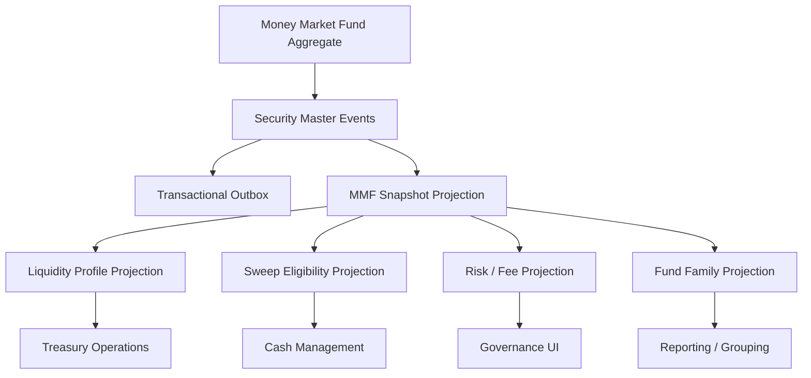

# UFL Money Market Fund Target-State Package V2

**Owner:** Core Team  
**Audience:** Product, architecture, domain, storage, and application contributors  
**Last Updated:** 2026-03-22  
**Status:** active  
**Reviewed:** 2026-03-22

## Summary

This document captures the target-state V2 package for `UFL` money-market-fund assets inside Meridian's broader treasury, liquidity, and governance expansion.

It assumes:

- a modular monolith
- canonical MMF identities stored in security master
- liquidity, sweep-eligibility, and operational views modeled as projections
- replay-safe rebuilds across fund-family, WAM, and fee-eligibility state
- downstream treasury and governance services querying canonical projections

This package turns the existing `MoneyMarketFundTerms` support into an implementation-ready plan for liquidity reference data, sweep integration, operational state, and APIs.

## Repo Fit

### Verified Meridian constraints

- Meridian already models `SecurityKind.MoneyMarketFund` and `MoneyMarketFundTerms` in `src/Meridian.FSharp/Domain/SecurityMaster.fs`.
- `SecurityMasterMapping` already maps the `"MoneyMarketFund"` asset class.
- security-master validation already enforces nonnegative weighted-average maturity when present.
- `SecurityMasterAssetClassSupportTests` already verifies base create support for MMFs.

### Proposed UFL-specific additions

- liquidity and sweep-eligibility projections
- fund-family and operational cutoff views
- fee-eligibility and risk-state projections
- MMF-specific query contracts and endpoints

### Suggested Meridian mapping if implemented in-place

- F# domain support in `src/Meridian.FSharp/Domain/`
- application services in `src/Meridian.Application/Treasury/`
- contracts in `src/Meridian.Contracts/Treasury/`
- storage in `src/Meridian.Storage/SecurityMaster/`
- endpoints in `src/Meridian.Ui.Shared/Endpoints/`

## Scope

**In Scope:** canonical MMF identity, fund-family lineage, sweep eligibility, WAM and fee-eligibility metadata, liquidity state, replay-safe rebuilds, and treasury/reference APIs.

**Out of Scope:** transfer-agent integrations, intraday NAV engines, full fund-accounting workflows, and generalized cash-allocation optimization.

## Knowledge Graph



## 1. Architecture Blueprint

### 1.1 System shape

**Write side**

- canonical MMF aggregate via security master
- liquidity and cutoff enrichment boundary
- sweep and fee projection boundary

**Read side**

- current MMF snapshot
- liquidity profile snapshot
- sweep-eligibility snapshot
- risk and fee snapshot
- fund-family grouping snapshot

**Processing**

- security create/amend/deactivate handlers
- liquidity-state worker
- sweep projection worker
- family normalization worker
- rebuild orchestration

### 1.2 Design principles

1. Canonical MMF identity is separate from brokerage programs that may route into it.
2. Sweep eligibility and fee rules should be projected and versioned, not hard-coded into consumers.
3. Liquidity and WAM metadata are governed reference facts with provenance.
4. Fund-family grouping should be rebuilt deterministically from canonical state.
5. Treasury consumers should query one canonical MMF surface rather than multiple provider-specific payloads.

## 2. F# Aggregate and Domain Shapes

### 2.1 Shared kernel

```fsharp
type MoneyMarketFundId = SecurityId

type LiquidityState =
    | Liquid
    | Restricted
    | Suspended
    | Inactive
```

### 2.2 Money-market-fund aggregate

The canonical fund definition remains:

```fsharp
type MoneyMarketFundTerms = {
    FundFamily: string option
    SweepEligible: bool
    WeightedAverageMaturityDays: int option
    LiquidityFeeEligible: bool
}
```

Proposed additive projection shapes:

```fsharp
type MoneyMarketFundLiquidityProjection = {
    SecurityId: SecurityId
    State: LiquidityState
    WeightedAverageMaturityDays: int option
}

type MoneyMarketFundSweepProjection = {
    SecurityId: SecurityId
    SweepEligible: bool
    LiquidityFeeEligible: bool
    FundFamily: string option
}
```

### 2.3 Projection lineage model

- security-master events rebuild canonical MMF terms
- liquidity evaluation rebuilds liquidity and fee projections
- family normalization rebuilds fund-grouping and reporting views

## 3. Event Catalog

### 3.1 Domain events

- `SecurityCreated`
- `TermsAmended`
- `SecurityDeactivated`
- `MmfLiquidityStateChanged`
- `MmfSweepEligibilityProjected`
- `MmfFundFamilyLinked`

### 3.2 Process events

- `MmfLiquidityRefreshCompleted`
- `MmfProjectionRebuildCompleted`
- `MmfFundFamilyRefreshCompleted`

### 3.3 Event naming and versioning policy

- align base fund-definition events with security master
- version liquidity and sweep payloads independently from definition payloads
- include source system and effective date on all operational projections

## 4. SQL DDL Design

### 4.1 Core table groups

- `security_master_projection`
- `money_market_fund_projection`
- `money_market_fund_liquidity_projection`
- `money_market_fund_sweep_projection`
- `money_market_fund_family_projection`
- `money_market_fund_projection_checkpoint`

### 4.2 Implementation notes

- liquidity projections should index current state and WAM buckets
- sweep projections should index sweep and fee flags for operational queries
- family projections should index normalized family name

## 5. Service Boundaries

### 5.1 MMF Reference module

- owns canonical MMF reference queries

### 5.2 Liquidity module

- owns liquidity-state and WAM-based views

### 5.3 Sweep Integration module

- owns sweep-eligibility and fee-related operational views

### 5.4 Platform module

- owns rebuild orchestration and outbox dispatch

## 6. Core Workflows

### 6.1 Create money market fund

1. create canonical MMF in security master
2. persist `SecurityCreated`
3. rebuild snapshot and liquidity projections
4. attach fund-family and sweep metadata

### 6.2 Amend MMF terms

1. amend common or MMF-specific terms
2. persist `TermsAmended`
3. rebuild liquidity, sweep, and family views

### 6.3 Refresh liquidity and fee state

1. ingest updated operational metadata
2. rebuild liquidity and fee projections
3. publish outbox event for treasury consumers

### 6.4 Refresh fund-family grouping

1. normalize family metadata
2. rebuild family and reporting projections
3. update governance views

### 6.5 Read-model rebuild

1. replay canonical security events
2. replay liquidity and family events
3. checkpoint rebuilt projections

## 7. Phase Sequence

### 7.1 Phase 1 goal

Deliver canonical MMF identity, liquidity and sweep projections, and treasury/reference APIs.

### 7.2 Phase 1 implementation order

1. add MMF DTOs and query contracts
2. add liquidity, sweep, and family projection tables
3. implement MMF reference service
4. implement liquidity and sweep services
5. expose MMF reference endpoints
6. add WAM and sweep-state tests

### 7.3 Phase 1 exit criteria

- MMFs query through canonical APIs
- liquidity and sweep views rebuild deterministically
- treasury and governance consumers can use family and operational views

### 7.4 Phase 2 goals

- richer cutoff and redemption metadata
- program-level sweep routing overlays
- deeper liquidity monitoring views

## 8. Target API Surface

### 8.1 Reference

- `GET /api/security-master/money-market-funds/{securityId}`
- `GET /api/security-master/money-market-funds/search`

### 8.2 Liquidity

- `GET /api/security-master/money-market-funds/{securityId}/liquidity`

### 8.3 Sweep

- `GET /api/security-master/money-market-funds/{securityId}/sweep-profile`

## 9. Proposed Repo Structure

```text
src/
  Meridian.Application/
    Treasury/
      IMoneyMarketFundService.cs
      MoneyMarketFundService.cs
      IMmfLiquidityService.cs
      MmfLiquidityService.cs
  Meridian.Contracts/
    Treasury/
      MoneyMarketFundDtos.cs
  Meridian.Storage/
    SecurityMaster/
      MoneyMarketFundProjectionStore.cs
  Meridian.Ui.Shared/
    Endpoints/
      MoneyMarketFundEndpoints.cs
tests/
  Meridian.Tests/
    Treasury/
    SecurityMaster/
```

## 10. Recommended First Ten Implementation Tickets

1. Add MMF DTOs and query contracts.
2. Add liquidity and sweep projection records.
3. Add fund-family projection records.
4. Implement MMF reference service.
5. Implement liquidity and sweep services.
6. Expose MMF reference endpoints.
7. Add WAM and sweep-state tests.
8. Add family normalization coverage.
9. Add rebuild orchestration coverage.
10. Add treasury and governance liquidity views.

## 11. Final Target State

Meridian treats a money market fund as a canonical liquidity instrument with explainable family lineage, sweep eligibility, and operational state. Treasury, governance, and cash-management consumers all use the same rebuilt reference model.

## Related Documents

- [UFL Supported Asset Packages](ufl-supported-assets-index.md)
- [UFL Direct Lending Target-State Package V2](ufl-direct-lending-target-state-v2.md)
- [Governance and Fund Operations Blueprint](governance-fund-ops-blueprint.md)
