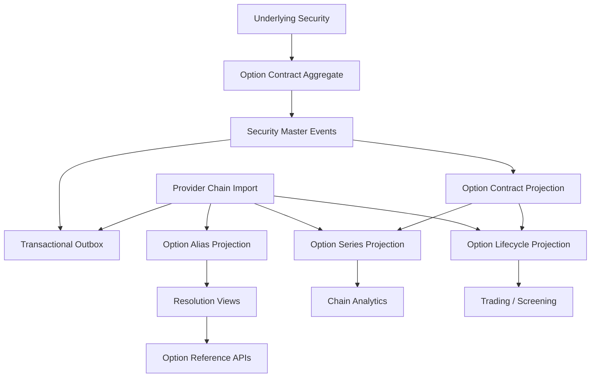

# UFL Option Target-State Package V2

**Owner:** Core Team
**Audience:** Product, architecture, domain, storage, and application contributors
**Last Updated:** 2026-03-26
**Status:** active
**Reviewed:** 2026-03-26

> **Naming standard:** All new F# types and DTOs in this package must follow the
> [Domain Naming Standard](../ai/claude/CLAUDE.domain-naming.md).
> For options: definition record → `OptDef`; chain identifier → `OptChainId = OptChainId of Guid`;
> option right union → `OptRight = Call | Put`; exercise style → `ExerciseStyle = American | European | Bermuda`;
> expiry field → `ExpiryDt: DateOnly`; strike field → `StrikePx: decimal`.

## Summary

This document captures the target-state V2 package for `UFL` option assets inside Meridian's broader security-master, derivatives, and workstation expansion.

It assumes:

- a modular monolith
- canonical option contracts stored in security master
- deterministic linkage from each option to its canonical underlying security
- provider-specific chain data normalized into canonical contract and series projections
- replay-safe lifecycle handling across listing, expiration, and adjustment events

This package is the implementation-ready option slice. It turns the existing option-domain support in the repo into a concrete build plan for reference data, chain views, lifecycle tracking, and APIs.

## Repo Fit

### Verified Meridian constraints

- Meridian already models `SecurityKind.Option` in `src/Meridian.FSharp/Domain/SecurityMaster.fs`.
- `OptionContractSpec` and `OptionChainSnapshot` already exist in `src/Meridian.Contracts/Domain/Models/`.
- option subscriptions and endpoints already provide nearby runtime consumers.
- current validation already enforces `Put` or `Call`, positive strike, and positive multiplier.

### Proposed UFL-specific additions

- series- and lifecycle-level option projections
- underlying-link validation services
- adjusted-contract lineage storage
- option-reference endpoints separated from raw provider chain payloads

### Suggested Meridian mapping if implemented in-place

- F# domain support in `src/Meridian.FSharp/Domain/`
- application orchestration in `src/Meridian.Application/SecurityMaster/` and `src/Meridian.Application/Options/`
- contracts in `src/Meridian.Contracts/Options/`
- storage in `src/Meridian.Storage/SecurityMaster/`
- endpoints in `src/Meridian.Ui.Shared/Endpoints/`

## Scope

**In Scope:** canonical option contract identity, underlying linkage, expiry and strike normalization, option-series grouping, listing/expiration lifecycle, alias management, replay-safe rebuilds, and option reference/query APIs.

**Out of Scope:** OTC options, margin methodology, exercise processing, clearing integration, and full volatility-surface analytics.

## Knowledge Graph



## 1. Architecture Blueprint

### 1.1 System shape

**Write side**

- canonical option contract aggregate via security master
- provider chain import boundary
- adjusted-contract event boundary

**Read side**

- current option contract snapshot
- option series snapshot
- option lifecycle snapshot
- alias and resolution snapshot

**Processing**

- contract create/amend handlers
- chain normalization worker
- expiration-state worker
- adjusted-contract replay worker
- outbox dispatcher

### 1.2 Design principles

1. Each option contract is a first-class canonical security.
2. Underlying linkage must always point at a canonical security ID.
3. Series and chain views are projections, not separate identities.
4. Expiration and adjustment state must be deterministic under replay.
5. Provider chain symbology must not leak into downstream canonical workflows.

## 2. F# Aggregate and Domain Shapes

### 2.1 Shared kernel

```fsharp
type OptionContractId = SecurityId
type OptionSeriesId = OptionSeriesId of Guid

type OptionLifecycleState =
    | Listed
    | Active
    | Expiring
    | Expired
    | Adjusted
```

### 2.2 Option contract aggregate

The canonical contract remains the current security-master shape:

```fsharp
type OptionTerms = {
    UnderlyingId: SecurityId
    PutCall: string
    Strike: decimal
    Expiry: DateOnly
    Multiplier: decimal
}
```

Proposed additive projection shapes:

```fsharp
type OptionSeriesProjection = {
    UnderlyingId: SecurityId
    Expiry: DateOnly
    PutCall: string
    ContractCount: int
}

type OptionLifecycleProjection = {
    SecurityId: SecurityId
    State: OptionLifecycleState
    Expiry: DateOnly
    LastTradingDate: DateOnly option
}
```

### 2.3 Projection lineage model

- canonical security-master events rebuild contract state
- chain imports rebuild series and alias state
- adjustment imports rebuild lifecycle and multiplier overlays

## 3. Event Catalog

### 3.1 Domain events

- `SecurityCreated`
- `TermsAmended`
- `SecurityDeactivated`
- `OptionSeriesProjected`
- `OptionAliasMapped`
- `OptionLifecycleStateChanged`
- `OptionContractAdjusted`

### 3.2 Process events

- `OptionChainImportCompleted`
- `OptionExpirationSweepCompleted`
- `OptionProjectionRebuildCompleted`

### 3.3 Event naming and versioning policy

- keep contract-definition events aligned with security master
- use separate projection event versions for provider chain schema changes
- include source provider and chain timestamp in all import metadata

## 4. SQL DDL Design

### 4.1 Core table groups

- `security_master_projection`
- `option_contract_projection`
- `option_series_projection`
- `option_lifecycle_projection`
- `option_alias_projection`
- `option_projection_checkpoint`

### 4.2 Implementation notes

- index contracts by `(underlying_security_id, expiry, strike, put_call)`
- index lifecycle tables by expiry and state for screening
- preserve provider alias uniqueness by provider plus normalized symbol

## 5. Service Boundaries

### 5.1 Option Reference module

- owns canonical option query APIs and underlying-link validation

### 5.2 Series Projection module

- owns grouped expiry/strike/right views

### 5.3 Lifecycle module

- owns active, expiring, expired, and adjusted status projections

### 5.4 Platform module

- owns imports, rebuild orchestration, and outbox dispatch

## 6. Core Workflows

### 6.1 Create option contract

1. validate underlying security exists
2. create canonical option contract
3. persist `SecurityCreated`
4. build contract projection

### 6.2 Import chain data

1. ingest provider chain snapshot
2. normalize aliases to canonical contracts
3. rebuild series projection
4. emit import completion event

### 6.3 Mark expiration lifecycle

1. evaluate expiry and trading dates
2. transition lifecycle state
3. rebuild screening and lifecycle views

### 6.4 Capture contract adjustment

1. ingest adjustment metadata
2. persist adjustment event
3. rebuild multiplier and lifecycle projections

### 6.5 Read-model rebuild

1. replay security-master events
2. replay chain imports
3. replay adjustments
4. checkpoint series and lifecycle projections

## 7. Phase Sequence

### 7.1 Phase 1 goal

Deliver canonical contract identity, underlying linkage, series projections, and option reference APIs.

### 7.2 Phase 1 implementation order

1. add option DTOs and projection contracts
2. add series and lifecycle storage models
3. implement underlying-link validation service
4. implement option reference and query service
5. expose option reference endpoints
6. add rebuild and expiration tests

### 7.3 Phase 1 exit criteria

- option contracts resolve to canonical security IDs
- chain data projects into stable series views
- lifecycle and expiration status can be queried deterministically

### 7.4 Phase 2 goals

- adjusted-contract lineage
- workstation screening views
- governance and risk controls around expiration state

## 8. Target API Surface

### 8.1 Reference

- `GET /api/security-master/options/{securityId}`
- `GET /api/security-master/options/search`

### 8.2 Series

- `GET /api/security-master/options/series`

### 8.3 Lifecycle

- `GET /api/security-master/options/{securityId}/lifecycle`

## 9. Proposed Repo Structure

```text
src/
  Meridian.Application/
    Options/
      IOptionReferenceService.cs
      OptionReferenceService.cs
      IOptionLifecycleService.cs
      OptionLifecycleService.cs
  Meridian.Contracts/
    Options/
      OptionReferenceDtos.cs
  Meridian.Storage/
    SecurityMaster/
      OptionProjectionStore.cs
  Meridian.Ui.Shared/
    Endpoints/
      OptionReferenceEndpoints.cs
tests/
  Meridian.Tests/
    Options/
    SecurityMaster/
```

## 10. Recommended First Ten Implementation Tickets

1. Add option reference DTOs.
2. Add series and lifecycle projection records.
3. Implement underlying-link validation service.
4. Implement option reference query service.
5. Expose option reference endpoints.
6. Add deterministic series projection tests.
7. Add expiration-state sweep logic.
8. Add adjusted-contract record storage.
9. Add rebuild orchestration coverage.
10. Add workstation option-reference views.

## 11. Final Target State

Meridian treats an option as a canonical derivative contract with stable underlying linkage, deterministic lifecycle state, and replay-safe series views. Provider chain data enriches the platform but does not redefine the contract identity.

## Related Documents

- [UFL Supported Asset Packages](ufl-supported-assets-index.md)
- [UFL Direct Lending Target-State Package V2](ufl-direct-lending-target-state-v2.md)
- [Governance and Fund Operations Blueprint](governance-fund-ops-blueprint.md)
