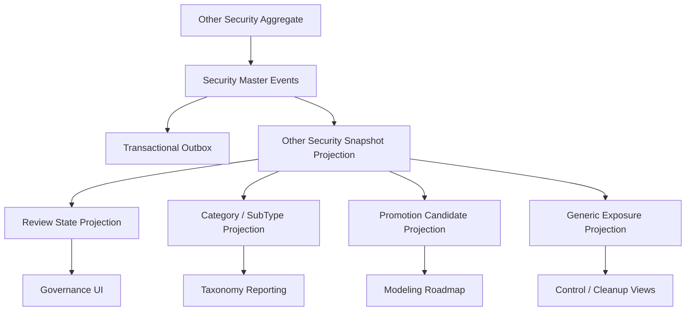

# UFL Other Security Target-State Package V2

**Owner:** Core Team
**Audience:** Product, architecture, domain, storage, and application contributors
**Last Updated:** 2026-03-26
**Status:** active
**Reviewed:** 2026-03-26

> **Naming standard:** All new F# types and DTOs in this package must follow the
> [Domain Naming Standard](../ai/claude/CLAUDE.domain-naming.md).
> Other securities: definition record → `OtherSecDef`; type descriptor field → `TypeDescriptor: string`.

## Summary

This document captures the target-state V2 package for `UFL` other-security assets inside Meridian's broader security-master and governance expansion.

It assumes:

- a modular monolith
- canonical `OtherSecurity` identities stored in security master
- governed review, classification, and promotion views modeled as projections
- replay-safe rebuilds across category, subtype, maturity, issuer, and settlement metadata
- `OtherSecurity` used as a controlled onboarding path rather than an unbounded catch-all

This package turns the existing `OtherSecurityTerms` support into an implementation-ready plan for governed onboarding, review workflows, migration paths, and APIs.

## Repo Fit

### Verified Meridian constraints

- Meridian already models `SecurityKind.OtherSecurity` and `OtherSecurityTerms` in `src/Meridian.FSharp/Domain/SecurityMaster.fs`.
- `SecurityMasterMapping` already maps the `"OtherSecurity"` asset class.
- security-master validation currently enforces a nonblank category.
- legacy upgrade and interop layers already carry generic classification concepts that make governed fallback modeling useful.

### Proposed UFL-specific additions

- review-status and promotion-candidate projections
- category/subtype taxonomy views
- migration planning records to graduate repeated categories into dedicated asset packages
- `OtherSecurity`-specific query and governance endpoints

### Suggested Meridian mapping if implemented in-place

- F# domain support in `src/Meridian.FSharp/Domain/`
- application services in `src/Meridian.Application/SecurityMaster/` and `src/Meridian.Application/Governance/`
- contracts in `src/Meridian.Contracts/SecurityMaster/`
- storage in `src/Meridian.Storage/SecurityMaster/`
- endpoints in `src/Meridian.Ui.Shared/Endpoints/`

## Scope

**In Scope:** canonical generic-security identity, governed category/subtype metadata, issuer and settlement hints, review state, promotion candidate tracking, replay-safe rebuilds, and governance/reference APIs.

**Out of Scope:** bypasses around modeling discipline, provider-specific payload dumping, and permanent reliance on `OtherSecurity` for asset types that should have dedicated packages.

## Knowledge Graph



## 1. Architecture Blueprint

### 1.1 System shape

**Write side**

- canonical `OtherSecurity` aggregate via security master
- taxonomy and review enrichment boundary
- promotion-candidate projection boundary

**Read side**

- current other-security snapshot
- review-state snapshot
- category/subtype taxonomy snapshot
- promotion-candidate snapshot
- generic exposure snapshot

**Processing**

- security create/amend/deactivate handlers
- review-state worker
- taxonomy normalization worker
- promotion-candidate worker
- rebuild orchestration

### 1.2 Design principles

1. `OtherSecurity` is a governed fallback, not a permanent modeling shortcut.
2. Category and subtype metadata must be explicit, searchable, and reviewable.
3. Promotion to a dedicated asset package should preserve identity and lineage where possible.
4. Governance views should make repeated `OtherSecurity` usage visible and actionable.
5. Replay must deterministically rebuild review and promotion states from event history.

## 2. F# Aggregate and Domain Shapes

### 2.1 Shared kernel

```fsharp
type OtherSecurityId = SecurityId

type ReviewState =
    | Unreviewed
    | InReview
    | ApprovedAsGeneric
    | PromotionCandidate
    | Promoted
```

### 2.2 Other-security aggregate

The canonical generic instrument definition remains:

```fsharp
type OtherSecurityTerms = {
    Category: string
    SubType: string option
    Maturity: DateOnly option
    IssuerName: string option
    SettlementType: string option
}
```

Proposed additive projection shapes:

```fsharp
type OtherSecurityReviewProjection = {
    SecurityId: SecurityId
    State: ReviewState
    Category: string
    SubType: string option
}

type OtherSecurityPromotionProjection = {
    SecurityId: SecurityId
    Category: string
    RecommendedTargetAssetClass: string option
    IsPromotionCandidate: bool
}
```

### 2.3 Projection lineage model

- security-master events rebuild canonical generic-security terms
- review actions rebuild review-state projections
- taxonomy normalization rebuilds category/subtype reporting
- promotion planning rebuilds migration-candidate views

## 3. Event Catalog

### 3.1 Domain events

- `SecurityCreated`
- `TermsAmended`
- `SecurityDeactivated`
- `OtherSecurityReviewStateChanged`
- `OtherSecurityTaxonomyNormalized`
- `OtherSecurityPromotionCandidateFlagged`

### 3.2 Process events

- `OtherSecurityReviewSweepCompleted`
- `OtherSecurityProjectionRebuildCompleted`
- `OtherSecurityPromotionPlanningCompleted`

### 3.3 Event naming and versioning policy

- align base instrument-definition events with security master
- version taxonomy and review payloads independently from definition payloads
- include reviewer identity, reason, and effective timestamp in governance projections

## 4. SQL DDL Design

### 4.1 Core table groups

- `security_master_projection`
- `other_security_projection`
- `other_security_review_projection`
- `other_security_taxonomy_projection`
- `other_security_promotion_projection`
- `other_security_projection_checkpoint`

### 4.2 Implementation notes

- taxonomy projections should index category and subtype
- promotion projections should index candidate status and recommended target asset class
- review projections should retain reviewer, reason, and updated-at metadata

## 5. Service Boundaries

### 5.1 Other Security Reference module

- owns canonical generic-security queries

### 5.2 Review module

- owns review-state transitions and governance controls

### 5.3 Promotion Planning module

- owns promotion-candidate detection and migration planning views

### 5.4 Platform module

- owns rebuild orchestration and outbox dispatch

## 6. Core Workflows

### 6.1 Create governed generic security

1. create canonical `OtherSecurity` in security master
2. persist `SecurityCreated`
3. rebuild snapshot and taxonomy projections
4. initialize review-state projection

### 6.2 Amend classification metadata

1. amend category, subtype, or supporting terms
2. persist `TermsAmended`
3. rebuild taxonomy and review views

### 6.3 Review generic security

1. assign reviewer or automated review job
2. update review-state projection
3. publish governance event if status changes

### 6.4 Flag promotion candidate

1. evaluate repeated categories or business-critical volume
2. mark promotion-candidate projection
3. attach recommended target asset class and rationale

### 6.5 Read-model rebuild

1. replay canonical security events
2. replay review and promotion events
3. checkpoint rebuilt projections

## 7. Phase Sequence

### 7.1 Phase 1 goal

Deliver governed `OtherSecurity` identity, taxonomy and review projections, and governance/reference APIs.

### 7.2 Phase 1 implementation order

1. add `OtherSecurity` DTOs and query contracts
2. add review, taxonomy, and promotion projection tables
3. implement generic-security reference service
4. implement review and promotion services
5. expose governance-oriented endpoints
6. add review and taxonomy rebuild tests

### 7.3 Phase 1 exit criteria

- `OtherSecurity` instruments query through canonical APIs
- review and taxonomy views rebuild deterministically
- governance consumers can identify promotion candidates clearly

### 7.4 Phase 2 goals

- explicit migration workflows into dedicated asset packages
- stronger operational controls on unreviewed generic securities
- cross-package promotion dashboards

## 8. Target API Surface

### 8.1 Reference

- `GET /api/security-master/other-securities/{securityId}`
- `GET /api/security-master/other-securities/search`

### 8.2 Review

- `GET /api/security-master/other-securities/{securityId}/review`
- `POST /api/security-master/other-securities/{securityId}/review`

### 8.3 Promotion

- `GET /api/security-master/other-securities/promotion-candidates`

## 9. Proposed Repo Structure

```text
src/
  Meridian.Application/
    Governance/
      IOtherSecurityReviewService.cs
      OtherSecurityReviewService.cs
      IOtherSecurityPromotionService.cs
      OtherSecurityPromotionService.cs
  Meridian.Contracts/
    SecurityMaster/
      OtherSecurityDtos.cs
  Meridian.Storage/
    SecurityMaster/
      OtherSecurityProjectionStore.cs
  Meridian.Ui.Shared/
    Endpoints/
      OtherSecurityEndpoints.cs
tests/
  Meridian.Tests/
    Governance/
    SecurityMaster/
```

## 10. Recommended First Ten Implementation Tickets

1. Add `OtherSecurity` DTOs and query contracts.
2. Add review and taxonomy projection records.
3. Add promotion-candidate projection records.
4. Implement generic-security reference service.
5. Implement review-state service.
6. Expose governance review endpoints.
7. Add taxonomy normalization tests.
8. Add promotion-candidate detection coverage.
9. Add rebuild orchestration coverage.
10. Add governance dashboards for `OtherSecurity` usage and promotion tracking.

## 11. Final Target State

Meridian treats `OtherSecurity` as a disciplined, reviewable onboarding path with explicit taxonomy, review state, and promotion planning. The platform gains flexibility without allowing generic instruments to become a silent long-term dumping ground.

## Related Documents

- [UFL Supported Asset Packages](ufl-supported-assets-index.md)
- [UFL Direct Lending Target-State Package V2](ufl-direct-lending-target-state-v2.md)
- [Governance and Fund Operations Blueprint](governance-fund-ops-blueprint.md)
