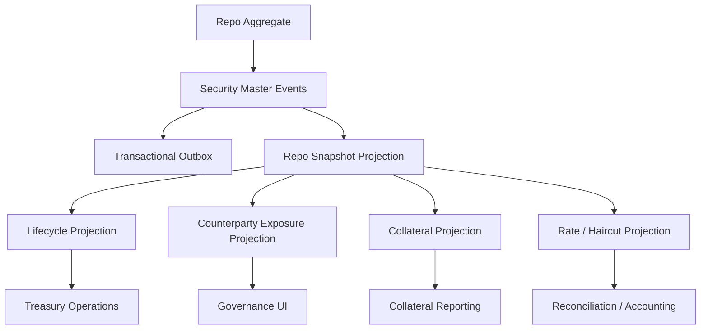

# UFL Repo Target-State Package V2

**Owner:** Core Team
**Audience:** Product, architecture, domain, storage, and application contributors
**Last Updated:** 2026-03-26
**Status:** active
**Reviewed:** 2026-03-26

> **Naming standard:** All new F# types and DTOs in this package must follow the
> [Domain Naming Standard](../ai/claude/CLAUDE.domain-naming.md).
> Repos: definition record → `RepoDef`; counterparty identifier → `CptyId`; collateral type → `CollateralType: string option`; open date → `OpenDt: DateOnly option`.

## Summary

This document captures the target-state V2 package for `UFL` repo assets inside Meridian's broader treasury, financing, and governance expansion.

It assumes:

- a modular monolith
- canonical repo agreements stored in security master
- lifecycle, collateral, and counterparty views modeled as projections over canonical agreement identity
- replay-safe rebuilds across date range, rate, haircut, and collateral state
- downstream treasury, governance, and reconciliation services querying canonical projections

This package turns the existing `RepoTerms` support into an implementation-ready plan for repo reference data, lifecycle and collateral views, and APIs.

## Repo Fit

### Verified Meridian constraints

- Meridian already models `SecurityKind.Repo` and `RepoTerms` in `src/Meridian.FSharp/Domain/SecurityMaster.fs`.
- `SecurityMasterMapping` already maps the `"Repo"` asset class.
- security-master validation already enforces nonblank counterparty, ordered dates, and nonnegative repo rate and haircut when present.
- `SecurityMasterAssetClassSupportTests` already verifies base create support for repo instruments.

### Proposed UFL-specific additions

- repo lifecycle and exposure projections
- collateral and counterparty-grouping views
- maturity and unwind-state projections
- repo-specific query contracts and endpoints

### Suggested Meridian mapping if implemented in-place

- F# domain support in `src/Meridian.FSharp/Domain/`
- application services in `src/Meridian.Application/Treasury/`
- contracts in `src/Meridian.Contracts/Treasury/`
- storage in `src/Meridian.Storage/SecurityMaster/`
- endpoints in `src/Meridian.Ui.Shared/Endpoints/`

## Scope

**In Scope:** canonical repo agreement identity, counterparty lineage, start and end dates, repo rate and haircut metadata, collateral classification, lifecycle state, replay-safe rebuilds, and treasury/reference APIs.

**Out of Scope:** tri-party settlement, collateral inventory optimization, securities lending, and full financing-operations messaging.

## Knowledge Graph



## 1. Architecture Blueprint

### 1.1 System shape

**Write side**

- canonical repo aggregate via security master
- counterparty normalization boundary
- collateral and lifecycle projection boundary

**Read side**

- current repo snapshot
- lifecycle snapshot
- counterparty exposure snapshot
- collateral classification snapshot
- rate and haircut snapshot

**Processing**

- security create/amend/deactivate handlers
- lifecycle-state worker
- counterparty normalization worker
- collateral projection worker
- rebuild orchestration

### 1.2 Design principles

1. A repo agreement is a canonical financing identity even when operational state changes around it.
2. Counterparty and collateral views should be projected and versioned with provenance.
3. Lifecycle state must reflect date-driven operational reality without mutating canonical terms.
4. Reconciliation and accounting consumers should query rebuilt rate and haircut projections.
5. Future tri-party and unwind workflows should extend the lifecycle model rather than replace the base agreement shape.

## 2. F# Aggregate and Domain Shapes

### 2.1 Shared kernel

```fsharp
type RepoId = SecurityId

type RepoLifecycleState =
    | Pending
    | Active
    | Unwinding
    | Closed
    | Inactive
```

### 2.2 Repo aggregate

The canonical financing agreement remains:

```fsharp
type RepoTerms = {
    Counterparty: string
    StartDate: DateOnly
    EndDate: DateOnly
    RepoRate: decimal option
    CollateralType: string option
    Haircut: decimal option
}
```

Proposed additive projection shapes:

```fsharp
type RepoLifecycleProjection = {
    SecurityId: SecurityId
    State: RepoLifecycleState
    StartDate: DateOnly
    EndDate: DateOnly
}

type RepoExposureProjection = {
    SecurityId: SecurityId
    Counterparty: string
    CollateralType: string option
    RepoRate: decimal option
    Haircut: decimal option
}
```

### 2.3 Projection lineage model

- security-master events rebuild canonical repo terms
- lifecycle evaluation rebuilds pending, active, and closed views
- counterparty normalization and collateral enrichment rebuild exposure views

## 3. Event Catalog

### 3.1 Domain events

- `SecurityCreated`
- `TermsAmended`
- `SecurityDeactivated`
- `RepoLifecycleStateChanged`
- `RepoCounterpartyLinked`
- `RepoCollateralProjected`

### 3.2 Process events

- `RepoLifecycleSweepCompleted`
- `RepoProjectionRebuildCompleted`
- `RepoCounterpartyRefreshCompleted`

### 3.3 Event naming and versioning policy

- align canonical agreement-definition events with security master
- version exposure and collateral payloads independently from base definition
- include effective date and source system metadata on all enrichments

## 4. SQL DDL Design

### 4.1 Core table groups

- `security_master_projection`
- `repo_projection`
- `repo_lifecycle_projection`
- `repo_counterparty_projection`
- `repo_collateral_projection`
- `repo_rate_haircut_projection`

### 4.2 Implementation notes

- index lifecycle tables by start date, end date, and current state
- counterparty projections should index normalized counterparty names
- collateral projections should index collateral type and haircut ranges

## 5. Service Boundaries

### 5.1 Repo Reference module

- owns canonical repo reference queries

### 5.2 Lifecycle module

- owns pending, active, unwinding, and closed state projections

### 5.3 Exposure module

- owns counterparty, collateral, and rate/haircut views

### 5.4 Platform module

- owns rebuild orchestration and outbox dispatch

## 6. Core Workflows

### 6.1 Create repo agreement

1. create canonical repo in security master
2. persist `SecurityCreated`
3. rebuild snapshot and exposure projections
4. attach counterparty and collateral views

### 6.2 Amend repo terms

1. amend common or repo-specific terms
2. persist `TermsAmended`
3. rebuild lifecycle and exposure views

### 6.3 Evaluate lifecycle state

1. compare as-of date to start and end date
2. update lifecycle projection
3. publish outbox event if state changes

### 6.4 Refresh counterparty and collateral views

1. normalize counterparty metadata
2. project collateral and haircut metadata
3. rebuild governance and reporting views

### 6.5 Read-model rebuild

1. replay canonical security events
2. replay lifecycle and exposure events
3. checkpoint rebuilt projections

## 7. Phase Sequence

### 7.1 Phase 1 goal

Deliver canonical repo identity, lifecycle and exposure projections, and treasury/reference APIs.

### 7.2 Phase 1 implementation order

1. add repo DTOs and query contracts
2. add lifecycle, counterparty, and collateral projection tables
3. implement repo reference service
4. implement lifecycle and exposure services
5. expose repo reference endpoints
6. add date-range and exposure tests

### 7.3 Phase 1 exit criteria

- repos query through canonical APIs
- lifecycle and exposure views rebuild deterministically
- treasury, governance, and reconciliation consumers can rely on the same canonical projections

### 7.4 Phase 2 goals

- unwind and roll overlays
- richer counterparty controls
- deeper collateral workflow support

## 8. Target API Surface

### 8.1 Reference

- `GET /api/security-master/repos/{securityId}`
- `GET /api/security-master/repos/search`

### 8.2 Lifecycle

- `GET /api/security-master/repos/{securityId}/lifecycle`

### 8.3 Exposure

- `GET /api/security-master/repos/{securityId}/exposure`

## 9. Proposed Repo Structure

```text
src/
  Meridian.Application/
    Treasury/
      IRepoService.cs
      RepoService.cs
      IRepoLifecycleService.cs
      RepoLifecycleService.cs
  Meridian.Contracts/
    Treasury/
      RepoDtos.cs
  Meridian.Storage/
    SecurityMaster/
      RepoProjectionStore.cs
  Meridian.Ui.Shared/
    Endpoints/
      RepoEndpoints.cs
tests/
  Meridian.Tests/
    Treasury/
    SecurityMaster/
```

## 10. Recommended First Ten Implementation Tickets

1. Add repo DTOs and query contracts.
2. Add lifecycle and exposure projection records.
3. Add counterparty and collateral projection records.
4. Implement repo reference service.
5. Implement lifecycle and exposure services.
6. Expose repo reference endpoints.
7. Add date-range and lifecycle-state tests.
8. Add counterparty normalization coverage.
9. Add collateral and haircut projection tests.
10. Add treasury and governance exposure views.

## 11. Final Target State

Meridian treats a repo as a canonical financing agreement with explainable lifecycle state, counterparty lineage, and collateral/rate metadata. Treasury, governance, and reconciliation consumers all use the same rebuilt reference model.

## Related Documents

- [UFL Supported Asset Packages](ufl-supported-assets-index.md)
- [UFL Direct Lending Target-State Package V2](ufl-direct-lending-target-state-v2.md)
- [Governance and Fund Operations Blueprint](governance-fund-ops-blueprint.md)
