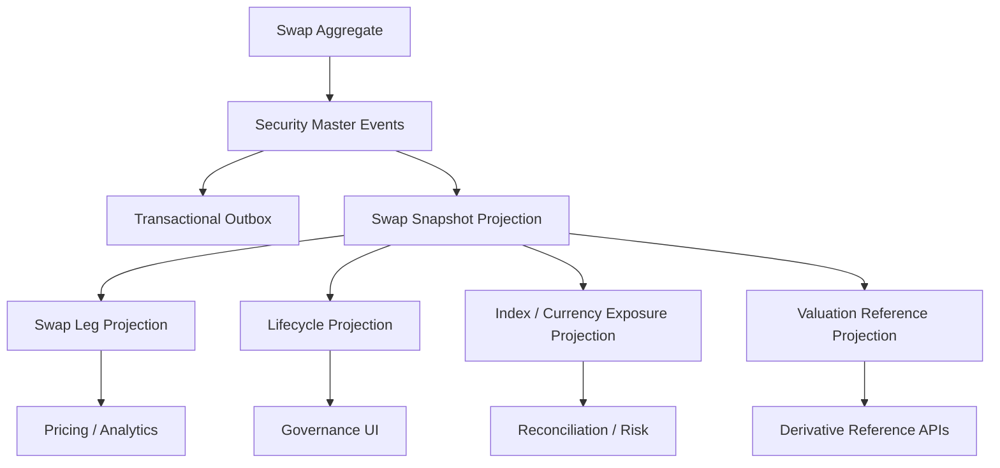

# UFL Swap Target-State Package V2

**Owner:** Core Team  
**Audience:** Product, architecture, domain, storage, and application contributors  
**Last Updated:** 2026-03-26  
**Status:** active  
**Reviewed:** 2026-03-26

> **Naming standard:** All new F# types and DTOs in this package must follow the
> [Domain Naming Standard](../ai/claude/CLAUDE.domain-naming.md).
> Swaps: definition record → `SwapDef`; fixed leg rate → `FixedRate: decimal option`; floating index → `FloatIdx: string option`; notional → `NotionalAmt: decimal option`.

## Summary

This document captures the target-state V2 package for `UFL` swap assets inside Meridian's broader security-master, derivatives, valuation, and governance expansion.

It assumes:

- a modular monolith
- canonical swap definitions stored in security master
- leg-level, lifecycle, and valuation-reference views modeled as projections
- replay-safe rebuilds across effective dates, maturity dates, and swap-leg metadata
- downstream governance, reconciliation, and pricing consumers querying canonical projections

This package turns the existing `SwapTerms` and `SwapLeg` support into an implementation-ready plan for swap reference data, lifecycle handling, leg projections, and APIs.

## Repo Fit

### Verified Meridian constraints

- Meridian already models `SecurityKind.Swap`, `SwapTerms`, and `SwapLeg` in `src/Meridian.FSharp/Domain/SecurityMaster.fs`.
- `SecurityMasterMapping` already maps the `"Swap"` asset class and materializes swap legs from JSON.
- security-master validation already enforces ordered effective and maturity dates, at least one leg, and nonblank leg type and currency values.
- ledger, reconciliation, and governance planning already make swap lifecycle and leg-level projections valuable downstream.

### Proposed UFL-specific additions

- swap lifecycle and leg projections
- valuation-reference and index exposure views
- novation and unwind state overlays
- swap-specific query contracts and endpoints

### Suggested Meridian mapping if implemented in-place

- F# domain support in `src/Meridian.FSharp/Domain/`
- application services in `src/Meridian.Application/Derivatives/`
- contracts in `src/Meridian.Contracts/Derivatives/`
- storage in `src/Meridian.Storage/SecurityMaster/`
- endpoints in `src/Meridian.Ui.Shared/Endpoints/`

## Scope

**In Scope:** canonical swap identity, leg metadata, effective and maturity dates, lifecycle state, valuation-reference views, replay-safe rebuilds, and derivative/reference APIs.

**Out of Scope:** CSA management, collateral optimization, XVA, clearing integrations, and full pricing-engine implementation.

## Knowledge Graph



## 1. Architecture Blueprint

### 1.1 System shape

**Write side**

- canonical swap aggregate via security master
- lifecycle and novation overlay boundary
- valuation-reference projection boundary

**Read side**

- current swap snapshot
- swap-leg snapshot
- lifecycle snapshot
- valuation-reference snapshot
- exposure snapshot

**Processing**

- security create/amend/deactivate handlers
- swap-leg projection worker
- lifecycle-state worker
- valuation-reference worker
- rebuild orchestration

### 1.2 Design principles

1. A swap is a canonical derivative identity with immutable leg structure plus additive lifecycle state.
2. Leg-level projections should be first class because downstream consumers reason on legs, not just the top-level contract.
3. Lifecycle state should capture active, novated, unwinding, and matured states without rewriting canonical terms.
4. Valuation-reference consumers should read normalized projections rather than raw source payloads.
5. Future derivative extensions should preserve the base swap shape wherever possible.

## 2. F# Aggregate and Domain Shapes

### 2.1 Shared kernel

```fsharp
type SwapId = SecurityId

type SwapLifecycleState =
    | Pending
    | Active
    | Novated
    | Unwinding
    | Matured
    | Inactive
```

### 2.2 Swap aggregate

The canonical instrument definition remains:

```fsharp
type SwapLeg = {
    LegType: string
    Currency: string
    Index: string option
    FixedRate: decimal option
}

type SwapTerms = {
    EffectiveDate: DateOnly
    MaturityDate: DateOnly
    Legs: SwapLeg list
}
```

Proposed additive projection shapes:

```fsharp
type SwapLifecycleProjection = {
    SecurityId: SecurityId
    State: SwapLifecycleState
    EffectiveDate: DateOnly
    MaturityDate: DateOnly
}

type SwapLegProjection = {
    SecurityId: SecurityId
    LegType: string
    Currency: string
    Index: string option
    FixedRate: decimal option
}
```

### 2.3 Projection lineage model

- security-master events rebuild canonical swap terms
- lifecycle overlays rebuild active, novated, unwinding, and matured views
- leg and valuation projections rebuild exposure and pricing-reference views

## 3. Event Catalog

### 3.1 Domain events

- `SecurityCreated`
- `TermsAmended`
- `SecurityDeactivated`
- `SwapLifecycleStateChanged`
- `SwapLegsProjected`
- `SwapValuationReferenceProjected`

### 3.2 Process events

- `SwapLifecycleSweepCompleted`
- `SwapProjectionRebuildCompleted`
- `SwapValuationRefreshCompleted`

### 3.3 Event naming and versioning policy

- align base derivative-definition events with security master
- version lifecycle and valuation-reference payloads independently from definition payloads
- include source system and effective timestamp on all overlays and projection records

## 4. SQL DDL Design

### 4.1 Core table groups

- `security_master_projection`
- `swap_projection`
- `swap_leg_projection`
- `swap_lifecycle_projection`
- `swap_exposure_projection`
- `swap_valuation_reference_projection`

### 4.2 Implementation notes

- leg projections should index by security ID and leg type
- lifecycle projections should index by effective date, maturity date, and current state
- valuation-reference projections should preserve the source event lineage used for rebuilds

## 5. Service Boundaries

### 5.1 Swap Reference module

- owns canonical swap query APIs

### 5.2 Lifecycle module

- owns pending, active, novated, unwinding, and matured state projections

### 5.3 Leg / Valuation Reference module

- owns leg-level, exposure, and pricing-reference views

### 5.4 Platform module

- owns rebuild orchestration and outbox dispatch

## 6. Core Workflows

### 6.1 Create swap

1. create canonical swap in security master
2. persist `SecurityCreated`
3. rebuild snapshot and leg projections
4. attach lifecycle and valuation-reference views

### 6.2 Amend swap terms

1. amend common or swap-specific terms
2. persist `TermsAmended`
3. rebuild leg, lifecycle, and valuation-reference views

### 6.3 Evaluate lifecycle state

1. compare as-of date to effective and maturity dates
2. apply novation or unwind overlays if present
3. rebuild lifecycle projection and publish outbox event

### 6.4 Refresh leg and valuation views

1. normalize leg metadata
2. rebuild leg and exposure projections
3. refresh valuation-reference views for downstream consumers

### 6.5 Read-model rebuild

1. replay canonical security events
2. replay lifecycle overlays
3. replay leg and valuation-reference events
4. checkpoint rebuilt projections

## 7. Phase Sequence

### 7.1 Phase 1 goal

Deliver canonical swap identity, lifecycle and leg projections, and derivative/reference APIs.

### 7.2 Phase 1 implementation order

1. add swap DTOs and query contracts
2. add leg, lifecycle, and valuation-reference projection tables
3. implement swap reference service
4. implement lifecycle and leg-projection services
5. expose swap reference endpoints
6. add lifecycle and leg rebuild tests

### 7.3 Phase 1 exit criteria

- swaps query through canonical APIs
- lifecycle and leg views rebuild deterministically
- governance, reconciliation, and pricing consumers can rely on canonical projections

### 7.4 Phase 2 goals

- novation and unwind overlays
- richer valuation-reference metadata
- deeper reconciliation and governance tooling

## 8. Target API Surface

### 8.1 Reference

- `GET /api/security-master/swaps/{securityId}`
- `GET /api/security-master/swaps/search`

### 8.2 Lifecycle

- `GET /api/security-master/swaps/{securityId}/lifecycle`

### 8.3 Legs / valuation

- `GET /api/security-master/swaps/{securityId}/legs`
- `GET /api/security-master/swaps/{securityId}/valuation-reference`

## 9. Proposed Repo Structure

```text
src/
  Meridian.Application/
    Derivatives/
      ISwapReferenceService.cs
      SwapReferenceService.cs
      ISwapLifecycleService.cs
      SwapLifecycleService.cs
  Meridian.Contracts/
    Derivatives/
      SwapDtos.cs
  Meridian.Storage/
    SecurityMaster/
      SwapProjectionStore.cs
  Meridian.Ui.Shared/
    Endpoints/
      SwapEndpoints.cs
tests/
  Meridian.Tests/
    Derivatives/
    SecurityMaster/
```

## 10. Recommended First Ten Implementation Tickets

1. Add swap DTOs and query contracts.
2. Add leg and lifecycle projection records.
3. Add exposure and valuation-reference projection records.
4. Implement swap reference service.
5. Implement lifecycle and leg-projection services.
6. Expose swap reference endpoints.
7. Add leg validation and serialization tests.
8. Add lifecycle-state sweep tests.
9. Add rebuild orchestration coverage.
10. Add governance and reconciliation swap-reference views.

## 11. Final Target State

Meridian treats a swap as a canonical derivative identity with explainable leg structure, lifecycle state, and valuation-reference metadata. Governance, reconciliation, and pricing consumers all use the same rebuilt reference model.

## Related Documents

- [UFL Supported Asset Packages](ufl-supported-assets-index.md)
- [UFL Direct Lending Target-State Package V2](ufl-direct-lending-target-state-v2.md)
- [Governance and Fund Operations Blueprint](governance-fund-ops-blueprint.md)
