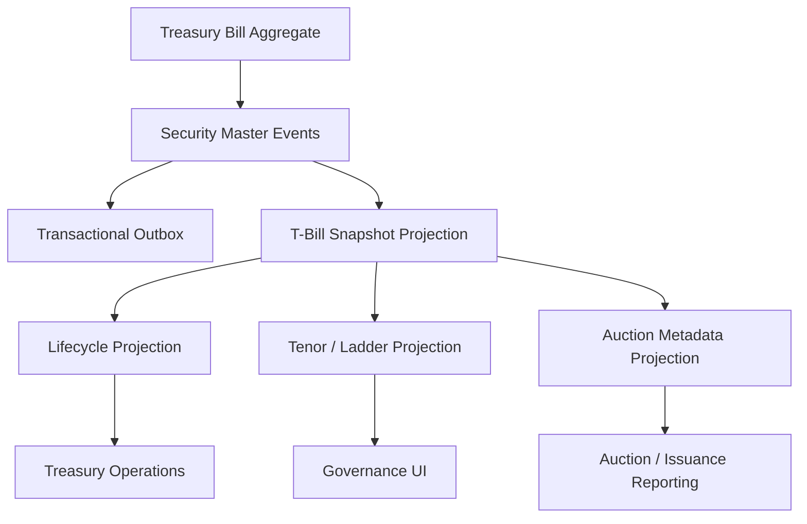

# UFL Treasury Bill Target-State Package V2

**Owner:** Core Team  
**Audience:** Product, architecture, domain, storage, and application contributors  
**Last Updated:** 2026-03-26  
**Status:** active  
**Reviewed:** 2026-03-26

> **Naming standard:** All new F# types and DTOs in this package must follow the
> [Domain Naming Standard](../ai/claude/CLAUDE.domain-naming.md).
> Treasury bills: definition record → `TbillDef`; maturity → `MaturityDt: DateOnly`; discount rate → `DiscountRate: decimal option`.

## Summary

This document captures the target-state V2 package for `UFL` treasury-bill assets inside Meridian's broader treasury, government-securities, and governance expansion.

It assumes:

- a modular monolith
- canonical T-bill definitions stored in security master
- auction, maturity, and ladder views modeled as projections over the canonical identity
- replay-safe rebuilds across auction metadata and lifecycle state
- downstream treasury and reporting consumers reading canonical projections

This package turns the existing `TreasuryBillTerms` support into a concrete implementation plan for reference data, lifecycle and ladder views, and APIs.

## Repo Fit

### Verified Meridian constraints

- Meridian already models `SecurityKind.TreasuryBill` and `TreasuryBillTerms` in `src/Meridian.FSharp/Domain/SecurityMaster.fs`.
- `SecurityMasterMapping` already maps the `"TreasuryBill"` asset class.
- security-master validation already enforces nonnegative discount rate and auction-date ordering relative to maturity.
- `SecurityMasterAssetClassSupportTests` already verifies basic create support for treasury bills.

### Proposed UFL-specific additions

- government-security lifecycle and ladder projections
- auction metadata projections
- T-bill-specific query contracts and endpoints
- additive issuer and tenor-grouping views

### Suggested Meridian mapping if implemented in-place

- F# domain support in `src/Meridian.FSharp/Domain/`
- application services in `src/Meridian.Application/Treasury/`
- contracts in `src/Meridian.Contracts/Treasury/`
- storage in `src/Meridian.Storage/SecurityMaster/`
- endpoints in `src/Meridian.Ui.Shared/Endpoints/`

## Scope

**In Scope:** canonical T-bill identity, auction metadata, maturity and tenor views, lifecycle state, replay-safe rebuilds, and treasury/reference APIs.

**Out of Scope:** notes, bonds, STRIPS, sovereign pricing analytics, and generalized government-auction workflow automation.

## Knowledge Graph



## 1. Architecture Blueprint

### 1.1 System shape

**Write side**

- canonical T-bill aggregate via security master
- auction metadata enrichment boundary
- lifecycle and ladder projection boundary

**Read side**

- current T-bill snapshot
- lifecycle snapshot
- tenor and ladder snapshot
- auction metadata snapshot

**Processing**

- security create/amend/deactivate handlers
- lifecycle-state worker
- auction projection worker
- ladder projection worker
- rebuild orchestration

### 1.2 Design principles

1. A treasury bill is a canonical government-security identity, not just a maturity bucket.
2. Auction metadata must be preserved with provenance because it is operationally meaningful.
3. Tenor and ladder views are projections and should remain rebuildable from canonical terms.
4. Maturity state should be explicit for treasury operations and reporting.
5. Future note and bond packages should reuse the same government-security patterns where possible.

## 2. F# Aggregate and Domain Shapes

### 2.1 Shared kernel

```fsharp
type TreasuryBillId = SecurityId

type TreasuryBillLifecycleState =
    | Active
    | Maturing
    | Matured
    | Inactive
```

### 2.2 Treasury-bill aggregate

The canonical instrument definition remains:

```fsharp
type TreasuryBillTerms = {
    Maturity: DateOnly
    AuctionDate: DateOnly option
    CUSIP: string option
    DiscountRate: decimal option
}
```

Proposed additive projection shapes:

```fsharp
type TreasuryBillLifecycleProjection = {
    SecurityId: SecurityId
    State: TreasuryBillLifecycleState
    Maturity: DateOnly
}

type TreasuryBillAuctionProjection = {
    SecurityId: SecurityId
    AuctionDate: DateOnly option
    CUSIP: string option
    DiscountRate: decimal option
}
```

### 2.3 Projection lineage model

- security-master events rebuild canonical T-bill terms
- lifecycle evaluation rebuilds maturity views
- auction enrichment rebuilds auction and ladder projections

## 3. Event Catalog

### 3.1 Domain events

- `SecurityCreated`
- `TermsAmended`
- `SecurityDeactivated`
- `TreasuryBillLifecycleStateChanged`
- `TreasuryBillAuctionProjected`
- `TreasuryBillTenorProjected`

### 3.2 Process events

- `TreasuryBillMaturitySweepCompleted`
- `TreasuryBillProjectionRebuildCompleted`
- `TreasuryBillAuctionRefreshCompleted`

### 3.3 Event naming and versioning policy

- align canonical instrument-definition events with security master
- version auction metadata payloads independently from base definition
- include source provider and effective date in all auction enrichments

## 4. SQL DDL Design

### 4.1 Core table groups

- `security_master_projection`
- `treasury_bill_projection`
- `treasury_bill_lifecycle_projection`
- `treasury_bill_auction_projection`
- `treasury_bill_ladder_projection`
- `treasury_bill_projection_checkpoint`

### 4.2 Implementation notes

- index lifecycle tables by maturity and state
- ladder projections should index tenor and maturity bucket
- auction projections should index auction date and CUSIP

## 5. Service Boundaries

### 5.1 Treasury-Bill Reference module

- owns canonical T-bill query APIs

### 5.2 Lifecycle module

- owns active, maturing, matured, and inactive state projections

### 5.3 Auction / Ladder module

- owns auction metadata, tenor, and ladder views

### 5.4 Platform module

- owns rebuild orchestration and outbox dispatch

## 6. Core Workflows

### 6.1 Create treasury bill

1. create canonical instrument in security master
2. persist `SecurityCreated`
3. rebuild snapshot and auction projections
4. materialize ladder views

### 6.2 Amend T-bill terms

1. amend common or T-bill-specific terms
2. persist `TermsAmended`
3. rebuild auction and lifecycle views

### 6.3 Evaluate maturity ladder

1. compare as-of date to maturity
2. update lifecycle and tenor projections
3. publish alert-oriented outbox event if state changes

### 6.4 Refresh auction metadata

1. ingest auction details
2. rebuild auction projection
3. update ladder and issuance reporting views

### 6.5 Read-model rebuild

1. replay canonical security events
2. replay auction enrichments
3. replay lifecycle-state events
4. checkpoint rebuilt projections

## 7. Phase Sequence

### 7.1 Phase 1 goal

Deliver canonical T-bill identity, auction and lifecycle projections, and treasury/reference APIs.

### 7.2 Phase 1 implementation order

1. add T-bill DTOs and query contracts
2. add lifecycle, auction, and ladder projection tables
3. implement T-bill reference service
4. implement maturity and ladder services
5. expose T-bill reference endpoints
6. add auction and lifecycle tests

### 7.3 Phase 1 exit criteria

- treasury bills query through canonical APIs
- auction and lifecycle data rebuild deterministically
- treasury and governance consumers can use ladder and tenor views without provider-native payloads

### 7.4 Phase 2 goals

- broader government-securities family
- richer alerting and issuance reporting
- deeper treasury operations tooling

## 8. Target API Surface

### 8.1 Reference

- `GET /api/security-master/treasury-bills/{securityId}`
- `GET /api/security-master/treasury-bills/search`

### 8.2 Lifecycle

- `GET /api/security-master/treasury-bills/{securityId}/lifecycle`

### 8.3 Auction / ladder

- `GET /api/security-master/treasury-bills/{securityId}/auction`
- `GET /api/security-master/treasury-bills/ladders`

## 9. Proposed Repo Structure

```text
src/
  Meridian.Application/
    Treasury/
      ITreasuryBillService.cs
      TreasuryBillService.cs
      ITreasuryBillLifecycleService.cs
      TreasuryBillLifecycleService.cs
  Meridian.Contracts/
    Treasury/
      TreasuryBillDtos.cs
  Meridian.Storage/
    SecurityMaster/
      TreasuryBillProjectionStore.cs
  Meridian.Ui.Shared/
    Endpoints/
      TreasuryBillEndpoints.cs
tests/
  Meridian.Tests/
    Treasury/
    SecurityMaster/
```

## 10. Recommended First Ten Implementation Tickets

1. Add T-bill DTOs and query contracts.
2. Add lifecycle and auction projection records.
3. Add tenor and ladder projection records.
4. Implement T-bill reference service.
5. Implement maturity ladder service.
6. Expose T-bill reference endpoints.
7. Add auction-date validation and serialization tests.
8. Add maturity-state sweep tests.
9. Add rebuild orchestration coverage.
10. Add governance and treasury ladder views.

## 11. Final Target State

Meridian treats a treasury bill as a canonical government-security identity with explainable auction metadata, lifecycle state, and tenor views. Treasury, governance, and reporting consumers all use the same rebuilt reference model.

## Related Documents

- [UFL Supported Asset Packages](ufl-supported-assets-index.md)
- [UFL Direct Lending Target-State Package V2](ufl-direct-lending-target-state-v2.md)
- [Governance and Fund Operations Blueprint](governance-fund-ops-blueprint.md)
