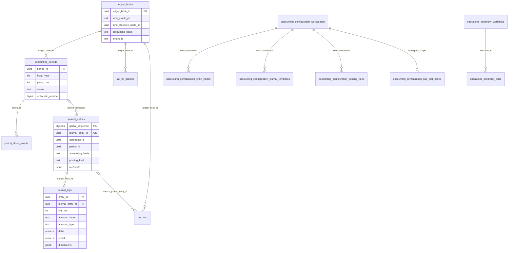
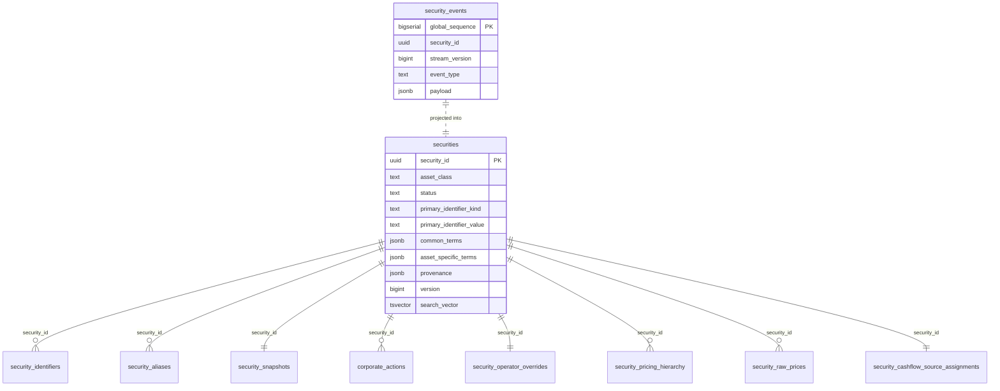
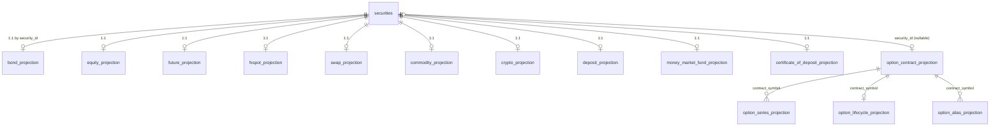
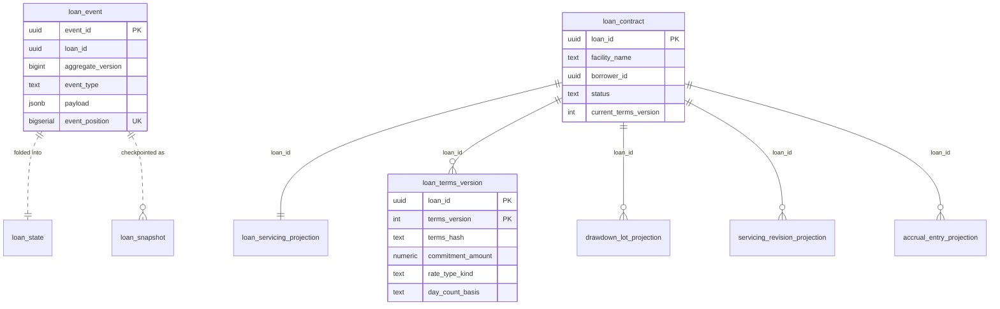
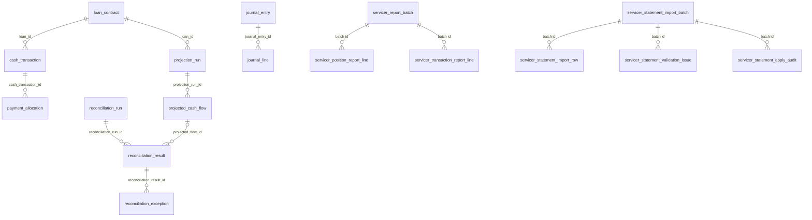
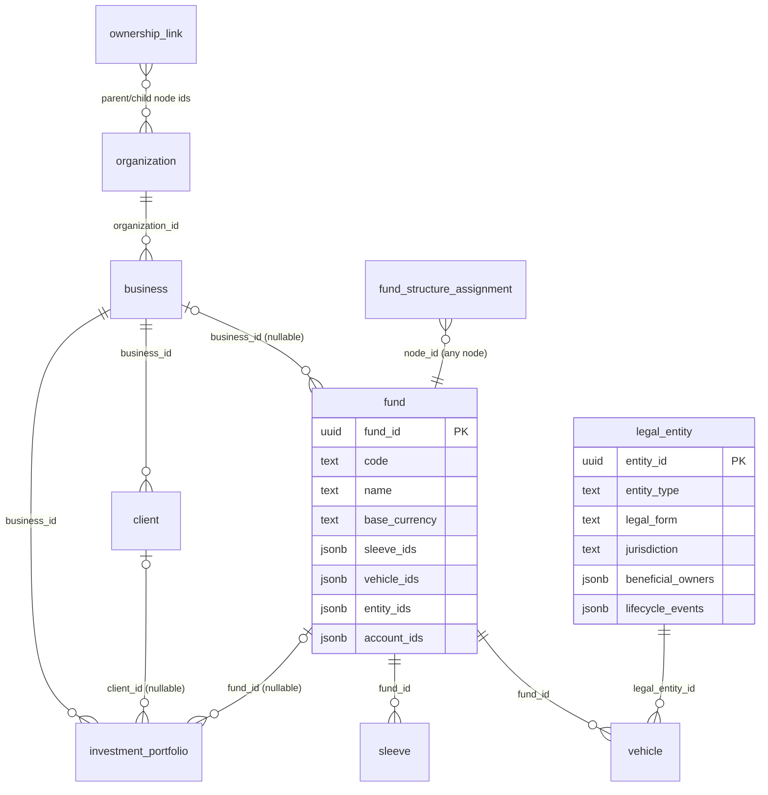
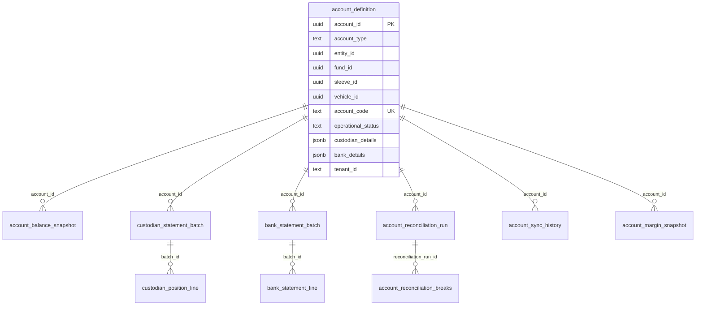

# Meridian Database Schema

**Status:** active
**Owner:** core-team
**Reviewed:** 2026-07-12

This is the consolidated relational schema reference for the current Meridian programs. It maps
every PostgreSQL store the platform provisions today — schema by schema, table by table — and
summarizes what is persisted outside PostgreSQL. The SQL migrations under
`src/Meridian.Storage/*/Migrations/` remain the authoritative DDL; this document is the navigable
map over them, not a second copy of the DDL. When a migration changes, update the matching section
here.

## Programs and Their Data Stores

| Program | Role | Database access |
| --- | --- | --- |
| `src/Meridian/` (host) | Web host: APIs, browser workstation, pipelines, schedulers | Owns all PostgreSQL stores below via `Meridian.Application/Composition/*Startup.cs`; owns the file-backed market-data archive |
| `src/Meridian.Wpf/` | Desktop workstation (web-UI parity lane) | HTTP client of the host (`WpfRemoteWorkstationClient`); the Strategy feature can also read Security Master directly via `MERIDIAN_SECURITY_MASTER_CONNECTION_STRING` (`Features/Strategy/StrategyFeatureModule.cs`) |
| `src/Meridian.Mcp/` | Stdio MCP server for repository navigation | No database access |
| Browser workstation (`src/Meridian.Ui/dashboard/`) | Operator UI served by the host | Indirect only, through host APIs and shared read models |

Every store is optional at runtime: a store registers its PostgreSQL implementation only when its
connection-string environment variable is set; otherwise the host falls back to in-memory or
file-backed implementations. Migration runners create schemas and tables idempotently at startup
(`create schema/table if not exists`), substituting the configured schema for the `__SCHEMA__`
placeholder in each script.

## PostgreSQL Store Registry

| Store | Default schema | Tables | Migrations | Connection / schema variables |
| --- | --- | --- | --- | --- |
| Ledger + Operations Continuity | `ledger` | 17 | `src/Meridian.Storage/Ledger/Migrations/` (`V_ledger_001`–`V_ledger_023`) | `MERIDIAN_LEDGER_CONNECTION_STRING`, `MERIDIAN_LEDGER_SCHEMA`, `MERIDIAN_LEDGER_ENABLE_PERIOD_LOCKING` |
| Security Master | `security_master` | 30 | `src/Meridian.Storage/SecurityMaster/Migrations/` (`001`–`021`) | `MERIDIAN_SECURITY_MASTER_CONNECTION_STRING`, `MERIDIAN_SECURITY_MASTER_SCHEMA` |
| Direct Lending | `security_master` (co-located; override with `MERIDIAN_DIRECT_LENDING_SCHEMA`) | 32 | `src/Meridian.Storage/DirectLending/Migrations/` (`001`–`007`) | `MERIDIAN_DIRECT_LENDING_CONNECTION_STRING`, `MERIDIAN_DIRECT_LENDING_SCHEMA` |
| Fund Structure | `fund_structure` | 10 | `src/Meridian.Storage/FundStructure/Migrations/` | `MERIDIAN_FUND_STRUCTURE_CONNECTION_STRING`, `MERIDIAN_FUND_STRUCTURE_SCHEMA` |
| Fund Accounts | `fund_accounts` | 10 | `src/Meridian.Storage/FundAccounts/Migrations/` | `MERIDIAN_FUND_ACCOUNTS_CONNECTION_STRING`, `MERIDIAN_FUND_ACCOUNTS_SCHEMA` |
| Banking | `banking` | 2 | `src/Meridian.Storage/Banking/Migrations/` | `MERIDIAN_BANKING_CONNECTION_STRING`, `MERIDIAN_BANKING_SCHEMA` |
| Money Market | `money_market` | 3 | `src/Meridian.Storage/MoneyMarket/Migrations/` | `MERIDIAN_MONEY_MARKET_CONNECTION_STRING`, `MERIDIAN_MONEY_MARKET_SCHEMA` |
| Asset Operations | `asset_operations` | 11 | `src/Meridian.Storage/AssetOperations/Migrations/` | `MERIDIAN_ASSET_OPERATIONS_CONNECTION_STRING`, `MERIDIAN_ASSET_OPERATIONS_SCHEMA` |
| Identity Scoped Access | `identity_access` | 1 | Inline DDL in `src/Meridian.Identity/Infrastructure/ScopedAccessAssignmentStore.cs` | `MERIDIAN_SCOPED_ACCESS_CONNECTION_STRING`, `MERIDIAN_SCOPED_ACCESS_SCHEMA` |

Total: 116 tables. Composition entrypoints live in `src/Meridian.Application/Composition/`
(`LedgerStartup`, `SecurityMasterStartup`, `DirectLendingStartup`, `FundStructureStartup`,
`FundAccountsStartup`, `BankingStartup`, `MoneyMarketStartup`, `AssetOperationsStartup`, and
`Features/StorageFeatureRegistration` for scoped access).

## Cross-Store Reference Keys

Stores never declare foreign keys across schema boundaries; they share identifiers by convention:

| Key | Origin | Referenced by |
| --- | --- | --- |
| `security_id` (uuid) | `security_master.securities` | Money Market, Asset Operations, Direct Lending servicer intake, ledger `JournalEntryMetadata`, corporate actions |
| Fund-structure node ids (`organization_id`, `business_id`, `client_id`, `fund_id`, `sleeve_id`, `vehicle_id`, `entity_id`, `investment_portfolio_id`) | `fund_structure.*` | `fund_accounts.account_definition`, `banking.*` (`entity_id`), `ledger.ledger_books.fund_structure_node_id`, scoped-access `scope_id` |
| `account_id` (uuid) | `fund_accounts.account_definition` | Ledger operations-continuity workflows (`fund_account_id`), direct-lending operations workflow audit |
| `fund_profile_id` (text) | Ledger accounting-configuration workspaces / fund profiles | `ledger.ledger_books`, accounting policies, tenancy registry, data-vendor entitlement scope |
| `loan_id` (uuid) | `direct_lending.loan_event` / `loan_contract` | All direct-lending projections, servicer statement rows |
| `period_id` (uuid) | `ledger.accounting_periods` | `journal_entries` / `journal_legs` (logical, no FK constraint) |
| `tenant_id`, `company_id` (text) | Retrofitted multi-tenancy columns | Ledger configuration/workspaces, ledger books, periods, operations continuity, fund accounts |

## Ledger Store (`ledger`)

Double-entry journal, accounting periods and books, basis policies, tax lots, accounting
configuration, and the Operations Continuity workflow/audit store. Documented operationally in
[Ledger Journal Store](ledger-journal-store.md).

| Table | Primary key | References | Purpose |
| --- | --- | --- | --- |
| `journal_entries` | `global_sequence` (`journal_entry_id` unique) | `accounting_periods` (logical) | Immutable journal-entry headers with basis, policy, rule, source-event, and posting-kind lineage; idempotency guards on `(aggregate_id, command_id)`, `(aggregate_id, source_event_id)`, and metadata `idempotencyKey` |
| `journal_legs` | `entry_id` | `journal_entries` (cascade) | Single-sided debit/credit lines (`numeric(38,10)`), check-constrained to balance semantics, with jsonb analytical `dimensions` |
| `accounting_periods` | `period_id` | `ledger_books` | Fiscal periods with `Open`/`SoftClosed`/`HardClosed` status and `optimistic_version` concurrency |
| `period_close_events` | `event_id` | `accounting_periods` (cascade) | Close/reopen audit trail with the period version each save produced |
| `ledger_books` | `ledger_book_id` | fund-structure node (logical) | Books scoping periods and policies to fund-structure nodes, keyed by `fund_profile_id` + node + `accounting_basis` |
| `accounting_policies` | `accounting_policy_key` | — | Basis policies (`Primary`/GAAP/tax/etc.) with scope columns and `rules_json` |
| `tax_lot_policies` | `policy_record_id` | `ledger_books` (cascade) | Relief-method policy (`Fifo`/`Lifo`/`Hifo`/`SpecificId`) per book/account/symbol |
| `tax_lots` | `tax_lot_record_id` | `ledger_books` (cascade), `journal_entries` | Open tax lots (`numeric(38,12)` quantities/cost) with source-journal lineage |
| `accounting_configuration_workspaces` | `tenant_id, company_id, fund_profile_id, configuration_scope_id` | — | Draft/published accounting configuration workspaces with validation issues |
| `accounting_configuration_chart_nodes` | workspace key + `node_id` | workspace (cascade) | Chart-of-accounts nodes (path, account name/type, archive flag) |
| `accounting_configuration_journal_templates` | workspace key + `template_id` | workspace (cascade) | Journal templates (jsonb `lines`, versioned) |
| `accounting_configuration_posting_rules` | workspace key + `rule_id` | workspace (cascade), templates (logical) | Event-type→template posting rules with jsonb `rule_payload` |
| `accounting_configuration_rule_test_cases` | workspace key + `test_case_id` | workspace (cascade) | Saved rule test cases (jsonb payload) |
| `accounting_action_audit_events` | `audit_event_id` | — | Hash-chained (`before_hash`/`after_hash`) configuration action audit with evidence links |
| `fund_profile_tenancy` | `fund_profile_id` | — | Tenant/company registration per fund profile |
| `operations_continuity_workflows` | `workflow_id` | `fund_accounts.account_definition` (logical) | One jsonb snapshot per operations-continuity workflow, unique open workflow per `(fund_account_id, period_id)` |
| `operations_continuity_audit` | `audit_id` | `operations_continuity_workflows` (cascade) | Append-only hash-chained workflow audit timeline (`previous_hash`/`current_hash` uniqueness, advisory-locked appends) |

## Security Master Store (`security_master`)

Event-sourced instrument master: an append-only event stream, the canonical `securities`
projection, identifier/alias resolution, corporate actions, pricing, and per-asset-class
reference projections.

Asset-class reference projections are one row per security (`security_id` PK, FK to `securities`,
cascade delete, `version` column), except the option cluster which keys on `contract_symbol`:

| Table | Primary key | References | Purpose |
| --- | --- | --- | --- |
| `security_events` | `global_sequence` | — | Append-only event stream, unique `(security_id, stream_version)` |
| `securities` | `security_id` | — | Canonical instrument projection: asset class, status, primary identifier (unique), jsonb terms/provenance, full-text `search_vector` |
| `security_identifiers` | `(security_id, identifier_kind, identifier_value, valid_from)` | `securities` | Time-bounded identifier claims (CUSIP/ISIN/ticker/…) with provider, confidence, normalized lookup columns |
| `security_aliases` | `alias_id` | `securities` | Operator/provider aliases with scope, validity window, normalized lookup |
| `security_snapshots` | `security_id` | — | Latest aggregate snapshot (jsonb) for stream rebuild acceleration |
| `projection_checkpoint` | `projection_name` | — | Last processed `global_sequence` per projection |
| `corporate_actions` | `corp_act_id` | `securities` | Dividends, splits, spin-offs, mergers, rights, redemptions; lifecycle state and supersession chain (`021`) |
| `security_operator_overrides` | `security_id` | `securities` | Operator field overrides (jsonb `values`) |
| `bond_projection`, `bond_lifecycle_projection`, `bond_accrual_convention_projection`, `bond_issuer_projection` | `security_id` | `securities` (cascade) | Bond reference: coupon terms, lifecycle dates (incl. Clearwater fields from `017`), day-count/settlement conventions, issuer rollup |
| `equity_projection` | `security_id` | `securities` (cascade) | Share class, voting rights, classification, exchange, issuer |
| `option_contract_projection` | `contract_symbol` | `securities` (nullable) | Option contract terms: chain, underlying, put/call, strike, expiry, multiplier, lifecycle |
| `option_series_projection` | `(option_chain_id, contract_symbol)` | `option_contract_projection` (cascade) | Chain membership rows |
| `option_lifecycle_projection` | `contract_symbol` | `option_contract_projection` (cascade) | Listing/last-trading/expiry lifecycle |
| `option_alias_projection` | `(contract_symbol, alias_kind, alias_value, provider)` | `option_contract_projection` (cascade) | Provider symbol aliases with normalized lookup |
| `future_projection` | `security_id` | `securities` (cascade) | Root symbol, contract month, expiry, roll/notice/delivery fields |
| `fxspot_projection` | `security_id` | `securities` (cascade) | Currency pair reference (`pair_code` unique) |
| `swap_projection` | `security_id` | — | Swap type, effective/maturity dates, lifecycle |
| `commodity_projection` | `security_id` | — | Commodity type, denomination, contract size, delivery country |
| `crypto_projection` | `security_id` | — | Base/quote currency and network |
| `deposit_projection` | `security_id` | — | Deposit type, institution, rate, day count, callability |
| `money_market_fund_projection` | `security_id` | — | Fund family, sweep eligibility, WAM, liquidity-fee eligibility |
| `certificate_of_deposit_projection` | `security_id` | — | Issuer, maturity, coupon, callable date |
| `security_pricing_hierarchy` | `(security_id, account_id)` | `securities` | Ordered pricing-source hierarchy (jsonb `entries`) per security/account |
| `security_raw_prices` | `(security_id, source_id)` | `securities` | Latest raw price per source (`numeric(28,10)`) |
| `security_cashflow_source_assignments` | `security_id` | `securities` | Cash-flow source kind per security with client-override confirmation |
| `data_vendor_entitlements` | `entitlement_id` | scope columns (logical) | Vendor data entitlements with contract window, AUM threshold, scope (client/account/fund-profile/security), staleness expectations |
| `security_master_quality_reports` | `id` | — | Periodic data-quality report snapshots (jsonb) |

Full-text search (`002`) maintains `securities.search_vector`; normalized identifier lookups
(`016`) add lowercase/trimmed lookup columns and indexes.

## Direct Lending Store (default co-located in `security_master`)

Event-sourced loan lifecycle (contract + servicing aggregates) with projections, cash operations,
its own ledger-basis journal, reconciliation, servicer report/statement intake, and outbox. Where
`005_direct_lending_operations.sql` and `005_direct_lending_workflows.sql` define the same tables,
the operations variant applies first (migrations run in ordinal filename order) and its DDL wins.

| Table | Primary key | References | Purpose |
| --- | --- | --- | --- |
| `loan_state` | `loan_id` | — | Latest contract + servicing aggregate state (jsonb) |
| `loan_event` | `event_id` | — | Append-only loan event stream with causation/correlation/command lineage, schema version, global `event_position`, command idempotency (`007`) |
| `loan_snapshot` | `(loan_id, aggregate_version)` | — | Versioned aggregate snapshots |
| `loan_contract` | `loan_id` | — | Contract projection: facility, borrower, status, current terms version |
| `loan_terms_version` | `(loan_id, terms_version)` | — | Full immutable terms per version: commitment, rate type, index/spread/floor/cap, day count, amortization, fees, covenants (extended by `006`) |
| `loan_servicing_projection` | `loan_id` | — | Live servicing balances: drawn/available, principal outstanding, accrued interest/fees/penalties, rate reset |
| `drawdown_lot_projection` | `lot_id` | `loan_contract` (logical) | Drawdown lots with original/remaining principal |
| `servicing_revision_projection` | `(loan_id, revision_number)` | — | Servicing revision history |
| `accrual_entry_projection` | `accrual_entry_id` | — | Daily accrual amounts and applied rate |
| `cash_transaction` | `cash_transaction_id` | `loan_contract`, `loan_event` (source) | Cash movements with dedupe on `(loan_id, external_ref, transaction_type)` and voiding |
| `payment_allocation` | `allocation_id` | `cash_transaction` | Ordered payment waterfall allocations to targets |
| `fee_balance` | `fee_balance_id` | `loan_contract` (logical) | Fee balances (original vs unpaid) |
| `projection_run` | `projection_run_id` | `loan_contract` (logical) | Cash-flow projection lineage: terms version, servicing revision, engine version, supersession |
| `projected_cash_flow` | `projected_flow_id` | `projection_run` | Projected flows with amount, rate, principal basis, formula trace |
| `journal_entry` / `journal_line` | `journal_entry_id` / `journal_line_id` | entry ← lines | Direct-lending ledger-basis journal (distinct from `ledger.journal_entries`), account codes, jsonb dimensions |
| `accounting_period_lock` | `(ledger_basis, period_start_date, period_end_date)` | — | Period lock/reopen state per ledger basis |
| `reconciliation_run` / `reconciliation_result` / `reconciliation_exception` | run / result / exception ids | run ← results ← exceptions; results → `projected_cash_flow` | Projected-vs-actual matching with variance, tolerances, exception workflow |
| `servicer_report_batch` | `servicer_report_batch_id` | — | Ingested servicer report files with hash and status |
| `servicer_position_report_line` / `servicer_transaction_report_line` | line ids | `servicer_report_batch` | Raw position/transaction report lines (jsonb `raw_payload`) |
| `servicing_revision_source` | `(loan_id, servicing_revision, servicer_report_batch_id)` | `servicer_report_batch` | Which batch produced a servicing revision |
| `servicing_revision_processing` | `(loan_id, servicing_revision, processing_stage)` | — | Stage status per revision |
| `servicer_statement_import_batch` | `servicer_statement_batch_id` | `servicer_report_batch` (optional) | Statement intake batches with payload hash dedupe and row-count rollups (`006_servicer_statement_intake`) |
| `servicer_statement_import_row` | `servicer_statement_row_id` | batch (cascade) | Normalized statement rows with row-hash dedupe, mapping status, suggested apply mode |
| `servicer_statement_validation_issue` | `servicer_statement_issue_id` | batch (cascade) | Row/batch validation issues with severity and routing |
| `servicer_statement_apply_audit` | `servicer_statement_apply_id` | batch (cascade) | Apply decisions per row with command/correlation lineage |
| `operations_workflow_audit` | `audit_id` | — | Hash-chained operations workflow audit (state transitions, gates, breaks, approvals) |
| `outbox_message` | `outbox_message_id` | — | Transactional outbox with visibility delay, retry count, unique `(topic, message_key)` |
| `read_model_checkpoint` | `projection_name` | — | Projection rebuild checkpoints against `event_position` |

## Fund Structure Store (`fund_structure`)

Organizational hierarchy: organizations, businesses, clients, funds, sleeves, vehicles, legal
entities, investment portfolios, plus generic ownership links and assignments. References between
nodes are logical (uuid columns and jsonb id arrays — no FK constraints).

| Table | Primary key | References | Purpose |
| --- | --- | --- | --- |
| `organization` | `organization_id` | — | Top-level operating group; owns businesses (`business_ids` jsonb) |
| `business` | `business_id` | `organization` (logical) | Business unit with kind and child client/fund/portfolio id arrays |
| `client` | `client_id` | `business` (logical) | Client with segment kind and portfolio ids |
| `fund` | `fund_id` | `business` (nullable, logical) | Fund with sleeve/vehicle/entity/portfolio/account id arrays |
| `sleeve` | `sleeve_id` | `fund` (logical) | Investment sleeve with mandate and strategy ids |
| `vehicle` | `vehicle_id` | `fund`, `legal_entity` (logical) | Legal vehicle within a fund |
| `legal_entity` | `entity_id` | — | Legal entity with form, jurisdiction, lifecycle, beneficial owners |
| `investment_portfolio` | `investment_portfolio_id` | `business` + nullable client/fund/sleeve/vehicle/entity (logical) | Portfolio node linking accounts |
| `ownership_link` | `ownership_link_id` | any two nodes | Typed parent/child ownership edge with percentage and validity window |
| `fund_structure_assignment` | `assignment_id` | any node | External assignment references (e.g. ledger mapping) per node |

## Fund Accounts Store (`fund_accounts`)

Account master and evidence for balances, custodian/bank statements, reconciliation, provider
sync, and margin.

| Table | Primary key | References | Purpose |
| --- | --- | --- | --- |
| `account_definition` | `account_id` | fund-structure nodes (logical) | Account master (custody/bank/brokerage/…) with unique active `account_code`, operational status, custodian/bank details, tenant column (`003`) |
| `account_balance_snapshot` | `snapshot_id` | `account_definition` | Dated balance evidence: cash, market value, accrued interest, pending settlement, P&L (`numeric(24,6)`) |
| `custodian_statement_batch` / `custodian_position_line` | `batch_id` / `position_line_id` | account; lines cascade from batch | Custodian statement ingestion with per-position quantity/market-value/cost lines |
| `bank_statement_batch` / `bank_statement_line` | `batch_id` / `statement_line_id` | account; lines cascade from batch | Bank statement ingestion with value dates and running balances |
| `account_reconciliation_run` / `account_reconciliation_breaks` | run / result ids | account; breaks cascade from run | Account reconciliation totals and per-check break records |
| `account_sync_history` | `sync_history_id` | `account_definition` | Provider sync attempts with link status, failure kind, evidence paths |
| `account_margin_snapshot` | `margin_snapshot_id` | `account_definition` | Margin evidence: requirements, buying power, utilization, breach counts, jsonb requirement/warning payloads |

## Banking Store (`banking`)

Payment initiation/approval and bank-transaction evidence at legal-entity scope.

| Table | Primary key | References | Purpose |
| --- | --- | --- | --- |
| `pending_payments` | `pending_payment_id` | `fund_structure.legal_entity` (logical `entity_id`) | Payment initiation with approval workflow (`status` smallint: pending/approved/rejected), reviewer and notes |
| `bank_transactions` | `bank_transaction_id` | `fund_structure.legal_entity` (logical `entity_id`) | Recorded bank movements (interest/principal/fee/drawdown/confirmation/return/reversal/failure) with effective/transaction/settlement dates, voiding, `recorded_by` (`002`) |

## Money Market Store (`money_market`)

Money-market-fund reference projections keyed by Security Master `security_id`.

| Table | Primary key | References | Purpose |
| --- | --- | --- | --- |
| `mmf_funds` | `security_id` | `security_master.securities` (logical) | MMF reference: family, sweep eligibility, weighted average maturity, liquidity fee, validity window, version |
| `mmf_liquidity_overrides` | `security_id` | `mmf_funds` (logical) | Operator liquidity-state override (smallint) |
| `mmf_rebuild_checkpoints` | `security_id` | — | Projection rebuild checkpoints per fund |

## Asset Operations Store (`asset_operations`)

Eleven structurally identical jsonb projection tables — each `id uuid` PK, `security_id uuid`
(logical reference to Security Master), optional `source_domain`/`source_entity_id`, `payload
jsonb`, `created_at`, and an index on `security_id`: `asset_operation_subjects`,
`asset_terms_versions`, `asset_lifecycle_events`, `asset_cash_flow_projection_runs`,
`asset_projected_cash_flows`, `asset_actual_activity`, `asset_reconciliation_runs`,
`asset_reconciliation_results`, `asset_ledger_projections`, `asset_operations_readiness`,
`asset_workflow_audit`. Together they form the asset-class-agnostic operations pipeline (subject →
terms → lifecycle → projection → actuals → reconciliation → ledger projection → readiness →
audit) that generalizes the direct-lending pattern to any instrument.

## Identity Scoped Access Store (`identity_access`)

| Table | Primary key | References | Purpose |
| --- | --- | --- | --- |
| `user_access_assignment` | `assignment_id` | fund-structure nodes via `scope_id` (logical) | Scoped access grants: principal (user/group), scope kind (`Global`/`Organization`/`Business`/`Client`/`Fund`/`Sleeve`/`Vehicle`/`InvestmentPortfolio`/`LegalEntity`/`Account`), role, permission names + mask, validity window, grant rationale, optimistic `version`, revocation fields, approval limits, segregation-of-duties rule |

The same store has a JSON-file implementation (`FileScopedAccessAssignmentStore`); user accounts,
account audit, and role permission profiles are JSON/JSONL files under `governance/` written via
`AtomicFileWriter` (see below).

## Persistence Outside PostgreSQL

The market-data and trading lanes are file-backed by design (see
[Storage Design](../architecture/storage-design.md)); operational state for several subsystems is
JSON/JSONL via `AtomicFileWriter`. The relational stores above never hold tick data.

| Lane | Mechanism | What is persisted |
| --- | --- | --- |
| Market data capture | Write-Ahead Log (`src/Meridian.Storage/Archival/WriteAheadLog.cs`): `wal_*.wal` files, per-record SHA-256 checksums, COMMIT records | `MarketEvent` envelope (`Trade`, `LOBSnapshot`, `BboQuotePayload`, `HistoricalBar`, option/order-book payloads) — field reference in [Data Dictionary](data-dictionary.md) |
| Market data archive | JSONL + Parquet dual sinks (`CompositeSink`), canonical layout `{root}/{yyyy}/{MM}/{dd}/{source}/{symbol}/{Type}.jsonl[.gz]` | Partitioned event files with per-file checksums and event counts |
| Catalog and manifests | `_catalog/manifest.json` (`StorageCatalog`), per-session `DataManifest`, schema registry (`*.schema.json`) | Symbol/date/file index, sequence ranges and gaps, quality metrics, schema versions |
| Backfill state | `<dataRoot>/_status/backfill.json` + symbol checkpoint/barcount JSON (`BackfillStatusStore`) | Last backfill result, per-symbol checkpoints and bar counts per granularity |
| Strategy lane | JSONL append-only stores under `data/strategies/` | Strategy design drafts (`designer/strategy-design-drafts.jsonl`), promotion history (`promotions/promotion-history.jsonl`); strategy run entries are in-memory today (`StrategyRunStore`) |
| Backtesting / execution | In-memory during a run; results flow into strategy run entries and ledger postings (`TradeExecutedEvent` → journal legs) | Orders, fills, lots, portfolio snapshots, metrics (`BacktestResult`) |
| Workflow runbooks | `<dataRoot>/runbooks.json` (`JsonRunbookStore`) | Runbook definitions and steps |
| Identity | JSON/JSONL via `AtomicFileWriter` under `governance/` | User accounts, user-account audit trail (`user-account-audit.jsonl`), role permission profiles, scoped-access assignments (file variant of the Postgres store above) |
| Reconciliation connectors | JSON stores in `src/Meridian.FinancialOperations/Reconciliation/Connectors/` | Statement mapping profiles, reconciliation checkpoints |
| Provider credentials | `FileProviderCredentialStore` (`src/Meridian.DataIntegration/Credentials/`) | OAuth tokens and provider credential records |
| Analysis/export | DuckDB over JSONL/Parquet (`src/Meridian.Storage/Query/DuckDbQueryService.cs`), portable data packages with `PackageManifest` | Read-only analysis views and governed exports, not authoritative state |

## Verifying This Document

- Table inventory source: `grep -ri "create table" src/Meridian.Storage --include="*.sql"` plus
  `src/Meridian.Identity/Infrastructure/ScopedAccessAssignmentStore.cs`.
- Schema names and environment variables: `src/Meridian.Application/Composition/*Startup.cs` and
  `src/Meridian.Ui.Shared/Services/WorkstationServiceCollectionExtensions.cs`.
- When adding a migration, update the matching store section and the registry counts here.
