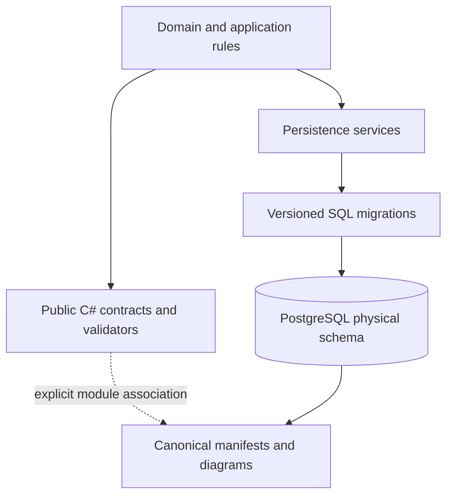

# Database Schema and Data-Object Catalog

**Status:** active
**Owner:** storage-platform
**Physical source of truth:** versioned SQL migrations
**Schema-control registry:** [`database/schema-control.json`](../../database/schema-control.json)

This page is the stable entrypoint for Meridian's PostgreSQL schema, migration history, public DTOs
and related data objects, and their dependency diagrams. Detailed object lists are generated from a
disposable migrated PostgreSQL database and from C# source; they are not manually duplicated here.

## Browse the current catalog

- [Generated database documentation](../generated/database/README.md)
- [PostgreSQL schema catalog](../generated/database/schema-catalog.md)
- [DTO and data-object catalog](../generated/database/data-object-catalog.md)
- [Machine-readable manifest root](../../database/manifest/)
- [Dependency graph](../../database/manifest/dependencies.json)
- [Schema-control implementation guide](../../tools/schema_control/README.md)

The generated catalog includes a Mermaid ER source and Markdown page per physical schema, plus
module-scoped class diagrams for public contract objects. “DTO” is the repository's canonical term;
commands, queries, records, enums, and other public contract types are included as related data
objects.

## Authority model

Meridian keeps four related models separate:

| Model | Authority | What it describes |
| --- | --- | --- |
| Physical database | Versioned SQL migrations and the resulting PostgreSQL catalog | Schemas, tables, columns, constraints, indexes, views, functions, triggers, policies, types, partitions, comments, and dependencies |
| Persistence | Storage implementations and migration-runner configuration | How application services read, write, and migrate PostgreSQL data |
| Contract/validation | Public C# types and validators | API, command, query, event, and read-model shapes accepted or emitted by the application |
| Domain | Domain and application services | Business meaning, lifecycle, and invariants |

These layers are connected, but they are not required to have identical structure. The generated
contract diagrams use explicit module-to-schema mappings and never claim that a DTO is a table or a
member is a column.



## Registered migration modules

The registry models migration-module identity separately from physical-schema identity. This is
important because Direct Lending is a separate owned module but is co-located in `security_master`
by default.

| Migration module | Default physical schema | Owning source |
| --- | --- | --- |
| Security Master | `security_master` | `src/Meridian.Storage/SecurityMaster` |
| Direct Lending | `security_master` | `src/Meridian.Storage/DirectLending` |
| Asset Operations | `asset_operations` | `src/Meridian.Storage/AssetOperations` |
| Ledger and Operations Continuity | `ledger` | `src/Meridian.Storage/Ledger` |
| Fund Structure | `fund_structure` | `src/Meridian.Storage/FundStructure` |
| Fund Accounts | `fund_accounts` | `src/Meridian.Storage/FundAccounts` |
| Banking | `banking` | `src/Meridian.Storage/Banking` |
| Money Market | `money_market` | `src/Meridian.Storage/MoneyMarket` |
| Reporting | `reporting` | `src/Meridian.Storage/Reporting` |
| Identity Scoped Access | `identity_access` | `src/Meridian.Identity` |

Do not add hand-maintained table counts to this page. The generated catalog and fingerprints are the
reviewable current snapshot.

## How maintenance works

The `PostgreSQL Schema Control` GitHub workflow:

1. Runs static migration inventory, immutability, duplicate-order, and destructive-change checks.
2. Applies every registered migration to a fresh PostgreSQL 16 service in one controlled run.
3. Extracts PostgreSQL-specific metadata directly from `pg_catalog`.
4. Inventories public C# contracts from configured source/namespace boundaries.
5. Builds database, contract-reference, and explicit logical dependency edges.
6. Evaluates schema policies and produces review findings.
7. Renders deterministic JSON manifests, Markdown catalogs, and Mermaid sources.
8. Fails pull requests when committed generated artifacts do not match the candidate database.

This is a self-auditing workflow, not a self-updating production database. Pull requests remain the
approval boundary for migration and generated-artifact changes.

## Contributor workflow

For a normal migration change:

```powershell
# Fast local proof, without PostgreSQL
python build/scripts/schema-control.py inventory --base-ref origin/main

# Generate a candidate in GitHub-hosted PostgreSQL
gh workflow run schema-control.yml --ref <branch> -f mode=snapshot
```

Download and inspect the snapshot artifact, promote its `candidate` directory with
`build/scripts/schema-control.py promote`, and commit the resulting `database/manifest/**` and
`docs/generated/database/**` files with the migration. The pull-request workflow then rebuilds the
database independently and checks for drift.

Existing migration files are immutable by default. Add a new migration instead of editing applied
history. Destructive SQL such as drops, direct renames, truncation, and column-type rewrites fails
closed unless a narrow, reviewed policy exception documents the rollout. Prefer expand, backfill,
switch readers/writers, and contract in separate releases.

## Policy scope

The initial policy set covers:

- every business table has a primary key;
- foreign-key leading columns have usable index coverage;
- application objects do not drift into the `public` schema;
- missing business-table comments are surfaced;
- selected sensitive schemas surface row-level-security gaps;
- legacy reapply migration modules remain visible until they can become append-only;
- registered migration directories, filenames, checksums, and approved exceptions remain auditable.

Policy configuration and reviewed waivers live under `database/policies/`. Rules belong there or in
the policy engine, never as a hidden workflow bypass.

## Production drift

The current workflow verifies the candidate schema built from the repository. A production drift
scanner should use the same catalog extractor with a read-only account and compare its normalized
manifest to the release artifact. It must not run migrations or write to production. That operating
lane is intentionally separate so production credentials and access policy are never required by a
pull-request workflow.

## Persistence outside PostgreSQL

This catalog governs PostgreSQL-backed modules only. Meridian also uses file-backed market-data,
configuration, local operational artifacts, export/package formats, and optional DuckDB/Parquet
analysis surfaces. Their ownership remains in the source registry and nearest module README; they
must not be misrepresented as PostgreSQL relations in this manifest.
