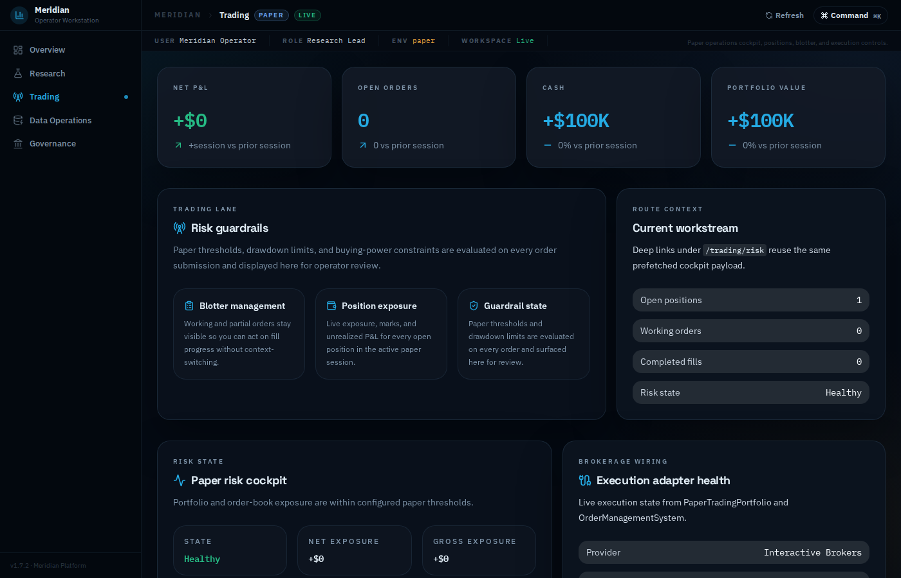
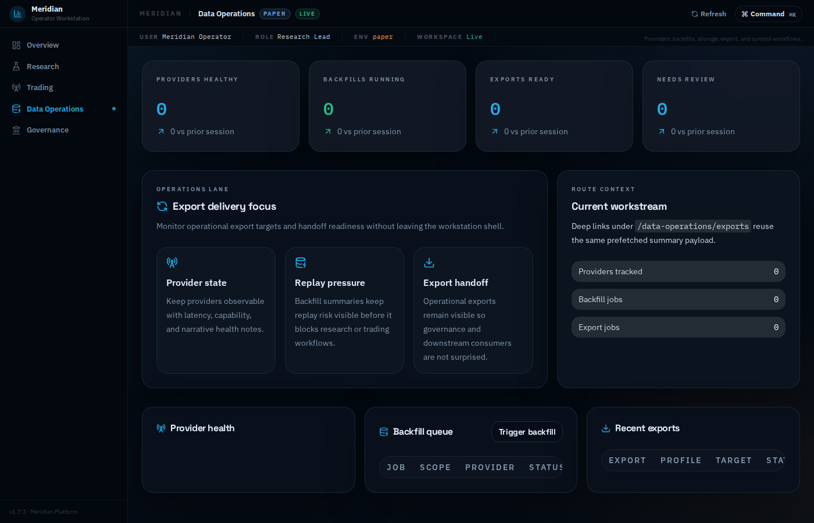

# Meridian UI Screenshots

Screenshots of the Meridian Terminal web dashboard running in default (no-provider) mode.

## How to run

```bash
dotnet build src/Meridian/Meridian.csproj -c Release /p:EnableWindowsTargeting=true
cd src/Meridian/bin/Release/net9.0
MDC_AUTH_MODE=optional ./Meridian --ui --http-port 8200
# open http://localhost:8200
```

---

## 01 – Main Dashboard

Full-page view of the Meridian Terminal dashboard (`/`). Shows the overview panel, activity log, data provider selector, storage configuration, data sources, historical backfill controls, derivatives tracking, and subscribed symbols table.


---

## 02 – React Workstation Shell

The React-based trading workstation is served at `/workstation/` and provides the modern portfolio/trading workspace UI.


---

## 03 – Swagger API Docs

Interactive REST API documentation is available at `/swagger/index.html` and covers all 300+ API routes (backfill, providers, storage, security master, execution, etc.).


---

## 04 – Storage Configuration & Data Sources

Mid-page view showing the **Storage Configuration** card (data root path, naming convention, date partitioning, preview path) and the top of the **Data Sources** panel with automatic failover toggle.


---

## 05 – Data Provider Selector

The **Data Provider** card at the top of the dashboard, showing the live-connection provider dropdown and per-provider credential/settings panel.


---

## 06 – Data Sources Panel

The **Data Sources** panel listing all registered providers, their failover priority order, and the automatic-failover toggle.


---

## 07 – Historical Backfill

The **Historical Backfill** section, showing the provider selector, symbol and date-range inputs, and the rolling status terminal for in-progress backfill jobs.


---

## 08 – Derivatives Tracking

The **Derivatives** panel for configuring options / futures data collection, including underlying symbol entry and options-chain provider status.


---

## 09 – Subscribed Symbols

The **Subscribed Symbols** table showing the active symbol list with data-type columns and the add/remove controls.


---

## 10 – Workstation: Research

The **Research** workspace of the React workstation shell, covering backtests, strategy run comparisons, QuantScript execution results, and experiment tracking.


---

## 11 – Workstation: Trading

The **Trading** workspace of the React workstation shell, showing the paper-trading cockpit, live positions blotter, open orders, fills history, and risk guardrails.


---

## 12 – Workstation: Data Operations

The **Data Operations** workspace of the React workstation shell, covering provider health, active backfills, storage tiers, exports, and symbol-management workflows.


---

## 13 – Workstation: Governance

The **Governance** workspace of the React workstation shell, showing the fund ledger overview, risk audit history, reconciliation breaks, diagnostics, and operational settings.


---

## 14 – Workstation: Trading – Orders

The **Orders blotter** deep-link within the Trading workspace, showing working and partially filled trading orders with status, fill quantity, and execution detail.


---

## 15 – Workstation: Trading – Positions

The **Positions** deep-link within the Trading workspace, showing live positions, exposure, marks, and unrealized P&L.


---

## 16 – Workstation: Trading – Risk

The **Risk guardrails** deep-link within the Trading workspace, showing the trading risk cockpit, position limits, drawdown stops, and order-rate throttle state.



---

## 17 – Workstation: Data Operations – Providers

The **Provider health** deep-link within the Data Operations workspace, showing feed status, latency metrics, and operational notes for each registered provider.


---

## 18 – Workstation: Data Operations – Backfills

The **Backfill queue** deep-link within the Data Operations workspace, showing active backfill jobs, progress, and review items.


---

## 19 – Workstation: Data Operations – Exports

The **Storage exports** deep-link within the Data Operations workspace, showing export profiles and recent delivery targets.



---

## 20 – Workstation: Governance – Ledger

The **Ledger overview** deep-link within the Governance workspace, showing cash flow summaries and audit-facing ledger details.


---

## 21 – Workstation: Governance – Reconciliation

The **Reconciliation history** deep-link within the Governance workspace, showing open breaks, balanced runs, and reconciliation detail.


---

## 22 – Workstation: Governance – Security Master

The **Security master coverage** deep-link within the Governance workspace, showing unresolved references and coverage risk across the instrument universe.


