# Meridian UI Screenshots

Screenshots of Meridian operator surfaces. The authoritative current catalog is the WPF desktop set under [`desktop/`](desktop/); the older web/API captures in this file are retained as historical reference.

## Current Desktop Highlight

The current Governance assurance workflow centers the desktop **Security Master** page, which now carries the workstation context strip, trust/freshness posture, and grouped assurance entry point.

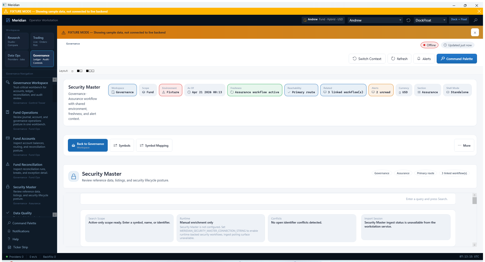

## How to run (WPF desktop)

```powershell
dotnet build src/Meridian.Wpf/Meridian.Wpf.csproj -c Release -p:TargetFramework=net9.0-windows
$env:MDC_FIXTURE_MODE = '1'
dotnet run --project src/Meridian.Wpf/Meridian.Wpf.csproj --no-build -c Release
```

Desktop screenshots are stored under [`desktop/`](desktop/) and are captured using Windows UI Automation against the desktop shell.

---

## Legacy Web And API Captures

## 01 – Main Dashboard

Full-page view of the Meridian Terminal dashboard (`/`). Shows the overview panel, activity log, data provider selector, storage configuration, data sources, historical backfill controls, derivatives tracking, and subscribed symbols table.


---

## 02 – React Workstation Shell

The React-based trading workstation is served at `/workstation/` and provides the modern portfolio/trading workspace UI.

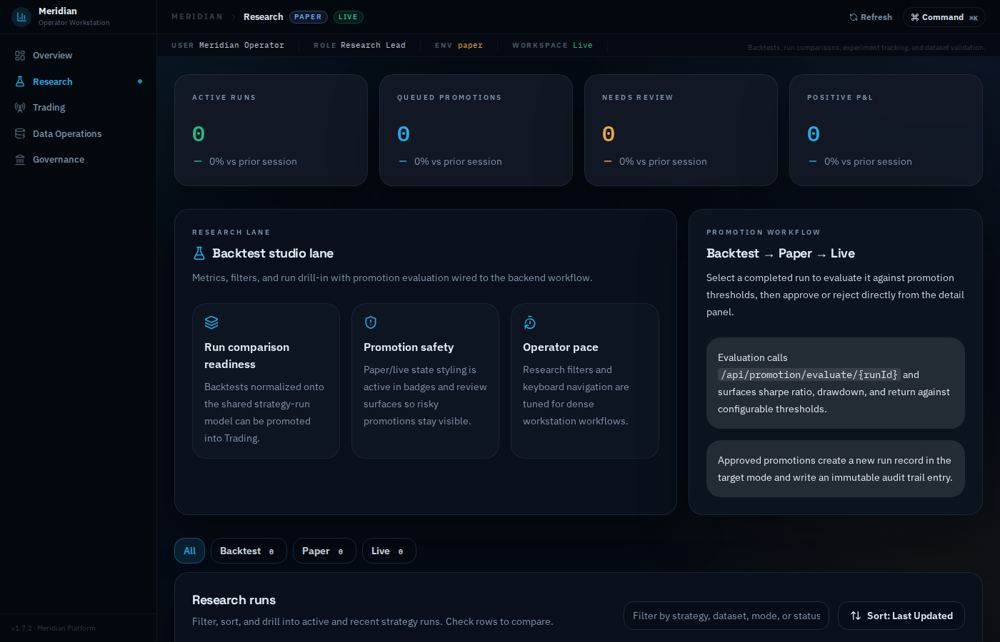

---

## 03 – Swagger API Docs

Interactive REST API documentation is available at `/swagger/index.html` and covers all 300+ API routes (backfill, providers, storage, security master, execution, etc.).

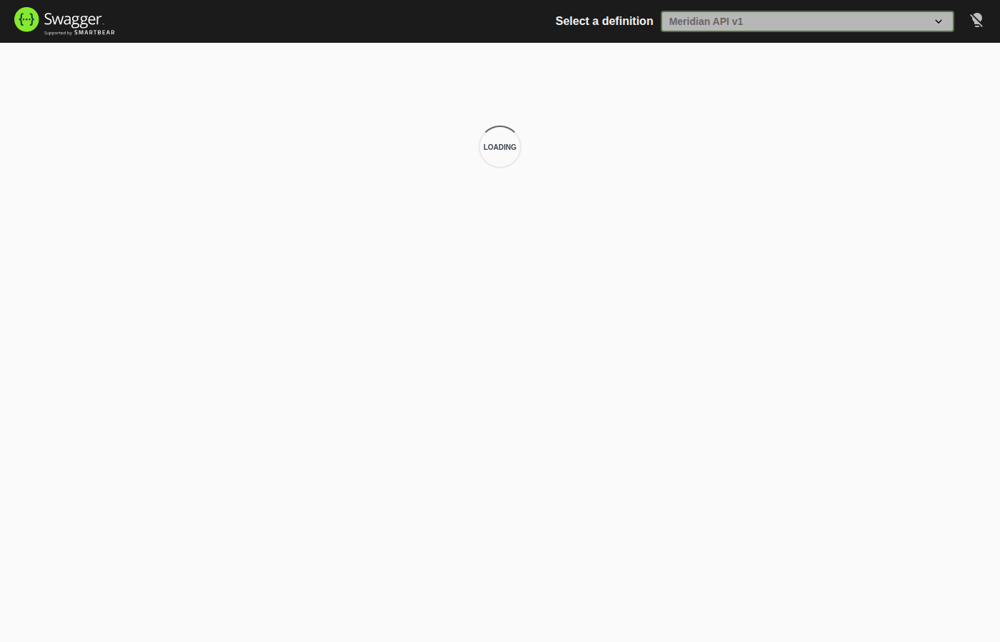

---

## 04 – Storage Configuration & Data Sources

Mid-page view showing the **Storage Configuration** card (data root path, naming convention, date partitioning, preview path) and the top of the **Data Sources** panel with automatic failover toggle.


---

## 05 – Data Provider Selector

The **Data Provider** card at the top of the dashboard, showing the live-connection provider dropdown and per-provider credential/settings panel.

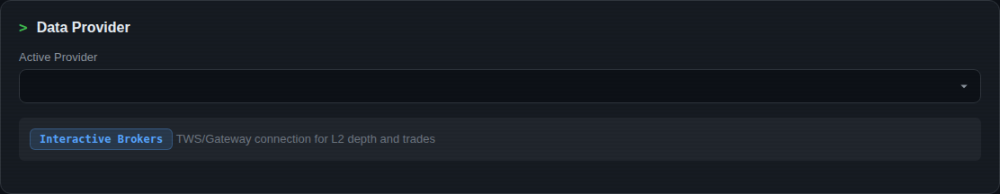

---

## 06 – Data Sources Panel

The **Data Sources** panel listing all registered providers, their failover priority order, and the automatic-failover toggle.

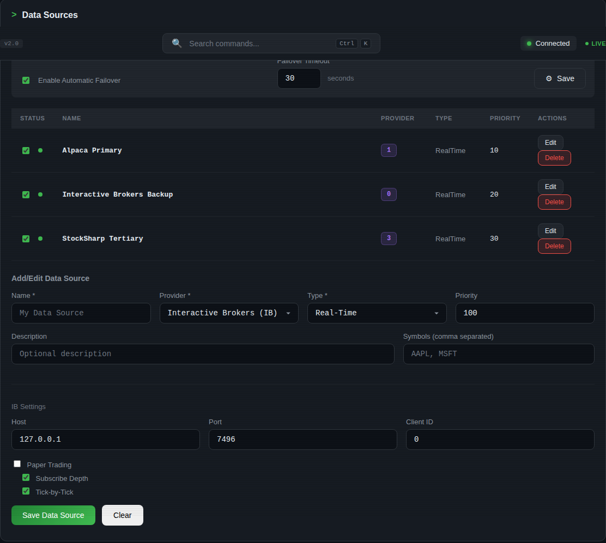

---

## 07 – Historical Backfill

The **Historical Backfill** section, showing the provider selector, symbol and date-range inputs, and the rolling status terminal for in-progress backfill jobs.

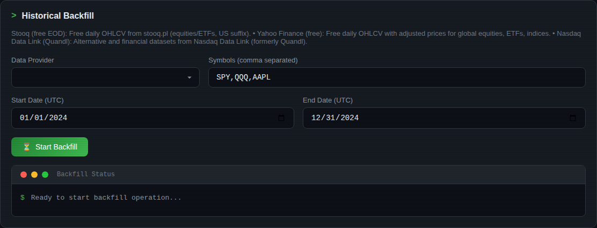

---

## 08 – Derivatives Tracking

The **Derivatives** panel for configuring options / futures data collection, including underlying symbol entry and options-chain provider status.

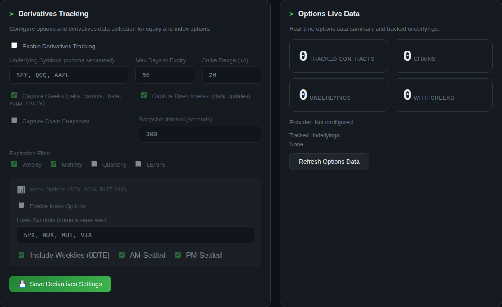

---

## 09 – Subscribed Symbols

The **Subscribed Symbols** table showing the active symbol list with data-type columns and the add/remove controls.

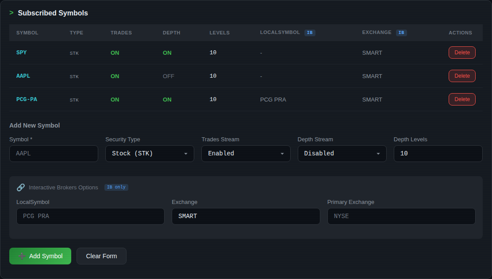

---

## 10 – Status & Activity Log

The **Status & Activity Log** section at the top of the dashboard showing the live metrics grid (published events, dropped events, integrity events, historical bars) and the scrolling activity log terminal.

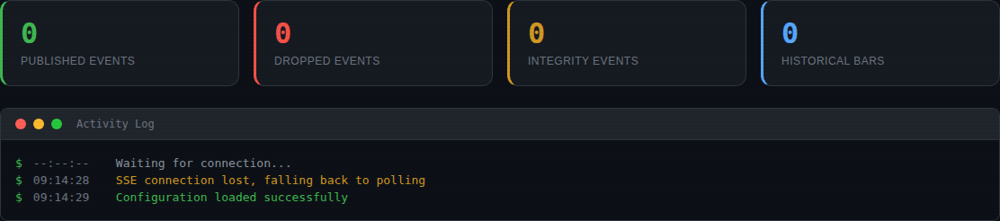

---

## 11 – Login Page

The **Sign In** page served at `/login`, used when Meridian Terminal is running in authenticated mode (`MDC_AUTH_MODE=required`). Shows the username/password form with the same dark terminal theme as the main dashboard.

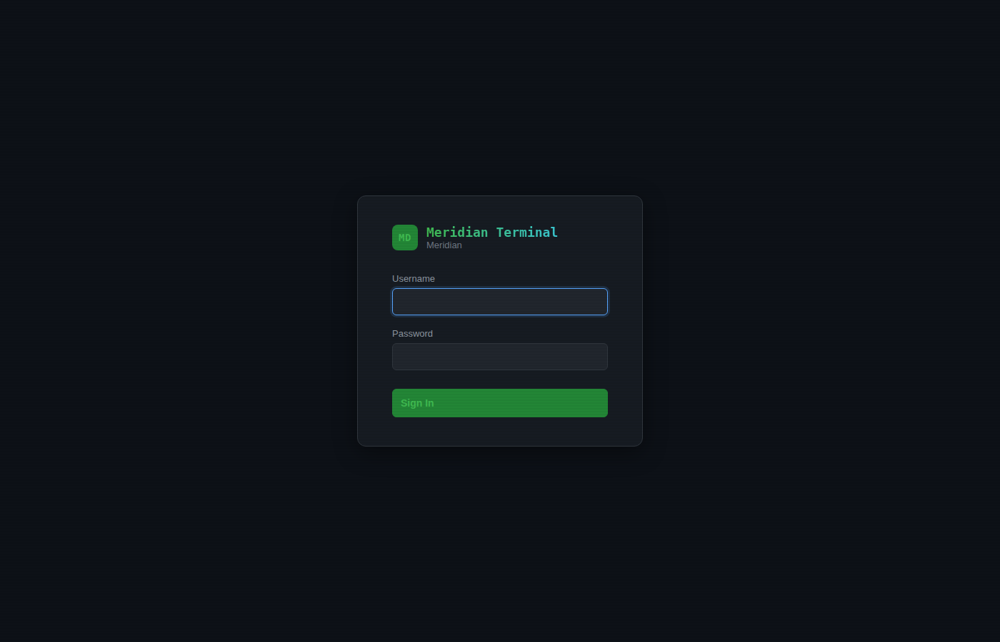

---

## 12 – Workstation: Trading

The **Trading** workspace of the React workstation shell, showing the paper-trading cockpit, live positions blotter, open orders, fills history, and risk guardrails.

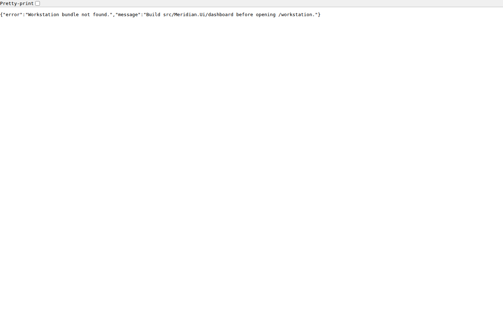

---

## 13 – Workstation: Data Operations

The **Data Operations** workspace of the React workstation shell, covering provider health, active backfills, storage tiers, exports, and symbol-management workflows.


---

## 14 – Workstation: Governance

The **Governance** workspace of the React workstation shell, showing the fund ledger overview, risk audit history, reconciliation breaks, diagnostics, and operational settings.


---

## 15 – Workstation: Trading – Orders

The **Orders blotter** deep-link within the Trading workspace, showing working and partially filled trading orders with status, fill quantity, and execution detail.


---

## 16 – Workstation: Trading – Positions

The **Positions** deep-link within the Trading workspace, showing live positions, exposure, marks, and unrealized P&L.

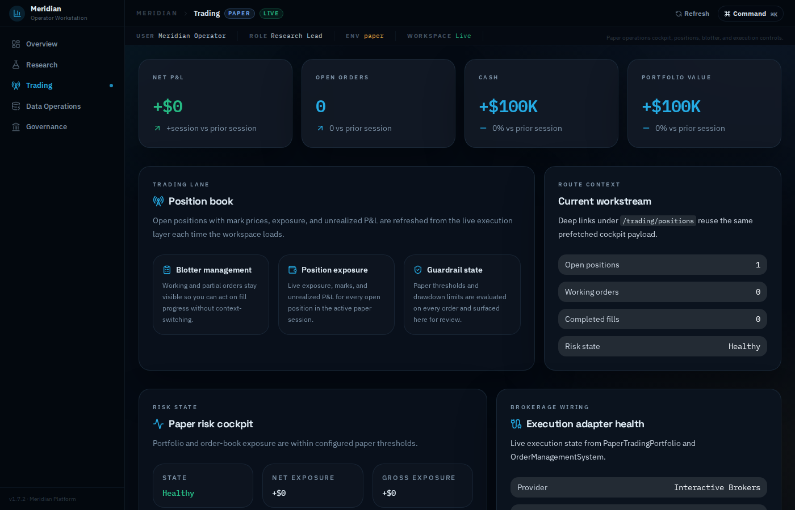

---

## 17 – Workstation: Trading – Risk

The **Risk guardrails** deep-link within the Trading workspace, showing the trading risk cockpit, position limits, drawdown stops, and order-rate throttle state.


---

## 18 – Workstation: Data Operations – Providers

The **Provider health** deep-link within the Data Operations workspace, showing feed status, latency metrics, and operational notes for each registered provider.

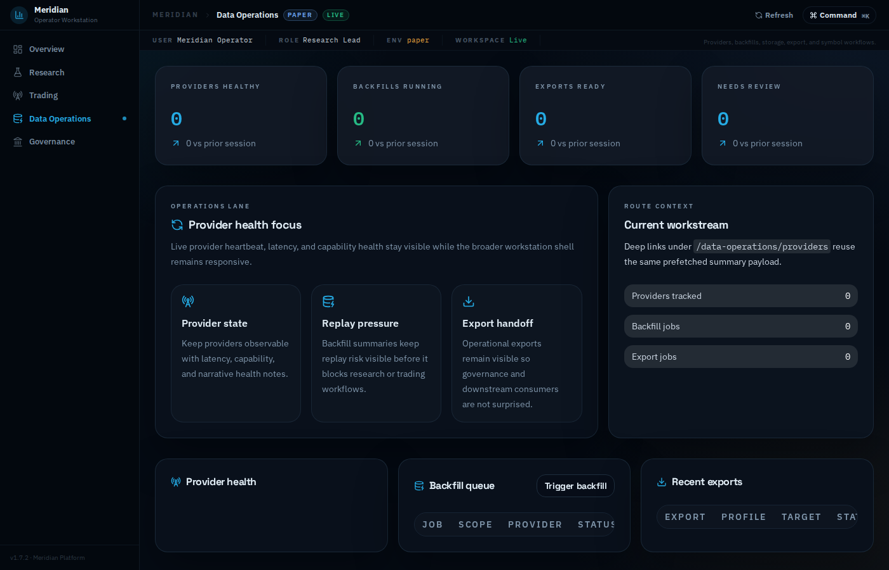

---

## 19 – Workstation: Data Operations – Backfills

The **Backfill queue** deep-link within the Data Operations workspace, showing active backfill jobs, progress, and review items.

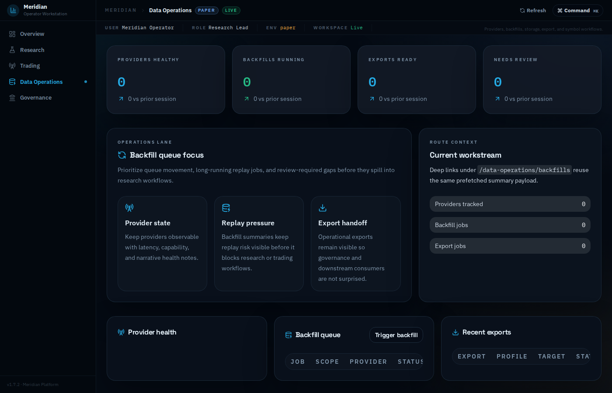

---

## 20 – Workstation: Data Operations – Exports

The **Storage exports** deep-link within the Data Operations workspace, showing export profiles and recent delivery targets.


---

## 21 – Workstation: Governance – Ledger

The **Ledger overview** deep-link within the Governance workspace, showing cash flow summaries and audit-facing ledger details.


---

## 22 – Workstation: Governance – Reconciliation

The **Reconciliation history** deep-link within the Governance workspace, showing open breaks, balanced runs, and reconciliation detail.


---

## 23 – Workstation: Governance – Security Master

The **Security master coverage** deep-link within the Governance workspace, showing unresolved references and coverage risk across the instrument universe.


---

## WPF Desktop Catalog

The following screenshots are captured from the WPF desktop application running in
fixture mode (`MDC_FIXTURE_MODE=1`). They live under the [`desktop/`](desktop/) subdirectory.

`D13` reflects the current governance assurance-oriented Security Master workstation surface.

| # | Page | File |
|---|------|------|
| D01 | Dashboard | [`desktop/wpf-dashboard.png`](desktop/wpf-dashboard.png) |
| D02 | Providers | [`desktop/wpf-providers.png`](desktop/wpf-providers.png) |
| D03 | Provider Health | [`desktop/wpf-provider-health.png`](desktop/wpf-provider-health.png) |
| D04 | Backfill | [`desktop/wpf-backfill.png`](desktop/wpf-backfill.png) |
| D05 | Symbols | [`desktop/wpf-symbols.png`](desktop/wpf-symbols.png) |
| D06 | Live Data | [`desktop/wpf-live-data.png`](desktop/wpf-live-data.png) |
| D07 | Storage | [`desktop/wpf-storage.png`](desktop/wpf-storage.png) |
| D08 | Data Quality | [`desktop/wpf-data-quality.png`](desktop/wpf-data-quality.png) |
| D09 | Data Browser | [`desktop/wpf-data-browser.png`](desktop/wpf-data-browser.png) |
| D10 | Strategy Runs | [`desktop/wpf-strategy-runs.png`](desktop/wpf-strategy-runs.png) |
| D11 | Backtest | [`desktop/wpf-backtest.png`](desktop/wpf-backtest.png) |
| D12 | Quant Script | [`desktop/wpf-quant-script.png`](desktop/wpf-quant-script.png) |
| D13 | Security Master | [`desktop/wpf-security-master.png`](desktop/wpf-security-master.png) |
| D14 | Diagnostics | [`desktop/wpf-diagnostics.png`](desktop/wpf-diagnostics.png) |
| D15 | Settings | [`desktop/wpf-settings.png`](desktop/wpf-settings.png) |
