<!--
generated: true
generator: scripts/generate-diagrams.mjs --tracker-only
generator_version: 1.0.0
render_contract: meridian.generated-docs.v1
inputs:
  - src/Meridian.Wpf/Features/**/*.cs
  - src/Meridian.Wpf/Models/ShellNavigationCatalog*.cs
  - src/Meridian.Wpf/Shell/Services/ShellPageRegistryBuilder.cs
  - docs/screenshots/desktop/README.md
  - tests/Meridian.Wpf.Tests/**/*.cs
do_not_edit: true
-->
# WPF Screen Development Tracker

This tracker is generated from the live WPF shell registry, the maintained desktop screenshot index, and a text scan of `tests/Meridian.Wpf.Tests` for route, page, and view-model references. It tracks source-derived evidence only; roadmap priority and product scope still belong in `docs/roadmap/data/*.yml` and the design document.

- Source fingerprint: `a8012535ae1e`
- Baseline date for open Gantt tasks: `2026-06-17`
- Registered WPF screens: `92`
- Open automated tasks: `77`

## Workspace Summary

| Workspace | Screens | Primary | Secondary | Overflow | Screenshot evidence | Test references | Open tasks |
| --- | ---: | ---: | ---: | ---: | ---: | ---: | ---: |
| Trading | 6 | 5 | 1 | 0 | 1 | 6 | 5 |
| Portfolio | 9 | 4 | 4 | 1 | 0 | 9 | 9 |
| Accounting | 14 | 6 | 8 | 0 | 0 | 14 | 14 |
| Reporting | 8 | 5 | 3 | 0 | 1 | 8 | 7 |
| Strategy | 13 | 6 | 3 | 3 | 4 | 13 | 9 |
| Data | 25 | 6 | 9 | 10 | 7 | 25 | 18 |
| Settings | 17 | 5 | 6 | 6 | 2 | 17 | 15 |

## Gantt Chart

The Mermaid Gantt view uses deterministic evidence buckets, not delivery promises. Completed items have committed screenshot and test-reference evidence; active items show the next generated proof task.

```mermaid
gantt
    title WPF screen development evidence tracker
    dateFormat  YYYY-MM-DD
    axisFormat  %b %d
    section Trading
    Trading Workspace Needs screenshot :crit, active, trading_tradingshell, 2026-06-17, 3d
    Live data evidence :done, trading_livedata, 2026-06-16, 1d
    Order book Needs screenshot :crit, active, trading_orderbook, 2026-06-17, 3d
    Position blotter Needs screenshot :crit, active, trading_positionblotter, 2026-06-17, 3d
    Run risk Needs screenshot :crit, active, trading_runrisk, 2026-06-17, 3d
    Trading hours Needs screenshot :active, trading_tradinghours, 2026-06-17, 3d
    section Portfolio
    Direct lending Needs screenshot :active, portfolio_directlending, 2026-06-17, 3d
    Portfolio Workspace Needs screenshot :crit, active, portfolio_portfolioshell, 2026-06-17, 3d
    Account portfolio Needs screenshot :crit, active, portfolio_accountportfolio, 2026-06-17, 3d
    Aggregate portfolio Needs screenshot :crit, active, portfolio_aggregateportfolio, 2026-06-17, 3d
    Run portfolio Needs screenshot :crit, active, portfolio_runportfolio, 2026-06-17, 3d
    Portfolio explorer Needs screenshot index row :active, portfolio_portfolioexplorer, 2026-06-17, 3d
    Fund portfolio Needs screenshot :active, portfolio_fundportfolio, 2026-06-17, 3d
    Fund accounts Needs screenshot :active, portfolio_fundaccounts, 2026-06-17, 3d
    Portfolio import Needs screenshot :active, portfolio_portfolioimport, 2026-06-17, 3d
    section Accounting
    Accounting Workspace Needs screenshot :crit, active, accounting_accountingshell, 2026-06-17, 3d
    Entity setup Needs screenshot :crit, active, accounting_fundstructuresetup, 2026-06-17, 3d
    Fund operations Needs screenshot :crit, active, accounting_fundledger, 2026-06-17, 3d
    Run ledger Needs screenshot :crit, active, accounting_runledger, 2026-06-17, 3d
    Run cash flow Needs screenshot :crit, active, accounting_runcashflow, 2026-06-17, 3d
    Fund reconciliation Needs screenshot :crit, active, accounting_fundreconciliation, 2026-06-17, 3d
    Fund banking Needs screenshot :active, accounting_fundbanking, 2026-06-17, 3d
    Fund cash and financing Needs screenshot :active, accounting_fundcashfinancing, 2026-06-17, 3d
    Accounting configure Needs screenshot index row :active, accounting_fundaccountingconfigure, 2026-06-17, 3d
    Accounting close Needs screenshot index row :active, accounting_fundaccountingclose, 2026-06-17, 3d
    Fund trial balance Needs screenshot :active, accounting_fundtrialbalance, 2026-06-17, 3d
    Ledger explorer Needs screenshot index row :active, accounting_ledgerexplorer, 2026-06-17, 3d
    Fund audit trail Needs screenshot :active, accounting_fundaudittrail, 2026-06-17, 3d
    Security and instrument explorer Needs screenshot index row :active, accounting_securityinstrumentexplorer, 2026-06-17, 3d
    section Reporting
    Reporting Workspace Needs screenshot :crit, active, reporting_reportingshell, 2026-06-17, 3d
    Fund report pack Needs screenshot :crit, active, reporting_fundreportpack, 2026-06-17, 3d
    Report run status Needs screenshot :crit, active, reporting_reportrunstatus, 2026-06-17, 3d
    Reporting dashboard evidence :done, reporting_dashboard, 2026-06-16, 1d
    Analysis export Needs screenshot :crit, active, reporting_analysisexport, 2026-06-17, 3d
    Report-line provenance Needs screenshot index row :active, reporting_reportlineprovenanceexplorer, 2026-06-17, 3d
    Analysis export wizard Needs screenshot :active, reporting_analysisexportwizard, 2026-06-17, 3d
    Export presets Needs screenshot :active, reporting_exportpresets, 2026-06-17, 3d
    section Strategy
    Lean integration Needs screenshot :active, strategy_leanintegration, 2026-06-17, 3d
    Event replay Needs screenshot :active, strategy_eventreplay, 2026-06-17, 3d
    Watchlist Needs screenshot :active, strategy_watchlist, 2026-06-17, 3d
    Strategy Workspace evidence :done, strategy_strategyshell, 2026-06-16, 1d
    Backtest evidence :done, strategy_backtest, 2026-06-16, 1d
    Strategy runs evidence :done, strategy_strategyruns, 2026-06-16, 1d
    Run detail Needs screenshot :crit, active, strategy_rundetail, 2026-06-17, 3d
    Charts Needs screenshot :crit, active, strategy_charts, 2026-06-17, 3d
    Run scripts Needs screenshot :crit, active, strategy_runmat, 2026-06-17, 3d
    Batch backtest Needs screenshot :active, strategy_batchbacktest, 2026-06-17, 3d
    Advanced analytics Needs screenshot :active, strategy_advancedanalytics, 2026-06-17, 3d
    Quant script evidence :done, strategy_quantscript, 2026-06-16, 1d
    Home Needs screenshot index row :active, strategy_homeworkspace, 2026-06-17, 3d
    section Data
    Data browser evidence :done, data_databrowser, 2026-06-16, 1d
    Data calendar Needs screenshot :active, data_datacalendar, 2026-06-17, 3d
    Data sampling Needs screenshot :active, data_datasampling, 2026-06-17, 3d
    Time series alignment Needs screenshot :active, data_timeseriesalignment, 2026-06-17, 3d
    Index subscription Needs screenshot :active, data_indexsubscription, 2026-06-17, 3d
    Options Needs screenshot :active, data_options, 2026-06-17, 3d
    Add provider wizard Needs screenshot :active, data_addproviderwizard, 2026-06-17, 3d
    Archive health Needs screenshot :active, data_archivehealth, 2026-06-17, 3d
    Storage optimization Needs screenshot :active, data_storageoptimization, 2026-06-17, 3d
    Retention assurance Needs screenshot :active, data_retentionassurance, 2026-06-17, 3d
    Data Workspace Needs screenshot :crit, active, data_datashell, 2026-06-17, 3d
    Providers evidence :done, data_provider, 2026-06-16, 1d
    Backfill evidence :done, data_backfill, 2026-06-16, 1d
    Symbols Needs screenshot :crit, active, data_symbols, 2026-06-17, 3d
    Storage evidence :done, data_storage, 2026-06-16, 1d
    Data export Needs screenshot :crit, active, data_dataexport, 2026-06-17, 3d
    Data sources Needs screenshot :active, data_datasources, 2026-06-17, 3d
    Provider health evidence :done, data_providerhealth, 2026-06-16, 1d
    Data quality evidence :done, data_dataquality, 2026-06-16, 1d
    Security master evidence :done, data_securitymaster, 2026-06-16, 1d
    Symbol mapping Needs screenshot :active, data_symbolmapping, 2026-06-17, 3d
    Symbol storage Needs screenshot :active, data_symbolstorage, 2026-06-17, 3d
    Schedules Needs screenshot :active, data_schedules, 2026-06-17, 3d
    Collection sessions Needs screenshot :active, data_collectionsessions, 2026-06-17, 3d
    Package manager Needs screenshot :active, data_packagemanager, 2026-06-17, 3d
    section Settings
    Activity log Needs screenshot :active, settings_activitylog, 2026-06-17, 3d
    Keyboard shortcuts Needs screenshot :active, settings_keyboardshortcuts, 2026-06-17, 3d
    Help and support Needs screenshot :active, settings_help, 2026-06-17, 3d
    Setup wizard Needs screenshot :active, settings_setupwizard, 2026-06-17, 3d
    Workspace layouts Needs screenshot :active, settings_workspaces, 2026-06-17, 3d
    Welcome Needs screenshot :active, settings_welcome, 2026-06-17, 3d
    Settings Workspace Needs screenshot :crit, active, settings_settingsshell, 2026-06-17, 3d
    Settings evidence :done, settings_settings, 2026-06-16, 1d
    Credential management Needs screenshot :crit, active, settings_credentialmanagement, 2026-06-17, 3d
    System health Needs screenshot :crit, active, settings_systemhealth, 2026-06-17, 3d
    Diagnostics evidence :done, settings_diagnostics, 2026-06-16, 1d
    Service manager Needs screenshot :active, settings_servicemanager, 2026-06-17, 3d
    Admin maintenance Needs screenshot :active, settings_adminmaintenance, 2026-06-17, 3d
    Environment designer Needs screenshot :active, settings_environmentdesigner, 2026-06-17, 3d
    Messaging hub Needs screenshot :active, settings_messaginghub, 2026-06-17, 3d
    Notification center Needs screenshot :active, settings_notificationcenter, 2026-06-17, 3d
    Workflow library Needs screenshot :active, settings_workflowlibrary, 2026-06-17, 3d
```

## Automated Screen TODOs

### Trading

#### Trading Workspace (`TradingShell`)

- Workspace section: `Desk`; visibility: `Primary`; page class: `TradingWorkspaceShellPage`.
- Status: `Needs screenshot`.
- [x] Registered in the WPF shell registry as TradingShell (TradingWorkspaceShellPage).
- [ ] Capture a fixture-mode desktop screenshot for TradingShell or record an explicit non-capture decision.
- [x] WPF route/view-model test reference found in tests/Meridian.Wpf.Tests/Features/Trading/TradingFeatureModuleTests.cs, tests/Meridian.Wpf.Tests/Models/ShellNavigationCatalogTests.cs, tests/Meridian.Wpf.Tests/Models/WorkspaceShellChromeContributionTests.cs, +19 more.

#### Live data (`LiveData`)

- Workspace section: `Market Feed`; visibility: `Primary`; page class: `LiveDataViewerPage`.
- Status: `Evidence current`.
- [x] Registered in the WPF shell registry as LiveData (LiveDataViewerPage).
- [x] Screenshot evidence is committed at docs/screenshots/desktop/wpf-live-data.png (2026-06-16).
- [x] WPF route/view-model test reference found in tests/Meridian.Wpf.Tests/Features/Trading/TradingFeatureModuleTests.cs, tests/Meridian.Wpf.Tests/Models/ShellNavigationCatalogTests.cs, tests/Meridian.Wpf.Tests/Services/NavigationServiceTests.cs, +2 more.

#### Order book (`OrderBook`)

- Workspace section: `Market Feed`; visibility: `Primary`; page class: `OrderBookPage`.
- Status: `Needs screenshot`.
- [x] Registered in the WPF shell registry as OrderBook (OrderBookPage).
- [ ] Capture a fixture-mode desktop screenshot for OrderBook or record an explicit non-capture decision.
- [x] WPF route/view-model test reference found in tests/Meridian.Wpf.Tests/Features/Trading/TradingFeatureModuleTests.cs, tests/Meridian.Wpf.Tests/Models/ShellNavigationCatalogTests.cs, tests/Meridian.Wpf.Tests/Services/AppServiceRegistrationTests.cs, +8 more.

#### Position blotter (`PositionBlotter`)

- Workspace section: `Execution`; visibility: `Primary`; page class: `PositionBlotterPage`.
- Status: `Needs screenshot`.
- [x] Registered in the WPF shell registry as PositionBlotter (PositionBlotterPage).
- [ ] Capture a fixture-mode desktop screenshot for PositionBlotter or record an explicit non-capture decision.
- [x] WPF route/view-model test reference found in tests/Meridian.Wpf.Tests/Features/Trading/TradingFeatureModuleTests.cs, tests/Meridian.Wpf.Tests/Models/ShellNavigationCatalogTests.cs, tests/Meridian.Wpf.Tests/Services/NavigationServiceTests.cs, +10 more.

#### Run risk (`RunRisk`)

- Workspace section: `Execution`; visibility: `Primary`; page class: `RunRiskPage`.
- Status: `Needs screenshot`.
- [x] Registered in the WPF shell registry as RunRisk (RunRiskPage).
- [ ] Capture a fixture-mode desktop screenshot for RunRisk or record an explicit non-capture decision.
- [x] WPF route/view-model test reference found in tests/Meridian.Wpf.Tests/Features/Trading/TradingFeatureModuleTests.cs, tests/Meridian.Wpf.Tests/Features/Trading/TradingFeatureServiceRegistrationTests.cs, tests/Meridian.Wpf.Tests/Models/ShellNavigationCatalogTests.cs, +10 more.

#### Trading hours (`TradingHours`)

- Workspace section: `Execution`; visibility: `Secondary`; page class: `TradingHoursPage`.
- Status: `Needs screenshot`.
- [x] Registered in the WPF shell registry as TradingHours (TradingHoursPage).
- [ ] Capture a fixture-mode desktop screenshot for TradingHours or record an explicit non-capture decision.
- [x] WPF route/view-model test reference found in tests/Meridian.Wpf.Tests/Features/Trading/TradingFeatureModuleTests.cs, tests/Meridian.Wpf.Tests/Models/ShellNavigationCatalogTests.cs, tests/Meridian.Wpf.Tests/Services/NavigationServiceTests.cs, +4 more.

### Portfolio

#### Direct lending (`DirectLending`)

- Workspace section: `Specialty`; visibility: `Overflow`; page class: `DirectLendingPage`.
- Status: `Needs screenshot`.
- [x] Registered in the WPF shell registry as DirectLending (DirectLendingPage).
- [ ] Capture a fixture-mode desktop screenshot for DirectLending or record an explicit non-capture decision.
- [x] WPF route/view-model test reference found in tests/Meridian.Wpf.Tests/Features/Portfolio/PortfolioFeatureModuleTests.cs, tests/Meridian.Wpf.Tests/ViewModels/AccountingConfigureViewModelTests.cs, tests/Meridian.Wpf.Tests/ViewModels/DirectLendingViewModelTests.cs, +2 more.

#### Portfolio Workspace (`PortfolioShell`)

- Workspace section: `Launchpad`; visibility: `Primary`; page class: `PortfolioWorkspaceShellPage`.
- Status: `Needs screenshot`.
- [x] Registered in the WPF shell registry as PortfolioShell (PortfolioWorkspaceShellPage).
- [ ] Capture a fixture-mode desktop screenshot for PortfolioShell or record an explicit non-capture decision.
- [x] WPF route/view-model test reference found in tests/Meridian.Wpf.Tests/Features/Portfolio/PortfolioFeatureModuleTests.cs, tests/Meridian.Wpf.Tests/Models/ShellNavigationCatalogTests.cs, tests/Meridian.Wpf.Tests/Services/NavigationServiceTests.cs, +9 more.

#### Account portfolio (`AccountPortfolio`)

- Workspace section: `Accounts`; visibility: `Primary`; page class: `AccountPortfolioPage`.
- Status: `Needs screenshot`.
- [x] Registered in the WPF shell registry as AccountPortfolio (AccountPortfolioPage).
- [ ] Capture a fixture-mode desktop screenshot for AccountPortfolio or record an explicit non-capture decision.
- [x] WPF route/view-model test reference found in tests/Meridian.Wpf.Tests/Features/Accounting/AccountingFeatureServiceRegistrationTests.cs, tests/Meridian.Wpf.Tests/Features/Portfolio/PortfolioFeatureModuleTests.cs, tests/Meridian.Wpf.Tests/Models/ShellNavigationCatalogTests.cs, +10 more.

#### Aggregate portfolio (`AggregatePortfolio`)

- Workspace section: `Accounts`; visibility: `Primary`; page class: `AggregatePortfolioPage`.
- Status: `Needs screenshot`.
- [x] Registered in the WPF shell registry as AggregatePortfolio (AggregatePortfolioPage).
- [ ] Capture a fixture-mode desktop screenshot for AggregatePortfolio or record an explicit non-capture decision.
- [x] WPF route/view-model test reference found in tests/Meridian.Wpf.Tests/Features/Portfolio/PortfolioFeatureModuleTests.cs, tests/Meridian.Wpf.Tests/Shell/ShellRouteRegistryTests.cs, tests/Meridian.Wpf.Tests/ViewModels/AggregatePortfolioViewModelTests.cs, +1 more.

#### Run portfolio (`RunPortfolio`)

- Workspace section: `Run Inspectors`; visibility: `Primary`; page class: `RunPortfolioPage`.
- Status: `Needs screenshot`.
- [x] Registered in the WPF shell registry as RunPortfolio (RunPortfolioPage).
- [ ] Capture a fixture-mode desktop screenshot for RunPortfolio or record an explicit non-capture decision.
- [x] WPF route/view-model test reference found in tests/Meridian.Wpf.Tests/Features/Portfolio/PortfolioFeatureModuleTests.cs, tests/Meridian.Wpf.Tests/Features/Strategy/StrategyFeatureServiceRegistrationTests.cs, tests/Meridian.Wpf.Tests/Models/ShellNavigationCatalogTests.cs, +9 more.

#### Portfolio explorer (`PortfolioExplorer`)

- Workspace section: `Run Inspectors`; visibility: `Secondary`; page class: `FinancialRecordExplorerPage`.
- Status: `Needs screenshot index row`.
- [x] Registered in the WPF shell registry as PortfolioExplorer (FinancialRecordExplorerPage).
- [ ] Add PortfolioExplorer to docs/screenshots/desktop/README.md with TBI coverage or committed PNG evidence.
- [x] WPF route/view-model test reference found in tests/Meridian.Wpf.Tests/Features/Accounting/AccountingFeatureServiceRegistrationTests.cs, tests/Meridian.Wpf.Tests/Features/Portfolio/PortfolioFeatureModuleTests.cs, tests/Meridian.Wpf.Tests/Models/ShellNavigationCatalogTests.cs, +3 more.

#### Fund portfolio (`FundPortfolio`)

- Workspace section: `Fund`; visibility: `Secondary`; page class: `FundLedgerPage`.
- Status: `Needs screenshot`.
- [x] Registered in the WPF shell registry as FundPortfolio (FundLedgerPage).
- [ ] Capture a fixture-mode desktop screenshot for FundPortfolio or record an explicit non-capture decision.
- [x] WPF route/view-model test reference found in tests/Meridian.Wpf.Tests/Features/Accounting/AccountingFeatureServiceRegistrationTests.cs, tests/Meridian.Wpf.Tests/Features/Portfolio/PortfolioFeatureModuleTests.cs, tests/Meridian.Wpf.Tests/Services/AppServiceRegistrationTests.cs, +4 more.

#### Fund accounts (`FundAccounts`)

- Workspace section: `Fund`; visibility: `Secondary`; page class: `FundAccountsPage`.
- Status: `Needs screenshot`.
- [x] Registered in the WPF shell registry as FundAccounts (FundAccountsPage).
- [ ] Capture a fixture-mode desktop screenshot for FundAccounts or record an explicit non-capture decision.
- [x] WPF route/view-model test reference found in tests/Meridian.Wpf.Tests/Features/Accounting/AccountingFeatureServiceRegistrationTests.cs, tests/Meridian.Wpf.Tests/Features/Portfolio/PortfolioFeatureModuleTests.cs, tests/Meridian.Wpf.Tests/Services/AppServiceRegistrationTests.cs, +9 more.

#### Portfolio import (`PortfolioImport`)

- Workspace section: `Import`; visibility: `Secondary`; page class: `PortfolioImportPage`.
- Status: `Needs screenshot`.
- [x] Registered in the WPF shell registry as PortfolioImport (PortfolioImportPage).
- [ ] Capture a fixture-mode desktop screenshot for PortfolioImport or record an explicit non-capture decision.
- [x] WPF route/view-model test reference found in tests/Meridian.Wpf.Tests/Features/Portfolio/PortfolioFeatureModuleTests.cs, tests/Meridian.Wpf.Tests/Models/ShellNavigationCatalogTests.cs, tests/Meridian.Wpf.Tests/Services/NavigationServiceTests.cs, +2 more.

### Accounting

#### Accounting Workspace (`AccountingShell`)

- Workspace section: `Launchpad`; visibility: `Primary`; page class: `AccountingWorkspaceShellPage`.
- Status: `Needs screenshot`.
- [x] Registered in the WPF shell registry as AccountingShell (AccountingWorkspaceShellPage).
- [ ] Capture a fixture-mode desktop screenshot for AccountingShell or record an explicit non-capture decision.
- [x] WPF route/view-model test reference found in tests/Meridian.Wpf.Tests/Features/Accounting/AccountingFeatureModuleTests.cs, tests/Meridian.Wpf.Tests/Models/ShellNavigationCatalogTests.cs, tests/Meridian.Wpf.Tests/Services/AppServiceRegistrationTests.cs, +16 more.

#### Entity setup (`FundStructureSetup`)

- Workspace section: `Fund Ops`; visibility: `Primary`; page class: `FundStructureSetupPage`.
- Status: `Needs screenshot`.
- [x] Registered in the WPF shell registry as FundStructureSetup (FundStructureSetupPage).
- [ ] Capture a fixture-mode desktop screenshot for FundStructureSetup or record an explicit non-capture decision.
- [x] WPF route/view-model test reference found in tests/Meridian.Wpf.Tests/Features/Accounting/AccountingFeatureModuleTests.cs, tests/Meridian.Wpf.Tests/Features/Accounting/AccountingFeatureServiceRegistrationTests.cs, tests/Meridian.Wpf.Tests/ViewModels/FundStructureSetupViewModelTests.cs.

#### Fund operations (`FundLedger`)

- Workspace section: `Fund Ops`; visibility: `Primary`; page class: `FundLedgerPage`.
- Status: `Needs screenshot`.
- [x] Registered in the WPF shell registry as FundLedger (FundLedgerPage).
- [ ] Capture a fixture-mode desktop screenshot for FundLedger or record an explicit non-capture decision.
- [x] WPF route/view-model test reference found in tests/Meridian.Wpf.Tests/Features/Accounting/AccountingFeatureModuleTests.cs, tests/Meridian.Wpf.Tests/Features/Accounting/AccountingFeatureServiceRegistrationTests.cs, tests/Meridian.Wpf.Tests/Models/ShellNavigationCatalogTests.cs, +17 more.

#### Run ledger (`RunLedger`)

- Workspace section: `Run Inspectors`; visibility: `Primary`; page class: `RunLedgerPage`.
- Status: `Needs screenshot`.
- [x] Registered in the WPF shell registry as RunLedger (RunLedgerPage).
- [ ] Capture a fixture-mode desktop screenshot for RunLedger or record an explicit non-capture decision.
- [x] WPF route/view-model test reference found in tests/Meridian.Wpf.Tests/Features/Accounting/AccountingFeatureModuleTests.cs, tests/Meridian.Wpf.Tests/Features/Strategy/StrategyFeatureServiceRegistrationTests.cs, tests/Meridian.Wpf.Tests/Models/ShellNavigationCatalogTests.cs, +5 more.

#### Run cash flow (`RunCashFlow`)

- Workspace section: `Run Inspectors`; visibility: `Primary`; page class: `RunCashFlowPage`.
- Status: `Needs screenshot`.
- [x] Registered in the WPF shell registry as RunCashFlow (RunCashFlowPage).
- [ ] Capture a fixture-mode desktop screenshot for RunCashFlow or record an explicit non-capture decision.
- [x] WPF route/view-model test reference found in tests/Meridian.Wpf.Tests/Features/Accounting/AccountingFeatureModuleTests.cs, tests/Meridian.Wpf.Tests/Services/AppServiceRegistrationTests.cs, tests/Meridian.Wpf.Tests/Services/ViewModelViewResolverTests.cs, +2 more.

#### Fund reconciliation (`FundReconciliation`)

- Workspace section: `Fund Ops`; visibility: `Primary`; page class: `FundLedgerPage`.
- Status: `Needs screenshot`.
- [x] Registered in the WPF shell registry as FundReconciliation (FundLedgerPage).
- [ ] Capture a fixture-mode desktop screenshot for FundReconciliation or record an explicit non-capture decision.
- [x] WPF route/view-model test reference found in tests/Meridian.Wpf.Tests/Features/Accounting/AccountingFeatureModuleTests.cs, tests/Meridian.Wpf.Tests/Features/Accounting/AccountingFeatureServiceRegistrationTests.cs, tests/Meridian.Wpf.Tests/Services/AppServiceRegistrationTests.cs, +15 more.

#### Fund banking (`FundBanking`)

- Workspace section: `Fund Ops`; visibility: `Secondary`; page class: `FundLedgerPage`.
- Status: `Needs screenshot`.
- [x] Registered in the WPF shell registry as FundBanking (FundLedgerPage).
- [ ] Capture a fixture-mode desktop screenshot for FundBanking or record an explicit non-capture decision.
- [x] WPF route/view-model test reference found in tests/Meridian.Wpf.Tests/Features/Accounting/AccountingFeatureModuleTests.cs, tests/Meridian.Wpf.Tests/Features/Accounting/AccountingFeatureServiceRegistrationTests.cs, tests/Meridian.Wpf.Tests/Services/AppServiceRegistrationTests.cs, +3 more.

#### Fund cash and financing (`FundCashFinancing`)

- Workspace section: `Fund Ops`; visibility: `Secondary`; page class: `FundLedgerPage`.
- Status: `Needs screenshot`.
- [x] Registered in the WPF shell registry as FundCashFinancing (FundLedgerPage).
- [ ] Capture a fixture-mode desktop screenshot for FundCashFinancing or record an explicit non-capture decision.
- [x] WPF route/view-model test reference found in tests/Meridian.Wpf.Tests/Features/Accounting/AccountingFeatureModuleTests.cs, tests/Meridian.Wpf.Tests/Features/Accounting/AccountingFeatureServiceRegistrationTests.cs, tests/Meridian.Wpf.Tests/Services/AppServiceRegistrationTests.cs, +4 more.

#### Accounting configure (`FundAccountingConfigure`)

- Workspace section: `Fund Ops`; visibility: `Secondary`; page class: `AccountingConfigurePage`.
- Status: `Needs screenshot index row`.
- [x] Registered in the WPF shell registry as FundAccountingConfigure (AccountingConfigurePage).
- [ ] Add FundAccountingConfigure to docs/screenshots/desktop/README.md with TBI coverage or committed PNG evidence.
- [x] WPF route/view-model test reference found in tests/Meridian.Wpf.Tests/Features/Accounting/AccountingFeatureModuleTests.cs, tests/Meridian.Wpf.Tests/ViewModels/AccountingConfigureViewModelTests.cs, tests/Meridian.Wpf.Tests/ViewModels/FinancialRecordExplorerViewModelTests.cs, +3 more.

#### Accounting close (`FundAccountingClose`)

- Workspace section: `Fund Ops`; visibility: `Secondary`; page class: `AccountingClosePage`.
- Status: `Needs screenshot index row`.
- [x] Registered in the WPF shell registry as FundAccountingClose (AccountingClosePage).
- [ ] Add FundAccountingClose to docs/screenshots/desktop/README.md with TBI coverage or committed PNG evidence.
- [x] WPF route/view-model test reference found in tests/Meridian.Wpf.Tests/Features/Accounting/AccountingFeatureModuleTests.cs, tests/Meridian.Wpf.Tests/Services/AppServiceRegistrationTests.cs, tests/Meridian.Wpf.Tests/ViewModels/AccountingCloseViewModelTests.cs.

#### Fund trial balance (`FundTrialBalance`)

- Workspace section: `Fund Ops`; visibility: `Secondary`; page class: `FundLedgerPage`.
- Status: `Needs screenshot`.
- [x] Registered in the WPF shell registry as FundTrialBalance (FundLedgerPage).
- [ ] Capture a fixture-mode desktop screenshot for FundTrialBalance or record an explicit non-capture decision.
- [x] WPF route/view-model test reference found in tests/Meridian.Wpf.Tests/Features/Accounting/AccountingFeatureModuleTests.cs, tests/Meridian.Wpf.Tests/Features/Accounting/AccountingFeatureServiceRegistrationTests.cs, tests/Meridian.Wpf.Tests/Models/ShellNavigationCatalogTests.cs, +9 more.

#### Ledger explorer (`LedgerExplorer`)

- Workspace section: `Fund Ops`; visibility: `Secondary`; page class: `FinancialRecordExplorerPage`.
- Status: `Needs screenshot index row`.
- [x] Registered in the WPF shell registry as LedgerExplorer (FinancialRecordExplorerPage).
- [ ] Add LedgerExplorer to docs/screenshots/desktop/README.md with TBI coverage or committed PNG evidence.
- [x] WPF route/view-model test reference found in tests/Meridian.Wpf.Tests/Features/Accounting/AccountingFeatureModuleTests.cs, tests/Meridian.Wpf.Tests/Features/Accounting/AccountingFeatureServiceRegistrationTests.cs, tests/Meridian.Wpf.Tests/Models/ShellNavigationCatalogTests.cs, +3 more.

#### Fund audit trail (`FundAuditTrail`)

- Workspace section: `Fund Ops`; visibility: `Secondary`; page class: `FundLedgerPage`.
- Status: `Needs screenshot`.
- [x] Registered in the WPF shell registry as FundAuditTrail (FundLedgerPage).
- [ ] Capture a fixture-mode desktop screenshot for FundAuditTrail or record an explicit non-capture decision.
- [x] WPF route/view-model test reference found in tests/Meridian.Wpf.Tests/Features/Accounting/AccountingFeatureModuleTests.cs, tests/Meridian.Wpf.Tests/Features/Accounting/AccountingFeatureServiceRegistrationTests.cs, tests/Meridian.Wpf.Tests/Models/ShellNavigationCatalogTests.cs, +14 more.

#### Security and instrument explorer (`SecurityInstrumentExplorer`)

- Workspace section: `Fund Ops`; visibility: `Secondary`; page class: `FinancialRecordExplorerPage`.
- Status: `Needs screenshot index row`.
- [x] Registered in the WPF shell registry as SecurityInstrumentExplorer (FinancialRecordExplorerPage).
- [ ] Add SecurityInstrumentExplorer to docs/screenshots/desktop/README.md with TBI coverage or committed PNG evidence.
- [x] WPF route/view-model test reference found in tests/Meridian.Wpf.Tests/Features/Accounting/AccountingFeatureModuleTests.cs, tests/Meridian.Wpf.Tests/Features/Accounting/AccountingFeatureServiceRegistrationTests.cs, tests/Meridian.Wpf.Tests/Models/ShellNavigationCatalogTests.cs, +3 more.

### Reporting

#### Reporting Workspace (`ReportingShell`)

- Workspace section: `Launchpad`; visibility: `Primary`; page class: `ReportingWorkspaceShellPage`.
- Status: `Needs screenshot`.
- [x] Registered in the WPF shell registry as ReportingShell (ReportingWorkspaceShellPage).
- [ ] Capture a fixture-mode desktop screenshot for ReportingShell or record an explicit non-capture decision.
- [x] WPF route/view-model test reference found in tests/Meridian.Wpf.Tests/Features/Reporting/ReportingFeatureModuleTests.cs, tests/Meridian.Wpf.Tests/Models/ShellNavigationCatalogTests.cs, tests/Meridian.Wpf.Tests/Shell/ShellRouteRegistryTests.cs, +7 more.

#### Fund report pack (`FundReportPack`)

- Workspace section: `Report Packs`; visibility: `Primary`; page class: `FundLedgerPage`.
- Status: `Needs screenshot`.
- [x] Registered in the WPF shell registry as FundReportPack (FundLedgerPage).
- [ ] Capture a fixture-mode desktop screenshot for FundReportPack or record an explicit non-capture decision.
- [x] WPF route/view-model test reference found in tests/Meridian.Wpf.Tests/Features/Accounting/AccountingFeatureServiceRegistrationTests.cs, tests/Meridian.Wpf.Tests/Features/Reporting/ReportingFeatureModuleTests.cs, tests/Meridian.Wpf.Tests/Services/AppServiceRegistrationTests.cs, +9 more.

#### Report run status (`ReportRunStatus`)

- Workspace section: `Report Packs`; visibility: `Primary`; page class: `DashboardPage`.
- Status: `Needs screenshot`.
- [x] Registered in the WPF shell registry as ReportRunStatus (DashboardPage).
- [ ] Capture a fixture-mode desktop screenshot for ReportRunStatus or record an explicit non-capture decision.
- [x] WPF route/view-model test reference found in tests/Meridian.Wpf.Tests/Features/Reporting/ReportingFeatureModuleTests.cs, tests/Meridian.Wpf.Tests/Support/RunMatUiAutomationFacade.cs, tests/Meridian.Wpf.Tests/ViewModels/WorkspaceCockpitShellViewModelTests.cs, +1 more.

#### Reporting dashboard (`Dashboard`)

- Workspace section: `Dashboard`; visibility: `Primary`; page class: `DashboardPage`.
- Status: `Evidence current`.
- [x] Registered in the WPF shell registry as Dashboard (DashboardPage).
- [x] Screenshot evidence is committed at docs/screenshots/desktop/wpf-dashboard.png (2026-06-16).
- [x] WPF route/view-model test reference found in tests/Meridian.Wpf.Tests/Features/Reporting/ReportingFeatureModuleTests.cs, tests/Meridian.Wpf.Tests/Models/ShellNavigationCatalogTests.cs, tests/Meridian.Wpf.Tests/Services/KeyboardShortcutServiceTests.cs, +8 more.

#### Analysis export (`AnalysisExport`)

- Workspace section: `Exports`; visibility: `Primary`; page class: `AnalysisExportPage`.
- Status: `Needs screenshot`.
- [x] Registered in the WPF shell registry as AnalysisExport (AnalysisExportPage).
- [ ] Capture a fixture-mode desktop screenshot for AnalysisExport or record an explicit non-capture decision.
- [x] WPF route/view-model test reference found in tests/Meridian.Wpf.Tests/Features/Reporting/ReportingFeatureModuleTests.cs, tests/Meridian.Wpf.Tests/ViewModels/AnalysisExportViewModelTests.cs, tests/Meridian.Wpf.Tests/ViewModels/AnalysisExportWizardViewModelTests.cs, +3 more.

#### Report-line provenance (`ReportLineProvenanceExplorer`)

- Workspace section: `Report Packs`; visibility: `Secondary`; page class: `FinancialRecordExplorerPage`.
- Status: `Needs screenshot index row`.
- [x] Registered in the WPF shell registry as ReportLineProvenanceExplorer (FinancialRecordExplorerPage).
- [ ] Add ReportLineProvenanceExplorer to docs/screenshots/desktop/README.md with TBI coverage or committed PNG evidence.
- [x] WPF route/view-model test reference found in tests/Meridian.Wpf.Tests/Features/Accounting/AccountingFeatureServiceRegistrationTests.cs, tests/Meridian.Wpf.Tests/Features/Reporting/ReportingFeatureModuleTests.cs, tests/Meridian.Wpf.Tests/Models/ShellNavigationCatalogTests.cs, +2 more.

#### Analysis export wizard (`AnalysisExportWizard`)

- Workspace section: `Exports`; visibility: `Secondary`; page class: `AnalysisExportWizardPage`.
- Status: `Needs screenshot`.
- [x] Registered in the WPF shell registry as AnalysisExportWizard (AnalysisExportWizardPage).
- [ ] Capture a fixture-mode desktop screenshot for AnalysisExportWizard or record an explicit non-capture decision.
- [x] WPF route/view-model test reference found in tests/Meridian.Wpf.Tests/Features/Reporting/ReportingFeatureModuleTests.cs, tests/Meridian.Wpf.Tests/ViewModels/AnalysisExportWizardViewModelTests.cs.

#### Export presets (`ExportPresets`)

- Workspace section: `Exports`; visibility: `Secondary`; page class: `ExportPresetsPage`.
- Status: `Needs screenshot`.
- [x] Registered in the WPF shell registry as ExportPresets (ExportPresetsPage).
- [ ] Capture a fixture-mode desktop screenshot for ExportPresets or record an explicit non-capture decision.
- [x] WPF route/view-model test reference found in tests/Meridian.Wpf.Tests/Features/Reporting/ReportingFeatureModuleTests.cs, tests/Meridian.Wpf.Tests/ViewModels/ExportPresetsViewModelTests.cs, tests/Meridian.Wpf.Tests/ViewModels/WorkspaceCockpitShellViewModelTests.cs.

### Strategy

#### Lean integration (`LeanIntegration`)

- Workspace section: `Analysis`; visibility: `Overflow`; page class: `LeanIntegrationPage`.
- Status: `Needs screenshot`.
- [x] Registered in the WPF shell registry as LeanIntegration (LeanIntegrationPage).
- [ ] Capture a fixture-mode desktop screenshot for LeanIntegration or record an explicit non-capture decision.
- [x] WPF route/view-model test reference found in tests/Meridian.Wpf.Tests/Features/Strategy/StrategyFeatureModuleTests.cs, tests/Meridian.Wpf.Tests/Models/ShellNavigationCatalogTests.cs, tests/Meridian.Wpf.Tests/Services/NavigationServiceTests.cs, +1 more.

#### Event replay (`EventReplay`)

- Workspace section: `Analysis`; visibility: `Overflow`; page class: `EventReplayPage`.
- Status: `Needs screenshot`.
- [x] Registered in the WPF shell registry as EventReplay (EventReplayPage).
- [ ] Capture a fixture-mode desktop screenshot for EventReplay or record an explicit non-capture decision.
- [x] WPF route/view-model test reference found in tests/Meridian.Wpf.Tests/Features/Strategy/StrategyFeatureModuleTests.cs, tests/Meridian.Wpf.Tests/ViewModels/MainShellViewModelTests.cs, tests/Meridian.Wpf.Tests/Views/TradingWorkspaceShellPageTests.cs, +2 more.

#### Watchlist (`Watchlist`)

- Workspace section: `Desk`; visibility: `Overflow`; page class: `WatchlistPage`.
- Status: `Needs screenshot`.
- [x] Registered in the WPF shell registry as Watchlist (WatchlistPage).
- [ ] Capture a fixture-mode desktop screenshot for Watchlist or record an explicit non-capture decision.
- [x] WPF route/view-model test reference found in tests/Meridian.Wpf.Tests/Features/Data/DataFeatureServiceRegistrationTests.cs, tests/Meridian.Wpf.Tests/Features/Strategy/StrategyFeatureModuleTests.cs, tests/Meridian.Wpf.Tests/Services/MessagingServiceTests.cs, +12 more.

#### Strategy Workspace (`StrategyShell`)

- Workspace section: `Launchpad`; visibility: `Primary`; page class: `StrategyWorkspaceShellPage`.
- Status: `Evidence current`.
- [x] Registered in the WPF shell registry as StrategyShell (StrategyWorkspaceShellPage).
- [x] Screenshot evidence is committed at docs/screenshots/desktop/wpf-strategy-workspace.png (2026-06-16).
- [x] WPF route/view-model test reference found in tests/Meridian.Wpf.Tests/Features/Strategy/StrategyFeatureModuleTests.cs, tests/Meridian.Wpf.Tests/Models/ShellNavigationCatalogTests.cs, tests/Meridian.Wpf.Tests/Services/AppServiceRegistrationTests.cs, +16 more.

#### Backtest (`Backtest`)

- Workspace section: `Studio`; visibility: `Primary`; page class: `BacktestPage`.
- Status: `Evidence current`.
- [x] Registered in the WPF shell registry as Backtest (BacktestPage).
- [x] Screenshot evidence is committed at docs/screenshots/desktop/wpf-backtest.png (2026-06-16).
- [x] WPF route/view-model test reference found in tests/Meridian.Wpf.Tests/Features/Strategy/StrategyFeatureModuleTests.cs, tests/Meridian.Wpf.Tests/Features/Strategy/StrategyFeatureServiceRegistrationTests.cs, tests/Meridian.Wpf.Tests/Models/ShellNavigationCatalogTests.cs, +22 more.

#### Strategy runs (`StrategyRuns`)

- Workspace section: `Studio`; visibility: `Primary`; page class: `StrategyRunsPage`.
- Status: `Evidence current`.
- [x] Registered in the WPF shell registry as StrategyRuns (StrategyRunsPage).
- [x] Screenshot evidence is committed at docs/screenshots/desktop/wpf-strategy-runs.png (2026-06-16).
- [x] WPF route/view-model test reference found in tests/Meridian.Wpf.Tests/Features/Strategy/StrategyFeatureModuleTests.cs, tests/Meridian.Wpf.Tests/Services/NavigationServiceTests.cs, tests/Meridian.Wpf.Tests/Services/WorkspaceLayoutManagerTests.cs, +8 more.

#### Run detail (`RunDetail`)

- Workspace section: `Inspectors`; visibility: `Primary`; page class: `RunDetailPage`.
- Status: `Needs screenshot`.
- [x] Registered in the WPF shell registry as RunDetail (RunDetailPage).
- [ ] Capture a fixture-mode desktop screenshot for RunDetail or record an explicit non-capture decision.
- [x] WPF route/view-model test reference found in tests/Meridian.Wpf.Tests/Features/Strategy/StrategyFeatureModuleTests.cs, tests/Meridian.Wpf.Tests/Features/Strategy/StrategyFeatureServiceRegistrationTests.cs, tests/Meridian.Wpf.Tests/Services/FundReconciliationWorkbenchServiceTests.cs, +17 more.

#### Charts (`Charts`)

- Workspace section: `Analysis`; visibility: `Primary`; page class: `ChartingPage`.
- Status: `Needs screenshot`.
- [x] Registered in the WPF shell registry as Charts (ChartingPage).
- [ ] Capture a fixture-mode desktop screenshot for Charts or record an explicit non-capture decision.
- [x] WPF route/view-model test reference found in tests/Meridian.Wpf.Tests/Features/Strategy/StrategyFeatureModuleTests.cs, tests/Meridian.Wpf.Tests/Features/Strategy/StrategyFeatureServiceRegistrationTests.cs, tests/Meridian.Wpf.Tests/Services/NavigationServiceTests.cs, +3 more.

#### Run scripts (`RunMat`)

- Workspace section: `Studio`; visibility: `Primary`; page class: `RunMatPage`.
- Status: `Needs screenshot`.
- [x] Registered in the WPF shell registry as RunMat (RunMatPage).
- [ ] Capture a fixture-mode desktop screenshot for RunMat or record an explicit non-capture decision.
- [x] WPF route/view-model test reference found in tests/Meridian.Wpf.Tests/Features/Accounting/AccountingFeatureModuleTests.cs, tests/Meridian.Wpf.Tests/Features/Strategy/StrategyFeatureModuleTests.cs, tests/Meridian.Wpf.Tests/Features/Strategy/StrategyFeatureServiceRegistrationTests.cs, +78 more.

#### Batch backtest (`BatchBacktest`)

- Workspace section: `Studio`; visibility: `Secondary`; page class: `BatchBacktestPage`.
- Status: `Needs screenshot`.
- [x] Registered in the WPF shell registry as BatchBacktest (BatchBacktestPage).
- [ ] Capture a fixture-mode desktop screenshot for BatchBacktest or record an explicit non-capture decision.
- [x] WPF route/view-model test reference found in tests/Meridian.Wpf.Tests/Features/Strategy/StrategyFeatureModuleTests.cs, tests/Meridian.Wpf.Tests/Features/Strategy/StrategyFeatureServiceRegistrationTests.cs, tests/Meridian.Wpf.Tests/ViewModels/BatchBacktestViewModelTests.cs.

#### Advanced analytics (`AdvancedAnalytics`)

- Workspace section: `Analysis`; visibility: `Secondary`; page class: `AdvancedAnalyticsPage`.
- Status: `Needs screenshot`.
- [x] Registered in the WPF shell registry as AdvancedAnalytics (AdvancedAnalyticsPage).
- [ ] Capture a fixture-mode desktop screenshot for AdvancedAnalytics or record an explicit non-capture decision.
- [x] WPF route/view-model test reference found in tests/Meridian.Wpf.Tests/Features/Strategy/StrategyFeatureModuleTests.cs, tests/Meridian.Wpf.Tests/ViewModels/AdvancedAnalyticsViewModelTests.cs.

#### Quant script (`QuantScript`)

- Workspace section: `Analysis`; visibility: `Secondary`; page class: `QuantScriptPage`.
- Status: `Evidence current`.
- [x] Registered in the WPF shell registry as QuantScript (QuantScriptPage).
- [x] Screenshot evidence is committed at docs/screenshots/desktop/wpf-quant-script.png (2026-06-16).
- [x] WPF route/view-model test reference found in tests/Meridian.Wpf.Tests/Features/Strategy/StrategyFeatureModuleTests.cs, tests/Meridian.Wpf.Tests/Features/Strategy/StrategyFeatureServiceRegistrationTests.cs, tests/Meridian.Wpf.Tests/Services/QuantScriptExecutionHistoryServiceTests.cs, +7 more.

#### Home (`HomeWorkspace`)

- Workspace section: `Launchpad`; visibility: `Unspecified`; page class: `HomeWorkspacePage`.
- Status: `Needs screenshot index row`.
- [x] Registered in the WPF shell registry as HomeWorkspace (HomeWorkspacePage).
- [ ] Add HomeWorkspace to docs/screenshots/desktop/README.md with TBI coverage or committed PNG evidence.
- [x] WPF route/view-model test reference found in tests/Meridian.Wpf.Tests/Features/Home/HomeFeatureModuleTests.cs, tests/Meridian.Wpf.Tests/ViewModels/HomeWorkspaceViewModelTests.cs, tests/Meridian.Wpf.Tests/ViewModels/MainShellViewModelTests.cs.

### Data

#### Data browser (`DataBrowser`)

- Workspace section: `Inspectors`; visibility: `Overflow`; page class: `DataBrowserPage`.
- Status: `Evidence current`.
- [x] Registered in the WPF shell registry as DataBrowser (DataBrowserPage).
- [x] Screenshot evidence is committed at docs/screenshots/desktop/wpf-data-browser.png (2026-06-16).
- [x] WPF route/view-model test reference found in tests/Meridian.Wpf.Tests/Features/Data/DataFeatureModuleTests.cs, tests/Meridian.Wpf.Tests/Services/WorkspaceServiceTests.cs, tests/Meridian.Wpf.Tests/ViewModels/DataBrowserViewModelTests.cs.

#### Data calendar (`DataCalendar`)

- Workspace section: `Inspectors`; visibility: `Overflow`; page class: `DataCalendarPage`.
- Status: `Needs screenshot`.
- [x] Registered in the WPF shell registry as DataCalendar (DataCalendarPage).
- [ ] Capture a fixture-mode desktop screenshot for DataCalendar or record an explicit non-capture decision.
- [x] WPF route/view-model test reference found in tests/Meridian.Wpf.Tests/Features/Data/DataFeatureModuleTests.cs.

#### Data sampling (`DataSampling`)

- Workspace section: `Inspectors`; visibility: `Overflow`; page class: `DataSamplingPage`.
- Status: `Needs screenshot`.
- [x] Registered in the WPF shell registry as DataSampling (DataSamplingPage).
- [ ] Capture a fixture-mode desktop screenshot for DataSampling or record an explicit non-capture decision.
- [x] WPF route/view-model test reference found in tests/Meridian.Wpf.Tests/Features/Data/DataFeatureModuleTests.cs, tests/Meridian.Wpf.Tests/ViewModels/DataSamplingViewModelTests.cs.

#### Time series alignment (`TimeSeriesAlignment`)

- Workspace section: `Inspectors`; visibility: `Overflow`; page class: `TimeSeriesAlignmentPage`.
- Status: `Needs screenshot`.
- [x] Registered in the WPF shell registry as TimeSeriesAlignment (TimeSeriesAlignmentPage).
- [ ] Capture a fixture-mode desktop screenshot for TimeSeriesAlignment or record an explicit non-capture decision.
- [x] WPF route/view-model test reference found in tests/Meridian.Wpf.Tests/Features/Data/DataFeatureModuleTests.cs, tests/Meridian.Wpf.Tests/ViewModels/TimeSeriesAlignmentViewModelTests.cs.

#### Index subscription (`IndexSubscription`)

- Workspace section: `Catalog`; visibility: `Overflow`; page class: `IndexSubscriptionPage`.
- Status: `Needs screenshot`.
- [x] Registered in the WPF shell registry as IndexSubscription (IndexSubscriptionPage).
- [ ] Capture a fixture-mode desktop screenshot for IndexSubscription or record an explicit non-capture decision.
- [x] WPF route/view-model test reference found in tests/Meridian.Wpf.Tests/Features/Data/DataFeatureModuleTests.cs.

#### Options (`Options`)

- Workspace section: `Catalog`; visibility: `Overflow`; page class: `OptionsPage`.
- Status: `Needs screenshot`.
- [x] Registered in the WPF shell registry as Options (OptionsPage).
- [ ] Capture a fixture-mode desktop screenshot for Options or record an explicit non-capture decision.
- [x] WPF route/view-model test reference found in tests/Meridian.Wpf.Tests/Copy/WorkspaceCopyCatalogTests.cs, tests/Meridian.Wpf.Tests/Features/Data/DataFeatureModuleTests.cs, tests/Meridian.Wpf.Tests/Features/FeatureCapabilityGateTests.cs, +29 more.

#### Add provider wizard (`AddProviderWizard`)

- Workspace section: `Operations Queue`; visibility: `Overflow`; page class: `AddProviderWizardPage`.
- Status: `Needs screenshot`.
- [x] Registered in the WPF shell registry as AddProviderWizard (AddProviderWizardPage).
- [ ] Capture a fixture-mode desktop screenshot for AddProviderWizard or record an explicit non-capture decision.
- [x] WPF route/view-model test reference found in tests/Meridian.Wpf.Tests/Features/Data/DataFeatureModuleTests.cs, tests/Meridian.Wpf.Tests/Services/WorkspaceServiceTests.cs, tests/Meridian.Wpf.Tests/ViewModels/AddProviderWizardViewModelTests.cs, +1 more.

#### Archive health (`ArchiveHealth`)

- Workspace section: `Assurance`; visibility: `Overflow`; page class: `ArchiveHealthPage`.
- Status: `Needs screenshot`.
- [x] Registered in the WPF shell registry as ArchiveHealth (ArchiveHealthPage).
- [ ] Capture a fixture-mode desktop screenshot for ArchiveHealth or record an explicit non-capture decision.
- [x] WPF route/view-model test reference found in tests/Meridian.Wpf.Tests/Features/Data/DataFeatureModuleTests.cs, tests/Meridian.Wpf.Tests/Views/PageLifecycleCleanupTests.cs.

#### Storage optimization (`StorageOptimization`)

- Workspace section: `Assurance`; visibility: `Overflow`; page class: `StorageOptimizationPage`.
- Status: `Needs screenshot`.
- [x] Registered in the WPF shell registry as StorageOptimization (StorageOptimizationPage).
- [ ] Capture a fixture-mode desktop screenshot for StorageOptimization or record an explicit non-capture decision.
- [x] WPF route/view-model test reference found in tests/Meridian.Wpf.Tests/Features/Data/DataFeatureModuleTests.cs, tests/Meridian.Wpf.Tests/ViewModels/StorageOptimizationViewModelTests.cs.

#### Retention assurance (`RetentionAssurance`)

- Workspace section: `Assurance`; visibility: `Overflow`; page class: `RetentionAssurancePage`.
- Status: `Needs screenshot`.
- [x] Registered in the WPF shell registry as RetentionAssurance (RetentionAssurancePage).
- [ ] Capture a fixture-mode desktop screenshot for RetentionAssurance or record an explicit non-capture decision.
- [x] WPF route/view-model test reference found in tests/Meridian.Wpf.Tests/Features/Data/DataFeatureModuleTests.cs, tests/Meridian.Wpf.Tests/Services/RetentionAssuranceServiceTests.cs, tests/Meridian.Wpf.Tests/ViewModels/RetentionAssuranceViewModelTests.cs, +1 more.

#### Data Workspace (`DataShell`)

- Workspace section: `Launchpad`; visibility: `Primary`; page class: `DataWorkspaceShellPage`.
- Status: `Needs screenshot`.
- [x] Registered in the WPF shell registry as DataShell (DataWorkspaceShellPage).
- [ ] Capture a fixture-mode desktop screenshot for DataShell or record an explicit non-capture decision.
- [x] WPF route/view-model test reference found in tests/Meridian.Wpf.Tests/Features/Data/DataFeatureModuleTests.cs, tests/Meridian.Wpf.Tests/Features/Data/Shell/DataWorkspaceShellViewModelTests.cs, tests/Meridian.Wpf.Tests/Models/ShellNavigationCatalogTests.cs, +13 more.

#### Providers (`Provider`)

- Workspace section: `Operations Queue`; visibility: `Primary`; page class: `ProviderPage`.
- Status: `Evidence current`.
- [x] Registered in the WPF shell registry as Provider (ProviderPage).
- [x] Screenshot evidence is committed at docs/screenshots/desktop/wpf-providers.png (2026-06-16).
- [x] WPF route/view-model test reference found in tests/Meridian.Wpf.Tests/Features/Accounting/AccountingFeatureModuleTests.cs, tests/Meridian.Wpf.Tests/Features/Data/DataFeatureModuleTests.cs, tests/Meridian.Wpf.Tests/Features/Data/DataFeatureServiceRegistrationTests.cs, +69 more.

#### Backfill (`Backfill`)

- Workspace section: `Operations Queue`; visibility: `Primary`; page class: `BackfillPage`.
- Status: `Evidence current`.
- [x] Registered in the WPF shell registry as Backfill (BackfillPage).
- [x] Screenshot evidence is committed at docs/screenshots/desktop/wpf-backfill.png (2026-06-16).
- [x] WPF route/view-model test reference found in tests/Meridian.Wpf.Tests/Features/Data/DataFeatureModuleTests.cs, tests/Meridian.Wpf.Tests/Features/Data/DataFeatureServiceRegistrationTests.cs, tests/Meridian.Wpf.Tests/Features/Data/Shell/DataWorkspaceShellViewModelTests.cs, +31 more.

#### Symbols (`Symbols`)

- Workspace section: `Catalog`; visibility: `Primary`; page class: `SymbolsPage`.
- Status: `Needs screenshot`.
- [x] Registered in the WPF shell registry as Symbols (SymbolsPage).
- [ ] Capture a fixture-mode desktop screenshot for Symbols or record an explicit non-capture decision.
- [x] WPF route/view-model test reference found in tests/Meridian.Wpf.Tests/Features/Data/DataFeatureModuleTests.cs, tests/Meridian.Wpf.Tests/Services/AppServiceRegistrationTests.cs, tests/Meridian.Wpf.Tests/Services/ConfigServiceTests.cs, +40 more.

#### Storage (`Storage`)

- Workspace section: `Platform`; visibility: `Primary`; page class: `StoragePage`.
- Status: `Evidence current`.
- [x] Registered in the WPF shell registry as Storage (StoragePage).
- [x] Screenshot evidence is committed at docs/screenshots/desktop/wpf-storage.png (2026-06-16).
- [x] WPF route/view-model test reference found in tests/Meridian.Wpf.Tests/Features/Data/DataFeatureModuleTests.cs, tests/Meridian.Wpf.Tests/Features/Data/DataFeatureServiceRegistrationTests.cs, tests/Meridian.Wpf.Tests/Features/Data/Shell/DataWorkspaceShellViewModelTests.cs, +36 more.

#### Data export (`DataExport`)

- Workspace section: `Packaging`; visibility: `Primary`; page class: `DataExportPage`.
- Status: `Needs screenshot`.
- [x] Registered in the WPF shell registry as DataExport (DataExportPage).
- [ ] Capture a fixture-mode desktop screenshot for DataExport or record an explicit non-capture decision.
- [x] WPF route/view-model test reference found in tests/Meridian.Wpf.Tests/Features/Data/DataFeatureModuleTests.cs, tests/Meridian.Wpf.Tests/Services/DataWorkspacePresentationBuilderTests.cs, tests/Meridian.Wpf.Tests/Services/NavigationServiceTests.cs, +3 more.

#### Data sources (`DataSources`)

- Workspace section: `Operations Queue`; visibility: `Secondary`; page class: `DataSourcesPage`.
- Status: `Needs screenshot`.
- [x] Registered in the WPF shell registry as DataSources (DataSourcesPage).
- [ ] Capture a fixture-mode desktop screenshot for DataSources or record an explicit non-capture decision.
- [x] WPF route/view-model test reference found in tests/Meridian.Wpf.Tests/Features/Data/DataFeatureModuleTests.cs, tests/Meridian.Wpf.Tests/Services/ConfigServiceTests.cs, tests/Meridian.Wpf.Tests/ViewModels/DataSourcesViewModelTests.cs, +2 more.

#### Provider health (`ProviderHealth`)

- Workspace section: `Operations Queue`; visibility: `Secondary`; page class: `ProviderHealthPage`.
- Status: `Evidence current`.
- [x] Registered in the WPF shell registry as ProviderHealth (ProviderHealthPage).
- [x] Screenshot evidence is committed at docs/screenshots/desktop/wpf-provider-health.png (2026-06-16).
- [x] WPF route/view-model test reference found in tests/Meridian.Wpf.Tests/Features/Data/DataFeatureModuleTests.cs, tests/Meridian.Wpf.Tests/Features/Data/Shell/DataWorkspaceShellViewModelTests.cs, tests/Meridian.Wpf.Tests/Models/ShellNavigationCatalogTests.cs, +10 more.

#### Data quality (`DataQuality`)

- Workspace section: `Assurance`; visibility: `Secondary`; page class: `DataQualityPage`.
- Status: `Evidence current`.
- [x] Registered in the WPF shell registry as DataQuality (DataQualityPage).
- [x] Screenshot evidence is committed at docs/screenshots/desktop/wpf-data-quality.png (2026-06-16).
- [x] WPF route/view-model test reference found in tests/Meridian.Wpf.Tests/Features/Data/DataFeatureModuleTests.cs, tests/Meridian.Wpf.Tests/Features/Data/DataFeatureServiceRegistrationTests.cs, tests/Meridian.Wpf.Tests/Services/NavigationServiceTests.cs, +5 more.

#### Security master (`SecurityMaster`)

- Workspace section: `Assurance`; visibility: `Secondary`; page class: `SecurityMasterPage`.
- Status: `Evidence current`.
- [x] Registered in the WPF shell registry as SecurityMaster (SecurityMasterPage).
- [x] Screenshot evidence is committed at docs/screenshots/desktop/wpf-security-master.png (2026-06-16).
- [x] WPF route/view-model test reference found in tests/Meridian.Wpf.Tests/Features/Accounting/AccountingFeatureServiceRegistrationTests.cs, tests/Meridian.Wpf.Tests/Features/Data/DataFeatureModuleTests.cs, tests/Meridian.Wpf.Tests/Features/Strategy/StrategyFeatureModuleTests.cs, +22 more.

#### Symbol mapping (`SymbolMapping`)

- Workspace section: `Catalog`; visibility: `Secondary`; page class: `SymbolMappingPage`.
- Status: `Needs screenshot`.
- [x] Registered in the WPF shell registry as SymbolMapping (SymbolMappingPage).
- [ ] Capture a fixture-mode desktop screenshot for SymbolMapping or record an explicit non-capture decision.
- [x] WPF route/view-model test reference found in tests/Meridian.Wpf.Tests/Features/Data/DataFeatureModuleTests.cs, tests/Meridian.Wpf.Tests/ViewModels/MainShellViewModelTests.cs, tests/Meridian.Wpf.Tests/ViewModels/SymbolMappingViewModelTests.cs, +1 more.

#### Symbol storage (`SymbolStorage`)

- Workspace section: `Catalog`; visibility: `Secondary`; page class: `SymbolStoragePage`.
- Status: `Needs screenshot`.
- [x] Registered in the WPF shell registry as SymbolStorage (SymbolStoragePage).
- [ ] Capture a fixture-mode desktop screenshot for SymbolStorage or record an explicit non-capture decision.
- [x] WPF route/view-model test reference found in tests/Meridian.Wpf.Tests/Features/Data/DataFeatureModuleTests.cs, tests/Meridian.Wpf.Tests/ViewModels/SymbolStorageViewModelTests.cs.

#### Schedules (`Schedules`)

- Workspace section: `Platform`; visibility: `Secondary`; page class: `ScheduleManagerPage`.
- Status: `Needs screenshot`.
- [x] Registered in the WPF shell registry as Schedules (ScheduleManagerPage).
- [ ] Capture a fixture-mode desktop screenshot for Schedules or record an explicit non-capture decision.
- [x] WPF route/view-model test reference found in tests/Meridian.Wpf.Tests/Features/Data/DataFeatureModuleTests.cs, tests/Meridian.Wpf.Tests/Services/DataWorkspacePresentationBuilderTests.cs, tests/Meridian.Wpf.Tests/ViewModels/ScheduleManagerViewModelTests.cs, +1 more.

#### Collection sessions (`CollectionSessions`)

- Workspace section: `Operations Queue`; visibility: `Secondary`; page class: `CollectionSessionPage`.
- Status: `Needs screenshot`.
- [x] Registered in the WPF shell registry as CollectionSessions (CollectionSessionPage).
- [ ] Capture a fixture-mode desktop screenshot for CollectionSessions or record an explicit non-capture decision.
- [x] WPF route/view-model test reference found in tests/Meridian.Wpf.Tests/Features/Data/DataFeatureModuleTests.cs, tests/Meridian.Wpf.Tests/Features/Data/DataFeatureServiceRegistrationTests.cs, tests/Meridian.Wpf.Tests/Features/Data/Shell/DataWorkspaceShellViewModelTests.cs, +3 more.

#### Package manager (`PackageManager`)

- Workspace section: `Packaging`; visibility: `Secondary`; page class: `PackageManagerPage`.
- Status: `Needs screenshot`.
- [x] Registered in the WPF shell registry as PackageManager (PackageManagerPage).
- [ ] Capture a fixture-mode desktop screenshot for PackageManager or record an explicit non-capture decision.
- [x] WPF route/view-model test reference found in tests/Meridian.Wpf.Tests/Features/Data/DataFeatureModuleTests.cs, tests/Meridian.Wpf.Tests/Services/DataWorkspacePresentationBuilderTests.cs, tests/Meridian.Wpf.Tests/Services/NavigationServiceTests.cs.

### Settings

#### Activity log (`ActivityLog`)

- Workspace section: `Notifications`; visibility: `Overflow`; page class: `ActivityLogPage`.
- Status: `Needs screenshot`.
- [x] Registered in the WPF shell registry as ActivityLog (ActivityLogPage).
- [ ] Capture a fixture-mode desktop screenshot for ActivityLog or record an explicit non-capture decision.
- [x] WPF route/view-model test reference found in tests/Meridian.Wpf.Tests/Features/Settings/SettingsFeatureModuleTests.cs, tests/Meridian.Wpf.Tests/ViewModels/ActivityLogViewModelTests.cs, tests/Meridian.Wpf.Tests/ViewModels/ProviderHealthViewModelTests.cs, +2 more.

#### Keyboard shortcuts (`KeyboardShortcuts`)

- Workspace section: `Support`; visibility: `Overflow`; page class: `KeyboardShortcutsPage`.
- Status: `Needs screenshot`.
- [x] Registered in the WPF shell registry as KeyboardShortcuts (KeyboardShortcutsPage).
- [ ] Capture a fixture-mode desktop screenshot for KeyboardShortcuts or record an explicit non-capture decision.
- [x] WPF route/view-model test reference found in tests/Meridian.Wpf.Tests/Features/Settings/SettingsFeatureModuleTests.cs.

#### Help and support (`Help`)

- Workspace section: `Support`; visibility: `Overflow`; page class: `HelpPage`.
- Status: `Needs screenshot`.
- [x] Registered in the WPF shell registry as Help (HelpPage).
- [ ] Capture a fixture-mode desktop screenshot for Help or record an explicit non-capture decision.
- [x] WPF route/view-model test reference found in tests/Meridian.Wpf.Tests/Views/HelpPageSmokeTests.cs.

#### Setup wizard (`SetupWizard`)

- Workspace section: `Support`; visibility: `Overflow`; page class: `SetupWizardPage`.
- Status: `Needs screenshot`.
- [x] Registered in the WPF shell registry as SetupWizard (SetupWizardPage).
- [ ] Capture a fixture-mode desktop screenshot for SetupWizard or record an explicit non-capture decision.
- [x] WPF route/view-model test reference found in tests/Meridian.Wpf.Tests/Features/Settings/SettingsFeatureModuleTests.cs, tests/Meridian.Wpf.Tests/Features/Settings/SettingsFeatureServiceRegistrationTests.cs, tests/Meridian.Wpf.Tests/Services/SetupWizardStateServiceTests.cs, +2 more.

#### Workspace layouts (`Workspaces`)

- Workspace section: `Workspace layouts`; visibility: `Overflow`; page class: `WorkspacePage`.
- Status: `Needs screenshot`.
- [x] Registered in the WPF shell registry as Workspaces (WorkspacePage).
- [ ] Capture a fixture-mode desktop screenshot for Workspaces or record an explicit non-capture decision.
- [x] WPF route/view-model test reference found in tests/Meridian.Wpf.Tests/Copy/WorkspaceCopyCatalogTests.cs, tests/Meridian.Wpf.Tests/Features/Home/HomeFeatureModuleTests.cs, tests/Meridian.Wpf.Tests/Features/Settings/SettingsFeatureModuleTests.cs, +11 more.

#### Welcome (`Welcome`)

- Workspace section: `Support`; visibility: `Overflow`; page class: `WelcomePage`.
- Status: `Needs screenshot`.
- [x] Registered in the WPF shell registry as Welcome (WelcomePage).
- [ ] Capture a fixture-mode desktop screenshot for Welcome or record an explicit non-capture decision.
- [x] WPF route/view-model test reference found in tests/Meridian.Wpf.Tests/Features/Settings/SettingsFeatureModuleTests.cs, tests/Meridian.Wpf.Tests/ViewModels/MainShellViewModelTests.cs, tests/Meridian.Wpf.Tests/ViewModels/WelcomePageViewModelTests.cs, +2 more.

#### Settings Workspace (`SettingsShell`)

- Workspace section: `Launchpad`; visibility: `Primary`; page class: `SettingsWorkspaceShellPage`.
- Status: `Needs screenshot`.
- [x] Registered in the WPF shell registry as SettingsShell (SettingsWorkspaceShellPage).
- [ ] Capture a fixture-mode desktop screenshot for SettingsShell or record an explicit non-capture decision.
- [x] WPF route/view-model test reference found in tests/Meridian.Wpf.Tests/Features/Settings/SettingsFeatureModuleTests.cs, tests/Meridian.Wpf.Tests/Features/Settings/Shell/SettingsWorkspaceShellViewModelTests.cs, tests/Meridian.Wpf.Tests/Models/ShellNavigationCatalogTests.cs, +7 more.

#### Settings (`Settings`)

- Workspace section: `Preferences`; visibility: `Primary`; page class: `SettingsPage`.
- Status: `Evidence current`.
- [x] Registered in the WPF shell registry as Settings (SettingsPage).
- [x] Screenshot evidence is committed at docs/screenshots/desktop/wpf-settings.png (2026-06-16).
- [x] WPF route/view-model test reference found in tests/Meridian.Wpf.Tests/Copy/WorkspaceCopyCatalogTests.cs, tests/Meridian.Wpf.Tests/Features/Settings/SettingsFeatureModuleTests.cs, tests/Meridian.Wpf.Tests/Features/Settings/SettingsFeatureServiceRegistrationTests.cs, +27 more.

#### Credential management (`CredentialManagement`)

- Workspace section: `Preferences`; visibility: `Primary`; page class: `CredentialManagementPage`.
- Status: `Needs screenshot`.
- [x] Registered in the WPF shell registry as CredentialManagement (CredentialManagementPage).
- [ ] Capture a fixture-mode desktop screenshot for CredentialManagement or record an explicit non-capture decision.
- [x] WPF route/view-model test reference found in tests/Meridian.Wpf.Tests/Features/Settings/SettingsFeatureModuleTests.cs, tests/Meridian.Wpf.Tests/Features/Settings/SettingsFeatureServiceRegistrationTests.cs, tests/Meridian.Wpf.Tests/Features/Settings/Shell/SettingsWorkspaceShellViewModelTests.cs, +1 more.

#### System health (`SystemHealth`)

- Workspace section: `Operations`; visibility: `Primary`; page class: `SystemHealthPage`.
- Status: `Needs screenshot`.
- [x] Registered in the WPF shell registry as SystemHealth (SystemHealthPage).
- [ ] Capture a fixture-mode desktop screenshot for SystemHealth or record an explicit non-capture decision.
- [x] WPF route/view-model test reference found in tests/Meridian.Wpf.Tests/Features/Settings/SettingsFeatureModuleTests.cs, tests/Meridian.Wpf.Tests/Features/Settings/Shell/SettingsWorkspaceShellViewModelTests.cs, tests/Meridian.Wpf.Tests/Services/NavigationServiceTests.cs, +4 more.

#### Diagnostics (`Diagnostics`)

- Workspace section: `Operations`; visibility: `Primary`; page class: `DiagnosticsPage`.
- Status: `Evidence current`.
- [x] Registered in the WPF shell registry as Diagnostics (DiagnosticsPage).
- [x] Screenshot evidence is committed at docs/screenshots/desktop/wpf-diagnostics.png (2026-06-16).
- [x] WPF route/view-model test reference found in tests/Meridian.Wpf.Tests/Features/Settings/SettingsFeatureModuleTests.cs, tests/Meridian.Wpf.Tests/Models/ShellNavigationCatalogTests.cs, tests/Meridian.Wpf.Tests/Services/DataWorkspacePresentationBuilderTests.cs, +12 more.

#### Service manager (`ServiceManager`)

- Workspace section: `Operations`; visibility: `Secondary`; page class: `ServiceManagerPage`.
- Status: `Needs screenshot`.
- [x] Registered in the WPF shell registry as ServiceManager (ServiceManagerPage).
- [ ] Capture a fixture-mode desktop screenshot for ServiceManager or record an explicit non-capture decision.
- [x] WPF route/view-model test reference found in tests/Meridian.Wpf.Tests/Features/Settings/SettingsFeatureModuleTests.cs, tests/Meridian.Wpf.Tests/Services/BackendServiceManagerTests.cs, tests/Meridian.Wpf.Tests/Services/SetupWizardStateServiceTests.cs, +3 more.

#### Admin maintenance (`AdminMaintenance`)

- Workspace section: `Operations`; visibility: `Secondary`; page class: `AdminMaintenancePage`.
- Status: `Needs screenshot`.
- [x] Registered in the WPF shell registry as AdminMaintenance (AdminMaintenancePage).
- [ ] Capture a fixture-mode desktop screenshot for AdminMaintenance or record an explicit non-capture decision.
- [x] WPF route/view-model test reference found in tests/Meridian.Wpf.Tests/Features/Settings/SettingsFeatureModuleTests.cs, tests/Meridian.Wpf.Tests/Features/Settings/SettingsFeatureServiceRegistrationTests.cs, tests/Meridian.Wpf.Tests/Services/AdminMaintenanceServiceTests.cs, +3 more.

#### Environment designer (`EnvironmentDesigner`)

- Workspace section: `Operations`; visibility: `Secondary`; page class: `EnvironmentDesignerPage`.
- Status: `Needs screenshot`.
- [x] Registered in the WPF shell registry as EnvironmentDesigner (EnvironmentDesignerPage).
- [ ] Capture a fixture-mode desktop screenshot for EnvironmentDesigner or record an explicit non-capture decision.
- [x] WPF route/view-model test reference found in tests/Meridian.Wpf.Tests/Features/Settings/SettingsFeatureModuleTests.cs, tests/Meridian.Wpf.Tests/Features/Settings/SettingsFeatureServiceRegistrationTests.cs, tests/Meridian.Wpf.Tests/Services/AppServiceRegistrationTests.cs, +1 more.

#### Messaging hub (`MessagingHub`)

- Workspace section: `Notifications`; visibility: `Secondary`; page class: `MessagingHubPage`.
- Status: `Needs screenshot`.
- [x] Registered in the WPF shell registry as MessagingHub (MessagingHubPage).
- [ ] Capture a fixture-mode desktop screenshot for MessagingHub or record an explicit non-capture decision.
- [x] WPF route/view-model test reference found in tests/Meridian.Wpf.Tests/Features/Settings/SettingsFeatureModuleTests.cs, tests/Meridian.Wpf.Tests/ViewModels/MessagingHubViewModelTests.cs, tests/Meridian.Wpf.Tests/Views/WorkspaceDeepPageChromeTests.cs.

#### Notification center (`NotificationCenter`)

- Workspace section: `Notifications`; visibility: `Secondary`; page class: `NotificationCenterPage`.
- Status: `Needs screenshot`.
- [x] Registered in the WPF shell registry as NotificationCenter (NotificationCenterPage).
- [ ] Capture a fixture-mode desktop screenshot for NotificationCenter or record an explicit non-capture decision.
- [x] WPF route/view-model test reference found in tests/Meridian.Wpf.Tests/Features/Settings/SettingsFeatureModuleTests.cs, tests/Meridian.Wpf.Tests/Features/Settings/Shell/SettingsWorkspaceShellViewModelTests.cs, tests/Meridian.Wpf.Tests/Services/NavigationServiceTests.cs, +6 more.

#### Workflow library (`WorkflowLibrary`)

- Workspace section: `Workspace layouts`; visibility: `Secondary`; page class: `WorkflowLibraryPage`.
- Status: `Needs screenshot`.
- [x] Registered in the WPF shell registry as WorkflowLibrary (WorkflowLibraryPage).
- [ ] Capture a fixture-mode desktop screenshot for WorkflowLibrary or record an explicit non-capture decision.
- [x] WPF route/view-model test reference found in tests/Meridian.Wpf.Tests/Features/Settings/SettingsFeatureModuleTests.cs, tests/Meridian.Wpf.Tests/Features/Settings/SettingsFeatureServiceRegistrationTests.cs, tests/Meridian.Wpf.Tests/Features/Settings/Shell/SettingsWorkspaceShellViewModelTests.cs, +1 more.
